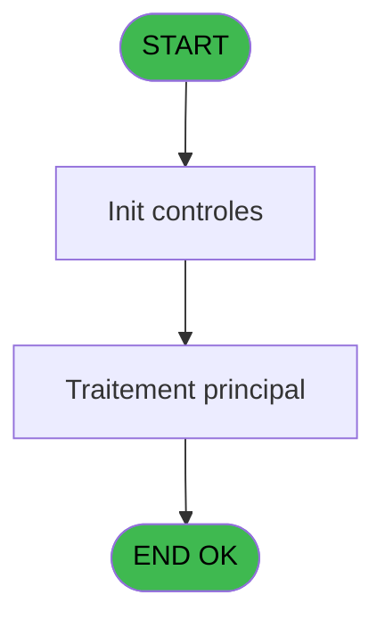
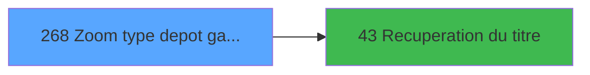

# ADH IDE 268 - Zoom type depot garantie

> **Analyse**: Phases 1-4 2026-02-08 04:51 -> 04:52 (5s) | Assemblage 04:52
> **Pipeline**: V7.2 Enrichi
> **Structure**: 4 onglets (Resume | Ecrans | Donnees | Connexions)

<!-- TAB:Resume -->

## 1. FICHE D'IDENTITE

| Attribut | Valeur |
|----------|--------|
| Projet | ADH |
| IDE Position | 268 |
| Nom Programme | Zoom type depot garantie |
| Fichier source | `Prg_268.xml` |
| Dossier IDE | Garanties |
| Taches | 1 (0 ecrans visibles) |
| Tables modifiees | 0 |
| Programmes appeles | 1 |
| Complexite | **BASSE** (score 5/100) |
| Statut | **ORPHELIN_POTENTIEL** |

## 2. DESCRIPTION FONCTIONNELLE

ADH IDE 268 est un programme de zoom permettant de consulter et gérer la liste des types de dépôts de garantie. Ce programme accède à la table de référence `cafil069_dat` (types_garantie) et affiche les informations structurées pour que l'utilisateur puisse sélectionner un type de dépôt lors de transactions de garantie. Son rôle principal est de fournir une interface de consultation des codes et libellés des garanties disponibles dans le club.

Le programme appelle ADH IDE 43 pour récupérer le titre de la fenêtre, assurant une cohérence de l'interface utilisateur. Il utilise probablement une structure de sélection simple (Browse ou Locate) permettant de naviguer dans les garanties et de retourner la sélection au programme appelant pour validation ou traitement ultérieur.

Ce zoom fait partie de l'écosystème de gestion des cautions du module ADH, aux côtés des programmes d'extraction de garantie (ADH IDE 111) et de gestion des types de dépôts. Son intégration dans les workflows de factures et de versements garantit que seuls les types valides sont utilisés dans les opérations comptables.

## 3. BLOCS FONCTIONNELS

## 5. REGLES METIER

4 regles identifiees:

### Autres (4 regles)

#### [RM-001] Si [P]='$CARD' alors 'O' sinon '')

| Element | Detail |
|---------|--------|
| **Condition** | `[P]='$CARD'` |
| **Si vrai** | 'O' |
| **Si faux** | '') |
| **Expression source** | Expression 8 : `IF ([P]='$CARD','O','')` |
| **Exemple** | Si [P]='$CARD' → 'O'. Sinon → '') |

#### [RM-002] Condition composite: CndRange( (P.i.Select Carte [H]='O' OR P.i.From POS [I]) OR (VG82='TB' AND VG80) ,'$CARD')

| Element | Detail |
|---------|--------|
| **Condition** | `CndRange( (P.i.Select Carte [H]='O' OR P.i.From POS [I]) OR (VG82='TB' AND VG80) ,'$CARD')` |
| **Si vrai** | Action si vrai |
| **Variables** | EU (P.i.Select Carte), EV (P.i.From POS) |
| **Expression source** | Expression 14 : `CndRange( (P.i.Select Carte [H]='O' OR P.i.From POS [I]) OR ` |
| **Exemple** | Si CndRange( (P.i.Select Carte [H]='O' OR P.i.From POS [I]) OR (VG82='TB' AND VG80) ,'$CARD') → Action si vrai |

#### [RM-003] Si P.i.From POS [I] alors 'P.o.mtt-mini-garant [C]'FORM sinon 'P.o. typ-depôt-numeric [B]'FORM)

| Element | Detail |
|---------|--------|
| **Condition** | `P.i.From POS [I]` |
| **Si vrai** | 'P.o.mtt-mini-garant [C]'FORM |
| **Si faux** | 'P.o. typ-depôt-numeric [B]'FORM) |
| **Variables** | EO (P.o. typ-depôt-numeric), EP (P.o.mtt-mini-garant), EV (P.i.From POS) |
| **Expression source** | Expression 16 : `IF(P.i.From POS [I],'P.o.mtt-mini-garant [C]'FORM,'P.o. typ-` |
| **Exemple** | Si P.i.From POS [I] → 'P.o.mtt-mini-garant [C]'FORM. Sinon → 'P.o. typ-depôt-numeric [B]'FORM) |

#### [RM-004] Condition toujours vraie (flag actif)

| Element | Detail |
|---------|--------|
| **Condition** | `P.i.Mode Consultation [J] AND NOT VG3` |
| **Si vrai** | Lien Mop mobilité [O]<>'CASH' |
| **Si faux** | 'TRUE'LOG) |
| **Variables** | EW (P.i.Mode Consultation), FB (Lien Mop mobilité) |
| **Expression source** | Expression 17 : `IF(P.i.Mode Consultation [J] AND NOT VG3,Lien Mop mobilité [` |
| **Exemple** | Si P.i.Mode Consultation [J] AND NOT VG3 → Lien Mop mobilité [O]<>'CASH'. Sinon → 'TRUE'LOG) |

## 6. CONTEXTE

- **Appele par**: (aucun)
- **Appelle**: 1 programmes | **Tables**: 1 (W:0 R:1 L:0) | **Taches**: 1 | **Expressions**: 17

<!-- TAB:Ecrans -->

## 8. ECRANS

*(Programme sans ecran visible)*

## 9. NAVIGATION

### 9.3 Structure hierarchique (0 tache)

| Position | Tache | Type | Dimensions | Bloc |
|----------|-------|------|------------|------|

### 9.4 Algorigramme

> **Legende**: Vert = START/END OK | Rouge = END KO | Bleu = Decisions
> *Algorigramme auto-genere. Utiliser `/algorigramme` pour une synthese metier detaillee.*

<!-- TAB:Donnees -->

## 10. TABLES

### Tables utilisees (1)

| ID | Nom | Description | Type | R | W | L | Usages |
|----|-----|-------------|------|---|---|---|--------|
| 91 | garantie_________gar | Depots et garanties | DB | R |   |   | 1 |

### Colonnes par table (1 / 1 tables avec colonnes identifiees)

Table 91 - garantie_________gar (R) - 1 usages

| Lettre | Variable | Acces | Type |
|--------|----------|-------|------|
| A | P.i.societe | R | Alpha |
| B | P.o. typ-depôt-numeric | R | Numeric |
| C | P.o.mtt-mini-garant | R | Numeric |
| D | P.i.o.carte de credit | R | Alpha |
| E | P.i.o. type depôt | R | Alpha |
| F | P.o. libelle depôt | R | Alpha |
| G | P.o.clic sur quitter | R | Logical |
| H | P.i.Select Carte | R | Alpha |
| I | P.i.From POS | R | Logical |
| J | P.i.Mode Consultation | R | Logical |
| K | P.i.Devise | R | Alpha |
| L | v.titre | R | Alpha |
| M | bouton quitter | R | Alpha |
| N | bouton selectionner | R | Alpha |
| O | Lien Mop mobilité | R | Logical |

## 11. VARIABLES

### 11.1 Parametres entrants (11)

Variables recues en parametre.

| Lettre | Nom | Type | Usage dans |
|--------|-----|------|-----------|
| EN | P.i.societe | Alpha | 1x parametre entrant |
| EO | P.o. typ-depôt-numeric | Numeric | 2x parametre entrant |
| EP | P.o.mtt-mini-garant | Numeric | 1x parametre entrant |
| EQ | P.i.o.carte de credit | Alpha | - |
| ER | P.i.o. type depôt | Alpha | - |
| ES | P.o. libelle depôt | Alpha | - |
| ET | P.o.clic sur quitter | Logical | - |
| EU | P.i.Select Carte | Alpha | 1x parametre entrant |
| EV | P.i.From POS | Logical | 2x parametre entrant |
| EW | P.i.Mode Consultation | Logical | 1x parametre entrant |
| EX | P.i.Devise | Alpha | - |

### 11.2 Variables de session (1)

Variables persistantes pendant toute la session.

| Lettre | Nom | Type | Usage dans |
|--------|-----|------|-----------|
| EY | v.titre | Alpha | 1x session |

### 11.3 Autres (3)

Variables diverses.

| Lettre | Nom | Type | Usage dans |
|--------|-----|------|-----------|
| EZ | bouton quitter | Alpha | - |
| FA | bouton selectionner | Alpha | 1x refs |
| FB | Lien Mop mobilité | Logical | 2x refs |

## 12. EXPRESSIONS

**17 / 17 expressions decodees (100%)**

### 12.1 Repartition par type

| Type | Expressions | Regles |
|------|-------------|--------|
| CONDITION | 3 | 3 |
| CAST_LOGIQUE | 3 | 5 |
| CONSTANTE | 4 | 0 |
| OTHER | 6 | 0 |
| STRING | 1 | 0 |

### 12.2 Expressions cles par type

#### CONDITION (3 expressions)

| Type | IDE | Expression | Regle |
|------|-----|------------|-------|
| CONDITION | 16 | `IF(P.i.From POS [I],'P.o.mtt-mini-garant [C]'FORM,'P.o. typ-depôt-numeric [B]'FORM)` | [RM-003](#rm-RM-003) |
| CONDITION | 14 | `CndRange( (P.i.Select Carte [H]='O' OR P.i.From POS [I]) OR (VG82='TB' AND VG80) ,'$CARD')` | [RM-002](#rm-RM-002) |
| CONDITION | 8 | `IF ([P]='$CARD','O','')` | [RM-001](#rm-RM-001) |

#### CAST_LOGIQUE (3 expressions)

| Type | IDE | Expression | Regle |
|------|-----|------------|-------|
| CAST_LOGIQUE | 17 | `IF(P.i.Mode Consultation [J] AND NOT VG3,Lien Mop mobilité [O]<>'CASH','TRUE'LOG)` | [RM-004](#rm-RM-004) |
| CAST_LOGIQUE | 13 | `'FALSE'LOG` | - |
| CAST_LOGIQUE | 12 | `'TRUE'LOG` | - |

#### CONSTANTE (4 expressions)

| Type | IDE | Expression | Regle |
|------|-----|------------|-------|
| CONSTANTE | 4 | `13` | - |
| CONSTANTE | 15 | `'Guaranty Types'` | - |
| CONSTANTE | 2 | `'&Quitter'` | - |
| CONSTANTE | 3 | `'&Selectionner'` | - |

#### OTHER (6 expressions)

| Type | IDE | Expression | Regle |
|------|-----|------------|-------|
| OTHER | 9 | `bouton selectionner [N]` | - |
| OTHER | 10 | `Lien Mop mobilité [O]` | - |
| OTHER | 11 | `[R]` | - |
| OTHER | 5 | `P.i.societe [A]` | - |
| OTHER | 6 | `P.o. typ-depôt-numeric [B]` | - |
| ... | | *+1 autres* | |

#### STRING (1 expressions)

| Type | IDE | Expression | Regle |
|------|-----|------------|-------|
| STRING | 1 | `Trim (v.titre [L])` | - |

<!-- TAB:Connexions -->

## 13. GRAPHE D'APPELS

### 13.1 Chaine depuis Main (Callers)

**Chemin**: (pas de callers directs)

### 13.2 Callers

| IDE | Nom Programme | Nb Appels |
|-----|---------------|-----------|
| - | (aucun) | - |

### 13.3 Callees (programmes appeles)

### 13.4 Detail Callees avec contexte

| IDE | Nom Programme | Appels | Contexte |
|-----|---------------|--------|----------|
| [43](ADH-IDE-43.md) | Recuperation du titre | 1 | Recuperation donnees |

## 14. RECOMMANDATIONS MIGRATION

### 14.1 Profil du programme

| Metrique | Valeur | Impact migration |
|----------|--------|-----------------|
| Lignes de logique | 34 | Programme compact |
| Expressions | 17 | Peu de logique |
| Tables WRITE | 0 | Impact faible |
| Sous-programmes | 1 | Peu de dependances |
| Ecrans visibles | 0 | Ecran unique ou traitement batch |
| Code desactive | 0% (0 / 34) | Code sain |
| Regles metier | 4 | Quelques regles a preserver |

### 14.2 Plan de migration par bloc

### 14.3 Dependances critiques

| Dependance | Type | Appels | Impact |
|------------|------|--------|--------|
| [Recuperation du titre (IDE 43)](ADH-IDE-43.md) | Sous-programme | 1x | Normale - Recuperation donnees |

---
*Spec DETAILED generee par Pipeline V7.2 - 2026-02-08 04:52*
