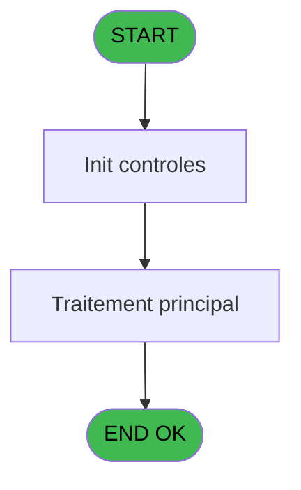
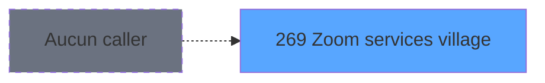
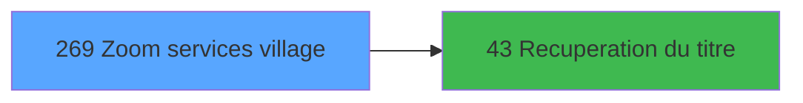

# ADH IDE 269 - Zoom services village

> **Analyse**: Phases 1-4 2026-02-08 04:52 -> 04:52 (4s) | Assemblage 04:52
> **Pipeline**: V7.2 Enrichi
> **Structure**: 4 onglets (Resume | Ecrans | Donnees | Connexions)

<!-- TAB:Resume -->

## 1. FICHE D'IDENTITE

| Attribut | Valeur |
|----------|--------|
| Projet | ADH |
| IDE Position | 269 |
| Nom Programme | Zoom services village |
| Fichier source | `Prg_269.xml` |
| Dossier IDE | Consultation |
| Taches | 1 (0 ecrans visibles) |
| Tables modifiees | 0 |
| Programmes appeles | 1 |
| Complexite | **BASSE** (score 5/100) |
| Statut | **ORPHELIN_POTENTIEL** |

## 2. DESCRIPTION FONCTIONNELLE

# ADH IDE 269 - Zoom services village

Programme de recherche et selection permettant de consulter la liste des services disponibles au village. Il s'agit d'un zoom classique (table de reference) utilise comme aide a la saisie dans d'autres contextes, notamment pour identifier et valider les codes de services.

La logique est simple : affichage en grille des services avec leurs caracteristiques (code, libelle, descriptif), avec possibilite de filtrage et de selection. Une fois le service choisi, son identifiant est retourne au programme appelant pour validation ou saisie.

Ce programme est typiquement appele depuis des ecrans de gestion de caisse ou de ventes pour permettre aux operateurs de selectionner rapidement un service de la base de donnees sans avoir a connattre son code exact.

## 3. BLOCS FONCTIONNELS

## 5. REGLES METIER

*(Aucune regle metier identifiee dans les expressions)*

## 6. CONTEXTE

- **Appele par**: (aucun)
- **Appelle**: 1 programmes | **Tables**: 1 (W:0 R:1 L:0) | **Taches**: 1 | **Expressions**: 11

<!-- TAB:Ecrans -->

## 8. ECRANS

*(Programme sans ecran visible)*

## 9. NAVIGATION

### 9.3 Structure hierarchique (0 tache)

| Position | Tache | Type | Dimensions | Bloc |
|----------|-------|------|------------|------|

### 9.4 Algorigramme

> **Legende**: Vert = START/END OK | Rouge = END KO | Bleu = Decisions
> *Algorigramme auto-genere. Utiliser `/algorigramme` pour une synthese metier detaillee.*

<!-- TAB:Donnees -->

## 10. TABLES

### Tables utilisees (1)

| ID | Nom | Description | Type | R | W | L | Usages |
|----|-----|-------------|------|---|---|---|--------|
| 67 | tables___________tab |  | DB | R |   |   | 1 |

### Colonnes par table (1 / 1 tables avec colonnes identifiees)

Table 67 - tables___________tab (R) - 1 usages

| Lettre | Variable | Acces | Type |
|--------|----------|-------|------|
| A | > service village | R | Alpha |
| B | < code article | R | Numeric |
| C | < libelle article | R | Alpha |
| D | W1 service village | R | Alpha |
| E | v. titre ecran | R | Alpha |
| F | bouton quitter | R | Alpha |
| G | bouton selectionner | R | Alpha |

## 11. VARIABLES

### 11.1 Variables de session (1)

Variables persistantes pendant toute la session.

| Lettre | Nom | Type | Usage dans |
|--------|-----|------|-----------|
| ER | v. titre ecran | Alpha | - |

### 11.2 Autres (6)

Variables diverses.

| Lettre | Nom | Type | Usage dans |
|--------|-----|------|-----------|
| EN | > service village | Alpha | 2x refs |
| EO | < code article | Numeric | - |
| EP | < libelle article | Alpha | - |
| EQ | W1 service village | Alpha | - |
| ES | bouton quitter | Alpha | 1x refs |
| ET | bouton selectionner | Alpha | - |

## 12. EXPRESSIONS

**11 / 11 expressions decodees (100%)**

### 12.1 Repartition par type

| Type | Expressions | Regles |
|------|-------------|--------|
| CONSTANTE | 7 | 0 |
| CONDITION | 2 | 0 |
| OTHER | 1 | 0 |
| STRING | 1 | 0 |

### 12.2 Expressions cles par type

#### CONSTANTE (7 expressions)

| Type | IDE | Expression | Regle |
|------|-----|------------|-------|
| CONSTANTE | 6 | `'O'` | - |
| CONSTANTE | 10 | `0` | - |
| CONSTANTE | 11 | `''` | - |
| CONSTANTE | 5 | `'VSERV'` | - |
| CONSTANTE | 1 | `'&Quitter'` | - |
| ... | | *+2 autres* | |

#### CONDITION (2 expressions)

| Type | IDE | Expression | Regle |
|------|-----|------------|-------|
| CONDITION | 9 | `[H]<>> service village [A]` | - |
| CONDITION | 7 | `> service village [A]` | - |

#### OTHER (1 expressions)

| Type | IDE | Expression | Regle |
|------|-----|------------|-------|
| OTHER | 8 | `bouton quitter [F]` | - |

#### STRING (1 expressions)

| Type | IDE | Expression | Regle |
|------|-----|------------|-------|
| STRING | 3 | `Trim ([I])` | - |

<!-- TAB:Connexions -->

## 13. GRAPHE D'APPELS

### 13.1 Chaine depuis Main (Callers)

**Chemin**: (pas de callers directs)

### 13.2 Callers

| IDE | Nom Programme | Nb Appels |
|-----|---------------|-----------|
| - | (aucun) | - |

### 13.3 Callees (programmes appeles)

### 13.4 Detail Callees avec contexte

| IDE | Nom Programme | Appels | Contexte |
|-----|---------------|--------|----------|
| [43](ADH-IDE-43.md) | Recuperation du titre | 1 | Recuperation donnees |

## 14. RECOMMANDATIONS MIGRATION

### 14.1 Profil du programme

| Metrique | Valeur | Impact migration |
|----------|--------|-----------------|
| Lignes de logique | 24 | Programme compact |
| Expressions | 11 | Peu de logique |
| Tables WRITE | 0 | Impact faible |
| Sous-programmes | 1 | Peu de dependances |
| Ecrans visibles | 0 | Ecran unique ou traitement batch |
| Code desactive | 0% (0 / 24) | Code sain |
| Regles metier | 0 | Pas de regle identifiee |

### 14.2 Plan de migration par bloc

### 14.3 Dependances critiques

| Dependance | Type | Appels | Impact |
|------------|------|--------|--------|
| [Recuperation du titre (IDE 43)](ADH-IDE-43.md) | Sous-programme | 1x | Normale - Recuperation donnees |

---
*Spec DETAILED generee par Pipeline V7.2 - 2026-02-08 04:53*
