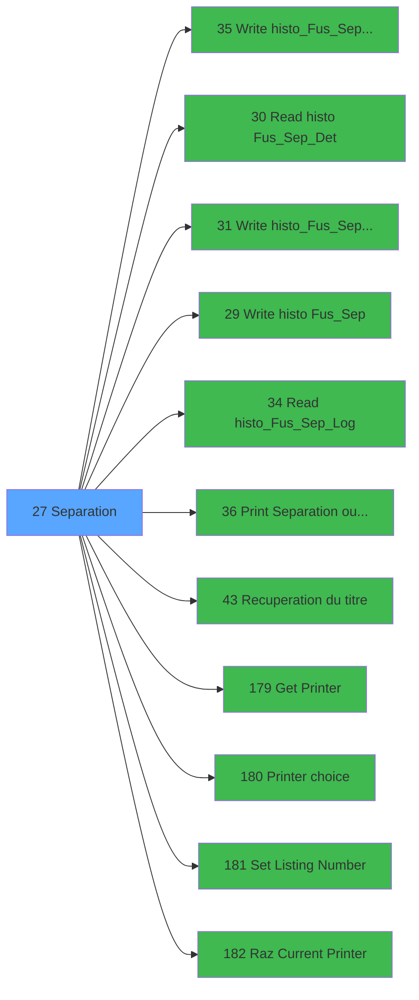

# ADH IDE 27 - Separation

> **Analyse**: Phases 1-4 2026-02-07 03:41 -> 03:41 (28s) | Assemblage 13:03
> **Pipeline**: V7.2 Enrichi
> **Structure**: 4 onglets (Resume | Ecrans | Donnees | Connexions)

<!-- TAB:Resume -->

## 1. FICHE D'IDENTITE

| Attribut | Valeur |
|----------|--------|
| Projet | ADH |
| IDE Position | 27 |
| Nom Programme | Separation |
| Fichier source | `Prg_27.xml` |
| Dossier IDE | General |
| Taches | 183 (10 ecrans visibles) |
| Tables modifiees | 57 |
| Programmes appeles | 11 |
| Complexite | **MOYENNE** (score 65/100) |

## 2. DESCRIPTION FONCTIONNELLE

Ce programme gère la séparation de comptes clients dans le système de gestion hôtelière. Il permet de diviser un compte principal en plusieurs comptes distincts, avec la possibilité d'affecter différents services (hébergement, prestations, ventes) à chacun des nouveaux comptes. Le processus inclut des vérifications de blocage pour éviter les séparations pendant une clôture en cours, et valide que le réseau est disponible avant de procéder.

La séparation s'accompagne d'une traçabilité complète : le programme enregistre les opérations dans les tables d'historique (`histo_fusionseparation`, `histo_fusionseparation_saisie`), met à jour les références de compte dans toutes les tables liées (transactions, ventes, préstations, hébergement), et génère un document imprimé pour validation. Le workflow inclut la sélection du client à séparer, le choix du gestionnaire (GM), et la gestion de l'impression via un système de files d'attente.

En arrière-plan, le programme effectue une cascade de mises à jour sur une cinquantaine de tables pour maintenir la cohérence des données : soldes de comptes, comptabilité, dépôts de garantie, codes de suivi, détails de participations, et options de vente. La sélection du matériel d'impression (imprimante physique, numéro de listing) est paramétrée dynamiquement selon la configuration du terminal.

## 3. BLOCS FONCTIONNELS

### 3.1 Traitement (130 taches)

Traitements internes.

---

#### <a id="t1"></a>T1 - Veuillez patienter... [ECRAN]

**Role** : Tache d'orchestration : point d'entree du programme (130 sous-taches). Coordonne l'enchainement des traitements.
**Ecran** : 422 x 56 DLU (MDI) | [Voir mockup](#ecran-t1)

<details>
<summary>129 sous-taches directes</summary>

| Tache | Nom | Bloc |
|-------|-----|------|
| [T2](#t2) | Test si cloture en cours | Traitement |
| [T3](#t3) | Blocage cloture v1 | Traitement |
| [T4](#t4) | Blocage cloture v1 | Traitement |
| [T5](#t5) | Test reseau | Traitement |
| [T12](#t12) | Veuillez patienter... **[ECRAN]** | Traitement |
| [T15](#t15) | Veuillez patienter... **[ECRAN]** | Traitement |
| [T16](#t16) | supprime non pointes | Traitement |
| [T17](#t17) | Message Depots et garantie **[ECRAN]** | Traitement |
| [T18](#t18) | Traitement fichiers:code+fil **[ECRAN]** | Traitement |
| [T19](#t19) | Veuillez patienter... **[ECRAN]** | Traitement |
| [T21](#t21) | Suppression DGA | Traitement |
| [T22](#t22) | Veuillez patienter... **[ECRAN]** | Traitement |
| [T24](#t24) | Suppression DGA | Traitement |
| [T25](#t25) | Veuillez patienter... **[ECRAN]** | Traitement |
| [T27](#t27) | Suppression DGA | Traitement |
| [T28](#t28) | Veuillez patienter... **[ECRAN]** | Traitement |
| [T30](#t30) | Suppression DGA | Traitement |
| [T31](#t31) | Veuillez patienter... **[ECRAN]** | Traitement |
| [T33](#t33) | Suppression DGA | Traitement |
| [T34](#t34) | Veuillez patienter... **[ECRAN]** | Traitement |
| [T36](#t36) | Suppression DGA | Traitement |
| [T37](#t37) | Veuillez patienter... **[ECRAN]** | Traitement |
| [T39](#t39) | Veuillez patienter... **[ECRAN]** | Traitement |
| [T41](#t41) | Suppression DGA | Traitement |
| [T42](#t42) | Veuillez patienter... **[ECRAN]** | Traitement |
| [T44](#t44) | Suppression DGA | Traitement |
| [T45](#t45) | Veuillez patienter... **[ECRAN]** | Traitement |
| [T46](#t46) | Veuillez patienter... **[ECRAN]** | Traitement |
| [T47](#t47) | Veuillez patienter... **[ECRAN]** | Traitement |
| [T48](#t48) | Veuillez patienter... **[ECRAN]** | Traitement |
| [T50](#t50) | Suppression DGA | Traitement |
| [T51](#t51) | Veuillez patienter... **[ECRAN]** | Traitement |
| [T53](#t53) | Suppression DGA | Traitement |
| [T54](#t54) | Veuillez patienter... **[ECRAN]** | Traitement |
| [T55](#t55) | Lecture CAM | Traitement |
| [T57](#t57) | Veuillez patienter... **[ECRAN]** | Traitement |
| [T59](#t59) | Suppression DGA | Traitement |
| [T60](#t60) | Veuillez patienter... **[ECRAN]** | Traitement |
| [T61](#t61) | Lecture CAM | Traitement |
| [T63](#t63) | Veuillez patienter... **[ECRAN]** | Traitement |
| [T65](#t65) | Suppression DGA | Traitement |
| [T66](#t66) | Veuillez patienter... **[ECRAN]** | Traitement |
| [T67](#t67) | Lecture CAM | Traitement |
| [T69](#t69) | Veuillez patienter... **[ECRAN]** | Traitement |
| [T71](#t71) | Suppression DGA | Traitement |
| [T72](#t72) | Veuillez patienter... **[ECRAN]** | Traitement |
| [T74](#t74) | Suppression DGA | Traitement |
| [T75](#t75) | Veuillez patienter... **[ECRAN]** | Traitement |
| [T76](#t76) | Lecture | Traitement |
| [T78](#t78) | Veuillez patienter... **[ECRAN]** | Traitement |
| [T79](#t79) | Lecture | Traitement |
| [T81](#t81) | Veuillez patienter... **[ECRAN]** | Traitement |
| [T82](#t82) | Veuillez patienter... **[ECRAN]** | Traitement |
| [T83](#t83) | Lecture CAM | Traitement |
| [T85](#t85) | Veuillez patienter... **[ECRAN]** | Traitement |
| [T86](#t86) | Lecture CAM | Traitement |
| [T88](#t88) | Veuillez patienter... **[ECRAN]** | Traitement |
| [T89](#t89) | Lecture CAM | Traitement |
| [T91](#t91) | Veuillez patienter... **[ECRAN]** | Traitement |
| [T93](#t93) | Suppression DGA | Traitement |
| [T94](#t94) | Veuillez patienter... **[ECRAN]** | Traitement |
| [T96](#t96) | Suppression DGA | Traitement |
| [T97](#t97) | Veuillez patienter... **[ECRAN]** | Traitement |
| [T98](#t98) | Message | Traitement |
| [T100](#t100) | Veuillez patienter... **[ECRAN]** | Traitement |
| [T102](#t102) | Suppression DGA | Traitement |
| [T103](#t103) | Veuillez patienter... **[ECRAN]** | Traitement |
| [T105](#t105) | Suppression DGA | Traitement |
| [T106](#t106) | Veuillez patienter... **[ECRAN]** | Traitement |
| [T107](#t107) | Veuillez patienter... **[ECRAN]** | Traitement |
| [T108](#t108) | Veuillez patienter... **[ECRAN]** | Traitement |
| [T110](#t110) | Suppression DGA | Traitement |
| [T111](#t111) | Veuillez patienter... **[ECRAN]** | Traitement |
| [T113](#t113) | Suppression DGA | Traitement |
| [T114](#t114) | Suppression DGA | Traitement |
| [T115](#t115) | Veuillez patienter... **[ECRAN]** | Traitement |
| [T117](#t117) | Suppression DGA | Traitement |
| [T118](#t118) | Veuillez patienter... **[ECRAN]** | Traitement |
| [T120](#t120) | Suppression DGA | Traitement |
| [T121](#t121) | Veuillez patienter... **[ECRAN]** | Traitement |
| [T123](#t123) | Suppression DGA | Traitement |
| [T124](#t124) | Veuillez patienter... **[ECRAN]** | Traitement |
| [T126](#t126) | Suppression DGA | Traitement |
| [T127](#t127) | Veuillez patienter... **[ECRAN]** | Traitement |
| [T129](#t129) | Suppression DGA | Traitement |
| [T130](#t130) | Veuillez patienter... **[ECRAN]** | Traitement |
| [T132](#t132) | Suppression DGA | Traitement |
| [T133](#t133) | Veuillez patienter... **[ECRAN]** | Traitement |
| [T135](#t135) | Suppression DGA | Traitement |
| [T136](#t136) | Veuillez patienter... **[ECRAN]** | Traitement |
| [T138](#t138) | Suppression DGA | Traitement |
| [T139](#t139) | Veuillez patienter... **[ECRAN]** | Traitement |
| [T141](#t141) | Suppression DGA | Traitement |
| [T142](#t142) | Veuillez patienter... **[ECRAN]** | Traitement |
| [T144](#t144) | Suppression DGA | Traitement |
| [T145](#t145) | Veuillez patienter... **[ECRAN]** | Traitement |
| [T147](#t147) | Suppression DGA | Traitement |
| [T148](#t148) | Veuillez patienter... **[ECRAN]** | Traitement |
| [T149](#t149) | Veuillez patienter... **[ECRAN]** | Traitement |
| [T150](#t150) | Veuillez patienter... **[ECRAN]** | Traitement |
| [T153](#t153) | Veuillez patienter... **[ECRAN]** | Traitement |
| [T154](#t154) | Cumul | Traitement |
| [T155](#t155) | Sejour | Traitement |
| [T156](#t156) | Garantie | Traitement |
| [T158](#t158) | Veuillez patienter... **[ECRAN]** | Traitement |
| [T159](#t159) | Cumul | Traitement |
| [T160](#t160) | Date de sejour | Traitement |
| [T161](#t161) | Garantie | Traitement |
| [T162](#t162) | Traitement n CGM nouveau **[ECRAN]** | Traitement |
| [T163](#t163) | Veuillez patienter... **[ECRAN]** | Traitement |
| [T164](#t164) | Cumul | Traitement |
| [T165](#t165) | Date de sejour | Traitement |
| [T166](#t166) | Garantie | Traitement |
| [T167](#t167) | Veuillez patienter... **[ECRAN]** | Traitement |
| [T169](#t169) | Deblocage cloture v1 | Traitement |
| [T170](#t170) | Deblocage cloture v1 | Traitement |
| [T171](#t171) | Existe ecritures | Traitement |
| [T172](#t172) | Lecture histo | Traitement |
| [T173](#t173) | Chrono LOG reprise | Traitement |
| [T176](#t176) | Veuillez patienter SVP ... **[ECRAN]** | Traitement |
| [T177](#t177) | Reprise virtuelles | Traitement |
| [T180](#t180) | Veuillez patienter... **[ECRAN]** | Traitement |
| [T183](#t183) | Veuillez patienter... **[ECRAN]** | Traitement |
| [T193](#t193) | Veuillez patienter... **[ECRAN]** | Traitement |
| [T196](#t196) | Veuillez patienter... **[ECRAN]** | Traitement |
| [T197](#t197) | Veuillez patienter... **[ECRAN]** | Traitement |
| [T198](#t198) | (sans nom) | Traitement |
| [T202](#t202) | Veuillez patienter... **[ECRAN]** | Traitement |
| [T204](#t204) | Suppression DGA | Traitement |

</details>

---

#### <a id="t2"></a>T2 - Test si cloture en cours

**Role** : Verification : Test si cloture en cours.

---

#### <a id="t3"></a>T3 - Blocage cloture v1

**Role** : Traitement : Blocage cloture v1.

---

#### <a id="t4"></a>T4 - Blocage cloture v1

**Role** : Traitement : Blocage cloture v1.

---

#### <a id="t5"></a>T5 - Test reseau

**Role** : Verification : Test reseau.
**Variables liees** : O (W0 reseau)

---

#### <a id="t12"></a>T12 - Veuillez patienter... [ECRAN]

**Role** : Traitement : Veuillez patienter....
**Ecran** : 422 x 57 DLU (MDI) | [Voir mockup](#ecran-t12)

---

#### <a id="t15"></a>T15 - Veuillez patienter... [ECRAN]

**Role** : Traitement : Veuillez patienter....
**Ecran** : 422 x 57 DLU (MDI) | [Voir mockup](#ecran-t15)

---

#### <a id="t16"></a>T16 - supprime non pointes

**Role** : Traitement : supprime non pointes.

---

#### <a id="t17"></a>T17 - Message Depots et garantie [ECRAN]

**Role** : Traitement : Message Depots et garantie.
**Ecran** : 477 x 63 DLU (MDI) | [Voir mockup](#ecran-t17)
**Variables liees** : E (P0 garantie), BI (W0.ListeNom_Prenom_Garantie)

---

#### <a id="t18"></a>T18 - Traitement fichiers:code+fil [ECRAN]

**Role** : Traitement : Traitement fichiers:code+fil.
**Ecran** : 308 x 56 DLU (MDI) | [Voir mockup](#ecran-t18)

---

#### <a id="t19"></a>T19 - Veuillez patienter... [ECRAN]

**Role** : Traitement : Veuillez patienter....
**Ecran** : 424 x 56 DLU (MDI) | [Voir mockup](#ecran-t19)

---

#### <a id="t21"></a>T21 - Suppression DGA

**Role** : Traitement : Suppression DGA.

---

#### <a id="t22"></a>T22 - Veuillez patienter... [ECRAN]

**Role** : Traitement : Veuillez patienter....
**Ecran** : 422 x 57 DLU (MDI) | [Voir mockup](#ecran-t22)

---

#### <a id="t24"></a>T24 - Suppression DGA

**Role** : Traitement : Suppression DGA.

---

#### <a id="t25"></a>T25 - Veuillez patienter... [ECRAN]

**Role** : Traitement : Veuillez patienter....
**Ecran** : 422 x 57 DLU (MDI) | [Voir mockup](#ecran-t25)

---

#### <a id="t27"></a>T27 - Suppression DGA

**Role** : Traitement : Suppression DGA.

---

#### <a id="t28"></a>T28 - Veuillez patienter... [ECRAN]

**Role** : Traitement : Veuillez patienter....
**Ecran** : 422 x 57 DLU (MDI) | [Voir mockup](#ecran-t28)

---

#### <a id="t30"></a>T30 - Suppression DGA

**Role** : Traitement : Suppression DGA.

---

#### <a id="t31"></a>T31 - Veuillez patienter... [ECRAN]

**Role** : Traitement : Veuillez patienter....
**Ecran** : 422 x 57 DLU (MDI) | [Voir mockup](#ecran-t31)

---

#### <a id="t33"></a>T33 - Suppression DGA

**Role** : Traitement : Suppression DGA.

---

#### <a id="t34"></a>T34 - Veuillez patienter... [ECRAN]

**Role** : Traitement : Veuillez patienter....
**Ecran** : 422 x 57 DLU (MDI) | [Voir mockup](#ecran-t34)

---

#### <a id="t36"></a>T36 - Suppression DGA

**Role** : Traitement : Suppression DGA.

---

#### <a id="t37"></a>T37 - Veuillez patienter... [ECRAN]

**Role** : Traitement : Veuillez patienter....
**Ecran** : 424 x 56 DLU (MDI) | [Voir mockup](#ecran-t37)

---

#### <a id="t39"></a>T39 - Veuillez patienter... [ECRAN]

**Role** : Traitement : Veuillez patienter....
**Ecran** : 424 x 57 DLU (MDI) | [Voir mockup](#ecran-t39)

---

#### <a id="t41"></a>T41 - Suppression DGA

**Role** : Traitement : Suppression DGA.

---

#### <a id="t42"></a>T42 - Veuillez patienter... [ECRAN]

**Role** : Traitement : Veuillez patienter....
**Ecran** : 424 x 57 DLU (MDI) | [Voir mockup](#ecran-t42)

---

#### <a id="t44"></a>T44 - Suppression DGA

**Role** : Traitement : Suppression DGA.

---

#### <a id="t45"></a>T45 - Veuillez patienter... [ECRAN]

**Role** : Traitement : Veuillez patienter....
**Ecran** : 424 x 57 DLU (MDI) | [Voir mockup](#ecran-t45)

---

#### <a id="t46"></a>T46 - Veuillez patienter... [ECRAN]

**Role** : Traitement : Veuillez patienter....
**Ecran** : 424 x 57 DLU (MDI) | [Voir mockup](#ecran-t46)

---

#### <a id="t47"></a>T47 - Veuillez patienter... [ECRAN]

**Role** : Traitement : Veuillez patienter....
**Ecran** : 424 x 57 DLU (MDI) | [Voir mockup](#ecran-t47)

---

#### <a id="t48"></a>T48 - Veuillez patienter... [ECRAN]

**Role** : Traitement : Veuillez patienter....
**Ecran** : 422 x 56 DLU (MDI) | [Voir mockup](#ecran-t48)

---

#### <a id="t50"></a>T50 - Suppression DGA

**Role** : Traitement : Suppression DGA.

---

#### <a id="t51"></a>T51 - Veuillez patienter... [ECRAN]

**Role** : Traitement : Veuillez patienter....
**Ecran** : 424 x 57 DLU (MDI) | [Voir mockup](#ecran-t51)

---

#### <a id="t53"></a>T53 - Suppression DGA

**Role** : Traitement : Suppression DGA.

---

#### <a id="t54"></a>T54 - Veuillez patienter... [ECRAN]

**Role** : Traitement : Veuillez patienter....
**Ecran** : 422 x 56 DLU (MDI) | [Voir mockup](#ecran-t54)

---

#### <a id="t55"></a>T55 - Lecture CAM

**Role** : Traitement : Lecture CAM.

---

#### <a id="t57"></a>T57 - Veuillez patienter... [ECRAN]

**Role** : Traitement : Veuillez patienter....
**Ecran** : 422 x 56 DLU (MDI) | [Voir mockup](#ecran-t57)

---

#### <a id="t59"></a>T59 - Suppression DGA

**Role** : Traitement : Suppression DGA.

---

#### <a id="t60"></a>T60 - Veuillez patienter... [ECRAN]

**Role** : Traitement : Veuillez patienter....
**Ecran** : 422 x 58 DLU (MDI) | [Voir mockup](#ecran-t60)

---

#### <a id="t61"></a>T61 - Lecture CAM

**Role** : Traitement : Lecture CAM.

---

#### <a id="t63"></a>T63 - Veuillez patienter... [ECRAN]

**Role** : Traitement : Veuillez patienter....
**Ecran** : 422 x 57 DLU (MDI) | [Voir mockup](#ecran-t63)

---

#### <a id="t65"></a>T65 - Suppression DGA

**Role** : Traitement : Suppression DGA.

---

#### <a id="t66"></a>T66 - Veuillez patienter... [ECRAN]

**Role** : Traitement : Veuillez patienter....
**Ecran** : 422 x 56 DLU (MDI) | [Voir mockup](#ecran-t66)

---

#### <a id="t67"></a>T67 - Lecture CAM

**Role** : Traitement : Lecture CAM.

---

#### <a id="t69"></a>T69 - Veuillez patienter... [ECRAN]

**Role** : Traitement : Veuillez patienter....
**Ecran** : 424 x 56 DLU (MDI) | [Voir mockup](#ecran-t69)

---

#### <a id="t71"></a>T71 - Suppression DGA

**Role** : Traitement : Suppression DGA.

---

#### <a id="t72"></a>T72 - Veuillez patienter... [ECRAN]

**Role** : Traitement : Veuillez patienter....
**Ecran** : 422 x 56 DLU (MDI) | [Voir mockup](#ecran-t72)

---

#### <a id="t74"></a>T74 - Suppression DGA

**Role** : Traitement : Suppression DGA.

---

#### <a id="t75"></a>T75 - Veuillez patienter... [ECRAN]

**Role** : Traitement : Veuillez patienter....
**Ecran** : 422 x 56 DLU (MDI) | [Voir mockup](#ecran-t75)

---

#### <a id="t76"></a>T76 - Lecture

**Role** : Traitement : Lecture.

---

#### <a id="t78"></a>T78 - Veuillez patienter... [ECRAN]

**Role** : Traitement : Veuillez patienter....
**Ecran** : 422 x 56 DLU (MDI) | [Voir mockup](#ecran-t78)

---

#### <a id="t79"></a>T79 - Lecture

**Role** : Traitement : Lecture.

---

#### <a id="t81"></a>T81 - Veuillez patienter... [ECRAN]

**Role** : Traitement : Veuillez patienter....
**Ecran** : 422 x 57 DLU (MDI) | [Voir mockup](#ecran-t81)

---

#### <a id="t82"></a>T82 - Veuillez patienter... [ECRAN]

**Role** : Traitement : Veuillez patienter....
**Ecran** : 422 x 56 DLU (MDI) | [Voir mockup](#ecran-t82)

---

#### <a id="t83"></a>T83 - Lecture CAM

**Role** : Traitement : Lecture CAM.

---

#### <a id="t85"></a>T85 - Veuillez patienter... [ECRAN]

**Role** : Traitement : Veuillez patienter....
**Ecran** : 422 x 56 DLU (MDI) | [Voir mockup](#ecran-t85)

---

#### <a id="t86"></a>T86 - Lecture CAM

**Role** : Traitement : Lecture CAM.

---

#### <a id="t88"></a>T88 - Veuillez patienter... [ECRAN]

**Role** : Traitement : Veuillez patienter....
**Ecran** : 422 x 56 DLU (MDI) | [Voir mockup](#ecran-t88)

---

#### <a id="t89"></a>T89 - Lecture CAM

**Role** : Traitement : Lecture CAM.

---

#### <a id="t91"></a>T91 - Veuillez patienter... [ECRAN]

**Role** : Traitement : Veuillez patienter....
**Ecran** : 422 x 57 DLU (MDI) | [Voir mockup](#ecran-t91)

---

#### <a id="t93"></a>T93 - Suppression DGA

**Role** : Traitement : Suppression DGA.

---

#### <a id="t94"></a>T94 - Veuillez patienter... [ECRAN]

**Role** : Traitement : Veuillez patienter....
**Ecran** : 422 x 56 DLU (MDI) | [Voir mockup](#ecran-t94)

---

#### <a id="t96"></a>T96 - Suppression DGA

**Role** : Traitement : Suppression DGA.

---

#### <a id="t97"></a>T97 - Veuillez patienter... [ECRAN]

**Role** : Traitement : Veuillez patienter....
**Ecran** : 424 x 57 DLU (MDI) | [Voir mockup](#ecran-t97)

---

#### <a id="t98"></a>T98 - Message

**Role** : Traitement : Message.

---

#### <a id="t100"></a>T100 - Veuillez patienter... [ECRAN]

**Role** : Traitement : Veuillez patienter....
**Ecran** : 422 x 56 DLU (MDI) | [Voir mockup](#ecran-t100)

---

#### <a id="t102"></a>T102 - Suppression DGA

**Role** : Traitement : Suppression DGA.

---

#### <a id="t103"></a>T103 - Veuillez patienter... [ECRAN]

**Role** : Traitement : Veuillez patienter....
**Ecran** : 422 x 56 DLU (MDI) | [Voir mockup](#ecran-t103)

---

#### <a id="t105"></a>T105 - Suppression DGA

**Role** : Traitement : Suppression DGA.

---

#### <a id="t106"></a>T106 - Veuillez patienter... [ECRAN]

**Role** : Traitement : Veuillez patienter....
**Ecran** : 422 x 56 DLU (MDI) | [Voir mockup](#ecran-t106)

---

#### <a id="t107"></a>T107 - Veuillez patienter... [ECRAN]

**Role** : Traitement : Veuillez patienter....
**Ecran** : 424 x 56 DLU (MDI) | [Voir mockup](#ecran-t107)

---

#### <a id="t108"></a>T108 - Veuillez patienter... [ECRAN]

**Role** : Traitement : Veuillez patienter....
**Ecran** : 424 x 56 DLU (MDI) | [Voir mockup](#ecran-t108)

---

#### <a id="t110"></a>T110 - Suppression DGA

**Role** : Traitement : Suppression DGA.

---

#### <a id="t111"></a>T111 - Veuillez patienter... [ECRAN]

**Role** : Traitement : Veuillez patienter....
**Ecran** : 424 x 56 DLU (MDI) | [Voir mockup](#ecran-t111)

---

#### <a id="t113"></a>T113 - Suppression DGA

**Role** : Traitement : Suppression DGA.

---

#### <a id="t114"></a>T114 - Suppression DGA

**Role** : Traitement : Suppression DGA.

---

#### <a id="t115"></a>T115 - Veuillez patienter... [ECRAN]

**Role** : Traitement : Veuillez patienter....
**Ecran** : 424 x 56 DLU (MDI) | [Voir mockup](#ecran-t115)

---

#### <a id="t117"></a>T117 - Suppression DGA

**Role** : Traitement : Suppression DGA.

---

#### <a id="t118"></a>T118 - Veuillez patienter... [ECRAN]

**Role** : Traitement : Veuillez patienter....
**Ecran** : 424 x 56 DLU (MDI) | [Voir mockup](#ecran-t118)

---

#### <a id="t120"></a>T120 - Suppression DGA

**Role** : Traitement : Suppression DGA.

---

#### <a id="t121"></a>T121 - Veuillez patienter... [ECRAN]

**Role** : Traitement : Veuillez patienter....
**Ecran** : 424 x 56 DLU (MDI) | [Voir mockup](#ecran-t121)

---

#### <a id="t123"></a>T123 - Suppression DGA

**Role** : Traitement : Suppression DGA.

---

#### <a id="t124"></a>T124 - Veuillez patienter... [ECRAN]

**Role** : Traitement : Veuillez patienter....
**Ecran** : 424 x 56 DLU (MDI) | [Voir mockup](#ecran-t124)

---

#### <a id="t126"></a>T126 - Suppression DGA

**Role** : Traitement : Suppression DGA.

---

#### <a id="t127"></a>T127 - Veuillez patienter... [ECRAN]

**Role** : Traitement : Veuillez patienter....
**Ecran** : 424 x 56 DLU (MDI) | [Voir mockup](#ecran-t127)

---

#### <a id="t129"></a>T129 - Suppression DGA

**Role** : Traitement : Suppression DGA.

---

#### <a id="t130"></a>T130 - Veuillez patienter... [ECRAN]

**Role** : Traitement : Veuillez patienter....
**Ecran** : 424 x 56 DLU (MDI) | [Voir mockup](#ecran-t130)

---

#### <a id="t132"></a>T132 - Suppression DGA

**Role** : Traitement : Suppression DGA.

---

#### <a id="t133"></a>T133 - Veuillez patienter... [ECRAN]

**Role** : Traitement : Veuillez patienter....
**Ecran** : 424 x 56 DLU (MDI) | [Voir mockup](#ecran-t133)

---

#### <a id="t135"></a>T135 - Suppression DGA

**Role** : Traitement : Suppression DGA.

---

#### <a id="t136"></a>T136 - Veuillez patienter... [ECRAN]

**Role** : Traitement : Veuillez patienter....
**Ecran** : 424 x 56 DLU (MDI) | [Voir mockup](#ecran-t136)

---

#### <a id="t138"></a>T138 - Suppression DGA

**Role** : Traitement : Suppression DGA.

---

#### <a id="t139"></a>T139 - Veuillez patienter... [ECRAN]

**Role** : Traitement : Veuillez patienter....
**Ecran** : 424 x 56 DLU (MDI) | [Voir mockup](#ecran-t139)

---

#### <a id="t141"></a>T141 - Suppression DGA

**Role** : Traitement : Suppression DGA.

---

#### <a id="t142"></a>T142 - Veuillez patienter... [ECRAN]

**Role** : Traitement : Veuillez patienter....
**Ecran** : 424 x 56 DLU (MDI) | [Voir mockup](#ecran-t142)

---

#### <a id="t144"></a>T144 - Suppression DGA

**Role** : Traitement : Suppression DGA.

---

#### <a id="t145"></a>T145 - Veuillez patienter... [ECRAN]

**Role** : Traitement : Veuillez patienter....
**Ecran** : 424 x 56 DLU (MDI) | [Voir mockup](#ecran-t145)

---

#### <a id="t147"></a>T147 - Suppression DGA

**Role** : Traitement : Suppression DGA.

---

#### <a id="t148"></a>T148 - Veuillez patienter... [ECRAN]

**Role** : Traitement : Veuillez patienter....
**Ecran** : 424 x 56 DLU (MDI) | [Voir mockup](#ecran-t148)

---

#### <a id="t149"></a>T149 - Veuillez patienter... [ECRAN]

**Role** : Traitement : Veuillez patienter....
**Ecran** : 422 x 57 DLU (MDI) | [Voir mockup](#ecran-t149)

---

#### <a id="t150"></a>T150 - Veuillez patienter... [ECRAN]

**Role** : Traitement : Veuillez patienter....
**Ecran** : 422 x 57 DLU (MDI) | [Voir mockup](#ecran-t150)

---

#### <a id="t153"></a>T153 - Veuillez patienter... [ECRAN]

**Role** : Traitement : Veuillez patienter....
**Ecran** : 422 x 56 DLU (MDI) | [Voir mockup](#ecran-t153)

---

#### <a id="t154"></a>T154 - Cumul

**Role** : Traitement : Cumul.

---

#### <a id="t155"></a>T155 - Sejour

**Role** : Traitement : Sejour.

---

#### <a id="t156"></a>T156 - Garantie

**Role** : Traitement : Garantie.
**Variables liees** : E (P0 garantie), BI (W0.ListeNom_Prenom_Garantie)

---

#### <a id="t158"></a>T158 - Veuillez patienter... [ECRAN]

**Role** : Traitement : Veuillez patienter....
**Ecran** : 424 x 56 DLU (MDI) | [Voir mockup](#ecran-t158)

---

#### <a id="t159"></a>T159 - Cumul

**Role** : Traitement : Cumul.

---

#### <a id="t160"></a>T160 - Date de sejour

**Role** : Traitement : Date de sejour.
**Variables liees** : G (P0 date limite solde), S (W0 date operation)

---

#### <a id="t161"></a>T161 - Garantie

**Role** : Traitement : Garantie.
**Variables liees** : E (P0 garantie), BI (W0.ListeNom_Prenom_Garantie)

---

#### <a id="t162"></a>T162 - Traitement n CGM nouveau [ECRAN]

**Role** : Creation d'enregistrement : Traitement n CGM nouveau.
**Ecran** : 424 x 56 DLU (MDI) | [Voir mockup](#ecran-t162)

---

#### <a id="t163"></a>T163 - Veuillez patienter... [ECRAN]

**Role** : Traitement : Veuillez patienter....
**Ecran** : 424 x 56 DLU (MDI) | [Voir mockup](#ecran-t163)

---

#### <a id="t164"></a>T164 - Cumul

**Role** : Traitement : Cumul.

---

#### <a id="t165"></a>T165 - Date de sejour

**Role** : Traitement : Date de sejour.
**Variables liees** : G (P0 date limite solde), S (W0 date operation)

---

#### <a id="t166"></a>T166 - Garantie

**Role** : Traitement : Garantie.
**Variables liees** : E (P0 garantie), BI (W0.ListeNom_Prenom_Garantie)

---

#### <a id="t167"></a>T167 - Veuillez patienter... [ECRAN]

**Role** : Traitement : Veuillez patienter....
**Ecran** : 422 x 57 DLU (MDI) | [Voir mockup](#ecran-t167)

---

#### <a id="t169"></a>T169 - Deblocage cloture v1

**Role** : Traitement : Deblocage cloture v1.

---

#### <a id="t170"></a>T170 - Deblocage cloture v1

**Role** : Traitement : Deblocage cloture v1.

---

#### <a id="t171"></a>T171 - Existe ecritures

**Role** : Traitement : Existe ecritures.
**Variables liees** : Y (W0 Existe ecriture), BF (W0 code LOG existe)

---

#### <a id="t172"></a>T172 - Lecture histo

**Role** : Traitement : Lecture histo.
**Variables liees** : L (P0.Chrono histo sans interface), BE (W0 chrono histo)

---

#### <a id="t173"></a>T173 - Chrono LOG reprise

**Role** : Traitement : Chrono LOG reprise.
**Variables liees** : J (P0 Reprise Auto), L (P0.Chrono histo sans interface), BA (W0 reprise), BB (W0 chrono reprise), BE (W0 chrono histo)

---

#### <a id="t176"></a>T176 - Veuillez patienter SVP ... [ECRAN]

**Role** : Traitement : Veuillez patienter SVP ....
**Ecran** : 422 x 56 DLU (MDI) | [Voir mockup](#ecran-t176)

---

#### <a id="t177"></a>T177 - Reprise virtuelles

**Role** : Traitement : Reprise virtuelles.
**Variables liees** : J (P0 Reprise Auto), BA (W0 reprise), BB (W0 chrono reprise), BH (W0 reprise confirmee)

---

#### <a id="t180"></a>T180 - Veuillez patienter... [ECRAN]

**Role** : Traitement : Veuillez patienter....
**Ecran** : 422 x 57 DLU (MDI) | [Voir mockup](#ecran-t180)

---

#### <a id="t183"></a>T183 - Veuillez patienter... [ECRAN]

**Role** : Traitement : Veuillez patienter....
**Ecran** : 422 x 57 DLU (MDI) | [Voir mockup](#ecran-t183)

---

#### <a id="t193"></a>T193 - Veuillez patienter... [ECRAN]

**Role** : Traitement : Veuillez patienter....
**Ecran** : 424 x 57 DLU (MDI) | [Voir mockup](#ecran-t193)

---

#### <a id="t196"></a>T196 - Veuillez patienter... [ECRAN]

**Role** : Traitement : Veuillez patienter....
**Ecran** : 424 x 56 DLU (MDI) | [Voir mockup](#ecran-t196)

---

#### <a id="t197"></a>T197 - Veuillez patienter... [ECRAN]

**Role** : Traitement : Veuillez patienter....
**Ecran** : 424 x 57 DLU (MDI) | [Voir mockup](#ecran-t197)

---

#### <a id="t198"></a>T198 - (sans nom)

**Role** : Traitement interne.

---

#### <a id="t202"></a>T202 - Veuillez patienter... [ECRAN]

**Role** : Traitement : Veuillez patienter....
**Ecran** : 424 x 56 DLU (MDI) | [Voir mockup](#ecran-t202)

---

#### <a id="t204"></a>T204 - Suppression DGA

**Role** : Traitement : Suppression DGA.


### 3.2 Consultation (3 taches)

Ecrans de recherche et consultation.

---

#### <a id="t6"></a>T6 - Selection GM [ECRAN]

**Role** : Selection par l'operateur : Selection GM.
**Ecran** : 1035 x 272 DLU (MDI) | [Voir mockup](#ecran-t6)

---

#### <a id="t8"></a>T8 - Affichage filiations [ECRAN]

**Role** : Reinitialisation : Affichage filiations.
**Ecran** : 1035 x 272 DLU (MDI) | [Voir mockup](#ecran-t8)

---

#### <a id="t168"></a>T168 - Reaffichage infos reseau

**Role** : Reinitialisation : Reaffichage infos reseau.
**Variables liees** : O (W0 reseau)


### 3.3 Creation (44 taches)

Insertion de nouveaux enregistrements en base.

---

#### <a id="t7"></a>T7 - Creation histo

**Role** : Creation d'enregistrement : Creation histo.
**Variables liees** : L (P0.Chrono histo sans interface), BE (W0 chrono histo)

---

#### <a id="t20"></a>T20 - Creation DGA

**Role** : Creation d'enregistrement : Creation DGA.

---

#### <a id="t23"></a>T23 - Creation DGA

**Role** : Creation d'enregistrement : Creation DGA.

---

#### <a id="t26"></a>T26 - Creation DGA

**Role** : Creation d'enregistrement : Creation DGA.

---

#### <a id="t29"></a>T29 - Creation DGA

**Role** : Creation d'enregistrement : Creation DGA.

---

#### <a id="t32"></a>T32 - Creation DGA

**Role** : Creation d'enregistrement : Creation DGA.

---

#### <a id="t35"></a>T35 - Creation DGA

**Role** : Creation d'enregistrement : Creation DGA.

---

#### <a id="t40"></a>T40 - Creation DGA

**Role** : Creation d'enregistrement : Creation DGA.

---

#### <a id="t43"></a>T43 - Creation DGA

**Role** : Creation d'enregistrement : Creation DGA.

---

#### <a id="t49"></a>T49 - Creation DGA

**Role** : Creation d'enregistrement : Creation DGA.

---

#### <a id="t52"></a>T52 - Creation DGA

**Role** : Creation d'enregistrement : Creation DGA.

---

#### <a id="t56"></a>T56 - Creation DGA

**Role** : Creation d'enregistrement : Creation DGA.

---

#### <a id="t58"></a>T58 - Creation DGA

**Role** : Creation d'enregistrement : Creation DGA.

---

#### <a id="t62"></a>T62 - Creation DGA

**Role** : Creation d'enregistrement : Creation DGA.

---

#### <a id="t64"></a>T64 - Creation DGA

**Role** : Creation d'enregistrement : Creation DGA.

---

#### <a id="t68"></a>T68 - Creation DGA

**Role** : Creation d'enregistrement : Creation DGA.

---

#### <a id="t70"></a>T70 - Creation DGA

**Role** : Creation d'enregistrement : Creation DGA.

---

#### <a id="t73"></a>T73 - Creation DGA

**Role** : Creation d'enregistrement : Creation DGA.

---

#### <a id="t77"></a>T77 - Creation DGA

**Role** : Creation d'enregistrement : Creation DGA.

---

#### <a id="t80"></a>T80 - Creation DGA

**Role** : Creation d'enregistrement : Creation DGA.

---

#### <a id="t84"></a>T84 - Creation DGA

**Role** : Creation d'enregistrement : Creation DGA.

---

#### <a id="t87"></a>T87 - Creation DGA

**Role** : Creation d'enregistrement : Creation DGA.

---

#### <a id="t90"></a>T90 - Creation DGA

**Role** : Creation d'enregistrement : Creation DGA.

---

#### <a id="t92"></a>T92 - Creation DGA

**Role** : Creation d'enregistrement : Creation DGA.

---

#### <a id="t95"></a>T95 - Creation DGA

**Role** : Creation d'enregistrement : Creation DGA.

---

#### <a id="t99"></a>T99 - Creation DGA

**Role** : Creation d'enregistrement : Creation DGA.

---

#### <a id="t101"></a>T101 - Creation DGA

**Role** : Creation d'enregistrement : Creation DGA.

---

#### <a id="t104"></a>T104 - Creation DGA

**Role** : Creation d'enregistrement : Creation DGA.

---

#### <a id="t109"></a>T109 - Creation DGA

**Role** : Creation d'enregistrement : Creation DGA.

---

#### <a id="t112"></a>T112 - Creation DGA

**Role** : Creation d'enregistrement : Creation DGA.

---

#### <a id="t116"></a>T116 - Creation DGA

**Role** : Creation d'enregistrement : Creation DGA.

---

#### <a id="t119"></a>T119 - Creation DGA

**Role** : Creation d'enregistrement : Creation DGA.

---

#### <a id="t122"></a>T122 - Creation DGA

**Role** : Creation d'enregistrement : Creation DGA.

---

#### <a id="t125"></a>T125 - Creation DGA

**Role** : Creation d'enregistrement : Creation DGA.

---

#### <a id="t128"></a>T128 - Creation DGA

**Role** : Creation d'enregistrement : Creation DGA.

---

#### <a id="t131"></a>T131 - Creation DGA

**Role** : Creation d'enregistrement : Creation DGA.

---

#### <a id="t134"></a>T134 - Creation DGA

**Role** : Creation d'enregistrement : Creation DGA.

---

#### <a id="t137"></a>T137 - Creation DGA

**Role** : Creation d'enregistrement : Creation DGA.

---

#### <a id="t140"></a>T140 - Creation DGA

**Role** : Creation d'enregistrement : Creation DGA.

---

#### <a id="t143"></a>T143 - Creation DGA

**Role** : Creation d'enregistrement : Creation DGA.

---

#### <a id="t146"></a>T146 - Creation DGA

**Role** : Creation d'enregistrement : Creation DGA.

---

#### <a id="t174"></a>T174 - creation histo v1

**Role** : Creation d'enregistrement : creation histo v1.
**Variables liees** : L (P0.Chrono histo sans interface), BE (W0 chrono histo)

---

#### <a id="t175"></a>T175 - creation histo v1

**Role** : Creation d'enregistrement : creation histo v1.
**Variables liees** : L (P0.Chrono histo sans interface), BE (W0 chrono histo)

---

#### <a id="t203"></a>T203 - Creation DGA

**Role** : Creation d'enregistrement : Creation DGA.


### 3.4 Calcul (5 taches)

Calculs metier : montants, stocks, compteurs.

---

#### <a id="t9"></a>T9 - compteur

**Role** : Calcul : compteur.
**Variables liees** : Q (W0 n° compteur)

---

#### <a id="t11"></a>T11 - Nouveaux comptes

**Role** : Creation d'enregistrement : Nouveaux comptes.

---

#### <a id="t13"></a>T13 - UN compte

**Role** : Traitement : UN compte.
**Variables liees** : Q (W0 n° compteur), V (W0 qualite compte), X (W0 separation n compte unique)

---

#### <a id="t14"></a>T14 - N comptes

**Role** : Traitement : N comptes.

---

#### <a id="t157"></a>T157 - nouveau compte [ECRAN]

**Role** : Creation d'enregistrement : nouveau compte.
**Ecran** : 424 x 56 DLU (MDI) | [Voir mockup](#ecran-t157)
**Variables liees** : Q (W0 n° compteur), V (W0 qualite compte), X (W0 separation n compte unique)


### 3.5 Validation (1 tache)

Controles de coherence : 1 tache verifie les donnees et conditions.

---

#### <a id="t10"></a>T10 - Validation [ECRAN]

**Role** : Verification : Validation.
**Ecran** : 144 x 8 DLU (MDI) | [Voir mockup](#ecran-t10)
**Variables liees** : P (W0 validation)


## 5. REGLES METIER

3 regles identifiees:

### Autres (3 regles)

#### <a id="rm-RM-001"></a>[RM-001] Si [AJ] alors IF ([AH] sinon 'RETRY','DONE'),'PASSED')

| Element | Detail |
|---------|--------|
| **Condition** | `[AJ]` |
| **Si vrai** | IF ([AH] |
| **Si faux** | 'RETRY','DONE'),'PASSED') |
| **Expression source** | Expression 71 : `IF ([AJ],IF ([AH],'RETRY','DONE'),'PASSED')` |
| **Exemple** | Si [AJ] → IF ([AH]. Sinon → 'RETRY','DONE'),'PASSED') |

#### <a id="rm-RM-002"></a>[RM-002] Condition toujours vraie (flag actif)

| Element | Detail |
|---------|--------|
| **Condition** | `[AH]` |
| **Si vrai** | ExpCalc('29'EXP) |
| **Si faux** | 'TRUE'LOG) |
| **Expression source** | Expression 76 : `IF ([AH],ExpCalc('29'EXP),'TRUE'LOG)` |
| **Exemple** | Si [AH] → ExpCalc('29'EXP). Sinon → 'TRUE'LOG) |

#### <a id="rm-RM-003"></a>[RM-003] Si [AE] alors 'NNN' sinon 'ONE')

| Element | Detail |
|---------|--------|
| **Condition** | `[AE]` |
| **Si vrai** | 'NNN' |
| **Si faux** | 'ONE') |
| **Expression source** | Expression 78 : `IF ([AE],'NNN','ONE')` |
| **Exemple** | Si [AE] → 'NNN'. Sinon → 'ONE') |

## 6. CONTEXTE

- **Appele par**: [Menu changement compte (IDE 37)](ADH-IDE-37.md)
- **Appelle**: 11 programmes | **Tables**: 60 (W:57 R:20 L:5) | **Taches**: 183 | **Expressions**: 84

<!-- TAB:Ecrans -->

## 8. ECRANS

### 8.1 Forms visibles (10 / 183)

| # | Position | Tache | Nom | Type | Largeur | Hauteur | Bloc |
|---|----------|-------|-----|------|---------|---------|------|
| 1 | 27 | T1 | Veuillez patienter... | MDI | 422 | 56 | Traitement |
| 2 | 27.3.2 | T8 | Affichage filiations | MDI | 1035 | 272 | Consultation |
| 3 | 27.3.3.1 | T12 | Veuillez patienter... | MDI | 422 | 57 | Traitement |
| 4 | 27.3.3.3.1 | T15 | Veuillez patienter... | MDI | 422 | 57 | Traitement |
| 5 | 27.5.8 | T37 | Veuillez patienter... | MDI | 424 | 56 | Traitement |
| 6 | 27.5.53 | T149 | Veuillez patienter... | MDI | 422 | 57 | Traitement |
| 7 | 27.6 | T153 | Veuillez patienter... | MDI | 422 | 56 | Traitement |
| 8 | 27.7.1 | T158 | Veuillez patienter... | MDI | 424 | 56 | Traitement |
| 9 | 27.8.1 | T163 | Veuillez patienter... | MDI | 424 | 56 | Traitement |
| 10 | 27.17 | T176 | Veuillez patienter SVP ... | MDI | 422 | 56 | Traitement |

### 8.2 Mockups Ecrans

---

#### <a id="ecran-t1"></a>27 - Veuillez patienter...
**Tache** : [T1](#t1) | **Type** : MDI | **Dimensions** : 422 x 56 DLU
**Bloc** : Traitement | **Titre IDE** : Veuillez patienter...

<!-- FORM-DATA:
{
    "width":  422,
    "vFactor":  8,
    "type":  "MDI",
    "hFactor":  8,
    "controls":  [
                     {
                         "x":  0,
                         "type":  "label",
                         "var":  "",
                         "y":  0,
                         "w":  423,
                         "fmt":  "",
                         "name":  "",
                         "h":  29,
                         "color":  "",
                         "text":  "",
                         "parent":  null
                     },
                     {
                         "x":  120,
                         "type":  "label",
                         "var":  "",
                         "y":  10,
                         "w":  221,
                         "fmt":  "",
                         "name":  "",
                         "h":  8,
                         "color":  "7",
                         "text":  "Traitement en cours...",
                         "parent":  null
                     },
                     {
                         "x":  0,
                         "type":  "label",
                         "var":  "",
                         "y":  29,
                         "w":  423,
                         "fmt":  "",
                         "name":  "",
                         "h":  27,
                         "color":  "",
                         "text":  "",
                         "parent":  null
                     },
                     {
                         "x":  72,
                         "type":  "label",
                         "var":  "",
                         "y":  38,
                         "w":  280,
                         "fmt":  "",
                         "name":  "",
                         "h":  8,
                         "color":  "",
                         "text":  "Separation de comptes",
                         "parent":  null
                     },
                     {
                         "x":  4,
                         "type":  "image",
                         "var":  "",
                         "y":  2,
                         "w":  72,
                         "fmt":  "",
                         "name":  "",
                         "h":  25,
                         "color":  "",
                         "text":  "",
                         "parent":  null
                     }
                 ],
    "taskId":  "27",
    "height":  56
}
-->

---

#### <a id="ecran-t8"></a>27.3.2 - Affichage filiations
**Tache** : [T8](#t8) | **Type** : MDI | **Dimensions** : 1035 x 272 DLU
**Bloc** : Consultation | **Titre IDE** : Affichage filiations

<!-- FORM-DATA:
{
    "width":  1035,
    "vFactor":  8,
    "type":  "MDI",
    "hFactor":  8,
    "controls":  [
                     {
                         "x":  0,
                         "type":  "label",
                         "var":  "",
                         "y":  1,
                         "w":  962,
                         "fmt":  "",
                         "name":  "",
                         "h":  19,
                         "color":  "",
                         "text":  "",
                         "parent":  null
                     },
                     {
                         "x":  31,
                         "type":  "label",
                         "var":  "",
                         "y":  27,
                         "w":  973,
                         "fmt":  "",
                         "name":  "",
                         "h":  22,
                         "color":  "",
                         "text":  "",
                         "parent":  null
                     },
                     {
                         "x":  386,
                         "type":  "label",
                         "var":  "",
                         "y":  34,
                         "w":  117,
                         "fmt":  "",
                         "name":  "",
                         "h":  8,
                         "color":  "152",
                         "text":  "Compte N°",
                         "parent":  null
                     },
                     {
                         "x":  31,
                         "type":  "label",
                         "var":  "",
                         "y":  49,
                         "w":  973,
                         "fmt":  "",
                         "name":  "",
                         "h":  190,
                         "color":  "",
                         "text":  "",
                         "parent":  null
                     },
                     {
                         "x":  38,
                         "type":  "label",
                         "var":  "",
                         "y":  225,
                         "w":  185,
                         "fmt":  "",
                         "name":  "",
                         "h":  10,
                         "color":  "",
                         "text":  "Nombre selectionnes",
                         "parent":  8
                     },
                     {
                         "x":  0,
                         "type":  "label",
                         "var":  "",
                         "y":  247,
                         "w":  1033,
                         "fmt":  "",
                         "name":  "",
                         "h":  24,
                         "color":  "",
                         "text":  "",
                         "parent":  null
                     },
                     {
                         "x":  59,
                         "type":  "table",
                         "var":  "",
                         "name":  "",
                         "titleH":  12,
                         "color":  "6",
                         "w":  925,
                         "y":  56,
                         "fmt":  "",
                         "parent":  null,
                         "text":  "",
                         "rowH":  20,
                         "h":  164,
                         "cols":  [
                                      {
                                          "title":  "",
                                          "layer":  1,
                                          "w":  866
                                      },
                                      {
                                          "title":  "",
                                          "layer":  2,
                                          "w":  51
                                      }
                                  ],
                         "rows":  2
                     },
                     {
                         "x":  233,
                         "type":  "edit",
                         "var":  "",
                         "y":  225,
                         "w":  37,
                         "fmt":  "",
                         "name":  "",
                         "h":  10,
                         "color":  "",
                         "text":  "",
                         "parent":  8
                     },
                     {
                         "x":  939,
                         "type":  "checkbox",
                         "var":  "",
                         "y":  61,
                         "w":  24,
                         "fmt":  "",
                         "name":  "SELECTION",
                         "h":  12,
                         "color":  "6",
                         "text":  "Check",
                         "parent":  12
                     },
                     {
                         "x":  110,
                         "type":  "edit",
                         "var":  "",
                         "y":  59,
                         "w":  42,
                         "fmt":  "",
                         "name":  "",
                         "h":  8,
                         "color":  "6",
                         "text":  "",
                         "parent":  12
                     },
                     {
                         "x":  671,
                         "type":  "edit",
                         "var":  "",
                         "y":  59,
                         "w":  120,
                         "fmt":  "",
                         "name":  "",
                         "h":  8,
                         "color":  "6",
                         "text":  "",
                         "parent":  12
                     },
                     {
                         "x":  802,
                         "type":  "edit",
                         "var":  "",
                         "y":  59,
                         "w":  19,
                         "fmt":  "1",
                         "name":  "",
                         "h":  8,
                         "color":  "6",
                         "text":  "",
                         "parent":  12
                     },
                     {
                         "x":  868,
                         "type":  "edit",
                         "var":  "",
                         "y":  59,
                         "w":  42,
                         "fmt":  "",
                         "name":  "",
                         "h":  8,
                         "color":  "6",
                         "text":  "",
                         "parent":  12
                     },
                     {
                         "x":  346,
                         "type":  "edit",
                         "var":  "",
                         "y":  67,
                         "w":  120,
                         "fmt":  "",
                         "name":  "",
                         "h":  8,
                         "color":  "6",
                         "text":  "",
                         "parent":  12
                     },
                     {
                         "x":  502,
                         "type":  "edit",
                         "var":  "",
                         "y":  67,
                         "w":  120,
                         "fmt":  "",
                         "name":  "",
                         "h":  8,
                         "color":  "6",
                         "text":  "",
                         "parent":  12
                     },
                     {
                         "x":  19,
                         "type":  "edit",
                         "var":  "",
                         "y":  7,
                         "w":  267,
                         "fmt":  "20",
                         "name":  "",
                         "h":  8,
                         "color":  "",
                         "text":  "",
                         "parent":  null
                     },
                     {
                         "x":  754,
                         "type":  "edit",
                         "var":  "",
                         "y":  7,
                         "w":  203,
                         "fmt":  "WWW DD MMM YYYYT",
                         "name":  "",
                         "h":  8,
                         "color":  "",
                         "text":  "",
                         "parent":  null
                     },
                     {
                         "x":  925,
                         "type":  "image",
                         "var":  "",
                         "y":  28,
                         "w":  73,
                         "fmt":  "",
                         "name":  "",
                         "h":  20,
                         "color":  "",
                         "text":  "",
                         "parent":  null
                     },
                     {
                         "x":  525,
                         "type":  "edit",
                         "var":  "",
                         "y":  34,
                         "w":  123,
                         "fmt":  "",
                         "name":  "",
                         "h":  8,
                         "color":  "152",
                         "text":  "",
                         "parent":  null
                     },
                     {
                         "x":  68,
                         "type":  "edit",
                         "var":  "",
                         "y":  59,
                         "w":  37,
                         "fmt":  "30",
                         "name":  "",
                         "h":  15,
                         "color":  "6",
                         "text":  "",
                         "parent":  12
                     },
                     {
                         "x":  167,
                         "type":  "edit",
                         "var":  "",
                         "y":  59,
                         "w":  277,
                         "fmt":  "24",
                         "name":  "",
                         "h":  8,
                         "color":  "6",
                         "text":  "",
                         "parent":  12
                     },
                     {
                         "x":  463,
                         "type":  "edit",
                         "var":  "",
                         "y":  59,
                         "w":  30,
                         "fmt":  "3",
                         "name":  "",
                         "h":  8,
                         "color":  "6",
                         "text":  "",
                         "parent":  12
                     },
                     {
                         "x":  505,
                         "type":  "edit",
                         "var":  "",
                         "y":  59,
                         "w":  53,
                         "fmt":  "4",
                         "name":  "",
                         "h":  8,
                         "color":  "6",
                         "text":  "",
                         "parent":  12
                     },
                     {
                         "x":  832,
                         "type":  "edit",
                         "var":  "",
                         "y":  59,
                         "w":  19,
                         "fmt":  "1",
                         "name":  "",
                         "h":  8,
                         "color":  "6",
                         "text":  "",
                         "parent":  12
                     },
                     {
                         "x":  167,
                         "type":  "edit",
                         "var":  "",
                         "y":  67,
                         "w":  109,
                         "fmt":  "9",
                         "name":  "",
                         "h":  8,
                         "color":  "6",
                         "text":  "",
                         "parent":  12
                     },
                     {
                         "x":  475,
                         "type":  "edit",
                         "var":  "",
                         "y":  67,
                         "w":  30,
                         "fmt":  "2",
                         "name":  "",
                         "h":  8,
                         "color":  "6",
                         "text":  "",
                         "parent":  12
                     },
                     {
                         "x":  6,
                         "type":  "button",
                         "var":  "",
                         "y":  251,
                         "w":  144,
                         "fmt":  "\u0026Quitter",
                         "name":  "",
                         "h":  18,
                         "color":  "",
                         "text":  "",
                         "parent":  null
                     },
                     {
                         "x":  853,
                         "type":  "button",
                         "var":  "",
                         "y":  251,
                         "w":  168,
                         "fmt":  "Printer",
                         "name":  "",
                         "h":  18,
                         "color":  "",
                         "text":  "",
                         "parent":  null
                     }
                 ],
    "taskId":  "27.3.2",
    "height":  272
}
-->

<details>
<summary><strong>Champs : 18 champs</strong></summary>

| Pos (x,y) | Nom | Variable | Type |
|-----------|-----|----------|------|
| 233,225 | (sans nom) | - | edit |
| 939,61 | SELECTION | - | checkbox |
| 110,59 | (sans nom) | - | edit |
| 671,59 | (sans nom) | - | edit |
| 802,59 | 1 | - | edit |
| 868,59 | (sans nom) | - | edit |
| 346,67 | (sans nom) | - | edit |
| 502,67 | (sans nom) | - | edit |
| 19,7 | 20 | - | edit |
| 754,7 | WWW DD MMM YYYYT | - | edit |
| 525,34 | (sans nom) | - | edit |
| 68,59 | 30 | - | edit |
| 167,59 | 24 | - | edit |
| 463,59 | 3 | - | edit |
| 505,59 | 4 | - | edit |
| 832,59 | 1 | - | edit |
| 167,67 | 9 | - | edit |
| 475,67 | 2 | - | edit |

</details>

<details>
<summary><strong>Boutons : 2 boutons</strong></summary>

| Bouton | Pos (x,y) | Action |
|--------|-----------|--------|
| Quitter | 6,251 | Quitte le programme |
| Printer | 853,251 | Appel [Print Separation ou fusion (IDE 36)](ADH-IDE-36.md) |

</details>

---

#### <a id="ecran-t12"></a>27.3.3.1 - Veuillez patienter...
**Tache** : [T12](#t12) | **Type** : MDI | **Dimensions** : 422 x 57 DLU
**Bloc** : Traitement | **Titre IDE** : Veuillez patienter...

<!-- FORM-DATA:
{
    "width":  422,
    "vFactor":  8,
    "type":  "MDI",
    "hFactor":  8,
    "controls":  [
                     {
                         "x":  0,
                         "type":  "label",
                         "var":  "",
                         "y":  0,
                         "w":  423,
                         "fmt":  "",
                         "name":  "",
                         "h":  29,
                         "color":  "",
                         "text":  "",
                         "parent":  null
                     },
                     {
                         "x":  120,
                         "type":  "label",
                         "var":  "",
                         "y":  10,
                         "w":  221,
                         "fmt":  "",
                         "name":  "",
                         "h":  8,
                         "color":  "7",
                         "text":  "Traitement en cours...",
                         "parent":  null
                     },
                     {
                         "x":  0,
                         "type":  "label",
                         "var":  "",
                         "y":  29,
                         "w":  423,
                         "fmt":  "",
                         "name":  "",
                         "h":  27,
                         "color":  "",
                         "text":  "",
                         "parent":  null
                     },
                     {
                         "x":  49,
                         "type":  "label",
                         "var":  "",
                         "y":  38,
                         "w":  325,
                         "fmt":  "",
                         "name":  "",
                         "h":  8,
                         "color":  "",
                         "text":  "Attribution N° de compte",
                         "parent":  null
                     },
                     {
                         "x":  4,
                         "type":  "image",
                         "var":  "",
                         "y":  2,
                         "w":  72,
                         "fmt":  "",
                         "name":  "",
                         "h":  25,
                         "color":  "",
                         "text":  "",
                         "parent":  null
                     }
                 ],
    "taskId":  "27.3.3.1",
    "height":  57
}
-->

---

#### <a id="ecran-t15"></a>27.3.3.3.1 - Veuillez patienter...
**Tache** : [T15](#t15) | **Type** : MDI | **Dimensions** : 422 x 57 DLU
**Bloc** : Traitement | **Titre IDE** : Veuillez patienter...

<!-- FORM-DATA:
{
    "width":  422,
    "vFactor":  8,
    "type":  "MDI",
    "hFactor":  8,
    "controls":  [
                     {
                         "x":  0,
                         "type":  "label",
                         "var":  "",
                         "y":  0,
                         "w":  423,
                         "fmt":  "",
                         "name":  "",
                         "h":  29,
                         "color":  "",
                         "text":  "",
                         "parent":  null
                     },
                     {
                         "x":  120,
                         "type":  "label",
                         "var":  "",
                         "y":  10,
                         "w":  221,
                         "fmt":  "",
                         "name":  "",
                         "h":  8,
                         "color":  "7",
                         "text":  "Traitement en cours...",
                         "parent":  null
                     },
                     {
                         "x":  0,
                         "type":  "label",
                         "var":  "",
                         "y":  29,
                         "w":  423,
                         "fmt":  "",
                         "name":  "",
                         "h":  27,
                         "color":  "",
                         "text":  "",
                         "parent":  null
                     },
                     {
                         "x":  49,
                         "type":  "label",
                         "var":  "",
                         "y":  38,
                         "w":  325,
                         "fmt":  "",
                         "name":  "",
                         "h":  8,
                         "color":  "",
                         "text":  "Attribution N° de compte",
                         "parent":  null
                     },
                     {
                         "x":  4,
                         "type":  "image",
                         "var":  "",
                         "y":  2,
                         "w":  72,
                         "fmt":  "",
                         "name":  "",
                         "h":  25,
                         "color":  "",
                         "text":  "",
                         "parent":  null
                     }
                 ],
    "taskId":  "27.3.3.3.1",
    "height":  57
}
-->

---

#### <a id="ecran-t37"></a>27.5.8 - Veuillez patienter...
**Tache** : [T37](#t37) | **Type** : MDI | **Dimensions** : 424 x 56 DLU
**Bloc** : Traitement | **Titre IDE** : Veuillez patienter...

<!-- FORM-DATA:
{
    "width":  424,
    "vFactor":  8,
    "type":  "MDI",
    "hFactor":  8,
    "controls":  [
                     {
                         "x":  0,
                         "type":  "label",
                         "var":  "",
                         "y":  0,
                         "w":  423,
                         "fmt":  "",
                         "name":  "",
                         "h":  29,
                         "color":  "",
                         "text":  "",
                         "parent":  null
                     },
                     {
                         "x":  120,
                         "type":  "label",
                         "var":  "",
                         "y":  10,
                         "w":  221,
                         "fmt":  "",
                         "name":  "",
                         "h":  8,
                         "color":  "7",
                         "text":  "Traitement en cours...",
                         "parent":  null
                     },
                     {
                         "x":  0,
                         "type":  "label",
                         "var":  "",
                         "y":  29,
                         "w":  423,
                         "fmt":  "",
                         "name":  "",
                         "h":  27,
                         "color":  "",
                         "text":  "",
                         "parent":  null
                     },
                     {
                         "x":  62,
                         "type":  "label",
                         "var":  "",
                         "y":  38,
                         "w":  298,
                         "fmt":  "",
                         "name":  "",
                         "h":  8,
                         "color":  "",
                         "text":  "Enregistrement de la separation",
                         "parent":  null
                     },
                     {
                         "x":  4,
                         "type":  "image",
                         "var":  "",
                         "y":  2,
                         "w":  72,
                         "fmt":  "",
                         "name":  "",
                         "h":  25,
                         "color":  "",
                         "text":  "",
                         "parent":  null
                     }
                 ],
    "taskId":  "27.5.8",
    "height":  56
}
-->

---

#### <a id="ecran-t149"></a>27.5.53 - Veuillez patienter...
**Tache** : [T149](#t149) | **Type** : MDI | **Dimensions** : 422 x 57 DLU
**Bloc** : Traitement | **Titre IDE** : Veuillez patienter...

<!-- FORM-DATA:
{
    "width":  422,
    "vFactor":  8,
    "type":  "MDI",
    "hFactor":  8,
    "controls":  [
                     {
                         "x":  0,
                         "type":  "label",
                         "var":  "",
                         "y":  0,
                         "w":  423,
                         "fmt":  "",
                         "name":  "",
                         "h":  29,
                         "color":  "",
                         "text":  "",
                         "parent":  null
                     },
                     {
                         "x":  120,
                         "type":  "label",
                         "var":  "",
                         "y":  10,
                         "w":  221,
                         "fmt":  "",
                         "name":  "",
                         "h":  8,
                         "color":  "7",
                         "text":  "Traitement en cours...",
                         "parent":  null
                     },
                     {
                         "x":  0,
                         "type":  "label",
                         "var":  "",
                         "y":  29,
                         "w":  423,
                         "fmt":  "",
                         "name":  "",
                         "h":  27,
                         "color":  "",
                         "text":  "",
                         "parent":  null
                     },
                     {
                         "x":  49,
                         "type":  "label",
                         "var":  "",
                         "y":  38,
                         "w":  325,
                         "fmt":  "",
                         "name":  "",
                         "h":  8,
                         "color":  "",
                         "text":  "Attribution N° de compte",
                         "parent":  null
                     },
                     {
                         "x":  4,
                         "type":  "image",
                         "var":  "",
                         "y":  2,
                         "w":  72,
                         "fmt":  "",
                         "name":  "",
                         "h":  25,
                         "color":  "",
                         "text":  "",
                         "parent":  null
                     }
                 ],
    "taskId":  "27.5.53",
    "height":  57
}
-->

---

#### <a id="ecran-t153"></a>27.6 - Veuillez patienter...
**Tache** : [T153](#t153) | **Type** : MDI | **Dimensions** : 422 x 56 DLU
**Bloc** : Traitement | **Titre IDE** : Veuillez patienter...

<!-- FORM-DATA:
{
    "width":  422,
    "vFactor":  8,
    "type":  "MDI",
    "hFactor":  8,
    "controls":  [
                     {
                         "x":  0,
                         "type":  "label",
                         "var":  "",
                         "y":  0,
                         "w":  423,
                         "fmt":  "",
                         "name":  "",
                         "h":  29,
                         "color":  "",
                         "text":  "",
                         "parent":  null
                     },
                     {
                         "x":  120,
                         "type":  "label",
                         "var":  "",
                         "y":  10,
                         "w":  221,
                         "fmt":  "",
                         "name":  "",
                         "h":  8,
                         "color":  "7",
                         "text":  "Traitement en cours...",
                         "parent":  null
                     },
                     {
                         "x":  0,
                         "type":  "label",
                         "var":  "",
                         "y":  29,
                         "w":  423,
                         "fmt":  "",
                         "name":  "",
                         "h":  27,
                         "color":  "",
                         "text":  "",
                         "parent":  null
                     },
                     {
                         "x":  72,
                         "type":  "label",
                         "var":  "",
                         "y":  38,
                         "w":  280,
                         "fmt":  "",
                         "name":  "",
                         "h":  8,
                         "color":  "",
                         "text":  "Calcul du solde",
                         "parent":  null
                     },
                     {
                         "x":  4,
                         "type":  "image",
                         "var":  "",
                         "y":  2,
                         "w":  72,
                         "fmt":  "",
                         "name":  "",
                         "h":  25,
                         "color":  "",
                         "text":  "",
                         "parent":  null
                     }
                 ],
    "taskId":  "27.6",
    "height":  56
}
-->

---

#### <a id="ecran-t158"></a>27.7.1 - Veuillez patienter...
**Tache** : [T158](#t158) | **Type** : MDI | **Dimensions** : 424 x 56 DLU
**Bloc** : Traitement | **Titre IDE** : Veuillez patienter...

<!-- FORM-DATA:
{
    "width":  424,
    "vFactor":  8,
    "type":  "MDI",
    "hFactor":  8,
    "controls":  [
                     {
                         "x":  0,
                         "type":  "label",
                         "var":  "",
                         "y":  0,
                         "w":  423,
                         "fmt":  "",
                         "name":  "",
                         "h":  29,
                         "color":  "",
                         "text":  "",
                         "parent":  null
                     },
                     {
                         "x":  120,
                         "type":  "label",
                         "var":  "",
                         "y":  10,
                         "w":  221,
                         "fmt":  "",
                         "name":  "",
                         "h":  8,
                         "color":  "7",
                         "text":  "Traitement en cours...",
                         "parent":  null
                     },
                     {
                         "x":  0,
                         "type":  "label",
                         "var":  "",
                         "y":  29,
                         "w":  423,
                         "fmt":  "",
                         "name":  "",
                         "h":  27,
                         "color":  "",
                         "text":  "",
                         "parent":  null
                     },
                     {
                         "x":  72,
                         "type":  "label",
                         "var":  "",
                         "y":  38,
                         "w":  280,
                         "fmt":  "",
                         "name":  "",
                         "h":  8,
                         "color":  "",
                         "text":  "Calcul du solde",
                         "parent":  null
                     },
                     {
                         "x":  4,
                         "type":  "image",
                         "var":  "",
                         "y":  2,
                         "w":  72,
                         "fmt":  "",
                         "name":  "",
                         "h":  25,
                         "color":  "",
                         "text":  "",
                         "parent":  null
                     }
                 ],
    "taskId":  "27.7.1",
    "height":  56
}
-->

---

#### <a id="ecran-t163"></a>27.8.1 - Veuillez patienter...
**Tache** : [T163](#t163) | **Type** : MDI | **Dimensions** : 424 x 56 DLU
**Bloc** : Traitement | **Titre IDE** : Veuillez patienter...

<!-- FORM-DATA:
{
    "width":  424,
    "vFactor":  8,
    "type":  "MDI",
    "hFactor":  8,
    "controls":  [
                     {
                         "x":  0,
                         "type":  "label",
                         "var":  "",
                         "y":  0,
                         "w":  423,
                         "fmt":  "",
                         "name":  "",
                         "h":  29,
                         "color":  "",
                         "text":  "",
                         "parent":  null
                     },
                     {
                         "x":  120,
                         "type":  "label",
                         "var":  "",
                         "y":  10,
                         "w":  221,
                         "fmt":  "",
                         "name":  "",
                         "h":  8,
                         "color":  "7",
                         "text":  "Traitement en cours...",
                         "parent":  null
                     },
                     {
                         "x":  0,
                         "type":  "label",
                         "var":  "",
                         "y":  29,
                         "w":  423,
                         "fmt":  "",
                         "name":  "",
                         "h":  27,
                         "color":  "",
                         "text":  "",
                         "parent":  null
                     },
                     {
                         "x":  72,
                         "type":  "label",
                         "var":  "",
                         "y":  38,
                         "w":  280,
                         "fmt":  "",
                         "name":  "",
                         "h":  8,
                         "color":  "",
                         "text":  "Calcul du solde",
                         "parent":  null
                     },
                     {
                         "x":  4,
                         "type":  "image",
                         "var":  "",
                         "y":  2,
                         "w":  72,
                         "fmt":  "",
                         "name":  "",
                         "h":  25,
                         "color":  "",
                         "text":  "",
                         "parent":  null
                     }
                 ],
    "taskId":  "27.8.1",
    "height":  56
}
-->

---

#### <a id="ecran-t176"></a>27.17 - Veuillez patienter SVP ...
**Tache** : [T176](#t176) | **Type** : MDI | **Dimensions** : 422 x 56 DLU
**Bloc** : Traitement | **Titre IDE** : Veuillez patienter SVP ...

<!-- FORM-DATA:
{
    "width":  422,
    "vFactor":  8,
    "type":  "MDI",
    "hFactor":  8,
    "controls":  [
                     {
                         "x":  0,
                         "type":  "label",
                         "var":  "",
                         "y":  0,
                         "w":  423,
                         "fmt":  "",
                         "name":  "",
                         "h":  29,
                         "color":  "",
                         "text":  "",
                         "parent":  null
                     },
                     {
                         "x":  120,
                         "type":  "label",
                         "var":  "",
                         "y":  10,
                         "w":  221,
                         "fmt":  "",
                         "name":  "",
                         "h":  8,
                         "color":  "7",
                         "text":  "Traitement en cours ...",
                         "parent":  null
                     },
                     {
                         "x":  0,
                         "type":  "label",
                         "var":  "",
                         "y":  29,
                         "w":  423,
                         "fmt":  "",
                         "name":  "",
                         "h":  27,
                         "color":  "",
                         "text":  "",
                         "parent":  null
                     },
                     {
                         "x":  55,
                         "type":  "label",
                         "var":  "",
                         "y":  38,
                         "w":  315,
                         "fmt":  "",
                         "name":  "",
                         "h":  8,
                         "color":  "",
                         "text":  "Reprise eclatement de comptes",
                         "parent":  null
                     },
                     {
                         "x":  4,
                         "type":  "image",
                         "var":  "",
                         "y":  2,
                         "w":  72,
                         "fmt":  "",
                         "name":  "",
                         "h":  25,
                         "color":  "",
                         "text":  "",
                         "parent":  null
                     }
                 ],
    "taskId":  "27.17",
    "height":  56
}
-->

## 9. NAVIGATION

### 9.1 Enchainement des ecrans

```mermaid
flowchart TD
    START([Entree])
    style START fill:#3fb950
    VF1[T1 Veuillez patienter...]
    style VF1 fill:#58a6ff
    VF8[T8 Affichage filiations]
    style VF8 fill:#58a6ff
    VF12[T12 Veuillez patienter...]
    style VF12 fill:#58a6ff
    VF15[T15 Veuillez patienter...]
    style VF15 fill:#58a6ff
    VF37[T37 Veuillez patienter...]
    style VF37 fill:#58a6ff
    VF149[T149 Veuillez patiente...]
    style VF149 fill:#58a6ff
    VF153[T153 Veuillez patiente...]
    style VF153 fill:#58a6ff
    VF158[T158 Veuillez patiente...]
    style VF158 fill:#58a6ff
    VF163[T163 Veuillez patiente...]
    style VF163 fill:#58a6ff
    VF176[T176 Veuillez patiente...]
    style VF176 fill:#58a6ff
    EXT35[IDE 35 Write histo_Fus...]
    style EXT35 fill:#3fb950
    EXT30[IDE 30 Read histo Fus_...]
    style EXT30 fill:#3fb950
    EXT31[IDE 31 Write histo_Fus...]
    style EXT31 fill:#3fb950
    EXT29[IDE 29 Write histo Fus...]
    style EXT29 fill:#3fb950
    EXT34[IDE 34 Read histo_Fus_...]
    style EXT34 fill:#3fb950
    EXT36[IDE 36 Print Separatio...]
    style EXT36 fill:#3fb950
    EXT43[IDE 43 Recuperation du...]
    style EXT43 fill:#3fb950
    EXT179[IDE 179 Get Printer]
    style EXT179 fill:#3fb950
    EXT180[IDE 180 Printer choice]
    style EXT180 fill:#3fb950
    EXT181[IDE 181 Set Listing Nu...]
    style EXT181 fill:#3fb950
    EXT182[IDE 182 Raz Current Pr...]
    style EXT182 fill:#3fb950
    FIN([Sortie])
    style FIN fill:#f85149
    START --> VF1
    VF1 -->|Historique/consultation| EXT35
    VF1 -->|Historique/consultation| EXT30
    VF1 -->|Historique/consultation| EXT31
    VF1 -->|Historique/consultation| EXT29
    VF1 -->|Historique/consultation| EXT34
    VF1 -->|Impression ticket/document| EXT36
    VF1 -->|Recuperation donnees| EXT43
    VF1 -->|Impression ticket/document| EXT179
    EXT182 --> FIN
```



**Detail par enchainement :**

| Depuis | Action | Vers | Retour |
|--------|--------|------|--------|
| Veuillez patienter... | Historique/consultation | [Write histo_Fus_Sep_Log (IDE 35)](ADH-IDE-35.md) | Retour ecran |
| Veuillez patienter... | Historique/consultation | [Read histo Fus_Sep_Det (IDE 30)](ADH-IDE-30.md) | Retour ecran |
| Veuillez patienter... | Historique/consultation | [Write histo_Fus_Sep_Det (IDE 31)](ADH-IDE-31.md) | Retour ecran |
| Veuillez patienter... | Historique/consultation | [Write histo Fus_Sep (IDE 29)](ADH-IDE-29.md) | Retour ecran |
| Veuillez patienter... | Historique/consultation | [Read histo_Fus_Sep_Log (IDE 34)](ADH-IDE-34.md) | Retour ecran |
| Veuillez patienter... | Impression ticket/document | [Print Separation ou fusion (IDE 36)](ADH-IDE-36.md) | Retour ecran |
| Veuillez patienter... | Recuperation donnees | [Recuperation du titre (IDE 43)](ADH-IDE-43.md) | Retour ecran |
| Veuillez patienter... | Impression ticket/document | [Get Printer (IDE 179)](ADH-IDE-179.md) | Retour ecran |
| Veuillez patienter... | Impression ticket/document | [Printer choice (IDE 180)](ADH-IDE-180.md) | Retour ecran |
| Veuillez patienter... | Configuration impression | [Set Listing Number (IDE 181)](ADH-IDE-181.md) | Retour ecran |
| Veuillez patienter... | Impression ticket/document | [Raz Current Printer (IDE 182)](ADH-IDE-182.md) | Retour ecran |

### 9.3 Structure hierarchique (183 taches)

| Position | Tache | Type | Dimensions | Bloc |
|----------|-------|------|------------|------|
| **27.1** | [**Veuillez patienter...** (T1)](#t1) [mockup](#ecran-t1) | MDI | 422x56 | Traitement |
| 27.1.1 | [Test si cloture en cours (T2)](#t2) | MDI | - | |
| 27.1.2 | [Blocage cloture v1 (T3)](#t3) | MDI | - | |
| 27.1.3 | [Blocage cloture v1 (T4)](#t4) | MDI | - | |
| 27.1.4 | [Test reseau (T5)](#t5) | MDI | - | |
| 27.1.5 | [Veuillez patienter... (T12)](#t12) [mockup](#ecran-t12) | MDI | 422x57 | |
| 27.1.6 | [Veuillez patienter... (T15)](#t15) [mockup](#ecran-t15) | MDI | 422x57 | |
| 27.1.7 | [supprime non pointes (T16)](#t16) | MDI | - | |
| 27.1.8 | [Message Depots et garantie (T17)](#t17) [mockup](#ecran-t17) | MDI | 477x63 | |
| 27.1.9 | [Traitement fichiers:code+fil (T18)](#t18) [mockup](#ecran-t18) | MDI | 308x56 | |
| 27.1.10 | [Veuillez patienter... (T19)](#t19) [mockup](#ecran-t19) | MDI | 424x56 | |
| 27.1.11 | [Suppression DGA (T21)](#t21) | MDI | - | |
| 27.1.12 | [Veuillez patienter... (T22)](#t22) [mockup](#ecran-t22) | MDI | 422x57 | |
| 27.1.13 | [Suppression DGA (T24)](#t24) | MDI | - | |
| 27.1.14 | [Veuillez patienter... (T25)](#t25) [mockup](#ecran-t25) | MDI | 422x57 | |
| 27.1.15 | [Suppression DGA (T27)](#t27) | MDI | - | |
| 27.1.16 | [Veuillez patienter... (T28)](#t28) [mockup](#ecran-t28) | MDI | 422x57 | |
| 27.1.17 | [Suppression DGA (T30)](#t30) | MDI | - | |
| 27.1.18 | [Veuillez patienter... (T31)](#t31) [mockup](#ecran-t31) | MDI | 422x57 | |
| 27.1.19 | [Suppression DGA (T33)](#t33) | MDI | - | |
| 27.1.20 | [Veuillez patienter... (T34)](#t34) [mockup](#ecran-t34) | MDI | 422x57 | |
| 27.1.21 | [Suppression DGA (T36)](#t36) | MDI | - | |
| 27.1.22 | [Veuillez patienter... (T37)](#t37) [mockup](#ecran-t37) | MDI | 424x56 | |
| 27.1.23 | [Veuillez patienter... (T39)](#t39) [mockup](#ecran-t39) | MDI | 424x57 | |
| 27.1.24 | [Suppression DGA (T41)](#t41) | MDI | - | |
| 27.1.25 | [Veuillez patienter... (T42)](#t42) [mockup](#ecran-t42) | MDI | 424x57 | |
| 27.1.26 | [Suppression DGA (T44)](#t44) | MDI | - | |
| 27.1.27 | [Veuillez patienter... (T45)](#t45) [mockup](#ecran-t45) | MDI | 424x57 | |
| 27.1.28 | [Veuillez patienter... (T46)](#t46) [mockup](#ecran-t46) | MDI | 424x57 | |
| 27.1.29 | [Veuillez patienter... (T47)](#t47) [mockup](#ecran-t47) | MDI | 424x57 | |
| 27.1.30 | [Veuillez patienter... (T48)](#t48) [mockup](#ecran-t48) | MDI | 422x56 | |
| 27.1.31 | [Suppression DGA (T50)](#t50) | MDI | - | |
| 27.1.32 | [Veuillez patienter... (T51)](#t51) [mockup](#ecran-t51) | MDI | 424x57 | |
| 27.1.33 | [Suppression DGA (T53)](#t53) | MDI | - | |
| 27.1.34 | [Veuillez patienter... (T54)](#t54) [mockup](#ecran-t54) | MDI | 422x56 | |
| 27.1.35 | [Lecture CAM (T55)](#t55) | MDI | - | |
| 27.1.36 | [Veuillez patienter... (T57)](#t57) [mockup](#ecran-t57) | MDI | 422x56 | |
| 27.1.37 | [Suppression DGA (T59)](#t59) | MDI | - | |
| 27.1.38 | [Veuillez patienter... (T60)](#t60) [mockup](#ecran-t60) | MDI | 422x58 | |
| 27.1.39 | [Lecture CAM (T61)](#t61) | MDI | - | |
| 27.1.40 | [Veuillez patienter... (T63)](#t63) [mockup](#ecran-t63) | MDI | 422x57 | |
| 27.1.41 | [Suppression DGA (T65)](#t65) | MDI | - | |
| 27.1.42 | [Veuillez patienter... (T66)](#t66) [mockup](#ecran-t66) | MDI | 422x56 | |
| 27.1.43 | [Lecture CAM (T67)](#t67) | MDI | - | |
| 27.1.44 | [Veuillez patienter... (T69)](#t69) [mockup](#ecran-t69) | MDI | 424x56 | |
| 27.1.45 | [Suppression DGA (T71)](#t71) | MDI | - | |
| 27.1.46 | [Veuillez patienter... (T72)](#t72) [mockup](#ecran-t72) | MDI | 422x56 | |
| 27.1.47 | [Suppression DGA (T74)](#t74) | MDI | - | |
| 27.1.48 | [Veuillez patienter... (T75)](#t75) [mockup](#ecran-t75) | MDI | 422x56 | |
| 27.1.49 | [Lecture (T76)](#t76) | MDI | - | |
| 27.1.50 | [Veuillez patienter... (T78)](#t78) [mockup](#ecran-t78) | MDI | 422x56 | |
| 27.1.51 | [Lecture (T79)](#t79) | MDI | - | |
| 27.1.52 | [Veuillez patienter... (T81)](#t81) [mockup](#ecran-t81) | MDI | 422x57 | |
| 27.1.53 | [Veuillez patienter... (T82)](#t82) [mockup](#ecran-t82) | MDI | 422x56 | |
| 27.1.54 | [Lecture CAM (T83)](#t83) | MDI | - | |
| 27.1.55 | [Veuillez patienter... (T85)](#t85) [mockup](#ecran-t85) | MDI | 422x56 | |
| 27.1.56 | [Lecture CAM (T86)](#t86) | MDI | - | |
| 27.1.57 | [Veuillez patienter... (T88)](#t88) [mockup](#ecran-t88) | MDI | 422x56 | |
| 27.1.58 | [Lecture CAM (T89)](#t89) | MDI | - | |
| 27.1.59 | [Veuillez patienter... (T91)](#t91) [mockup](#ecran-t91) | MDI | 422x57 | |
| 27.1.60 | [Suppression DGA (T93)](#t93) | MDI | - | |
| 27.1.61 | [Veuillez patienter... (T94)](#t94) [mockup](#ecran-t94) | MDI | 422x56 | |
| 27.1.62 | [Suppression DGA (T96)](#t96) | MDI | - | |
| 27.1.63 | [Veuillez patienter... (T97)](#t97) [mockup](#ecran-t97) | MDI | 424x57 | |
| 27.1.64 | [Message (T98)](#t98) | MDI | - | |
| 27.1.65 | [Veuillez patienter... (T100)](#t100) [mockup](#ecran-t100) | MDI | 422x56 | |
| 27.1.66 | [Suppression DGA (T102)](#t102) | MDI | - | |
| 27.1.67 | [Veuillez patienter... (T103)](#t103) [mockup](#ecran-t103) | MDI | 422x56 | |
| 27.1.68 | [Suppression DGA (T105)](#t105) | MDI | - | |
| 27.1.69 | [Veuillez patienter... (T106)](#t106) [mockup](#ecran-t106) | MDI | 422x56 | |
| 27.1.70 | [Veuillez patienter... (T107)](#t107) [mockup](#ecran-t107) | MDI | 424x56 | |
| 27.1.71 | [Veuillez patienter... (T108)](#t108) [mockup](#ecran-t108) | MDI | 424x56 | |
| 27.1.72 | [Suppression DGA (T110)](#t110) | MDI | - | |
| 27.1.73 | [Veuillez patienter... (T111)](#t111) [mockup](#ecran-t111) | MDI | 424x56 | |
| 27.1.74 | [Suppression DGA (T113)](#t113) | MDI | - | |
| 27.1.75 | [Suppression DGA (T114)](#t114) | MDI | - | |
| 27.1.76 | [Veuillez patienter... (T115)](#t115) [mockup](#ecran-t115) | MDI | 424x56 | |
| 27.1.77 | [Suppression DGA (T117)](#t117) | MDI | - | |
| 27.1.78 | [Veuillez patienter... (T118)](#t118) [mockup](#ecran-t118) | MDI | 424x56 | |
| 27.1.79 | [Suppression DGA (T120)](#t120) | MDI | - | |
| 27.1.80 | [Veuillez patienter... (T121)](#t121) [mockup](#ecran-t121) | MDI | 424x56 | |
| 27.1.81 | [Suppression DGA (T123)](#t123) | MDI | - | |
| 27.1.82 | [Veuillez patienter... (T124)](#t124) [mockup](#ecran-t124) | MDI | 424x56 | |
| 27.1.83 | [Suppression DGA (T126)](#t126) | MDI | - | |
| 27.1.84 | [Veuillez patienter... (T127)](#t127) [mockup](#ecran-t127) | MDI | 424x56 | |
| 27.1.85 | [Suppression DGA (T129)](#t129) | MDI | - | |
| 27.1.86 | [Veuillez patienter... (T130)](#t130) [mockup](#ecran-t130) | MDI | 424x56 | |
| 27.1.87 | [Suppression DGA (T132)](#t132) | MDI | - | |
| 27.1.88 | [Veuillez patienter... (T133)](#t133) [mockup](#ecran-t133) | MDI | 424x56 | |
| 27.1.89 | [Suppression DGA (T135)](#t135) | MDI | - | |
| 27.1.90 | [Veuillez patienter... (T136)](#t136) [mockup](#ecran-t136) | MDI | 424x56 | |
| 27.1.91 | [Suppression DGA (T138)](#t138) | MDI | - | |
| 27.1.92 | [Veuillez patienter... (T139)](#t139) [mockup](#ecran-t139) | MDI | 424x56 | |
| 27.1.93 | [Suppression DGA (T141)](#t141) | MDI | - | |
| 27.1.94 | [Veuillez patienter... (T142)](#t142) [mockup](#ecran-t142) | MDI | 424x56 | |
| 27.1.95 | [Suppression DGA (T144)](#t144) | MDI | - | |
| 27.1.96 | [Veuillez patienter... (T145)](#t145) [mockup](#ecran-t145) | MDI | 424x56 | |
| 27.1.97 | [Suppression DGA (T147)](#t147) | MDI | - | |
| 27.1.98 | [Veuillez patienter... (T148)](#t148) [mockup](#ecran-t148) | MDI | 424x56 | |
| 27.1.99 | [Veuillez patienter... (T149)](#t149) [mockup](#ecran-t149) | MDI | 422x57 | |
| 27.1.100 | [Veuillez patienter... (T150)](#t150) [mockup](#ecran-t150) | MDI | 422x57 | |
| 27.1.101 | [Veuillez patienter... (T153)](#t153) [mockup](#ecran-t153) | MDI | 422x56 | |
| 27.1.102 | [Cumul (T154)](#t154) | MDI | - | |
| 27.1.103 | [Sejour (T155)](#t155) | MDI | - | |
| 27.1.104 | [Garantie (T156)](#t156) | MDI | - | |
| 27.1.105 | [Veuillez patienter... (T158)](#t158) [mockup](#ecran-t158) | MDI | 424x56 | |
| 27.1.106 | [Cumul (T159)](#t159) | MDI | - | |
| 27.1.107 | [Date de sejour (T160)](#t160) | MDI | - | |
| 27.1.108 | [Garantie (T161)](#t161) | MDI | - | |
| 27.1.109 | [Traitement n CGM nouveau (T162)](#t162) [mockup](#ecran-t162) | MDI | 424x56 | |
| 27.1.110 | [Veuillez patienter... (T163)](#t163) [mockup](#ecran-t163) | MDI | 424x56 | |
| 27.1.111 | [Cumul (T164)](#t164) | MDI | - | |
| 27.1.112 | [Date de sejour (T165)](#t165) | MDI | - | |
| 27.1.113 | [Garantie (T166)](#t166) | MDI | - | |
| 27.1.114 | [Veuillez patienter... (T167)](#t167) [mockup](#ecran-t167) | MDI | 422x57 | |
| 27.1.115 | [Deblocage cloture v1 (T169)](#t169) | MDI | - | |
| 27.1.116 | [Deblocage cloture v1 (T170)](#t170) | MDI | - | |
| 27.1.117 | [Existe ecritures (T171)](#t171) | MDI | - | |
| 27.1.118 | [Lecture histo (T172)](#t172) | MDI | - | |
| 27.1.119 | [Chrono LOG reprise (T173)](#t173) | MDI | - | |
| 27.1.120 | [Veuillez patienter SVP ... (T176)](#t176) [mockup](#ecran-t176) | MDI | 422x56 | |
| 27.1.121 | [Reprise virtuelles (T177)](#t177) | MDI | - | |
| 27.1.122 | [Veuillez patienter... (T180)](#t180) [mockup](#ecran-t180) | MDI | 422x57 | |
| 27.1.123 | [Veuillez patienter... (T183)](#t183) [mockup](#ecran-t183) | MDI | 422x57 | |
| 27.1.124 | [Veuillez patienter... (T193)](#t193) [mockup](#ecran-t193) | MDI | 424x57 | |
| 27.1.125 | [Veuillez patienter... (T196)](#t196) [mockup](#ecran-t196) | MDI | 424x56 | |
| 27.1.126 | [Veuillez patienter... (T197)](#t197) [mockup](#ecran-t197) | MDI | 424x57 | |
| 27.1.127 | [(sans nom) (T198)](#t198) | - | - | |
| 27.1.128 | [Veuillez patienter... (T202)](#t202) [mockup](#ecran-t202) | MDI | 424x56 | |
| 27.1.129 | [Suppression DGA (T204)](#t204) | MDI | - | |
| **27.2** | [**Selection GM** (T6)](#t6) [mockup](#ecran-t6) | MDI | 1035x272 | Consultation |
| 27.2.1 | [Affichage filiations (T8)](#t8) [mockup](#ecran-t8) | MDI | 1035x272 | |
| 27.2.2 | [Reaffichage infos reseau (T168)](#t168) | MDI | - | |
| **27.3** | [**Creation histo** (T7)](#t7) | MDI | - | Creation |
| 27.3.1 | [Creation DGA (T20)](#t20) | MDI | - | |
| 27.3.2 | [Creation DGA (T23)](#t23) | MDI | - | |
| 27.3.3 | [Creation DGA (T26)](#t26) | MDI | - | |
| 27.3.4 | [Creation DGA (T29)](#t29) | MDI | - | |
| 27.3.5 | [Creation DGA (T32)](#t32) | MDI | - | |
| 27.3.6 | [Creation DGA (T35)](#t35) | MDI | - | |
| 27.3.7 | [Creation DGA (T40)](#t40) | MDI | - | |
| 27.3.8 | [Creation DGA (T43)](#t43) | MDI | - | |
| 27.3.9 | [Creation DGA (T49)](#t49) | MDI | - | |
| 27.3.10 | [Creation DGA (T52)](#t52) | MDI | - | |
| 27.3.11 | [Creation DGA (T56)](#t56) | MDI | - | |
| 27.3.12 | [Creation DGA (T58)](#t58) | MDI | - | |
| 27.3.13 | [Creation DGA (T62)](#t62) | MDI | - | |
| 27.3.14 | [Creation DGA (T64)](#t64) | MDI | - | |
| 27.3.15 | [Creation DGA (T68)](#t68) | MDI | - | |
| 27.3.16 | [Creation DGA (T70)](#t70) | MDI | - | |
| 27.3.17 | [Creation DGA (T73)](#t73) | MDI | - | |
| 27.3.18 | [Creation DGA (T77)](#t77) | MDI | - | |
| 27.3.19 | [Creation DGA (T80)](#t80) | MDI | - | |
| 27.3.20 | [Creation DGA (T84)](#t84) | MDI | - | |
| 27.3.21 | [Creation DGA (T87)](#t87) | MDI | - | |
| 27.3.22 | [Creation DGA (T90)](#t90) | MDI | - | |
| 27.3.23 | [Creation DGA (T92)](#t92) | MDI | - | |
| 27.3.24 | [Creation DGA (T95)](#t95) | MDI | - | |
| 27.3.25 | [Creation DGA (T99)](#t99) | MDI | - | |
| 27.3.26 | [Creation DGA (T101)](#t101) | MDI | - | |
| 27.3.27 | [Creation DGA (T104)](#t104) | MDI | - | |
| 27.3.28 | [Creation DGA (T109)](#t109) | MDI | - | |
| 27.3.29 | [Creation DGA (T112)](#t112) | MDI | - | |
| 27.3.30 | [Creation DGA (T116)](#t116) | MDI | - | |
| 27.3.31 | [Creation DGA (T119)](#t119) | MDI | - | |
| 27.3.32 | [Creation DGA (T122)](#t122) | MDI | - | |
| 27.3.33 | [Creation DGA (T125)](#t125) | MDI | - | |
| 27.3.34 | [Creation DGA (T128)](#t128) | MDI | - | |
| 27.3.35 | [Creation DGA (T131)](#t131) | MDI | - | |
| 27.3.36 | [Creation DGA (T134)](#t134) | MDI | - | |
| 27.3.37 | [Creation DGA (T137)](#t137) | MDI | - | |
| 27.3.38 | [Creation DGA (T140)](#t140) | MDI | - | |
| 27.3.39 | [Creation DGA (T143)](#t143) | MDI | - | |
| 27.3.40 | [Creation DGA (T146)](#t146) | MDI | - | |
| 27.3.41 | [creation histo v1 (T174)](#t174) | MDI | - | |
| 27.3.42 | [creation histo v1 (T175)](#t175) | MDI | - | |
| 27.3.43 | [Creation DGA (T203)](#t203) | MDI | - | |
| **27.4** | [**compteur** (T9)](#t9) | MDI | - | Calcul |
| 27.4.1 | [Nouveaux comptes (T11)](#t11) | MDI | - | |
| 27.4.2 | [UN compte (T13)](#t13) | MDI | - | |
| 27.4.3 | [N comptes (T14)](#t14) | MDI | - | |
| 27.4.4 | [nouveau compte (T157)](#t157) [mockup](#ecran-t157) | MDI | 424x56 | |
| **27.5** | [**Validation** (T10)](#t10) [mockup](#ecran-t10) | MDI | 144x8 | Validation |

### 9.4 Algorigramme

```mermaid
flowchart TD
    START([START])
    B1[Traitement (130t)]
    START --> B1
    B2[Consultation (3t)]
    B1 --> B2
    B3[Creation (44t)]
    B2 --> B3
    B4[Calcul (5t)]
    B3 --> B4
    B5[Validation (1t)]
    B4 --> B5
    WRITE[MAJ 57 tables]
    B5 --> WRITE
    ENDOK([END])
    WRITE --> ENDOK
    style START fill:#3fb950,color:#000
    style ENDOK fill:#3fb950,color:#000
    style WRITE fill:#ffeb3b,color:#000
```

> *Algorigramme simplifie base sur les blocs fonctionnels. Utiliser `/algorigramme` pour une synthese metier detaillee.*

<!-- TAB:Donnees -->

## 10. TABLES

### Tables utilisees (60)

| ID | Nom | Description | Type | R | W | L | Usages |
|----|-----|-------------|------|---|---|---|--------|
| 343 | histo_fusionseparation_saisie | Historique / journal | DB | R | **W** | L | 11 |
| 30 | gm-recherche_____gmr | Index de recherche | DB | R | **W** | L | 10 |
| 39 | depot_garantie___dga | Depots et garanties | DB | R | **W** | L | 6 |
| 340 | histo_fusionseparation | Historique / journal | DB | R | **W** | L | 5 |
| 40 | comptable________cte |  | DB | R | **W** |   | 10 |
| 23 | reseau_cloture___rec | Donnees reseau/cloture | DB | R | **W** |   | 5 |
| 131 | fichier_validation |  | DB | R | **W** |   | 3 |
| 137 | fichier_histotel | Historique / journal | DB | R | **W** |   | 3 |
| 33 | prestations______pre | Prestations/services vendus | DB | R | **W** |   | 3 |
| 123 | fichier_messagerie |  | DB | R | **W** |   | 2 |
| 786 | qualite_avant_reprise |  | DB | R | **W** |   | 2 |
| 147 | change_vente_____chg | Donnees de ventes | DB | R | **W** |   | 2 |
| 31 | gm-complet_______gmc |  | DB | R | **W** |   | 2 |
| 35 | personnel_go______go |  | DB | R | **W** |   | 2 |
| 312 | ez_card |  | DB | R | **W** |   | 2 |
| 80 | codes_autocom____aut |  | DB | R | **W** |   | 2 |
| 36 | client_gm |  | DB | R | **W** |   | 2 |
| 44 | change___________chg |  | DB | R | **W** |   | 2 |
| 47 | compte_gm________cgm | Comptes GM (generaux) | DB |   | **W** |   | 5 |
| 309 | vente____________vep | Donnees de ventes | DB |   | **W** |   | 4 |
| 807 | plafond_lit |  | DB |   | **W** |   | 3 |
| 307 | vente_option_veo | Donnees de ventes | DB |   | **W** |   | 3 |
| 68 | compteurs________cpt | Comptes GM (generaux) | DB |   | **W** |   | 3 |
| 46 | mvt_prestation___mpr | Prestations/services vendus | DB |   | **W** |   | 3 |
| 298 | participants_____par |  | DB |   | **W** |   | 3 |
| 34 | hebergement______heb | Hebergement (chambres) | DB |   | **W** |   | 3 |
| 15 | transac_entete_bar |  | DB |   | **W** |   | 3 |
| 79 | gratuites________gra |  | DB |   | **W** |   | 3 |
| 947 | Table_947 |  | MEM |   | **W** |   | 3 |
| 834 | tpe_par_terminal |  | DB |   | **W** |   | 3 |
| 268 | cc_total_par_type |  | DB |   | **W** |   | 3 |
| 463 | heure_de_passage |  | DB |   | **W** |   | 3 |
| 805 | vente_par_moyen_paiement | Donnees de ventes | DB |   | **W** |   | 3 |
| 168 | heb_circuit______hci | Hebergement (chambres) | DB |   | **W** |   | 3 |
| 272 | cc_type_detail |  | DB |   | **W** |   | 3 |
| 358 | import_mod |  | DB |   | **W** |   | 3 |
| 837 | ##_pv_customer_dat |  | DB |   | **W** |   | 3 |
| 271 | cc_total |  | DB |   | **W** |   | 3 |
| 301 | details_partici__dpa |  | DB |   | **W** |   | 3 |
| 19 | bl_detail |  | DB |   | **W** |   | 3 |
| 29 | voyages__________voy |  | DB |   | **W** |   | 3 |
| 366 | pms_print_param |  | DB |   | **W** |   | 3 |
| 38 | comptable_gratuite |  | DB |   | **W** |   | 3 |
| 32 | prestations | Prestations/services vendus | DB |   | **W** |   | 3 |
| 266 | cc_comptable |  | DB |   | **W** |   | 3 |
| 37 | commentaire_gm_________acc |  | DB |   | **W** |   | 3 |
| 831 | import_go_erreur_affection |  | DB |   | **W** |   | 3 |
| 382 | pv_discount_reasons |  | DB |   | **W** |   | 2 |
| 377 | pv_contracts |  | DB |   | **W** |   | 2 |
| 263 | vente | Donnees de ventes | DB |   | **W** |   | 2 |
| 285 | email |  | DB |   | **W** |   | 1 |
| 1059 | Table_1059 |  | MEM |   | **W** |   | 1 |
| 171 | commentaire______com |  | DB |   | **W** |   | 1 |
| 804 | valeur_credit_bar_defaut |  | DB |   | **W** |   | 1 |
| 51 | fusion_eclatementfec |  | DB |   | **W** |   | 1 |
| 167 | troncon__________tro |  | DB |   | **W** |   | 1 |
| 93 | vendeurs_________ven |  | DB |   | **W** |   | 1 |
| 342 | histo__fusionseparation_log | Historique / journal | DB | R |   |   | 2 |
| 70 | date_comptable___dat |  | DB | R |   |   | 1 |
| 400 | pv_cust_rentals |  | DB |   |   | L | 2 |

### Colonnes par table (26 / 59 tables avec colonnes identifiees)

<details>
<summary>Table 343 - histo_fusionseparation_saisie (R/**W**/L) - 11 usages</summary>

| Lettre | Variable | Acces | Type |
|--------|----------|-------|------|
| BE | W0 chrono histo | W | Numeric |
| L | P0.Chrono histo sans interface | W | Numeric |

</details>

<details>
<summary>Table 30 - gm-recherche_____gmr (R/**W**/L) - 10 usages</summary>

| Lettre | Variable | Acces | Type |
|--------|----------|-------|------|
| A | W1 nbre de choix | W | Numeric |
| B | W1 validation (O/N) | W | Logical |
| C | W1 separation compte | W | Numeric |
| D | v.titre | W | Alpha |
| E | v.numero adherent | W | Numeric |
| F | v.filiation adherent | W | Numeric |
| G | v.type client | W | Alpha |

</details>

<details>
<summary>Table 39 - depot_garantie___dga (R/**W**/L) - 6 usages</summary>

| Lettre | Variable | Acces | Type |
|--------|----------|-------|------|
| A | W1 message garantie | W | Unicode |
| B | W1 ret.lien ancien | W | Numeric |
| C | W1 ret.lien nouveau | W | Numeric |
| D | W1 No garantie en cours | W | Numeric |
| E | W1 Nom Prénom | W | Unicode |

</details>

<details>
<summary>Table 340 - histo_fusionseparation (R/**W**/L) - 5 usages</summary>

| Lettre | Variable | Acces | Type |
|--------|----------|-------|------|
| BE | W0 chrono histo | W | Numeric |
| L | P0.Chrono histo sans interface | W | Numeric |

</details>

<details>
<summary>Table 40 - comptable________cte (R/**W**) - 10 usages</summary>

| Lettre | Variable | Acces | Type |
|--------|----------|-------|------|
| F | W2 date comptable | W | Date |

</details>

<details>
<summary>Table 23 - reseau_cloture___rec (R/**W**) - 5 usages</summary>

| Lettre | Variable | Acces | Type |
|--------|----------|-------|------|
| A | W1 fin tache | W | Alpha |
| B | W1 cloture en cours | W | Numeric |

</details>

<details>
<summary>Table 131 - fichier_validation (R/**W**) - 3 usages</summary>

| Lettre | Variable | Acces | Type |
|--------|----------|-------|------|
| A | W2 validation | W | Numeric |
| B | W1 validation (O/N) | W | Logical |
| P | W0 validation | W | Logical |

</details>

<details>
<summary>Table 137 - fichier_histotel (R/**W**) - 3 usages</summary>

*Table utilisee uniquement en Link ou aucune colonne Real identifiee dans le DataView.*

</details>

<details>
<summary>Table 33 - prestations______pre (R/**W**) - 3 usages</summary>

*Table utilisee uniquement en Link ou aucune colonne Real identifiee dans le DataView.*

</details>

<details>
<summary>Table 123 - fichier_messagerie (R/**W**) - 2 usages</summary>

*Table utilisee uniquement en Link ou aucune colonne Real identifiee dans le DataView.*

</details>

<details>
<summary>Table 786 - qualite_avant_reprise (R/**W**) - 2 usages</summary>

| Lettre | Variable | Acces | Type |
|--------|----------|-------|------|
| BA | W0 reprise | W | Logical |
| BB | W0 chrono reprise | W | Numeric |
| BH | W0 reprise confirmee | W | Numeric |
| J | P0 Reprise Auto | W | Logical |
| V | W0 qualite compte | W | Alpha |

</details>

<details>
<summary>Table 147 - change_vente_____chg (R/**W**) - 2 usages</summary>

| Lettre | Variable | Acces | Type |
|--------|----------|-------|------|
| D | W2 change GM | W | Alpha |
| L | W2 taux change | W | Numeric |

</details>

<details>
<summary>Table 31 - gm-complet_______gmc (R/**W**) - 2 usages</summary>

*Table utilisee uniquement en Link ou aucune colonne Real identifiee dans le DataView.*

</details>

<details>
<summary>Table 35 - personnel_go______go (R/**W**) - 2 usages</summary>

*Table utilisee uniquement en Link ou aucune colonne Real identifiee dans le DataView.*

</details>

<details>
<summary>Table 312 - ez_card (R/**W**) - 2 usages</summary>

| Lettre | Variable | Acces | Type |
|--------|----------|-------|------|
| B | W2 numero ez card | W | Alpha |

</details>

<details>
<summary>Table 80 - codes_autocom____aut (R/**W**) - 2 usages</summary>

| Lettre | Variable | Acces | Type |
|--------|----------|-------|------|
| A | W2 code autocom | W | Numeric |

</details>

<details>
<summary>Table 36 - client_gm (R/**W**) - 2 usages</summary>

| Lettre | Variable | Acces | Type |
|--------|----------|-------|------|
| A | W2 type client | W | Alpha |
| G | v.type client | W | Alpha |

</details>

<details>
<summary>Table 44 - change___________chg (R/**W**) - 2 usages</summary>

| Lettre | Variable | Acces | Type |
|--------|----------|-------|------|
| D | W2 change GM | W | Alpha |
| L | W2 taux change | W | Numeric |

</details>

<details>
<summary>Table 47 - compte_gm________cgm (**W**) - 5 usages</summary>

| Lettre | Variable | Acces | Type |
|--------|----------|-------|------|
| A | W1 cumul montant | W | Numeric |
| B | W1 date fin sejour | W | Date |
| C | W1 garantie | W | Alpha |
| D | W1 fin tache | W | Alpha |

</details>

<details>
<summary>Table 309 - vente____________vep (**W**) - 4 usages</summary>

*Table utilisee uniquement en Link ou aucune colonne Real identifiee dans le DataView.*

</details>

<details>
<summary>Table 807 - plafond_lit (**W**) - 3 usages</summary>

*Table utilisee uniquement en Link ou aucune colonne Real identifiee dans le DataView.*

</details>

<details>
<summary>Table 307 - vente_option_veo (**W**) - 3 usages</summary>

*Table utilisee uniquement en Link ou aucune colonne Real identifiee dans le DataView.*

</details>

<details>
<summary>Table 68 - compteurs________cpt (**W**) - 3 usages</summary>

*Table utilisee uniquement en Link ou aucune colonne Real identifiee dans le DataView.*

</details>

<details>
<summary>Table 46 - mvt_prestation___mpr (**W**) - 3 usages</summary>

*Table utilisee uniquement en Link ou aucune colonne Real identifiee dans le DataView.*

</details>

<details>
<summary>Table 298 - participants_____par (**W**) - 3 usages</summary>

*Table utilisee uniquement en Link ou aucune colonne Real identifiee dans le DataView.*

</details>

<details>
<summary>Table 34 - hebergement______heb (**W**) - 3 usages</summary>

*Table utilisee uniquement en Link ou aucune colonne Real identifiee dans le DataView.*

</details>

<details>
<summary>Table 15 - transac_entete_bar (**W**) - 3 usages</summary>

*Table utilisee uniquement en Link ou aucune colonne Real identifiee dans le DataView.*

</details>

<details>
<summary>Table 79 - gratuites________gra (**W**) - 3 usages</summary>

*Table utilisee uniquement en Link ou aucune colonne Real identifiee dans le DataView.*

</details>

<details>
<summary>Table 947 - Table_947 (**W**) - 3 usages</summary>

| Lettre | Variable | Acces | Type |
|--------|----------|-------|------|
| F | W2 date comptable | W | Date |

</details>

<details>
<summary>Table 834 - tpe_par_terminal (**W**) - 3 usages</summary>

*Table utilisee uniquement en Link ou aucune colonne Real identifiee dans le DataView.*

</details>

<details>
<summary>Table 268 - cc_total_par_type (**W**) - 3 usages</summary>

| Lettre | Variable | Acces | Type |
|--------|----------|-------|------|
| A | W2 type client | W | Alpha |
| G | v.type client | W | Alpha |
| M | P0.Type ope separation | W | Alpha |

</details>

<details>
<summary>Table 463 - heure_de_passage (**W**) - 3 usages</summary>

| Lettre | Variable | Acces | Type |
|--------|----------|-------|------|
| E | W2 heure operation | W | Time |
| H | W2 heure operation | W | Time |
| T | W0 heure operation | W | Time |

</details>

<details>
<summary>Table 805 - vente_par_moyen_paiement (**W**) - 3 usages</summary>

| Lettre | Variable | Acces | Type |
|--------|----------|-------|------|
| J | W2 mode paiement | W | Alpha |

</details>

<details>
<summary>Table 168 - heb_circuit______hci (**W**) - 3 usages</summary>

*Table utilisee uniquement en Link ou aucune colonne Real identifiee dans le DataView.*

</details>

<details>
<summary>Table 272 - cc_type_detail (**W**) - 3 usages</summary>

| Lettre | Variable | Acces | Type |
|--------|----------|-------|------|
| A | W2 type client | W | Alpha |
| G | v.type client | W | Alpha |
| M | P0.Type ope separation | W | Alpha |

</details>

<details>
<summary>Table 358 - import_mod (**W**) - 3 usages</summary>

*Table utilisee uniquement en Link ou aucune colonne Real identifiee dans le DataView.*

</details>

<details>
<summary>Table 837 - ##_pv_customer_dat (**W**) - 3 usages</summary>

*Table utilisee uniquement en Link ou aucune colonne Real identifiee dans le DataView.*

</details>

<details>
<summary>Table 271 - cc_total (**W**) - 3 usages</summary>

*Table utilisee uniquement en Link ou aucune colonne Real identifiee dans le DataView.*

</details>

<details>
<summary>Table 301 - details_partici__dpa (**W**) - 3 usages</summary>

*Table utilisee uniquement en Link ou aucune colonne Real identifiee dans le DataView.*

</details>

<details>
<summary>Table 19 - bl_detail (**W**) - 3 usages</summary>

*Table utilisee uniquement en Link ou aucune colonne Real identifiee dans le DataView.*

</details>

<details>
<summary>Table 29 - voyages__________voy (**W**) - 3 usages</summary>

*Table utilisee uniquement en Link ou aucune colonne Real identifiee dans le DataView.*

</details>

<details>
<summary>Table 366 - pms_print_param (**W**) - 3 usages</summary>

*Table utilisee uniquement en Link ou aucune colonne Real identifiee dans le DataView.*

</details>

<details>
<summary>Table 38 - comptable_gratuite (**W**) - 3 usages</summary>

| Lettre | Variable | Acces | Type |
|--------|----------|-------|------|
| F | W2 date comptable | W | Date |

</details>

<details>
<summary>Table 32 - prestations (**W**) - 3 usages</summary>

*Table utilisee uniquement en Link ou aucune colonne Real identifiee dans le DataView.*

</details>

<details>
<summary>Table 266 - cc_comptable (**W**) - 3 usages</summary>

| Lettre | Variable | Acces | Type |
|--------|----------|-------|------|
| F | W2 date comptable | W | Date |

</details>

<details>
<summary>Table 37 - commentaire_gm_________acc (**W**) - 3 usages</summary>

*Table utilisee uniquement en Link ou aucune colonne Real identifiee dans le DataView.*

</details>

<details>
<summary>Table 831 - import_go_erreur_affection (**W**) - 3 usages</summary>

*Table utilisee uniquement en Link ou aucune colonne Real identifiee dans le DataView.*

</details>

<details>
<summary>Table 382 - pv_discount_reasons (**W**) - 2 usages</summary>

*Table utilisee uniquement en Link ou aucune colonne Real identifiee dans le DataView.*

</details>

<details>
<summary>Table 377 - pv_contracts (**W**) - 2 usages</summary>

*Table utilisee uniquement en Link ou aucune colonne Real identifiee dans le DataView.*

</details>

<details>
<summary>Table 263 - vente (**W**) - 2 usages</summary>

*Table utilisee uniquement en Link ou aucune colonne Real identifiee dans le DataView.*

</details>

<details>
<summary>Table 285 - email (**W**) - 1 usages</summary>

*Table utilisee uniquement en Link ou aucune colonne Real identifiee dans le DataView.*

</details>

<details>
<summary>Table 1059 - Table_1059 (**W**) - 1 usages</summary>

| Lettre | Variable | Acces | Type |
|--------|----------|-------|------|
| F | W2 date comptable | W | Date |

</details>

<details>
<summary>Table 171 - commentaire______com (**W**) - 1 usages</summary>

*Table utilisee uniquement en Link ou aucune colonne Real identifiee dans le DataView.*

</details>

<details>
<summary>Table 804 - valeur_credit_bar_defaut (**W**) - 1 usages</summary>

*Table utilisee uniquement en Link ou aucune colonne Real identifiee dans le DataView.*

</details>

<details>
<summary>Table 51 - fusion_eclatementfec (**W**) - 1 usages</summary>

| Lettre | Variable | Acces | Type |
|--------|----------|-------|------|
| B | v.garantie_fusion? | W | Logical |

</details>

<details>
<summary>Table 167 - troncon__________tro (**W**) - 1 usages</summary>

*Table utilisee uniquement en Link ou aucune colonne Real identifiee dans le DataView.*

</details>

<details>
<summary>Table 93 - vendeurs_________ven (**W**) - 1 usages</summary>

*Table utilisee uniquement en Link ou aucune colonne Real identifiee dans le DataView.*

</details>

<details>
<summary>Table 342 - histo__fusionseparation_log (R) - 2 usages</summary>

| Lettre | Variable | Acces | Type |
|--------|----------|-------|------|
| BE | W0 chrono histo | R | Numeric |
| L | P0.Chrono histo sans interface | R | Numeric |

</details>

<details>
<summary>Table 70 - date_comptable___dat (R) - 1 usages</summary>

| Lettre | Variable | Acces | Type |
|--------|----------|-------|------|
| B | W1 date fin sejour | R | Date |
| D | W2 date operation | R | Date |
| F | W2 date comptable | R | Date |
| G | P0 date limite solde | R | Date |
| S | W0 date operation | R | Date |

</details>

## 11. VARIABLES

### 11.1 Parametres entrants (13)

Variables recues du programme appelant ([Menu changement compte (IDE 37)](ADH-IDE-37.md)).

| Lettre | Nom | Type | Usage dans |
|--------|-----|------|-----------|
| A | P0 societe | Alpha | 2x parametre entrant |
| B | P0 code GM | Numeric | [T18](#t18) |
| C | P0 filiation | Numeric | [T8](#t8) |
| D | P0 masque montant | Alpha | - |
| E | P0 garantie | Alpha | - |
| F | P0 solde | Numeric | - |
| G | P0 date limite solde | Date | - |
| H | P0 nom village | Alpha | - |
| I | P0 Uni/Bilateral | Alpha | - |
| J | P0 Reprise Auto | Logical | [T173](#t173), [T177](#t177) |
| K | P0.Sans interface ecran | Logical | 1x parametre entrant |
| L | P0.Chrono histo sans interface | Numeric | - |
| M | P0.Type ope separation | Alpha | - |

### 11.2 Variables de travail (22)

Variables internes au programme.

| Lettre | Nom | Type | Usage dans |
|--------|-----|------|-----------|
| N | W0 imprimante | Numeric | - |
| O | W0 reseau | Alpha | [T5](#t5), [T168](#t168) |
| P | W0 validation | Logical | [T10](#t10) |
| Q | W0 n° compteur | Numeric | [T9](#t9) |
| R | W0 nbre filiation | Numeric | - |
| S | W0 date operation | Date | - |
| T | W0 heure operation | Time | - |
| U | W0 nom/prenom newcpt | Alpha | - |
| V | W0 qualite compte | Alpha | - |
| W | W0 fin tâche | Alpha | - |
| X | W0 separation n compte unique | Logical | - |
| Y | W0 Existe ecriture | Logical | - |
| Z | W0 normal | Logical | - |
| BA | W0 reprise | Logical | - |
| BB | W0 chrono reprise | Numeric | - |
| BC | W0 toDo | Logical | - |
| BD | W0 Log | Logical | - |
| BE | W0 chrono histo | Numeric | - |
| BF | W0 code LOG existe | Logical | - |
| BG | W0 chrono du LOG | Numeric | - |
| BH | W0 reprise confirmee | Numeric | - |
| BI | W0.ListeNom_Prenom_Garantie | Blob | - |

<details>
<summary>Toutes les 35 variables (liste complete)</summary>

| Cat | Lettre | Nom Variable | Type |
|-----|--------|--------------|------|
| P0 | **A** | P0 societe | Alpha |
| P0 | **B** | P0 code GM | Numeric |
| P0 | **C** | P0 filiation | Numeric |
| P0 | **D** | P0 masque montant | Alpha |
| P0 | **E** | P0 garantie | Alpha |
| P0 | **F** | P0 solde | Numeric |
| P0 | **G** | P0 date limite solde | Date |
| P0 | **H** | P0 nom village | Alpha |
| P0 | **I** | P0 Uni/Bilateral | Alpha |
| P0 | **J** | P0 Reprise Auto | Logical |
| P0 | **K** | P0.Sans interface ecran | Logical |
| P0 | **L** | P0.Chrono histo sans interface | Numeric |
| P0 | **M** | P0.Type ope separation | Alpha |
| W0 | **N** | W0 imprimante | Numeric |
| W0 | **O** | W0 reseau | Alpha |
| W0 | **P** | W0 validation | Logical |
| W0 | **Q** | W0 n° compteur | Numeric |
| W0 | **R** | W0 nbre filiation | Numeric |
| W0 | **S** | W0 date operation | Date |
| W0 | **T** | W0 heure operation | Time |
| W0 | **U** | W0 nom/prenom newcpt | Alpha |
| W0 | **V** | W0 qualite compte | Alpha |
| W0 | **W** | W0 fin tâche | Alpha |
| W0 | **X** | W0 separation n compte unique | Logical |
| W0 | **Y** | W0 Existe ecriture | Logical |
| W0 | **Z** | W0 normal | Logical |
| W0 | **BA** | W0 reprise | Logical |
| W0 | **BB** | W0 chrono reprise | Numeric |
| W0 | **BC** | W0 toDo | Logical |
| W0 | **BD** | W0 Log | Logical |
| W0 | **BE** | W0 chrono histo | Numeric |
| W0 | **BF** | W0 code LOG existe | Logical |
| W0 | **BG** | W0 chrono du LOG | Numeric |
| W0 | **BH** | W0 reprise confirmee | Numeric |
| W0 | **BI** | W0.ListeNom_Prenom_Garantie | Blob |

</details>

## 12. EXPRESSIONS

**84 / 84 expressions decodees (100%)**

### 12.1 Repartition par type

| Type | Expressions | Regles |
|------|-------------|--------|
| CONDITION | 7 | 2 |
| CAST_LOGIQUE | 4 | 5 |
| CONSTANTE | 47 | 0 |
| DATE | 1 | 0 |
| OTHER | 17 | 0 |
| NEGATION | 7 | 0 |
| REFERENCE_VG | 1 | 0 |

### 12.2 Expressions cles par type

#### CONDITION (7 expressions)

| Type | IDE | Expression | Regle |
|------|-----|------------|-------|
| CONDITION | 78 | `IF ([AE],'NNN','ONE')` | [RM-003](#rm-RM-003) |
| CONDITION | 71 | `IF ([AJ],IF ([AH],'RETRY','DONE'),'PASSED')` | [RM-001](#rm-RM-001) |
| CONDITION | 9 | `[AD]='F'` | - |
| CONDITION | 29 | `[AO]=6 OR P0 Reprise Auto [J]` | - |
| CONDITION | 5 | `W0 reseau [O]<>'R'` | - |
| ... | | *+2 autres* | |

#### CAST_LOGIQUE (4 expressions)

| Type | IDE | Expression | Regle |
|------|-----|------------|-------|
| CAST_LOGIQUE | 76 | `IF ([AH],ExpCalc('29'EXP),'TRUE'LOG)` | [RM-002](#rm-RM-002) |
| CAST_LOGIQUE | 26 | `'TRUE'LOG` | - |
| CAST_LOGIQUE | 24 | `'FALSE'LOG` | - |
| CAST_LOGIQUE | 22 | `'FALSE'LOG` | - |

#### CONSTANTE (47 expressions)

| Type | IDE | Expression | Regle |
|------|-----|------------|-------|
| CONSTANTE | 57 | `'2T/10 - Traitement des fichiers'` | - |
| CONSTANTE | 56 | `'1F/30 - Selection des GM'` | - |
| CONSTANTE | 58 | `'3E/10 - Edition du ticket'` | - |
| CONSTANTE | 60 | `'3E/30 - calcul ancien compte'` | - |
| CONSTANTE | 59 | `'3E/20 - calcul compte GM'` | - |
| ... | | *+42 autres* | |

#### DATE (1 expressions)

| Type | IDE | Expression | Regle |
|------|-----|------------|-------|
| DATE | 10 | `Date ()` | - |

#### OTHER (17 expressions)

| Type | IDE | Expression | Regle |
|------|-----|------------|-------|
| OTHER | 30 | `[AJ]` | - |
| OTHER | 74 | `[AK]` | - |
| OTHER | 20 | `[AF]` | - |
| OTHER | 28 | `[AH]` | - |
| OTHER | 81 | `P0.Chrono histo sans i... [L]` | - |
| ... | | *+12 autres* | |

#### NEGATION (7 expressions)

| Type | IDE | Expression | Regle |
|------|-----|------------|-------|
| NEGATION | 75 | `NOT ([AM])` | - |
| NEGATION | 80 | `NOT P0.Sans interface ecran [K]` | - |
| NEGATION | 82 | `NOT VG78` | - |
| NEGATION | 27 | `NOT ([AH])` | - |
| NEGATION | 7 | `NOT (W0 validation [P])` | - |
| ... | | *+2 autres* | |

#### REFERENCE_VG (1 expressions)

| Type | IDE | Expression | Regle |
|------|-----|------------|-------|
| REFERENCE_VG | 83 | `VG78` | - |

### 12.3 Toutes les expressions (84)

<details>
<summary>Voir les 84 expressions</summary>

#### CONDITION (7)

| IDE | Expression Decodee |
|-----|-------------------|
| 71 | `IF ([AJ],IF ([AH],'RETRY','DONE'),'PASSED')` |
| 78 | `IF ([AE],'NNN','ONE')` |
| 1 | `P0 societe [A]=''` |
| 4 | `[AD]<>'F'` |
| 5 | `W0 reseau [O]<>'R'` |
| 9 | `[AD]='F'` |
| 29 | `[AO]=6 OR P0 Reprise Auto [J]` |

#### CAST_LOGIQUE (4)

| IDE | Expression Decodee |
|-----|-------------------|
| 76 | `IF ([AH],ExpCalc('29'EXP),'TRUE'LOG)` |
| 22 | `'FALSE'LOG` |
| 24 | `'FALSE'LOG` |
| 26 | `'TRUE'LOG` |

#### CONSTANTE (47)

| IDE | Expression Decodee |
|-----|-------------------|
| 2 | `'C'` |
| 8 | `'F'` |
| 19 | `27` |
| 23 | `'SEPAR'` |
| 25 | `0` |
| 31 | `'00/00'` |
| 32 | `'1F'` |
| 33 | `'2T'` |
| 34 | `'3E'` |
| 35 | `10` |
| 36 | `20` |
| 37 | `30` |
| 38 | `40` |
| 39 | `50` |
| 40 | `60` |
| 41 | `'00/00'` |
| 42 | `'1F/10'` |
| 43 | `'1F/20'` |
| 44 | `'1F/30'` |
| 45 | `'2T/10'` |
| 46 | `'3E/10'` |
| 47 | `'3E/20'` |
| 48 | `'3E/30'` |
| 49 | `'3E/40'` |
| 50 | `'3E/50'` |
| 51 | `'3E/60'` |
| 52 | `'99/99'` |
| 53 | `'00/00 - Debut Separation'` |
| 54 | `'1F/10 - Blocage clôture'` |
| 55 | `'1F/20 - Blocage compte reference'` |
| 56 | `'1F/30 - Selection des GM'` |
| 57 | `'2T/10 - Traitement des fichiers'` |
| 58 | `'3E/10 - Edition du ticket'` |
| 59 | `'3E/20 - calcul compte GM'` |
| 60 | `'3E/30 - calcul ancien compte'` |
| 61 | `'3E/40 - calcul nouveau compte. 1 compte'` |
| 62 | `'3E/40 - calcul nouveau compte. N comptes'` |
| 63 | `'3E/50 - deblocage compte reference'` |
| 64 | `'3E/60 - deblocage clôture'` |
| 65 | `'99/99 - fin separation'` |
| 66 | `'DATEHEURE'` |
| 67 | `'UPDFIRST'` |
| 68 | `'UPDTABLE'` |
| 69 | `'UPDEND'` |
| 70 | `'FIN'` |
| 72 | `'DONE'` |
| 73 | `'E'` |

#### DATE (1)

| IDE | Expression Decodee |
|-----|-------------------|
| 10 | `Date ()` |

#### OTHER (17)

| IDE | Expression Decodee |
|-----|-------------------|
| 3 | `P0 societe [A]` |
| 6 | `W0 validation [P]` |
| 11 | `Time ()` |
| 12 | `P0 code GM [B]` |
| 13 | `P0 filiation [C]` |
| 14 | `SetCrsr (2)` |
| 15 | `SetCrsr (1)` |
| 16 | `W0 n° compteur [Q]` |
| 18 | `[AE]` |
| 20 | `[AF]` |
| 28 | `[AH]` |
| 30 | `[AJ]` |
| 74 | `[AK]` |
| 77 | `W0 validation [P]` |
| 79 | `NOT(P0 Reprise Auto [J])` |
| 81 | `P0.Chrono histo sans i... [L]` |
| 84 | `NULL()` |

#### NEGATION (7)

| IDE | Expression Decodee |
|-----|-------------------|
| 7 | `NOT (W0 validation [P])` |
| 17 | `NOT ([AE])` |
| 21 | `NOT ([AF])` |
| 27 | `NOT ([AH])` |
| 75 | `NOT ([AM])` |
| 80 | `NOT P0.Sans interface ecran [K]` |
| 82 | `NOT VG78` |

#### REFERENCE_VG (1)

| IDE | Expression Decodee |
|-----|-------------------|
| 83 | `VG78` |

</details>

<!-- TAB:Connexions -->

## 13. GRAPHE D'APPELS

### 13.1 Chaine depuis Main (Callers)

Main -> ... -> [Menu changement compte (IDE 37)](ADH-IDE-37.md) -> **Separation (IDE 27)**


### 13.2 Callers

| IDE | Nom Programme | Nb Appels |
|-----|---------------|-----------|
| [37](ADH-IDE-37.md) | Menu changement compte | 1 |

### 13.3 Callees (programmes appeles)



### 13.4 Detail Callees avec contexte

| IDE | Nom Programme | Appels | Contexte |
|-----|---------------|--------|----------|
| [35](ADH-IDE-35.md) | Write histo_Fus_Sep_Log | 14 | Historique/consultation |
| [30](ADH-IDE-30.md) | Read histo Fus_Sep_Det | 11 | Historique/consultation |
| [31](ADH-IDE-31.md) | Write histo_Fus_Sep_Det | 11 | Historique/consultation |
| [29](ADH-IDE-29.md) | Write histo Fus_Sep | 6 | Historique/consultation |
| [34](ADH-IDE-34.md) | Read histo_Fus_Sep_Log | 1 | Historique/consultation |
| [36](ADH-IDE-36.md) | Print Separation ou fusion | 1 | Impression ticket/document |
| [43](ADH-IDE-43.md) | Recuperation du titre | 1 | Recuperation donnees |
| [179](ADH-IDE-179.md) | Get Printer | 1 | Impression ticket/document |
| [180](ADH-IDE-180.md) | Printer choice | 1 | Impression ticket/document |
| [181](ADH-IDE-181.md) | Set Listing Number | 1 | Configuration impression |
| [182](ADH-IDE-182.md) | Raz Current Printer | 1 | Impression ticket/document |

## 14. RECOMMANDATIONS MIGRATION

### 14.1 Profil du programme

| Metrique | Valeur | Impact migration |
|----------|--------|-----------------|
| Lignes de logique | 3421 | Programme volumineux |
| Expressions | 84 | Logique moderee |
| Tables WRITE | 57 | Fort impact donnees |
| Sous-programmes | 11 | Forte dependance |
| Ecrans visibles | 10 | Interface complexe multi-ecrans |
| Code desactive | 0% (1 / 3421) | Code sain |
| Regles metier | 3 | Quelques regles a preserver |

### 14.2 Plan de migration par bloc

#### Traitement (130 taches: 67 ecrans, 63 traitements)

- **Strategie** : Orchestrateur avec 67 ecrans (Razor/React) et 63 traitements backend (services).
- Les ecrans deviennent des composants UI, les traitements invisibles deviennent des services injectables.
- 11 sous-programme(s) a migrer ou a reutiliser depuis les services existants.
- Decomposer les taches en services unitaires testables.

#### Consultation (3 taches: 2 ecrans, 1 traitement)

- **Strategie** : Composants de recherche/selection en modales.
- 2 ecrans : Selection GM, Affichage filiations

#### Creation (44 taches: 0 ecran, 44 traitements)

- **Strategie** : Repository pattern avec Entity Framework Core.
- Insertion via `IRepository<T>.CreateAsync()`

#### Calcul (5 taches: 1 ecran, 4 traitements)

- **Strategie** : Services de calcul purs (Domain Services).
- Migrer la logique de calcul (stock, compteurs, montants)

#### Validation (1 tache: 1 ecran, 0 traitement)

- **Strategie** : FluentValidation avec validators specifiques.
- Chaque tache de validation -> un validator injectable

### 14.3 Dependances critiques

| Dependance | Type | Appels | Impact |
|------------|------|--------|--------|
| transac_entete_bar | Table WRITE (Database) | 3x | Schema + repository |
| bl_detail | Table WRITE (Database) | 3x | Schema + repository |
| reseau_cloture___rec | Table WRITE (Database) | 4x | Schema + repository |
| voyages__________voy | Table WRITE (Database) | 3x | Schema + repository |
| gm-recherche_____gmr | Table WRITE (Database) | 1x | Schema + repository |
| gm-complet_______gmc | Table WRITE (Database) | 1x | Schema + repository |
| prestations | Table WRITE (Database) | 3x | Schema + repository |
| prestations______pre | Table WRITE (Database) | 2x | Schema + repository |
| hebergement______heb | Table WRITE (Database) | 3x | Schema + repository |
| personnel_go______go | Table WRITE (Database) | 1x | Schema + repository |
| client_gm | Table WRITE (Database) | 1x | Schema + repository |
| commentaire_gm_________acc | Table WRITE (Database) | 3x | Schema + repository |
| comptable_gratuite | Table WRITE (Database) | 3x | Schema + repository |
| depot_garantie___dga | Table WRITE (Database) | 1x | Schema + repository |
| comptable________cte | Table WRITE (Database) | 6x | Schema + repository |
| change___________chg | Table WRITE (Database) | 1x | Schema + repository |
| mvt_prestation___mpr | Table WRITE (Database) | 3x | Schema + repository |
| compte_gm________cgm | Table WRITE (Database) | 5x | Schema + repository |
| fusion_eclatementfec | Table WRITE (Database) | 1x | Schema + repository |
| compteurs________cpt | Table WRITE (Database) | 3x | Schema + repository |
| gratuites________gra | Table WRITE (Database) | 3x | Schema + repository |
| codes_autocom____aut | Table WRITE (Database) | 1x | Schema + repository |
| vendeurs_________ven | Table WRITE (Database) | 1x | Schema + repository |
| fichier_messagerie | Table WRITE (Database) | 1x | Schema + repository |
| fichier_validation | Table WRITE (Database) | 2x | Schema + repository |
| fichier_histotel | Table WRITE (Database) | 2x | Schema + repository |
| change_vente_____chg | Table WRITE (Database) | 1x | Schema + repository |
| troncon__________tro | Table WRITE (Database) | 1x | Schema + repository |
| heb_circuit______hci | Table WRITE (Database) | 3x | Schema + repository |
| commentaire______com | Table WRITE (Database) | 1x | Schema + repository |
| vente | Table WRITE (Database) | 2x | Schema + repository |
| cc_comptable | Table WRITE (Database) | 3x | Schema + repository |
| cc_total_par_type | Table WRITE (Database) | 3x | Schema + repository |
| cc_total | Table WRITE (Database) | 3x | Schema + repository |
| cc_type_detail | Table WRITE (Database) | 3x | Schema + repository |
| email | Table WRITE (Database) | 1x | Schema + repository |
| participants_____par | Table WRITE (Database) | 3x | Schema + repository |
| details_partici__dpa | Table WRITE (Database) | 3x | Schema + repository |
| vente_option_veo | Table WRITE (Database) | 3x | Schema + repository |
| vente____________vep | Table WRITE (Database) | 4x | Schema + repository |
| ez_card | Table WRITE (Database) | 1x | Schema + repository |
| histo_fusionseparation | Table WRITE (Database) | 2x | Schema + repository |
| histo_fusionseparation_saisie | Table WRITE (Database) | 3x | Schema + repository |
| import_mod | Table WRITE (Database) | 3x | Schema + repository |
| pms_print_param | Table WRITE (Database) | 3x | Schema + repository |
| pv_contracts | Table WRITE (Database) | 2x | Schema + repository |
| pv_discount_reasons | Table WRITE (Database) | 2x | Schema + repository |
| heure_de_passage | Table WRITE (Database) | 3x | Schema + repository |
| qualite_avant_reprise | Table WRITE (Database) | 1x | Schema + repository |
| valeur_credit_bar_defaut | Table WRITE (Database) | 1x | Schema + repository |
| vente_par_moyen_paiement | Table WRITE (Database) | 3x | Schema + repository |
| plafond_lit | Table WRITE (Database) | 3x | Schema + repository |
| import_go_erreur_affection | Table WRITE (Database) | 3x | Schema + repository |
| tpe_par_terminal | Table WRITE (Database) | 3x | Schema + repository |
| ##_pv_customer_dat | Table WRITE (Database) | 3x | Schema + repository |
| Table_947 | Table WRITE (Memory) | 3x | Schema + repository |
| Table_1059 | Table WRITE (Memory) | 1x | Schema + repository |
| [Write histo_Fus_Sep_Log (IDE 35)](ADH-IDE-35.md) | Sous-programme | 14x | **CRITIQUE** - Historique/consultation |
| [Write histo_Fus_Sep_Det (IDE 31)](ADH-IDE-31.md) | Sous-programme | 11x | **CRITIQUE** - Historique/consultation |
| [Read histo Fus_Sep_Det (IDE 30)](ADH-IDE-30.md) | Sous-programme | 11x | **CRITIQUE** - Historique/consultation |
| [Write histo Fus_Sep (IDE 29)](ADH-IDE-29.md) | Sous-programme | 6x | **CRITIQUE** - Historique/consultation |
| [Printer choice (IDE 180)](ADH-IDE-180.md) | Sous-programme | 1x | Normale - Impression ticket/document |
| [Set Listing Number (IDE 181)](ADH-IDE-181.md) | Sous-programme | 1x | Normale - Configuration impression |
| [Raz Current Printer (IDE 182)](ADH-IDE-182.md) | Sous-programme | 1x | Normale - Impression ticket/document |
| [Get Printer (IDE 179)](ADH-IDE-179.md) | Sous-programme | 1x | Normale - Impression ticket/document |
| [Read histo_Fus_Sep_Log (IDE 34)](ADH-IDE-34.md) | Sous-programme | 1x | Normale - Historique/consultation |
| [Print Separation ou fusion (IDE 36)](ADH-IDE-36.md) | Sous-programme | 1x | Normale - Impression ticket/document |

---
*Spec DETAILED generee par Pipeline V7.2 - 2026-02-07 13:04*
