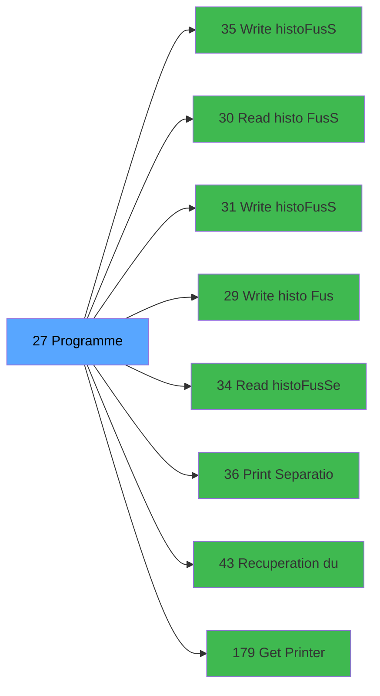

# ADH IDE 27 - Separation

> **Version spec**: 3.5
> **Analyse**: 2026-01-27 17:56
> **Source**: `Prg_XXX.xml`

---

<!-- TAB:Fonctionnel -->

## SPECIFICATION FONCTIONNELLE

### 1.1 Objectif metier

| Element | Description |
|---------|-------------|
| **Qui** | Operateur |
| **Quoi** | Separation
 |
| **Pourquoi** | A documenter |
| **Declencheur** | A identifier |

### 1.2 Regles metier

| Code | Regle | Condition |
|------|-------|-----------|
| RM-001 | A documenter | - |

### 1.3 Flux utilisateur

1. Demarrage programme
2. Traitement principal
3. Fin programme

### 1.4 Cas d'erreur

| Erreur | Comportement |
|--------|--------------|
| - | A documenter |

---

<!-- TAB:Technique -->

## SPECIFICATION TECHNIQUE

### 2.1 Identification

| Attribut | Valeur |
|----------|--------|
| **Format IDE** | ADH IDE 27 |
| **Description** | Separation
 |
| **Module** | ADH |

### 2.2 Tables

| # | Nom physique | Acces | Usage |
|---|--------------|-------|-------|
| #15 | `Table_15` | **W** | 3x |
| #19 | `Table_19` | **W** | 3x |
| #23 | `Table_23` | R | 1x |
| #23 | `Table_23` | **W** | 4x |
| #29 | `Table_29` | **W** | 3x |
| #30 | `Table_30` | LINK | 2x |
| #30 | `Table_30` | R | 7x |
| #30 | `Table_30` | **W** | 1x |
| #31 | `Table_31` | R | 1x |
| #31 | `Table_31` | **W** | 1x |
| #32 | `Table_32` | **W** | 3x |
| #33 | `Table_33` | R | 1x |
| #33 | `Table_33` | **W** | 2x |
| #34 | `Table_34` | **W** | 3x |
| #35 | `Table_35` | R | 1x |
| #35 | `Table_35` | **W** | 1x |
| #36 | `Table_36` | R | 1x |
| #36 | `Table_36` | **W** | 1x |
| #37 | `Table_37` | **W** | 3x |
| #38 | `Table_38` | **W** | 3x |
| #39 | `Table_39` | LINK | 1x |
| #39 | `Table_39` | R | 4x |
| #39 | `Table_39` | **W** | 1x |
| #40 | `Table_40` | R | 4x |
| #40 | `Table_40` | **W** | 6x |
| #44 | `Table_44` | R | 1x |
| #44 | `Table_44` | **W** | 1x |
| #46 | `Table_46` | **W** | 3x |
| #47 | `Table_47` | **W** | 5x |
| #51 | `Table_51` | **W** | 1x |
| #68 | `Table_68` | **W** | 3x |
| #70 | `Table_70` | R | 1x |
| #79 | `Table_79` | **W** | 3x |
| #80 | `Table_80` | R | 1x |
| #80 | `Table_80` | **W** | 1x |
| #93 | `Table_93` | **W** | 1x |
| #123 | `Table_123` | R | 1x |
| #123 | `Table_123` | **W** | 1x |
| #131 | `Table_131` | R | 1x |
| #131 | `Table_131` | **W** | 2x |
| #137 | `Table_137` | R | 1x |
| #137 | `Table_137` | **W** | 2x |
| #147 | `Table_147` | R | 1x |
| #147 | `Table_147` | **W** | 1x |
| #167 | `Table_167` | **W** | 1x |
| #168 | `Table_168` | **W** | 3x |
| #171 | `Table_171` | **W** | 1x |
| #263 | `Table_263` | **W** | 2x |
| #266 | `Table_266` | **W** | 3x |
| #268 | `Table_268` | **W** | 3x |
| #271 | `Table_271` | **W** | 3x |
| #272 | `Table_272` | **W** | 3x |
| #285 | `Table_285` | **W** | 1x |
| #298 | `Table_298` | **W** | 3x |
| #301 | `Table_301` | **W** | 3x |
| #307 | `Table_307` | **W** | 3x |
| #309 | `Table_309` | **W** | 4x |
| #312 | `Table_312` | R | 1x |
| #312 | `Table_312` | **W** | 1x |
| #340 | `Table_340` | LINK | 2x |
| #340 | `Table_340` | R | 1x |
| #340 | `Table_340` | **W** | 2x |
| #342 | `Table_342` | R | 2x |
| #343 | `Table_343` | LINK | 5x |
| #343 | `Table_343` | R | 3x |
| #343 | `Table_343` | **W** | 3x |
| #358 | `Table_358` | **W** | 3x |
| #366 | `Table_366` | **W** | 3x |
| #377 | `Table_377` | **W** | 2x |
| #382 | `Table_382` | **W** | 2x |
| #400 | `Table_400` | LINK | 2x |
| #463 | `Table_463` | **W** | 3x |
| #786 | `Table_786` | R | 1x |
| #786 | `Table_786` | **W** | 1x |
| #804 | `Table_804` | **W** | 1x |
| #805 | `Table_805` | **W** | 3x |
| #807 | `Table_807` | **W** | 3x |
| #831 | `Table_831` | **W** | 3x |
| #834 | `Table_834` | **W** | 3x |
| #837 | `Table_837` | **W** | 3x |
| #947 | `Table_947` | **W** | 3x |
| #1059 | `Table_1059` | **W** | 1x |
### 2.3 Parametres d'entree

### 2.4 Algorigramme

### 2.5 Expressions cles

### 2.6 Variables importantes

### 2.7 Statistiques

---

<!-- TAB:Cartographie -->

## CARTOGRAPHIE APPLICATIVE

### 3.1 Chaine d'appels depuis Main

### 3.2 Callers directs

| IDE | Programme | Nb appels |
|-----|-----------|-----------|
| 37 | Menu changement compte | 1 |
### 3.3 Callees

| Niv | IDE | Programme | Nb appels |
|-----|-----|-----------|-----------|
| 1 | 35 | Write histo_Fus_Sep_Log | 14 |
| 1 | 30 | Read histo Fus_Sep_Det | 11 |
| 1 | 31 | Write histo_Fus_Sep_Det | 11 |
| 1 | 29 | Write histo Fus_Sep | 6 |
| 1 | 34 | Read histo_Fus_Sep_Log | 1 |
| 1 | 36 | Print Separation ou fusion | 1 |
| 1 | 43 | Recuperation du titre | 1 |
| 1 | 179 | Get Printer | 1 |
| 1 | 180 | Printer choice | 1 |
| 1 | 181 | Set Listing Number | 1 |
| 1 | 182 | Raz Current Printer | 1 |
### 3.4 Verification orphelin

| Critere | Resultat |
|---------|----------|
| Callers actifs | A verifier |
| **Conclusion** | A analyser |

---

## HISTORIQUE

| Date | Action | Auteur |
|------|--------|--------|
| 2026-01-27 19:44 | **DATA POPULATED** - Tables, Callgraph (84 expr) | Script |
| 2026-01-27 17:56 | **Upgrade V3.5** - TAB markers, Mermaid | Claude |

---

*Specification V3.5 - Format avec TAB markers et Mermaid*
