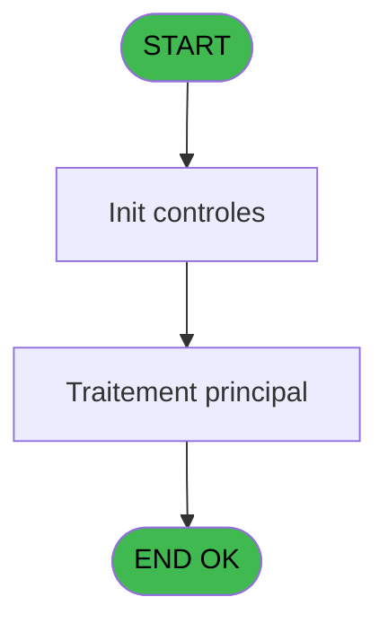
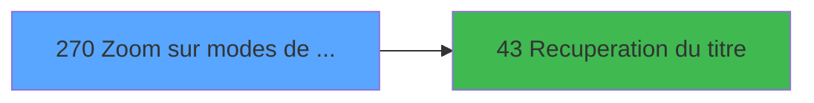

# ADH IDE 270 - Zoom sur modes de paiement a/v

> **Analyse**: Phases 1-4 2026-02-08 04:53 -> 04:53 (5s) | Assemblage 04:53
> **Pipeline**: V7.2 Enrichi
> **Structure**: 4 onglets (Resume | Ecrans | Donnees | Connexions)

<!-- TAB:Resume -->

## 1. FICHE D'IDENTITE

| Attribut | Valeur |
|----------|--------|
| Projet | ADH |
| IDE Position | 270 |
| Nom Programme | Zoom sur modes de paiement a/v |
| Fichier source | `Prg_270.xml` |
| Dossier IDE | Consultation |
| Taches | 1 (0 ecrans visibles) |
| Tables modifiees | 0 |
| Programmes appeles | 1 |
| Complexite | **BASSE** (score 5/100) |
| Statut | **ORPHELIN_POTENTIEL** |

## 2. DESCRIPTION FONCTIONNELLE

ADH IDE 270 est un programme de consultation (Browse) qui affiche une table de reference des modes de paiement avec leurs caracteristiques. Il s'integre dans le flux de gestion de caisse comme zoom (lookup) accessible depuis les ecrans de saisie pour permettre aux operateurs de selectionner ou verifier un mode de paiement. Le programme lit la table de reference des moyens de reglement (stockee en REF.ecf) et presente les donnees dans une grille filtrable.

La logique est minimaliste : le programme recupere d'abord le titre de l'ecran en appelant ADH IDE 43, puis charge et affiche la liste des modes de paiement avec leurs codes, libelles et proprietes (ex: actif/inactif, acceptance CB, cheque, etc.). Les colonnes affichees correspondent aux champs de la table `moyens_reglement` (reference REF). L'utilisateur peut parcourir la liste, appliquer des filtres, et selectionner un mode pour le retourner au programme appelant.

Le programme est classique dans l'architecture ADH : c'est un des 8 zooms references de la phase 1 de migration API Caisse, appelable depuis les ecrans de detail pour enrichir les selections ou verifier les donnees. Son migrage en endpoint C# suivrait le pattern etabli avec les autres zooms (`GET /api/zooms/moyens-reglement`), avec une requete CQRS sur la table REF et serialisation JSON de la grille.

## 3. BLOCS FONCTIONNELS

## 5. REGLES METIER

*(Aucune regle metier identifiee dans les expressions)*

## 6. CONTEXTE

- **Appele par**: (aucun)
- **Appelle**: 1 programmes | **Tables**: 1 (W:0 R:1 L:0) | **Taches**: 1 | **Expressions**: 9

<!-- TAB:Ecrans -->

## 8. ECRANS

*(Programme sans ecran visible)*

## 9. NAVIGATION

### 9.3 Structure hierarchique (0 tache)

| Position | Tache | Type | Dimensions | Bloc |
|----------|-------|------|------------|------|

### 9.4 Algorigramme

> **Legende**: Vert = START/END OK | Rouge = END KO | Bleu = Decisions
> *Algorigramme auto-genere. Utiliser `/algorigramme` pour une synthese metier detaillee.*

<!-- TAB:Donnees -->

## 10. TABLES

### Tables utilisees (1)

| ID | Nom | Description | Type | R | W | L | Usages |
|----|-----|-------------|------|---|---|---|--------|
| 139 | moyens_reglement_mor | Reglements / paiements | DB | R |   |   | 1 |

### Colonnes par table (1 / 1 tables avec colonnes identifiees)

Table 139 - moyens_reglement_mor (R) - 1 usages

| Lettre | Variable | Acces | Type |
|--------|----------|-------|------|
| A | > Societe | R | Alpha |
| B | > Code devise | R | Alpha |
| C | < mode paiement | R | Alpha |
| D | > type achat / vente | R | Alpha |
| E | v.titre | R | Alpha |

## 11. VARIABLES

### 11.1 Variables de session (1)

Variables persistantes pendant toute la session.

| Lettre | Nom | Type | Usage dans |
|--------|-----|------|-----------|
| ER | v.titre | Alpha | - |

### 11.2 Autres (4)

Variables diverses.

| Lettre | Nom | Type | Usage dans |
|--------|-----|------|-----------|
| EN | > Societe | Alpha | 1x refs |
| EO | > Code devise | Alpha | 1x refs |
| EP | < mode paiement | Alpha | 1x refs |
| EQ | > type achat / vente | Alpha | 1x refs |

## 12. EXPRESSIONS

**9 / 9 expressions decodees (100%)**

### 12.1 Repartition par type

| Type | Expressions | Regles |
|------|-------------|--------|
| CONSTANTE | 3 | 0 |
| CONDITION | 4 | 0 |
| OTHER | 1 | 0 |
| STRING | 1 | 0 |

### 12.2 Expressions cles par type

#### CONSTANTE (3 expressions)

| Type | IDE | Expression | Regle |
|------|-----|------------|-------|
| CONSTANTE | 9 | `0` | - |
| CONSTANTE | 6 | `'O'` | - |
| CONSTANTE | 2 | `111` | - |

#### CONDITION (4 expressions)

| Type | IDE | Expression | Regle |
|------|-----|------------|-------|
| CONDITION | 5 | `> type achat / vente [D]` | - |
| CONDITION | 7 | `< mode paiement [C]` | - |
| CONDITION | 3 | `> Societe [A]` | - |
| CONDITION | 4 | `> Code devise [B]` | - |

#### OTHER (1 expressions)

| Type | IDE | Expression | Regle |
|------|-----|------------|-------|
| OTHER | 8 | `[J]` | - |

#### STRING (1 expressions)

| Type | IDE | Expression | Regle |
|------|-----|------------|-------|
| STRING | 1 | `Trim ([K])` | - |

<!-- TAB:Connexions -->

## 13. GRAPHE D'APPELS

### 13.1 Chaine depuis Main (Callers)

**Chemin**: (pas de callers directs)

### 13.2 Callers

| IDE | Nom Programme | Nb Appels |
|-----|---------------|-----------|
| - | (aucun) | - |

### 13.3 Callees (programmes appeles)

### 13.4 Detail Callees avec contexte

| IDE | Nom Programme | Appels | Contexte |
|-----|---------------|--------|----------|
| [43](ADH-IDE-43.md) | Recuperation du titre | 1 | Recuperation donnees |

## 14. RECOMMANDATIONS MIGRATION

### 14.1 Profil du programme

| Metrique | Valeur | Impact migration |
|----------|--------|-----------------|
| Lignes de logique | 16 | Programme compact |
| Expressions | 9 | Peu de logique |
| Tables WRITE | 0 | Impact faible |
| Sous-programmes | 1 | Peu de dependances |
| Ecrans visibles | 0 | Ecran unique ou traitement batch |
| Code desactive | 0% (0 / 16) | Code sain |
| Regles metier | 0 | Pas de regle identifiee |

### 14.2 Plan de migration par bloc

### 14.3 Dependances critiques

| Dependance | Type | Appels | Impact |
|------------|------|--------|--------|
| [Recuperation du titre (IDE 43)](ADH-IDE-43.md) | Sous-programme | 1x | Normale - Recuperation donnees |

---
*Spec DETAILED generee par Pipeline V7.2 - 2026-02-08 04:54*
