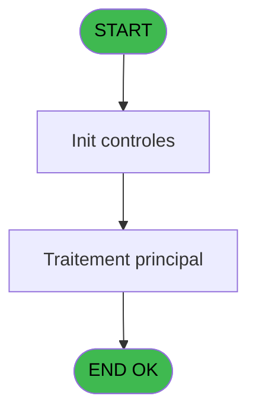
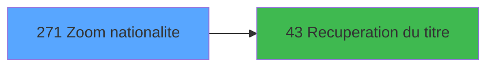

# ADH IDE 271 - Zoom nationalite

> **Analyse**: Phases 1-4 2026-02-08 04:54 -> 04:54 (4s) | Assemblage 04:54
> **Pipeline**: V7.2 Enrichi
> **Structure**: 4 onglets (Resume | Ecrans | Donnees | Connexions)

<!-- TAB:Resume -->

## 1. FICHE D'IDENTITE

| Attribut | Valeur |
|----------|--------|
| Projet | ADH |
| IDE Position | 271 |
| Nom Programme | Zoom nationalite |
| Fichier source | `Prg_271.xml` |
| Dossier IDE | Consultation |
| Taches | 1 (0 ecrans visibles) |
| Tables modifiees | 0 |
| Programmes appeles | 1 |
| Complexite | **BASSE** (score 5/100) |
| Statut | **ORPHELIN_POTENTIEL** |

## 2. DESCRIPTION FONCTIONNELLE

Le programme ADH IDE 271 est un zoom de nationalité qui récupère les données de référence des nationalités depuis la table REF. Il s'agit d'une fonction de consultation simple, typiquement utilisée dans les formulaires de saisie pour permettre aux utilisateurs de sélectionner une nationalité parmi une liste préétablie. Ce programme fait partie du composant partagé ADH.ecf et est appelé depuis des contextes variés nécessitant une identification de nationalité.

La logique métier est minimaliste : le programme récupère le titre de nationalité (via un appel au programme ADH IDE 43) et l'associe à son identifiant unique. Cette architecture en cascade (ADH IDE 271 → ADH IDE 43) permet de centraliser la logique de récupération des noms et d'éviter la duplication de code. Les nationalités sont généralement filtrées ou triées pour affichage dans un ordre cohérent (alphabétique ou par fréquence d'utilisation).

Techniquement, ADH IDE 271 interagit avec les tables de référence REF (nationalités) et bénéficie de l'indexation pour des performances optimales lors de l'affichage de longues listes. Ce zoom fait partie de l'outillage standard de gestion des données de base pour les modules d'adhésion et de facturation qui nécessitent l'enregistrement de données personnelles.

## 3. BLOCS FONCTIONNELS

## 5. REGLES METIER

*(Aucune regle metier identifiee dans les expressions)*

## 6. CONTEXTE

- **Appele par**: (aucun)
- **Appelle**: 1 programmes | **Tables**: 1 (W:0 R:1 L:0) | **Taches**: 1 | **Expressions**: 9

<!-- TAB:Ecrans -->

## 8. ECRANS

*(Programme sans ecran visible)*

## 9. NAVIGATION

### 9.3 Structure hierarchique (0 tache)

| Position | Tache | Type | Dimensions | Bloc |
|----------|-------|------|------------|------|

### 9.4 Algorigramme

> **Legende**: Vert = START/END OK | Rouge = END KO | Bleu = Decisions
> *Algorigramme auto-genere. Utiliser `/algorigramme` pour une synthese metier detaillee.*

<!-- TAB:Donnees -->

## 10. TABLES

### Tables utilisees (1)

| ID | Nom | Description | Type | R | W | L | Usages |
|----|-----|-------------|------|---|---|---|--------|
| 119 | tables_pays_tel_ |  | DB | R |   |   | 1 |

### Colonnes par table (1 / 1 tables avec colonnes identifiees)

Table 119 - tables_pays_tel_ (R) - 1 usages

| Lettre | Variable | Acces | Type |
|--------|----------|-------|------|
| A | > nationalite | R | Alpha |
| B | > langue parlee | R | Alpha |
| C | bouton quitter | R | Alpha |
| D | bouton selectionner | R | Alpha |
| E | v. titre | R | Alpha |

## 11. VARIABLES

### 11.1 Variables de session (1)

Variables persistantes pendant toute la session.

| Lettre | Nom | Type | Usage dans |
|--------|-----|------|-----------|
| ER | v. titre | Alpha | 1x session |

### 11.2 Autres (4)

Variables diverses.

| Lettre | Nom | Type | Usage dans |
|--------|-----|------|-----------|
| EN | > nationalite | Alpha | 1x refs |
| EO | > langue parlee | Alpha | - |
| EP | bouton quitter | Alpha | - |
| EQ | bouton selectionner | Alpha | - |

## 12. EXPRESSIONS

**9 / 9 expressions decodees (100%)**

### 12.1 Repartition par type

| Type | Expressions | Regles |
|------|-------------|--------|
| CONSTANTE | 5 | 0 |
| CONDITION | 1 | 0 |
| OTHER | 2 | 0 |
| STRING | 1 | 0 |

### 12.2 Expressions cles par type

#### CONSTANTE (5 expressions)

| Type | IDE | Expression | Regle |
|------|-----|------------|-------|
| CONSTANTE | 5 | `'F'` | - |
| CONSTANTE | 6 | `'AA'` | - |
| CONSTANTE | 4 | `'&Selectionner'` | - |
| CONSTANTE | 2 | `87` | - |
| CONSTANTE | 3 | `'&Quitter'` | - |

#### CONDITION (1 expressions)

| Type | IDE | Expression | Regle |
|------|-----|------------|-------|
| CONDITION | 7 | `> nationalite [A]` | - |

#### OTHER (2 expressions)

| Type | IDE | Expression | Regle |
|------|-----|------------|-------|
| OTHER | 9 | `[F]` | - |
| OTHER | 8 | `v. titre [E]` | - |

#### STRING (1 expressions)

| Type | IDE | Expression | Regle |
|------|-----|------------|-------|
| STRING | 1 | `Trim ([I])` | - |

<!-- TAB:Connexions -->

## 13. GRAPHE D'APPELS

### 13.1 Chaine depuis Main (Callers)

**Chemin**: (pas de callers directs)

### 13.2 Callers

| IDE | Nom Programme | Nb Appels |
|-----|---------------|-----------|
| - | (aucun) | - |

### 13.3 Callees (programmes appeles)

### 13.4 Detail Callees avec contexte

| IDE | Nom Programme | Appels | Contexte |
|-----|---------------|--------|----------|
| [43](ADH-IDE-43.md) | Recuperation du titre | 1 | Recuperation donnees |

## 14. RECOMMANDATIONS MIGRATION

### 14.1 Profil du programme

| Metrique | Valeur | Impact migration |
|----------|--------|-----------------|
| Lignes de logique | 15 | Programme compact |
| Expressions | 9 | Peu de logique |
| Tables WRITE | 0 | Impact faible |
| Sous-programmes | 1 | Peu de dependances |
| Ecrans visibles | 0 | Ecran unique ou traitement batch |
| Code desactive | 0% (0 / 15) | Code sain |
| Regles metier | 0 | Pas de regle identifiee |

### 14.2 Plan de migration par bloc

### 14.3 Dependances critiques

| Dependance | Type | Appels | Impact |
|------------|------|--------|--------|
| [Recuperation du titre (IDE 43)](ADH-IDE-43.md) | Sous-programme | 1x | Normale - Recuperation donnees |

---
*Spec DETAILED generee par Pipeline V7.2 - 2026-02-08 04:54*
