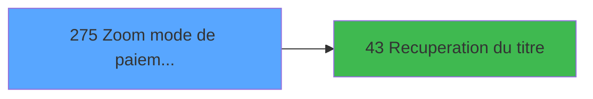

# ADH IDE 275 - Zoom mode de paiement TPE

> **Analyse**: Phases 1-4 2026-02-08 04:55 -> 04:55 (4s) | Assemblage 04:55
> **Pipeline**: V7.2 Enrichi
> **Structure**: 4 onglets (Resume | Ecrans | Donnees | Connexions)

<!-- TAB:Resume -->

## 1. FICHE D'IDENTITE

| Attribut | Valeur |
|----------|--------|
| Projet | ADH |
| IDE Position | 275 |
| Nom Programme | Zoom mode de paiement TPE |
| Fichier source | `Prg_275.xml` |
| Dossier IDE | Consultation |
| Taches | 1 (0 ecrans visibles) |
| Tables modifiees | 0 |
| Programmes appeles | 1 |
| Complexite | **BASSE** (score 5/100) |
| Statut | **ORPHELIN_POTENTIEL** |

## 2. DESCRIPTION FONCTIONNELLE

**ADH IDE 275 est un sélecteur simplifié de modes de paiement TPE** qui offre aux utilisateurs une interface pour choisir le mode de règlement parmi les moyens de paiement compatibles avec les terminaux électroniques (cartes bancaires, e-monnaie). Le programme accède à deux tables de référence : `moyens_reglement_mor` (codes de règlement) et `moyen_paiement___mop` (libellés détaillés), qu'il filtre pour ne proposer que les modes acceptés par le TPE. Sans logique métier complexe ni expressions conditionnelles, il fonctionne comme un simple lecteur de référentiels.

Le programme s'intègre dans le flux de caisse au moment de la saisie de transaction (IDE 316), où il est appelé en parallèle avec IDE 272 (zoom enrichi) quand l'utilisateur doit corriger ou saisir manuellement un mode de paiement suite à un refus TPE. À la différence d'IDE 272 qui intègre un appel à IDE 43 pour récupérer les titres, IDE 275 reste autonome et retourne directement le mode sélectionné sans dépendances aval. C'est un **composant terminal** très ciblé pour la gestion des moyens de paiement électroniques.

Avec une structure extrêmement légère (1 tâche, 28 lignes, zéro callers détectés), IDE 275 représente un utilitaire de lookup pur adapté à une migration vers un simple service repository. Son isolation architecturale et son périmètre métier restreint en font un candidat idéal pour extraction en microservice léger ou pattern repository moderne retournant la liste des modes TPE disponibles.

## 3. BLOCS FONCTIONNELS

## 5. REGLES METIER

1 regles identifiees:

### Autres (1 regles)

#### [RM-001] Condition: [M]<>'VADA' AND [M]<>'VADV' AND [M] different de 'OD'

| Element | Detail |
|---------|--------|
| **Condition** | `[M]<>'VADA' AND [M]<>'VADV' AND [M]<>'OD'` |
| **Si vrai** | Action si vrai |
| **Expression source** | Expression 9 : `[M]<>'VADA' AND [M]<>'VADV' AND [M]<>'OD'` |
| **Exemple** | Si [M]<>'VADA' AND [M]<>'VADV' AND [M]<>'OD' → Action si vrai |

## 6. CONTEXTE

- **Appele par**: (aucun)
- **Appelle**: 1 programmes | **Tables**: 2 (W:0 R:1 L:1) | **Taches**: 1 | **Expressions**: 9

<!-- TAB:Ecrans -->

## 8. ECRANS

*(Programme sans ecran visible)*

## 9. NAVIGATION

### 9.3 Structure hierarchique (0 tache)

| Position | Tache | Type | Dimensions | Bloc |
|----------|-------|------|------------|------|

### 9.4 Algorigramme

> **Legende**: Vert = START/END OK | Rouge = END KO | Bleu = Decisions
> *Algorigramme auto-genere. Utiliser `/algorigramme` pour une synthese metier detaillee.*

<!-- TAB:Donnees -->

## 10. TABLES

### Tables utilisees (2)

| ID | Nom | Description | Type | R | W | L | Usages |
|----|-----|-------------|------|---|---|---|--------|
| 50 | moyens_reglement_mor | Reglements / paiements | DB | R |   |   | 1 |
| 89 | moyen_paiement___mop |  | DB |   |   | L | 1 |

### Colonnes par table (2 / 1 tables avec colonnes identifiees)

Table 50 - moyens_reglement_mor (R) - 1 usages

| Lettre | Variable | Acces | Type |
|--------|----------|-------|------|
| A | > societe | R | Alpha |
| B | > devise | R | Alpha |
| C | > type d'operation | R | Alpha |
| D | < mode de paiement | R | Alpha |
| E | > zoom vente et od | R | Alpha |
| F | > compte garanti | R | Logical |
| G | > solde compte | R | Numeric |
| H | > article derniere minute | R | Logical |
| I | v. titre | R | Alpha |
| J | bouton quitter | R | Alpha |
| K | bouton selectionner | R | Alpha |

## 11. VARIABLES

### 11.1 Variables de session (1)

Variables persistantes pendant toute la session.

| Lettre | Nom | Type | Usage dans |
|--------|-----|------|-----------|
| EV | v. titre | Alpha | - |

### 11.2 Autres (10)

Variables diverses.

| Lettre | Nom | Type | Usage dans |
|--------|-----|------|-----------|
| EN | > societe | Alpha | 1x refs |
| EO | > devise | Alpha | 1x refs |
| EP | > type d'operation | Alpha | 1x refs |
| EQ | < mode de paiement | Alpha | - |
| ER | > zoom vente et od | Alpha | - |
| ES | > compte garanti | Logical | - |
| ET | > solde compte | Numeric | - |
| EU | > article derniere minute | Logical | - |
| EW | bouton quitter | Alpha | - |
| EX | bouton selectionner | Alpha | - |

## 12. EXPRESSIONS

**9 / 9 expressions decodees (100%)**

### 12.1 Repartition par type

| Type | Expressions | Regles |
|------|-------------|--------|
| CONDITION | 4 | 5 |
| CONSTANTE | 4 | 0 |
| OTHER | 1 | 0 |

### 12.2 Expressions cles par type

#### CONDITION (4 expressions)

| Type | IDE | Expression | Regle |
|------|-----|------------|-------|
| CONDITION | 9 | `[M]<>'VADA' AND [M]<>'VADV' AND [M]<>'OD'` | [RM-001](#rm-RM-001) |
| CONDITION | 6 | `> type d'operation [C]` | - |
| CONDITION | 5 | `> devise [B]` | - |
| CONDITION | 4 | `> societe [A]` | - |

#### CONSTANTE (4 expressions)

| Type | IDE | Expression | Regle |
|------|-----|------------|-------|
| CONSTANTE | 3 | `61` | - |
| CONSTANTE | 7 | `'O'` | - |
| CONSTANTE | 1 | `'&Quitter'` | - |
| CONSTANTE | 2 | `'&Selectionner'` | - |

#### OTHER (1 expressions)

| Type | IDE | Expression | Regle |
|------|-----|------------|-------|
| OTHER | 8 | `[M]` | - |

<!-- TAB:Connexions -->

## 13. GRAPHE D'APPELS

### 13.1 Chaine depuis Main (Callers)

**Chemin**: (pas de callers directs)

### 13.2 Callers

| IDE | Nom Programme | Nb Appels |
|-----|---------------|-----------|
| - | (aucun) | - |

### 13.3 Callees (programmes appeles)

### 13.4 Detail Callees avec contexte

| IDE | Nom Programme | Appels | Contexte |
|-----|---------------|--------|----------|
| [43](ADH-IDE-43.md) | Recuperation du titre | 1 | Recuperation donnees |

## 14. RECOMMANDATIONS MIGRATION

### 14.1 Profil du programme

| Metrique | Valeur | Impact migration |
|----------|--------|-----------------|
| Lignes de logique | 28 | Programme compact |
| Expressions | 9 | Peu de logique |
| Tables WRITE | 0 | Impact faible |
| Sous-programmes | 1 | Peu de dependances |
| Ecrans visibles | 0 | Ecran unique ou traitement batch |
| Code desactive | 0% (0 / 28) | Code sain |
| Regles metier | 1 | Quelques regles a preserver |

### 14.2 Plan de migration par bloc

### 14.3 Dependances critiques

| Dependance | Type | Appels | Impact |
|------------|------|--------|--------|
| [Recuperation du titre (IDE 43)](ADH-IDE-43.md) | Sous-programme | 1x | Normale - Recuperation donnees |

---
*Spec DETAILED generee par Pipeline V7.2 - 2026-02-08 04:56*
