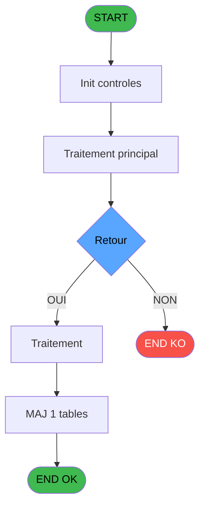

# ADH IDE 277 - Selection Vols /t Ville à côté

> **Analyse**: Phases 1-4 2026-02-08 04:59 -> 04:59 (5s) | Assemblage 04:59
> **Pipeline**: V7.2 Enrichi
> **Structure**: 4 onglets (Resume | Ecrans | Donnees | Connexions)

<!-- TAB:Resume -->

## 1. FICHE D'IDENTITE

| Attribut | Valeur |
|----------|--------|
| Projet | ADH |
| IDE Position | 277 |
| Nom Programme | Selection Vols /t Ville à côté |
| Fichier source | `Prg_277.xml` |
| Dossier IDE | Consultation |
| Taches | 1 (0 ecrans visibles) |
| Tables modifiees | 1 |
| Programmes appeles | 0 |
| Complexite | **BASSE** (score 7/100) |
| Statut | **ORPHELIN_POTENTIEL** |

## 2. DESCRIPTION FONCTIONNELLE

**ADH IDE 277** est un sélecteur de vols avec affichage de la ville associée, utilisé pour faciliter la sélection du bon vol lors de la gestion des transferts aériens. Le programme affiche une grille interactif listant les vols disponibles avec leur destination ou origine correspondante, permettant à l'opérateur d'accueil de choisir rapidement parmi les options proposées. C'est un programme très simple composé d'une seule tâche sans appels externes.

La table modifiée **Table_1020** sert de zone de travail pour enregistrer le vol et la ville sélectionnés lors de l'interaction utilisateur avec le sélecteur. Cette table reçoit les données du choix effectué sans effectuer de lectures préalables, uniquement des écritures pour persister la sélection.

Le programme est **orphelin** - aucun autre programme ne l'appelle directement et il ne fait appel à aucun sous-programme. Avec ses 46 lignes de logique simples et zéro expressions complexes, c'est un bon candidat pour migration vers un composant d'interface moderne (React ou Angular) doté d'un tableau de sélection.

## 3. BLOCS FONCTIONNELS

## 5. REGLES METIER

4 regles identifiees:

### Autres (4 regles)

#### [RM-001] Condition toujours vraie (flag actif)

| Element | Detail |
|---------|--------|
| **Condition** | `p.i.Affiche VV [G]` |
| **Si vrai** | 'TRUE'LOG |
| **Si faux** | InStr ('VV1,VV2,VV3',Trim ([N]))=0) |
| **Variables** | ET (p.i.Affiche VV) |
| **Expression source** | Expression 13 : `IF (p.i.Affiche VV [G],'TRUE'LOG,InStr ('VV1,VV2,VV3',Trim (` |
| **Exemple** | Si p.i.Affiche VV [G] → 'TRUE'LOG. Sinon → InStr ('VV1,VV2,VV3',Trim ([N]))=0) |

#### [RM-002] Condition: p.i.TypeVol Aller/Retour [C] egale 'A'

| Element | Detail |
|---------|--------|
| **Condition** | `p.i.TypeVol Aller/Retour [C]='A'` |
| **Si vrai** | Action si vrai |
| **Variables** | EP (p.i.TypeVol Aller/Retour) |
| **Expression source** | Expression 17 : `p.i.TypeVol Aller/Retour [C]='A'` |
| **Exemple** | Si p.i.TypeVol Aller/Retour [C]='A' → Action si vrai |

#### [RM-003] Condition: p.i.TypeVol Aller/Retour [C] egale 'R'

| Element | Detail |
|---------|--------|
| **Condition** | `p.i.TypeVol Aller/Retour [C]='R'` |
| **Si vrai** | Action si vrai |
| **Variables** | EP (p.i.TypeVol Aller/Retour) |
| **Expression source** | Expression 18 : `p.i.TypeVol Aller/Retour [C]='R'` |
| **Exemple** | Si p.i.TypeVol Aller/Retour [C]='R' → Action si vrai |

#### [RM-004] Negation de [T] (condition inversee)

| Element | Detail |
|---------|--------|
| **Condition** | `NOT [T]` |
| **Si vrai** | Action si vrai |
| **Expression source** | Expression 19 : `NOT [T]` |
| **Exemple** | Si NOT [T] → Action si vrai |

## 6. CONTEXTE

- **Appele par**: (aucun)
- **Appelle**: 0 programmes | **Tables**: 1 (W:1 R:0 L:0) | **Taches**: 1 | **Expressions**: 20

<!-- TAB:Ecrans -->

## 8. ECRANS

*(Programme sans ecran visible)*

## 9. NAVIGATION

### 9.3 Structure hierarchique (0 tache)

| Position | Tache | Type | Dimensions | Bloc |
|----------|-------|------|------------|------|

### 9.4 Algorigramme

> **Legende**: Vert = START/END OK | Rouge = END KO | Bleu = Decisions
> *Algorigramme auto-genere. Utiliser `/algorigramme` pour une synthese metier detaillee.*

<!-- TAB:Donnees -->

## 10. TABLES

### Tables utilisees (1)

| ID | Nom | Description | Type | R | W | L | Usages |
|----|-----|-------------|------|---|---|---|--------|
| 1020 | Table_1020 |  | MEM |   | **W** |   | 1 |

### Colonnes par table (1 / 1 tables avec colonnes identifiees)

Table 1020 - Table_1020 (**W**) - 1 usages

| Lettre | Variable | Acces | Type |
|--------|----------|-------|------|
| A | p.i.Date | W | Date |
| B | p.o.Categorie/code vol | W | Alpha |
| C | p.i.TypeVol Aller/Retour | W | Alpha |
| D | p.i.Sélection min | W | Alpha |
| E | p.i.Sélection max | W | Alpha |
| F | p.o.Heure | W | Numeric |
| G | p.i.Affiche VV | W | Logical |
| H | p.i.Ville | W | Unicode |
| I | v. autorisation quitter | W | Logical |
| J | bouton select | W | Alpha |
| K | bouton quitter | W | Alpha |
| L | v. titre | W | Alpha |
| M | v.Au moins une ligne ? | W | Logical |

## 11. VARIABLES

### 11.1 Parametres entrants (8)

Variables recues en parametre.

| Lettre | Nom | Type | Usage dans |
|--------|-----|------|-----------|
| EN | p.i.Date | Date | 3x parametre entrant |
| EO | p.o.Categorie/code vol | Alpha | 1x parametre entrant |
| EP | p.i.TypeVol Aller/Retour | Alpha | 3x parametre entrant |
| EQ | p.i.Sélection min | Alpha | 1x parametre entrant |
| ER | p.i.Sélection max | Alpha | 1x parametre entrant |
| ES | p.o.Heure | Numeric | - |
| ET | p.i.Affiche VV | Logical | 1x parametre entrant |
| EU | p.i.Ville | Unicode | 1x parametre entrant |

### 11.2 Variables de session (3)

Variables persistantes pendant toute la session.

| Lettre | Nom | Type | Usage dans |
|--------|-----|------|-----------|
| EV | v. autorisation quitter | Logical | - |
| EY | v. titre | Alpha | - |
| EZ | v.Au moins une ligne ? | Logical | - |

### 11.3 Autres (2)

Variables diverses.

| Lettre | Nom | Type | Usage dans |
|--------|-----|------|-----------|
| EW | bouton select | Alpha | - |
| EX | bouton quitter | Alpha | - |

## 12. EXPRESSIONS

**20 / 20 expressions decodees (100%)**

### 12.1 Repartition par type

| Type | Expressions | Regles |
|------|-------------|--------|
| CAST_LOGIQUE | 2 | 5 |
| CONDITION | 2 | 2 |
| NEGATION | 1 | 5 |
| CONSTANTE | 4 | 0 |
| FORMAT | 2 | 0 |
| OTHER | 9 | 0 |

### 12.2 Expressions cles par type

#### CAST_LOGIQUE (2 expressions)

| Type | IDE | Expression | Regle |
|------|-----|------------|-------|
| CAST_LOGIQUE | 13 | `IF (p.i.Affiche VV [G],'TRUE'LOG,InStr ('VV1,VV2,VV3',Trim ([N]))=0)` | [RM-001](#rm-RM-001) |
| CAST_LOGIQUE | 10 | `'TRUE'LOG` | - |

#### CONDITION (2 expressions)

| Type | IDE | Expression | Regle |
|------|-----|------------|-------|
| CONDITION | 18 | `p.i.TypeVol Aller/Retour [C]='R'` | [RM-003](#rm-RM-003) |
| CONDITION | 17 | `p.i.TypeVol Aller/Retour [C]='A'` | [RM-002](#rm-RM-002) |

#### NEGATION (1 expressions)

| Type | IDE | Expression | Regle |
|------|-----|------------|-------|
| NEGATION | 19 | `NOT [T]` | [RM-004](#rm-RM-004) |

#### CONSTANTE (4 expressions)

| Type | IDE | Expression | Regle |
|------|-----|------------|-------|
| CONSTANTE | 11 | `''` | - |
| CONSTANTE | 12 | `0` | - |
| CONSTANTE | 3 | `'&Selectionner'` | - |
| CONSTANTE | 4 | `'&Quitter'` | - |

#### FORMAT (2 expressions)

| Type | IDE | Expression | Regle |
|------|-----|------------|-------|
| FORMAT | 16 | `StrBuild(MlsTrans('Aucun vol retour n''est défini au @1@.'), DStr(p.i.Date [A], '##/##/####'))` | - |
| FORMAT | 15 | `StrBuild(MlsTrans('Aucun vol aller n''est défini au @1@.'), DStr(p.i.Date [A], '##/##/####'))` | - |

#### OTHER (9 expressions)

| Type | IDE | Expression | Regle |
|------|-----|------------|-------|
| OTHER | 9 | `p.o.Categorie/code vol [B]` | - |
| OTHER | 8 | `p.i.Sélection max [E]` | - |
| OTHER | 20 | `p.i.Ville [H]` | - |
| OTHER | 14 | `[P]` | - |
| OTHER | 7 | `p.i.Sélection min [D]` | - |
| ... | | *+4 autres* | |

<!-- TAB:Connexions -->

## 13. GRAPHE D'APPELS

### 13.1 Chaine depuis Main (Callers)

**Chemin**: (pas de callers directs)

### 13.2 Callers

| IDE | Nom Programme | Nb Appels |
|-----|---------------|-----------|
| - | (aucun) | - |

### 13.3 Callees (programmes appeles)

### 13.4 Detail Callees avec contexte

| IDE | Nom Programme | Appels | Contexte |
|-----|---------------|--------|----------|
| - | (aucun) | - | - |

## 14. RECOMMANDATIONS MIGRATION

### 14.1 Profil du programme

| Metrique | Valeur | Impact migration |
|----------|--------|-----------------|
| Lignes de logique | 46 | Programme compact |
| Expressions | 20 | Peu de logique |
| Tables WRITE | 1 | Impact faible |
| Sous-programmes | 0 | Peu de dependances |
| Ecrans visibles | 0 | Ecran unique ou traitement batch |
| Code desactive | 0% (0 / 46) | Code sain |
| Regles metier | 4 | Quelques regles a preserver |

### 14.2 Plan de migration par bloc

### 14.3 Dependances critiques

| Dependance | Type | Appels | Impact |
|------------|------|--------|--------|
| Table_1020 | Table WRITE (Memory) | 1x | Schema + repository |

---
*Spec DETAILED generee par Pipeline V7.2 - 2026-02-08 05:00*
