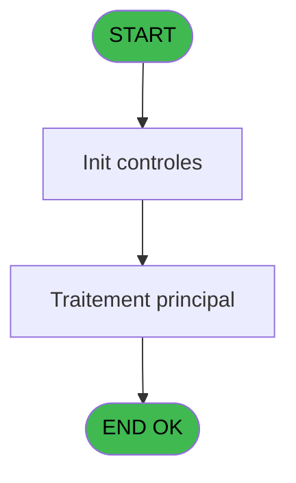
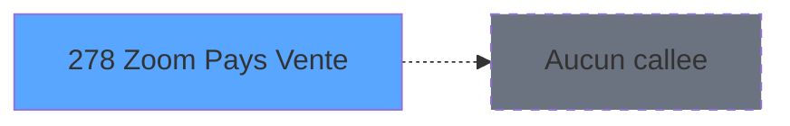

# ADH IDE 278 - Zoom Pays Vente

> **Analyse**: Phases 1-4 2026-02-08 05:00 -> 05:00 (4s) | Assemblage 05:00
> **Pipeline**: V7.2 Enrichi
> **Structure**: 4 onglets (Resume | Ecrans | Donnees | Connexions)

<!-- TAB:Resume -->

## 1. FICHE D'IDENTITE

| Attribut | Valeur |
|----------|--------|
| Projet | ADH |
| IDE Position | 278 |
| Nom Programme | Zoom Pays Vente |
| Fichier source | `Prg_278.xml` |
| Dossier IDE | Ventes |
| Taches | 1 (0 ecrans visibles) |
| Tables modifiees | 0 |
| Programmes appeles | 0 |
| Complexite | **BASSE** (score 0/100) |
| Statut | **ORPHELIN_POTENTIEL** |

## 2. DESCRIPTION FONCTIONNELLE

ADH IDE 278 affiche une table de reference des pays utilises dans les transactions de vente. C'est un zoom (petit ecran) qui permet aux operateurs de consulter rapidement la liste complete des pays disponibles, probablement pour la saisie de donnees ou la verification d'informations clients. Le programme lit la table de reference des pays (REF) et presente les enregistrements sous forme tabulaire.

Ce zoom fait partie du module Ventes d'ADH et s'integre dans les workflows d'Easy Check-Out ou de facturation. Il permet de valider les codes pays ou de selectionner un pays lors d'operations commerciales. Comme tous les zooms ADH, c'est une interface de consultation en lecture seule, sans modification de donnees.

Le programme depend probablement de la table cafil XXX (table de reference pays) et est appele lors de controles ou de saisies necessitant validation d'un code pays. L'ecran zoom s'ouvre en popup dans le contexte d'une operation plus large (recherche client, saisie adresse, parametrage).

## 3. BLOCS FONCTIONNELS

## 5. REGLES METIER

*(Aucune regle metier identifiee dans les expressions)*

## 6. CONTEXTE

- **Appele par**: (aucun)
- **Appelle**: 0 programmes | **Tables**: 1 (W:0 R:1 L:0) | **Taches**: 1 | **Expressions**: 6

<!-- TAB:Ecrans -->

## 8. ECRANS

*(Programme sans ecran visible)*

## 9. NAVIGATION

### 9.3 Structure hierarchique (0 tache)

| Position | Tache | Type | Dimensions | Bloc |
|----------|-------|------|------------|------|

### 9.4 Algorigramme

> **Legende**: Vert = START/END OK | Rouge = END KO | Bleu = Decisions
> *Algorigramme auto-genere. Utiliser `/algorigramme` pour une synthese metier detaillee.*

<!-- TAB:Donnees -->

## 10. TABLES

### Tables utilisees (1)

| ID | Nom | Description | Type | R | W | L | Usages |
|----|-----|-------------|------|---|---|---|--------|
| 121 | tables_pays_ventes | Donnees de ventes | DB | R |   |   | 1 |

### Colonnes par table (1 / 1 tables avec colonnes identifiees)

Table 121 - tables_pays_ventes (R) - 1 usages

| Lettre | Variable | Acces | Type |
|--------|----------|-------|------|
| A | P.i.Code Societe | R | Unicode |
| B | P.i.Code Vente | R | Unicode |
| C | bouton quitter | R | Alpha |
| D | bouton selectionner | R | Alpha |

## 11. VARIABLES

### 11.1 Parametres entrants (2)

Variables recues en parametre.

| Lettre | Nom | Type | Usage dans |
|--------|-----|------|-----------|
| EN | P.i.Code Societe | Unicode | 1x parametre entrant |
| EO | P.i.Code Vente | Unicode | - |

### 11.2 Autres (2)

Variables diverses.

| Lettre | Nom | Type | Usage dans |
|--------|-----|------|-----------|
| EP | bouton quitter | Alpha | - |
| EQ | bouton selectionner | Alpha | 1x refs |

## 12. EXPRESSIONS

**6 / 6 expressions decodees (100%)**

### 12.1 Repartition par type

| Type | Expressions | Regles |
|------|-------------|--------|
| CONSTANTE | 4 | 0 |
| OTHER | 2 | 0 |

### 12.2 Expressions cles par type

#### CONSTANTE (4 expressions)

| Type | IDE | Expression | Regle |
|------|-----|------------|-------|
| CONSTANTE | 3 | `'AA'` | - |
| CONSTANTE | 6 | `'C'` | - |
| CONSTANTE | 1 | `'&Quitter'` | - |
| CONSTANTE | 2 | `'&Selectionner'` | - |

#### OTHER (2 expressions)

| Type | IDE | Expression | Regle |
|------|-----|------------|-------|
| OTHER | 5 | `bouton selectionner [D]` | - |
| OTHER | 4 | `P.i.Code Societe [A]` | - |

<!-- TAB:Connexions -->

## 13. GRAPHE D'APPELS

### 13.1 Chaine depuis Main (Callers)

**Chemin**: (pas de callers directs)

### 13.2 Callers

| IDE | Nom Programme | Nb Appels |
|-----|---------------|-----------|
| - | (aucun) | - |

### 13.3 Callees (programmes appeles)

### 13.4 Detail Callees avec contexte

| IDE | Nom Programme | Appels | Contexte |
|-----|---------------|--------|----------|
| - | (aucun) | - | - |

## 14. RECOMMANDATIONS MIGRATION

### 14.1 Profil du programme

| Metrique | Valeur | Impact migration |
|----------|--------|-----------------|
| Lignes de logique | 12 | Programme compact |
| Expressions | 6 | Peu de logique |
| Tables WRITE | 0 | Impact faible |
| Sous-programmes | 0 | Peu de dependances |
| Ecrans visibles | 0 | Ecran unique ou traitement batch |
| Code desactive | 0% (0 / 12) | Code sain |
| Regles metier | 0 | Pas de regle identifiee |

### 14.2 Plan de migration par bloc

### 14.3 Dependances critiques

| Dependance | Type | Appels | Impact |
|------------|------|--------|--------|

---
*Spec DETAILED generee par Pipeline V7.2 - 2026-02-08 05:01*
