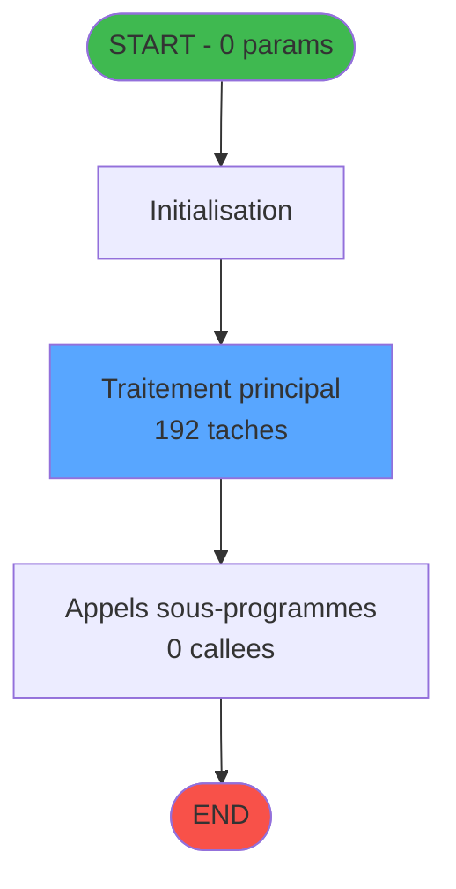
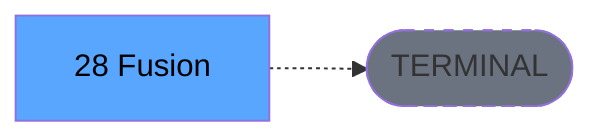

# ADH IDE 28 - Fusion

> **Version spec**: 4.0
> **Analyse**: 2026-01-27 22:59
> **Source**: `D:\Data\Migration\XPA\PMS\ADH\Source\Prg_24.xml`
> **Methode**: APEX + PDCA (Auto-generated)

---

<!-- TAB:Fonctionnel -->

## SPECIFICATION FONCTIONNELLE

### 1.1 Objectif metier

| Element | Description |
|---------|-------------|
| **Qui** | Operateur (utilisateur connecte) |
| **Quoi** | Fusion |
| **Pourquoi** | Fonction metier du module ADH |
| **Declencheur** | Appel depuis programme parent ou menu |
| **Resultat** | Traitement effectue selon logique programme |

### 1.2 Regles metier

| Code | Regle | Condition |
|------|-------|-----------|
| RM-001 | Execution du traitement principal | Conditions d'entree validees |
| RM-002 | Gestion des tables (95 tables) | Acces selon mode (R/W/L) |
| RM-003 | Appels sous-programmes (0 callees) | Selon logique metier |

### 1.3 Flux utilisateur

1. Reception des parametres d'entree (0 params)
2. Initialisation et verification conditions
3. Traitement principal (192 taches)
4. Appels sous-programmes si necessaire
5. Retour resultats

### 1.4 Cas d'erreur

| Erreur | Comportement |
|--------|--------------|
| Conditions non remplies | Abandon avec message |
| Erreur sous-programme | Propagation erreur |

---

<!-- TAB:Technique -->

## SPECIFICATION TECHNIQUE

### 2.1 Identification

| Attribut | Valeur |
|----------|--------|
| **IDE Position** | 28 |
| **Fichier XML** | `Prg_24.xml` |
| **Description** | Fusion |
| **Module** | ADH |
| **Public Name** | Fusion |
| **Nombre taches** | 192 |
| **Lignes logique** | 3494 |
| **Expressions** | 0 |

### 2.2 Tables

| # | Nom logique | Nom physique | Acces | Usage |
|---|-------------|--------------|-------|-------|
| 15 | transac_entete_bar | bartransacent | WRITE | Ecriture |
| 19 | bl_detail | bldetail | WRITE | Ecriture |
| 23 | reseau_cloture___rec | cafil001_dat | READ/WRITE | Lecture+Ecriture |
| 29 | voyages__________voy | cafil007_dat | WRITE | Ecriture |
| 30 | gm-recherche_____gmr | cafil008_dat | LINK/READ/WRITE | Jointure+R/W |
| 31 | gm-complet_______gmc | cafil009_dat | READ/WRITE | Lecture+Ecriture |
| 32 | prestations | cafil010_dat | READ/WRITE | Lecture+Ecriture |
| 33 | prestations______pre | cafil011_dat | READ/WRITE | Lecture+Ecriture |
| 34 | hebergement______heb | cafil012_dat | WRITE | Ecriture |
| 35 | personnel_go______go | cafil013_dat | READ/WRITE | Lecture+Ecriture |
| 36 | client_gm | cafil014_dat | WRITE | Ecriture |
| 37 | commentaire_gm_________acc | cafil015_dat | READ/WRITE | Lecture+Ecriture |
| 38 | comptable_gratuite | cafil016_dat | WRITE | Ecriture |
| 39 | depot_garantie___dga | cafil017_dat | LINK/READ/WRITE | Jointure+R/W |
| 40 | comptable________cte | cafil018_dat | READ/WRITE | Lecture+Ecriture |
| 41 | depot_objets_____doa | cafil019_dat | WRITE | Ecriture |
| 42 | depot_devises____dda | cafil020_dat | WRITE | Ecriture |
| 43 | solde_devises____sda | cafil021_dat | WRITE | Ecriture |
| 44 | change___________chg | cafil022_dat | READ/WRITE | Lecture+Ecriture |
| 46 | mvt_prestation___mpr | cafil024_dat | READ/WRITE | Lecture+Ecriture |
| 47 | compte_gm________cgm | cafil025_dat | READ/WRITE | Lecture+Ecriture |
| 48 | lignes_de_solde__sld | cafil026_dat | WRITE | Ecriture |
| 51 | fusion_eclatementfec | cafil029_dat | READ/WRITE | Lecture+Ecriture |
| 70 | date_comptable___dat | cafil048_dat | READ | Lecture |
| 79 | gratuites________gra | cafil057_dat | READ/WRITE | Lecture+Ecriture |
| 80 | codes_autocom____aut | cafil058_dat | READ/WRITE | Lecture+Ecriture |
| 93 | vendeurs_________ven | cafil071_dat | WRITE | Ecriture |
| 123 | fichier_messagerie | cafil101_dat | READ/WRITE | Lecture+Ecriture |
| 131 | fichier_validation | cafil109_dat | READ/WRITE | Lecture+Ecriture |
| 137 | fichier_histotel | cafil115_dat | READ/WRITE | Lecture+Ecriture |
| 147 | change_vente_____chg | cafil125_dat | READ/WRITE | Lecture+Ecriture |
| 148 | lignes_de_solde__sld | cafil126_dat | WRITE | Ecriture |
| 167 | troncon__________tro | cafil145_dat | WRITE | Ecriture |
| 168 | heb_circuit______hci | cafil146_dat | WRITE | Ecriture |
| 171 | commentaire______com | cafil149_dat | WRITE | Ecriture |
| 263 | vente | caisse_vente | WRITE | Ecriture |
| 266 | cc_comptable | cccompta | WRITE | Ecriture |
| 268 | cc_total_par_type | ccpartyp | WRITE | Ecriture |
| 271 | cc_total | cctotal | WRITE | Ecriture |
| 272 | cc_type_detail | cctypdet | WRITE | Ecriture |
| 285 | email | email | WRITE | Ecriture |
| 298 | participants_____par | excupar_dat | WRITE | Ecriture |
| 301 | details_partici__dpa | excupta_dat | WRITE | Ecriture |
| 307 | vente_option_veo | excuveo_dat | WRITE | Ecriture |
| 309 | vente____________vep | excuvepe_dat | WRITE | Ecriture |
| 312 | ez_card | ezcard | READ/WRITE | Lecture+Ecriture |
| 340 | histo_fusionseparation | histo_fus_sep | LINK/READ/WRITE | Jointure+R/W |
| 342 | histo__fusionseparation_log | histo_fus_sep_log | LINK/READ | Jointure+Lecture |
| 343 | histo_fusionseparation_saisie | histo_fus_sep_saisie | LINK/READ/WRITE | Jointure+R/W |
| 358 | import_mod | moddossier_dat | WRITE | Ecriture |
| 366 | pms_print_param | pmsprintparam | WRITE | Ecriture |
| 382 | pv_discount_reasons | pv_discountlist_dat | WRITE | Ecriture |
| 463 | heure_de_passage | verifpool_dat | WRITE | Ecriture |
| 786 | qualite_avant_reprise | qualite_avant_reprise | READ/WRITE | Lecture+Ecriture |
| 804 | valeur_credit_bar_defaut | valeur_credit_bar_defaut | WRITE | Ecriture |
| 805 | vente_par_moyen_paiement | vente_par_moyen_paiement | READ/WRITE | Lecture+Ecriture |
| 807 | plafond_lit | plafond_lit | READ/WRITE | Lecture+Ecriture |
| 831 | import_go_erreur_affection | import_go_erreur_affection | READ/WRITE | Lecture+Ecriture |
| 834 | tpe_par_terminal | tpe_par_terminal | READ/WRITE | Lecture+Ecriture |
| 837 | ##_pv_customer_dat | ##%club_user%_%term%_pv_customer | READ/WRITE | Lecture+Ecriture |
| 947 | Table_947 |  | WRITE | Ecriture |
| 1059 | Table_1059 |  | WRITE | Ecriture |

**Resume**: 95 tables accedees dont **60 en ecriture**

### 2.3 Parametres d'entree (0 parametres)

| Var | Nom | Type | Picture |
|-----|-----|------|---------|
| - | Aucun parametre | - | - |

### 2.4 Algorigramme

### 2.5 Statistiques

| Metrique | Valeur |
|----------|--------|
| **Taches** | 192 |
| **Lignes logique** | 3494 |
| **Expressions** | 0 |
| **Parametres** | 0 |
| **Tables accedees** | 95 |
| **Tables en ecriture** | 60 |
| **Callees niveau 1** | 0 |

---

<!-- TAB:Cartographie -->

## CARTOGRAPHIE APPLICATIVE

### 3.1 Chaine d'appels depuis Main

### 3.2 Callers directs

| IDE | Programme | Nb appels |
|-----|-----------|-----------|
| - | ECF partage - appels cross-projet | - |

### 3.3 Callees (3 niveaux)

| Niv | IDE | Programme | Nb appels | Status |
|-----|-----|-----------|-----------|--------|
| - | - | TERMINAL | - | - |

### 3.4 Composants ECF utilises

| ECF | IDE | Public Name | Description |
|-----|-----|-------------|-------------|
| ADH.ecf | 28 | Fusion | Sessions_Reprises |

### 3.5 Verification orphelin

| Critere | Resultat |
|---------|----------|
| Callers actifs | 0 programmes |
| PublicName | Defini: Fusion |
| ECF partage | OUI - ADH.ecf |
| **Conclusion** | **NON ORPHELIN** - Composant ECF partage |

---

## NOTES MIGRATION

### Complexite

| Critere | Score | Detail |
|---------|-------|--------|
| Taches | 192 | Complexe |
| Tables | 95 | Ecriture |
| Callees | 0 | Faible couplage |
| **Score global** | **HAUTE** | - |

### Points d'attention migration

| Point | Solution moderne |
|-------|-----------------|
| Variables globales (VG*) | Service/Repository injection |
| Tables Magic | Entity Framework / Dapper |
| CallTask | Service method calls |
| Forms | React/Angular components |

---

## HISTORIQUE

| Date | Action | Auteur |
|------|--------|--------|
| 2026-01-27 22:59 | **V4.0 APEX/PDCA** - Generation automatique complete | Script |

---

*Specification V4.0 - Auto-generated with APEX/PDCA methodology*

