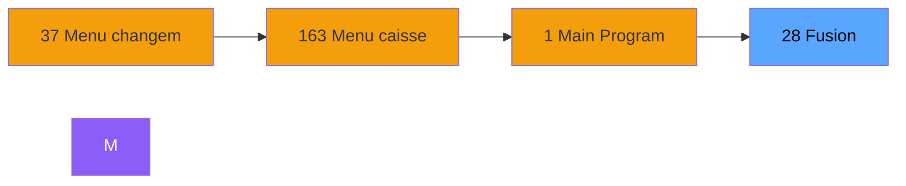
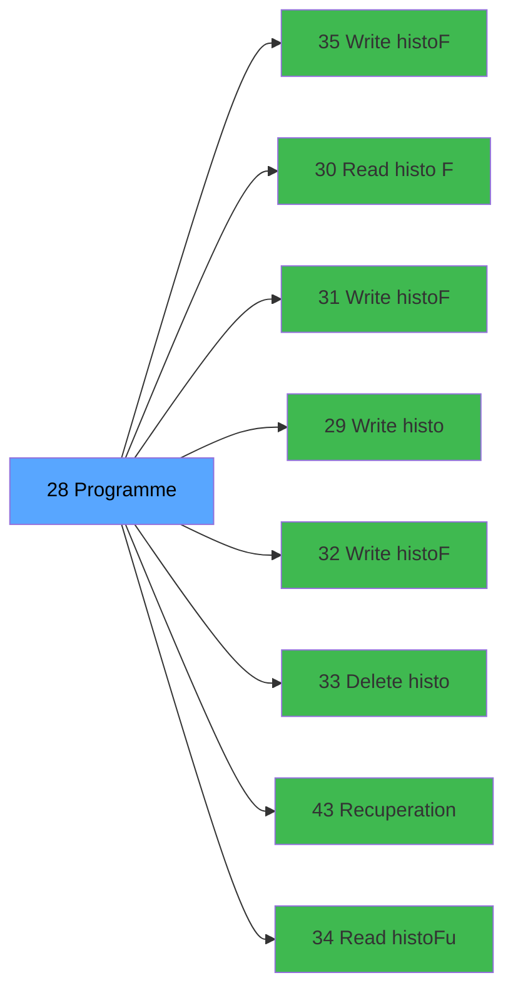

# ADH IDE 28 - Fusion

> **Version spec**: 3.5
> **Analyse**: 2026-01-27 17:56
> **Source**: `Prg_XXX.xml`

---

<!-- TAB:Fonctionnel -->

## SPECIFICATION FONCTIONNELLE

### 1.1 Objectif metier

| Element | Description |
|---------|-------------|
| **Qui** | Operateur |
| **Quoi** | Fusion
 |
| **Pourquoi** | A documenter |
| **Declencheur** | A identifier |

### 1.2 Regles metier

| Code | Regle | Condition |
|------|-------|-----------|
| RM-001 | A documenter | - |

### 1.3 Flux utilisateur

1. Demarrage programme
2. Traitement principal
3. Fin programme

### 1.4 Cas d'erreur

| Erreur | Comportement |
|--------|--------------|
| - | A documenter |

---

<!-- TAB:Technique -->

## SPECIFICATION TECHNIQUE

### 2.1 Identification

| Attribut | Valeur |
|----------|--------|
| **Format IDE** | ADH IDE 28 |
| **Description** | Fusion
 |
| **Module** | ADH |

### 2.2 Tables

| # | Nom logique | Nom physique | Acces | Usage |
|---|-------------|--------------|-------|-------|
| 15 | transac_entete_bar | `bartransacent` | **W** | 3x |
| 19 | bl_detail | `bldetail` | **W** | 3x |
| 23 | reseau_cloture___rec | `cafil001_dat` | R | 1x |
| 23 | reseau_cloture___rec | `cafil001_dat` | **W** | 4x |
| 29 | voyages__________voy | `cafil007_dat` | **W** | 3x |
| 30 | gm-recherche_____gmr | `cafil008_dat` | L | 1x |
| 30 | gm-recherche_____gmr | `cafil008_dat` | R | 6x |
| 30 | gm-recherche_____gmr | `cafil008_dat` | **W** | 1x |
| 31 | gm-complet_______gmc | `cafil009_dat` | R | 1x |
| 31 | gm-complet_______gmc | `cafil009_dat` | **W** | 1x |
| 32 | prestations | `cafil010_dat` | R | 1x |
| 32 | prestations | `cafil010_dat` | **W** | 2x |
| 33 | prestations______pre | `cafil011_dat` | R | 1x |
| 33 | prestations______pre | `cafil011_dat` | **W** | 2x |
| 34 | hebergement______heb | `cafil012_dat` | **W** | 3x |
| 35 | personnel_go______go | `cafil013_dat` | R | 1x |
| 35 | personnel_go______go | `cafil013_dat` | **W** | 1x |
| 36 | client_gm | `cafil014_dat` | **W** | 1x |
| 37 | commentaire_gm_________acc | `cafil015_dat` | R | 1x |
| 37 | commentaire_gm_________acc | `cafil015_dat` | **W** | 2x |
| 38 | comptable_gratuite | `cafil016_dat` | **W** | 3x |
| 39 | depot_garantie___dga | `cafil017_dat` | L | 3x |
| 39 | depot_garantie___dga | `cafil017_dat` | R | 1x |
| 39 | depot_garantie___dga | `cafil017_dat` | **W** | 2x |
| 40 | comptable________cte | `cafil018_dat` | R | 1x |
| 40 | comptable________cte | `cafil018_dat` | **W** | 2x |
| 41 | depot_objets_____doa | `cafil019_dat` | **W** | 3x |
| 42 | depot_devises____dda | `cafil020_dat` | **W** | 3x |
| 43 | solde_devises____sda | `cafil021_dat` | **W** | 2x |
| 44 | change___________chg | `cafil022_dat` | R | 1x |
| 44 | change___________chg | `cafil022_dat` | **W** | 1x |
| 46 | mvt_prestation___mpr | `cafil024_dat` | R | 1x |
| 46 | mvt_prestation___mpr | `cafil024_dat` | **W** | 2x |
| 47 | compte_gm________cgm | `cafil025_dat` | R | 1x |
| 47 | compte_gm________cgm | `cafil025_dat` | **W** | 11x |
| 48 | lignes_de_solde__sld | `cafil026_dat` | **W** | 3x |
| 51 | fusion_eclatementfec | `cafil029_dat` | R | 1x |
| 51 | fusion_eclatementfec | `cafil029_dat` | **W** | 3x |
| 70 | date_comptable___dat | `cafil048_dat` | R | 1x |
| 79 | gratuites________gra | `cafil057_dat` | R | 1x |
| 79 | gratuites________gra | `cafil057_dat` | **W** | 2x |
| 80 | codes_autocom____aut | `cafil058_dat` | R | 1x |
| 80 | codes_autocom____aut | `cafil058_dat` | **W** | 1x |
| 93 | vendeurs_________ven | `cafil071_dat` | **W** | 1x |
| 123 | fichier_messagerie | `cafil101_dat` | R | 1x |
| 123 | fichier_messagerie | `cafil101_dat` | **W** | 1x |
| 131 | fichier_validation | `cafil109_dat` | R | 1x |
| 131 | fichier_validation | `cafil109_dat` | **W** | 2x |
| 137 | fichier_histotel | `cafil115_dat` | R | 1x |
| 137 | fichier_histotel | `cafil115_dat` | **W** | 2x |
| 147 | change_vente_____chg | `cafil125_dat` | R | 1x |
| 147 | change_vente_____chg | `cafil125_dat` | **W** | 1x |
| 148 | lignes_de_solde__sld | `cafil126_dat` | **W** | 3x |
| 167 | troncon__________tro | `cafil145_dat` | **W** | 1x |
| 168 | heb_circuit______hci | `cafil146_dat` | **W** | 3x |
| 171 | commentaire______com | `cafil149_dat` | **W** | 1x |
| 263 | vente | `caisse_vente` | **W** | 2x |
| 266 | cc_comptable | `cccompta` | **W** | 4x |
| 268 | cc_total_par_type | `ccpartyp` | **W** | 3x |
| 271 | cc_total | `cctotal` | **W** | 3x |
| 272 | cc_type_detail | `cctypdet` | **W** | 3x |
| 285 | email | `email` | **W** | 1x |
| 298 | participants_____par | `excupar_dat` | **W** | 3x |
| 301 | details_partici__dpa | `excupta_dat` | **W** | 3x |
| 307 | vente_option_veo | `excuveo_dat` | **W** | 3x |
| 309 | vente____________vep | `excuvepe_dat` | **W** | 4x |
| 312 | ez_card | `ezcard` | R | 1x |
| 312 | ez_card | `ezcard` | **W** | 1x |
| 340 | histo_fusionseparation | `histo_fus_sep` | L | 1x |
| 340 | histo_fusionseparation | `histo_fus_sep` | R | 2x |
| 340 | histo_fusionseparation | `histo_fus_sep` | **W** | 2x |
| 342 | histo__fusionseparation_log | `histo_fus_sep_log` | L | 1x |
| 342 | histo__fusionseparation_log | `histo_fus_sep_log` | R | 1x |
| 343 | histo_fusionseparation_saisie | `histo_fus_sep_saisie` | L | 6x |
| 343 | histo_fusionseparation_saisie | `histo_fus_sep_saisie` | R | 2x |
| 343 | histo_fusionseparation_saisie | `histo_fus_sep_saisie` | **W** | 1x |
| 358 | import_mod | `moddossier_dat` | **W** | 3x |
| 366 | pms_print_param | `pmsprintparam` | **W** | 3x |
| 382 | pv_discount_reasons | `pv_discountlist_dat` | **W** | 1x |
| 463 | heure_de_passage | `verifpool_dat` | **W** | 3x |
| 786 | qualite_avant_reprise | `qualite_avant_reprise` | R | 1x |
| 786 | qualite_avant_reprise | `qualite_avant_reprise` | **W** | 1x |
| 804 | valeur_credit_bar_defaut | `valeur_credit_bar_defaut` | **W** | 1x |
| 805 | vente_par_moyen_paiement | `vente_par_moyen_paiement` | R | 1x |
| 805 | vente_par_moyen_paiement | `vente_par_moyen_paiement` | **W** | 2x |
| 807 | plafond_lit | `plafond_lit` | R | 1x |
| 807 | plafond_lit | `plafond_lit` | **W** | 2x |
| 831 | import_go_erreur_affection | `import_go_erreur_affection` | R | 1x |
| 831 | import_go_erreur_affection | `import_go_erreur_affection` | **W** | 2x |
| 834 | tpe_par_terminal | `tpe_par_terminal` | R | 1x |
| 834 | tpe_par_terminal | `tpe_par_terminal` | **W** | 2x |
| 837 | ##_pv_customer_dat | `##%club_user%_%term%_pv_customer` | R | 1x |
| 837 | ##_pv_customer_dat | `##%club_user%_%term%_pv_customer` | **W** | 2x |
| 947 | Table_947 | - | **W** | 3x |
| 1059 | Table_1059 | - | **W** | 1x |
### 2.3 Parametres d'entree

| Variable | Nom | Type | Picture |
|----------|-----|------|---------|
| - | Aucun parametre | - | - |
### 2.4 Algorigramme

### 2.5 Expressions cles

| IDE | Expression | Commentaire |
|-----|------------|-------------|
| 1 | `{0,1}` | - |
| 2 | `{0,13}<>'R'` | - |
| 3 | `{0,14}='V'` | - |
| 4 | `{0,14}<>'V'` | - |
| 5 | `'F'` | - |
| 6 | `{0,27}='F'` | - |
| 7 | `{0,27}<>'F'` | - |
| 8 | `'F'` | - |
| 9 | `Date ()` | - |
| 10 | `Time ()` | - |
| 11 | `{0,2}` | - |
| 12 | `{0,3}` | - |
| 13 | `28` | - |
| 14 | `{0,28}` | - |
| 15 | `NOT ({0,28})` | - |
| 16 | `''` | - |
| 17 | `0` | - |
| 18 | `'MERGE'` | - |
| 19 | `'FALSE'LOG` | - |
| 20 | `{0,30}` | - |

> **Total**: 81 expressions (affichees: 20)
### 2.6 Variables importantes

### 2.7 Statistiques

| Metrique | Valeur |
|----------|--------|
| **Taches** | 192 |
| **Lignes logique** | 3494 |
| **Lignes desactivees** | 0 |
---

<!-- TAB:Cartographie -->

## CARTOGRAPHIE APPLICATIVE

### 3.1 Chaine d'appels depuis Main

### 3.2 Callers directs

| IDE | Programme | Nb appels |
|-----|-----------|-----------|
| 37 | Menu changement compte | 1 |
### 3.3 Callees

| Niv | IDE | Programme | Nb appels |
|-----|-----|-----------|-----------|
| 1 | 35 | Write histo_Fus_Sep_Log | 13 |
| 1 | 30 | Read histo Fus_Sep_Det | 10 |
| 1 | 31 | Write histo_Fus_Sep_Det | 10 |
| 1 | 29 | Write histo Fus_Sep | 6 |
| 1 | 32 | Write histo_Fus_Sep_Saisie | 4 |
| 1 | 33 | Delete histo_Fus_Sep_Saisie | 2 |
| 1 | 43 | Recuperation du titre | 2 |
| 1 | 34 | Read histo_Fus_Sep_Log | 1 |
| 1 | 36 | Print Separation ou fusion | 1 |
| 1 | 179 | Get Printer | 1 |
| 1 | 180 | Printer choice | 1 |
| 1 | 181 | Set Listing Number | 1 |
| 1 | 182 | Raz Current Printer | 1 |
### 3.4 Verification orphelin

| Critere | Resultat |
|---------|----------|
| Callers actifs | A verifier |
| **Conclusion** | A analyser |

---

## HISTORIQUE

| Date | Action | Auteur |
|------|--------|--------|
| 2026-01-27 20:18 | **DATA V2** - Tables reelles, Expressions, Stats, CallChain | Script |
| 2026-01-27 19:44 | **DATA POPULATED** - Tables, Callgraph (81 expr) | Script |
| 2026-01-27 17:56 | **Upgrade V3.5** - TAB markers, Mermaid | Claude |

---

*Specification V3.5 - Format avec TAB markers et Mermaid*
