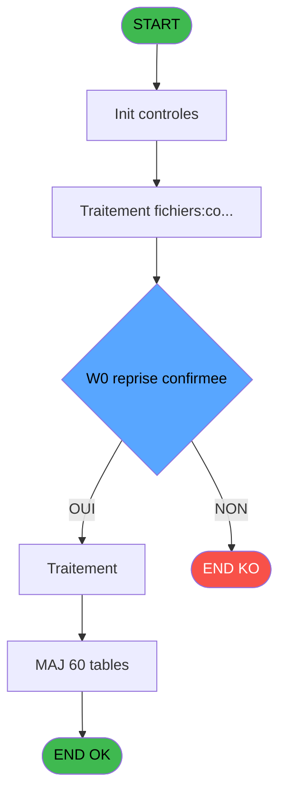

# ADH IDE 28 - Fusion

> **Analyse**: Phases 1-4 2026-02-07 03:41 -> 01:22 (21h41min) | Assemblage 01:22
> **Pipeline**: V7.2 Enrichi
> **Structure**: 4 onglets (Resume | Ecrans | Donnees | Connexions)

<!-- TAB:Resume -->

## 1. FICHE D'IDENTITE

| Attribut | Valeur |
|----------|--------|
| Projet | ADH |
| IDE Position | 28 |
| Nom Programme | Fusion |
| Fichier source | `Prg_28.xml` |
| Dossier IDE | General |
| Taches | 192 (11 ecrans visibles) |
| Tables modifiees | 60 |
| Programmes appeles | 13 |
| Complexite | **MOYENNE** (score 65/100) |

## 2. DESCRIPTION FONCTIONNELLE

**ADH IDE 28 - Fusion** est un programme de gestion administrative pour fusionner deux comptes clients dans le système. Ce programme orchestrate le processus complet de fusion en contrôlant les conditions préalables (test de clôture en cours, blocage réseau), en validant l'état des comptes sources et en enregistrant les transactions de fusion dans l'historique. La complexité moyenne (65/100) reflète les 192 tâches et 3494 lignes de logique répartis sur 6 tâches principales.

Le programme modifie 60 tables cibles, principalement les tables de gestion des comptes (compte_gm, fusion_eclatement, histo_fusionseparation) et des transactions (vente, cc_comptable, cc_total_par_type, prestations). Il s'intègre dans le flux de gestion des changements de compte en étant appelé depuis le menu "Changement de compte" (IDE 37), puis il déclenche une cascade d'opérations : lecture/écriture des détails de fusion, enregistrement des logs, gestion de l'impression du ticket de fusion, et suppression des données de saisie temporaires.

Toute la chaîne de fusion repose sur une validation stricte des blocages (clôture, réseau) et une traçabilité complète via les tables histo_fusionseparation, garantissant la récupération complète de l'historique et l'intégrité des données après la fusion.

## 3. BLOCS FONCTIONNELS

### 3.1 Traitement (131 taches)

Traitements internes.

---

#### 28 - (sans nom) [[ECRAN]](#ecran-t1)

**Role** : Tache d'orchestration : point d'entree du programme (131 sous-taches). Coordonne l'enchainement des traitements.
**Ecran** : 422 x 56 DLU (MDI) | [Voir mockup](#ecran-t1)

130 sous-taches directes

| Tache | Nom | Bloc |
|-------|-----|------|
| [28.1](#t2) | Test si cloture en cours | Traitement |
| [28.1.1](#t3) | Blocage cloture v1 | Traitement |
| [28.1.2](#t4) | Blocage cloture v1 | Traitement |
| [28.2](#t5) | Test reseau | Traitement |
| [28.3](#t6) | (sans nom) **[[ECRAN]](#ecran-t6)** | Traitement |
| [28.3.2](#t11) | Veuillez patienter... **[[ECRAN]](#ecran-t11)** | Traitement |
| [28.3.4](#t13) | Veuillez patienter... **[[ECRAN]](#ecran-t13)** | Traitement |
| [28.3.4.1](#t14) | Mise à Oui des filiations | Traitement |
| [28.3.5](#t15) | Genère filiations new | Traitement |
| [28.3.7](#t17) | listing garanties | Traitement |
| [28.3.8](#t18) | listing garanties | Traitement |
| [28.4](#t20) | Veuillez patienter... **[[ECRAN]](#ecran-t20)** | Traitement |
| [28.4.1](#t21) | Veuillez patienter ... **[[ECRAN]](#ecran-t21)** | Traitement |
| [28.4.1.2](#t23) | Suppression DGA | Traitement |
| [28.4.2](#t24) | Veuillez patienter ... **[[ECRAN]](#ecran-t24)** | Traitement |
| [28.4.2.1](#t25) | Suppression DGA | Traitement |
| [28.4.2.2](#t26) | Suppression DGA | Traitement |
| [28.4.3](#t27) | Veuillez patienter ... **[[ECRAN]](#ecran-t27)** | Traitement |
| [28.4.3.2](#t29) | Suppression DGA | Traitement |
| [28.4.4](#t30) | Veuillez patienter ... **[[ECRAN]](#ecran-t30)** | Traitement |
| [28.4.4.2](#t32) | Suppression DGA | Traitement |
| [28.4.5](#t33) | Veuillez patienter ... **[[ECRAN]](#ecran-t33)** | Traitement |
| [28.4.5.2](#t35) | Suppression DGA | Traitement |
| [28.4.6](#t36) | Veuillez patienter ... **[[ECRAN]](#ecran-t36)** | Traitement |
| [28.4.6.2](#t38) | Suppression DGA | Traitement |
| [28.4.7](#t39) | Veuillez patienter ... **[[ECRAN]](#ecran-t39)** | Traitement |
| [28.4.7.2](#t41) | Suppression DGA | Traitement |
| [28.4.9](#t43) | Veuillez patienter ... **[[ECRAN]](#ecran-t43)** | Traitement |
| [28.4.9.2](#t45) | Suppression DGA | Traitement |
| [28.4.10](#t46) | Veuillez patienter ... **[[ECRAN]](#ecran-t46)** | Traitement |
| [28.4.11](#t48) | Veuillez patienter ... **[[ECRAN]](#ecran-t48)** | Traitement |
| [28.4.12](#t50) | Veuillez patienter ... **[[ECRAN]](#ecran-t50)** | Traitement |
| [28.4.13](#t51) | Veuillez patienter ... **[[ECRAN]](#ecran-t51)** | Traitement |
| [28.4.14](#t52) | Veuillez patienter... **[[ECRAN]](#ecran-t52)** | Traitement |
| [28.4.15](#t53) | Veuillez patienter ... **[[ECRAN]](#ecran-t53)** | Traitement |
| [28.4.15.2](#t55) | Suppression DGA | Traitement |
| [28.4.16](#t56) | Veuillez patienter ... **[[ECRAN]](#ecran-t56)** | Traitement |
| [28.4.16.2](#t58) | Suppression DGA | Traitement |
| [28.4.17](#t59) | Veuillez patienter ... **[[ECRAN]](#ecran-t59)** | Traitement |
| [28.4.17.2](#t61) | Suppression DGA | Traitement |
| [28.4.18](#t62) | Veuillez patienter ... **[[ECRAN]](#ecran-t62)** | Traitement |
| [28.4.18.1](#t63) | Lecture CAM | Traitement |
| [28.4.19](#t65) | Veuillez patienter ... **[[ECRAN]](#ecran-t65)** | Traitement |
| [28.4.19.2](#t67) | Suppression DGA | Traitement |
| [28.4.20](#t68) | Veuillez patienter ... **[[ECRAN]](#ecran-t68)** | Traitement |
| [28.4.20.1](#t69) | Lecture CAM | Traitement |
| [28.4.21](#t71) | Veuillez patienter ... **[[ECRAN]](#ecran-t71)** | Traitement |
| [28.4.21.2](#t73) | Suppression DGA | Traitement |
| [28.4.22](#t74) | Veuillez patienter ... **[[ECRAN]](#ecran-t74)** | Traitement |
| [28.4.22.1](#t75) | Lecture CAM | Traitement |
| [28.4.23](#t77) | Veuillez patienter ... **[[ECRAN]](#ecran-t77)** | Traitement |
| [28.4.23.2](#t79) | Suppression DGA | Traitement |
| [28.4.24](#t80) | Veuillez patienter ... **[[ECRAN]](#ecran-t80)** | Traitement |
| [28.4.24.2](#t82) | Suppression DGA | Traitement |
| [28.4.25](#t83) | Veuillez patienter ... **[[ECRAN]](#ecran-t83)** | Traitement |
| [28.4.25.2](#t85) | Suppression DGA | Traitement |
| [28.4.26](#t86) | Veuillez patienter ... **[[ECRAN]](#ecran-t86)** | Traitement |
| [28.4.26.2](#t88) | Suppression DGA | Traitement |
| [28.4.27](#t89) | Veuillez patienter ... **[[ECRAN]](#ecran-t89)** | Traitement |
| [28.4.27.1](#t90) | Lecture | Traitement |
| [28.4.28.1](#t93) | Lecture | Traitement |
| [28.4.29](#t95) | Veuillez patienter ... **[[ECRAN]](#ecran-t95)** | Traitement |
| [28.4.29.2](#t97) | Suppression DGA | Traitement |
| [28.4.30](#t98) | Veuillez patienter ... **[[ECRAN]](#ecran-t98)** | Traitement |
| [28.4.30.2](#t100) | Suppression DGA | Traitement |
| [28.4.31](#t101) | Veuillez patienter ... **[[ECRAN]](#ecran-t101)** | Traitement |
| [28.4.31.1](#t102) | Suppression DGA | Traitement |
| [28.4.32](#t103) | Veuillez patienter ... **[[ECRAN]](#ecran-t103)** | Traitement |
| [28.4.33](#t104) | Veuillez patienter ... **[[ECRAN]](#ecran-t104)** | Traitement |
| [28.4.34](#t105) | Veuillez patienter ... **[[ECRAN]](#ecran-t105)** | Traitement |
| [28.4.35](#t108) | Veuillez patienter ... **[[ECRAN]](#ecran-t108)** | Traitement |
| [28.4.35.1](#t109) | Lecture CAM | Traitement |
| [28.4.36](#t111) | Veuillez patienter ... **[[ECRAN]](#ecran-t111)** | Traitement |
| [28.4.36.1](#t112) | Lecture CAM | Traitement |
| [28.4.37](#t114) | Veuillez patienter ... **[[ECRAN]](#ecran-t114)** | Traitement |
| [28.4.37.2](#t116) | Suppression DGA | Traitement |
| [28.4.38](#t117) | Veuillez patienter ... **[[ECRAN]](#ecran-t117)** | Traitement |
| [28.4.38.1](#t118) | Lecture CAM | Traitement |
| [28.4.39](#t120) | Veuilez patienter ... **[[ECRAN]](#ecran-t120)** | Traitement |
| [28.4.39.2](#t122) | Suppression DGA | Traitement |
| [28.4.40](#t123) | Veuillez patienter ... **[[ECRAN]](#ecran-t123)** | Traitement |
| [28.4.40.2](#t125) | Suppression DGA | Traitement |
| [28.4.41](#t126) | Veuillez patienter ... **[[ECRAN]](#ecran-t126)** | Traitement |
| [28.4.42](#t127) | Veuillez patienter ... **[[ECRAN]](#ecran-t127)** | Traitement |
| [28.4.43](#t128) | Veuillez patienter ... **[[ECRAN]](#ecran-t128)** | Traitement |
| [28.4.43.2](#t130) | Suppression DGA | Traitement |
| [28.4.44](#t131) | Veuillez patienter ... **[[ECRAN]](#ecran-t131)** | Traitement |
| [28.4.44.2](#t133) | Suppression DGA | Traitement |
| [28.4.44.3](#t134) | Suppression DGA | Traitement |
| [28.4.45](#t135) | Veuillez patienter ... **[[ECRAN]](#ecran-t135)** | Traitement |
| [28.4.45.2](#t137) | Suppression DGA | Traitement |
| [28.4.46](#t138) | Veuillez patienter ... **[[ECRAN]](#ecran-t138)** | Traitement |
| [28.4.46.2](#t140) | Suppression DGA | Traitement |
| [28.4.47](#t141) | Veuillez patienter ... **[[ECRAN]](#ecran-t141)** | Traitement |
| [28.4.47.2](#t143) | Suppression DGA | Traitement |
| [28.4.48](#t144) | Veuillez patienter... **[[ECRAN]](#ecran-t144)** | Traitement |
| [28.4.48.2](#t146) | Suppression DGA | Traitement |
| [28.4.49](#t147) | Veuillez patienter... **[[ECRAN]](#ecran-t147)** | Traitement |
| [28.4.49.2](#t149) | Suppression DGA | Traitement |
| [28.4.50](#t150) | Veuillez patienter... **[[ECRAN]](#ecran-t150)** | Traitement |
| [28.4.50.2](#t152) | Suppression DGA | Traitement |
| [28.4.51](#t153) | Veuillez patienter... **[[ECRAN]](#ecran-t153)** | Traitement |
| [28.4.51.2](#t155) | Suppression DGA | Traitement |
| [28.4.52](#t156) | Veuillez patienter... **[[ECRAN]](#ecran-t156)** | Traitement |
| [28.4.52.2](#t158) | Suppression DGA | Traitement |
| [28.4.53](#t159) | Veuillez patienter... **[[ECRAN]](#ecran-t159)** | Traitement |
| [28.4.53.2](#t161) | Suppression DGA | Traitement |
| [28.4.54](#t162) | Veuillez patienter... **[[ECRAN]](#ecran-t162)** | Traitement |
| [28.4.54.2](#t164) | Suppression DGA | Traitement |
| [28.4.55](#t165) | Veuillez patienter ... **[[ECRAN]](#ecran-t165)** | Traitement |
| [28.4.55.2](#t167) | Suppression DGA | Traitement |
| [28.4.56](#t168) | Veuillez patienter... **[[ECRAN]](#ecran-t168)** | Traitement |
| [28.4.57](#t169) | Veuillez patienter ... **[[ECRAN]](#ecran-t169)** | Traitement |
| [28.5](#t172) | Veuillez patienter... **[[ECRAN]](#ecran-t172)** | Traitement |
| [28.5.1](#t173) | Sejour | Traitement |
| [28.6](#t174) | Veuillez patienter... **[[ECRAN]](#ecran-t174)** | Traitement |
| [28.8](#t176) | Deblocage cloture v1 | Traitement |
| [28.9](#t177) | Deblocage cloture v1 | Traitement |
| [28.10](#t178) | Existe ecritures | Traitement |
| [28.11](#t179) | Lecture histo | Traitement |
| [28.11.1](#t180) | Chrono LOG reprise | Traitement |
| [28.15](#t184) | Veuillez patienter SVP ... **[[ECRAN]](#ecran-t184)** | Traitement |
| [28.16](#t185) | Reprise virtuelles | Traitement |
| [28.17](#t190) | Veuillez patienter... **[[ECRAN]](#ecran-t190)** | Traitement |
| [28.3.4.2](#t191) | View pointage **[[ECRAN]](#ecran-t191)** | Traitement |
| [28.4.2.3](#t192) | Update DGA | Traitement |
| [28.3.1.1.1](#t195) | (sans nom) | Traitement |
| [28.4.58](#t196) | Traitement VRLVSL | Traitement |
| [28.4.59](#t201) | Veuillez patienter ... **[[ECRAN]](#ecran-t201)** | Traitement |
| [28.4.59.2](#t203) | Suppression DGA | Traitement |

---

#### 28.1 - Test si cloture en cours

**Role** : Verification : Test si cloture en cours.

---

#### 28.1.1 - Blocage cloture v1

**Role** : Traitement : Blocage cloture v1.

---

#### 28.1.2 - Blocage cloture v1

**Role** : Traitement : Blocage cloture v1.

---

#### 28.2 - Test reseau

**Role** : Verification : Test reseau.
**Variables liees** : EZ (W0 reseau)

---

#### 28.3 - (sans nom) [[ECRAN]](#ecran-t6)

**Role** : Traitement interne.
**Ecran** : 640 x 128 DLU (MDI) | [Voir mockup](#ecran-t6)

---

#### 28.3.2 - Veuillez patienter... [[ECRAN]](#ecran-t11)

**Role** : Traitement : Veuillez patienter....
**Ecran** : 422 x 56 DLU (MDI) | [Voir mockup](#ecran-t11)

---

#### 28.3.4 - Veuillez patienter... [[ECRAN]](#ecran-t13)

**Role** : Traitement : Veuillez patienter....
**Ecran** : 424 x 57 DLU (MDI) | [Voir mockup](#ecran-t13)

---

#### 28.3.4.1 - Mise à Oui des filiations

**Role** : Traitement : Mise à Oui des filiations.

---

#### 28.3.5 - Genère filiations new

**Role** : Traitement : Genère filiations new.

---

#### 28.3.7 - listing garanties

**Role** : Traitement : listing garanties.

---

#### 28.3.8 - listing garanties

**Role** : Traitement : listing garanties.

---

#### 28.4 - Veuillez patienter... [[ECRAN]](#ecran-t20)

**Role** : Traitement : Veuillez patienter....
**Ecran** : 474 x 56 DLU (MDI) | [Voir mockup](#ecran-t20)

---

#### 28.4.1 - Veuillez patienter ... [[ECRAN]](#ecran-t21)

**Role** : Traitement : Veuillez patienter ....
**Ecran** : 382 x 103 DLU (MDI) | [Voir mockup](#ecran-t21)

---

#### 28.4.1.2 - Suppression DGA

**Role** : Traitement : Suppression DGA.

---

#### 28.4.2 - Veuillez patienter ... [[ECRAN]](#ecran-t24)

**Role** : Traitement : Veuillez patienter ....
**Ecran** : 406 x 60 DLU (MDI) | [Voir mockup](#ecran-t24)

---

#### 28.4.2.1 - Suppression DGA

**Role** : Traitement : Suppression DGA.

---

#### 28.4.2.2 - Suppression DGA

**Role** : Traitement : Suppression DGA.

---

#### 28.4.3 - Veuillez patienter ... [[ECRAN]](#ecran-t27)

**Role** : Traitement : Veuillez patienter ....
**Ecran** : 494 x 126 DLU (MDI) | [Voir mockup](#ecran-t27)

---

#### 28.4.3.2 - Suppression DGA

**Role** : Traitement : Suppression DGA.

---

#### 28.4.4 - Veuillez patienter ... [[ECRAN]](#ecran-t30)

**Role** : Traitement : Veuillez patienter ....
**Ecran** : 494 x 126 DLU (MDI) | [Voir mockup](#ecran-t30)

---

#### 28.4.4.2 - Suppression DGA

**Role** : Traitement : Suppression DGA.

---

#### 28.4.5 - Veuillez patienter ... [[ECRAN]](#ecran-t33)

**Role** : Traitement : Veuillez patienter ....
**Ecran** : 494 x 126 DLU (MDI) | [Voir mockup](#ecran-t33)

---

#### 28.4.5.2 - Suppression DGA

**Role** : Traitement : Suppression DGA.

---

#### 28.4.6 - Veuillez patienter ... [[ECRAN]](#ecran-t36)

**Role** : Traitement : Veuillez patienter ....
**Ecran** : 494 x 126 DLU (MDI) | [Voir mockup](#ecran-t36)

---

#### 28.4.6.2 - Suppression DGA

**Role** : Traitement : Suppression DGA.

---

#### 28.4.7 - Veuillez patienter ... [[ECRAN]](#ecran-t39)

**Role** : Traitement : Veuillez patienter ....
**Ecran** : 494 x 126 DLU (MDI) | [Voir mockup](#ecran-t39)

---

#### 28.4.7.2 - Suppression DGA

**Role** : Traitement : Suppression DGA.

---

#### 28.4.9 - Veuillez patienter ... [[ECRAN]](#ecran-t43)

**Role** : Traitement : Veuillez patienter ....
**Ecran** : 494 x 126 DLU (MDI) | [Voir mockup](#ecran-t43)

---

#### 28.4.9.2 - Suppression DGA

**Role** : Traitement : Suppression DGA.

---

#### 28.4.10 - Veuillez patienter ... [[ECRAN]](#ecran-t46)

**Role** : Traitement : Veuillez patienter ....
**Ecran** : 634 x 111 DLU (MDI) | [Voir mockup](#ecran-t46)

---

#### 28.4.11 - Veuillez patienter ... [[ECRAN]](#ecran-t48)

**Role** : Traitement : Veuillez patienter ....
**Ecran** : 634 x 111 DLU (MDI) | [Voir mockup](#ecran-t48)

---

#### 28.4.12 - Veuillez patienter ... [[ECRAN]](#ecran-t50)

**Role** : Traitement : Veuillez patienter ....
**Ecran** : 634 x 111 DLU (MDI) | [Voir mockup](#ecran-t50)

---

#### 28.4.13 - Veuillez patienter ... [[ECRAN]](#ecran-t51)

**Role** : Traitement : Veuillez patienter ....
**Ecran** : 634 x 111 DLU (MDI) | [Voir mockup](#ecran-t51)

---

#### 28.4.14 - Veuillez patienter... [[ECRAN]](#ecran-t52)

**Role** : Traitement : Veuillez patienter....
**Ecran** : 424 x 57 DLU (MDI) | [Voir mockup](#ecran-t52)

---

#### 28.4.15 - Veuillez patienter ... [[ECRAN]](#ecran-t53)

**Role** : Traitement : Veuillez patienter ....
**Ecran** : 506 x 119 DLU (MDI) | [Voir mockup](#ecran-t53)

---

#### 28.4.15.2 - Suppression DGA

**Role** : Traitement : Suppression DGA.

---

#### 28.4.16 - Veuillez patienter ... [[ECRAN]](#ecran-t56)

**Role** : Traitement : Veuillez patienter ....
**Ecran** : 642 x 111 DLU (MDI) | [Voir mockup](#ecran-t56)

---

#### 28.4.16.2 - Suppression DGA

**Role** : Traitement : Suppression DGA.

---

#### 28.4.17 - Veuillez patienter ... [[ECRAN]](#ecran-t59)

**Role** : Traitement : Veuillez patienter ....
**Ecran** : 637 x 109 DLU (MDI) | [Voir mockup](#ecran-t59)

---

#### 28.4.17.2 - Suppression DGA

**Role** : Traitement : Suppression DGA.

---

#### 28.4.18 - Veuillez patienter ... [[ECRAN]](#ecran-t62)

**Role** : Traitement : Veuillez patienter ....
**Ecran** : 403 x 105 DLU (MDI) | [Voir mockup](#ecran-t62)

---

#### 28.4.18.1 - Lecture CAM

**Role** : Traitement : Lecture CAM.

---

#### 28.4.19 - Veuillez patienter ... [[ECRAN]](#ecran-t65)

**Role** : Traitement : Veuillez patienter ....
**Ecran** : 406 x 107 DLU (MDI) | [Voir mockup](#ecran-t65)

---

#### 28.4.19.2 - Suppression DGA

**Role** : Traitement : Suppression DGA.

---

#### 28.4.20 - Veuillez patienter ... [[ECRAN]](#ecran-t68)

**Role** : Traitement : Veuillez patienter ....
**Ecran** : 394 x 107 DLU (MDI) | [Voir mockup](#ecran-t68)

---

#### 28.4.20.1 - Lecture CAM

**Role** : Traitement : Lecture CAM.

---

#### 28.4.21 - Veuillez patienter ... [[ECRAN]](#ecran-t71)

**Role** : Traitement : Veuillez patienter ....
**Ecran** : 530 x 107 DLU (MDI) | [Voir mockup](#ecran-t71)

---

#### 28.4.21.2 - Suppression DGA

**Role** : Traitement : Suppression DGA.

---

#### 28.4.22 - Veuillez patienter ... [[ECRAN]](#ecran-t74)

**Role** : Traitement : Veuillez patienter ....
**Ecran** : 358 x 108 DLU (MDI) | [Voir mockup](#ecran-t74)

---

#### 28.4.22.1 - Lecture CAM

**Role** : Traitement : Lecture CAM.

---

#### 28.4.23 - Veuillez patienter ... [[ECRAN]](#ecran-t77)

**Role** : Traitement : Veuillez patienter ....
**Ecran** : 382 x 103 DLU (MDI) | [Voir mockup](#ecran-t77)

---

#### 28.4.23.2 - Suppression DGA

**Role** : Traitement : Suppression DGA.

---

#### 28.4.24 - Veuillez patienter ... [[ECRAN]](#ecran-t80)

**Role** : Traitement : Veuillez patienter ....
**Ecran** : 386 x 101 DLU (MDI) | [Voir mockup](#ecran-t80)

---

#### 28.4.24.2 - Suppression DGA

**Role** : Traitement : Suppression DGA.

---

#### 28.4.25 - Veuillez patienter ... [[ECRAN]](#ecran-t83)

**Role** : Traitement : Veuillez patienter ....
**Ecran** : 525 x 102 DLU (MDI) | [Voir mockup](#ecran-t83)

---

#### 28.4.25.2 - Suppression DGA

**Role** : Traitement : Suppression DGA.

---

#### 28.4.26 - Veuillez patienter ... [[ECRAN]](#ecran-t86)

**Role** : Traitement : Veuillez patienter ....
**Ecran** : 526 x 103 DLU (MDI) | [Voir mockup](#ecran-t86)

---

#### 28.4.26.2 - Suppression DGA

**Role** : Traitement : Suppression DGA.

---

#### 28.4.27 - Veuillez patienter ... [[ECRAN]](#ecran-t89)

**Role** : Traitement : Veuillez patienter ....
**Ecran** : 650 x 102 DLU (MDI) | [Voir mockup](#ecran-t89)

---

#### 28.4.27.1 - Lecture

**Role** : Traitement : Lecture.

---

#### 28.4.28.1 - Lecture

**Role** : Traitement : Lecture.

---

#### 28.4.29 - Veuillez patienter ... [[ECRAN]](#ecran-t95)

**Role** : Traitement : Veuillez patienter ....
**Ecran** : 390 x 106 DLU (MDI) | [Voir mockup](#ecran-t95)

---

#### 28.4.29.2 - Suppression DGA

**Role** : Traitement : Suppression DGA.

---

#### 28.4.30 - Veuillez patienter ... [[ECRAN]](#ecran-t98)

**Role** : Traitement : Veuillez patienter ....
**Ecran** : 389 x 103 DLU (MDI) | [Voir mockup](#ecran-t98)

---

#### 28.4.30.2 - Suppression DGA

**Role** : Traitement : Suppression DGA.

---

#### 28.4.31 - Veuillez patienter ... [[ECRAN]](#ecran-t101)

**Role** : Traitement : Veuillez patienter ....
**Ecran** : 386 x 102 DLU (MDI) | [Voir mockup](#ecran-t101)

---

#### 28.4.31.1 - Suppression DGA

**Role** : Traitement : Suppression DGA.

---

#### 28.4.32 - Veuillez patienter ... [[ECRAN]](#ecran-t103)

**Role** : Traitement : Veuillez patienter ....
**Ecran** : 411 x 76 DLU (MDI) | [Voir mockup](#ecran-t103)

---

#### 28.4.33 - Veuillez patienter ... [[ECRAN]](#ecran-t104)

**Role** : Traitement : Veuillez patienter ....
**Ecran** : 528 x 102 DLU (MDI) | [Voir mockup](#ecran-t104)

---

#### 28.4.34 - Veuillez patienter ... [[ECRAN]](#ecran-t105)

**Role** : Traitement : Veuillez patienter ....
**Ecran** : 389 x 36 DLU (MDI) | [Voir mockup](#ecran-t105)

---

#### 28.4.35 - Veuillez patienter ... [[ECRAN]](#ecran-t108)

**Role** : Traitement : Veuillez patienter ....
**Ecran** : 378 x 104 DLU (MDI) | [Voir mockup](#ecran-t108)

---

#### 28.4.35.1 - Lecture CAM

**Role** : Traitement : Lecture CAM.

---

#### 28.4.36 - Veuillez patienter ... [[ECRAN]](#ecran-t111)

**Role** : Traitement : Veuillez patienter ....
**Ecran** : 389 x 102 DLU (MDI) | [Voir mockup](#ecran-t111)

---

#### 28.4.36.1 - Lecture CAM

**Role** : Traitement : Lecture CAM.

---

#### 28.4.37 - Veuillez patienter ... [[ECRAN]](#ecran-t114)

**Role** : Traitement : Veuillez patienter ....
**Ecran** : 390 x 102 DLU (MDI) | [Voir mockup](#ecran-t114)

---

#### 28.4.37.2 - Suppression DGA

**Role** : Traitement : Suppression DGA.

---

#### 28.4.38 - Veuillez patienter ... [[ECRAN]](#ecran-t117)

**Role** : Traitement : Veuillez patienter ....
**Ecran** : 389 x 102 DLU (MDI) | [Voir mockup](#ecran-t117)

---

#### 28.4.38.1 - Lecture CAM

**Role** : Traitement : Lecture CAM.

---

#### 28.4.39 - Veuilez patienter ... [[ECRAN]](#ecran-t120)

**Role** : Traitement : Veuilez patienter ....
**Ecran** : 378 x 104 DLU (MDI) | [Voir mockup](#ecran-t120)

---

#### 28.4.39.2 - Suppression DGA

**Role** : Traitement : Suppression DGA.

---

#### 28.4.40 - Veuillez patienter ... [[ECRAN]](#ecran-t123)

**Role** : Traitement : Veuillez patienter ....
**Ecran** : 480 x 104 DLU (MDI) | [Voir mockup](#ecran-t123)

---

#### 28.4.40.2 - Suppression DGA

**Role** : Traitement : Suppression DGA.

---

#### 28.4.41 - Veuillez patienter ... [[ECRAN]](#ecran-t126)

**Role** : Traitement : Veuillez patienter ....
**Ecran** : 507 x 103 DLU (MDI) | [Voir mockup](#ecran-t126)

---

#### 28.4.42 - Veuillez patienter ... [[ECRAN]](#ecran-t127)

**Role** : Traitement : Veuillez patienter ....
**Ecran** : 498 x 103 DLU (MDI) | [Voir mockup](#ecran-t127)

---

#### 28.4.43 - Veuillez patienter ... [[ECRAN]](#ecran-t128)

**Role** : Traitement : Veuillez patienter ....
**Ecran** : 379 x 103 DLU (MDI) | [Voir mockup](#ecran-t128)

---

#### 28.4.43.2 - Suppression DGA

**Role** : Traitement : Suppression DGA.

---

#### 28.4.44 - Veuillez patienter ... [[ECRAN]](#ecran-t131)

**Role** : Traitement : Veuillez patienter ....
**Ecran** : 382 x 103 DLU (MDI) | [Voir mockup](#ecran-t131)

---

#### 28.4.44.2 - Suppression DGA

**Role** : Traitement : Suppression DGA.

---

#### 28.4.44.3 - Suppression DGA

**Role** : Traitement : Suppression DGA.

---

#### 28.4.45 - Veuillez patienter ... [[ECRAN]](#ecran-t135)

**Role** : Traitement : Veuillez patienter ....
**Ecran** : 382 x 103 DLU (MDI) | [Voir mockup](#ecran-t135)

---

#### 28.4.45.2 - Suppression DGA

**Role** : Traitement : Suppression DGA.

---

#### 28.4.46 - Veuillez patienter ... [[ECRAN]](#ecran-t138)

**Role** : Traitement : Veuillez patienter ....
**Ecran** : 382 x 103 DLU (MDI) | [Voir mockup](#ecran-t138)

---

#### 28.4.46.2 - Suppression DGA

**Role** : Traitement : Suppression DGA.

---

#### 28.4.47 - Veuillez patienter ... [[ECRAN]](#ecran-t141)

**Role** : Traitement : Veuillez patienter ....
**Ecran** : 382 x 103 DLU (MDI) | [Voir mockup](#ecran-t141)

---

#### 28.4.47.2 - Suppression DGA

**Role** : Traitement : Suppression DGA.

---

#### 28.4.48 - Veuillez patienter... [[ECRAN]](#ecran-t144)

**Role** : Traitement : Veuillez patienter....
**Ecran** : 424 x 56 DLU (MDI) | [Voir mockup](#ecran-t144)

---

#### 28.4.48.2 - Suppression DGA

**Role** : Traitement : Suppression DGA.

---

#### 28.4.49 - Veuillez patienter... [[ECRAN]](#ecran-t147)

**Role** : Traitement : Veuillez patienter....
**Ecran** : 424 x 56 DLU (MDI) | [Voir mockup](#ecran-t147)

---

#### 28.4.49.2 - Suppression DGA

**Role** : Traitement : Suppression DGA.

---

#### 28.4.50 - Veuillez patienter... [[ECRAN]](#ecran-t150)

**Role** : Traitement : Veuillez patienter....
**Ecran** : 424 x 56 DLU (MDI) | [Voir mockup](#ecran-t150)

---

#### 28.4.50.2 - Suppression DGA

**Role** : Traitement : Suppression DGA.

---

#### 28.4.51 - Veuillez patienter... [[ECRAN]](#ecran-t153)

**Role** : Traitement : Veuillez patienter....
**Ecran** : 424 x 56 DLU (MDI) | [Voir mockup](#ecran-t153)

---

#### 28.4.51.2 - Suppression DGA

**Role** : Traitement : Suppression DGA.

---

#### 28.4.52 - Veuillez patienter... [[ECRAN]](#ecran-t156)

**Role** : Traitement : Veuillez patienter....
**Ecran** : 424 x 56 DLU (MDI) | [Voir mockup](#ecran-t156)

---

#### 28.4.52.2 - Suppression DGA

**Role** : Traitement : Suppression DGA.

---

#### 28.4.53 - Veuillez patienter... [[ECRAN]](#ecran-t159)

**Role** : Traitement : Veuillez patienter....
**Ecran** : 424 x 56 DLU (MDI) | [Voir mockup](#ecran-t159)

---

#### 28.4.53.2 - Suppression DGA

**Role** : Traitement : Suppression DGA.

---

#### 28.4.54 - Veuillez patienter... [[ECRAN]](#ecran-t162)

**Role** : Traitement : Veuillez patienter....
**Ecran** : 424 x 56 DLU (MDI) | [Voir mockup](#ecran-t162)

---

#### 28.4.54.2 - Suppression DGA

**Role** : Traitement : Suppression DGA.

---

#### 28.4.55 - Veuillez patienter ... [[ECRAN]](#ecran-t165)

**Role** : Traitement : Veuillez patienter ....
**Ecran** : 382 x 103 DLU (MDI) | [Voir mockup](#ecran-t165)

---

#### 28.4.55.2 - Suppression DGA

**Role** : Traitement : Suppression DGA.

---

#### 28.4.56 - Veuillez patienter... [[ECRAN]](#ecran-t168)

**Role** : Traitement : Veuillez patienter....
**Ecran** : 424 x 56 DLU (MDI) | [Voir mockup](#ecran-t168)

---

#### 28.4.57 - Veuillez patienter ... [[ECRAN]](#ecran-t169)

**Role** : Traitement : Veuillez patienter ....
**Ecran** : 494 x 126 DLU (MDI) | [Voir mockup](#ecran-t169)

---

#### 28.5 - Veuillez patienter... [[ECRAN]](#ecran-t172)

**Role** : Traitement : Veuillez patienter....
**Ecran** : 422 x 57 DLU (MDI) | [Voir mockup](#ecran-t172)

---

#### 28.5.1 - Sejour

**Role** : Traitement : Sejour.

---

#### 28.6 - Veuillez patienter... [[ECRAN]](#ecran-t174)

**Role** : Traitement : Veuillez patienter....
**Ecran** : 426 x 57 DLU (MDI) | [Voir mockup](#ecran-t174)

---

#### 28.8 - Deblocage cloture v1

**Role** : Traitement : Deblocage cloture v1.

---

#### 28.9 - Deblocage cloture v1

**Role** : Traitement : Deblocage cloture v1.

---

#### 28.10 - Existe ecritures

**Role** : Traitement : Existe ecritures.
**Variables liees** : FH (W0 Existe ecriture), FO (W0 code LOG existe)

---

#### 28.11 - Lecture histo

**Role** : Traitement : Lecture histo.
**Variables liees** : EX (P0.Chrono histo sans interface), FN (W0 chrono histo)

---

#### 28.11.1 - Chrono LOG reprise

**Role** : Traitement : Chrono LOG reprise.
**Variables liees** : EV (P0 Reprise Auto), EX (P0.Chrono histo sans interface), FJ (W0 reprise), FK (W0 chrono reprise), FN (W0 chrono histo)

---

#### 28.15 - Veuillez patienter SVP ... [[ECRAN]](#ecran-t184)

**Role** : Traitement : Veuillez patienter SVP ....
**Ecran** : 422 x 56 DLU (MDI) | [Voir mockup](#ecran-t184)

---

#### 28.16 - Reprise virtuelles

**Role** : Traitement : Reprise virtuelles.
**Variables liees** : EV (P0 Reprise Auto), FJ (W0 reprise), FK (W0 chrono reprise), FQ (W0 reprise confirmee)

---

#### 28.17 - Veuillez patienter... [[ECRAN]](#ecran-t190)

**Role** : Traitement : Veuillez patienter....
**Ecran** : 426 x 57 DLU (MDI) | [Voir mockup](#ecran-t190)

---

#### 28.3.4.2 - View pointage [[ECRAN]](#ecran-t191)

**Role** : Traitement : View pointage.
**Ecran** : 1066 x 0 DLU | [Voir mockup](#ecran-t191)

---

#### 28.4.2.3 - Update DGA

**Role** : Traitement : Update DGA.

---

#### 28.3.1.1.1 - (sans nom)

**Role** : Traitement interne.

---

#### 28.4.58 - Traitement VRLVSL

**Role** : Traitement : Traitement VRLVSL.

---

#### 28.4.59 - Veuillez patienter ... [[ECRAN]](#ecran-t201)

**Role** : Traitement : Veuillez patienter ....
**Ecran** : 382 x 103 DLU (MDI) | [Voir mockup](#ecran-t201)

---

#### 28.4.59.2 - Suppression DGA

**Role** : Traitement : Suppression DGA.

### 3.2 Consultation (4 taches)

Ecrans de recherche et consultation.

---

#### 28.3.1 - Selection GM [[ECRAN]](#ecran-t7)

**Role** : Selection par l'operateur : Selection GM.
**Ecran** : 1074 x 208 DLU (MDI) | [Voir mockup](#ecran-t7)

---

#### 28.3.6 - Recherche d'un GM [[ECRAN]](#ecran-t16)

**Role** : Traitement : Recherche d'un GM.
**Ecran** : 680 x 90 DLU (MDI) | [Voir mockup](#ecran-t16)

---

#### 28.3.9 - Choix de la garantie [[ECRAN]](#ecran-t19)

**Role** : Selection par l'operateur : Choix de la garantie.
**Ecran** : 680 x 90 DLU (MDI) | [Voir mockup](#ecran-t19)
**Variables liees** : FR (W0 Compte garantie à conserver), FS (W0 Filiation garantie à conserv), FT (W0 Garantie Club à conserver?)

---

#### 28.7 - Reaffichage infos reseau

**Role** : Reinitialisation : Reaffichage infos reseau.
**Variables liees** : EZ (W0 reseau)

### 3.3 Calcul (8 taches)

Calculs metier : montants, stocks, compteurs.

---

#### 28.3.1.1 - Lect. Etat du compte

**Role** : Traitement : Lect. Etat du compte.
**Variables liees** : FF (W0 qualite compte), FR (W0 Compte garantie à conserver), FU (W0 Compte utilisé modifié?), FV (W0 Compte remplace à la sortie)

---

#### 28.3.1.2 - Blocage comptes selectionnes [[ECRAN]](#ecran-t9)

**Role** : Selection par l'operateur : Blocage comptes selectionnes.
**Ecran** : 120 x 8 DLU (MDI) | [Voir mockup](#ecran-t9)

---

#### 28.3.1.3 - Blocage comptes selectionnes [[ECRAN]](#ecran-t10)

**Role** : Selection par l'operateur : Blocage comptes selectionnes.
**Ecran** : 120 x 8 DLU (MDI) | [Voir mockup](#ecran-t10)

---

#### 28.4.10.1 - Calcul solde compte cible

**Role** : Calcul : Calcul solde compte cible.
**Variables liees** : ER (P0 solde), ES (P0 date limite solde), FF (W0 qualite compte), FR (W0 Compte garantie à conserver), FU (W0 Compte utilisé modifié?)

---

#### 28.4.11.1 - Calcul solde compte cible

**Role** : Calcul : Calcul solde compte cible.
**Variables liees** : ER (P0 solde), ES (P0 date limite solde), FF (W0 qualite compte), FR (W0 Compte garantie à conserver), FU (W0 Compte utilisé modifié?)

---

#### 28.12 - Calcul compte GM

**Role** : Calcul : Calcul compte GM.
**Variables liees** : FF (W0 qualite compte), FR (W0 Compte garantie à conserver), FU (W0 Compte utilisé modifié?), FV (W0 Compte remplace à la sortie)

---

#### 28.4.2.4 - MaJ Flag Compte Garanti

**Role** : Traitement : MaJ Flag Compte Garanti.
**Variables liees** : FF (W0 qualite compte), FR (W0 Compte garantie à conserver), FS (W0 Filiation garantie à conserv), FT (W0 Garantie Club à conserver?), FU (W0 Compte utilisé modifié?)

---

#### 28.4.2.5 - Get Compte Tempo

**Role** : Consultation/chargement : Get Compte Tempo.
**Variables liees** : FF (W0 qualite compte), FR (W0 Compte garantie à conserver), FU (W0 Compte utilisé modifié?), FV (W0 Compte remplace à la sortie)

### 3.4 Validation (1 tache)

Controles de coherence : 1 tache verifie les donnees et conditions.

---

#### 28.3.3 - Validation [[ECRAN]](#ecran-t12)

**Role** : Verification : Validation.
**Ecran** : 72 x 8 DLU (MDI) | [Voir mockup](#ecran-t12)
**Variables liees** : FA (W0 validation)

### 3.5 Creation (47 taches)

Insertion de nouveaux enregistrements en base.

---

#### 28.4.1.1 - Creation DGA

**Role** : Creation d'enregistrement : Creation DGA.

---

#### 28.4.3.1 - Creation DGA

**Role** : Creation d'enregistrement : Creation DGA.

---

#### 28.4.4.1 - Creation DGA

**Role** : Creation d'enregistrement : Creation DGA.

---

#### 28.4.5.1 - Creation DGA

**Role** : Creation d'enregistrement : Creation DGA.

---

#### 28.4.6.1 - Creation DGA

**Role** : Creation d'enregistrement : Creation DGA.

---

#### 28.4.7.1 - Creation DGA

**Role** : Creation d'enregistrement : Creation DGA.

---

#### 28.4.8 - Creation FEC [[ECRAN]](#ecran-t42)

**Role** : Creation d'enregistrement : Creation FEC.
**Ecran** : 422 x 57 DLU (MDI) | [Voir mockup](#ecran-t42)

---

#### 28.4.9.1 - Creation DGA

**Role** : Creation d'enregistrement : Creation DGA.

---

#### 28.4.15.1 - Creation DGA

**Role** : Creation d'enregistrement : Creation DGA.

---

#### 28.4.16.1 - Creation DGA

**Role** : Creation d'enregistrement : Creation DGA.

---

#### 28.4.17.1 - Creation DGA

**Role** : Creation d'enregistrement : Creation DGA.

---

#### 28.4.18.2 - Creation DGA

**Role** : Creation d'enregistrement : Creation DGA.

---

#### 28.4.19.1 - Creation DGA

**Role** : Creation d'enregistrement : Creation DGA.

---

#### 28.4.20.2 - Creation DGA

**Role** : Creation d'enregistrement : Creation DGA.

---

#### 28.4.21.1 - Creation DGA

**Role** : Creation d'enregistrement : Creation DGA.

---

#### 28.4.22.2 - Creation DGA

**Role** : Creation d'enregistrement : Creation DGA.

---

#### 28.4.23.1 - Creation DGA

**Role** : Creation d'enregistrement : Creation DGA.

---

#### 28.4.24.1 - Creation DGA

**Role** : Creation d'enregistrement : Creation DGA.

---

#### 28.4.25.1 - Creation DGA

**Role** : Creation d'enregistrement : Creation DGA.

---

#### 28.4.26.1 - Creation DGA

**Role** : Creation d'enregistrement : Creation DGA.

---

#### 28.4.27.2 - Creation DGA

**Role** : Creation d'enregistrement : Creation DGA.

---

#### 28.4.28.2 - Creation DGA

**Role** : Creation d'enregistrement : Creation DGA.

---

#### 28.4.29.1 - Creation DGA

**Role** : Creation d'enregistrement : Creation DGA.

---

#### 28.4.30.1 - Creation DGA

**Role** : Creation d'enregistrement : Creation DGA.

---

#### 28.4.35.2 - Creation DGA

**Role** : Creation d'enregistrement : Creation DGA.

---

#### 28.4.36.2 - Creation DGA

**Role** : Creation d'enregistrement : Creation DGA.

---

#### 28.4.37.1 - Creation DGA

**Role** : Creation d'enregistrement : Creation DGA.

---

#### 28.4.38.2 - Creation DGA

**Role** : Creation d'enregistrement : Creation DGA.

---

#### 28.4.39.1 - Creation DGA

**Role** : Creation d'enregistrement : Creation DGA.

---

#### 28.4.40.1 - Creation DGA

**Role** : Creation d'enregistrement : Creation DGA.

---

#### 28.4.43.1 - Creation DGA

**Role** : Creation d'enregistrement : Creation DGA.

---

#### 28.4.44.1 - Creation DGA

**Role** : Creation d'enregistrement : Creation DGA.

---

#### 28.4.45.1 - Creation DGA

**Role** : Creation d'enregistrement : Creation DGA.

---

#### 28.4.46.1 - Creation DGA

**Role** : Creation d'enregistrement : Creation DGA.

---

#### 28.4.47.1 - Creation DGA

**Role** : Creation d'enregistrement : Creation DGA.

---

#### 28.4.48.1 - Creation DGA

**Role** : Creation d'enregistrement : Creation DGA.

---

#### 28.4.49.1 - Creation DGA

**Role** : Creation d'enregistrement : Creation DGA.

---

#### 28.4.50.1 - Creation DGA

**Role** : Creation d'enregistrement : Creation DGA.

---

#### 28.4.51.1 - Creation DGA

**Role** : Creation d'enregistrement : Creation DGA.

---

#### 28.4.52.1 - Creation DGA

**Role** : Creation d'enregistrement : Creation DGA.

---

#### 28.4.53.1 - Creation DGA

**Role** : Creation d'enregistrement : Creation DGA.

---

#### 28.4.54.1 - Creation DGA

**Role** : Creation d'enregistrement : Creation DGA.

---

#### 28.4.55.1 - Creation DGA

**Role** : Creation d'enregistrement : Creation DGA.

---

#### 28.13 - creation histo

**Role** : Creation d'enregistrement : creation histo.
**Variables liees** : EX (P0.Chrono histo sans interface), FN (W0 chrono histo)

---

#### 28.14 - creation histo

**Role** : Creation d'enregistrement : creation histo.
**Variables liees** : EX (P0.Chrono histo sans interface), FN (W0 chrono histo)

---

#### 28.4.49.3 - Creation

**Role** : Creation d'enregistrement : Creation.

---

#### 28.4.59.1 - Creation DGA

**Role** : Creation d'enregistrement : Creation DGA.

### 3.6 Saisie (1 tache)

L'operateur saisit les donnees de la transaction via 1 ecran (Traitement CHG vente).

---

#### 28.4.28 - Traitement CHG vente [[ECRAN]](#ecran-t92)

**Role** : Saisie des donnees : Traitement CHG vente.
**Ecran** : 629 x 77 DLU (MDI) | [Voir mockup](#ecran-t92)
**Delegue a** : [Write histo_Fus_Sep_Saisie (IDE 32)](ADH-IDE-32.md), [Delete histo_Fus_Sep_Saisie (IDE 33)](ADH-IDE-33.md)

## 5. REGLES METIER

13 regles identifiees:

### Validation (2 regles)

#### [RM-002] Condition: W0 validation [N] egale 'V'

| Element | Detail |
|---------|--------|
| **Condition** | `W0 validation [N]='V'` |
| **Si vrai** | Action si vrai |
| **Variables** | FA (W0 validation) |
| **Expression source** | Expression 3 : `W0 validation [N]='V'` |
| **Exemple** | Si W0 validation [N]='V' → Action si vrai |
| **Impact** | [28.3.3 - Validation](#t12) |

#### [RM-003] Condition: W0 validation [N] different de 'V'

| Element | Detail |
|---------|--------|
| **Condition** | `W0 validation [N]<>'V'` |
| **Si vrai** | Action si vrai |
| **Variables** | FA (W0 validation) |
| **Expression source** | Expression 4 : `W0 validation [N]<>'V'` |
| **Exemple** | Si W0 validation [N]<>'V' → Action si vrai |
| **Impact** | [28.3.3 - Validation](#t12) |

### Saisie (8 regles)

#### [RM-001] Condition: W0 reseau [M] different de 'R'

| Element | Detail |
|---------|--------|
| **Condition** | `W0 reseau [M]<>'R'` |
| **Si vrai** | Action si vrai |
| **Variables** | EZ (W0 reseau) |
| **Expression source** | Expression 2 : `W0 reseau [M]<>'R'` |
| **Exemple** | Si W0 reseau [M]<>'R' → Action si vrai |
| **Impact** | Bloc Saisie |

#### [RM-004] Condition: W0 chrono histo [BA] egale 'F'

| Element | Detail |
|---------|--------|
| **Condition** | `W0 chrono histo [BA]='F'` |
| **Si vrai** | Action si vrai |
| **Variables** | FN (W0 chrono histo) |
| **Expression source** | Expression 6 : `W0 chrono histo [BA]='F'` |
| **Exemple** | Si W0 chrono histo [BA]='F' → Action si vrai |
| **Impact** | [28.11.1 - Chrono LOG reprise](#t180) |

#### [RM-005] Condition: W0 chrono histo [BA] different de 'F'

| Element | Detail |
|---------|--------|
| **Condition** | `W0 chrono histo [BA]<>'F'` |
| **Si vrai** | Action si vrai |
| **Variables** | FN (W0 chrono histo) |
| **Expression source** | Expression 7 : `W0 chrono histo [BA]<>'F'` |
| **Exemple** | Si W0 chrono histo [BA]<>'F' → Action si vrai |
| **Impact** | [28.11.1 - Chrono LOG reprise](#t180) |

#### [RM-006] Negation de (W0 code LOG existe [BB]) (condition inversee)

| Element | Detail |
|---------|--------|
| **Condition** | `NOT (W0 code LOG existe [BB])` |
| **Si vrai** | Action si vrai |
| **Variables** | FO (W0 code LOG existe) |
| **Expression source** | Expression 15 : `NOT (W0 code LOG existe [BB])` |
| **Exemple** | Si NOT (W0 code LOG existe [BB]) → Action si vrai |
| **Impact** | [28.10 - Existe ecritures](#t178) |

#### [RM-007] Si W0 Filiation garantie ... [BF] alors IF (W0 reprise confirmee [BD] sinon 'RETRY','DONE'),'PASSED')

| Element | Detail |
|---------|--------|
| **Condition** | `W0 Filiation garantie ... [BF]` |
| **Si vrai** | IF (W0 reprise confirmee [BD] |
| **Si faux** | 'RETRY','DONE'),'PASSED') |
| **Variables** | FJ (W0 reprise), FQ (W0 reprise confirmee) |
| **Expression source** | Expression 57 : `IF (W0 Filiation garantie ... [BF],IF (W0 reprise confirmee ` |
| **Exemple** | Si W0 Filiation garantie ... [BF] → IF (W0 reprise confirmee [BD]. Sinon → 'RETRY','DONE'),'PASSED') |
| **Impact** | [28.16 - Reprise virtuelles](#t185) |

#### [RM-008] Negation de (W0 reprise confirmee [BD]) (condition inversee)

| Element | Detail |
|---------|--------|
| **Condition** | `NOT (W0 reprise confirmee [BD])` |
| **Si vrai** | Action si vrai |
| **Variables** | FJ (W0 reprise), FQ (W0 reprise confirmee) |
| **Expression source** | Expression 60 : `NOT (W0 reprise confirmee [BD])` |
| **Exemple** | Si NOT (W0 reprise confirmee [BD]) → Action si vrai |
| **Impact** | [28.16 - Reprise virtuelles](#t185) |

#### [RM-009] Negation de (W0 Compte remplace à l... [BI]) (condition inversee)

| Element | Detail |
|---------|--------|
| **Condition** | `NOT (W0 Compte remplace à l... [BI])` |
| **Si vrai** | Action si vrai |
| **Expression source** | Expression 68 : `NOT (W0 Compte remplace à l... [BI])` |
| **Exemple** | Si NOT (W0 Compte remplace à l... [BI]) → Action si vrai |
| **Impact** | Bloc Saisie |

#### [RM-011] Condition toujours vraie (flag actif)

| Element | Detail |
|---------|--------|
| **Condition** | `W0 reprise confirmee [BD]` |
| **Si vrai** | ExpCalc('71'EXP) |
| **Si faux** | 'TRUE'LOG) |
| **Variables** | FJ (W0 reprise), FQ (W0 reprise confirmee) |
| **Expression source** | Expression 72 : `IF (W0 reprise confirmee [BD],ExpCalc('71'EXP),'TRUE'LOG)` |
| **Exemple** | Si W0 reprise confirmee [BD] → ExpCalc('71'EXP). Sinon → 'TRUE'LOG) |
| **Impact** | [28.16 - Reprise virtuelles](#t185) |

### Autres (3 regles)

#### [RM-010] Condition composite: [BK]=6 OR P0 Reprise Auto [I]

| Element | Detail |
|---------|--------|
| **Condition** | `[BK]=6 OR P0 Reprise Auto [I]` |
| **Si vrai** | Action si vrai |
| **Variables** | EV (P0 Reprise Auto) |
| **Expression source** | Expression 71 : `[BK]=6 OR P0 Reprise Auto [I]` |
| **Exemple** | Si [BK]=6 OR P0 Reprise Auto [I] → Action si vrai |
| **Impact** | [28.16 - Reprise virtuelles](#t185) |

#### [RM-012] Negation de P0.Sans interface [J] (condition inversee)

| Element | Detail |
|---------|--------|
| **Condition** | `NOT P0.Sans interface [J]` |
| **Si vrai** | Action si vrai |
| **Variables** | EW (P0.Sans interface) |
| **Expression source** | Expression 74 : `NOT P0.Sans interface [J]` |
| **Exemple** | Si NOT P0.Sans interface [J] → Action si vrai |

#### [RM-013] Negation de VG78 (condition inversee)

| Element | Detail |
|---------|--------|
| **Condition** | `NOT VG78` |
| **Si vrai** | Action si vrai |
| **Expression source** | Expression 76 : `NOT VG78` |
| **Exemple** | Si NOT VG78 → Action si vrai |

## 6. CONTEXTE

- **Appele par**: [Menu changement compte (IDE 37)](ADH-IDE-37.md)
- **Appelle**: 13 programmes | **Tables**: 62 (W:60 R:30 L:5) | **Taches**: 192 | **Expressions**: 81

<!-- TAB:Ecrans -->

## 8. ECRANS

### 8.1 Forms visibles (11 / 192)

| # | Position | Tache | Nom | Type | Largeur | Hauteur | Bloc |
|---|----------|-------|-----|------|---------|---------|------|
| 1 | 28.3.1 | 28.3.1 | Selection GM | MDI | 1074 | 208 | Consultation |
| 2 | 28.3.2 | 28.3.2 | Veuillez patienter... | MDI | 422 | 56 | Traitement |
| 3 | 28.3.4 | 28.3.4 | Veuillez patienter... | MDI | 424 | 57 | Traitement |
| 4 | 28.3.6 | 28.3.6 | Recherche d'un GM | MDI | 680 | 90 | Consultation |
| 5 | 28.3.9 | 28.3.9 | Choix de la garantie | MDI | 680 | 90 | Consultation |
| 6 | 28.4 | 28.4 | Veuillez patienter... | MDI | 474 | 56 | Traitement |
| 7 | 28.5 | 28.5 | Veuillez patienter... | MDI | 422 | 57 | Traitement |
| 8 | 28.6 | 28.6 | Veuillez patienter... | MDI | 426 | 57 | Traitement |
| 9 | 28.16 | 28.15 | Veuillez patienter SVP ... | MDI | 422 | 56 | Traitement |
| 10 | 28.7 | 28.17 | Veuillez patienter... | MDI | 426 | 57 | Traitement |
| 11 | 28.3.4.2 | 28.3.4.2 | View pointage | Type0 | 1066 | 0 | Traitement |

### 8.2 Mockups Ecrans

---

#### 28.3.1 - Selection GM
**Tache** : [28.3.1](#t7) | **Type** : MDI | **Dimensions** : 1074 x 208 DLU
**Bloc** : Consultation | **Titre IDE** : Selection GM

<!-- FORM-DATA:
{
    "width":  1074,
    "vFactor":  8,
    "type":  "MDI",
    "hFactor":  8,
    "controls":  [
                     {
                         "x":  0,
                         "type":  "label",
                         "var":  "",
                         "y":  2,
                         "w":  1074,
                         "fmt":  "",
                         "name":  "",
                         "h":  19,
                         "color":  "",
                         "text":  "",
                         "parent":  null
                     },
                     {
                         "x":  8,
                         "type":  "label",
                         "var":  "",
                         "y":  28,
                         "w":  1058,
                         "fmt":  "",
                         "name":  "",
                         "h":  149,
                         "color":  "",
                         "text":  "",
                         "parent":  null
                     },
                     {
                         "x":  208,
                         "type":  "label",
                         "var":  "",
                         "y":  111,
                         "w":  575,
                         "fmt":  "",
                         "name":  "",
                         "h":  58,
                         "color":  "",
                         "text":  "",
                         "parent":  null
                     },
                     {
                         "x":  210,
                         "type":  "label",
                         "var":  "",
                         "y":  112,
                         "w":  571,
                         "fmt":  "",
                         "name":  "",
                         "h":  56,
                         "color":  "",
                         "text":  "",
                         "parent":  null
                     },
                     {
                         "x":  453,
                         "type":  "label",
                         "var":  "",
                         "y":  135,
                         "w":  253,
                         "fmt":  "",
                         "name":  "",
                         "h":  10,
                         "color":  "142",
                         "text":  "Selection (O/N) - Recherche (R)",
                         "parent":  null
                     },
                     {
                         "x":  0,
                         "type":  "label",
                         "var":  "",
                         "y":  183,
                         "w":  1073,
                         "fmt":  "",
                         "name":  "",
                         "h":  25,
                         "color":  "",
                         "text":  "",
                         "parent":  null
                     },
                     {
                         "x":  28,
                         "type":  "table",
                         "var":  "",
                         "name":  "",
                         "titleH":  12,
                         "color":  "110",
                         "w":  1015,
                         "y":  33,
                         "fmt":  "",
                         "parent":  null,
                         "text":  "",
                         "rowH":  14,
                         "h":  74,
                         "cols":  [
                                      {
                                          "title":  "Garantie",
                                          "layer":  1,
                                          "w":  76
                                      },
                                      {
                                          "title":  "Nom",
                                          "layer":  2,
                                          "w":  189
                                      },
                                      {
                                          "title":  "Prénom",
                                          "layer":  3,
                                          "w":  114
                                      },
                                      {
                                          "title":  "Age",
                                          "layer":  4,
                                          "w":  130
                                      },
                                      {
                                          "title":  "Qualité",
                                          "layer":  5,
                                          "w":  86
                                      },
                                      {
                                          "title":  "Sexe",
                                          "layer":  6,
                                          "w":  80
                                      },
                                      {
                                          "title":  "N° Club / Contrôle / Filiation",
                                          "layer":  7,
                                          "w":  306
                                      }
                                  ],
                         "rows":  7
                     },
                     {
                         "x":  112,
                         "type":  "edit",
                         "var":  "",
                         "y":  48,
                         "w":  176,
                         "fmt":  "U15",
                         "name":  "",
                         "h":  10,
                         "color":  "110",
                         "text":  "",
                         "parent":  11
                     },
                     {
                         "x":  303,
                         "type":  "edit",
                         "var":  "",
                         "y":  48,
                         "w":  98,
                         "fmt":  "",
                         "name":  "",
                         "h":  10,
                         "color":  "110",
                         "text":  "",
                         "parent":  11
                     },
                     {
                         "x":  713,
                         "type":  "edit",
                         "var":  "",
                         "y":  48,
                         "w":  120,
                         "fmt":  "",
                         "name":  "",
                         "h":  10,
                         "color":  "110",
                         "text":  "",
                         "parent":  11
                     },
                     {
                         "x":  879,
                         "type":  "edit",
                         "var":  "",
                         "y":  48,
                         "w":  19,
                         "fmt":  "",
                         "name":  "",
                         "h":  10,
                         "color":  "110",
                         "text":  "",
                         "parent":  11
                     },
                     {
                         "x":  937,
                         "type":  "edit",
                         "var":  "",
                         "y":  48,
                         "w":  42,
                         "fmt":  "",
                         "name":  "",
                         "h":  10,
                         "color":  "110",
                         "text":  "",
                         "parent":  11
                     },
                     {
                         "x":  561,
                         "type":  "edit",
                         "var":  "",
                         "y":  48,
                         "w":  30,
                         "fmt":  "",
                         "name":  "",
                         "h":  10,
                         "color":  "110",
                         "text":  "",
                         "parent":  11
                     },
                     {
                         "x":  496,
                         "type":  "button",
                         "var":  "",
                         "y":  186,
                         "w":  175,
                         "fmt":  "",
                         "name":  "B Affecter",
                         "h":  18,
                         "color":  "",
                         "text":  "",
                         "parent":  10
                     },
                     {
                         "x":  692,
                         "type":  "button",
                         "var":  "",
                         "y":  186,
                         "w":  175,
                         "fmt":  "",
                         "name":  "B Liberer",
                         "h":  18,
                         "color":  "",
                         "text":  "",
                         "parent":  10
                     },
                     {
                         "x":  889,
                         "type":  "button",
                         "var":  "",
                         "y":  186,
                         "w":  175,
                         "fmt":  "",
                         "name":  "B Rechercher",
                         "h":  18,
                         "color":  "",
                         "text":  "",
                         "parent":  10
                     },
                     {
                         "x":  724,
                         "type":  "edit",
                         "var":  "",
                         "y":  135,
                         "w":  26,
                         "fmt":  "",
                         "name":  "",
                         "h":  10,
                         "color":  "6",
                         "text":  "",
                         "parent":  null
                     },
                     {
                         "x":  7,
                         "type":  "edit",
                         "var":  "",
                         "y":  7,
                         "w":  267,
                         "fmt":  "20",
                         "name":  "",
                         "h":  8,
                         "color":  "",
                         "text":  "",
                         "parent":  null
                     },
                     {
                         "x":  788,
                         "type":  "edit",
                         "var":  "",
                         "y":  7,
                         "w":  270,
                         "fmt":  "WWW DD MMM YYYYT",
                         "name":  "",
                         "h":  8,
                         "color":  "",
                         "text":  "",
                         "parent":  null
                     },
                     {
                         "x":  425,
                         "type":  "edit",
                         "var":  "",
                         "y":  48,
                         "w":  34,
                         "fmt":  "3",
                         "name":  "",
                         "h":  10,
                         "color":  "110",
                         "text":  "",
                         "parent":  11
                     },
                     {
                         "x":  478,
                         "type":  "edit",
                         "var":  "",
                         "y":  48,
                         "w":  53,
                         "fmt":  "4",
                         "name":  "",
                         "h":  10,
                         "color":  "110",
                         "text":  "",
                         "parent":  11
                     },
                     {
                         "x":  655,
                         "type":  "edit",
                         "var":  "",
                         "y":  48,
                         "w":  19,
                         "fmt":  "2",
                         "name":  "gmr_sexe",
                         "h":  10,
                         "color":  "110",
                         "text":  "",
                         "parent":  11
                     },
                     {
                         "x":  910,
                         "type":  "edit",
                         "var":  "",
                         "y":  48,
                         "w":  19,
                         "fmt":  "1",
                         "name":  "",
                         "h":  10,
                         "color":  "110",
                         "text":  "",
                         "parent":  11
                     },
                     {
                         "x":  235,
                         "type":  "image",
                         "var":  "",
                         "y":  116,
                         "w":  176,
                         "fmt":  "",
                         "name":  "",
                         "h":  49,
                         "color":  "",
                         "text":  "",
                         "parent":  null
                     },
                     {
                         "x":  9,
                         "type":  "button",
                         "var":  "",
                         "y":  186,
                         "w":  175,
                         "fmt":  "\u0026OK",
                         "name":  "",
                         "h":  18,
                         "color":  "",
                         "text":  "",
                         "parent":  10
                     },
                     {
                         "x":  198,
                         "type":  "button",
                         "var":  "",
                         "y":  186,
                         "w":  168,
                         "fmt":  "Printer",
                         "name":  "",
                         "h":  18,
                         "color":  "",
                         "text":  "",
                         "parent":  null
                     },
                     {
                         "x":  34,
                         "type":  "edit",
                         "var":  "",
                         "y":  48,
                         "w":  67,
                         "fmt":  "30",
                         "name":  "",
                         "h":  10,
                         "color":  "110",
                         "text":  "",
                         "parent":  11
                     }
                 ],
    "taskId":  "28.3.1",
    "height":  208
}
-->

<strong>Champs : 14 champs</strong>

| Pos (x,y) | Nom | Variable | Type |
|-----------|-----|----------|------|
| 112,48 | U15 | - | edit |
| 303,48 | (sans nom) | - | edit |
| 713,48 | (sans nom) | - | edit |
| 879,48 | (sans nom) | - | edit |
| 937,48 | (sans nom) | - | edit |
| 561,48 | (sans nom) | - | edit |
| 724,135 | (sans nom) | - | edit |
| 7,7 | 20 | - | edit |
| 788,7 | WWW DD MMM YYYYT | - | edit |
| 425,48 | 3 | - | edit |
| 478,48 | 4 | - | edit |
| 655,48 | gmr_sexe | - | edit |
| 910,48 | 1 | - | edit |
| 34,48 | 30 | - | edit |

<strong>Boutons : 5 boutons</strong>

| Bouton | Pos (x,y) | Action |
|--------|-----------|--------|
| B Affecter | 496,186 | Bouton fonctionnel |
| B Liberer | 692,186 | Bouton fonctionnel |
| B Rechercher | 889,186 | Ouvre la selection |
| OK | 9,186 | Valide la saisie et enregistre |
| Printer | 198,186 | Appel [Print Separation ou fusion (IDE 36)](ADH-IDE-36.md) |

---

#### 28.3.2 - Veuillez patienter...
**Tache** : [28.3.2](#t11) | **Type** : MDI | **Dimensions** : 422 x 56 DLU
**Bloc** : Traitement | **Titre IDE** : Veuillez patienter...

<!-- FORM-DATA:
{
    "width":  422,
    "vFactor":  8,
    "type":  "MDI",
    "hFactor":  8,
    "controls":  [
                     {
                         "x":  0,
                         "type":  "label",
                         "var":  "",
                         "y":  0,
                         "w":  423,
                         "fmt":  "",
                         "name":  "",
                         "h":  29,
                         "color":  "",
                         "text":  "",
                         "parent":  null
                     },
                     {
                         "x":  120,
                         "type":  "label",
                         "var":  "",
                         "y":  10,
                         "w":  221,
                         "fmt":  "",
                         "name":  "",
                         "h":  8,
                         "color":  "7",
                         "text":  "Traitement en cours ...",
                         "parent":  null
                     },
                     {
                         "x":  0,
                         "type":  "label",
                         "var":  "",
                         "y":  29,
                         "w":  423,
                         "fmt":  "",
                         "name":  "",
                         "h":  27,
                         "color":  "",
                         "text":  "",
                         "parent":  null
                     },
                     {
                         "x":  89,
                         "type":  "label",
                         "var":  "",
                         "y":  38,
                         "w":  245,
                         "fmt":  "",
                         "name":  "",
                         "h":  8,
                         "color":  "",
                         "text":  "Verification des donnees",
                         "parent":  null
                     },
                     {
                         "x":  4,
                         "type":  "image",
                         "var":  "",
                         "y":  2,
                         "w":  72,
                         "fmt":  "",
                         "name":  "",
                         "h":  25,
                         "color":  "",
                         "text":  "",
                         "parent":  null
                     }
                 ],
    "taskId":  "28.3.2",
    "height":  56
}
-->

---

#### 28.3.4 - Veuillez patienter...
**Tache** : [28.3.4](#t13) | **Type** : MDI | **Dimensions** : 424 x 57 DLU
**Bloc** : Traitement | **Titre IDE** : Veuillez patienter...

<!-- FORM-DATA:
{
    "width":  424,
    "vFactor":  8,
    "type":  "MDI",
    "hFactor":  8,
    "controls":  [
                     {
                         "x":  0,
                         "type":  "label",
                         "var":  "",
                         "y":  0,
                         "w":  423,
                         "fmt":  "",
                         "name":  "",
                         "h":  29,
                         "color":  "",
                         "text":  "",
                         "parent":  null
                     },
                     {
                         "x":  120,
                         "type":  "label",
                         "var":  "",
                         "y":  10,
                         "w":  221,
                         "fmt":  "",
                         "name":  "",
                         "h":  8,
                         "color":  "7",
                         "text":  "Traitement en cours ...",
                         "parent":  null
                     },
                     {
                         "x":  0,
                         "type":  "label",
                         "var":  "",
                         "y":  29,
                         "w":  423,
                         "fmt":  "",
                         "name":  "",
                         "h":  27,
                         "color":  "",
                         "text":  "",
                         "parent":  null
                     },
                     {
                         "x":  98,
                         "type":  "label",
                         "var":  "",
                         "y":  38,
                         "w":  229,
                         "fmt":  "",
                         "name":  "",
                         "h":  8,
                         "color":  "",
                         "text":  "Selection filiations",
                         "parent":  null
                     },
                     {
                         "x":  4,
                         "type":  "image",
                         "var":  "",
                         "y":  2,
                         "w":  72,
                         "fmt":  "",
                         "name":  "",
                         "h":  25,
                         "color":  "",
                         "text":  "",
                         "parent":  null
                     }
                 ],
    "taskId":  "28.3.4",
    "height":  57
}
-->

---

#### 28.3.6 - Recherche d'un GM
**Tache** : [28.3.6](#t16) | **Type** : MDI | **Dimensions** : 680 x 90 DLU
**Bloc** : Consultation | **Titre IDE** : Recherche d'un GM

<!-- FORM-DATA:
{
    "width":  680,
    "vFactor":  8,
    "type":  "MDI",
    "hFactor":  8,
    "controls":  [
                     {
                         "x":  155,
                         "type":  "label",
                         "var":  "",
                         "y":  20,
                         "w":  525,
                         "fmt":  "",
                         "name":  "",
                         "h":  29,
                         "color":  "",
                         "text":  "",
                         "parent":  null
                     },
                     {
                         "x":  183,
                         "type":  "label",
                         "var":  "",
                         "y":  29,
                         "w":  117,
                         "fmt":  "",
                         "name":  "",
                         "h":  10,
                         "color":  "4",
                         "text":  "GM recherche",
                         "parent":  null
                     },
                     {
                         "x":  4,
                         "type":  "label",
                         "var":  "",
                         "y":  66,
                         "w":  674,
                         "fmt":  "",
                         "name":  "",
                         "h":  24,
                         "color":  "",
                         "text":  "",
                         "parent":  null
                     },
                     {
                         "x":  311,
                         "type":  "edit",
                         "var":  "",
                         "y":  29,
                         "w":  350,
                         "fmt":  "",
                         "name":  "",
                         "h":  10,
                         "color":  "6",
                         "text":  "",
                         "parent":  null
                     },
                     {
                         "x":  12,
                         "type":  "button",
                         "var":  "",
                         "y":  69,
                         "w":  154,
                         "fmt":  "\u0026Ok",
                         "name":  "",
                         "h":  18,
                         "color":  "",
                         "text":  "",
                         "parent":  5
                     },
                     {
                         "x":  179,
                         "type":  "button",
                         "var":  "",
                         "y":  69,
                         "w":  154,
                         "fmt":  "A\u0026bandonner",
                         "name":  "",
                         "h":  18,
                         "color":  "",
                         "text":  "",
                         "parent":  null
                     },
                     {
                         "x":  11,
                         "type":  "image",
                         "var":  "",
                         "y":  0,
                         "w":  138,
                         "fmt":  "",
                         "name":  "",
                         "h":  62,
                         "color":  "",
                         "text":  "",
                         "parent":  null
                     }
                 ],
    "taskId":  "28.3.6",
    "height":  90
}
-->

<strong>Champs : 1 champs</strong>

| Pos (x,y) | Nom | Variable | Type |
|-----------|-----|----------|------|
| 311,29 | (sans nom) | - | edit |

<strong>Boutons : 2 boutons</strong>

| Bouton | Pos (x,y) | Action |
|--------|-----------|--------|
| Ok | 12,69 | Valide la saisie et enregistre |
| Abandonner | 179,69 | Annule et retour au menu |

---

#### 28.3.9 - Choix de la garantie
**Tache** : [28.3.9](#t19) | **Type** : MDI | **Dimensions** : 680 x 90 DLU
**Bloc** : Consultation | **Titre IDE** : Choix de la garantie

<!-- FORM-DATA:
{
    "width":  680,
    "vFactor":  8,
    "type":  "MDI",
    "hFactor":  8,
    "controls":  [
                     {
                         "x":  155,
                         "type":  "label",
                         "var":  "",
                         "y":  20,
                         "w":  525,
                         "fmt":  "",
                         "name":  "",
                         "h":  29,
                         "color":  "",
                         "text":  "",
                         "parent":  null
                     },
                     {
                         "x":  183,
                         "type":  "label",
                         "var":  "",
                         "y":  29,
                         "w":  117,
                         "fmt":  "",
                         "name":  "",
                         "h":  10,
                         "color":  "4",
                         "text":  "Sélection",
                         "parent":  null
                     },
                     {
                         "x":  4,
                         "type":  "label",
                         "var":  "",
                         "y":  66,
                         "w":  674,
                         "fmt":  "",
                         "name":  "",
                         "h":  24,
                         "color":  "",
                         "text":  "",
                         "parent":  null
                     },
                     {
                         "x":  155,
                         "type":  "label",
                         "var":  "",
                         "y":  4,
                         "w":  525,
                         "fmt":  "",
                         "name":  "",
                         "h":  11,
                         "color":  "",
                         "text":  "Veuillez choisir la garantie à conserver",
                         "parent":  null
                     },
                     {
                         "x":  12,
                         "type":  "button",
                         "var":  "",
                         "y":  69,
                         "w":  154,
                         "fmt":  "\u0026Ok",
                         "name":  "",
                         "h":  18,
                         "color":  "",
                         "text":  "",
                         "parent":  4
                     },
                     {
                         "x":  179,
                         "type":  "button",
                         "var":  "",
                         "y":  69,
                         "w":  154,
                         "fmt":  "A\u0026bandonner",
                         "name":  "",
                         "h":  18,
                         "color":  "",
                         "text":  "",
                         "parent":  null
                     },
                     {
                         "x":  11,
                         "type":  "image",
                         "var":  "",
                         "y":  0,
                         "w":  138,
                         "fmt":  "",
                         "name":  "",
                         "h":  62,
                         "color":  "",
                         "text":  "",
                         "parent":  null
                     },
                     {
                         "x":  274,
                         "type":  "combobox",
                         "var":  "",
                         "y":  28,
                         "w":  384,
                         "fmt":  "",
                         "name":  "W2 nom recherche",
                         "h":  12,
                         "color":  "2",
                         "text":  "",
                         "parent":  null
                     }
                 ],
    "taskId":  "28.3.9",
    "height":  90
}
-->

<strong>Champs : 1 champs</strong>

| Pos (x,y) | Nom | Variable | Type |
|-----------|-----|----------|------|
| 274,28 | W2 nom recherche | - | combobox |

<strong>Boutons : 2 boutons</strong>

| Bouton | Pos (x,y) | Action |
|--------|-----------|--------|
| Ok | 12,69 | Valide la saisie et enregistre |
| Abandonner | 179,69 | Annule et retour au menu |

---

#### 28.4 - Veuillez patienter...
**Tache** : [28.4](#t20) | **Type** : MDI | **Dimensions** : 474 x 56 DLU
**Bloc** : Traitement | **Titre IDE** : Veuillez patienter...

<!-- FORM-DATA:
{
    "width":  474,
    "vFactor":  8,
    "type":  "MDI",
    "hFactor":  8,
    "controls":  [
                     {
                         "x":  0,
                         "type":  "label",
                         "var":  "",
                         "y":  0,
                         "w":  474,
                         "fmt":  "",
                         "name":  "",
                         "h":  29,
                         "color":  "",
                         "text":  "",
                         "parent":  null
                     },
                     {
                         "x":  155,
                         "type":  "label",
                         "var":  "",
                         "y":  10,
                         "w":  221,
                         "fmt":  "",
                         "name":  "",
                         "h":  8,
                         "color":  "7",
                         "text":  "Traitement en cours ...",
                         "parent":  null
                     },
                     {
                         "x":  0,
                         "type":  "label",
                         "var":  "",
                         "y":  29,
                         "w":  474,
                         "fmt":  "",
                         "name":  "",
                         "h":  27,
                         "color":  "",
                         "text":  "",
                         "parent":  null
                     },
                     {
                         "x":  7,
                         "type":  "label",
                         "var":  "",
                         "y":  35,
                         "w":  117,
                         "fmt":  "",
                         "name":  "",
                         "h":  8,
                         "color":  "",
                         "text":  "Traitement",
                         "parent":  null
                     },
                     {
                         "x":  4,
                         "type":  "image",
                         "var":  "",
                         "y":  2,
                         "w":  72,
                         "fmt":  "",
                         "name":  "",
                         "h":  25,
                         "color":  "",
                         "text":  "",
                         "parent":  null
                     },
                     {
                         "x":  137,
                         "type":  "edit",
                         "var":  "",
                         "y":  35,
                         "w":  328,
                         "fmt":  "",
                         "name":  "",
                         "h":  8,
                         "color":  "",
                         "text":  "",
                         "parent":  null
                     },
                     {
                         "x":  8,
                         "type":  "edit",
                         "var":  "",
                         "y":  46,
                         "w":  456,
                         "fmt":  "40",
                         "name":  "",
                         "h":  8,
                         "color":  "",
                         "text":  "",
                         "parent":  4
                     }
                 ],
    "taskId":  "28.4",
    "height":  56
}
-->

<strong>Champs : 2 champs</strong>

| Pos (x,y) | Nom | Variable | Type |
|-----------|-----|----------|------|
| 137,35 | (sans nom) | - | edit |
| 8,46 | 40 | - | edit |

---

#### 28.5 - Veuillez patienter...
**Tache** : [28.5](#t172) | **Type** : MDI | **Dimensions** : 422 x 57 DLU
**Bloc** : Traitement | **Titre IDE** : Veuillez patienter...

<!-- FORM-DATA:
{
    "width":  422,
    "vFactor":  8,
    "type":  "MDI",
    "hFactor":  8,
    "controls":  [
                     {
                         "x":  0,
                         "type":  "label",
                         "var":  "",
                         "y":  0,
                         "w":  423,
                         "fmt":  "",
                         "name":  "",
                         "h":  29,
                         "color":  "",
                         "text":  "",
                         "parent":  null
                     },
                     {
                         "x":  95,
                         "type":  "label",
                         "var":  "",
                         "y":  10,
                         "w":  232,
                         "fmt":  "",
                         "name":  "",
                         "h":  8,
                         "color":  "7",
                         "text":  "Traitement en cours ...",
                         "parent":  null
                     },
                     {
                         "x":  0,
                         "type":  "label",
                         "var":  "",
                         "y":  29,
                         "w":  423,
                         "fmt":  "",
                         "name":  "",
                         "h":  27,
                         "color":  "",
                         "text":  "",
                         "parent":  null
                     },
                     {
                         "x":  72,
                         "type":  "label",
                         "var":  "",
                         "y":  38,
                         "w":  280,
                         "fmt":  "",
                         "name":  "",
                         "h":  8,
                         "color":  "",
                         "text":  "Date limite solde",
                         "parent":  null
                     },
                     {
                         "x":  4,
                         "type":  "image",
                         "var":  "",
                         "y":  2,
                         "w":  72,
                         "fmt":  "",
                         "name":  "",
                         "h":  25,
                         "color":  "",
                         "text":  "",
                         "parent":  null
                     }
                 ],
    "taskId":  "28.5",
    "height":  57
}
-->

---

#### 28.6 - Veuillez patienter...
**Tache** : [28.6](#t174) | **Type** : MDI | **Dimensions** : 426 x 57 DLU
**Bloc** : Traitement | **Titre IDE** : Veuillez patienter...

<!-- FORM-DATA:
{
    "width":  426,
    "vFactor":  8,
    "type":  "MDI",
    "hFactor":  8,
    "controls":  [
                     {
                         "x":  0,
                         "type":  "label",
                         "var":  "",
                         "y":  0,
                         "w":  423,
                         "fmt":  "",
                         "name":  "",
                         "h":  29,
                         "color":  "",
                         "text":  "",
                         "parent":  null
                     },
                     {
                         "x":  125,
                         "type":  "label",
                         "var":  "",
                         "y":  10,
                         "w":  229,
                         "fmt":  "",
                         "name":  "",
                         "h":  8,
                         "color":  "7",
                         "text":  "Traitement en cours ...",
                         "parent":  null
                     },
                     {
                         "x":  0,
                         "type":  "label",
                         "var":  "",
                         "y":  29,
                         "w":  423,
                         "fmt":  "",
                         "name":  "",
                         "h":  27,
                         "color":  "",
                         "text":  "",
                         "parent":  null
                     },
                     {
                         "x":  72,
                         "type":  "label",
                         "var":  "",
                         "y":  38,
                         "w":  280,
                         "fmt":  "",
                         "name":  "",
                         "h":  8,
                         "color":  "",
                         "text":  "Deblocage compte",
                         "parent":  null
                     },
                     {
                         "x":  4,
                         "type":  "image",
                         "var":  "",
                         "y":  2,
                         "w":  72,
                         "fmt":  "",
                         "name":  "",
                         "h":  25,
                         "color":  "",
                         "text":  "",
                         "parent":  null
                     }
                 ],
    "taskId":  "28.6",
    "height":  57
}
-->

---

#### 28.16 - Veuillez patienter SVP ...
**Tache** : [28.15](#t184) | **Type** : MDI | **Dimensions** : 422 x 56 DLU
**Bloc** : Traitement | **Titre IDE** : Veuillez patienter SVP ...

<!-- FORM-DATA:
{
    "width":  422,
    "vFactor":  8,
    "type":  "MDI",
    "hFactor":  8,
    "controls":  [
                     {
                         "x":  0,
                         "type":  "label",
                         "var":  "",
                         "y":  0,
                         "w":  423,
                         "fmt":  "",
                         "name":  "",
                         "h":  29,
                         "color":  "",
                         "text":  "",
                         "parent":  null
                     },
                     {
                         "x":  120,
                         "type":  "label",
                         "var":  "",
                         "y":  10,
                         "w":  221,
                         "fmt":  "",
                         "name":  "",
                         "h":  8,
                         "color":  "7",
                         "text":  "Traitement en cours ...",
                         "parent":  null
                     },
                     {
                         "x":  0,
                         "type":  "label",
                         "var":  "",
                         "y":  29,
                         "w":  423,
                         "fmt":  "",
                         "name":  "",
                         "h":  27,
                         "color":  "",
                         "text":  "",
                         "parent":  null
                     },
                     {
                         "x":  55,
                         "type":  "label",
                         "var":  "",
                         "y":  38,
                         "w":  315,
                         "fmt":  "",
                         "name":  "",
                         "h":  8,
                         "color":  "",
                         "text":  "Reprise groupement de comptes",
                         "parent":  null
                     },
                     {
                         "x":  4,
                         "type":  "image",
                         "var":  "",
                         "y":  2,
                         "w":  72,
                         "fmt":  "",
                         "name":  "",
                         "h":  25,
                         "color":  "",
                         "text":  "",
                         "parent":  null
                     }
                 ],
    "taskId":  "28.16",
    "height":  56
}
-->

---

#### 28.7 - Veuillez patienter...
**Tache** : [28.17](#t190) | **Type** : MDI | **Dimensions** : 426 x 57 DLU
**Bloc** : Traitement | **Titre IDE** : Veuillez patienter...

<!-- FORM-DATA:
{
    "width":  426,
    "vFactor":  8,
    "type":  "MDI",
    "hFactor":  8,
    "controls":  [
                     {
                         "x":  0,
                         "type":  "label",
                         "var":  "",
                         "y":  0,
                         "w":  423,
                         "fmt":  "",
                         "name":  "",
                         "h":  29,
                         "color":  "",
                         "text":  "",
                         "parent":  null
                     },
                     {
                         "x":  125,
                         "type":  "label",
                         "var":  "",
                         "y":  10,
                         "w":  229,
                         "fmt":  "",
                         "name":  "",
                         "h":  8,
                         "color":  "7",
                         "text":  "Traitement en cours ...",
                         "parent":  null
                     },
                     {
                         "x":  0,
                         "type":  "label",
                         "var":  "",
                         "y":  29,
                         "w":  423,
                         "fmt":  "",
                         "name":  "",
                         "h":  27,
                         "color":  "",
                         "text":  "",
                         "parent":  null
                     },
                     {
                         "x":  72,
                         "type":  "label",
                         "var":  "",
                         "y":  38,
                         "w":  280,
                         "fmt":  "",
                         "name":  "",
                         "h":  8,
                         "color":  "",
                         "text":  "Deblocage compte",
                         "parent":  null
                     },
                     {
                         "x":  4,
                         "type":  "image",
                         "var":  "",
                         "y":  2,
                         "w":  72,
                         "fmt":  "",
                         "name":  "",
                         "h":  25,
                         "color":  "",
                         "text":  "",
                         "parent":  null
                     }
                 ],
    "taskId":  "28.7",
    "height":  57
}
-->

---

#### 28.3.4.2 - View pointage
**Tache** : [28.3.4.2](#t191) | **Type** : Type0 | **Dimensions** : 1066 x 0 DLU
**Bloc** : Traitement | **Titre IDE** : View pointage

<!-- FORM-DATA:
{
    "width":  1066,
    "vFactor":  8,
    "type":  "Type0",
    "hFactor":  4,
    "controls":  [
                     {
                         "x":  8,
                         "type":  "table",
                         "var":  "",
                         "name":  "",
                         "titleH":  12,
                         "color":  "",
                         "w":  1034,
                         "y":  8,
                         "fmt":  "",
                         "parent":  null,
                         "text":  "",
                         "rowH":  13,
                         "h":  182,
                         "cols":  [
                                      {
                                          "title":  "chrono_f_e",
                                          "layer":  1,
                                          "w":  68
                                      },
                                      {
                                          "title":  "societe",
                                          "layer":  2,
                                          "w":  30
                                      },
                                      {
                                          "title":  "compte_reference",
                                          "layer":  3,
                                          "w":  72
                                      },
                                      {
                                          "title":  "filiation_reference",
                                          "layer":  4,
                                          "w":  70
                                      },
                                      {
                                          "title":  "compte_pointe_old",
                                          "layer":  5,
                                          "w":  75
                                      },
                                      {
                                          "title":  "filiation_pointe_old",
                                          "layer":  6,
                                          "w":  73
                                      },
                                      {
                                          "title":  "compte_pointe_new",
                                          "layer":  7,
                                          "w":  80
                                      },
                                      {
                                          "title":  "filiation_pointe_new",
                                          "layer":  8,
                                          "w":  78
                                      },
                                      {
                                          "title":  "type_f_e",
                                          "layer":  9,
                                          "w":  36
                                      },
                                      {
                                          "title":  "nom",
                                          "layer":  10,
                                          "w":  178
                                      },
                                      {
                                          "title":  "prenom",
                                          "layer":  11,
                                          "w":  55
                                      },
                                      {
                                          "title":  "nomprenom",
                                          "layer":  12,
                                          "w":  122
                                      },
                                      {
                                          "title":  "pointage_separation",
                                          "layer":  13,
                                          "w":  80
                                      }
                                  ],
                         "rows":  13
                     },
                     {
                         "x":  12,
                         "type":  "edit",
                         "var":  "",
                         "y":  23,
                         "w":  61,
                         "fmt":  "",
                         "name":  "chrono_f_e",
                         "h":  10,
                         "color":  "",
                         "text":  "",
                         "parent":  1
                     },
                     {
                         "x":  80,
                         "type":  "edit",
                         "var":  "",
                         "y":  23,
                         "w":  9,
                         "fmt":  "",
                         "name":  "societe",
                         "h":  10,
                         "color":  "",
                         "text":  "",
                         "parent":  1
                     },
                     {
                         "x":  110,
                         "type":  "edit",
                         "var":  "",
                         "y":  23,
                         "w":  42,
                         "fmt":  "",
                         "name":  "compte_reference",
                         "h":  10,
                         "color":  "",
                         "text":  "",
                         "parent":  1
                     },
                     {
                         "x":  182,
                         "type":  "edit",
                         "var":  "",
                         "y":  23,
                         "w":  18,
                         "fmt":  "",
                         "name":  "filiation_reference",
                         "h":  10,
                         "color":  "",
                         "text":  "",
                         "parent":  1
                     },
                     {
                         "x":  252,
                         "type":  "edit",
                         "var":  "",
                         "y":  23,
                         "w":  42,
                         "fmt":  "",
                         "name":  "compte_pointe_old",
                         "h":  10,
                         "color":  "",
                         "text":  "",
                         "parent":  1
                     },
                     {
                         "x":  327,
                         "type":  "edit",
                         "var":  "",
                         "y":  23,
                         "w":  18,
                         "fmt":  "",
                         "name":  "filiation_pointe_old",
                         "h":  10,
                         "color":  "",
                         "text":  "",
                         "parent":  1
                     },
                     {
                         "x":  400,
                         "type":  "edit",
                         "var":  "",
                         "y":  23,
                         "w":  42,
                         "fmt":  "",
                         "name":  "compte_pointe_new",
                         "h":  10,
                         "color":  "",
                         "text":  "",
                         "parent":  1
                     },
                     {
                         "x":  480,
                         "type":  "edit",
                         "var":  "",
                         "y":  23,
                         "w":  18,
                         "fmt":  "",
                         "name":  "filiation_pointe_new",
                         "h":  10,
                         "color":  "",
                         "text":  "",
                         "parent":  1
                     },
                     {
                         "x":  558,
                         "type":  "edit",
                         "var":  "",
                         "y":  23,
                         "w":  9,
                         "fmt":  "",
                         "name":  "type_f_e",
                         "h":  10,
                         "color":  "",
                         "text":  "",
                         "parent":  1
                     },
                     {
                         "x":  594,
                         "type":  "edit",
                         "var":  "",
                         "y":  23,
                         "w":  171,
                         "fmt":  "",
                         "name":  "nom",
                         "h":  10,
                         "color":  "",
                         "text":  "",
                         "parent":  1
                     },
                     {
                         "x":  772,
                         "type":  "edit",
                         "var":  "",
                         "y":  23,
                         "w":  48,
                         "fmt":  "",
                         "name":  "prenom",
                         "h":  10,
                         "color":  "",
                         "text":  "",
                         "parent":  1
                     },
                     {
                         "x":  827,
                         "type":  "edit",
                         "var":  "",
                         "y":  23,
                         "w":  115,
                         "fmt":  "",
                         "name":  "nomprenom",
                         "h":  10,
                         "color":  "",
                         "text":  "",
                         "parent":  1
                     },
                     {
                         "x":  949,
                         "type":  "edit",
                         "var":  "",
                         "y":  23,
                         "w":  31,
                         "fmt":  "",
                         "name":  "pointage_separation",
                         "h":  10,
                         "color":  "",
                         "text":  "",
                         "parent":  1
                     }
                 ],
    "taskId":  "28.3.4.2",
    "height":  0
}
-->

<strong>Champs : 13 champs</strong>

| Pos (x,y) | Nom | Variable | Type |
|-----------|-----|----------|------|
| 12,23 | chrono_f_e | - | edit |
| 80,23 | societe | - | edit |
| 110,23 | compte_reference | - | edit |
| 182,23 | filiation_reference | - | edit |
| 252,23 | compte_pointe_old | - | edit |
| 327,23 | filiation_pointe_old | - | edit |
| 400,23 | compte_pointe_new | - | edit |
| 480,23 | filiation_pointe_new | - | edit |
| 558,23 | type_f_e | - | edit |
| 594,23 | nom | - | edit |
| 772,23 | prenom | - | edit |
| 827,23 | nomprenom | - | edit |
| 949,23 | pointage_separation | - | edit |

## 9. NAVIGATION

### 9.1 Enchainement des ecrans

```mermaid
flowchart TD
    START([Entree])
    style START fill:#3fb950
    VF7[28.3.1 Selection GM]
    style VF7 fill:#58a6ff
    VF11[28.3.2 Veuillez patienter...]
    style VF11 fill:#58a6ff
    VF13[28.3.4 Veuillez patienter...]
    style VF13 fill:#58a6ff
    VF16[28.3.6 Recherche dun GM]
    style VF16 fill:#58a6ff
    VF19[28.3.9 Choix de la garantie]
    style VF19 fill:#58a6ff
    VF20[28.4 Veuillez patienter...]
    style VF20 fill:#58a6ff
    VF172[28.5 Veuillez patiente...]
    style VF172 fill:#58a6ff
    VF174[28.6 Veuillez patiente...]
    style VF174 fill:#58a6ff
    VF184[28.15 Veuillez patiente...]
    style VF184 fill:#58a6ff
    VF190[28.17 Veuillez patiente...]
    style VF190 fill:#58a6ff
    VF191[28.3.4.2 View pointage]
    style VF191 fill:#58a6ff
    EXT35[IDE 35 Write histo_Fus...]
    style EXT35 fill:#3fb950
    EXT30[IDE 30 Read histo Fus_...]
    style EXT30 fill:#3fb950
    EXT31[IDE 31 Write histo_Fus...]
    style EXT31 fill:#3fb950
    EXT29[IDE 29 Write histo Fus...]
    style EXT29 fill:#3fb950
    EXT32[IDE 32 Write histo_Fus...]
    style EXT32 fill:#3fb950
    EXT33[IDE 33 Delete histo_Fu...]
    style EXT33 fill:#3fb950
    EXT43[IDE 43 Recuperation du...]
    style EXT43 fill:#3fb950
    EXT34[IDE 34 Read histo_Fus_...]
    style EXT34 fill:#3fb950
    EXT36[IDE 36 Print Separatio...]
    style EXT36 fill:#3fb950
    EXT179[IDE 179 Get Printer]
    style EXT179 fill:#3fb950
    EXT180[IDE 180 Printer choice]
    style EXT180 fill:#3fb950
    EXT181[IDE 181 Set Listing Nu...]
    style EXT181 fill:#3fb950
    EXT182[IDE 182 Raz Current Pr...]
    style EXT182 fill:#3fb950
    FIN([Sortie])
    style FIN fill:#f85149
    START --> VF7
    VF7 -->|Historique/consultation| EXT35
    VF7 -->|Historique/consultation| EXT30
    VF7 -->|Historique/consultation| EXT31
    VF7 -->|Historique/consultation| EXT29
    VF7 -->|Historique/consultation| EXT32
    VF7 -->|Historique/consultation| EXT33
    VF7 -->|Recuperation donnees| EXT43
    VF7 -->|Historique/consultation| EXT34
    EXT182 --> FIN
```

**Detail par enchainement :**

| Depuis | Action | Vers | Retour |
|--------|--------|------|--------|
| Selection GM | Historique/consultation | [Write histo_Fus_Sep_Log (IDE 35)](ADH-IDE-35.md) | Retour ecran |
| Selection GM | Historique/consultation | [Read histo Fus_Sep_Det (IDE 30)](ADH-IDE-30.md) | Retour ecran |
| Selection GM | Historique/consultation | [Write histo_Fus_Sep_Det (IDE 31)](ADH-IDE-31.md) | Retour ecran |
| Selection GM | Historique/consultation | [Write histo Fus_Sep (IDE 29)](ADH-IDE-29.md) | Retour ecran |
| Selection GM | Historique/consultation | [Write histo_Fus_Sep_Saisie (IDE 32)](ADH-IDE-32.md) | Retour ecran |
| Selection GM | Historique/consultation | [Delete histo_Fus_Sep_Saisie (IDE 33)](ADH-IDE-33.md) | Retour ecran |
| Selection GM | Recuperation donnees | [Recuperation du titre (IDE 43)](ADH-IDE-43.md) | Retour ecran |
| Selection GM | Historique/consultation | [Read histo_Fus_Sep_Log (IDE 34)](ADH-IDE-34.md) | Retour ecran |
| Selection GM | Impression ticket/document | [Print Separation ou fusion (IDE 36)](ADH-IDE-36.md) | Retour ecran |
| Selection GM | Impression ticket/document | [Get Printer (IDE 179)](ADH-IDE-179.md) | Retour ecran |
| Selection GM | Impression ticket/document | [Printer choice (IDE 180)](ADH-IDE-180.md) | Retour ecran |
| Selection GM | Configuration impression | [Set Listing Number (IDE 181)](ADH-IDE-181.md) | Retour ecran |
| Selection GM | Impression ticket/document | [Raz Current Printer (IDE 182)](ADH-IDE-182.md) | Retour ecran |

### 9.3 Structure hierarchique (192 taches)

| Position | Tache | Type | Dimensions | Bloc |
|----------|-------|------|------------|------|
| **28.1** | [**(sans nom)** (28)](#t1) [mockup](#ecran-t1) | MDI | 422x56 | Traitement |
| 28.1.1 | [Test si cloture en cours (28.1)](#t2) | MDI | - | |
| 28.1.2 | [Blocage cloture v1 (28.1.1)](#t3) | MDI | - | |
| 28.1.3 | [Blocage cloture v1 (28.1.2)](#t4) | MDI | - | |
| 28.1.4 | [Test reseau (28.2)](#t5) | MDI | - | |
| 28.1.5 | [(sans nom) (28.3)](#t6) [mockup](#ecran-t6) | MDI | 640x128 | |
| 28.1.6 | [Veuillez patienter... (28.3.2)](#t11) [mockup](#ecran-t11) | MDI | 422x56 | |
| 28.1.7 | [Veuillez patienter... (28.3.4)](#t13) [mockup](#ecran-t13) | MDI | 424x57 | |
| 28.1.8 | [Mise à Oui des filiations (28.3.4.1)](#t14) | MDI | - | |
| 28.1.9 | [Genère filiations new (28.3.5)](#t15) | MDI | - | |
| 28.1.10 | [listing garanties (28.3.7)](#t17) | - | - | |
| 28.1.11 | [listing garanties (28.3.8)](#t18) | - | - | |
| 28.1.12 | [Veuillez patienter... (28.4)](#t20) [mockup](#ecran-t20) | MDI | 474x56 | |
| 28.1.13 | [Veuillez patienter ... (28.4.1)](#t21) [mockup](#ecran-t21) | MDI | 382x103 | |
| 28.1.14 | [Suppression DGA (28.4.1.2)](#t23) | MDI | - | |
| 28.1.15 | [Veuillez patienter ... (28.4.2)](#t24) [mockup](#ecran-t24) | MDI | 406x60 | |
| 28.1.16 | [Suppression DGA (28.4.2.1)](#t25) | MDI | - | |
| 28.1.17 | [Suppression DGA (28.4.2.2)](#t26) | MDI | - | |
| 28.1.18 | [Veuillez patienter ... (28.4.3)](#t27) [mockup](#ecran-t27) | MDI | 494x126 | |
| 28.1.19 | [Suppression DGA (28.4.3.2)](#t29) | MDI | - | |
| 28.1.20 | [Veuillez patienter ... (28.4.4)](#t30) [mockup](#ecran-t30) | MDI | 494x126 | |
| 28.1.21 | [Suppression DGA (28.4.4.2)](#t32) | MDI | - | |
| 28.1.22 | [Veuillez patienter ... (28.4.5)](#t33) [mockup](#ecran-t33) | MDI | 494x126 | |
| 28.1.23 | [Suppression DGA (28.4.5.2)](#t35) | MDI | - | |
| 28.1.24 | [Veuillez patienter ... (28.4.6)](#t36) [mockup](#ecran-t36) | MDI | 494x126 | |
| 28.1.25 | [Suppression DGA (28.4.6.2)](#t38) | MDI | - | |
| 28.1.26 | [Veuillez patienter ... (28.4.7)](#t39) [mockup](#ecran-t39) | MDI | 494x126 | |
| 28.1.27 | [Suppression DGA (28.4.7.2)](#t41) | MDI | - | |
| 28.1.28 | [Veuillez patienter ... (28.4.9)](#t43) [mockup](#ecran-t43) | MDI | 494x126 | |
| 28.1.29 | [Suppression DGA (28.4.9.2)](#t45) | MDI | - | |
| 28.1.30 | [Veuillez patienter ... (28.4.10)](#t46) [mockup](#ecran-t46) | MDI | 634x111 | |
| 28.1.31 | [Veuillez patienter ... (28.4.11)](#t48) [mockup](#ecran-t48) | MDI | 634x111 | |
| 28.1.32 | [Veuillez patienter ... (28.4.12)](#t50) [mockup](#ecran-t50) | MDI | 634x111 | |
| 28.1.33 | [Veuillez patienter ... (28.4.13)](#t51) [mockup](#ecran-t51) | MDI | 634x111 | |
| 28.1.34 | [Veuillez patienter... (28.4.14)](#t52) [mockup](#ecran-t52) | MDI | 424x57 | |
| 28.1.35 | [Veuillez patienter ... (28.4.15)](#t53) [mockup](#ecran-t53) | MDI | 506x119 | |
| 28.1.36 | [Suppression DGA (28.4.15.2)](#t55) | MDI | - | |
| 28.1.37 | [Veuillez patienter ... (28.4.16)](#t56) [mockup](#ecran-t56) | MDI | 642x111 | |
| 28.1.38 | [Suppression DGA (28.4.16.2)](#t58) | MDI | - | |
| 28.1.39 | [Veuillez patienter ... (28.4.17)](#t59) [mockup](#ecran-t59) | MDI | 637x109 | |
| 28.1.40 | [Suppression DGA (28.4.17.2)](#t61) | MDI | - | |
| 28.1.41 | [Veuillez patienter ... (28.4.18)](#t62) [mockup](#ecran-t62) | MDI | 403x105 | |
| 28.1.42 | [Lecture CAM (28.4.18.1)](#t63) | MDI | - | |
| 28.1.43 | [Veuillez patienter ... (28.4.19)](#t65) [mockup](#ecran-t65) | MDI | 406x107 | |
| 28.1.44 | [Suppression DGA (28.4.19.2)](#t67) | MDI | - | |
| 28.1.45 | [Veuillez patienter ... (28.4.20)](#t68) [mockup](#ecran-t68) | MDI | 394x107 | |
| 28.1.46 | [Lecture CAM (28.4.20.1)](#t69) | MDI | - | |
| 28.1.47 | [Veuillez patienter ... (28.4.21)](#t71) [mockup](#ecran-t71) | MDI | 530x107 | |
| 28.1.48 | [Suppression DGA (28.4.21.2)](#t73) | MDI | - | |
| 28.1.49 | [Veuillez patienter ... (28.4.22)](#t74) [mockup](#ecran-t74) | MDI | 358x108 | |
| 28.1.50 | [Lecture CAM (28.4.22.1)](#t75) | MDI | - | |
| 28.1.51 | [Veuillez patienter ... (28.4.23)](#t77) [mockup](#ecran-t77) | MDI | 382x103 | |
| 28.1.52 | [Suppression DGA (28.4.23.2)](#t79) | MDI | - | |
| 28.1.53 | [Veuillez patienter ... (28.4.24)](#t80) [mockup](#ecran-t80) | MDI | 386x101 | |
| 28.1.54 | [Suppression DGA (28.4.24.2)](#t82) | MDI | - | |
| 28.1.55 | [Veuillez patienter ... (28.4.25)](#t83) [mockup](#ecran-t83) | MDI | 525x102 | |
| 28.1.56 | [Suppression DGA (28.4.25.2)](#t85) | MDI | - | |
| 28.1.57 | [Veuillez patienter ... (28.4.26)](#t86) [mockup](#ecran-t86) | MDI | 526x103 | |
| 28.1.58 | [Suppression DGA (28.4.26.2)](#t88) | MDI | - | |
| 28.1.59 | [Veuillez patienter ... (28.4.27)](#t89) [mockup](#ecran-t89) | MDI | 650x102 | |
| 28.1.60 | [Lecture (28.4.27.1)](#t90) | MDI | - | |
| 28.1.61 | [Lecture (28.4.28.1)](#t93) | MDI | - | |
| 28.1.62 | [Veuillez patienter ... (28.4.29)](#t95) [mockup](#ecran-t95) | MDI | 390x106 | |
| 28.1.63 | [Suppression DGA (28.4.29.2)](#t97) | MDI | - | |
| 28.1.64 | [Veuillez patienter ... (28.4.30)](#t98) [mockup](#ecran-t98) | MDI | 389x103 | |
| 28.1.65 | [Suppression DGA (28.4.30.2)](#t100) | MDI | - | |
| 28.1.66 | [Veuillez patienter ... (28.4.31)](#t101) [mockup](#ecran-t101) | MDI | 386x102 | |
| 28.1.67 | [Suppression DGA (28.4.31.1)](#t102) | MDI | - | |
| 28.1.68 | [Veuillez patienter ... (28.4.32)](#t103) [mockup](#ecran-t103) | MDI | 411x76 | |
| 28.1.69 | [Veuillez patienter ... (28.4.33)](#t104) [mockup](#ecran-t104) | MDI | 528x102 | |
| 28.1.70 | [Veuillez patienter ... (28.4.34)](#t105) [mockup](#ecran-t105) | MDI | 389x36 | |
| 28.1.71 | [Veuillez patienter ... (28.4.35)](#t108) [mockup](#ecran-t108) | MDI | 378x104 | |
| 28.1.72 | [Lecture CAM (28.4.35.1)](#t109) | MDI | - | |
| 28.1.73 | [Veuillez patienter ... (28.4.36)](#t111) [mockup](#ecran-t111) | MDI | 389x102 | |
| 28.1.74 | [Lecture CAM (28.4.36.1)](#t112) | MDI | - | |
| 28.1.75 | [Veuillez patienter ... (28.4.37)](#t114) [mockup](#ecran-t114) | MDI | 390x102 | |
| 28.1.76 | [Suppression DGA (28.4.37.2)](#t116) | MDI | - | |
| 28.1.77 | [Veuillez patienter ... (28.4.38)](#t117) [mockup](#ecran-t117) | MDI | 389x102 | |
| 28.1.78 | [Lecture CAM (28.4.38.1)](#t118) | MDI | - | |
| 28.1.79 | [Veuilez patienter ... (28.4.39)](#t120) [mockup](#ecran-t120) | MDI | 378x104 | |
| 28.1.80 | [Suppression DGA (28.4.39.2)](#t122) | MDI | - | |
| 28.1.81 | [Veuillez patienter ... (28.4.40)](#t123) [mockup](#ecran-t123) | MDI | 480x104 | |
| 28.1.82 | [Suppression DGA (28.4.40.2)](#t125) | MDI | - | |
| 28.1.83 | [Veuillez patienter ... (28.4.41)](#t126) [mockup](#ecran-t126) | MDI | 507x103 | |
| 28.1.84 | [Veuillez patienter ... (28.4.42)](#t127) [mockup](#ecran-t127) | MDI | 498x103 | |
| 28.1.85 | [Veuillez patienter ... (28.4.43)](#t128) [mockup](#ecran-t128) | MDI | 379x103 | |
| 28.1.86 | [Suppression DGA (28.4.43.2)](#t130) | MDI | - | |
| 28.1.87 | [Veuillez patienter ... (28.4.44)](#t131) [mockup](#ecran-t131) | MDI | 382x103 | |
| 28.1.88 | [Suppression DGA (28.4.44.2)](#t133) | MDI | - | |
| 28.1.89 | [Suppression DGA (28.4.44.3)](#t134) | MDI | - | |
| 28.1.90 | [Veuillez patienter ... (28.4.45)](#t135) [mockup](#ecran-t135) | MDI | 382x103 | |
| 28.1.91 | [Suppression DGA (28.4.45.2)](#t137) | MDI | - | |
| 28.1.92 | [Veuillez patienter ... (28.4.46)](#t138) [mockup](#ecran-t138) | MDI | 382x103 | |
| 28.1.93 | [Suppression DGA (28.4.46.2)](#t140) | MDI | - | |
| 28.1.94 | [Veuillez patienter ... (28.4.47)](#t141) [mockup](#ecran-t141) | MDI | 382x103 | |
| 28.1.95 | [Suppression DGA (28.4.47.2)](#t143) | MDI | - | |
| 28.1.96 | [Veuillez patienter... (28.4.48)](#t144) [mockup](#ecran-t144) | MDI | 424x56 | |
| 28.1.97 | [Suppression DGA (28.4.48.2)](#t146) | MDI | - | |
| 28.1.98 | [Veuillez patienter... (28.4.49)](#t147) [mockup](#ecran-t147) | MDI | 424x56 | |
| 28.1.99 | [Suppression DGA (28.4.49.2)](#t149) | MDI | - | |
| 28.1.100 | [Veuillez patienter... (28.4.50)](#t150) [mockup](#ecran-t150) | MDI | 424x56 | |
| 28.1.101 | [Suppression DGA (28.4.50.2)](#t152) | MDI | - | |
| 28.1.102 | [Veuillez patienter... (28.4.51)](#t153) [mockup](#ecran-t153) | MDI | 424x56 | |
| 28.1.103 | [Suppression DGA (28.4.51.2)](#t155) | MDI | - | |
| 28.1.104 | [Veuillez patienter... (28.4.52)](#t156) [mockup](#ecran-t156) | MDI | 424x56 | |
| 28.1.105 | [Suppression DGA (28.4.52.2)](#t158) | MDI | - | |
| 28.1.106 | [Veuillez patienter... (28.4.53)](#t159) [mockup](#ecran-t159) | MDI | 424x56 | |
| 28.1.107 | [Suppression DGA (28.4.53.2)](#t161) | MDI | - | |
| 28.1.108 | [Veuillez patienter... (28.4.54)](#t162) [mockup](#ecran-t162) | MDI | 424x56 | |
| 28.1.109 | [Suppression DGA (28.4.54.2)](#t164) | MDI | - | |
| 28.1.110 | [Veuillez patienter ... (28.4.55)](#t165) [mockup](#ecran-t165) | MDI | 382x103 | |
| 28.1.111 | [Suppression DGA (28.4.55.2)](#t167) | MDI | - | |
| 28.1.112 | [Veuillez patienter... (28.4.56)](#t168) [mockup](#ecran-t168) | MDI | 424x56 | |
| 28.1.113 | [Veuillez patienter ... (28.4.57)](#t169) [mockup](#ecran-t169) | MDI | 494x126 | |
| 28.1.114 | [Veuillez patienter... (28.5)](#t172) [mockup](#ecran-t172) | MDI | 422x57 | |
| 28.1.115 | [Sejour (28.5.1)](#t173) | MDI | - | |
| 28.1.116 | [Veuillez patienter... (28.6)](#t174) [mockup](#ecran-t174) | MDI | 426x57 | |
| 28.1.117 | [Deblocage cloture v1 (28.8)](#t176) | MDI | - | |
| 28.1.118 | [Deblocage cloture v1 (28.9)](#t177) | MDI | - | |
| 28.1.119 | [Existe ecritures (28.10)](#t178) | MDI | - | |
| 28.1.120 | [Lecture histo (28.11)](#t179) | MDI | - | |
| 28.1.121 | [Chrono LOG reprise (28.11.1)](#t180) | MDI | - | |
| 28.1.122 | [Veuillez patienter SVP ... (28.15)](#t184) [mockup](#ecran-t184) | MDI | 422x56 | |
| 28.1.123 | [Reprise virtuelles (28.16)](#t185) | MDI | - | |
| 28.1.124 | [Veuillez patienter... (28.17)](#t190) [mockup](#ecran-t190) | MDI | 426x57 | |
| 28.1.125 | [View pointage (28.3.4.2)](#t191) [mockup](#ecran-t191) | - | 1066x0 | |
| 28.1.126 | [Update DGA (28.4.2.3)](#t192) | - | - | |
| 28.1.127 | [(sans nom) (28.3.1.1.1)](#t195) | - | - | |
| 28.1.128 | [Traitement VRLVSL (28.4.58)](#t196) | - | - | |
| 28.1.129 | [Veuillez patienter ... (28.4.59)](#t201) [mockup](#ecran-t201) | MDI | 382x103 | |
| 28.1.130 | [Suppression DGA (28.4.59.2)](#t203) | MDI | - | |
| **28.2** | [**Selection GM** (28.3.1)](#t7) [mockup](#ecran-t7) | MDI | 1074x208 | Consultation |
| 28.2.1 | [Recherche d'un GM (28.3.6)](#t16) [mockup](#ecran-t16) | MDI | 680x90 | |
| 28.2.2 | [Choix de la garantie (28.3.9)](#t19) [mockup](#ecran-t19) | MDI | 680x90 | |
| 28.2.3 | [Reaffichage infos reseau (28.7)](#t175) | MDI | - | |
| **28.3** | [**Lect. Etat du compte** (28.3.1.1)](#t8) | MDI | - | Calcul |
| 28.3.1 | [Blocage comptes selectionnes (28.3.1.2)](#t9) [mockup](#ecran-t9) | MDI | 120x8 | |
| 28.3.2 | [Blocage comptes selectionnes (28.3.1.3)](#t10) [mockup](#ecran-t10) | MDI | 120x8 | |
| 28.3.3 | [Calcul solde compte cible (28.4.10.1)](#t47) | MDI | - | |
| 28.3.4 | [Calcul solde compte cible (28.4.11.1)](#t49) | MDI | - | |
| 28.3.5 | [Calcul compte GM (28.12)](#t181) | MDI | - | |
| 28.3.6 | [MaJ Flag Compte Garanti (28.4.2.4)](#t193) | - | - | |
| 28.3.7 | [Get Compte Tempo (28.4.2.5)](#t194) | - | - | |
| **28.4** | [**Validation** (28.3.3)](#t12) [mockup](#ecran-t12) | MDI | 72x8 | Validation |
| **28.5** | [**Creation DGA** (28.4.1.1)](#t22) | MDI | - | Creation |
| 28.5.1 | [Creation DGA (28.4.3.1)](#t28) | MDI | - | |
| 28.5.2 | [Creation DGA (28.4.4.1)](#t31) | MDI | - | |
| 28.5.3 | [Creation DGA (28.4.5.1)](#t34) | MDI | - | |
| 28.5.4 | [Creation DGA (28.4.6.1)](#t37) | MDI | - | |
| 28.5.5 | [Creation DGA (28.4.7.1)](#t40) | MDI | - | |
| 28.5.6 | [Creation FEC (28.4.8)](#t42) [mockup](#ecran-t42) | MDI | 422x57 | |
| 28.5.7 | [Creation DGA (28.4.9.1)](#t44) | MDI | - | |
| 28.5.8 | [Creation DGA (28.4.15.1)](#t54) | MDI | - | |
| 28.5.9 | [Creation DGA (28.4.16.1)](#t57) | MDI | - | |
| 28.5.10 | [Creation DGA (28.4.17.1)](#t60) | MDI | - | |
| 28.5.11 | [Creation DGA (28.4.18.2)](#t64) | MDI | - | |
| 28.5.12 | [Creation DGA (28.4.19.1)](#t66) | MDI | - | |
| 28.5.13 | [Creation DGA (28.4.20.2)](#t70) | MDI | - | |
| 28.5.14 | [Creation DGA (28.4.21.1)](#t72) | MDI | - | |
| 28.5.15 | [Creation DGA (28.4.22.2)](#t76) | MDI | - | |
| 28.5.16 | [Creation DGA (28.4.23.1)](#t78) | MDI | - | |
| 28.5.17 | [Creation DGA (28.4.24.1)](#t81) | MDI | - | |
| 28.5.18 | [Creation DGA (28.4.25.1)](#t84) | MDI | - | |
| 28.5.19 | [Creation DGA (28.4.26.1)](#t87) | MDI | - | |
| 28.5.20 | [Creation DGA (28.4.27.2)](#t91) | MDI | - | |
| 28.5.21 | [Creation DGA (28.4.28.2)](#t94) | MDI | - | |
| 28.5.22 | [Creation DGA (28.4.29.1)](#t96) | MDI | - | |
| 28.5.23 | [Creation DGA (28.4.30.1)](#t99) | MDI | - | |
| 28.5.24 | [Creation DGA (28.4.35.2)](#t110) | MDI | - | |
| 28.5.25 | [Creation DGA (28.4.36.2)](#t113) | MDI | - | |
| 28.5.26 | [Creation DGA (28.4.37.1)](#t115) | MDI | - | |
| 28.5.27 | [Creation DGA (28.4.38.2)](#t119) | MDI | - | |
| 28.5.28 | [Creation DGA (28.4.39.1)](#t121) | MDI | - | |
| 28.5.29 | [Creation DGA (28.4.40.1)](#t124) | MDI | - | |
| 28.5.30 | [Creation DGA (28.4.43.1)](#t129) | MDI | - | |
| 28.5.31 | [Creation DGA (28.4.44.1)](#t132) | MDI | - | |
| 28.5.32 | [Creation DGA (28.4.45.1)](#t136) | MDI | - | |
| 28.5.33 | [Creation DGA (28.4.46.1)](#t139) | MDI | - | |
| 28.5.34 | [Creation DGA (28.4.47.1)](#t142) | MDI | - | |
| 28.5.35 | [Creation DGA (28.4.48.1)](#t145) | MDI | - | |
| 28.5.36 | [Creation DGA (28.4.49.1)](#t148) | MDI | - | |
| 28.5.37 | [Creation DGA (28.4.50.1)](#t151) | MDI | - | |
| 28.5.38 | [Creation DGA (28.4.51.1)](#t154) | MDI | - | |
| 28.5.39 | [Creation DGA (28.4.52.1)](#t157) | MDI | - | |
| 28.5.40 | [Creation DGA (28.4.53.1)](#t160) | MDI | - | |
| 28.5.41 | [Creation DGA (28.4.54.1)](#t163) | MDI | - | |
| 28.5.42 | [Creation DGA (28.4.55.1)](#t166) | MDI | - | |
| 28.5.43 | [creation histo (28.13)](#t182) | MDI | - | |
| 28.5.44 | [creation histo (28.14)](#t183) | MDI | - | |
| 28.5.45 | [Creation (28.4.49.3)](#t197) | - | - | |
| 28.5.46 | [Creation DGA (28.4.59.1)](#t202) | MDI | - | |
| **28.6** | [**Traitement CHG vente** (28.4.28)](#t92) [mockup](#ecran-t92) | MDI | 629x77 | Saisie |

### 9.4 Algorigramme

> **Legende**: Vert = START/END OK | Rouge = END KO | Bleu = Decisions
> *Algorigramme auto-genere. Utiliser `/algorigramme` pour une synthese metier detaillee.*

<!-- TAB:Donnees -->

## 10. TABLES

### Tables utilisees (62)

| ID | Nom | Description | Type | R | W | L | Usages |
|----|-----|-------------|------|---|---|---|--------|
| 343 | histo_fusionseparation_saisie | Historique / journal | DB | R | **W** | L | 9 |
| 30 | gm-recherche_____gmr | Index de recherche | DB | R | **W** | L | 8 |
| 39 | depot_garantie___dga | Depots et garanties | DB | R | **W** | L | 6 |
| 340 | histo_fusionseparation | Historique / journal | DB | R | **W** | L | 5 |
| 47 | compte_gm________cgm | Comptes GM (generaux) | DB | R | **W** |   | 12 |
| 23 | reseau_cloture___rec | Donnees reseau/cloture | DB | R | **W** |   | 5 |
| 51 | fusion_eclatementfec |  | DB | R | **W** |   | 4 |
| 33 | prestations______pre | Prestations/services vendus | DB | R | **W** |   | 3 |
| 131 | fichier_validation |  | DB | R | **W** |   | 3 |
| 37 | commentaire_gm_________acc |  | DB | R | **W** |   | 3 |
| 831 | import_go_erreur_affection |  | DB | R | **W** |   | 3 |
| 837 | ##_pv_customer_dat |  | DB | R | **W** |   | 3 |
| 46 | mvt_prestation___mpr | Prestations/services vendus | DB | R | **W** |   | 3 |
| 79 | gratuites________gra |  | DB | R | **W** |   | 3 |
| 137 | fichier_histotel | Historique / journal | DB | R | **W** |   | 3 |
| 834 | tpe_par_terminal |  | DB | R | **W** |   | 3 |
| 805 | vente_par_moyen_paiement | Donnees de ventes | DB | R | **W** |   | 3 |
| 40 | comptable________cte |  | DB | R | **W** |   | 3 |
| 807 | plafond_lit |  | DB | R | **W** |   | 3 |
| 32 | prestations | Prestations/services vendus | DB | R | **W** |   | 3 |
| 312 | ez_card |  | DB | R | **W** |   | 2 |
| 31 | gm-complet_______gmc |  | DB | R | **W** |   | 2 |
| 35 | personnel_go______go |  | DB | R | **W** |   | 2 |
| 786 | qualite_avant_reprise |  | DB | R | **W** |   | 2 |
| 123 | fichier_messagerie |  | DB | R | **W** |   | 2 |
| 147 | change_vente_____chg | Donnees de ventes | DB | R | **W** |   | 2 |
| 80 | codes_autocom____aut |  | DB | R | **W** |   | 2 |
| 44 | change___________chg |  | DB | R | **W** |   | 2 |
| 266 | cc_comptable |  | DB |   | **W** |   | 4 |
| 309 | vente____________vep | Donnees de ventes | DB |   | **W** |   | 4 |
| 15 | transac_entete_bar |  | DB |   | **W** |   | 3 |
| 307 | vente_option_veo | Donnees de ventes | DB |   | **W** |   | 3 |
| 41 | depot_objets_____doa | Depots et garanties | DB |   | **W** |   | 3 |
| 463 | heure_de_passage |  | DB |   | **W** |   | 3 |
| 947 | Table_947 |  | MEM |   | **W** |   | 3 |
| 34 | hebergement______heb | Hebergement (chambres) | DB |   | **W** |   | 3 |
| 168 | heb_circuit______hci | Hebergement (chambres) | DB |   | **W** |   | 3 |
| 268 | cc_total_par_type |  | DB |   | **W** |   | 3 |
| 272 | cc_type_detail |  | DB |   | **W** |   | 3 |
| 48 | lignes_de_solde__sld |  | DB |   | **W** |   | 3 |
| 271 | cc_total |  | DB |   | **W** |   | 3 |
| 298 | participants_____par |  | DB |   | **W** |   | 3 |
| 29 | voyages__________voy |  | DB |   | **W** |   | 3 |
| 19 | bl_detail |  | DB |   | **W** |   | 3 |
| 38 | comptable_gratuite |  | DB |   | **W** |   | 3 |
| 358 | import_mod |  | DB |   | **W** |   | 3 |
| 42 | depot_devises____dda | Depots et garanties | DB |   | **W** |   | 3 |
| 366 | pms_print_param |  | DB |   | **W** |   | 3 |
| 301 | details_partici__dpa |  | DB |   | **W** |   | 3 |
| 148 | lignes_de_solde__sld |  | DB |   | **W** |   | 3 |
| 43 | solde_devises____sda | Devises / taux de change | DB |   | **W** |   | 2 |
| 263 | vente | Donnees de ventes | DB |   | **W** |   | 2 |
| 382 | pv_discount_reasons |  | DB |   | **W** |   | 1 |
| 171 | commentaire______com |  | DB |   | **W** |   | 1 |
| 285 | email |  | DB |   | **W** |   | 1 |
| 804 | valeur_credit_bar_defaut |  | DB |   | **W** |   | 1 |
| 36 | client_gm |  | DB |   | **W** |   | 1 |
| 93 | vendeurs_________ven |  | DB |   | **W** |   | 1 |
| 1059 | Table_1059 |  | MEM |   | **W** |   | 1 |
| 167 | troncon__________tro |  | DB |   | **W** |   | 1 |
| 342 | histo__fusionseparation_log | Historique / journal | DB | R |   | L | 2 |
| 70 | date_comptable___dat |  | DB | R |   |   | 1 |

### Colonnes par table (27 / 62 tables avec colonnes identifiees)

Table 343 - histo_fusionseparation_saisie (R/**W**/L) - 9 usages

| Lettre | Variable | Acces | Type |
|--------|----------|-------|------|
| A | v.new filiation | W | Numeric |
| B | v.numero adherent | W | Numeric |
| C | v.filiation adherent | W | Numeric |
| D | v.type client | W | Alpha |

Table 30 - gm-recherche_____gmr (R/**W**/L) - 8 usages

| Lettre | Variable | Acces | Type |
|--------|----------|-------|------|
| A | W2 etat | W | Alpha |
| B | W2 garanti | W | Alpha |
| C | W2 qualite compte | W | Alpha |
| D | W2 fin tache | W | Alpha |
| E | W2 Compte est pointe ? | W | Logical |
| F | W2 Compte Garantie? | W | Logical |
| G | V Affecter | W | Logical |
| H | V Liberer | W | Logical |
| I | V Rechercher | W | Logical |
| J | B Affecter | W | Alpha |
| K | B Liberer | W | Alpha |
| L | B Rechercher | W | Alpha |
| M | W2 selection (O/N) | W | Alpha |
| N | v.titre | W | Alpha |

Table 39 - depot_garantie___dga (R/**W**/L) - 6 usages

| Lettre | Variable | Acces | Type |
|--------|----------|-------|------|
| A | V Garantie existe | W | Logical |
| B | Nocompte\Fili\GarCLUB | W | Unicode |

Table 340 - histo_fusionseparation (R/**W**/L) - 5 usages

| Lettre | Variable | Acces | Type |
|--------|----------|-------|------|
| FN | W0 chrono histo | W | Numeric |
| EX | P0.Chrono histo sans interface | W | Numeric |

Table 47 - compte_gm________cgm (R/**W**) - 12 usages

| Lettre | Variable | Acces | Type |
|--------|----------|-------|------|
| A | W3 fin de tache | W | Alpha |
| B | W3 ret. lien garanti? | W | Logical |

Table 23 - reseau_cloture___rec (R/**W**) - 5 usages

| Lettre | Variable | Acces | Type |
|--------|----------|-------|------|
| A | W1 fin tache | W | Alpha |
| B | W1 cloture en cours | W | Numeric |

Table 51 - fusion_eclatementfec (R/**W**) - 4 usages

| Lettre | Variable | Acces | Type |
|--------|----------|-------|------|
| EQ | W1 Filiation compte fusionne | W | Numeric |
| ER | P.i.Filiation Fusion | W | Numeric |

Table 33 - prestations______pre (R/**W**) - 3 usages

*Table utilisee uniquement en Link ou aucune colonne Real identifiee dans le DataView.*

Table 131 - fichier_validation (R/**W**) - 3 usages

| Lettre | Variable | Acces | Type |
|--------|----------|-------|------|
| EN | W2 validation | W | Numeric |
| FA | W0 validation | W | Alpha |

Table 37 - commentaire_gm_________acc (R/**W**) - 3 usages

*Table utilisee uniquement en Link ou aucune colonne Real identifiee dans le DataView.*

Table 831 - import_go_erreur_affection (R/**W**) - 3 usages

*Table utilisee uniquement en Link ou aucune colonne Real identifiee dans le DataView.*

Table 837 - ##_pv_customer_dat (R/**W**) - 3 usages

*Table utilisee uniquement en Link ou aucune colonne Real identifiee dans le DataView.*

Table 46 - mvt_prestation___mpr (R/**W**) - 3 usages

*Table utilisee uniquement en Link ou aucune colonne Real identifiee dans le DataView.*

Table 79 - gratuites________gra (R/**W**) - 3 usages

*Table utilisee uniquement en Link ou aucune colonne Real identifiee dans le DataView.*

Table 137 - fichier_histotel (R/**W**) - 3 usages

*Table utilisee uniquement en Link ou aucune colonne Real identifiee dans le DataView.*

Table 834 - tpe_par_terminal (R/**W**) - 3 usages

*Table utilisee uniquement en Link ou aucune colonne Real identifiee dans le DataView.*

Table 805 - vente_par_moyen_paiement (R/**W**) - 3 usages

| Lettre | Variable | Acces | Type |
|--------|----------|-------|------|
| EW | W2 mode paiement | W | Alpha |

Table 40 - comptable________cte (R/**W**) - 3 usages

| Lettre | Variable | Acces | Type |
|--------|----------|-------|------|
| ES | W2 date comptable | W | Date |

Table 807 - plafond_lit (R/**W**) - 3 usages

*Table utilisee uniquement en Link ou aucune colonne Real identifiee dans le DataView.*

Table 32 - prestations (R/**W**) - 3 usages

*Table utilisee uniquement en Link ou aucune colonne Real identifiee dans le DataView.*

Table 312 - ez_card (R/**W**) - 2 usages

*Table utilisee uniquement en Link ou aucune colonne Real identifiee dans le DataView.*

Table 31 - gm-complet_______gmc (R/**W**) - 2 usages

*Table utilisee uniquement en Link ou aucune colonne Real identifiee dans le DataView.*

Table 35 - personnel_go______go (R/**W**) - 2 usages

*Table utilisee uniquement en Link ou aucune colonne Real identifiee dans le DataView.*

Table 786 - qualite_avant_reprise (R/**W**) - 2 usages

| Lettre | Variable | Acces | Type |
|--------|----------|-------|------|
| EN | v. qualite | W | Unicode |
| FQ | W0 reprise confirmee | W | Numeric |
| EP | W2 qualite compte | W | Alpha |
| EV | P0 Reprise Auto | W | Logical |
| FF | W0 qualite compte | W | Alpha |
| FJ | W0 reprise | W | Logical |
| FK | W0 chrono reprise | W | Numeric |

Table 123 - fichier_messagerie (R/**W**) - 2 usages

*Table utilisee uniquement en Link ou aucune colonne Real identifiee dans le DataView.*

Table 147 - change_vente_____chg (R/**W**) - 2 usages

| Lettre | Variable | Acces | Type |
|--------|----------|-------|------|
| EQ | W2 change GM | W | Alpha |
| EY | W2 taux change | W | Numeric |

Table 80 - codes_autocom____aut (R/**W**) - 2 usages

| Lettre | Variable | Acces | Type |
|--------|----------|-------|------|
| EN | W2 code autocom | W | Numeric |

Table 44 - change___________chg (R/**W**) - 2 usages

| Lettre | Variable | Acces | Type |
|--------|----------|-------|------|
| EQ | W2 change GM | W | Alpha |
| EY | W2 taux change | W | Numeric |

Table 266 - cc_comptable (**W**) - 4 usages

| Lettre | Variable | Acces | Type |
|--------|----------|-------|------|
| ES | W2 date comptable | W | Date |

Table 309 - vente____________vep (**W**) - 4 usages

*Table utilisee uniquement en Link ou aucune colonne Real identifiee dans le DataView.*

Table 15 - transac_entete_bar (**W**) - 3 usages

*Table utilisee uniquement en Link ou aucune colonne Real identifiee dans le DataView.*

Table 307 - vente_option_veo (**W**) - 3 usages

*Table utilisee uniquement en Link ou aucune colonne Real identifiee dans le DataView.*

Table 41 - depot_objets_____doa (**W**) - 3 usages

*Table utilisee uniquement en Link ou aucune colonne Real identifiee dans le DataView.*

Table 463 - heure_de_passage (**W**) - 3 usages

| Lettre | Variable | Acces | Type |
|--------|----------|-------|------|
| EU | W2 heure operation | W | Time |
| FE | W0 heure operation | W | Time |

Table 947 - Table_947 (**W**) - 3 usages

| Lettre | Variable | Acces | Type |
|--------|----------|-------|------|
| A | W3 fin tâche | W | Alpha |
| B | P.i.Filiation | W | Numeric |

Table 34 - hebergement______heb (**W**) - 3 usages

*Table utilisee uniquement en Link ou aucune colonne Real identifiee dans le DataView.*

Table 168 - heb_circuit______hci (**W**) - 3 usages

*Table utilisee uniquement en Link ou aucune colonne Real identifiee dans le DataView.*

Table 268 - cc_total_par_type (**W**) - 3 usages

| Lettre | Variable | Acces | Type |
|--------|----------|-------|------|
| EN | W2 type client | W | Alpha |
| EQ | v.type client | W | Alpha |
| FC | W0 type operation | W | Alpha |

Table 272 - cc_type_detail (**W**) - 3 usages

| Lettre | Variable | Acces | Type |
|--------|----------|-------|------|
| EN | W2 type client | W | Alpha |
| EQ | v.type client | W | Alpha |
| FC | W0 type operation | W | Alpha |

Table 48 - lignes_de_solde__sld (**W**) - 3 usages

| Lettre | Variable | Acces | Type |
|--------|----------|-------|------|
| ER | P0 solde | W | Numeric |
| ES | P0 date limite solde | W | Date |

Table 271 - cc_total (**W**) - 3 usages

*Table utilisee uniquement en Link ou aucune colonne Real identifiee dans le DataView.*

Table 298 - participants_____par (**W**) - 3 usages

*Table utilisee uniquement en Link ou aucune colonne Real identifiee dans le DataView.*

Table 29 - voyages__________voy (**W**) - 3 usages

*Table utilisee uniquement en Link ou aucune colonne Real identifiee dans le DataView.*

Table 19 - bl_detail (**W**) - 3 usages

*Table utilisee uniquement en Link ou aucune colonne Real identifiee dans le DataView.*

Table 38 - comptable_gratuite (**W**) - 3 usages

| Lettre | Variable | Acces | Type |
|--------|----------|-------|------|
| ES | W2 date comptable | W | Date |

Table 358 - import_mod (**W**) - 3 usages

*Table utilisee uniquement en Link ou aucune colonne Real identifiee dans le DataView.*

Table 42 - depot_devises____dda (**W**) - 3 usages

*Table utilisee uniquement en Link ou aucune colonne Real identifiee dans le DataView.*

Table 366 - pms_print_param (**W**) - 3 usages

*Table utilisee uniquement en Link ou aucune colonne Real identifiee dans le DataView.*

Table 301 - details_partici__dpa (**W**) - 3 usages

*Table utilisee uniquement en Link ou aucune colonne Real identifiee dans le DataView.*

Table 148 - lignes_de_solde__sld (**W**) - 3 usages

| Lettre | Variable | Acces | Type |
|--------|----------|-------|------|
| ER | P0 solde | W | Numeric |
| ES | P0 date limite solde | W | Date |

Table 43 - solde_devises____sda (**W**) - 2 usages

| Lettre | Variable | Acces | Type |
|--------|----------|-------|------|
| ER | P0 solde | W | Numeric |
| ES | P0 date limite solde | W | Date |

Table 263 - vente (**W**) - 2 usages

*Table utilisee uniquement en Link ou aucune colonne Real identifiee dans le DataView.*

Table 382 - pv_discount_reasons (**W**) - 1 usages

*Table utilisee uniquement en Link ou aucune colonne Real identifiee dans le DataView.*

Table 171 - commentaire______com (**W**) - 1 usages

*Table utilisee uniquement en Link ou aucune colonne Real identifiee dans le DataView.*

Table 285 - email (**W**) - 1 usages

*Table utilisee uniquement en Link ou aucune colonne Real identifiee dans le DataView.*

Table 804 - valeur_credit_bar_defaut (**W**) - 1 usages

*Table utilisee uniquement en Link ou aucune colonne Real identifiee dans le DataView.*

Table 36 - client_gm (**W**) - 1 usages

| Lettre | Variable | Acces | Type |
|--------|----------|-------|------|
| EN | W2 type client | W | Alpha |
| EQ | v.type client | W | Alpha |

Table 93 - vendeurs_________ven (**W**) - 1 usages

*Table utilisee uniquement en Link ou aucune colonne Real identifiee dans le DataView.*

Table 1059 - Table_1059 (**W**) - 1 usages

| Lettre | Variable | Acces | Type |
|--------|----------|-------|------|
| ES | W2 date comptable | W | Date |

Table 167 - troncon__________tro (**W**) - 1 usages

*Table utilisee uniquement en Link ou aucune colonne Real identifiee dans le DataView.*

Table 342 - histo__fusionseparation_log (R/L) - 2 usages

| Lettre | Variable | Acces | Type |
|--------|----------|-------|------|
| FN | W0 chrono histo | R | Numeric |
| EX | P0.Chrono histo sans interface | R | Numeric |

Table 70 - date_comptable___dat (R) - 1 usages

| Lettre | Variable | Acces | Type |
|--------|----------|-------|------|
| A | P0 societe | R | Alpha |
| B | P0 code GM | R | Numeric |
| C | P0 filiation | R | Numeric |
| D | P0 masque montant | R | Alpha |
| E | P0 solde | R | Numeric |
| F | P0 date limite solde | R | Date |
| G | P0 nom village | R | Alpha |
| H | P0 Bilateral | R | Alpha |
| I | P0 Reprise Auto | R | Logical |
| J | P0.Sans interface | R | Logical |
| K | P0.Chrono histo sans interface | R | Numeric |
| L | W0 imprimante | R | Numeric |
| M | W0 reseau | R | Alpha |
| N | W0 validation | R | Alpha |
| O | W0 filiation libre | R | Numeric |
| P | W0 type operation | R | Alpha |
| Q | W0 date operation | R | Date |
| R | W0 heure operation | R | Time |
| S | W0 qualite compte | R | Alpha |
| T | W0 fin tache | R | Alpha |
| U | W0 Existe ecriture | R | Logical |
| V | W0 normal | R | Logical |
| W | W0 reprise | R | Logical |
| X | W0 chrono reprise | R | Numeric |
| Y | W0 toDo | R | Logical |
| Z | W0 Log | R | Logical |
| BA | W0 chrono histo | R | Numeric |
| BB | W0 code LOG existe | R | Logical |
| BC | W0 chrono du LOG | R | Numeric |
| BD | W0 reprise confirmee | R | Numeric |
| BE | W0 Compte garantie à conserver | R | Numeric |
| BF | W0 Filiation garantie à conserv | R | Numeric |
| BG | W0 Garantie Club à conserver? | R | Logical |
| BH | W0 Compte utilisé modifié? | R | Logical |
| BI | W0 Compte remplace à la sortie | R | Numeric |
| BJ | W0 Filiiation remplace à la sor | R | Numeric |

## 11. VARIABLES

### 11.1 Parametres entrants (11)

Variables recues du programme appelant ([Menu changement compte (IDE 37)](ADH-IDE-37.md)).

| Lettre | Nom | Type | Usage dans |
|--------|-----|------|-----------|
| EN | P0 societe | Alpha | 1x parametre entrant |
| EO | P0 code GM | Numeric | 1x parametre entrant |
| EP | P0 filiation | Numeric | [28.3.4.1](#t14), [28.3.5](#t15) |
| EQ | P0 masque montant | Alpha | - |
| ER | P0 solde | Numeric | - |
| ES | P0 date limite solde | Date | - |
| ET | P0 nom village | Alpha | - |
| EU | P0 Bilateral | Alpha | - |
| EV | P0 Reprise Auto | Logical | [28.11.1](#t180), [28.16](#t185) |
| EW | P0.Sans interface | Logical | 1x parametre entrant |
| EX | P0.Chrono histo sans interface | Numeric | - |

### 11.2 Variables de travail (25)

Variables internes au programme.

| Lettre | Nom | Type | Usage dans |
|--------|-----|------|-----------|
| EY | W0 imprimante | Numeric | - |
| EZ | W0 reseau | Alpha | [28.2](#t5), [28.7](#t175) |
| FA | W0 validation | Alpha | [28.3.3](#t12) |
| FB | W0 filiation libre | Numeric | - |
| FC | W0 type operation | Alpha | - |
| FD | W0 date operation | Date | - |
| FE | W0 heure operation | Time | - |
| FF | W0 qualite compte | Alpha | - |
| FG | W0 fin tache | Alpha | - |
| FH | W0 Existe ecriture | Logical | - |
| FI | W0 normal | Logical | - |
| FJ | W0 reprise | Logical | [28.11.1](#t180), [28.16](#t185) |
| FK | W0 chrono reprise | Numeric | - |
| FL | W0 toDo | Logical | - |
| FM | W0 Log | Logical | - |
| FN | W0 chrono histo | Numeric | [28.11](#t179), [28.11.1](#t180), [28.13](#t182) |
| FO | W0 code LOG existe | Logical | [28.10](#t178) |
| FP | W0 chrono du LOG | Numeric | - |
| FQ | W0 reprise confirmee | Numeric | [28.11.1](#t180), [28.16](#t185) |
| FR | W0 Compte garantie à conserver | Numeric | - |
| FS | W0 Filiation garantie à conserv | Numeric | - |
| FT | W0 Garantie Club à conserver? | Logical | - |
| FU | W0 Compte utilisé modifié? | Logical | - |
| FV | W0 Compte remplace à la sortie | Numeric | - |
| FW | W0 Filiiation remplace à la sor | Numeric | - |

Toutes les 36 variables (liste complete)

| Cat | Lettre | Nom Variable | Type |
|-----|--------|--------------|------|
| P0 | **EN** | P0 societe | Alpha |
| P0 | **EO** | P0 code GM | Numeric |
| P0 | **EP** | P0 filiation | Numeric |
| P0 | **EQ** | P0 masque montant | Alpha |
| P0 | **ER** | P0 solde | Numeric |
| P0 | **ES** | P0 date limite solde | Date |
| P0 | **ET** | P0 nom village | Alpha |
| P0 | **EU** | P0 Bilateral | Alpha |
| P0 | **EV** | P0 Reprise Auto | Logical |
| P0 | **EW** | P0.Sans interface | Logical |
| P0 | **EX** | P0.Chrono histo sans interface | Numeric |
| W0 | **EY** | W0 imprimante | Numeric |
| W0 | **EZ** | W0 reseau | Alpha |
| W0 | **FA** | W0 validation | Alpha |
| W0 | **FB** | W0 filiation libre | Numeric |
| W0 | **FC** | W0 type operation | Alpha |
| W0 | **FD** | W0 date operation | Date |
| W0 | **FE** | W0 heure operation | Time |
| W0 | **FF** | W0 qualite compte | Alpha |
| W0 | **FG** | W0 fin tache | Alpha |
| W0 | **FH** | W0 Existe ecriture | Logical |
| W0 | **FI** | W0 normal | Logical |
| W0 | **FJ** | W0 reprise | Logical |
| W0 | **FK** | W0 chrono reprise | Numeric |
| W0 | **FL** | W0 toDo | Logical |
| W0 | **FM** | W0 Log | Logical |
| W0 | **FN** | W0 chrono histo | Numeric |
| W0 | **FO** | W0 code LOG existe | Logical |
| W0 | **FP** | W0 chrono du LOG | Numeric |
| W0 | **FQ** | W0 reprise confirmee | Numeric |
| W0 | **FR** | W0 Compte garantie à conserver | Numeric |
| W0 | **FS** | W0 Filiation garantie à conserv | Numeric |
| W0 | **FT** | W0 Garantie Club à conserver? | Logical |
| W0 | **FU** | W0 Compte utilisé modifié? | Logical |
| W0 | **FV** | W0 Compte remplace à la sortie | Numeric |
| W0 | **FW** | W0 Filiiation remplace à la sor | Numeric |

## 12. EXPRESSIONS

**81 / 81 expressions decodees (100%)**

### 12.1 Repartition par type

| Type | Expressions | Regles |
|------|-------------|--------|
| CONDITION | 7 | 7 |
| NEGATION | 5 | 5 |
| CAST_LOGIQUE | 5 | 5 |
| CONSTANTE | 48 | 0 |
| DATE | 1 | 0 |
| OTHER | 13 | 0 |
| REFERENCE_VG | 2 | 0 |

### 12.2 Expressions cles par type

#### CONDITION (7 expressions)

| Type | IDE | Expression | Regle |
|------|-----|------------|-------|
| CONDITION | 7 | `W0 chrono histo [BA]<>'F'` | [RM-005](#rm-RM-005) |
| CONDITION | 57 | `IF (W0 Filiation garantie ... [BF],IF (W0 reprise confirmee [BD],'RETRY','DONE'),'PASSED')` | [RM-007](#rm-RM-007) |
| CONDITION | 71 | `[BK]=6 OR P0 Reprise Auto [I]` | [RM-010](#rm-RM-010) |
| CONDITION | 6 | `W0 chrono histo [BA]='F'` | [RM-004](#rm-RM-004) |
| CONDITION | 2 | `W0 reseau [M]<>'R'` | [RM-001](#rm-RM-001) |
| ... | | *+2 autres* | |

#### NEGATION (5 expressions)

| Type | IDE | Expression | Regle |
|------|-----|------------|-------|
| NEGATION | 74 | `NOT P0.Sans interface [J]` | [RM-012](#rm-RM-012) |
| NEGATION | 76 | `NOT VG78` | [RM-013](#rm-RM-013) |
| NEGATION | 68 | `NOT (W0 Compte remplace à l... [BI])` | [RM-009](#rm-RM-009) |
| NEGATION | 15 | `NOT (W0 code LOG existe [BB])` | [RM-006](#rm-RM-006) |
| NEGATION | 60 | `NOT (W0 reprise confirmee [BD])` | [RM-008](#rm-RM-008) |

#### CAST_LOGIQUE (5 expressions)

| Type | IDE | Expression | Regle |
|------|-----|------------|-------|
| CAST_LOGIQUE | 72 | `IF (W0 reprise confirmee [BD],ExpCalc('71'EXP),'TRUE'LOG)` | [RM-011](#rm-RM-011) |
| CAST_LOGIQUE | 69 | `'TRUE'LOG` | - |
| CAST_LOGIQUE | 70 | `'FALSE'LOG` | - |
| CAST_LOGIQUE | 19 | `'FALSE'LOG` | - |
| CAST_LOGIQUE | 59 | `'TRUE'LOG` | - |

#### CONSTANTE (48 expressions)

| Type | IDE | Expression | Regle |
|------|-----|------------|-------|
| CONSTANTE | 49 | `'2T/10 - Traitement des Fichiers'` | - |
| CONSTANTE | 48 | `'1F/30 - Selection des GM'` | - |
| CONSTANTE | 47 | `'1F/20 - Blocage Compte Reference'` | - |
| CONSTANTE | 52 | `'3E/30 - Date Solde Compte Reference'` | - |
| CONSTANTE | 51 | `'3E/20 - Edition du Ticket'` | - |
| ... | | *+43 autres* | |

#### DATE (1 expressions)

| Type | IDE | Expression | Regle |
|------|-----|------------|-------|
| DATE | 9 | `Date ()` | - |

#### OTHER (13 expressions)

| Type | IDE | Expression | Regle |
|------|-----|------------|-------|
| OTHER | 75 | `P0.Chrono histo sans i... [K]` | - |
| OTHER | 73 | `NOT(P0 Reprise Auto [I])` | - |
| OTHER | 32 | `W0 Garantie Club à con... [BG]` | - |
| OTHER | 80 | `[BQ]` | - |
| OTHER | 79 | `[BP]` | - |
| ... | | *+8 autres* | |

#### REFERENCE_VG (2 expressions)

| Type | IDE | Expression | Regle |
|------|-----|------------|-------|
| REFERENCE_VG | 81 | `VG95` | - |
| REFERENCE_VG | 77 | `VG78` | - |

### 12.3 Toutes les expressions (81)

Voir les 81 expressions

#### CONDITION (7)

| IDE | Expression Decodee |
|-----|-------------------|
| 2 | `W0 reseau [M]<>'R'` |
| 3 | `W0 validation [N]='V'` |
| 4 | `W0 validation [N]<>'V'` |
| 6 | `W0 chrono histo [BA]='F'` |
| 7 | `W0 chrono histo [BA]<>'F'` |
| 57 | `IF (W0 Filiation garantie ... [BF],IF (W0 reprise confirmee [BD],'RETRY','DONE'),'PASSED')` |
| 71 | `[BK]=6 OR P0 Reprise Auto [I]` |

#### NEGATION (5)

| IDE | Expression Decodee |
|-----|-------------------|
| 15 | `NOT (W0 code LOG existe [BB])` |
| 60 | `NOT (W0 reprise confirmee [BD])` |
| 68 | `NOT (W0 Compte remplace à l... [BI])` |
| 74 | `NOT P0.Sans interface [J]` |
| 76 | `NOT VG78` |

#### CAST_LOGIQUE (5)

| IDE | Expression Decodee |
|-----|-------------------|
| 72 | `IF (W0 reprise confirmee [BD],ExpCalc('71'EXP),'TRUE'LOG)` |
| 19 | `'FALSE'LOG` |
| 59 | `'TRUE'LOG` |
| 69 | `'TRUE'LOG` |
| 70 | `'FALSE'LOG` |

#### CONSTANTE (48)

| IDE | Expression Decodee |
|-----|-------------------|
| 5 | `'F'` |
| 8 | `'F'` |
| 13 | `28` |
| 16 | `''` |
| 17 | `0` |
| 18 | `'MERGE'` |
| 22 | `0` |
| 23 | `'1F'` |
| 24 | `'2T'` |
| 25 | `'3E'` |
| 26 | `10` |
| 27 | `20` |
| 28 | `30` |
| 29 | `40` |
| 30 | `50` |
| 31 | `60` |
| 33 | `'00/00'` |
| 34 | `'1F/10'` |
| 35 | `'1F/20'` |
| 36 | `'1F/30'` |
| 37 | `'2T/10'` |
| 38 | `'3E/10'` |
| 39 | `'3E/20'` |
| 40 | `'3E/30'` |
| 41 | `'3E/40'` |
| 42 | `'3E/50'` |
| 43 | `'3E/60'` |
| 44 | `'99/99'` |
| 45 | `'00/00 - Debut Fusion'` |
| 46 | `'1F/10 - Blocage Clôture'` |
| 47 | `'1F/20 - Blocage Compte Reference'` |
| 48 | `'1F/30 - Selection des GM'` |
| 49 | `'2T/10 - Traitement des Fichiers'` |
| 50 | `'3E/10 - Calcul Compte GM'` |
| 51 | `'3E/20 - Edition du Ticket'` |
| 52 | `'3E/30 - Date Solde Compte Reference'` |
| 53 | `'3E/40 - Deblocage GM non valide'` |
| 54 | `'3E/50 - Deblocage Compte Reference'` |
| 55 | `'3E/60 - Deblocage Clôture'` |
| 56 | `'99/99 - Fin Fusion'` |
| 58 | `'DONE'` |
| 61 | `'DATEHEURE'` |
| 62 | `'UPDFIRST'` |
| 63 | `'UPDTABLE'` |
| 64 | `'UPDEND'` |
| 65 | `'FIN'` |
| 66 | `''` |
| 67 | `0` |

#### DATE (1)

| IDE | Expression Decodee |
|-----|-------------------|
| 9 | `Date ()` |

#### OTHER (13)

| IDE | Expression Decodee |
|-----|-------------------|
| 1 | `P0 societe [A]` |
| 10 | `Time ()` |
| 11 | `P0 code GM [B]` |
| 12 | `P0 filiation [C]` |
| 14 | `W0 code LOG existe [BB]` |
| 20 | `W0 reprise confirmee [BD]` |
| 21 | `W0 Filiation garantie ... [BF]` |
| 32 | `W0 Garantie Club à con... [BG]` |
| 73 | `NOT(P0 Reprise Auto [I])` |
| 75 | `P0.Chrono histo sans i... [K]` |
| 78 | `[BO]` |
| 79 | `[BP]` |
| 80 | `[BQ]` |

#### REFERENCE_VG (2)

| IDE | Expression Decodee |
|-----|-------------------|
| 77 | `VG78` |
| 81 | `VG95` |

<!-- TAB:Connexions -->

## 13. GRAPHE D'APPELS

### 13.1 Chaine depuis Main (Callers)

Main -> ... -> [Menu changement compte (IDE 37)](ADH-IDE-37.md) -> **Fusion (IDE 28)**

### 13.2 Callers

| IDE | Nom Programme | Nb Appels |
|-----|---------------|-----------|
| [37](ADH-IDE-37.md) | Menu changement compte | 1 |

### 13.3 Callees (programmes appeles)

### 13.4 Detail Callees avec contexte

| IDE | Nom Programme | Appels | Contexte |
|-----|---------------|--------|----------|
| [35](ADH-IDE-35.md) | Write histo_Fus_Sep_Log | 13 | Historique/consultation |
| [30](ADH-IDE-30.md) | Read histo Fus_Sep_Det | 10 | Historique/consultation |
| [31](ADH-IDE-31.md) | Write histo_Fus_Sep_Det | 10 | Historique/consultation |
| [29](ADH-IDE-29.md) | Write histo Fus_Sep | 6 | Historique/consultation |
| [32](ADH-IDE-32.md) | Write histo_Fus_Sep_Saisie | 4 | Historique/consultation |
| [33](ADH-IDE-33.md) | Delete histo_Fus_Sep_Saisie | 2 | Historique/consultation |
| [43](ADH-IDE-43.md) | Recuperation du titre | 2 | Recuperation donnees |
| [34](ADH-IDE-34.md) | Read histo_Fus_Sep_Log | 1 | Historique/consultation |
| [36](ADH-IDE-36.md) | Print Separation ou fusion | 1 | Impression ticket/document |
| [179](ADH-IDE-179.md) | Get Printer | 1 | Impression ticket/document |
| [180](ADH-IDE-180.md) | Printer choice | 1 | Impression ticket/document |
| [181](ADH-IDE-181.md) | Set Listing Number | 1 | Configuration impression |
| [182](ADH-IDE-182.md) | Raz Current Printer | 1 | Impression ticket/document |

## 14. RECOMMANDATIONS MIGRATION

### 14.1 Profil du programme

| Metrique | Valeur | Impact migration |
|----------|--------|-----------------|
| Lignes de logique | 3494 | Programme volumineux |
| Expressions | 81 | Logique moderee |
| Tables WRITE | 60 | Fort impact donnees |
| Sous-programmes | 13 | Forte dependance |
| Ecrans visibles | 11 | Interface complexe multi-ecrans |
| Code desactive | 0.1% (3 / 3494) | Code sain |
| Regles metier | 13 | Logique metier riche |

### 14.2 Plan de migration par bloc

#### Traitement (131 taches: 66 ecrans, 65 traitements)

- **Strategie** : Orchestrateur avec 66 ecrans (Razor/React) et 65 traitements backend (services).
- Les ecrans deviennent des composants UI, les traitements invisibles deviennent des services injectables.
- 13 sous-programme(s) a migrer ou a reutiliser depuis les services existants.
- Decomposer les taches en services unitaires testables.

#### Consultation (4 taches: 3 ecrans, 1 traitement)

- **Strategie** : Composants de recherche/selection en modales.
- 3 ecrans : Selection GM, Recherche d'un GM, Choix de la garantie

#### Calcul (8 taches: 2 ecrans, 6 traitements)

- **Strategie** : Services de calcul purs (Domain Services).
- Migrer la logique de calcul (stock, compteurs, montants)

#### Validation (1 tache: 1 ecran, 0 traitement)

- **Strategie** : FluentValidation avec validators specifiques.
- Chaque tache de validation -> un validator injectable

#### Creation (47 taches: 1 ecran, 46 traitements)

- **Strategie** : Repository pattern avec Entity Framework Core.
- Insertion via `IRepository<T>.CreateAsync()`

#### Saisie (1 tache: 1 ecran, 0 traitement)

- **Strategie** : Formulaire React/Blazor avec validation Zod/FluentValidation.
- Reproduire 1 ecran : Traitement CHG vente
- Validation temps reel cote client + serveur

### 14.3 Dependances critiques

| Dependance | Type | Appels | Impact |
|------------|------|--------|--------|
| transac_entete_bar | Table WRITE (Database) | 3x | Schema + repository |
| bl_detail | Table WRITE (Database) | 3x | Schema + repository |
| reseau_cloture___rec | Table WRITE (Database) | 4x | Schema + repository |
| voyages__________voy | Table WRITE (Database) | 3x | Schema + repository |
| gm-recherche_____gmr | Table WRITE (Database) | 1x | Schema + repository |
| gm-complet_______gmc | Table WRITE (Database) | 1x | Schema + repository |
| prestations | Table WRITE (Database) | 2x | Schema + repository |
| prestations______pre | Table WRITE (Database) | 2x | Schema + repository |
| hebergement______heb | Table WRITE (Database) | 3x | Schema + repository |
| personnel_go______go | Table WRITE (Database) | 1x | Schema + repository |
| client_gm | Table WRITE (Database) | 1x | Schema + repository |
| commentaire_gm_________acc | Table WRITE (Database) | 2x | Schema + repository |
| comptable_gratuite | Table WRITE (Database) | 3x | Schema + repository |
| depot_garantie___dga | Table WRITE (Database) | 2x | Schema + repository |
| comptable________cte | Table WRITE (Database) | 2x | Schema + repository |
| depot_objets_____doa | Table WRITE (Database) | 3x | Schema + repository |
| depot_devises____dda | Table WRITE (Database) | 3x | Schema + repository |
| solde_devises____sda | Table WRITE (Database) | 2x | Schema + repository |
| change___________chg | Table WRITE (Database) | 1x | Schema + repository |
| mvt_prestation___mpr | Table WRITE (Database) | 2x | Schema + repository |
| compte_gm________cgm | Table WRITE (Database) | 11x | Schema + repository |
| lignes_de_solde__sld | Table WRITE (Database) | 3x | Schema + repository |
| fusion_eclatementfec | Table WRITE (Database) | 3x | Schema + repository |
| gratuites________gra | Table WRITE (Database) | 2x | Schema + repository |
| codes_autocom____aut | Table WRITE (Database) | 1x | Schema + repository |
| vendeurs_________ven | Table WRITE (Database) | 1x | Schema + repository |
| fichier_messagerie | Table WRITE (Database) | 1x | Schema + repository |
| fichier_validation | Table WRITE (Database) | 2x | Schema + repository |
| fichier_histotel | Table WRITE (Database) | 2x | Schema + repository |
| change_vente_____chg | Table WRITE (Database) | 1x | Schema + repository |
| lignes_de_solde__sld | Table WRITE (Database) | 3x | Schema + repository |
| troncon__________tro | Table WRITE (Database) | 1x | Schema + repository |
| heb_circuit______hci | Table WRITE (Database) | 3x | Schema + repository |
| commentaire______com | Table WRITE (Database) | 1x | Schema + repository |
| vente | Table WRITE (Database) | 2x | Schema + repository |
| cc_comptable | Table WRITE (Database) | 4x | Schema + repository |
| cc_total_par_type | Table WRITE (Database) | 3x | Schema + repository |
| cc_total | Table WRITE (Database) | 3x | Schema + repository |
| cc_type_detail | Table WRITE (Database) | 3x | Schema + repository |
| email | Table WRITE (Database) | 1x | Schema + repository |
| participants_____par | Table WRITE (Database) | 3x | Schema + repository |
| details_partici__dpa | Table WRITE (Database) | 3x | Schema + repository |
| vente_option_veo | Table WRITE (Database) | 3x | Schema + repository |
| vente____________vep | Table WRITE (Database) | 4x | Schema + repository |
| ez_card | Table WRITE (Database) | 1x | Schema + repository |
| histo_fusionseparation | Table WRITE (Database) | 2x | Schema + repository |
| histo_fusionseparation_saisie | Table WRITE (Database) | 1x | Schema + repository |
| import_mod | Table WRITE (Database) | 3x | Schema + repository |
| pms_print_param | Table WRITE (Database) | 3x | Schema + repository |
| pv_discount_reasons | Table WRITE (Database) | 1x | Schema + repository |
| heure_de_passage | Table WRITE (Database) | 3x | Schema + repository |
| qualite_avant_reprise | Table WRITE (Database) | 1x | Schema + repository |
| valeur_credit_bar_defaut | Table WRITE (Database) | 1x | Schema + repository |
| vente_par_moyen_paiement | Table WRITE (Database) | 2x | Schema + repository |
| plafond_lit | Table WRITE (Database) | 2x | Schema + repository |
| import_go_erreur_affection | Table WRITE (Database) | 2x | Schema + repository |
| tpe_par_terminal | Table WRITE (Database) | 2x | Schema + repository |
| ##_pv_customer_dat | Table WRITE (Database) | 2x | Schema + repository |
| Table_947 | Table WRITE (Memory) | 3x | Schema + repository |
| Table_1059 | Table WRITE (Memory) | 1x | Schema + repository |
| [Write histo_Fus_Sep_Log (IDE 35)](ADH-IDE-35.md) | Sous-programme | 13x | **CRITIQUE** - Historique/consultation |
| [Write histo_Fus_Sep_Det (IDE 31)](ADH-IDE-31.md) | Sous-programme | 10x | **CRITIQUE** - Historique/consultation |
| [Read histo Fus_Sep_Det (IDE 30)](ADH-IDE-30.md) | Sous-programme | 10x | **CRITIQUE** - Historique/consultation |
| [Write histo Fus_Sep (IDE 29)](ADH-IDE-29.md) | Sous-programme | 6x | **CRITIQUE** - Historique/consultation |
| [Write histo_Fus_Sep_Saisie (IDE 32)](ADH-IDE-32.md) | Sous-programme | 4x | **CRITIQUE** - Historique/consultation |
| [Recuperation du titre (IDE 43)](ADH-IDE-43.md) | Sous-programme | 2x | Haute - Recuperation donnees |
| [Delete histo_Fus_Sep_Saisie (IDE 33)](ADH-IDE-33.md) | Sous-programme | 2x | Haute - Historique/consultation |
| [Printer choice (IDE 180)](ADH-IDE-180.md) | Sous-programme | 1x | Normale - Impression ticket/document |
| [Set Listing Number (IDE 181)](ADH-IDE-181.md) | Sous-programme | 1x | Normale - Configuration impression |
| [Raz Current Printer (IDE 182)](ADH-IDE-182.md) | Sous-programme | 1x | Normale - Impression ticket/document |

---
*Spec DETAILED generee par Pipeline V7.2 - 2026-02-08 01:23*
