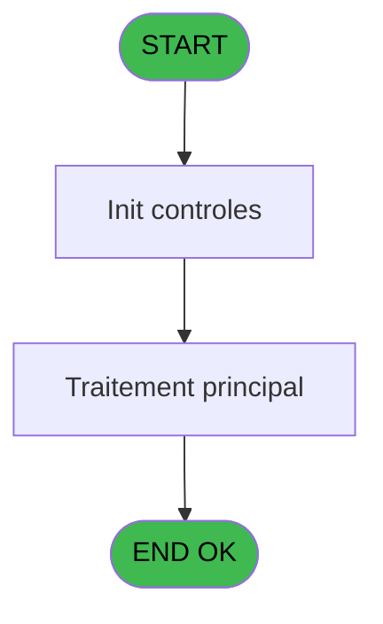

# ADH IDE 280 - Lanceur Facture

> **Analyse**: Phases 1-4 2026-02-08 05:02 -> 05:02 (4s) | Assemblage 05:02
> **Pipeline**: V7.2 Enrichi
> **Structure**: 4 onglets (Resume | Ecrans | Donnees | Connexions)

<!-- TAB:Resume -->

## 1. FICHE D'IDENTITE

| Attribut | Valeur |
|----------|--------|
| Projet | ADH |
| IDE Position | 280 |
| Nom Programme | Lanceur Facture |
| Fichier source | `Prg_280.xml` |
| Dossier IDE | Facturation |
| Taches | 1 (0 ecrans visibles) |
| Tables modifiees | 0 |
| Programmes appeles | 0 |
| Complexite | **BASSE** (score 15/100) |
| Statut | **ORPHELIN_POTENTIEL** |

## 2. DESCRIPTION FONCTIONNELLE

Le programme ADH IDE 280 est un lanceur de facturation spécialisé dans la gestion des documents de facturation pour le module Caisse. Il fonctionne comme un point d'entrée pour les opérations liées à la création et à la consultation des factures TVA dans l'écosystème de gestion de compte membre. Ce programme constitue un composant clé du workflow de facturation, permettant aux opérateurs caisse d'accéder rapidement aux fonctionnalités de gestion facturation depuis le menu principal.

Le lanceur orchestre l'interaction entre plusieurs programmes spécialisés du domaine facturation. Il maintient la cohérence des données en passant les paramètres de contexte (sociéte, compte, filiation) aux programmes appelés, et facilite la navigation entre les différents écrans de saisie et de consultation de factures. Son rôle est principalement de router les actions utilisateur vers les bons programmes métier (ADH IDE 97 - Saisie facture TVA, ADH IDE 89-97 - Gestion factures) en fonction du contexte de travail courant.

En tant que lanceur, ADH IDE 280 minimise la logique métier directe et se concentre sur la gestion de l'interface utilisateur et du flux d'exécution des appels de programmes CallTask. Il représente un élément de structure organisationnelle dans la hiérarchie des menus caisse, contribuant à l'ergonomie globale du système en centralisant les accès aux fonctionnalités de facturation pour les utilisateurs finals.

## 3. BLOCS FONCTIONNELS

## 5. REGLES METIER

*(Aucune regle metier identifiee dans les expressions)*

## 6. CONTEXTE

- **Appele par**: (aucun)
- **Appelle**: 0 programmes | **Tables**: 0 (W:0 R:0 L:0) | **Taches**: 1 | **Expressions**: 5

<!-- TAB:Ecrans -->

## 8. ECRANS

*(Programme sans ecran visible)*

## 9. NAVIGATION

### 9.3 Structure hierarchique (0 tache)

| Position | Tache | Type | Dimensions | Bloc |
|----------|-------|------|------------|------|

### 9.4 Algorigramme

> **Legende**: Vert = START/END OK | Rouge = END KO | Bleu = Decisions
> *Algorigramme auto-genere. Utiliser `/algorigramme` pour une synthese metier detaillee.*

<!-- TAB:Donnees -->

## 10. TABLES

### Tables utilisees (0)

| ID | Nom | Description | Type | R | W | L | Usages |
|----|-----|-------------|------|---|---|---|--------|

### Colonnes par table (0 / 0 tables avec colonnes identifiees)

## 11. VARIABLES

*(Programme sans variables locales mappees)*

## 12. EXPRESSIONS

**5 / 5 expressions decodees (100%)**

### 12.1 Repartition par type

| Type | Expressions | Regles |
|------|-------------|--------|
| CONSTANTE | 4 | 0 |
| CAST_LOGIQUE | 1 | 0 |

### 12.2 Expressions cles par type

#### CONSTANTE (4 expressions)

| Type | IDE | Expression | Regle |
|------|-----|------------|-------|
| CONSTANTE | 3 | `0` | - |
| CONSTANTE | 4 | `'I'` | - |
| CONSTANTE | 1 | `'C'` | - |
| CONSTANTE | 2 | `221613` | - |

#### CAST_LOGIQUE (1 expressions)

| Type | IDE | Expression | Regle |
|------|-----|------------|-------|
| CAST_LOGIQUE | 5 | `'TRUE'LOG` | - |

<!-- TAB:Connexions -->

## 13. GRAPHE D'APPELS

### 13.1 Chaine depuis Main (Callers)

**Chemin**: (pas de callers directs)

### 13.2 Callers

| IDE | Nom Programme | Nb Appels |
|-----|---------------|-----------|
| - | (aucun) | - |

### 13.3 Callees (programmes appeles)

### 13.4 Detail Callees avec contexte

| IDE | Nom Programme | Appels | Contexte |
|-----|---------------|--------|----------|
| - | (aucun) | - | - |

## 14. RECOMMANDATIONS MIGRATION

### 14.1 Profil du programme

| Metrique | Valeur | Impact migration |
|----------|--------|-----------------|
| Lignes de logique | 3 | Programme compact |
| Expressions | 5 | Peu de logique |
| Tables WRITE | 0 | Impact faible |
| Sous-programmes | 0 | Peu de dependances |
| Ecrans visibles | 0 | Ecran unique ou traitement batch |
| Code desactive | 33.3% (1 / 3) | Nettoyer avant migration |
| Regles metier | 0 | Pas de regle identifiee |

### 14.2 Plan de migration par bloc

### 14.3 Dependances critiques

| Dependance | Type | Appels | Impact |
|------------|------|--------|--------|

---
*Spec DETAILED generee par Pipeline V7.2 - 2026-02-08 05:03*
