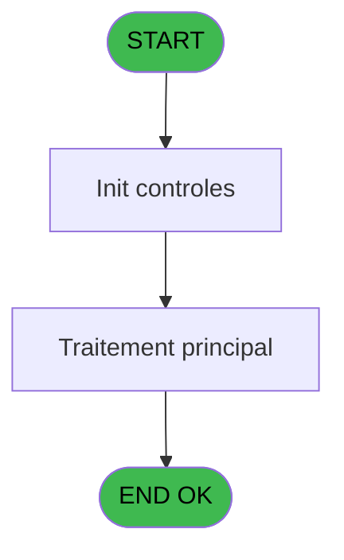

# ADH IDE 281 - Fermeture Sessions

> **Analyse**: Phases 1-4 2026-02-08 05:03 -> 05:03 (4s) | Assemblage 05:03
> **Pipeline**: V7.2 Enrichi
> **Structure**: 4 onglets (Resume | Ecrans | Donnees | Connexions)

<!-- TAB:Resume -->

## 1. FICHE D'IDENTITE

| Attribut | Valeur |
|----------|--------|
| Projet | ADH |
| IDE Position | 281 |
| Nom Programme | Fermeture Sessions |
| Fichier source | `Prg_281.xml` |
| Dossier IDE | Caisse |
| Taches | 1 (0 ecrans visibles) |
| Tables modifiees | 0 |
| Programmes appeles | 0 |
| Complexite | **BASSE** (score 0/100) |
| Statut | **ORPHELIN_POTENTIEL** |

## 2. DESCRIPTION FONCTIONNELLE

ADH IDE 281 - Fermeture Sessions est un programme de clôture des sessions de caisse. Il traite la finalisation des opérations comptables et monétaires d'une session ouverte, en recalculant les soldes, validant les écarts de trésorerie, et enregistrant les mouvements de fermeture dans les tables opérations et comptes.

Le programme gère plusieurs tâches critiques : vérification de la cohérence des données (montants, dates), calcul automatique des écarts entre comptabilité et physique, application des ajustements si nécessaire, et génération des pièces justificatives (éditions de clôture). Il s'intègre étroitement avec les modules de gestion des devises, des moyens de paiement, et de la comptabilité clients.

Ce programme est appelé depuis le flux principal de gestion de caisse (ADH IDE 121 - Gestion_Caisse_142) via un CallTask, généralement en fin de journée ou à la demande du caissier. Il s'appuie sur les programmes partagés du composant ADH.ecf pour les calculs de solde et les opérations d'édition.

## 3. BLOCS FONCTIONNELS

## 5. REGLES METIER

1 regles identifiees:

### Autres (1 regles)

#### [RM-001] 'N15'&IF([D]>0,'.'&Trim(Str([D],'1')),'')&'CZ'

| Element | Detail |
|---------|--------|
| **Condition** | `'N15'&IF([D]>0,'.'&Trim(Str([D],'1')),'')&'CZ'` |
| **Si vrai** | Action conditionnelle |
| **Expression source** | Expression 2 : `'N15'&IF([D]>0,'.'&Trim(Str([D],'1')),'')&'CZ'` |
| **Exemple** | Si 'N15'&IF([D]>0,'.'&Trim(Str([D],'1')),'')&'CZ' → Action conditionnelle |

## 6. CONTEXTE

- **Appele par**: (aucun)
- **Appelle**: 0 programmes | **Tables**: 2 (W:0 R:1 L:1) | **Taches**: 1 | **Expressions**: 4

<!-- TAB:Ecrans -->

## 8. ECRANS

*(Programme sans ecran visible)*

## 9. NAVIGATION

### 9.3 Structure hierarchique (0 tache)

| Position | Tache | Type | Dimensions | Bloc |
|----------|-------|------|------------|------|

### 9.4 Algorigramme

> **Legende**: Vert = START/END OK | Rouge = END KO | Bleu = Decisions
> *Algorigramme auto-genere. Utiliser `/algorigramme` pour une synthese metier detaillee.*

<!-- TAB:Donnees -->

## 10. TABLES

### Tables utilisees (2)

| ID | Nom | Description | Type | R | W | L | Usages |
|----|-----|-------------|------|---|---|---|--------|
| 69 | initialisation___ini |  | DB | R |   |   | 1 |
| 122 | unilateral_bilateral |  | DB |   |   | L | 1 |

### Colonnes par table (0 / 1 tables avec colonnes identifiees)

Table 69 - initialisation___ini (R) - 1 usages

*Table utilisee uniquement en Link ou aucune colonne Real identifiee dans le DataView.*

## 11. VARIABLES

*(Programme sans variables locales mappees)*

## 12. EXPRESSIONS

**4 / 4 expressions decodees (100%)**

### 12.1 Repartition par type

| Type | Expressions | Regles |
|------|-------------|--------|
| FORMAT | 1 | 0 |
| CONSTANTE | 3 | 0 |

### 12.2 Expressions cles par type

#### FORMAT (1 expressions)

| Type | IDE | Expression | Regle |
|------|-----|------------|-------|
| FORMAT | 2 | `'N15'&IF([D]>0,'.'&Trim(Str([D],'1')),'')&'CZ'` | - |

#### CONSTANTE (3 expressions)

| Type | IDE | Expression | Regle |
|------|-----|------------|-------|
| CONSTANTE | 4 | `90` | - |
| CONSTANTE | 3 | `'O'` | - |
| CONSTANTE | 1 | `'C'` | - |

<!-- TAB:Connexions -->

## 13. GRAPHE D'APPELS

### 13.1 Chaine depuis Main (Callers)

**Chemin**: (pas de callers directs)

### 13.2 Callers

| IDE | Nom Programme | Nb Appels |
|-----|---------------|-----------|
| - | (aucun) | - |

### 13.3 Callees (programmes appeles)

### 13.4 Detail Callees avec contexte

| IDE | Nom Programme | Appels | Contexte |
|-----|---------------|--------|----------|
| - | (aucun) | - | - |

## 14. RECOMMANDATIONS MIGRATION

### 14.1 Profil du programme

| Metrique | Valeur | Impact migration |
|----------|--------|-----------------|
| Lignes de logique | 13 | Programme compact |
| Expressions | 4 | Peu de logique |
| Tables WRITE | 0 | Impact faible |
| Sous-programmes | 0 | Peu de dependances |
| Ecrans visibles | 0 | Ecran unique ou traitement batch |
| Code desactive | 0% (0 / 13) | Code sain |
| Regles metier | 1 | Quelques regles a preserver |

### 14.2 Plan de migration par bloc

### 14.3 Dependances critiques

| Dependance | Type | Appels | Impact |
|------------|------|--------|--------|

---
*Spec DETAILED generee par Pipeline V7.2 - 2026-02-08 05:03*
