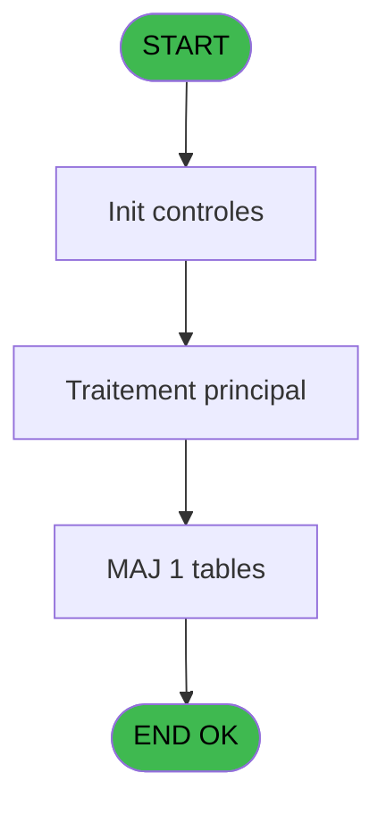
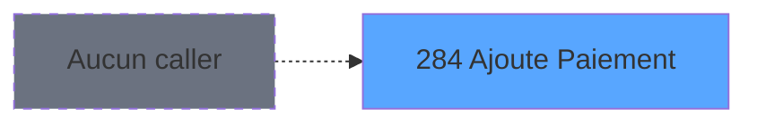
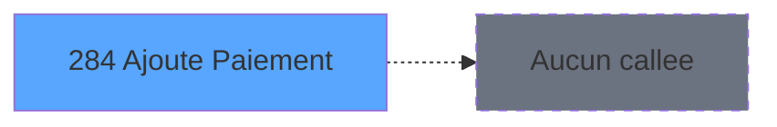

# ADH IDE 284 - Ajoute Paiement

> **Analyse**: Phases 1-4 2026-02-08 05:04 -> 05:04 (4s) | Assemblage 05:04
> **Pipeline**: V7.2 Enrichi
> **Structure**: 4 onglets (Resume | Ecrans | Donnees | Connexions)

<!-- TAB:Resume -->

## 1. FICHE D'IDENTITE

| Attribut | Valeur |
|----------|--------|
| Projet | ADH |
| IDE Position | 284 |
| Nom Programme | Ajoute Paiement |
| Fichier source | `Prg_284.xml` |
| Dossier IDE | General |
| Taches | 1 (0 ecrans visibles) |
| Tables modifiees | 1 |
| Programmes appeles | 0 |
| Complexite | **BASSE** (score 7/100) |
| Statut | **ORPHELIN_POTENTIEL** |

## 2. DESCRIPTION FONCTIONNELLE

ADH IDE 284 "Ajoute Paiement" est un programme simple, orphelin, spécialisé dans l'enregistrement des montants de paiement dans l'historique de comptage caisse. Avec une seule tâche, 36 lignes de logique et zéro appels à d'autres programmes, il porte la responsabilité isolée de modifier la table `comptage_caisse_montant_histo` - alimentant les historiques de paiement pour la réconciliation comptable.

Au sein de l'écosystème ADH, ce programme s'inscrit dans le flux de gestion de caisse : il reçoit les montants validés lors de la saisie du contenu caisse (IDE 120) et enregistre chaque paiement dans l'historique. Deux autres programmes lisent cette table pour consultation (IDE 120 et IDE 133), tandis que l'orchestrateur des mise-à-jour (IDE 133) synchronise l'ensemble des historiques de comptage (devise, montant, etc.) lors des transitions de session caisse.

Aucun program appelé directement ce programme en production connue (statut orphelin), ce qui suggère soit une utilisation dynamique non documentée, soit du code hérité. Son absence de paramètres d'entrée et sa dépendance unique à la table de comptage le rendent candidat idéal pour une migration isolée vers un service métier moderne (C# ou TypeScript), sans risques de cascades de changements.

## 3. BLOCS FONCTIONNELS

## 5. REGLES METIER

1 regles identifiees:

### Autres (1 regles)

#### [RM-001] hism_quand [B]

| Element | Detail |
|---------|--------|
| **Condition** | `hism_quand [B]` |
| **Si vrai** | Action conditionnelle |
| **Variables** | EO (hism_quand) |
| **Expression source** | Expression 2 : `hism_quand [B]` |
| **Exemple** | Si hism_quand [B] → Action conditionnelle |

## 6. CONTEXTE

- **Appele par**: (aucun)
- **Appelle**: 0 programmes | **Tables**: 1 (W:1 R:0 L:0) | **Taches**: 1 | **Expressions**: 11

<!-- TAB:Ecrans -->

## 8. ECRANS

*(Programme sans ecran visible)*

## 9. NAVIGATION

### 9.3 Structure hierarchique (0 tache)

| Position | Tache | Type | Dimensions | Bloc |
|----------|-------|------|------------|------|

### 9.4 Algorigramme

> **Legende**: Vert = START/END OK | Rouge = END KO | Bleu = Decisions
> *Algorigramme auto-genere. Utiliser `/algorigramme` pour une synthese metier detaillee.*

<!-- TAB:Donnees -->

## 10. TABLES

### Tables utilisees (1)

| ID | Nom | Description | Type | R | W | L | Usages |
|----|-----|-------------|------|---|---|---|--------|
| 223 | comptage_caisse_montant_histo | Sessions de caisse | DB |   | **W** |   | 1 |

### Colonnes par table (1 / 1 tables avec colonnes identifiees)

Table 223 - comptage_caisse_montant_histo (**W**) - 1 usages

| Lettre | Variable | Acces | Type |
|--------|----------|-------|------|
| A | hism_user | W | Unicode |
| B | hism_quand | W | Unicode |
| C | hism_chrono_histo | W | Numeric |
| D | hism_chrono_session | W | Numeric |

## 11. VARIABLES

### 11.1 Autres (4)

Variables diverses.

| Lettre | Nom | Type | Usage dans |
|--------|-----|------|-----------|
| EN | hism_user | Unicode | 1x refs |
| EO | hism_quand | Unicode | 1x refs |
| EP | hism_chrono_histo | Numeric | 1x refs |
| EQ | hism_chrono_session | Numeric | 1x refs |

## 12. EXPRESSIONS

**11 / 11 expressions decodees (100%)**

### 12.1 Repartition par type

| Type | Expressions | Regles |
|------|-------------|--------|
| CONSTANTE | 7 | 0 |
| OTHER | 4 | 0 |

### 12.2 Expressions cles par type

#### CONSTANTE (7 expressions)

| Type | IDE | Expression | Regle |
|------|-----|------------|-------|
| CONSTANTE | 9 | `8` | - |
| CONSTANTE | 10 | `'WECH'` | - |
| CONSTANTE | 11 | `'ALIP'` | - |
| CONSTANTE | 7 | `'UNIO'` | - |
| CONSTANTE | 4 | `10` | - |
| ... | | *+2 autres* | |

#### OTHER (4 expressions)

| Type | IDE | Expression | Regle |
|------|-----|------------|-------|
| OTHER | 3 | `hism_chrono_histo [C]` | - |
| OTHER | 8 | `hism_chrono_session [D]` | - |
| OTHER | 1 | `hism_user [A]` | - |
| OTHER | 2 | `hism_quand [B]` | - |

<!-- TAB:Connexions -->

## 13. GRAPHE D'APPELS

### 13.1 Chaine depuis Main (Callers)

**Chemin**: (pas de callers directs)

### 13.2 Callers

| IDE | Nom Programme | Nb Appels |
|-----|---------------|-----------|
| - | (aucun) | - |

### 13.3 Callees (programmes appeles)

### 13.4 Detail Callees avec contexte

| IDE | Nom Programme | Appels | Contexte |
|-----|---------------|--------|----------|
| - | (aucun) | - | - |

## 14. RECOMMANDATIONS MIGRATION

### 14.1 Profil du programme

| Metrique | Valeur | Impact migration |
|----------|--------|-----------------|
| Lignes de logique | 36 | Programme compact |
| Expressions | 11 | Peu de logique |
| Tables WRITE | 1 | Impact faible |
| Sous-programmes | 0 | Peu de dependances |
| Ecrans visibles | 0 | Ecran unique ou traitement batch |
| Code desactive | 0% (0 / 36) | Code sain |
| Regles metier | 1 | Quelques regles a preserver |

### 14.2 Plan de migration par bloc

### 14.3 Dependances critiques

| Dependance | Type | Appels | Impact |
|------------|------|--------|--------|
| comptage_caisse_montant_histo | Table WRITE (Database) | 1x | Schema + repository |

---
*Spec DETAILED generee par Pipeline V7.2 - 2026-02-08 05:09*
