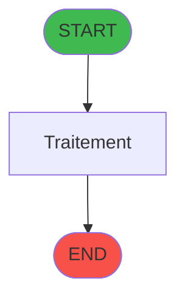
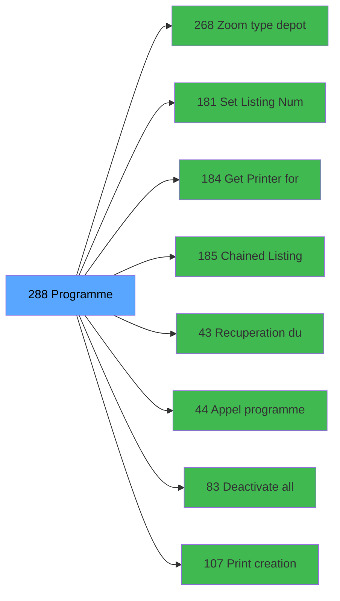

# ADH IDE 288 - Programme supprime (Prg_283)

> **Version spec**: 3.5
> **Analyse**: 2026-01-27 17:57
> **Source**: `Prg_XXX.xml`

---

<!-- TAB:Fonctionnel -->

## SPECIFICATION FONCTIONNELLE

### 1.1 Objectif metier

| Element | Description |
|---------|-------------|
| **Qui** | Operateur |
| **Quoi** | Programme supprime (Prg_283)
 |
| **Pourquoi** | A documenter |
| **Declencheur** | A identifier |

### 1.2 Regles metier

| Code | Regle | Condition |
|------|-------|-----------|
| RM-001 | A documenter | - |

### 1.3 Flux utilisateur

1. Demarrage programme
2. Traitement principal
3. Fin programme

### 1.4 Cas d'erreur

| Erreur | Comportement |
|--------|--------------|
| - | A documenter |

---

<!-- TAB:Technique -->

## SPECIFICATION TECHNIQUE

### 2.1 Identification

| Attribut | Valeur |
|----------|--------|
| **Format IDE** | ADH IDE 288 |
| **Description** | Programme supprime (Prg_283)
 |
| **Module** | ADH |

### 2.2 Tables

| # | Nom physique | Acces | Usage |
|---|--------------|-------|-------|
| #23 | `Table_23` | R | 2x |
| #30 | `Table_30` | R | 2x |
| #31 | `Table_31` | LINK | 1x |
| #31 | `Table_31` | R | 2x |
| #31 | `Table_31` | **W** | 1x |
| #39 | `Table_39` | LINK | 3x |
| #39 | `Table_39` | R | 2x |
| #39 | `Table_39` | **W** | 1x |
| #40 | `Table_40` | LINK | 2x |
| #47 | `Table_47` | LINK | 5x |
| #47 | `Table_47` | **W** | 2x |
| #50 | `Table_50` | LINK | 1x |
| #66 | `Table_66` | LINK | 2x |
| #68 | `Table_68` | **W** | 2x |
| #69 | `Table_69` | LINK | 2x |
| #70 | `Table_70` | LINK | 2x |
| #88 | `Table_88` | LINK | 2x |
| #89 | `Table_89` | LINK | 1x |
| #91 | `Table_91` | LINK | 2x |
| #91 | `Table_91` | R | 2x |
| #139 | `Table_139` | LINK | 1x |
| #140 | `Table_140` | LINK | 1x |
| #285 | `Table_285` | LINK | 2x |
| #312 | `Table_312` | LINK | 1x |
| #370 | `Table_370` | **W** | 2x |
| #910 | `Table_910` | LINK | 1x |
| #911 | `Table_911` | **W** | 2x |
| #945 | `Table_945` | **W** | 2x |
### 2.3 Parametres d'entree

### 2.4 Algorigramme

### 2.5 Expressions cles

### 2.6 Variables importantes

### 2.7 Statistiques

---

<!-- TAB:Cartographie -->

## CARTOGRAPHIE APPLICATIVE

### 3.1 Chaine d'appels depuis Main

### 3.2 Callers directs

| IDE | Programme | Nb appels |
|-----|-----------|-----------|
| - | **Aucun caller** (point d'entree ou orphelin) | - |
### 3.3 Callees

| Niv | IDE | Programme | Nb appels |
|-----|-----|-----------|-----------|
| 1 | 268 | Zoom type depot garantie | 5 |
| 1 | 181 | Set Listing Number | 4 |
| 1 | 184 | Get Printer for chained list | 4 |
| 1 | 185 | Chained Listing Printer Choice | 4 |
| 1 | 43 | Recuperation du titre | 2 |
| 1 | 44 | Appel programme | 2 |
| 1 | 83 | Deactivate all cards | 2 |
| 1 | 107 | Print creation garantie | 2 |
| 1 | 108 | Print annulation garantie | 2 |
| 1 | 109 | Print creation garantie TIK V1 | 2 |
| 1 | 171 | Print versement retrait | 2 |
| 1 | 186 | Chained Listing Load Default | 2 |
| 1 | 267 | Zoom devises | 2 |
| 1 | 110 | Print creation garanti PMS-584 | 1 |
| 1 | 113 | Test Activation ECO | 1 |
| 1 | 114 | Club Med Pass Filiations | 1 |
| 1 | 182 | Raz Current Printer | 1 |
### 3.4 Verification orphelin

| Critere | Resultat |
|---------|----------|
| Callers actifs | A verifier |
| **Conclusion** | A analyser |

---

## HISTORIQUE

| Date | Action | Auteur |
|------|--------|--------|
| 2026-01-27 19:51 | **DATA POPULATED** - Tables, Callgraph (8 expr) | Script |
| 2026-01-27 17:57 | **Upgrade V3.5** - TAB markers, Mermaid | Claude |

---

*Specification V3.5 - Format avec TAB markers et Mermaid*
