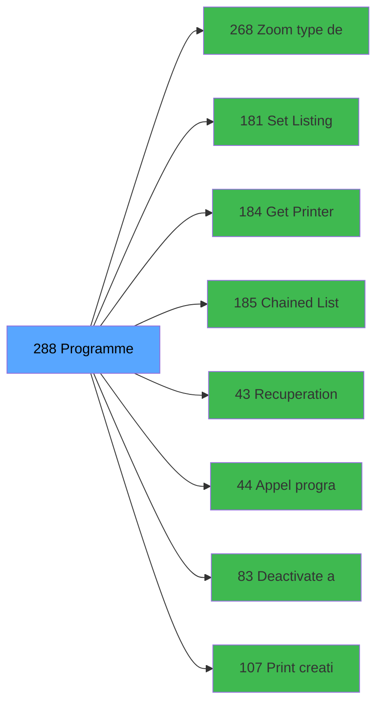

# ADH IDE 288 - Programme supprime (Prg_283)

> **Version spec**: 3.5
> **Analyse**: 2026-01-27 17:57
> **Source**: `Prg_XXX.xml`

---

<!-- TAB:Fonctionnel -->

## SPECIFICATION FONCTIONNELLE

### 1.1 Objectif metier

| Element | Description |
|---------|-------------|
| **Qui** | Operateur |
| **Quoi** | Programme supprime (Prg_283)
 |
| **Pourquoi** | A documenter |
| **Declencheur** | A identifier |

### 1.2 Regles metier

| Code | Regle | Condition |
|------|-------|-----------|
| RM-001 | A documenter | - |

### 1.3 Flux utilisateur

1. Demarrage programme
2. Traitement principal
3. Fin programme

### 1.4 Cas d'erreur

| Erreur | Comportement |
|--------|--------------|
| - | A documenter |

---

<!-- TAB:Technique -->

## SPECIFICATION TECHNIQUE

### 2.1 Identification

| Attribut | Valeur |
|----------|--------|
| **Format IDE** | ADH IDE 288 |
| **Description** | Programme supprime (Prg_283)
 |
| **Module** | ADH |

### 2.2 Tables

| # | Nom logique | Nom physique | Acces | Usage |
|---|-------------|--------------|-------|-------|
| 23 | reseau_cloture___rec | `cafil001_dat` | R | 2x |
| 30 | gm-recherche_____gmr | `cafil008_dat` | R | 2x |
| 31 | gm-complet_______gmc | `cafil009_dat` | L | 1x |
| 31 | gm-complet_______gmc | `cafil009_dat` | R | 2x |
| 31 | gm-complet_______gmc | `cafil009_dat` | **W** | 1x |
| 39 | depot_garantie___dga | `cafil017_dat` | L | 3x |
| 39 | depot_garantie___dga | `cafil017_dat` | R | 2x |
| 39 | depot_garantie___dga | `cafil017_dat` | **W** | 1x |
| 40 | comptable________cte | `cafil018_dat` | L | 2x |
| 47 | compte_gm________cgm | `cafil025_dat` | L | 5x |
| 47 | compte_gm________cgm | `cafil025_dat` | **W** | 2x |
| 50 | moyens_reglement_mor | `cafil028_dat` | L | 1x |
| 66 | imputations______imp | `cafil044_dat` | L | 2x |
| 68 | compteurs________cpt | `cafil046_dat` | **W** | 2x |
| 69 | initialisation___ini | `cafil047_dat` | L | 2x |
| 70 | date_comptable___dat | `cafil048_dat` | L | 2x |
| 88 | historik_station | `cafil066_dat` | L | 2x |
| 89 | moyen_paiement___mop | `cafil067_dat` | L | 1x |
| 91 | garantie_________gar | `cafil069_dat` | L | 2x |
| 91 | garantie_________gar | `cafil069_dat` | R | 2x |
| 139 | moyens_reglement_mor | `cafil117_dat` | L | 1x |
| 140 | moyen_paiement___mop | `cafil118_dat` | L | 1x |
| 285 | email | `email` | L | 2x |
| 312 | ez_card | `ezcard` | L | 1x |
| 370 | pv_accounting_date | `pv_accountdate_dat` | **W** | 2x |
| 910 | classification_memory | `classification_memory` | L | 1x |
| 911 | log_booker | `log_booker` | **W** | 2x |
| 945 | Table_945 | - | **W** | 2x |
### 2.3 Parametres d'entree

| Variable | Nom | Type | Picture |
|----------|-----|------|---------|
| - | Aucun parametre | - | - |
### 2.4 Algorigramme

### 2.5 Expressions cles

| IDE | Expression | Commentaire |
|-----|------------|-------------|
| 1 | `{0,1}=''` | - |
| 2 | `'C'` | - |
| 3 | `{0,18}<>'R' AND {0,14}<>'B'` | - |
| 4 | `{0,18}<>'R' AND {0,14}='B'` | - |
| 5 | `'F'` | - |
| 6 | `{0,19}='F'` | - |
| 7 | `''` | - |
| 8 | `{0,20} AND {32768,64}` | - |

> **Total**: 8 expressions (affichees: 8)
### 2.6 Variables importantes

### 2.7 Statistiques

| Metrique | Valeur |
|----------|--------|
| **Taches** | 28 |
| **Lignes logique** | 1246 |
| **Lignes desactivees** | 0 |
---

<!-- TAB:Cartographie -->

## CARTOGRAPHIE APPLICATIVE

### 3.1 Chaine d'appels depuis Main

### 3.2 Callers directs

| IDE | Programme | Nb appels |
|-----|-----------|-----------|
| - | **Aucun caller** (point d'entree ou orphelin) | - |
### 3.3 Callees

| Niv | IDE | Programme | Nb appels |
|-----|-----|-----------|-----------|
| 1 | 268 | Zoom type depot garantie | 5 |
| 1 | 181 | Set Listing Number | 4 |
| 1 | 184 | Get Printer for chained list | 4 |
| 1 | 185 | Chained Listing Printer Choice | 4 |
| 1 | 43 | Recuperation du titre | 2 |
| 1 | 44 | Appel programme | 2 |
| 1 | 83 | Deactivate all cards | 2 |
| 1 | 107 | Print creation garantie | 2 |
| 1 | 108 | Print annulation garantie | 2 |
| 1 | 109 | Print creation garantie TIK V1 | 2 |
| 1 | 171 | Print versement retrait | 2 |
| 1 | 186 | Chained Listing Load Default | 2 |
| 1 | 267 | Zoom devises | 2 |
| 1 | 110 | Print creation garanti PMS-584 | 1 |
| 1 | 113 | Test Activation ECO | 1 |
| 1 | 114 | Club Med Pass Filiations | 1 |
| 1 | 182 | Raz Current Printer | 1 |
### 3.4 Verification orphelin

| Critere | Resultat |
|---------|----------|
| Callers actifs | A verifier |
| **Conclusion** | A analyser |

---

## HISTORIQUE

| Date | Action | Auteur |
|------|--------|--------|
| 2026-01-27 20:25 | **DATA V2** - Tables reelles, Expressions, Stats, CallChain | Script |
| 2026-01-27 19:51 | **DATA POPULATED** - Tables, Callgraph (8 expr) | Script |
| 2026-01-27 17:57 | **Upgrade V3.5** - TAB markers, Mermaid | Claude |

---

*Specification V3.5 - Format avec TAB markers et Mermaid*
