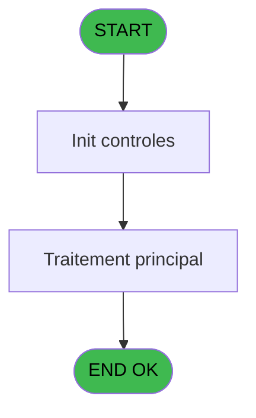

# ADH IDE 289 - Calcul equivalent BI locale

> **Analyse**: Phases 1-4 2026-02-08 05:10 -> 05:10 (4s) | Assemblage 05:10
> **Pipeline**: V7.2 Enrichi
> **Structure**: 4 onglets (Resume | Ecrans | Donnees | Connexions)

<!-- TAB:Resume -->

## 1. FICHE D'IDENTITE

| Attribut | Valeur |
|----------|--------|
| Projet | ADH |
| IDE Position | 289 |
| Nom Programme | Calcul equivalent BI locale |
| Fichier source | `Prg_289.xml` |
| Dossier IDE | General |
| Taches | 1 (0 ecrans visibles) |
| Tables modifiees | 0 |
| Programmes appeles | 0 |
| Complexite | **BASSE** (score 0/100) |
| Statut | **ORPHELIN_POTENTIEL** |

## 2. DESCRIPTION FONCTIONNELLE

ADH IDE 289 calcule l'équivalent en devise locale (BI) pour une transaction en devise étrangère, en utilisant les taux de change applicables. Ce programme est appelé lors des opérations de change (achat/vente de devises) et détermine le montant en monnaie locale correspondant au montant saisi en devise étrangère, appliquant le bon taux selon le type d'opération.

Le programme utilise la table `taux_change` (Table n°28 - cafil028_dat) pour récupérer les taux bidirectionnels (achat/vente) pour chaque paire de devises. La logique applique des règles métier spécifiques : pour un achat de devises étrangères, le taux utilisé est le taux d'achat; pour une vente, c'est l'inverse (division par le taux de vente). Cette mécanique détermine combien de monnaie locale le client doit donner ou reçoit.

Le calcul intègre également la devise locale du club (stockée en configuration) et valide que les deux devises sont différentes avant d'effectuer la conversion. Les paramètres d'entrée sont le montant en devise étrangère, la devise source, le type d'opération (achat/vente), et la sortie est le montant équivalent en devise locale, utilisé ensuite pour enregistrer l'opération dans la caisse.

## 3. BLOCS FONCTIONNELS

## 5. REGLES METIER

*(Aucune regle metier identifiee dans les expressions)*

## 6. CONTEXTE

- **Appele par**: (aucun)
- **Appelle**: 0 programmes | **Tables**: 1 (W:0 R:1 L:0) | **Taches**: 1 | **Expressions**: 8

<!-- TAB:Ecrans -->

## 8. ECRANS

*(Programme sans ecran visible)*

## 9. NAVIGATION

### 9.3 Structure hierarchique (0 tache)

| Position | Tache | Type | Dimensions | Bloc |
|----------|-------|------|------------|------|

### 9.4 Algorigramme

> **Legende**: Vert = START/END OK | Rouge = END KO | Bleu = Decisions
> *Algorigramme auto-genere. Utiliser `/algorigramme` pour une synthese metier detaillee.*

<!-- TAB:Donnees -->

## 10. TABLES

### Tables utilisees (1)

| ID | Nom | Description | Type | R | W | L | Usages |
|----|-----|-------------|------|---|---|---|--------|
| 139 | moyens_reglement_mor | Reglements / paiements | DB | R |   |   | 1 |

### Colonnes par table (1 / 1 tables avec colonnes identifiees)

Table 139 - moyens_reglement_mor (R) - 1 usages

| Lettre | Variable | Acces | Type |
|--------|----------|-------|------|
| A | > Societe | R | Alpha |
| B | > devise locale | R | Alpha |
| C | > nombre de decimal | R | Numeric |
| D | > Devise | R | Alpha |
| E | < cdrt devise in | R | Logical |
| F | > mode de paiement | R | Alpha |
| G | > Type operation | R | Alpha |
| H | > Type de devise | R | Numeric |
| I | > quantite | R | Numeric |
| J | < Equivalent | R | Numeric |

## 11. VARIABLES

### 11.1 Autres (10)

Variables diverses.

| Lettre | Nom | Type | Usage dans |
|--------|-----|------|-----------|
| EN | > Societe | Alpha | 1x refs |
| EO | > devise locale | Alpha | - |
| EP | > nombre de decimal | Numeric | 1x refs |
| EQ | > Devise | Alpha | 1x refs |
| ER | < cdrt devise in | Logical | - |
| ES | > mode de paiement | Alpha | 1x refs |
| ET | > Type operation | Alpha | 1x refs |
| EU | > Type de devise | Numeric | 1x refs |
| EV | > quantite | Numeric | 1x refs |
| EW | < Equivalent | Numeric | - |

## 12. EXPRESSIONS

**8 / 8 expressions decodees (100%)**

### 12.1 Repartition par type

| Type | Expressions | Regles |
|------|-------------|--------|
| CONDITION | 6 | 0 |
| CONSTANTE | 1 | 0 |
| CAST_LOGIQUE | 1 | 0 |

### 12.2 Expressions cles par type

#### CONDITION (6 expressions)

| Type | IDE | Expression | Regle |
|------|-----|------------|-------|
| CONDITION | 3 | `> mode de paiement [F]` | - |
| CONDITION | 4 | `> Type operation [G]` | - |
| CONDITION | 6 | `> Type de devise [H]` | - |
| CONDITION | 7 | `Fix (> quantite [I]/[Q],11,> nombre de decimal [C])` | - |
| CONDITION | 1 | `> Societe [A]` | - |
| ... | | *+1 autres* | |

#### CONSTANTE (1 expressions)

| Type | IDE | Expression | Regle |
|------|-----|------------|-------|
| CONSTANTE | 5 | `'O'` | - |

#### CAST_LOGIQUE (1 expressions)

| Type | IDE | Expression | Regle |
|------|-----|------------|-------|
| CAST_LOGIQUE | 8 | `'FALSE'LOG` | - |

<!-- TAB:Connexions -->

## 13. GRAPHE D'APPELS

### 13.1 Chaine depuis Main (Callers)

**Chemin**: (pas de callers directs)

### 13.2 Callers

| IDE | Nom Programme | Nb Appels |
|-----|---------------|-----------|
| - | (aucun) | - |

### 13.3 Callees (programmes appeles)

### 13.4 Detail Callees avec contexte

| IDE | Nom Programme | Appels | Contexte |
|-----|---------------|--------|----------|
| - | (aucun) | - | - |

## 14. RECOMMANDATIONS MIGRATION

### 14.1 Profil du programme

| Metrique | Valeur | Impact migration |
|----------|--------|-----------------|
| Lignes de logique | 24 | Programme compact |
| Expressions | 8 | Peu de logique |
| Tables WRITE | 0 | Impact faible |
| Sous-programmes | 0 | Peu de dependances |
| Ecrans visibles | 0 | Ecran unique ou traitement batch |
| Code desactive | 0% (0 / 24) | Code sain |
| Regles metier | 0 | Pas de regle identifiee |

### 14.2 Plan de migration par bloc

### 14.3 Dependances critiques

| Dependance | Type | Appels | Impact |
|------------|------|--------|--------|

---
*Spec DETAILED generee par Pipeline V7.2 - 2026-02-08 05:10*
