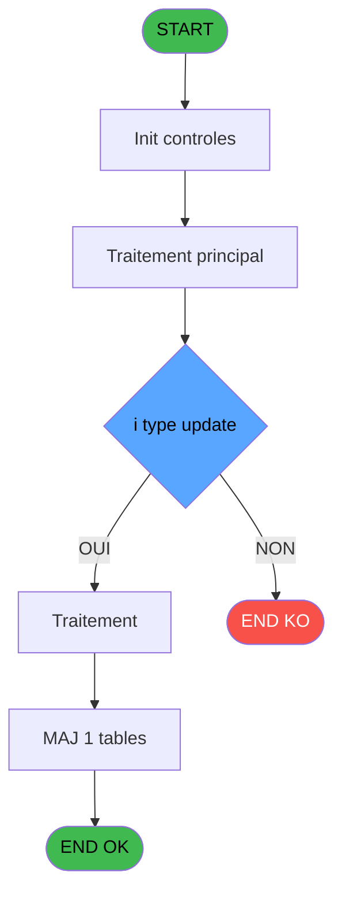

# ADH IDE 29 - Write histo Fus_Sep

> **Analyse**: Phases 1-4 2026-02-07 03:41 -> 01:23 (21h41min) | Assemblage 01:23
> **Pipeline**: V7.2 Enrichi
> **Structure**: 4 onglets (Resume | Ecrans | Donnees | Connexions)

<!-- TAB:Resume -->

## 1. FICHE D'IDENTITE

| Attribut | Valeur |
|----------|--------|
| Projet | ADH |
| IDE Position | 29 |
| Nom Programme | Write histo Fus_Sep |
| Fichier source | `Prg_29.xml` |
| Dossier IDE | General |
| Taches | 1 (0 ecrans visibles) |
| Tables modifiees | 1 |
| Programmes appeles | 0 |
| Complexite | **BASSE** (score 7/100) |

## 2. DESCRIPTION FONCTIONNELLE

# ADH IDE 29 - Write histo Fus_Sep

Programme utilitaire de journalisation des opérations de fusion/séparation de comptes. Appelé à la suite des programmes ADH IDE 27 (Separation) et ADH IDE 28 (Fusion) pour enregistrer l'historique dans la table `histo_fusionseparation`.

Écrit un enregistrement d'historique contenant les paramètres de l'opération : sociétés source/cible, comptes, filiales, type d'opération (fusion ou séparation), date/heure, et identifiant utilisateur. La structure de l'enregistrement permet la traçabilité complète des mouvements de comptes et la réconciliation des données après restructurations.

Logiquement situé en fin de chaîne de traitement pour capture de l'état final après validation des opérations principales. Aucun traitement métier complexe - rôle limité à la persistance des données d'audit pour reporting et conformité.

## 3. BLOCS FONCTIONNELS

### 3.1 Impression (1 tache)

Generation des documents et tickets.

---

#### 29 - --> Printer Management

**Role** : Generation du document : --> Printer Management.

## 5. REGLES METIER

6 regles identifiees:

### Autres (6 regles)

#### [RM-001] Condition: i type update [A] egale 'DATEHEURE'

| Element | Detail |
|---------|--------|
| **Condition** | `i type update [A]='DATEHEURE'` |
| **Si vrai** | Action si vrai |
| **Variables** | EN (i type update) |
| **Expression source** | Expression 2 : `i type update [A]='DATEHEURE'` |
| **Exemple** | Si i type update [A]='DATEHEURE' → Action si vrai |

#### [RM-002] Condition: i type update [A] egale 'UPDFIRST'

| Element | Detail |
|---------|--------|
| **Condition** | `i type update [A]='UPDFIRST'` |
| **Si vrai** | Action si vrai |
| **Variables** | EN (i type update) |
| **Expression source** | Expression 3 : `i type update [A]='UPDFIRST'` |
| **Exemple** | Si i type update [A]='UPDFIRST' → Action si vrai |

#### [RM-003] Condition: i type update [A] egale 'UPDTABLE'

| Element | Detail |
|---------|--------|
| **Condition** | `i type update [A]='UPDTABLE'` |
| **Si vrai** | Action si vrai |
| **Variables** | EN (i type update) |
| **Expression source** | Expression 4 : `i type update [A]='UPDTABLE'` |
| **Exemple** | Si i type update [A]='UPDTABLE' → Action si vrai |

#### [RM-004] Condition: i type update [A] egale 'UPDEND'

| Element | Detail |
|---------|--------|
| **Condition** | `i type update [A]='UPDEND'` |
| **Si vrai** | Action si vrai |
| **Variables** | EN (i type update) |
| **Expression source** | Expression 5 : `i type update [A]='UPDEND'` |
| **Exemple** | Si i type update [A]='UPDEND' → Action si vrai |

#### [RM-005] Condition: i type update [A] egale 'FIN'

| Element | Detail |
|---------|--------|
| **Condition** | `i type update [A]='FIN'` |
| **Si vrai** | Action si vrai |
| **Variables** | EN (i type update) |
| **Expression source** | Expression 6 : `i type update [A]='FIN'` |
| **Exemple** | Si i type update [A]='FIN' → Action si vrai |

#### [RM-006] Condition: i type update [A] egale 'REPRISE'

| Element | Detail |
|---------|--------|
| **Condition** | `i type update [A]='REPRISE'` |
| **Si vrai** | Action si vrai |
| **Variables** | EN (i type update) |
| **Expression source** | Expression 7 : `i type update [A]='REPRISE'` |
| **Exemple** | Si i type update [A]='REPRISE' → Action si vrai |

## 6. CONTEXTE

- **Appele par**: [Separation (IDE 27)](ADH-IDE-27.md), [Fusion (IDE 28)](ADH-IDE-28.md)
- **Appelle**: 0 programmes | **Tables**: 1 (W:1 R:0 L:0) | **Taches**: 1 | **Expressions**: 13

<!-- TAB:Ecrans -->

## 8. ECRANS

*(Programme sans ecran visible)*

## 9. NAVIGATION

### 9.3 Structure hierarchique (1 tache)

| Position | Tache | Type | Dimensions | Bloc |
|----------|-------|------|------------|------|
| **29.1** | [**--> Printer Management** (29)](#t1) | MDI | - | Impression |

### 9.4 Algorigramme

> **Legende**: Vert = START/END OK | Rouge = END KO | Bleu = Decisions
> *Algorigramme auto-genere. Utiliser `/algorigramme` pour une synthese metier detaillee.*

<!-- TAB:Donnees -->

## 10. TABLES

### Tables utilisees (1)

| ID | Nom | Description | Type | R | W | L | Usages |
|----|-----|-------------|------|---|---|---|--------|
| 340 | histo_fusionseparation | Historique / journal | DB |   | **W** |   | 1 |

### Colonnes par table (1 / 1 tables avec colonnes identifiees)

Table 340 - histo_fusionseparation (**W**) - 1 usages

| Lettre | Variable | Acces | Type |
|--------|----------|-------|------|
| A | i type update | W | Alpha |
| B | i chrono | W | Numeric |
| C | i date F/E | W | Date |
| D | i heure F/E | W | Time |
| E | i Valide | W | Logical |

## 11. VARIABLES

### 11.1 Autres (5)

Variables diverses.

| Lettre | Nom | Type | Usage dans |
|--------|-----|------|-----------|
| EN | i type update | Alpha | 6x refs |
| EO | i chrono | Numeric | 1x refs |
| EP | i date F/E | Date | 1x refs |
| EQ | i heure F/E | Time | 1x refs |
| ER | i Valide | Logical | 1x refs |

## 12. EXPRESSIONS

**13 / 13 expressions decodees (100%)**

### 12.1 Repartition par type

| Type | Expressions | Regles |
|------|-------------|--------|
| CONDITION | 6 | 6 |
| DATE | 1 | 0 |
| OTHER | 5 | 0 |
| CAST_LOGIQUE | 1 | 0 |

### 12.2 Expressions cles par type

#### CONDITION (6 expressions)

| Type | IDE | Expression | Regle |
|------|-----|------------|-------|
| CONDITION | 5 | `i type update [A]='UPDEND'` | [RM-004](#rm-RM-004) |
| CONDITION | 6 | `i type update [A]='FIN'` | [RM-005](#rm-RM-005) |
| CONDITION | 7 | `i type update [A]='REPRISE'` | [RM-006](#rm-RM-006) |
| CONDITION | 2 | `i type update [A]='DATEHEURE'` | [RM-001](#rm-RM-001) |
| CONDITION | 3 | `i type update [A]='UPDFIRST'` | [RM-002](#rm-RM-002) |
| ... | | *+1 autres* | |

#### DATE (1 expressions)

| Type | IDE | Expression | Regle |
|------|-----|------------|-------|
| DATE | 11 | `Date ()` | - |

#### OTHER (5 expressions)

| Type | IDE | Expression | Regle |
|------|-----|------------|-------|
| OTHER | 10 | `i Valide [E]` | - |
| OTHER | 12 | `Time ()` | - |
| OTHER | 9 | `i heure F/E [D]` | - |
| OTHER | 1 | `i chrono [B]` | - |
| OTHER | 8 | `i date F/E [C]` | - |

#### CAST_LOGIQUE (1 expressions)

| Type | IDE | Expression | Regle |
|------|-----|------------|-------|
| CAST_LOGIQUE | 13 | `'TRUE'LOG` | - |

<!-- TAB:Connexions -->

## 13. GRAPHE D'APPELS

### 13.1 Chaine depuis Main (Callers)

Main -> ... -> [Separation (IDE 27)](ADH-IDE-27.md) -> **Write histo Fus_Sep (IDE 29)**

Main -> ... -> [Fusion (IDE 28)](ADH-IDE-28.md) -> **Write histo Fus_Sep (IDE 29)**

### 13.2 Callers

| IDE | Nom Programme | Nb Appels |
|-----|---------------|-----------|
| [27](ADH-IDE-27.md) | Separation | 6 |
| [28](ADH-IDE-28.md) | Fusion | 6 |

### 13.3 Callees (programmes appeles)

### 13.4 Detail Callees avec contexte

| IDE | Nom Programme | Appels | Contexte |
|-----|---------------|--------|----------|
| - | (aucun) | - | - |

## 14. RECOMMANDATIONS MIGRATION

### 14.1 Profil du programme

| Metrique | Valeur | Impact migration |
|----------|--------|-----------------|
| Lignes de logique | 61 | Programme compact |
| Expressions | 13 | Peu de logique |
| Tables WRITE | 1 | Impact faible |
| Sous-programmes | 0 | Peu de dependances |
| Ecrans visibles | 0 | Ecran unique ou traitement batch |
| Code desactive | 0% (0 / 61) | Code sain |
| Regles metier | 6 | Quelques regles a preserver |

### 14.2 Plan de migration par bloc

#### Impression (1 tache: 0 ecran, 1 traitement)

- **Strategie** : Templates HTML -> PDF via wkhtmltopdf ou Puppeteer.
- `PrintService` injectable avec choix imprimante

### 14.3 Dependances critiques

| Dependance | Type | Appels | Impact |
|------------|------|--------|--------|
| histo_fusionseparation | Table WRITE (Database) | 1x | Schema + repository |

---
*Spec DETAILED generee par Pipeline V7.2 - 2026-02-08 01:24*
