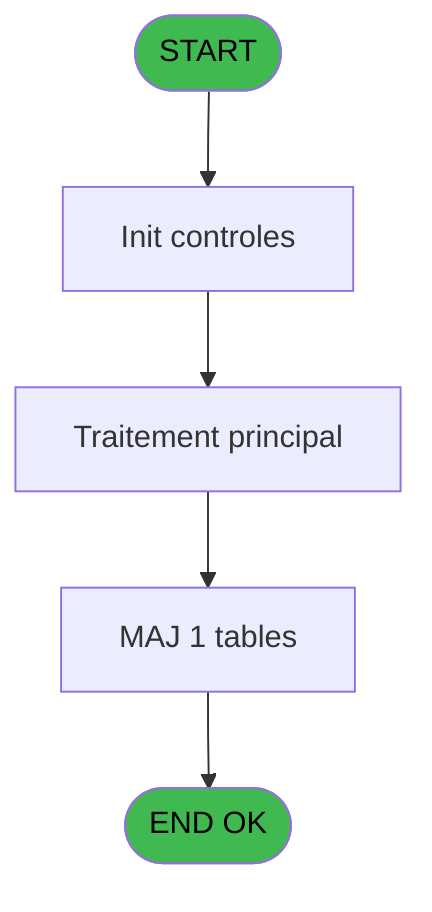

# ADH IDE 29 - Write histo Fus_Sep

> **Analyse**: Phases 1-4 2026-02-07 03:41 -> 03:41 (27s) | Assemblage 13:04
> **Pipeline**: V7.2 Enrichi
> **Structure**: 4 onglets (Resume | Ecrans | Donnees | Connexions)

<!-- TAB:Resume -->

## 1. FICHE D'IDENTITE

| Attribut | Valeur |
|----------|--------|
| Projet | ADH |
| IDE Position | 29 |
| Nom Programme | Write histo Fus_Sep |
| Fichier source | `Prg_29.xml` |
| Dossier IDE | General |
| Taches | 1 (0 ecrans visibles) |
| Tables modifiees | 1 |
| Programmes appeles | 0 |
| Complexite | **BASSE** (score 7/100) |

## 2. DESCRIPTION FONCTIONNELLE

**ADH IDE 29** est un **enregistreur d'audit spécialisé** qui journalise les transitions d'état des opérations de fusion et séparation de comptes. Le programme écrit dans la table `histo_fusionseparation` un seul enregistrement pour chaque phase de traitement, capturant le type d'opération (DATEHEURE, UPDFIRST, UPDTABLE, UPDEND, FIN, REPRISE), la date/heure exacte, un numéro séquentiel et un flag de validation. Cette structure de logging immuable permet de tracer l'historique complet d'une opération de fusion ou séparation de compte.

Le programme est appelé **6 fois** depuis IDE 27 (Separation) et **6 fois** depuis IDE 28 (Fusion), ce qui correspond aux 6 phases distinctes de la pipeline transactionnelle. Chaque invocation enregistre un point d'étape précis dans le workflow, formant une trace d'audit complète et ordonnée. Les codes d'état incluent un marqueur de reprise (REPRISE), ce qui suggère que le système peut interrompre et reprendre une opération de fusion/séparation longue, en s'appuyant sur cet historique pour valider la continuité.

Son intégration avec le formulaire **Printer Management** indique que ce programme peut également générer de la documentation ou des rapports d'audit destinés à l'impression, transformant les données de transition d'état brutes en artefacts utilisateur finaux. IDE 29 est donc le cœur du mécanisme d'audit transactionnel pour les opérations critiques de gestion de compte.

## 3. BLOCS FONCTIONNELS

### 3.1 Impression (1 tache)

Generation des documents et tickets.

---

#### 29 - --> Printer Management

**Role** : Generation du document : --> Printer Management.

## 5. REGLES METIER

*(Programme d'impression - logique technique sans conditions metier)*

## 6. CONTEXTE

- **Appele par**: [Separation (IDE 27)](ADH-IDE-27.md), [Fusion (IDE 28)](ADH-IDE-28.md)
- **Appelle**: 0 programmes | **Tables**: 1 (W:1 R:0 L:0) | **Taches**: 1 | **Expressions**: 13

<!-- TAB:Ecrans -->

## 8. ECRANS

*(Programme sans ecran visible)*

## 9. NAVIGATION

### 9.3 Structure hierarchique (1 tache)

| Position | Tache | Type | Dimensions | Bloc |
|----------|-------|------|------------|------|
| **29.1** | [**--> Printer Management** (29)](#t1) | MDI | - | Impression |

### 9.4 Algorigramme

> **Legende**: Vert = START/END OK | Rouge = END KO | Bleu = Decisions
> *Algorigramme auto-genere. Utiliser `/algorigramme` pour une synthese metier detaillee.*

<!-- TAB:Donnees -->

## 10. TABLES

### Tables utilisees (1)

| ID | Nom | Description | Type | R | W | L | Usages |
|----|-----|-------------|------|---|---|---|--------|
| 340 | histo_fusionseparation | Historique / journal | DB |   | **W** |   | 1 |

### Colonnes par table (1 / 1 tables avec colonnes identifiees)

Table 340 - histo_fusionseparation (**W**) - 1 usages

| Lettre | Variable | Acces | Type |
|--------|----------|-------|------|
| A | i type update | W | Alpha |
| B | i chrono | W | Numeric |
| C | i date F/E | W | Date |
| D | i heure F/E | W | Time |
| E | i Valide | W | Logical |

## 11. VARIABLES

### 11.1 Autres (5)

Variables diverses.

| Lettre | Nom | Type | Usage dans |
|--------|-----|------|-----------|
| A | i type update | Alpha | 6x refs |
| B | i chrono | Numeric | 1x refs |
| C | i date F/E | Date | 1x refs |
| D | i heure F/E | Time | 1x refs |
| E | i Valide | Logical | 1x refs |

## 12. EXPRESSIONS

**13 / 13 expressions decodees (100%)**

### 12.1 Repartition par type

| Type | Expressions | Regles |
|------|-------------|--------|
| DATE | 1 | 0 |
| OTHER | 5 | 0 |
| CONDITION | 6 | 0 |
| CAST_LOGIQUE | 1 | 0 |

### 12.2 Expressions cles par type

#### DATE (1 expressions)

| Type | IDE | Expression | Regle |
|------|-----|------------|-------|
| DATE | 11 | `Date ()` | - |

#### OTHER (5 expressions)

| Type | IDE | Expression | Regle |
|------|-----|------------|-------|
| OTHER | 10 | `i Valide [E]` | - |
| OTHER | 12 | `Time ()` | - |
| OTHER | 9 | `i heure F/E [D]` | - |
| OTHER | 1 | `i chrono [B]` | - |
| OTHER | 8 | `i date F/E [C]` | - |

#### CONDITION (6 expressions)

| Type | IDE | Expression | Regle |
|------|-----|------------|-------|
| CONDITION | 5 | `i type update [A]='UPDEND'` | - |
| CONDITION | 6 | `i type update [A]='FIN'` | - |
| CONDITION | 7 | `i type update [A]='REPRISE'` | - |
| CONDITION | 2 | `i type update [A]='DATEHEURE'` | - |
| CONDITION | 3 | `i type update [A]='UPDFIRST'` | - |
| ... | | *+1 autres* | |

#### CAST_LOGIQUE (1 expressions)

| Type | IDE | Expression | Regle |
|------|-----|------------|-------|
| CAST_LOGIQUE | 13 | `'TRUE'LOG` | - |

<!-- TAB:Connexions -->

## 13. GRAPHE D'APPELS

### 13.1 Chaine depuis Main (Callers)

Main -> ... -> [Separation (IDE 27)](ADH-IDE-27.md) -> **Write histo Fus_Sep (IDE 29)**

Main -> ... -> [Fusion (IDE 28)](ADH-IDE-28.md) -> **Write histo Fus_Sep (IDE 29)**

### 13.2 Callers

| IDE | Nom Programme | Nb Appels |
|-----|---------------|-----------|
| [27](ADH-IDE-27.md) | Separation | 6 |
| [28](ADH-IDE-28.md) | Fusion | 6 |

### 13.3 Callees (programmes appeles)

### 13.4 Detail Callees avec contexte

| IDE | Nom Programme | Appels | Contexte |
|-----|---------------|--------|----------|
| - | (aucun) | - | - |

## 14. RECOMMANDATIONS MIGRATION

### 14.1 Profil du programme

| Metrique | Valeur | Impact migration |
|----------|--------|-----------------|
| Lignes de logique | 61 | Programme compact |
| Expressions | 13 | Peu de logique |
| Tables WRITE | 1 | Impact faible |
| Sous-programmes | 0 | Peu de dependances |
| Ecrans visibles | 0 | Ecran unique ou traitement batch |
| Code desactive | 0% (0 / 61) | Code sain |
| Regles metier | 0 | Pas de regle identifiee |

### 14.2 Plan de migration par bloc

#### Impression (1 tache: 0 ecran, 1 traitement)

- **Strategie** : Templates HTML -> PDF via wkhtmltopdf ou Puppeteer.
- `PrintService` injectable avec choix imprimante

### 14.3 Dependances critiques

| Dependance | Type | Appels | Impact |
|------------|------|--------|--------|
| histo_fusionseparation | Table WRITE (Database) | 1x | Schema + repository |

---
*Spec DETAILED generee par Pipeline V7.2 - 2026-02-07 13:06*
