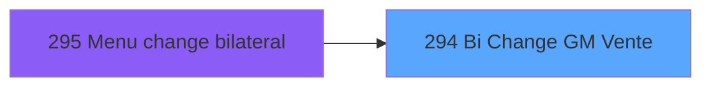
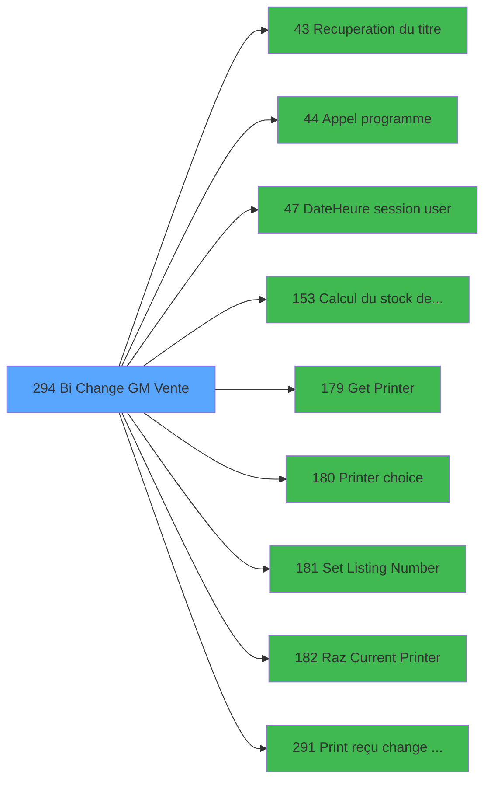

# ADH IDE 294 - Bi  Change GM Vente

> **Analyse**: Phases 1-4 2026-02-07 03:54 -> 03:55 (42s) | Assemblage 05:11
> **Pipeline**: V7.2 Enrichi
> **Structure**: 4 onglets (Resume | Ecrans | Donnees | Connexions)

<!-- TAB:Resume -->

## 1. FICHE D'IDENTITE

| Attribut | Valeur |
|----------|--------|
| Projet | ADH |
| IDE Position | 294 |
| Nom Programme | Bi  Change GM Vente |
| Fichier source | `Prg_294.xml` |
| Dossier IDE | Ventes |
| Taches | 16 (5 ecrans visibles) |
| Tables modifiees | 5 |
| Programmes appeles | 9 |
| Complexite | **BASSE** (score 36/100) |

## 2. DESCRIPTION FONCTIONNELLE

ADH IDE 294 gère le workflow complet d'une transaction de change (achat/vente de devises) au sein de la caisse. Le programme démarre par une série de validations critiques : vérification que la session caisse est ouverte, que aucune clôture n'est en cours, et que le réseau est disponible. Il récupère ensuite les informations contextuelles (titre du titre de change, données utilisateur, date/heure session) et initialise l'écran de saisie avec les devises disponibles et leur stock actuel en caisse.

La logique métier centrale alterne entre deux modes : consultation des devises existantes (scroll dans la grille change_vente) et création d'une nouvelle transaction. Lors de chaque entrée, le programme recalcule le stock devise disponible (via ADH IDE 153), valide les montants (achat vs vente avec taux de change appliqué), et enregistre la transaction dans la table change_vente_____chg avec son mode de paiement associé. Les compteurs opérationnels (compteurs________cpt) sont incrémentés pour chaque transaction validée.

À la finalisation, le programme déclenche l'impression du reçu change via ADH IDE 291, en passant par la chaîne d'impression (sélection imprimante, numérotation ticket, réinitialisation). Les modifications aux tables moyens_reglement_mor et compte_gm________cgm reflètent l'impact sur les soldes de compte et les moyens de règlement utilisés. L'ensemble du flux est protégé par des blocages de concurrence (cloture en cours) et des validations de disponibilité réseau.

## 3. BLOCS FONCTIONNELS

### 3.1 Traitement (6 taches)

Traitements internes.

---

#### <a id="t1"></a>T1 - Change GM [ECRAN]

**Role** : Tache d'orchestration : point d'entree du programme (6 sous-taches). Coordonne l'enchainement des traitements.
**Ecran** : 118 x 44 DLU (MDI) | [Voir mockup](#ecran-t1)

<details>
<summary>5 sous-taches directes</summary>

| Tache | Nom | Bloc |
|-------|-----|------|
| [T2](#t2) | Test si cloture en cours | Traitement |
| [T3](#t3) | Blocage cloture | Traitement |
| [T4](#t4) | Test reseau | Traitement |
| [T5](#t5) | Scroll Change **[ECRAN]** | Traitement |
| [T16](#t16) | Deblocage cloture | Traitement |

</details>
**Variables liees** : R (W0 n° de change)
**Delegue a** : [Recuperation du titre (IDE 43)](ADH-IDE-43.md), [Appel programme (IDE 44)](ADH-IDE-44.md), [Date/Heure session user (IDE 47)](ADH-IDE-47.md)

---

#### <a id="t2"></a>T2 - Test si cloture en cours

**Role** : Verification : Test si cloture en cours.
**Delegue a** : [Recuperation du titre (IDE 43)](ADH-IDE-43.md), [Appel programme (IDE 44)](ADH-IDE-44.md), [Date/Heure session user (IDE 47)](ADH-IDE-47.md)

---

#### <a id="t3"></a>T3 - Blocage cloture

**Role** : Traitement : Blocage cloture.
**Delegue a** : [Recuperation du titre (IDE 43)](ADH-IDE-43.md), [Appel programme (IDE 44)](ADH-IDE-44.md), [Date/Heure session user (IDE 47)](ADH-IDE-47.md)

---

#### <a id="t4"></a>T4 - Test reseau

**Role** : Verification : Test reseau.
**Variables liees** : W (W0 reseau)
**Delegue a** : [Recuperation du titre (IDE 43)](ADH-IDE-43.md), [Appel programme (IDE 44)](ADH-IDE-44.md), [Date/Heure session user (IDE 47)](ADH-IDE-47.md)

---

#### <a id="t5"></a>T5 - Scroll Change [ECRAN]

**Role** : Traitement : Scroll Change.
**Ecran** : 1101 x 218 DLU (MDI) | [Voir mockup](#ecran-t5)
**Variables liees** : R (W0 n° de change)
**Delegue a** : [Recuperation du titre (IDE 43)](ADH-IDE-43.md), [Appel programme (IDE 44)](ADH-IDE-44.md), [Date/Heure session user (IDE 47)](ADH-IDE-47.md)

---

#### <a id="t16"></a>T16 - Deblocage cloture

**Role** : Traitement : Deblocage cloture.
**Delegue a** : [Recuperation du titre (IDE 43)](ADH-IDE-43.md), [Appel programme (IDE 44)](ADH-IDE-44.md), [Date/Heure session user (IDE 47)](ADH-IDE-47.md)


### 3.2 Consultation (4 taches)

Ecrans de recherche et consultation.

---

#### <a id="t6"></a>T6 - Creation/Affichage change [ECRAN]

**Role** : Reinitialisation : Creation/Affichage change.
**Ecran** : 1102 x 88 DLU (MDI) | [Voir mockup](#ecran-t6)
**Variables liees** : R (W0 n° de change)

---

#### <a id="t7"></a>T7 - Affichage annulation [ECRAN]

**Role** : Reinitialisation : Affichage annulation.
**Ecran** : 312 x 64 DLU (Modal) | [Voir mockup](#ecran-t7)

---

#### <a id="t8"></a>T8 - Zoom des devises [ECRAN]

**Role** : Selection par l'operateur : Zoom des devises.
**Ecran** : 363 x 152 DLU (MDI) | [Voir mockup](#ecran-t8)

---

#### <a id="t10"></a>T10 - Zoom Type de Taux [ECRAN]

**Role** : Calcul : Zoom Type de Taux.
**Ecran** : 506 x 153 DLU (MDI) | [Voir mockup](#ecran-t10)


### 3.3 Reglement (1 tache)

Gestion des moyens de paiement : 1 tache de reglement.

---

#### <a id="t9"></a>T9 - Zoom des modes de paiement [ECRAN]

**Role** : Gestion du reglement : Zoom des modes de paiement.
**Ecran** : 366 x 151 DLU (MDI) | [Voir mockup](#ecran-t9)


### 3.4 Calcul (3 taches)

Calculs metier : montants, stocks, compteurs.

---

#### <a id="t11"></a>T11 - Recup compteur

**Role** : Calcul : Recup compteur.
**Delegue a** : [Calcul du stock devise (IDE 153)](ADH-IDE-153.md)

---

#### <a id="t14"></a>T14 - Calcul Flag

**Role** : Calcul : Calcul Flag.
**Delegue a** : [Calcul du stock devise (IDE 153)](ADH-IDE-153.md)

---

#### <a id="t15"></a>T15 - Reaffichage infos compte

**Role** : Reinitialisation : Reaffichage infos compte.
**Variables liees** : I (> solde compte), J (> etat compte)
**Delegue a** : [Calcul du stock devise (IDE 153)](ADH-IDE-153.md)


### 3.5 Creation (2 taches)

Insertion de nouveaux enregistrements en base.

---

#### <a id="t12"></a>T12 - Creation change

**Role** : Creation d'enregistrement : Creation change.
**Variables liees** : R (W0 n° de change)

---

#### <a id="t13"></a>T13 - Creation change

**Role** : Creation d'enregistrement : Creation change.
**Variables liees** : R (W0 n° de change)


## 5. REGLES METIER

*(Programme de consultation - lecture seule sans regles de validation)*

## 6. CONTEXTE

- **Appele par**: [Menu change bilateral (IDE 295)](ADH-IDE-295.md)
- **Appelle**: 9 programmes | **Tables**: 10 (W:5 R:7 L:4) | **Taches**: 16 | **Expressions**: 8

<!-- TAB:Ecrans -->

## 8. ECRANS

### 8.1 Forms visibles (5 / 16)

| # | Position | Tache | Nom | Type | Largeur | Hauteur | Bloc |
|---|----------|-------|-----|------|---------|---------|------|
| 1 | 294.3 | T5 | Scroll Change | MDI | 1101 | 218 | Traitement |
| 2 | 294.4 | T6 | Creation/Affichage change | MDI | 1102 | 88 | Consultation |
| 3 | 294.4.2 | T8 | Zoom des devises | MDI | 363 | 152 | Consultation |
| 4 | 294.4.3 | T9 | Zoom des modes de paiement | MDI | 366 | 151 | Reglement |
| 5 | 294.4.4 | T10 | Zoom Type de Taux | MDI | 506 | 153 | Consultation |

### 8.2 Mockups Ecrans

---

#### <a id="ecran-t5"></a>294.3 - Scroll Change
**Tache** : [T5](#t5) | **Type** : MDI | **Dimensions** : 1101 x 218 DLU
**Bloc** : Traitement | **Titre IDE** : Scroll Change

<!-- FORM-DATA:
{
    "width":  1101,
    "vFactor":  8,
    "type":  "MDI",
    "hFactor":  8,
    "controls":  [
                     {
                         "x":  0,
                         "type":  "label",
                         "var":  "",
                         "y":  2,
                         "w":  1100,
                         "fmt":  "",
                         "name":  "",
                         "h":  21,
                         "color":  "",
                         "text":  "",
                         "parent":  null
                     },
                     {
                         "x":  0,
                         "type":  "label",
                         "var":  "",
                         "y":  193,
                         "w":  1100,
                         "fmt":  "",
                         "name":  "",
                         "h":  25,
                         "color":  "",
                         "text":  "",
                         "parent":  null
                     },
                     {
                         "x":  62,
                         "type":  "table",
                         "var":  "",
                         "name":  "",
                         "titleH":  12,
                         "color":  "110",
                         "w":  974,
                         "y":  33,
                         "fmt":  "",
                         "parent":  null,
                         "text":  "",
                         "rowH":  12,
                         "h":  89,
                         "cols":  [
                                      {
                                          "title":  "Nom",
                                          "layer":  1,
                                          "w":  240
                                      },
                                      {
                                          "title":  "Date opération",
                                          "layer":  2,
                                          "w":  133
                                      },
                                      {
                                          "title":  "Mode paiement",
                                          "layer":  3,
                                          "w":  132
                                      },
                                      {
                                          "title":  "Quantité",
                                          "layer":  4,
                                          "w":  143
                                      },
                                      {
                                          "title":  "Code devise",
                                          "layer":  5,
                                          "w":  108
                                      },
                                      {
                                          "title":  "Etat",
                                          "layer":  6,
                                          "w":  187
                                      }
                                  ],
                         "rows":  6
                     },
                     {
                         "x":  416,
                         "type":  "label",
                         "var":  "",
                         "y":  128,
                         "w":  269,
                         "fmt":  "",
                         "name":  "",
                         "h":  56,
                         "color":  "",
                         "text":  "",
                         "parent":  null
                     },
                     {
                         "x":  450,
                         "type":  "label",
                         "var":  "",
                         "y":  134,
                         "w":  199,
                         "fmt":  "",
                         "name":  "",
                         "h":  29,
                         "color":  "",
                         "text":  "",
                         "parent":  19
                     },
                     {
                         "x":  453,
                         "type":  "label",
                         "var":  "",
                         "y":  135,
                         "w":  38,
                         "fmt":  "",
                         "name":  "",
                         "h":  27,
                         "color":  "",
                         "text":  "",
                         "parent":  19
                     },
                     {
                         "x":  503,
                         "type":  "label",
                         "var":  "",
                         "y":  139,
                         "w":  101,
                         "fmt":  "",
                         "name":  "",
                         "h":  8,
                         "color":  "7",
                         "text":  "Change",
                         "parent":  19
                     },
                     {
                         "x":  503,
                         "type":  "label",
                         "var":  "",
                         "y":  151,
                         "w":  128,
                         "fmt":  "",
                         "name":  "",
                         "h":  8,
                         "color":  "7",
                         "text":  "Annulation",
                         "parent":  19
                     },
                     {
                         "x":  463,
                         "type":  "label",
                         "var":  "",
                         "y":  169,
                         "w":  120,
                         "fmt":  "",
                         "name":  "",
                         "h":  9,
                         "color":  "",
                         "text":  "Votre choix",
                         "parent":  19
                     },
                     {
                         "x":  760,
                         "type":  "label",
                         "var":  "",
                         "y":  128,
                         "w":  269,
                         "fmt":  "",
                         "name":  "",
                         "h":  22,
                         "color":  "",
                         "text":  "",
                         "parent":  null
                     },
                     {
                         "x":  779,
                         "type":  "label",
                         "var":  "",
                         "y":  135,
                         "w":  83,
                         "fmt":  "",
                         "name":  "",
                         "h":  8,
                         "color":  "7",
                         "text":  "Operateur",
                         "parent":  26
                     },
                     {
                         "x":  309,
                         "type":  "edit",
                         "var":  "",
                         "y":  48,
                         "w":  120,
                         "fmt":  "DD/MM/YYYYZ",
                         "name":  "",
                         "h":  8,
                         "color":  "110",
                         "text":  "",
                         "parent":  6
                     },
                     {
                         "x":  725,
                         "type":  "edit",
                         "var":  "",
                         "y":  48,
                         "w":  59,
                         "fmt":  "",
                         "name":  "",
                         "h":  8,
                         "color":  "110",
                         "text":  "",
                         "parent":  6
                     },
                     {
                         "x":  443,
                         "type":  "edit",
                         "var":  "",
                         "y":  48,
                         "w":  53,
                         "fmt":  "",
                         "name":  "",
                         "h":  8,
                         "color":  "110",
                         "text":  "",
                         "parent":  6
                     },
                     {
                         "x":  574,
                         "type":  "edit",
                         "var":  "",
                         "y":  48,
                         "w":  131,
                         "fmt":  "###########Z",
                         "name":  "",
                         "h":  8,
                         "color":  "110",
                         "text":  "",
                         "parent":  6
                     },
                     {
                         "x":  910,
                         "type":  "edit",
                         "var":  "",
                         "y":  135,
                         "w":  101,
                         "fmt":  "",
                         "name":  "",
                         "h":  9,
                         "color":  "7",
                         "text":  "",
                         "parent":  26
                     },
                     {
                         "x":  590,
                         "type":  "edit",
                         "var":  "",
                         "y":  168,
                         "w":  26,
                         "fmt":  "UA",
                         "name":  "W1 choix action",
                         "h":  10,
                         "color":  "6",
                         "text":  "",
                         "parent":  19
                     },
                     {
                         "x":  7,
                         "type":  "edit",
                         "var":  "",
                         "y":  9,
                         "w":  267,
                         "fmt":  "20",
                         "name":  "",
                         "h":  8,
                         "color":  "",
                         "text":  "",
                         "parent":  1
                     },
                     {
                         "x":  888,
                         "type":  "edit",
                         "var":  "",
                         "y":  9,
                         "w":  203,
                         "fmt":  "WWW DD MMM YYYYT",
                         "name":  "",
                         "h":  8,
                         "color":  "",
                         "text":  "",
                         "parent":  1
                     },
                     {
                         "x":  67,
                         "type":  "edit",
                         "var":  "",
                         "y":  48,
                         "w":  232,
                         "fmt":  "20",
                         "name":  "",
                         "h":  8,
                         "color":  "110",
                         "text":  "",
                         "parent":  6
                     },
                     {
                         "x":  830,
                         "type":  "edit",
                         "var":  "",
                         "y":  48,
                         "w":  165,
                         "fmt":  "14",
                         "name":  "",
                         "h":  8,
                         "color":  "110",
                         "text":  "",
                         "parent":  6
                     },
                     {
                         "x":  124,
                         "type":  "image",
                         "var":  "",
                         "y":  125,
                         "w":  144,
                         "fmt":  "",
                         "name":  "",
                         "h":  62,
                         "color":  "",
                         "text":  "",
                         "parent":  null
                     },
                     {
                         "x":  457,
                         "type":  "button",
                         "var":  "",
                         "y":  138,
                         "w":  27,
                         "fmt":  "C",
                         "name":  "C",
                         "h":  9,
                         "color":  "",
                         "text":  "",
                         "parent":  null
                     },
                     {
                         "x":  457,
                         "type":  "button",
                         "var":  "",
                         "y":  150,
                         "w":  27,
                         "fmt":  "A",
                         "name":  "A",
                         "h":  9,
                         "color":  "",
                         "text":  "",
                         "parent":  null
                     },
                     {
                         "x":  9,
                         "type":  "button",
                         "var":  "",
                         "y":  197,
                         "w":  175,
                         "fmt":  "\u0026Quitter",
                         "name":  "",
                         "h":  18,
                         "color":  "",
                         "text":  "",
                         "parent":  5
                     }
                 ],
    "taskId":  "294.3",
    "height":  218
}
-->

<details>
<summary><strong>Champs : 10 champs</strong></summary>

| Pos (x,y) | Nom | Variable | Type |
|-----------|-----|----------|------|
| 309,48 | DD/MM/YYYYZ | - | edit |
| 725,48 | (sans nom) | - | edit |
| 443,48 | (sans nom) | - | edit |
| 574,48 | ###########Z | - | edit |
| 910,135 | (sans nom) | - | edit |
| 590,168 | W1 choix action | - | edit |
| 7,9 | 20 | - | edit |
| 888,9 | WWW DD MMM YYYYT | - | edit |
| 67,48 | 20 | - | edit |
| 830,48 | 14 | - | edit |

</details>

<details>
<summary><strong>Boutons : 3 boutons</strong></summary>

| Bouton | Pos (x,y) | Action |
|--------|-----------|--------|
| C | 457,138 | Bouton fonctionnel |
| A | 457,150 | Bouton fonctionnel |
| Quitter | 9,197 | Quitte le programme |

</details>

---

#### <a id="ecran-t6"></a>294.4 - Creation/Affichage change
**Tache** : [T6](#t6) | **Type** : MDI | **Dimensions** : 1102 x 88 DLU
**Bloc** : Consultation | **Titre IDE** : Creation/Affichage change

<!-- FORM-DATA:
{
    "width":  1102,
    "vFactor":  8,
    "type":  "MDI",
    "hFactor":  8,
    "controls":  [
                     {
                         "x":  1,
                         "type":  "label",
                         "var":  "",
                         "y":  0,
                         "w":  1102,
                         "fmt":  "",
                         "name":  "",
                         "h":  59,
                         "color":  "",
                         "text":  "",
                         "parent":  null
                     },
                     {
                         "x":  20,
                         "type":  "label",
                         "var":  "",
                         "y":  13,
                         "w":  61,
                         "fmt":  "",
                         "name":  "",
                         "h":  8,
                         "color":  "",
                         "text":  "Devise",
                         "parent":  null
                     },
                     {
                         "x":  98,
                         "type":  "label",
                         "var":  "",
                         "y":  13,
                         "w":  54,
                         "fmt":  "",
                         "name":  "",
                         "h":  8,
                         "color":  "",
                         "text":  "MOP",
                         "parent":  null
                     },
                     {
                         "x":  239,
                         "type":  "label",
                         "var":  "",
                         "y":  13,
                         "w":  216,
                         "fmt":  "",
                         "name":  "",
                         "h":  8,
                         "color":  "",
                         "text":  "Type de taux",
                         "parent":  null
                     },
                     {
                         "x":  524,
                         "type":  "label",
                         "var":  "",
                         "y":  13,
                         "w":  46,
                         "fmt":  "",
                         "name":  "",
                         "h":  8,
                         "color":  "",
                         "text":  "Taux",
                         "parent":  null
                     },
                     {
                         "x":  637,
                         "type":  "label",
                         "var":  "",
                         "y":  13,
                         "w":  171,
                         "fmt":  "",
                         "name":  "",
                         "h":  8,
                         "color":  "",
                         "text":  "Quantite",
                         "parent":  null
                     },
                     {
                         "x":  851,
                         "type":  "label",
                         "var":  "",
                         "y":  13,
                         "w":  128,
                         "fmt":  "",
                         "name":  "",
                         "h":  8,
                         "color":  "",
                         "text":  "Equivalent",
                         "parent":  null
                     },
                     {
                         "x":  1,
                         "type":  "label",
                         "var":  "",
                         "y":  64,
                         "w":  1102,
                         "fmt":  "",
                         "name":  "",
                         "h":  24,
                         "color":  "",
                         "text":  "",
                         "parent":  null
                     },
                     {
                         "x":  26,
                         "type":  "edit",
                         "var":  "",
                         "y":  30,
                         "w":  48,
                         "fmt":  "",
                         "name":  "W1 devise",
                         "h":  10,
                         "color":  "6",
                         "text":  "",
                         "parent":  null
                     },
                     {
                         "x":  117,
                         "type":  "edit",
                         "var":  "",
                         "y":  30,
                         "w":  59,
                         "fmt":  "",
                         "name":  "W1 mode de paiement",
                         "h":  10,
                         "color":  "6",
                         "text":  "",
                         "parent":  null
                     },
                     {
                         "x":  239,
                         "type":  "edit",
                         "var":  "",
                         "y":  30,
                         "w":  37,
                         "fmt":  "#2Z",
                         "name":  "W1 type de taux",
                         "h":  10,
                         "color":  "6",
                         "text":  "",
                         "parent":  null
                     },
                     {
                         "x":  280,
                         "type":  "edit",
                         "var":  "",
                         "y":  31,
                         "w":  176,
                         "fmt":  "",
                         "name":  "",
                         "h":  8,
                         "color":  "7",
                         "text":  "",
                         "parent":  null
                     },
                     {
                         "x":  470,
                         "type":  "edit",
                         "var":  "",
                         "y":  31,
                         "w":  157,
                         "fmt":  "### ### ###.#####",
                         "name":  "",
                         "h":  9,
                         "color":  "",
                         "text":  "",
                         "parent":  null
                     },
                     {
                         "x":  637,
                         "type":  "edit",
                         "var":  "",
                         "y":  31,
                         "w":  142,
                         "fmt":  "",
                         "name":  "W1 equivalent",
                         "h":  9,
                         "color":  "",
                         "text":  "",
                         "parent":  null
                     },
                     {
                         "x":  858,
                         "type":  "edit",
                         "var":  "",
                         "y":  31,
                         "w":  142,
                         "fmt":  "## ### ### ###.###Z",
                         "name":  "W1 quantite",
                         "h":  9,
                         "color":  "6",
                         "text":  "",
                         "parent":  null
                     },
                     {
                         "x":  8,
                         "type":  "button",
                         "var":  "",
                         "y":  67,
                         "w":  154,
                         "fmt":  "\u0026Ok",
                         "name":  "Btn Valider",
                         "h":  18,
                         "color":  "",
                         "text":  "",
                         "parent":  null
                     },
                     {
                         "x":  155,
                         "type":  "edit",
                         "var":  "",
                         "y":  13,
                         "w":  64,
                         "fmt":  "5",
                         "name":  "",
                         "h":  8,
                         "color":  "",
                         "text":  "",
                         "parent":  null
                     },
                     {
                         "x":  788,
                         "type":  "edit",
                         "var":  "",
                         "y":  31,
                         "w":  45,
                         "fmt":  "3",
                         "name":  "",
                         "h":  9,
                         "color":  "7",
                         "text":  "",
                         "parent":  null
                     },
                     {
                         "x":  1009,
                         "type":  "edit",
                         "var":  "",
                         "y":  31,
                         "w":  45,
                         "fmt":  "3",
                         "name":  "",
                         "h":  8,
                         "color":  "7",
                         "text":  "",
                         "parent":  null
                     },
                     {
                         "x":  169,
                         "type":  "button",
                         "var":  "",
                         "y":  67,
                         "w":  154,
                         "fmt":  "A\u0026bandonner",
                         "name":  "",
                         "h":  18,
                         "color":  "",
                         "text":  "",
                         "parent":  null
                     },
                     {
                         "x":  330,
                         "type":  "button",
                         "var":  "",
                         "y":  67,
                         "w":  168,
                         "fmt":  "Printer",
                         "name":  "",
                         "h":  18,
                         "color":  "",
                         "text":  "",
                         "parent":  null
                     }
                 ],
    "taskId":  "294.4",
    "height":  88
}
-->

<details>
<summary><strong>Champs : 10 champs</strong></summary>

| Pos (x,y) | Nom | Variable | Type |
|-----------|-----|----------|------|
| 26,30 | W1 devise | - | edit |
| 117,30 | W1 mode de paiement | - | edit |
| 239,30 | W1 type de taux | - | edit |
| 280,31 | (sans nom) | - | edit |
| 470,31 | ### ### ###.##### | - | edit |
| 637,31 | W1 equivalent | - | edit |
| 858,31 | W1 quantite | - | edit |
| 155,13 | 5 | - | edit |
| 788,31 | 3 | - | edit |
| 1009,31 | 3 | - | edit |

</details>

<details>
<summary><strong>Boutons : 3 boutons</strong></summary>

| Bouton | Pos (x,y) | Action |
|--------|-----------|--------|
| Ok | 8,67 | Valide la saisie et enregistre |
| Abandonner | 169,67 | Annule et retour au menu |
| Printer | 330,67 | Appel [Get Printer (IDE 179)](ADH-IDE-179.md) |

</details>

---

#### <a id="ecran-t8"></a>294.4.2 - Zoom des devises
**Tache** : [T8](#t8) | **Type** : MDI | **Dimensions** : 363 x 152 DLU
**Bloc** : Consultation | **Titre IDE** : Zoom des devises

<!-- FORM-DATA:
{
    "width":  363,
    "vFactor":  8,
    "type":  "MDI",
    "hFactor":  8,
    "controls":  [
                     {
                         "x":  0,
                         "type":  "label",
                         "var":  "",
                         "y":  133,
                         "w":  363,
                         "fmt":  "",
                         "name":  "",
                         "h":  19,
                         "color":  "",
                         "text":  "",
                         "parent":  null
                     },
                     {
                         "x":  30,
                         "type":  "table",
                         "var":  "",
                         "name":  "",
                         "titleH":  12,
                         "color":  "196",
                         "w":  326,
                         "y":  7,
                         "fmt":  "",
                         "parent":  null,
                         "text":  "",
                         "rowH":  14,
                         "h":  102,
                         "cols":  [
                                      {
                                          "title":  "Code",
                                          "layer":  1,
                                          "w":  115
                                      },
                                      {
                                          "title":  "Devise",
                                          "layer":  2,
                                          "w":  155
                                      }
                                  ],
                         "rows":  2
                     },
                     {
                         "x":  51,
                         "type":  "edit",
                         "var":  "",
                         "y":  23,
                         "w":  75,
                         "fmt":  "",
                         "name":  "",
                         "h":  8,
                         "color":  "196",
                         "text":  "",
                         "parent":  3
                     },
                     {
                         "x":  152,
                         "type":  "edit",
                         "var":  "",
                         "y":  23,
                         "w":  142,
                         "fmt":  "12",
                         "name":  "",
                         "h":  8,
                         "color":  "196",
                         "text":  "",
                         "parent":  3
                     },
                     {
                         "x":  205,
                         "type":  "button",
                         "var":  "",
                         "y":  136,
                         "w":  144,
                         "fmt":  "\u0026Quitter",
                         "name":  "",
                         "h":  14,
                         "color":  "",
                         "text":  "",
                         "parent":  null
                     },
                     {
                         "x":  14,
                         "type":  "button",
                         "var":  "",
                         "y":  136,
                         "w":  144,
                         "fmt":  "\u0026Selectionner",
                         "name":  "",
                         "h":  14,
                         "color":  "",
                         "text":  "",
                         "parent":  null
                     },
                     {
                         "x":  152,
                         "type":  "image",
                         "var":  "",
                         "y":  109,
                         "w":  58,
                         "fmt":  "",
                         "name":  "",
                         "h":  18,
                         "color":  "",
                         "text":  "",
                         "parent":  null
                     }
                 ],
    "taskId":  "294.4.2",
    "height":  152
}
-->

<details>
<summary><strong>Champs : 2 champs</strong></summary>

| Pos (x,y) | Nom | Variable | Type |
|-----------|-----|----------|------|
| 51,23 | (sans nom) | - | edit |
| 152,23 | 12 | - | edit |

</details>

<details>
<summary><strong>Boutons : 2 boutons</strong></summary>

| Bouton | Pos (x,y) | Action |
|--------|-----------|--------|
| Quitter | 205,136 | Quitte le programme |
| Selectionner | 14,136 | Ouvre la selection |

</details>

---

#### <a id="ecran-t9"></a>294.4.3 - Zoom des modes de paiement
**Tache** : [T9](#t9) | **Type** : MDI | **Dimensions** : 366 x 151 DLU
**Bloc** : Reglement | **Titre IDE** : Zoom des modes de paiement

<!-- FORM-DATA:
{
    "width":  366,
    "vFactor":  8,
    "type":  "MDI",
    "hFactor":  8,
    "controls":  [
                     {
                         "x":  0,
                         "type":  "label",
                         "var":  "",
                         "y":  132,
                         "w":  363,
                         "fmt":  "",
                         "name":  "",
                         "h":  19,
                         "color":  "",
                         "text":  "",
                         "parent":  null
                     },
                     {
                         "x":  89,
                         "type":  "table",
                         "var":  "",
                         "name":  "",
                         "titleH":  12,
                         "color":  "196",
                         "w":  189,
                         "y":  5,
                         "fmt":  "",
                         "parent":  null,
                         "text":  "",
                         "rowH":  13,
                         "h":  104,
                         "cols":  [
                                      {
                                          "title":  "Mode de paiement",
                                          "layer":  1,
                                          "w":  157
                                      }
                                  ],
                         "rows":  1
                     },
                     {
                         "x":  147,
                         "type":  "edit",
                         "var":  "",
                         "y":  20,
                         "w":  53,
                         "fmt":  "",
                         "name":  "",
                         "h":  8,
                         "color":  "196",
                         "text":  "",
                         "parent":  3
                     },
                     {
                         "x":  202,
                         "type":  "button",
                         "var":  "",
                         "y":  135,
                         "w":  144,
                         "fmt":  "\u0026Quitter",
                         "name":  "",
                         "h":  14,
                         "color":  "",
                         "text":  "",
                         "parent":  null
                     },
                     {
                         "x":  21,
                         "type":  "button",
                         "var":  "",
                         "y":  135,
                         "w":  144,
                         "fmt":  "\u0026Selectionner",
                         "name":  "",
                         "h":  14,
                         "color":  "",
                         "text":  "",
                         "parent":  null
                     },
                     {
                         "x":  154,
                         "type":  "image",
                         "var":  "",
                         "y":  113,
                         "w":  58,
                         "fmt":  "",
                         "name":  "",
                         "h":  18,
                         "color":  "",
                         "text":  "",
                         "parent":  null
                     }
                 ],
    "taskId":  "294.4.3",
    "height":  151
}
-->

<details>
<summary><strong>Champs : 1 champs</strong></summary>

| Pos (x,y) | Nom | Variable | Type |
|-----------|-----|----------|------|
| 147,20 | (sans nom) | - | edit |

</details>

<details>
<summary><strong>Boutons : 2 boutons</strong></summary>

| Bouton | Pos (x,y) | Action |
|--------|-----------|--------|
| Quitter | 202,135 | Quitte le programme |
| Selectionner | 21,135 | Ouvre la selection |

</details>

---

#### <a id="ecran-t10"></a>294.4.4 - Zoom Type de Taux
**Tache** : [T10](#t10) | **Type** : MDI | **Dimensions** : 506 x 153 DLU
**Bloc** : Consultation | **Titre IDE** : Zoom Type de Taux

<!-- FORM-DATA:
{
    "width":  506,
    "vFactor":  8,
    "type":  "MDI",
    "hFactor":  8,
    "controls":  [
                     {
                         "x":  0,
                         "type":  "label",
                         "var":  "",
                         "y":  134,
                         "w":  506,
                         "fmt":  "",
                         "name":  "",
                         "h":  19,
                         "color":  "",
                         "text":  "",
                         "parent":  null
                     },
                     {
                         "x":  8,
                         "type":  "table",
                         "var":  "",
                         "name":  "",
                         "titleH":  12,
                         "color":  "196",
                         "w":  488,
                         "y":  7,
                         "fmt":  "",
                         "parent":  null,
                         "text":  "",
                         "rowH":  13,
                         "h":  92,
                         "cols":  [
                                      {
                                          "title":  "Code",
                                          "layer":  1,
                                          "w":  98
                                      },
                                      {
                                          "title":  "Type de taux",
                                          "layer":  2,
                                          "w":  187
                                      },
                                      {
                                          "title":  "Mode de paiement",
                                          "layer":  3,
                                          "w":  170
                                      }
                                  ],
                         "rows":  3
                     },
                     {
                         "x":  40,
                         "type":  "edit",
                         "var":  "",
                         "y":  22,
                         "w":  42,
                         "fmt":  "",
                         "name":  "",
                         "h":  8,
                         "color":  "196",
                         "text":  "",
                         "parent":  3
                     },
                     {
                         "x":  115,
                         "type":  "edit",
                         "var":  "",
                         "y":  22,
                         "w":  176,
                         "fmt":  "",
                         "name":  "",
                         "h":  8,
                         "color":  "196",
                         "text":  "",
                         "parent":  3
                     },
                     {
                         "x":  304,
                         "type":  "edit",
                         "var":  "",
                         "y":  22,
                         "w":  154,
                         "fmt":  "### ###.#####Z",
                         "name":  "",
                         "h":  8,
                         "color":  "196",
                         "text":  "",
                         "parent":  3
                     },
                     {
                         "x":  330,
                         "type":  "button",
                         "var":  "",
                         "y":  137,
                         "w":  144,
                         "fmt":  "\u0026Quitter",
                         "name":  "",
                         "h":  14,
                         "color":  "",
                         "text":  "",
                         "parent":  null
                     },
                     {
                         "x":  41,
                         "type":  "button",
                         "var":  "",
                         "y":  137,
                         "w":  144,
                         "fmt":  "\u0026Selectionner",
                         "name":  "",
                         "h":  14,
                         "color":  "",
                         "text":  "",
                         "parent":  null
                     },
                     {
                         "x":  223,
                         "type":  "image",
                         "var":  "",
                         "y":  106,
                         "w":  58,
                         "fmt":  "",
                         "name":  "",
                         "h":  18,
                         "color":  "",
                         "text":  "",
                         "parent":  null
                     }
                 ],
    "taskId":  "294.4.4",
    "height":  153
}
-->

<details>
<summary><strong>Champs : 3 champs</strong></summary>

| Pos (x,y) | Nom | Variable | Type |
|-----------|-----|----------|------|
| 40,22 | (sans nom) | - | edit |
| 115,22 | (sans nom) | - | edit |
| 304,22 | ### ###.#####Z | - | edit |

</details>

<details>
<summary><strong>Boutons : 2 boutons</strong></summary>

| Bouton | Pos (x,y) | Action |
|--------|-----------|--------|
| Quitter | 330,137 | Quitte le programme |
| Selectionner | 41,137 | Ouvre la selection |

</details>

## 9. NAVIGATION

### 9.1 Enchainement des ecrans

```mermaid
flowchart TD
    START([Entree])
    style START fill:#3fb950
    VF5[T5 Scroll Change]
    style VF5 fill:#58a6ff
    VF6[T6 CreationAffichage c...]
    style VF6 fill:#58a6ff
    VF8[T8 Zoom des devises]
    style VF8 fill:#58a6ff
    VF9[T9 Zoom des modes de p...]
    style VF9 fill:#58a6ff
    VF10[T10 Zoom Type de Taux]
    style VF10 fill:#58a6ff
    EXT43[IDE 43 Recuperation du...]
    style EXT43 fill:#3fb950
    EXT44[IDE 44 Appel programme]
    style EXT44 fill:#3fb950
    EXT47[IDE 47 DateHeure sessi...]
    style EXT47 fill:#3fb950
    EXT153[IDE 153 Calcul du stoc...]
    style EXT153 fill:#3fb950
    EXT179[IDE 179 Get Printer]
    style EXT179 fill:#3fb950
    EXT180[IDE 180 Printer choice]
    style EXT180 fill:#3fb950
    EXT181[IDE 181 Set Listing Nu...]
    style EXT181 fill:#3fb950
    EXT182[IDE 182 Raz Current Pr...]
    style EXT182 fill:#3fb950
    EXT291[IDE 291 Print reçu cha...]
    style EXT291 fill:#3fb950
    FIN([Sortie])
    style FIN fill:#f85149
    START --> VF5
    VF5 -->|Recuperation donnees| EXT43
    VF5 -->|Sous-programme| EXT44
    VF5 -->|Gestion session| EXT47
    VF5 -->|Calcul de donnees| EXT153
    VF5 -->|Impression ticket/document| EXT179
    VF5 -->|Impression ticket/document| EXT180
    VF5 -->|Configuration impression| EXT181
    VF5 -->|Impression ticket/document| EXT182
    EXT291 --> FIN
```



**Detail par enchainement :**

| Depuis | Action | Vers | Retour |
|--------|--------|------|--------|
| Scroll Change | Recuperation donnees | [Recuperation du titre (IDE 43)](ADH-IDE-43.md) | Retour ecran |
| Scroll Change | Sous-programme | [Appel programme (IDE 44)](ADH-IDE-44.md) | Retour ecran |
| Scroll Change | Gestion session | [Date/Heure session user (IDE 47)](ADH-IDE-47.md) | Retour ecran |
| Scroll Change | Calcul de donnees | [Calcul du stock devise (IDE 153)](ADH-IDE-153.md) | Retour ecran |
| Scroll Change | Impression ticket/document | [Get Printer (IDE 179)](ADH-IDE-179.md) | Retour ecran |
| Scroll Change | Impression ticket/document | [Printer choice (IDE 180)](ADH-IDE-180.md) | Retour ecran |
| Scroll Change | Configuration impression | [Set Listing Number (IDE 181)](ADH-IDE-181.md) | Retour ecran |
| Scroll Change | Impression ticket/document | [Raz Current Printer (IDE 182)](ADH-IDE-182.md) | Retour ecran |
| Scroll Change | Impression ticket/document | [Print reçu change vente (IDE 291)](ADH-IDE-291.md) | Retour ecran |

### 9.3 Structure hierarchique (16 taches)

| Position | Tache | Type | Dimensions | Bloc |
|----------|-------|------|------------|------|
| **294.1** | [**Change GM** (T1)](#t1) [mockup](#ecran-t1) | MDI | 118x44 | Traitement |
| 294.1.1 | [Test si cloture en cours (T2)](#t2) | MDI | - | |
| 294.1.2 | [Blocage cloture (T3)](#t3) | MDI | - | |
| 294.1.3 | [Test reseau (T4)](#t4) | MDI | - | |
| 294.1.4 | [Scroll Change (T5)](#t5) [mockup](#ecran-t5) | MDI | 1101x218 | |
| 294.1.5 | [Deblocage cloture (T16)](#t16) | MDI | - | |
| **294.2** | [**Creation/Affichage change** (T6)](#t6) [mockup](#ecran-t6) | MDI | 1102x88 | Consultation |
| 294.2.1 | [Affichage annulation (T7)](#t7) [mockup](#ecran-t7) | Modal | 312x64 | |
| 294.2.2 | [Zoom des devises (T8)](#t8) [mockup](#ecran-t8) | MDI | 363x152 | |
| 294.2.3 | [Zoom Type de Taux (T10)](#t10) [mockup](#ecran-t10) | MDI | 506x153 | |
| **294.3** | [**Zoom des modes de paiement** (T9)](#t9) [mockup](#ecran-t9) | MDI | 366x151 | Reglement |
| **294.4** | [**Recup compteur** (T11)](#t11) | MDI | - | Calcul |
| 294.4.1 | [Calcul Flag (T14)](#t14) | MDI | - | |
| 294.4.2 | [Reaffichage infos compte (T15)](#t15) | MDI | - | |
| **294.5** | [**Creation change** (T12)](#t12) | MDI | - | Creation |
| 294.5.1 | [Creation change (T13)](#t13) | MDI | - | |

### 9.4 Algorigramme

```mermaid
flowchart TD
    START([START])
    INIT[Init controles]
    START --> INIT
    B1[Traitement (6t)]
    INIT --> B1
    B2[Consultation (4t)]
    B1 --> B2
    B3[Reglement (1t)]
    B2 --> B3
    B4[Calcul (3t)]
    B3 --> B4
    B5[Creation (2t)]
    B4 --> B5
    WRITE[MAJ 5 tables]
    B5 --> WRITE
    ENDOK([END OK])
    WRITE --> ENDOK

    style START fill:#3fb950,color:#000
    style ENDOK fill:#3fb950,color:#000
    style WRITE fill:#ffeb3b,color:#000
```

> **Legende**: Vert = START/END OK | Rouge = END KO | Bleu = Decisions
> *Algorigramme genere depuis les expressions CONDITION. Utiliser `/algorigramme` pour une synthese metier detaillee.*

<!-- TAB:Donnees -->

## 10. TABLES

### Tables utilisees (10)

| ID | Nom | Description | Type | R | W | L | Usages |
|----|-----|-------------|------|---|---|---|--------|
| 139 | moyens_reglement_mor | Reglements / paiements | DB | R | **W** | L | 4 |
| 147 | change_vente_____chg | Donnees de ventes | DB | R | **W** | L | 4 |
| 23 | reseau_cloture___rec | Donnees reseau/cloture | DB | R | **W** |   | 3 |
| 47 | compte_gm________cgm | Comptes GM (generaux) | DB |   | **W** |   | 2 |
| 68 | compteurs________cpt | Comptes GM (generaux) | DB |   | **W** |   | 1 |
| 124 | type_taux_change | Devises / taux de change | DB | R |   | L | 2 |
| 141 | devises__________dev | Devises / taux de change | DB | R |   |   | 1 |
| 35 | personnel_go______go |  | DB | R |   |   | 1 |
| 30 | gm-recherche_____gmr | Index de recherche | DB | R |   |   | 1 |
| 70 | date_comptable___dat |  | DB |   |   | L | 1 |

### Colonnes par table (9 / 9 tables avec colonnes identifiees)

<details>
<summary>Table 139 - moyens_reglement_mor (R/**W**/L) - 4 usages</summary>

| Lettre | Variable | Acces | Type |
|--------|----------|-------|------|
| A | W1 devise | W | Alpha |
| B | W1 mode de paiement | W | Alpha |
| C | W1 type de taux | W | Numeric |
| D | W1 taux de change | W | Numeric |
| E | W1 equivalent | W | Numeric |
| F | W1 qte maxi devise | W | Numeric |
| G | W1 quantite | W | Numeric |
| H | W1 validation | W | Alpha |
| I | W1 n° change | W | Numeric |
| J | W1 retour lien-MOP | W | Numeric |
| K | W1 ret lien TypeTaux | W | Numeric |
| L | Btn Valider | W | Alpha |

</details>

<details>
<summary>Table 147 - change_vente_____chg (R/**W**/L) - 4 usages</summary>

| Lettre | Variable | Acces | Type |
|--------|----------|-------|------|
| D | W1 taux de change | W | Numeric |
| I | W1 n° change | W | Numeric |
| R | W0 n° de change | W | Numeric |

</details>

<details>
<summary>Table 23 - reseau_cloture___rec (R/**W**) - 3 usages</summary>

| Lettre | Variable | Acces | Type |
|--------|----------|-------|------|
| A | W1 fin tache | W | Alpha |
| B | W1 cloture en cours | W | Numeric |

</details>

<details>
<summary>Table 47 - compte_gm________cgm (**W**) - 2 usages</summary>

| Lettre | Variable | Acces | Type |
|--------|----------|-------|------|
| I | > solde compte | W | Numeric |
| J | > etat compte | W | Alpha |

</details>

<details>
<summary>Table 68 - compteurs________cpt (**W**) - 1 usages</summary>

*Table utilisee uniquement en Link ou aucune colonne Real identifiee dans le DataView.*

</details>

<details>
<summary>Table 124 - type_taux_change (R/L) - 2 usages</summary>

| Lettre | Variable | Acces | Type |
|--------|----------|-------|------|
| A | bouton quitter | R | Alpha |
| B | bouton selectionner | R | Alpha |
| C | v. titre | R | Alpha |

</details>

<details>
<summary>Table 141 - devises__________dev (R) - 1 usages</summary>

| Lettre | Variable | Acces | Type |
|--------|----------|-------|------|
| A | bouton quitter | R | Alpha |
| B | bouton selectionner | R | Alpha |
| C | v. titre | R | Alpha |

</details>

<details>
<summary>Table 35 - personnel_go______go (R) - 1 usages</summary>

| Lettre | Variable | Acces | Type |
|--------|----------|-------|------|
| A | > societe | R | Alpha |
| B | > code GM | R | Numeric |
| C | > filiation | R | Numeric |
| D | > devise locale | R | Alpha |
| E | > nb decimale | R | Numeric |
| F | > masque mtt | R | Alpha |
| G | > code retour | R | Alpha |
| H | > nom village | R | Alpha |
| I | > solde compte | R | Numeric |
| J | > etat compte | R | Alpha |
| K | > date solde | R | Date |
| L | > garanti O/N | R | Alpha |
| M | > telephone | R | Alpha |
| N | > fax | R | Alpha |
| O | > nouvelle caisse | R | Alpha |
| P | V0 choix action | R | Alpha |
| Q | W0 date comptable | R | Date |
| R | W0 n° de change | R | Numeric |
| S | W0 date operation | R | Date |
| T | W0 heure operation | R | Time |
| U | W0 pas d'enreg | R | Alpha |
| V | W0 user | R | Alpha |
| W | W0 reseau | R | Alpha |
| X | v. cdrt go | R | Logical |
| Y | V Date/Heure session | R | Numeric |

</details>

<details>
<summary>Table 30 - gm-recherche_____gmr (R) - 1 usages</summary>

| Lettre | Variable | Acces | Type |
|--------|----------|-------|------|
| A | W1 choix action | R | Alpha |
| B | W1 fin tâche | R | Alpha |
| C | W1 ret lien MOP | R | Numeric |
| D | v. titre | R | Alpha |

</details>

## 11. VARIABLES

### 11.1 Variables de session (2)

Variables persistantes pendant toute la session.

| Lettre | Nom | Type | Usage dans |
|--------|-----|------|-----------|
| X | v. cdrt go | Logical | - |
| Y | V Date/Heure session | Numeric | 1x session |

### 11.2 Variables de travail (7)

Variables internes au programme.

| Lettre | Nom | Type | Usage dans |
|--------|-----|------|-----------|
| Q | W0 date comptable | Date | - |
| R | W0 n° de change | Numeric | - |
| S | W0 date operation | Date | - |
| T | W0 heure operation | Time | - |
| U | W0 pas d'enreg | Alpha | - |
| V | W0 user | Alpha | - |
| W | W0 reseau | Alpha | [T4](#t4) |

### 11.3 Autres (16)

Variables diverses.

| Lettre | Nom | Type | Usage dans |
|--------|-----|------|-----------|
| A | > societe | Alpha | 1x refs |
| B | > code GM | Numeric | 1x refs |
| C | > filiation | Numeric | 1x refs |
| D | > devise locale | Alpha | - |
| E | > nb decimale | Numeric | - |
| F | > masque mtt | Alpha | - |
| G | > code retour | Alpha | - |
| H | > nom village | Alpha | - |
| I | > solde compte | Numeric | - |
| J | > etat compte | Alpha | - |
| K | > date solde | Date | - |
| L | > garanti O/N | Alpha | - |
| M | > telephone | Alpha | - |
| N | > fax | Alpha | - |
| O | > nouvelle caisse | Alpha | - |
| P | V0 choix action | Alpha | 2x refs |

<details>
<summary>Toutes les 25 variables (liste complete)</summary>

| Cat | Lettre | Nom Variable | Type |
|-----|--------|--------------|------|
| W0 | **Q** | W0 date comptable | Date |
| W0 | **R** | W0 n° de change | Numeric |
| W0 | **S** | W0 date operation | Date |
| W0 | **T** | W0 heure operation | Time |
| W0 | **U** | W0 pas d'enreg | Alpha |
| W0 | **V** | W0 user | Alpha |
| W0 | **W** | W0 reseau | Alpha |
| V. | **X** | v. cdrt go | Logical |
| V. | **Y** | V Date/Heure session | Numeric |
| Autre | **A** | > societe | Alpha |
| Autre | **B** | > code GM | Numeric |
| Autre | **C** | > filiation | Numeric |
| Autre | **D** | > devise locale | Alpha |
| Autre | **E** | > nb decimale | Numeric |
| Autre | **F** | > masque mtt | Alpha |
| Autre | **G** | > code retour | Alpha |
| Autre | **H** | > nom village | Alpha |
| Autre | **I** | > solde compte | Numeric |
| Autre | **J** | > etat compte | Alpha |
| Autre | **K** | > date solde | Date |
| Autre | **L** | > garanti O/N | Alpha |
| Autre | **M** | > telephone | Alpha |
| Autre | **N** | > fax | Alpha |
| Autre | **O** | > nouvelle caisse | Alpha |
| Autre | **P** | V0 choix action | Alpha |

</details>

## 12. EXPRESSIONS

**8 / 8 expressions decodees (100%)**

### 12.1 Repartition par type

| Type | Expressions | Regles |
|------|-------------|--------|
| CONDITION | 6 | 0 |
| OTHER | 1 | 0 |
| REFERENCE_VG | 1 | 0 |

### 12.2 Expressions cles par type

#### CONDITION (6 expressions)

| Type | IDE | Expression | Regle |
|------|-----|------------|-------|
| CONDITION | 6 | `W0 reseau [W]<>'R'` | - |
| CONDITION | 7 | `> code GM [B]` | - |
| CONDITION | 8 | `> filiation [C]` | - |
| CONDITION | 1 | `> societe [A]` | - |
| CONDITION | 2 | `V0 choix action [P]<>'F'` | - |
| ... | | *+1 autres* | |

#### OTHER (1 expressions)

| Type | IDE | Expression | Regle |
|------|-----|------------|-------|
| OTHER | 4 | `V Date/Heure session [Y]` | - |

#### REFERENCE_VG (1 expressions)

| Type | IDE | Expression | Regle |
|------|-----|------------|-------|
| REFERENCE_VG | 5 | `VG1` | - |

<!-- TAB:Connexions -->

## 13. GRAPHE D'APPELS

### 13.1 Chaine depuis Main (Callers)

Main -> ... -> [Menu change bilateral (IDE 295)](ADH-IDE-295.md) -> **Bi  Change GM Vente (IDE 294)**



### 13.2 Callers

| IDE | Nom Programme | Nb Appels |
|-----|---------------|-----------|
| [295](ADH-IDE-295.md) | Menu change bilateral | 1 |

### 13.3 Callees (programmes appeles)



### 13.4 Detail Callees avec contexte

| IDE | Nom Programme | Appels | Contexte |
|-----|---------------|--------|----------|
| [43](ADH-IDE-43.md) | Recuperation du titre | 4 | Recuperation donnees |
| [44](ADH-IDE-44.md) | Appel programme | 1 | Sous-programme |
| [47](ADH-IDE-47.md) | Date/Heure session user | 1 | Gestion session |
| [153](ADH-IDE-153.md) | Calcul du stock devise | 1 | Calcul de donnees |
| [179](ADH-IDE-179.md) | Get Printer | 1 | Impression ticket/document |
| [180](ADH-IDE-180.md) | Printer choice | 1 | Impression ticket/document |
| [181](ADH-IDE-181.md) | Set Listing Number | 1 | Configuration impression |
| [182](ADH-IDE-182.md) | Raz Current Printer | 1 | Impression ticket/document |
| [291](ADH-IDE-291.md) | Print reçu change vente | 1 | Impression ticket/document |

## 14. RECOMMANDATIONS MIGRATION

### 14.1 Profil du programme

| Metrique | Valeur | Impact migration |
|----------|--------|-----------------|
| Lignes de logique | 381 | Taille moyenne |
| Expressions | 8 | Peu de logique |
| Tables WRITE | 5 | Impact modere |
| Sous-programmes | 9 | Dependances moderees |
| Ecrans visibles | 5 | Quelques ecrans |
| Code desactive | 0% (0 / 381) | Code sain |
| Regles metier | 0 | Pas de regle identifiee |

### 14.2 Plan de migration par bloc

#### Traitement (6 taches: 2 ecrans, 4 traitements)

- **Strategie** : Orchestrateur avec 2 ecrans (Razor/React) et 4 traitements backend (services).
- Les ecrans deviennent des composants UI, les traitements invisibles deviennent des services injectables.
- 9 sous-programme(s) a migrer ou a reutiliser depuis les services existants.
- Decomposer les taches en services unitaires testables.

#### Consultation (4 taches: 4 ecrans, 0 traitement)

- **Strategie** : Composants de recherche/selection en modales.
- 4 ecrans : Creation/Affichage change, Affichage annulation, Zoom des devises, Zoom Type de Taux

#### Reglement (1 tache: 1 ecran, 0 traitement)

- **Strategie** : Service `IReglementService` avec pattern Strategy par mode de paiement.
- Integration TPE si applicable

#### Calcul (3 taches: 0 ecran, 3 traitements)

- **Strategie** : Services de calcul purs (Domain Services).
- Migrer la logique de calcul (stock, compteurs, montants)

#### Creation (2 taches: 0 ecran, 2 traitements)

- **Strategie** : Repository pattern avec Entity Framework Core.
- Insertion via `IRepository<T>.CreateAsync()`

### 14.3 Dependances critiques

| Dependance | Type | Appels | Impact |
|------------|------|--------|--------|
| reseau_cloture___rec | Table WRITE (Database) | 2x | Schema + repository |
| compte_gm________cgm | Table WRITE (Database) | 2x | Schema + repository |
| compteurs________cpt | Table WRITE (Database) | 1x | Schema + repository |
| moyens_reglement_mor | Table WRITE (Database) | 1x | Schema + repository |
| change_vente_____chg | Table WRITE (Database) | 2x | Schema + repository |
| [Recuperation du titre (IDE 43)](ADH-IDE-43.md) | Sous-programme | 4x | **CRITIQUE** - Recuperation donnees |
| [Set Listing Number (IDE 181)](ADH-IDE-181.md) | Sous-programme | 1x | Normale - Configuration impression |
| [Printer choice (IDE 180)](ADH-IDE-180.md) | Sous-programme | 1x | Normale - Impression ticket/document |
| [Print reçu change vente (IDE 291)](ADH-IDE-291.md) | Sous-programme | 1x | Normale - Impression ticket/document |
| [Raz Current Printer (IDE 182)](ADH-IDE-182.md) | Sous-programme | 1x | Normale - Impression ticket/document |
| [Date/Heure session user (IDE 47)](ADH-IDE-47.md) | Sous-programme | 1x | Normale - Gestion session |
| [Appel programme (IDE 44)](ADH-IDE-44.md) | Sous-programme | 1x | Normale - Sous-programme |
| [Get Printer (IDE 179)](ADH-IDE-179.md) | Sous-programme | 1x | Normale - Impression ticket/document |
| [Calcul du stock devise (IDE 153)](ADH-IDE-153.md) | Sous-programme | 1x | Normale - Calcul de donnees |

---
*Spec DETAILED generee par Pipeline V7.2 - 2026-02-08 05:12*
