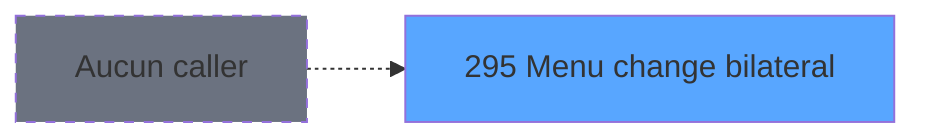

# ADH IDE 295 - Menu change bilateral

> **Analyse**: Phases 1-4 2026-02-07 03:55 -> 03:55 (36s) | Assemblage 03:55
> **Pipeline**: V7.2 Enrichi
> **Structure**: 4 onglets (Resume | Ecrans | Donnees | Connexions)

<!-- TAB:Resume -->

## 1. FICHE D'IDENTITE

| Attribut | Valeur |
|----------|--------|
| Projet | ADH |
| IDE Position | 295 |
| Nom Programme | Menu change bilateral |
| Fichier source | `Prg_295.xml` |
| Dossier IDE | Change |
| Taches | 1 (1 ecrans visibles) |
| Tables modifiees | 0 |
| Programmes appeles | 4 |
| :warning: Statut | **ORPHELIN_POTENTIEL** |

## 2. DESCRIPTION FONCTIONNELLE

**Menu change bilateral** assure la gestion complete de ce processus.

Le flux de traitement s'organise en **1 blocs fonctionnels** :

- **Calcul** (1 tache) : calculs de montants, stocks ou compteurs

## 3. BLOCS FONCTIONNELS

### 3.1 Calcul (1 tache)

Calculs metier : montants, stocks, compteurs.

---

#### 295 - OCA  Menu solde d'un compte [[ECRAN]](#ecran-t1)

**Role** : Consultation/chargement : OCA  Menu solde d'un compte.
**Ecran** : 608 x 159 DLU (MDI) | [Voir mockup](#ecran-t1)
**Variables liees** : I (P0 solde compte), J (P0 etat compte), K (P0 date du solde)

## 5. REGLES METIER

*(Aucune regle metier identifiee)*

## 6. CONTEXTE

- **Appele par**: (aucun)
- **Appelle**: 4 programmes | **Tables**: 0 (W:0 R:0 L:0) | **Taches**: 1 | **Expressions**: 7

<!-- TAB:Ecrans -->

## 8. ECRANS

### 8.1 Forms visibles (1 / 1)

| # | Position | Tache | Nom | Type | Largeur | Hauteur | Bloc |
|---|----------|-------|-----|------|---------|---------|------|
| 1 | 295 | 295 | OCA  Menu solde d'un compte | MDI | 608 | 159 | Calcul |

### 8.2 Mockups Ecrans

---

#### 295 - OCA  Menu solde d'un compte
**Tache** : [295](#t1) | **Type** : MDI | **Dimensions** : 608 x 159 DLU
**Bloc** : Calcul | **Titre IDE** : OCA  Menu solde d'un compte

<!-- FORM-DATA:
{
    "width":  608,
    "vFactor":  8,
    "type":  "MDI",
    "hFactor":  8,
    "controls":  [
                     {
                         "x":  0,
                         "type":  "label",
                         "var":  "",
                         "y":  3,
                         "w":  608,
                         "fmt":  "",
                         "name":  "",
                         "h":  18,
                         "color":  "",
                         "text":  "",
                         "parent":  null
                     },
                     {
                         "x":  46,
                         "type":  "label",
                         "var":  "",
                         "y":  38,
                         "w":  517,
                         "fmt":  "",
                         "name":  "",
                         "h":  82,
                         "color":  "",
                         "text":  "",
                         "parent":  null
                     },
                     {
                         "x":  50,
                         "type":  "label",
                         "var":  "",
                         "y":  39,
                         "w":  510,
                         "fmt":  "",
                         "name":  "",
                         "h":  80,
                         "color":  "",
                         "text":  "",
                         "parent":  null
                     },
                     {
                         "x":  242,
                         "type":  "label",
                         "var":  "",
                         "y":  52,
                         "w":  285,
                         "fmt":  "",
                         "name":  "",
                         "h":  42,
                         "color":  "",
                         "text":  "",
                         "parent":  null
                     },
                     {
                         "x":  243,
                         "type":  "label",
                         "var":  "",
                         "y":  53,
                         "w":  50,
                         "fmt":  "",
                         "name":  "",
                         "h":  40,
                         "color":  "",
                         "text":  "",
                         "parent":  null
                     },
                     {
                         "x":  301,
                         "type":  "label",
                         "var":  "",
                         "y":  60,
                         "w":  178,
                         "fmt":  "",
                         "name":  "",
                         "h":  8,
                         "color":  "7",
                         "text":  "Achat de devises",
                         "parent":  null
                     },
                     {
                         "x":  301,
                         "type":  "label",
                         "var":  "",
                         "y":  76,
                         "w":  178,
                         "fmt":  "",
                         "name":  "",
                         "h":  8,
                         "color":  "7",
                         "text":  "Vente de devises",
                         "parent":  null
                     },
                     {
                         "x":  305,
                         "type":  "label",
                         "var":  "",
                         "y":  102,
                         "w":  120,
                         "fmt":  "",
                         "name":  "",
                         "h":  9,
                         "color":  "",
                         "text":  "Votre choix",
                         "parent":  null
                     },
                     {
                         "x":  0,
                         "type":  "label",
                         "var":  "",
                         "y":  135,
                         "w":  607,
                         "fmt":  "",
                         "name":  "",
                         "h":  24,
                         "color":  "",
                         "text":  "",
                         "parent":  null
                     },
                     {
                         "x":  426,
                         "type":  "edit",
                         "var":  "",
                         "y":  102,
                         "w":  26,
                         "fmt":  "UA",
                         "name":  "W0 choix action",
                         "h":  10,
                         "color":  "6",
                         "text":  "",
                         "parent":  null
                     },
                     {
                         "x":  7,
                         "type":  "edit",
                         "var":  "",
                         "y":  8,
                         "w":  267,
                         "fmt":  "20",
                         "name":  "",
                         "h":  8,
                         "color":  "",
                         "text":  "",
                         "parent":  null
                     },
                     {
                         "x":  385,
                         "type":  "edit",
                         "var":  "",
                         "y":  8,
                         "w":  216,
                         "fmt":  "WWW  DD MMM YYYYT",
                         "name":  "",
                         "h":  8,
                         "color":  "",
                         "text":  "",
                         "parent":  null
                     },
                     {
                         "x":  65,
                         "type":  "image",
                         "var":  "",
                         "y":  56,
                         "w":  163,
                         "fmt":  "",
                         "name":  "",
                         "h":  44,
                         "color":  "",
                         "text":  "",
                         "parent":  null
                     },
                     {
                         "x":  254,
                         "type":  "button",
                         "var":  "",
                         "y":  59,
                         "w":  26,
                         "fmt":  "1",
                         "name":  "1",
                         "h":  9,
                         "color":  "",
                         "text":  "",
                         "parent":  null
                     },
                     {
                         "x":  254,
                         "type":  "button",
                         "var":  "",
                         "y":  75,
                         "w":  26,
                         "fmt":  "2",
                         "name":  "2",
                         "h":  9,
                         "color":  "",
                         "text":  "",
                         "parent":  null
                     },
                     {
                         "x":  5,
                         "type":  "button",
                         "var":  "",
                         "y":  138,
                         "w":  154,
                         "fmt":  "\u0026Quitter",
                         "name":  "",
                         "h":  18,
                         "color":  "",
                         "text":  "",
                         "parent":  13
                     }
                 ],
    "taskId":  "295",
    "height":  159
}
-->

<strong>Champs : 3 champs</strong>

| Pos (x,y) | Nom | Variable | Type |
|-----------|-----|----------|------|
| 426,102 | W0 choix action | - | edit |
| 7,8 | 20 | - | edit |
| 385,8 | WWW  DD MMM YYYYT | - | edit |

<strong>Boutons : 3 boutons</strong>

| Bouton | Pos (x,y) | Action |
|--------|-----------|--------|
| 1 | 254,59 | Bouton fonctionnel |
| 2 | 254,75 | Bouton fonctionnel |
| Quitter | 5,138 | Quitte le programme |

## 9. NAVIGATION

Ecran unique: **OCA  Menu solde d'un compte**

### 9.3 Structure hierarchique (1 tache)

| Position | Tache | Type | Dimensions | Bloc |
|----------|-------|------|------------|------|
| **295.1** | [**OCA  Menu solde d'un compte** (295)](#t1) [mockup](#ecran-t1) | MDI | 608x159 | Calcul |

### 9.4 Algorigramme

> **Legende**: Vert = START/END OK | Rouge = END KO | Bleu = Decisions
> *Algorigramme auto-genere. Utiliser `/algorigramme` pour une synthese metier detaillee.*

<!-- TAB:Donnees -->

## 10. TABLES

### Tables utilisees (0)

| ID | Nom | Description | Type | R | W | L | Usages |
|----|-----|-------------|------|---|---|---|--------|

### Colonnes par table (0 / 0 tables avec colonnes identifiees)

## 11. VARIABLES

### 11.1 Parametres entrants (15)

Variables recues en parametre.

| Lettre | Nom | Type | Usage dans |
|--------|-----|------|-----------|
| A | P0 societe | Alpha | - |
| B | P0 code GM | Numeric | - |
| C | P0 filiation | Numeric | - |
| D | P0 devise locale | Alpha | - |
| E | P0 nb decimale | Numeric | - |
| F | P0 masque montant | Alpha | - |
| G | P0 code retour | Alpha | - |
| H | P0 nom du village | Alpha | - |
| I | P0 solde compte | Numeric | - |
| J | P0 etat compte | Alpha | - |
| K | P0 date du solde | Date | - |
| L | P0 garanti O/N | Alpha | - |
| M | P0 telephone | Alpha | - |
| N | P0 fax | Alpha | - |
| O | P0 nouvelle caisse | Alpha | - |

### 11.2 Variables de session (1)

Variables persistantes pendant toute la session.

| Lettre | Nom | Type | Usage dans |
|--------|-----|------|-----------|
| Q | v. titre ecran | Alpha | 1x session |

### 11.3 Variables de travail (1)

Variables internes au programme.

| Lettre | Nom | Type | Usage dans |
|--------|-----|------|-----------|
| P | W0 choix action | Alpha | 2x calcul interne |

Toutes les 17 variables (liste complete)

| Cat | Lettre | Nom Variable | Type |
|-----|--------|--------------|------|
| P0 | **A** | P0 societe | Alpha |
| P0 | **B** | P0 code GM | Numeric |
| P0 | **C** | P0 filiation | Numeric |
| P0 | **D** | P0 devise locale | Alpha |
| P0 | **E** | P0 nb decimale | Numeric |
| P0 | **F** | P0 masque montant | Alpha |
| P0 | **G** | P0 code retour | Alpha |
| P0 | **H** | P0 nom du village | Alpha |
| P0 | **I** | P0 solde compte | Numeric |
| P0 | **J** | P0 etat compte | Alpha |
| P0 | **K** | P0 date du solde | Date |
| P0 | **L** | P0 garanti O/N | Alpha |
| P0 | **M** | P0 telephone | Alpha |
| P0 | **N** | P0 fax | Alpha |
| P0 | **O** | P0 nouvelle caisse | Alpha |
| W0 | **P** | W0 choix action | Alpha |
| V. | **Q** | v. titre ecran | Alpha |

## 12. EXPRESSIONS

**7 / 7 expressions decodees (100%)**

### 12.1 Repartition par type

| Type | Expressions | Regles |
|------|-------------|--------|
| CONSTANTE | 2 | 0 |
| DATE | 1 | 0 |
| REFERENCE_VG | 1 | 0 |
| CONDITION | 2 | 0 |
| STRING | 1 | 0 |

### 12.2 Expressions cles par type

#### CONSTANTE (2 expressions)

| Type | IDE | Expression | Regle |
|------|-----|------------|-------|
| CONSTANTE | 5 | `''` | - |
| CONSTANTE | 4 | `38` | - |

#### DATE (1 expressions)

| Type | IDE | Expression | Regle |
|------|-----|------------|-------|
| DATE | 1 | `Date ()` | - |

#### REFERENCE_VG (1 expressions)

| Type | IDE | Expression | Regle |
|------|-----|------------|-------|
| REFERENCE_VG | 2 | `VG2` | - |

#### CONDITION (2 expressions)

| Type | IDE | Expression | Regle |
|------|-----|------------|-------|
| CONDITION | 7 | `W0 choix action [P]='2'` | - |
| CONDITION | 6 | `W0 choix action [P]='1'` | - |

#### STRING (1 expressions)

| Type | IDE | Expression | Regle |
|------|-----|------------|-------|
| STRING | 3 | `Trim (v. titre ecran [Q])` | - |

<!-- TAB:Connexions -->

## 13. GRAPHE D'APPELS

### 13.1 Chaine depuis Main (Callers)

**Chemin**: (pas de callers directs)

### 13.2 Callers

| IDE | Nom Programme | Nb Appels |
|-----|---------------|-----------|
| - | (aucun) | - |

### 13.3 Callees (programmes appeles)

### 13.4 Detail Callees avec contexte

| IDE | Nom Programme | Appels | Contexte |
|-----|---------------|--------|----------|
| [43](ADH-IDE-43.md) | Recuperation du titre | 1 | Recuperation donnees |
| [44](ADH-IDE-44.md) | Appel programme | 1 | Sous-programme |
| [293](ADH-IDE-293.md) | Bi  Change GM Achat | 1 | Sous-programme |
| [294](ADH-IDE-294.md) | Bi  Change GM Vente | 1 | Sous-programme |

## 14. RECOMMANDATIONS MIGRATION

### 14.1 Profil du programme

| Metrique | Valeur | Impact migration |
|----------|--------|-----------------|
| Lignes de logique | 26 | Programme compact |
| Expressions | 7 | Peu de logique |
| Tables WRITE | 0 | Impact faible |
| Sous-programmes | 4 | Peu de dependances |
| Ecrans visibles | 1 | Ecran unique ou traitement batch |
| Code desactive | 0% (0 / 26) | Code sain |
| Regles metier | 0 | Pas de regle identifiee |

### 14.2 Plan de migration par bloc

#### Calcul (1 tache: 1 ecran, 0 traitement)

- **Strategie** : Services de calcul purs (Domain Services).
- Migrer la logique de calcul (stock, compteurs, montants)

### 14.3 Dependances critiques

| Dependance | Type | Appels | Impact |
|------------|------|--------|--------|
| [Bi  Change GM Achat (IDE 293)](ADH-IDE-293.md) | Sous-programme | 1x | Normale - Sous-programme |
| [Bi  Change GM Vente (IDE 294)](ADH-IDE-294.md) | Sous-programme | 1x | Normale - Sous-programme |
| [Recuperation du titre (IDE 43)](ADH-IDE-43.md) | Sous-programme | 1x | Normale - Recuperation donnees |
| [Appel programme (IDE 44)](ADH-IDE-44.md) | Sous-programme | 1x | Normale - Sous-programme |

---
*Spec DETAILED generee par Pipeline V7.2 - 2026-02-07 03:55*
