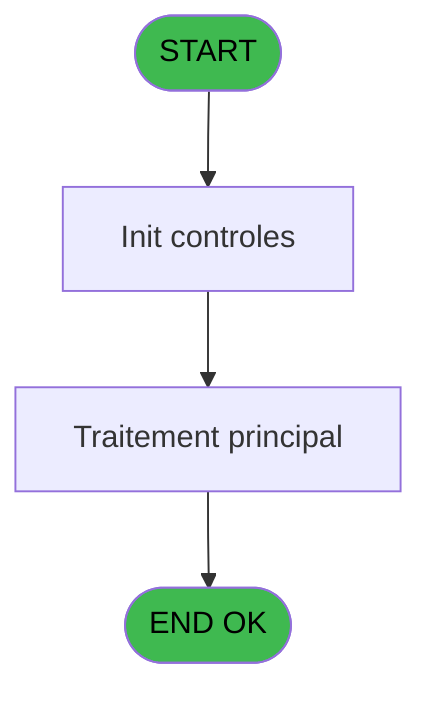

# ADH IDE 296 - Print versement/retrait bi

> **Analyse**: Phases 1-4 2026-02-07 03:55 -> 03:55 (33s) | Assemblage 03:55
> **Pipeline**: V7.2 Enrichi
> **Structure**: 4 onglets (Resume | Ecrans | Donnees | Connexions)

<!-- TAB:Resume -->

## 1. FICHE D'IDENTITE

| Attribut | Valeur |
|----------|--------|
| Projet | ADH |
| IDE Position | 296 |
| Nom Programme | Print versement/retrait bi |
| Fichier source | `Prg_296.xml` |
| Dossier IDE | Impression |
| Taches | 13 (1 ecrans visibles) |
| Tables modifiees | 0 |
| Programmes appeles | 1 |
| :warning: Statut | **ORPHELIN_POTENTIEL** |

## 2. DESCRIPTION FONCTIONNELLE

**Print versement/retrait bi** assure la gestion complete de ce processus.

Le flux de traitement s'organise en **2 blocs fonctionnels** :

- **Traitement** (8 taches) : traitements metier divers
- **Impression** (5 taches) : generation de tickets et documents

Detail : phases du traitement

#### Phase 1 : Traitement (8 taches)

- **296** - Veuillez patienter ... **[[ECRAN]](#ecran-t1)**
- **296.1.1** - Impression reçu verst/retrait **[[ECRAN]](#ecran-t3)**
- **296.1.2** - Impression reçu verst/retrait **[[ECRAN]](#ecran-t4)**
- **296.2.1** - Impression reçu verst/retrait **[[ECRAN]](#ecran-t6)**
- **296.2.2** - Impression reçu verst/retrait **[[ECRAN]](#ecran-t7)**
- **296.3.1** - Impression reçu verst/retrait **[[ECRAN]](#ecran-t9)**
- **296.4.1** - Impression reçu verst/retrait **[[ECRAN]](#ecran-t11)**
- **296.5.1** - Impression reçu verst/retrait **[[ECRAN]](#ecran-t13)**

#### Phase 2 : Impression (5 taches)

- **296.1** - Printer 1 **[[ECRAN]](#ecran-t2)**
- **296.2** - Printer 4 **[[ECRAN]](#ecran-t5)**
- **296.3** - Printer 5 **[[ECRAN]](#ecran-t8)**
- **296.4** - Printer 8 **[[ECRAN]](#ecran-t10)**
- **296.5** - Printer 9 **[[ECRAN]](#ecran-t12)**

Delegue a : [Raz Current Printer (IDE 182)](ADH-IDE-182.md)

## 3. BLOCS FONCTIONNELS

### 3.1 Traitement (8 taches)

Traitements internes.

---

#### 296 - Veuillez patienter ... [[ECRAN]](#ecran-t1)

**Role** : Tache d'orchestration : point d'entree du programme (8 sous-taches). Coordonne l'enchainement des traitements.
**Ecran** : 424 x 56 DLU (MDI) | [Voir mockup](#ecran-t1)

7 sous-taches directes

| Tache | Nom | Bloc |
|-------|-----|------|
| [296.1.1](#t3) | Impression reçu verst/retrait **[[ECRAN]](#ecran-t3)** | Traitement |
| [296.1.2](#t4) | Impression reçu verst/retrait **[[ECRAN]](#ecran-t4)** | Traitement |
| [296.2.1](#t6) | Impression reçu verst/retrait **[[ECRAN]](#ecran-t6)** | Traitement |
| [296.2.2](#t7) | Impression reçu verst/retrait **[[ECRAN]](#ecran-t7)** | Traitement |
| [296.3.1](#t9) | Impression reçu verst/retrait **[[ECRAN]](#ecran-t9)** | Traitement |
| [296.4.1](#t11) | Impression reçu verst/retrait **[[ECRAN]](#ecran-t11)** | Traitement |
| [296.5.1](#t13) | Impression reçu verst/retrait **[[ECRAN]](#ecran-t13)** | Traitement |

---

#### 296.1.1 - Impression reçu verst/retrait [[ECRAN]](#ecran-t3)

**Role** : Generation du document : Impression reçu verst/retrait.
**Ecran** : 1058 x 791 DLU (MDI) | [Voir mockup](#ecran-t3)

---

#### 296.1.2 - Impression reçu verst/retrait [[ECRAN]](#ecran-t4)

**Role** : Generation du document : Impression reçu verst/retrait.
**Ecran** : 1058 x 791 DLU (MDI) | [Voir mockup](#ecran-t4)

---

#### 296.2.1 - Impression reçu verst/retrait [[ECRAN]](#ecran-t6)

**Role** : Generation du document : Impression reçu verst/retrait.
**Ecran** : 1058 x 791 DLU (MDI) | [Voir mockup](#ecran-t6)

---

#### 296.2.2 - Impression reçu verst/retrait [[ECRAN]](#ecran-t7)

**Role** : Generation du document : Impression reçu verst/retrait.
**Ecran** : 1058 x 791 DLU (MDI) | [Voir mockup](#ecran-t7)

---

#### 296.3.1 - Impression reçu verst/retrait [[ECRAN]](#ecran-t9)

**Role** : Generation du document : Impression reçu verst/retrait.
**Ecran** : 357 x 103 DLU (MDI) | [Voir mockup](#ecran-t9)

---

#### 296.4.1 - Impression reçu verst/retrait [[ECRAN]](#ecran-t11)

**Role** : Generation du document : Impression reçu verst/retrait.
**Ecran** : 1058 x 791 DLU (MDI) | [Voir mockup](#ecran-t11)

---

#### 296.5.1 - Impression reçu verst/retrait [[ECRAN]](#ecran-t13)

**Role** : Generation du document : Impression reçu verst/retrait.
**Ecran** : 1058 x 791 DLU (MDI) | [Voir mockup](#ecran-t13)

### 3.2 Impression (5 taches)

Generation des documents et tickets.

---

#### 296.1 - Printer 1 [[ECRAN]](#ecran-t2)

**Role** : Generation du document : Printer 1.
**Ecran** : 1058 x 791 DLU (MDI) | [Voir mockup](#ecran-t2)
**Delegue a** : [Raz Current Printer (IDE 182)](ADH-IDE-182.md)

---

#### 296.2 - Printer 4 [[ECRAN]](#ecran-t5)

**Role** : Generation du document : Printer 4.
**Ecran** : 1058 x 791 DLU (MDI) | [Voir mockup](#ecran-t5)
**Delegue a** : [Raz Current Printer (IDE 182)](ADH-IDE-182.md)

---

#### 296.3 - Printer 5 [[ECRAN]](#ecran-t8)

**Role** : Generation du document : Printer 5.
**Ecran** : 357 x 103 DLU (MDI) | [Voir mockup](#ecran-t8)
**Delegue a** : [Raz Current Printer (IDE 182)](ADH-IDE-182.md)

---

#### 296.4 - Printer 8 [[ECRAN]](#ecran-t10)

**Role** : Generation du document : Printer 8.
**Ecran** : 1058 x 791 DLU (MDI) | [Voir mockup](#ecran-t10)
**Delegue a** : [Raz Current Printer (IDE 182)](ADH-IDE-182.md)

---

#### 296.5 - Printer 9 [[ECRAN]](#ecran-t12)

**Role** : Generation du document : Printer 9.
**Ecran** : 1058 x 791 DLU (MDI) | [Voir mockup](#ecran-t12)
**Delegue a** : [Raz Current Printer (IDE 182)](ADH-IDE-182.md)

## 5. REGLES METIER

*(Aucune regle metier identifiee)*

## 6. CONTEXTE

- **Appele par**: (aucun)
- **Appelle**: 1 programmes | **Tables**: 2 (W:0 R:1 L:1) | **Taches**: 13 | **Expressions**: 7

<!-- TAB:Ecrans -->

## 8. ECRANS

### 8.1 Forms visibles (1 / 13)

| # | Position | Tache | Nom | Type | Largeur | Hauteur | Bloc |
|---|----------|-------|-----|------|---------|---------|------|
| 1 | 296 | 296 | Veuillez patienter ... | MDI | 424 | 56 | Traitement |

### 8.2 Mockups Ecrans

---

#### 296 - Veuillez patienter ...
**Tache** : [296](#t1) | **Type** : MDI | **Dimensions** : 424 x 56 DLU
**Bloc** : Traitement | **Titre IDE** : Veuillez patienter ...

<!-- FORM-DATA:
{
    "width":  424,
    "vFactor":  8,
    "type":  "MDI",
    "hFactor":  8,
    "controls":  [
                     {
                         "x":  0,
                         "type":  "label",
                         "var":  "",
                         "y":  0,
                         "w":  423,
                         "fmt":  "",
                         "name":  "",
                         "h":  29,
                         "color":  "",
                         "text":  "",
                         "parent":  null
                     },
                     {
                         "x":  120,
                         "type":  "label",
                         "var":  "",
                         "y":  10,
                         "w":  221,
                         "fmt":  "",
                         "name":  "",
                         "h":  8,
                         "color":  "7",
                         "text":  "Impression en cours ...",
                         "parent":  null
                     },
                     {
                         "x":  0,
                         "type":  "label",
                         "var":  "",
                         "y":  29,
                         "w":  423,
                         "fmt":  "",
                         "name":  "",
                         "h":  27,
                         "color":  "",
                         "text":  "",
                         "parent":  null
                     },
                     {
                         "x":  55,
                         "type":  "label",
                         "var":  "",
                         "y":  38,
                         "w":  315,
                         "fmt":  "",
                         "name":  "",
                         "h":  8,
                         "color":  "",
                         "text":  "Edition des versements / retraits",
                         "parent":  null
                     },
                     {
                         "x":  4,
                         "type":  "image",
                         "var":  "",
                         "y":  2,
                         "w":  72,
                         "fmt":  "",
                         "name":  "",
                         "h":  25,
                         "color":  "",
                         "text":  "",
                         "parent":  null
                     }
                 ],
    "taskId":  "296",
    "height":  56
}
-->

## 9. NAVIGATION

Ecran unique: **Veuillez patienter ...**

### 9.3 Structure hierarchique (13 taches)

| Position | Tache | Type | Dimensions | Bloc |
|----------|-------|------|------------|------|
| **296.1** | [**Veuillez patienter ...** (296)](#t1) [mockup](#ecran-t1) | MDI | 424x56 | Traitement |
| 296.1.1 | [Impression reçu verst/retrait (296.1.1)](#t3) [mockup](#ecran-t3) | MDI | 1058x791 | |
| 296.1.2 | [Impression reçu verst/retrait (296.1.2)](#t4) [mockup](#ecran-t4) | MDI | 1058x791 | |
| 296.1.3 | [Impression reçu verst/retrait (296.2.1)](#t6) [mockup](#ecran-t6) | MDI | 1058x791 | |
| 296.1.4 | [Impression reçu verst/retrait (296.2.2)](#t7) [mockup](#ecran-t7) | MDI | 1058x791 | |
| 296.1.5 | [Impression reçu verst/retrait (296.3.1)](#t9) [mockup](#ecran-t9) | MDI | 357x103 | |
| 296.1.6 | [Impression reçu verst/retrait (296.4.1)](#t11) [mockup](#ecran-t11) | MDI | 1058x791 | |
| 296.1.7 | [Impression reçu verst/retrait (296.5.1)](#t13) [mockup](#ecran-t13) | MDI | 1058x791 | |
| **296.2** | [**Printer 1** (296.1)](#t2) [mockup](#ecran-t2) | MDI | 1058x791 | Impression |
| 296.2.1 | [Printer 4 (296.2)](#t5) [mockup](#ecran-t5) | MDI | 1058x791 | |
| 296.2.2 | [Printer 5 (296.3)](#t8) [mockup](#ecran-t8) | MDI | 357x103 | |
| 296.2.3 | [Printer 8 (296.4)](#t10) [mockup](#ecran-t10) | MDI | 1058x791 | |
| 296.2.4 | [Printer 9 (296.5)](#t12) [mockup](#ecran-t12) | MDI | 1058x791 | |

### 9.4 Algorigramme

> **Legende**: Vert = START/END OK | Rouge = END KO | Bleu = Decisions
> *Algorigramme auto-genere. Utiliser `/algorigramme` pour une synthese metier detaillee.*

<!-- TAB:Donnees -->

## 10. TABLES

### Tables utilisees (2)

| ID | Nom | Description | Type | R | W | L | Usages |
|----|-----|-------------|------|---|---|---|--------|
| 30 | gm-recherche_____gmr | Index de recherche | DB |   |   | L | 7 |
| 40 | comptable________cte |  | DB | R |   |   | 7 |

### Colonnes par table (1 / 1 tables avec colonnes identifiees)

Table 40 - comptable________cte (R) - 7 usages

| Lettre | Variable | Acces | Type |
|--------|----------|-------|------|
| A | W1 imprimante | R | Alpha |
| B | W1 large | R | Alpha |
| C | W1 normal | R | Alpha |
| D | W1 condense | R | Alpha |
| E | W1 detection papier | R | Alpha |
| F | W1 inhibe panel | R | Alpha |
| G | W1 massicot | R | Alpha |
| H | W1 selection feuille | R | Alpha |
| I | W1 selection rouleau | R | Alpha |
| J | W1 ejection | R | Alpha |

## 11. VARIABLES

### 11.1 Parametres entrants (9)

Variables recues en parametre.

| Lettre | Nom | Type | Usage dans |
|--------|-----|------|-----------|
| A | P0 societe | Alpha | - |
| B | P0 code adherent | Numeric | - |
| C | P0 date | Date | - |
| D | P0 heure | Time | - |
| E | P0 devise locale | Alpha | - |
| F | P0 masque montant | Alpha | - |
| G | P0 nom village | Alpha | - |
| H | P0 telephone | Alpha | - |
| I | P0 fax | Alpha | - |

### 11.2 Variables de travail (1)

Variables internes au programme.

| Lettre | Nom | Type | Usage dans |
|--------|-----|------|-----------|
| J | W0 entête ? | Alpha | - |

## 12. EXPRESSIONS

**7 / 7 expressions decodees (100%)**

### 12.1 Repartition par type

| Type | Expressions | Regles |
|------|-------------|--------|
| OTHER | 2 | 0 |
| CONDITION | 5 | 0 |

### 12.2 Expressions cles par type

#### OTHER (2 expressions)

| Type | IDE | Expression | Regle |
|------|-----|------------|-------|
| OTHER | 2 | `SetCrsr (1)` | - |
| OTHER | 1 | `SetCrsr (2)` | - |

#### CONDITION (5 expressions)

| Type | IDE | Expression | Regle |
|------|-----|------------|-------|
| CONDITION | 6 | `GetParam ('CURRENTPRINTERNUM')=8` | - |
| CONDITION | 7 | `GetParam ('CURRENTPRINTERNUM')=9` | - |
| CONDITION | 5 | `GetParam ('CURRENTPRINTERNUM')=5` | - |
| CONDITION | 3 | `GetParam ('CURRENTPRINTERNUM')=1` | - |
| CONDITION | 4 | `GetParam ('CURRENTPRINTERNUM')=4` | - |

<!-- TAB:Connexions -->

## 13. GRAPHE D'APPELS

### 13.1 Chaine depuis Main (Callers)

**Chemin**: (pas de callers directs)

### 13.2 Callers

| IDE | Nom Programme | Nb Appels |
|-----|---------------|-----------|
| - | (aucun) | - |

### 13.3 Callees (programmes appeles)

### 13.4 Detail Callees avec contexte

| IDE | Nom Programme | Appels | Contexte |
|-----|---------------|--------|----------|
| [182](ADH-IDE-182.md) | Raz Current Printer | 1 | Impression ticket/document |

## 14. RECOMMANDATIONS MIGRATION

### 14.1 Profil du programme

| Metrique | Valeur | Impact migration |
|----------|--------|-----------------|
| Lignes de logique | 233 | Taille moyenne |
| Expressions | 7 | Peu de logique |
| Tables WRITE | 0 | Impact faible |
| Sous-programmes | 1 | Peu de dependances |
| Ecrans visibles | 1 | Ecran unique ou traitement batch |
| Code desactive | 0% (0 / 233) | Code sain |
| Regles metier | 0 | Pas de regle identifiee |

### 14.2 Plan de migration par bloc

#### Traitement (8 taches: 8 ecrans, 0 traitement)

- **Strategie** : 8 composant(s) UI (Razor/React) avec formulaires et validation.
- 1 sous-programme(s) a migrer ou a reutiliser depuis les services existants.
- Decomposer les taches en services unitaires testables.

#### Impression (5 taches: 5 ecrans, 0 traitement)

- **Strategie** : Templates HTML -> PDF via wkhtmltopdf ou Puppeteer.
- `PrintService` injectable avec choix imprimante

### 14.3 Dependances critiques

| Dependance | Type | Appels | Impact |
|------------|------|--------|--------|
| [Raz Current Printer (IDE 182)](ADH-IDE-182.md) | Sous-programme | 1x | Normale - Impression ticket/document |

---
*Spec DETAILED generee par Pipeline V7.2 - 2026-02-07 03:55*
