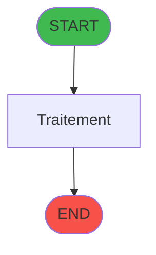
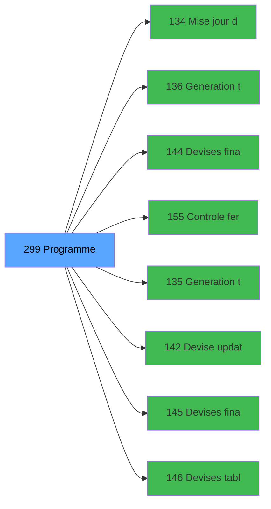

# ADH IDE 299 - Programme supprime (Prg_296)

> **Version spec**: 3.5
> **Analyse**: 2026-01-27 17:57
> **Source**: `Prg_XXX.xml`

---

<!-- TAB:Fonctionnel -->

## SPECIFICATION FONCTIONNELLE

### 1.1 Objectif metier

| Element | Description |
|---------|-------------|
| **Qui** | Operateur |
| **Quoi** | Programme supprime (Prg_296)
 |
| **Pourquoi** | A documenter |
| **Declencheur** | A identifier |

### 1.2 Regles metier

| Code | Regle | Condition |
|------|-------|-----------|
| RM-001 | A documenter | - |

### 1.3 Flux utilisateur

1. Demarrage programme
2. Traitement principal
3. Fin programme

### 1.4 Cas d'erreur

| Erreur | Comportement |
|--------|--------------|
| - | A documenter |

---

<!-- TAB:Technique -->

## SPECIFICATION TECHNIQUE

### 2.1 Identification

| Attribut | Valeur |
|----------|--------|
| **Format IDE** | ADH IDE 299 |
| **Description** | Programme supprime (Prg_296)
 |
| **Module** | ADH |

### 2.2 Tables

| # | Nom logique | Nom physique | Acces | Usage |
|---|-------------|--------------|-------|-------|
| 50 | moyens_reglement_mor | `cafil028_dat` | R | 1x |
| 67 | tables___________tab | `cafil045_dat` | R | 1x |
| 139 | moyens_reglement_mor | `cafil117_dat` | R | 1x |
| 232 | gestion_devise_session | `caisse_devise` | L | 1x |
| 241 | pointage_appro_remise | `caisse_pointage_apprem` | **W** | 1x |
| 242 | pointage_article | `caisse_pointage_article` | **W** | 1x |
| 243 | pointage_devise | `caisse_pointage_devise` | **W** | 1x |
| 693 | devise_in | `devisein_par` | R | 1x |
### 2.3 Parametres d'entree

| Variable | Nom | Type | Picture |
|----------|-----|------|---------|
| - | Aucun parametre | - | - |
### 2.4 Algorigramme

### 2.5 Expressions cles

| IDE | Expression | Commentaire |
|-----|------------|-------------|
| 1 | `{0,16}=0` | - |
| 2 | `{0,15}` | - |
| 3 | `{0,76}` | - |
| 4 | `{0,77}` | - |
| 5 | `{0,78}` | - |
| 6 | `{0,79}` | - |
| 7 | `'FALSE'LOG` | - |
| 8 | `'F'` | - |
| 9 | `{0,55}<>0 OR {0,56}<>0 OR {0,49}<>0 OR {0,51}<>...` | - |
| 10 | `'D'` | - |
| 11 | `'TRUE'LOG` | - |

> **Total**: 11 expressions (affichees: 11)
### 2.6 Variables importantes

### 2.7 Statistiques

| Metrique | Valeur |
|----------|--------|
| **Taches** | 14 |
| **Lignes logique** | 489 |
| **Lignes desactivees** | 0 |
---

<!-- TAB:Cartographie -->

## CARTOGRAPHIE APPLICATIVE

### 3.1 Chaine d'appels depuis Main

### 3.2 Callers directs

| IDE | Programme | Nb appels |
|-----|-----------|-----------|
| - | **Aucun caller** (point d'entree ou orphelin) | - |
### 3.3 Callees

| Niv | IDE | Programme | Nb appels |
|-----|-----|-----------|-----------|
| 1 | 134 | Mise à jour detail session WS | 7 |
| 1 | 136 | Generation ticket WS | 7 |
| 1 | 144 | Devises finales F/F Nbre WS | 3 |
| 1 | 155 | Controle fermeture caisse WS | 3 |
| 1 | 135 | Generation tableau recap WS | 2 |
| 1 | 142 | Devise update session WS | 2 |
| 1 | 145 | Devises finales F/F Qte WS | 2 |
| 1 | 146 | Devises tableau recap WS | 2 |
| 1 | 147 | Devises des tickets WS | 2 |
| 1 | 148 | Devises RAZ WS | 2 |
| 1 | 154 | Tableau recap fermeture | 2 |
| 1 | 43 | Recuperation du titre | 1 |
| 1 | 120 | Saisie contenu caisse | 1 |
| 1 | 123 | Apport coffre | 1 |
| 1 | 124 | Apport articles | 1 |
| 1 | 125 | Remise en caisse | 1 |
| 1 | 127 | Calcul solde ouverture WS | 1 |
| 1 | 130 | Ecart fermeture caisse | 1 |
| 1 | 133 | Mise a jour comptage caisse WS | 1 |
| 1 | 138 | Ticket fermeture session | 1 |
### 3.4 Verification orphelin

| Critere | Resultat |
|---------|----------|
| Callers actifs | A verifier |
| **Conclusion** | A analyser |

---

## HISTORIQUE

| Date | Action | Auteur |
|------|--------|--------|
| 2026-01-27 20:25 | **DATA V2** - Tables reelles, Expressions, Stats, CallChain | Script |
| 2026-01-27 19:51 | **DATA POPULATED** - Tables, Callgraph (11 expr) | Script |
| 2026-01-27 17:57 | **Upgrade V3.5** - TAB markers, Mermaid | Claude |

---

*Specification V3.5 - Format avec TAB markers et Mermaid*
