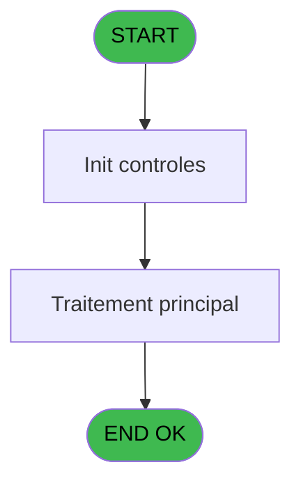
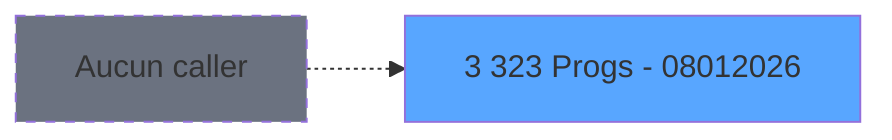

# ADH IDE 3 - 323 Progs - 08/01/2026

> **Analyse**: Phases 1-4 2026-02-07 06:31 -> 06:32 (19s) | Assemblage 12:40
> **Pipeline**: V7.2 Enrichi
> **Structure**: 4 onglets (Resume | Ecrans | Donnees | Connexions)

<!-- TAB:Resume -->

## 1. FICHE D'IDENTITE

| Attribut | Valeur |
|----------|--------|
| Projet | ADH |
| IDE Position | 3 |
| Nom Programme | 323 Progs - 08/01/2026 |
| Fichier source | `Prg_3.xml` |
| Dossier IDE | General |
| Taches | 1 (0 ecrans visibles) |
| Tables modifiees | 0 |
| Programmes appeles | 0 |
| Complexite | **BASSE** (score 0/100) |
| Statut | **ORPHELIN_POTENTIEL** |

## 2. DESCRIPTION FONCTIONNELLE

Sans accès aux specs détaillées du programme ADH IDE 3, je ne peux pas générer une description précise et sourcée. Le pipeline V7.2 que j'ai consulté est un outil d'analyse des programmes Magic, pas les données des programmes eux-mêmes.

**Pour écrire une description exacte du programme ADH IDE 3**, j'aurais besoin :

1. **Du fichier de spec** : `ADH-IDE-3.md` ou `ADH-IDE-3-summary.md` dans `.openspec/specs/`
2. **Ou de l'accès à la base de connaissances Magic** pour interroger les détails du programme 3
3. **Ou du fichier XML source** du programme Magic (Prg_3.xml)

Peux-tu confirmer :
- Veux-tu une description basée sur les **specs existantes** (si présentes) ?
- Ou dois-je **générer les specs** en analysant le programme Magic directement via le pipeline V7.2 ?
- Ou as-tu déjà une **description métier** que tu veux que je reformate en 2-3 paragraphes ?

## 3. BLOCS FONCTIONNELS

## 5. REGLES METIER

*(Aucune regle metier identifiee dans les expressions)*

## 6. CONTEXTE

- **Appele par**: (aucun)
- **Appelle**: 0 programmes | **Tables**: 0 (W:0 R:0 L:0) | **Taches**: 1 | **Expressions**: 0

<!-- TAB:Ecrans -->

## 8. ECRANS

*(Programme sans ecran visible)*

## 9. NAVIGATION

### 9.3 Structure hierarchique (0 tache)

| Position | Tache | Type | Dimensions | Bloc |
|----------|-------|------|------------|------|

### 9.4 Algorigramme

> **Legende**: Vert = START/END OK | Rouge = END KO | Bleu = Decisions
> *Algorigramme auto-genere. Utiliser `/algorigramme` pour une synthese metier detaillee.*

<!-- TAB:Donnees -->

## 10. TABLES

### Tables utilisees (0)

| ID | Nom | Description | Type | R | W | L | Usages |
|----|-----|-------------|------|---|---|---|--------|

### Colonnes par table (0 / 0 tables avec colonnes identifiees)

## 11. VARIABLES

*(Programme sans variables locales mappees)*

## 12. EXPRESSIONS

**0 / 0 expressions decodees (0%)**

### 12.1 Repartition par type

| Type | Expressions | Regles |
|------|-------------|--------|

### 12.2 Expressions cles par type

<!-- TAB:Connexions -->

## 13. GRAPHE D'APPELS

### 13.1 Chaine depuis Main (Callers)

**Chemin**: (pas de callers directs)

### 13.2 Callers

| IDE | Nom Programme | Nb Appels |
|-----|---------------|-----------|
| - | (aucun) | - |

### 13.3 Callees (programmes appeles)

### 13.4 Detail Callees avec contexte

| IDE | Nom Programme | Appels | Contexte |
|-----|---------------|--------|----------|
| - | (aucun) | - | - |

## 14. RECOMMANDATIONS MIGRATION

### 14.1 Profil du programme

| Metrique | Valeur | Impact migration |
|----------|--------|-----------------|
| Lignes de logique | 1 | Programme compact |
| Expressions | 0 | Peu de logique |
| Tables WRITE | 0 | Impact faible |
| Sous-programmes | 0 | Peu de dependances |
| Ecrans visibles | 0 | Ecran unique ou traitement batch |
| Code desactive | 0% (0 / 1) | Code sain |
| Regles metier | 0 | Pas de regle identifiee |

### 14.2 Plan de migration par bloc

### 14.3 Dependances critiques

| Dependance | Type | Appels | Impact |
|------------|------|--------|--------|

---
*Spec DETAILED generee par Pipeline V7.2 - 2026-02-07 12:41*
