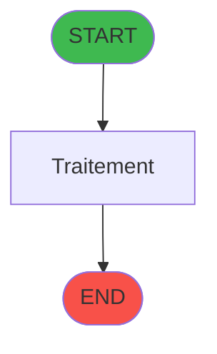
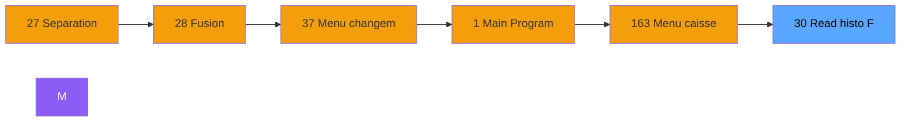

# ADH IDE 30 - Read histo Fus_Sep_Det

> **Version spec**: 3.5
> **Analyse**: 2026-01-27 17:56
> **Source**: `Prg_XXX.xml`

---

<!-- TAB:Fonctionnel -->

## SPECIFICATION FONCTIONNELLE

### 1.1 Objectif metier

| Element | Description |
|---------|-------------|
| **Qui** | Operateur |
| **Quoi** | Read histo Fus_Sep_Det
 |
| **Pourquoi** | A documenter |
| **Declencheur** | A identifier |

### 1.2 Regles metier

| Code | Regle | Condition |
|------|-------|-----------|
| RM-001 | A documenter | - |

### 1.3 Flux utilisateur

1. Demarrage programme
2. Traitement principal
3. Fin programme

### 1.4 Cas d'erreur

| Erreur | Comportement |
|--------|--------------|
| - | A documenter |

---

<!-- TAB:Technique -->

## SPECIFICATION TECHNIQUE

### 2.1 Identification

| Attribut | Valeur |
|----------|--------|
| **Format IDE** | ADH IDE 30 |
| **Description** | Read histo Fus_Sep_Det
 |
| **Module** | ADH |

### 2.2 Tables

| # | Nom logique | Nom physique | Acces | Usage |
|---|-------------|--------------|-------|-------|
| 23 | reseau_cloture___rec | `cafil001_dat` | R | 4x |
| 47 | compte_gm________cgm | `cafil025_dat` | **W** | 2x |
| 340 | histo_fusionseparation | `histo_fus_sep` | R | 1x |
| 341 | histo_fusionseparation_detail | `histo_fus_sep_detail` | R | 1x |
| 343 | histo_fusionseparation_saisie | `histo_fus_sep_saisie` | L | 1x |
| 343 | histo_fusionseparation_saisie | `histo_fus_sep_saisie` | **W** | 1x |
### 2.3 Parametres d'entree

| Variable | Nom | Type | Picture |
|----------|-----|------|---------|
| - | Aucun parametre | - | - |
### 2.4 Algorigramme

### 2.5 Expressions cles

| IDE | Expression | Commentaire |
|-----|------------|-------------|
| 1 | `'TRUE'LOG` | - |
| 2 | `{0,3}` | - |
| 3 | `{0,4}` | - |
| 4 | `{0,5}` | - |
| 5 | `'FALSE'LOG` | - |
| 6 | `{0,9}` | - |
| 7 | `{0,7}` | - |
| 8 | `{0,4}='1F' AND {0,5}=10` | - |
| 9 | `{0,4}='1F' AND {0,5}=20` | - |
| 10 | `{0,4}='1F' AND {0,5}=30` | - |
| 11 | `{0,4}='3E' AND {0,5}=50` | - |
| 12 | `{0,4}='3E' AND {0,5}=60` | - |
| 13 | `NOT {32768,78}` | - |
| 14 | `{32768,78}` | - |

> **Total**: 14 expressions (affichees: 14)
### 2.6 Variables importantes

### 2.7 Statistiques

| Metrique | Valeur |
|----------|--------|
| **Taches** | 11 |
| **Lignes logique** | 116 |
| **Lignes desactivees** | 0 |
---

<!-- TAB:Cartographie -->

## CARTOGRAPHIE APPLICATIVE

### 3.1 Chaine d'appels depuis Main

### 3.2 Callers directs

| IDE | Programme | Nb appels |
|-----|-----------|-----------|
| 27 | Separation | 11 |
| 28 | Fusion | 10 |
### 3.3 Callees

| Niv | IDE | Programme | Nb appels |
|-----|-----|-----------|-----------|
| - | - | Programme terminal | - |
### 3.4 Verification orphelin

| Critere | Resultat |
|---------|----------|
| Callers actifs | A verifier |
| **Conclusion** | A analyser |

---

## HISTORIQUE

| Date | Action | Auteur |
|------|--------|--------|
| 2026-01-27 20:18 | **DATA V2** - Tables reelles, Expressions, Stats, CallChain | Script |
| 2026-01-27 19:44 | **DATA POPULATED** - Tables, Callgraph (14 expr) | Script |
| 2026-01-27 17:56 | **Upgrade V3.5** - TAB markers, Mermaid | Claude |

---

*Specification V3.5 - Format avec TAB markers et Mermaid*
