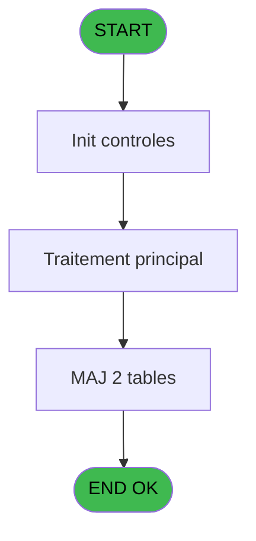
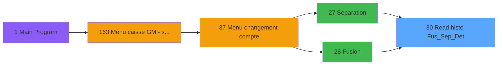

# ADH IDE 30 - Read histo Fus_Sep_Det

> **Analyse**: Phases 1-4 2026-02-07 03:41 -> 03:41 (28s) | Assemblage 03:41
> **Pipeline**: V7.2 Enrichi
> **Structure**: 4 onglets (Resume | Ecrans | Donnees | Connexions)

<!-- TAB:Resume -->

## 1. FICHE D'IDENTITE

| Attribut | Valeur |
|----------|--------|
| Projet | ADH |
| IDE Position | 30 |
| Nom Programme | Read histo Fus_Sep_Det |
| Fichier source | `Prg_30.xml` |
| Dossier IDE | General |
| Taches | 11 (0 ecrans visibles) |
| Tables modifiees | 2 |
| Programmes appeles | 0 |

## 2. DESCRIPTION FONCTIONNELLE

**Read histo Fus_Sep_Det** assure la gestion complete de ce processus, accessible depuis [Separation (IDE 27)](ADH-IDE-27.md), [Fusion (IDE 28)](ADH-IDE-28.md).

Le flux de traitement s'organise en **2 blocs fonctionnels** :

- **Traitement** (9 taches) : traitements metier divers
- **Calcul** (2 taches) : calculs de montants, stocks ou compteurs

**Donnees modifiees** : 2 tables en ecriture (compte_gm________cgm, histo_fusionseparation_saisie).

Detail : phases du traitement

#### Phase 1 : Traitement (9 taches)

- **30** - (sans nom)
- **30.1** - 1F/10 v1
- **30.2** - 1F/10 v1
- **30.3** - 1F/20
- **30.4** - 1F/30
- **30.4.2** - suppression histo
- **30.5** - 3E/50
- **30.6** - 3E/60 v1
- **30.7** - 3E/60 v1

#### Phase 2 : Calcul (2 taches)

- **30.3.1** - deblocage compte
- **30.4.1** - deblocage comptes

#### Tables impactees

| Table | Operations | Role metier |
|-------|-----------|-------------|
| histo_fusionseparation_saisie | **W**/L (2 usages) | Historique / journal |
| compte_gm________cgm | **W** (2 usages) | Comptes GM (generaux) |

## 3. BLOCS FONCTIONNELS

### 3.1 Traitement (9 taches)

Traitements internes.

---

#### 30 - (sans nom)

**Role** : Tache d'orchestration : point d'entree du programme (9 sous-taches). Coordonne l'enchainement des traitements.

8 sous-taches directes

| Tache | Nom | Bloc |
|-------|-----|------|
| [30.1](#t2) | 1F/10 v1 | Traitement |
| [30.2](#t3) | 1F/10 v1 | Traitement |
| [30.3](#t4) | 1F/20 | Traitement |
| [30.4](#t6) | 1F/30 | Traitement |
| [30.4.2](#t8) | suppression histo | Traitement |
| [30.5](#t9) | 3E/50 | Traitement |
| [30.6](#t10) | 3E/60 v1 | Traitement |
| [30.7](#t11) | 3E/60 v1 | Traitement |

---

#### 30.1 - 1F/10 v1

**Role** : Traitement : 1F/10 v1.

---

#### 30.2 - 1F/10 v1

**Role** : Traitement : 1F/10 v1.

---

#### 30.3 - 1F/20

**Role** : Traitement : 1F/20.

---

#### 30.4 - 1F/30

**Role** : Traitement : 1F/30.

---

#### 30.4.2 - suppression histo

**Role** : Traitement : suppression histo.

---

#### 30.5 - 3E/50

**Role** : Traitement : 3E/50.

---

#### 30.6 - 3E/60 v1

**Role** : Traitement : 3E/60 v1.

---

#### 30.7 - 3E/60 v1

**Role** : Traitement : 3E/60 v1.

### 3.2 Calcul (2 taches)

Calculs metier : montants, stocks, compteurs.

---

#### 30.3.1 - deblocage compte

**Role** : Traitement : deblocage compte.
**Variables liees** : F (i compte reference)

---

#### 30.4.1 - deblocage comptes

**Role** : Traitement : deblocage comptes.

## 5. REGLES METIER

*(Aucune regle metier identifiee)*

## 6. CONTEXTE

- **Appele par**: [Separation (IDE 27)](ADH-IDE-27.md), [Fusion (IDE 28)](ADH-IDE-28.md)
- **Appelle**: 0 programmes | **Tables**: 5 (W:2 R:3 L:1) | **Taches**: 11 | **Expressions**: 14

<!-- TAB:Ecrans -->

## 8. ECRANS

*(Programme sans ecran visible)*

## 9. NAVIGATION

### 9.3 Structure hierarchique (11 taches)

| Position | Tache | Type | Dimensions | Bloc |
|----------|-------|------|------------|------|
| **30.1** | [**(sans nom)** (30)](#t1) | MDI | - | Traitement |
| 30.1.1 | [1F/10 v1 (30.1)](#t2) | MDI | - | |
| 30.1.2 | [1F/10 v1 (30.2)](#t3) | MDI | - | |
| 30.1.3 | [1F/20 (30.3)](#t4) | MDI | - | |
| 30.1.4 | [1F/30 (30.4)](#t6) | MDI | - | |
| 30.1.5 | [suppression histo (30.4.2)](#t8) | MDI | - | |
| 30.1.6 | [3E/50 (30.5)](#t9) | MDI | - | |
| 30.1.7 | [3E/60 v1 (30.6)](#t10) | MDI | - | |
| 30.1.8 | [3E/60 v1 (30.7)](#t11) | MDI | - | |
| **30.2** | [**deblocage compte** (30.3.1)](#t5) | MDI | - | Calcul |
| 30.2.1 | [deblocage comptes (30.4.1)](#t7) | MDI | - | |

### 9.4 Algorigramme

> **Legende**: Vert = START/END OK | Rouge = END KO | Bleu = Decisions
> *Algorigramme auto-genere. Utiliser `/algorigramme` pour une synthese metier detaillee.*

<!-- TAB:Donnees -->

## 10. TABLES

### Tables utilisees (5)

| ID | Nom | Description | Type | R | W | L | Usages |
|----|-----|-------------|------|---|---|---|--------|
| 23 | reseau_cloture___rec | Donnees reseau/cloture | DB | R |   |   | 4 |
| 47 | compte_gm________cgm | Comptes GM (generaux) | DB |   | **W** |   | 2 |
| 340 | histo_fusionseparation | Historique / journal | DB | R |   |   | 1 |
| 341 | histo_fusionseparation_detail | Historique / journal | DB | R |   |   | 1 |
| 343 | histo_fusionseparation_saisie | Historique / journal | DB |   | **W** | L | 2 |

### Colonnes par table (3 / 5 tables avec colonnes identifiees)

Table 23 - reseau_cloture___rec (R) - 4 usages

| Lettre | Variable | Acces | Type |
|--------|----------|-------|------|
| A | v.Existe cloture ? | R | Logical |
| H | o etat reseau | R | Alpha |

Table 47 - compte_gm________cgm (**W**) - 2 usages

| Lettre | Variable | Acces | Type |
|--------|----------|-------|------|
| F | i compte reference | W | Numeric |

Table 340 - histo_fusionseparation (R) - 1 usages

*Table utilisee uniquement en Link ou aucune colonne Real identifiee dans le DataView.*

Table 341 - histo_fusionseparation_detail (R) - 1 usages

| Lettre | Variable | Acces | Type |
|--------|----------|-------|------|
| A | i type F/E | R | Alpha |
| B | i societe | R | Alpha |
| C | i chrono reprise | R | Numeric |
| D | i position reprise | R | Alpha |
| E | i taskNumber | R | Numeric |
| F | i compte reference | R | Numeric |
| G | o toDo | R | Logical |
| H | o etat reseau | R | Alpha |
| I | exist | R | Logical |

Table 343 - histo_fusionseparation_saisie (**W**/L) - 2 usages

*Table utilisee uniquement en Link ou aucune colonne Real identifiee dans le DataView.*

## 11. VARIABLES

### 11.1 Autres (9)

Variables diverses.

| Lettre | Nom | Type | Usage dans |
|--------|-----|------|-----------|
| A | i type F/E | Alpha | - |
| B | i societe | Alpha | - |
| C | i chrono reprise | Numeric | 1x refs |
| D | i position reprise | Alpha | 6x refs |
| E | i taskNumber | Numeric | 6x refs |
| F | i compte reference | Numeric | - |
| G | o toDo | Logical | 1x refs |
| H | o etat reseau | Alpha | - |
| I | exist | Logical | 1x refs |

## 12. EXPRESSIONS

**14 / 14 expressions decodees (100%)**

### 12.1 Repartition par type

| Type | Expressions | Regles |
|------|-------------|--------|
| CAST_LOGIQUE | 2 | 0 |
| OTHER | 5 | 0 |
| CONDITION | 5 | 0 |
| NEGATION | 1 | 0 |
| REFERENCE_VG | 1 | 0 |

### 12.2 Expressions cles par type

#### CAST_LOGIQUE (2 expressions)

| Type | IDE | Expression | Regle |
|------|-----|------------|-------|
| CAST_LOGIQUE | 5 | `'FALSE'LOG` | - |
| CAST_LOGIQUE | 1 | `'TRUE'LOG` | - |

#### OTHER (5 expressions)

| Type | IDE | Expression | Regle |
|------|-----|------------|-------|
| OTHER | 6 | `exist [I]` | - |
| OTHER | 7 | `o toDo [G]` | - |
| OTHER | 4 | `i taskNumber [E]` | - |
| OTHER | 2 | `i chrono reprise [C]` | - |
| OTHER | 3 | `i position reprise [D]` | - |

#### CONDITION (5 expressions)

| Type | IDE | Expression | Regle |
|------|-----|------------|-------|
| CONDITION | 11 | `i position reprise [D]='3E' AND i taskNumber [E]=50` | - |
| CONDITION | 12 | `i position reprise [D]='3E' AND i taskNumber [E]=60` | - |
| CONDITION | 10 | `i position reprise [D]='1F' AND i taskNumber [E]=30` | - |
| CONDITION | 8 | `i position reprise [D]='1F' AND i taskNumber [E]=10` | - |
| CONDITION | 9 | `i position reprise [D]='1F' AND i taskNumber [E]=20` | - |

#### NEGATION (1 expressions)

| Type | IDE | Expression | Regle |
|------|-----|------------|-------|
| NEGATION | 13 | `NOT VG78` | - |

#### REFERENCE_VG (1 expressions)

| Type | IDE | Expression | Regle |
|------|-----|------------|-------|
| REFERENCE_VG | 14 | `VG78` | - |

<!-- TAB:Connexions -->

## 13. GRAPHE D'APPELS

### 13.1 Chaine depuis Main (Callers)

Main -> ... -> [Separation (IDE 27)](ADH-IDE-27.md) -> **Read histo Fus_Sep_Det (IDE 30)**

Main -> ... -> [Fusion (IDE 28)](ADH-IDE-28.md) -> **Read histo Fus_Sep_Det (IDE 30)**

### 13.2 Callers

| IDE | Nom Programme | Nb Appels |
|-----|---------------|-----------|
| [27](ADH-IDE-27.md) | Separation | 11 |
| [28](ADH-IDE-28.md) | Fusion | 10 |

### 13.3 Callees (programmes appeles)

### 13.4 Detail Callees avec contexte

| IDE | Nom Programme | Appels | Contexte |
|-----|---------------|--------|----------|
| - | (aucun) | - | - |

## 14. RECOMMANDATIONS MIGRATION

### 14.1 Profil du programme

| Metrique | Valeur | Impact migration |
|----------|--------|-----------------|
| Lignes de logique | 116 | Programme compact |
| Expressions | 14 | Peu de logique |
| Tables WRITE | 2 | Impact faible |
| Sous-programmes | 0 | Peu de dependances |
| Ecrans visibles | 0 | Ecran unique ou traitement batch |
| Code desactive | 0% (0 / 116) | Code sain |
| Regles metier | 0 | Pas de regle identifiee |

### 14.2 Plan de migration par bloc

#### Traitement (9 taches: 0 ecran, 9 traitements)

- **Strategie** : 9 service(s) backend injectable(s) (Domain Services).
- Decomposer les taches en services unitaires testables.

#### Calcul (2 taches: 0 ecran, 2 traitements)

- **Strategie** : Services de calcul purs (Domain Services).
- Migrer la logique de calcul (stock, compteurs, montants)

### 14.3 Dependances critiques

| Dependance | Type | Appels | Impact |
|------------|------|--------|--------|
| compte_gm________cgm | Table WRITE (Database) | 2x | Schema + repository |
| histo_fusionseparation_saisie | Table WRITE (Database) | 1x | Schema + repository |

---
*Spec DETAILED generee par Pipeline V7.2 - 2026-02-07 03:41*
