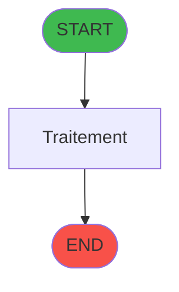
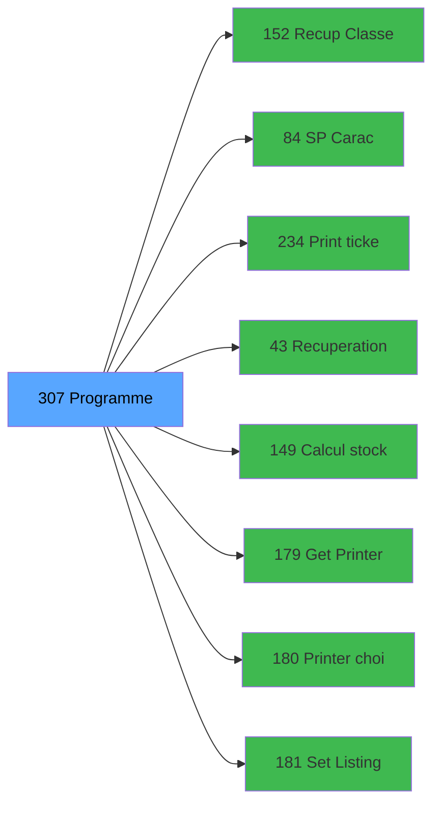

# ADH IDE 307 - Programme supprime (Prg_304)

> **Version spec**: 3.5
> **Analyse**: 2026-01-27 17:57
> **Source**: `Prg_XXX.xml`

---

<!-- TAB:Fonctionnel -->

## SPECIFICATION FONCTIONNELLE

### 1.1 Objectif metier

| Element | Description |
|---------|-------------|
| **Qui** | Operateur |
| **Quoi** | Programme supprime (Prg_304)
 |
| **Pourquoi** | A documenter |
| **Declencheur** | A identifier |

### 1.2 Regles metier

| Code | Regle | Condition |
|------|-------|-----------|
| RM-001 | A documenter | - |

### 1.3 Flux utilisateur

1. Demarrage programme
2. Traitement principal
3. Fin programme

### 1.4 Cas d'erreur

| Erreur | Comportement |
|--------|--------------|
| - | A documenter |

---

<!-- TAB:Technique -->

## SPECIFICATION TECHNIQUE

### 2.1 Identification

| Attribut | Valeur |
|----------|--------|
| **Format IDE** | ADH IDE 307 |
| **Description** | Programme supprime (Prg_304)
 |
| **Module** | ADH |

### 2.2 Tables

| # | Nom logique | Nom physique | Acces | Usage |
|---|-------------|--------------|-------|-------|
| 23 | reseau_cloture___rec | `cafil001_dat` | R | 1x |
| 23 | reseau_cloture___rec | `cafil001_dat` | **W** | 2x |
| 26 | comptes_speciaux_spc | `cafil004_dat` | L | 1x |
| 30 | gm-recherche_____gmr | `cafil008_dat` | L | 1x |
| 30 | gm-recherche_____gmr | `cafil008_dat` | R | 1x |
| 32 | prestations | `cafil010_dat` | R | 1x |
| 32 | prestations | `cafil010_dat` | **W** | 2x |
| 34 | hebergement______heb | `cafil012_dat` | L | 1x |
| 39 | depot_garantie___dga | `cafil017_dat` | R | 1x |
| 46 | mvt_prestation___mpr | `cafil024_dat` | L | 1x |
| 46 | mvt_prestation___mpr | `cafil024_dat` | **W** | 1x |
| 47 | compte_gm________cgm | `cafil025_dat` | **W** | 2x |
| 50 | moyens_reglement_mor | `cafil028_dat` | R | 3x |
| 67 | tables___________tab | `cafil045_dat` | L | 1x |
| 68 | compteurs________cpt | `cafil046_dat` | **W** | 1x |
| 70 | date_comptable___dat | `cafil048_dat` | R | 1x |
| 77 | articles_________art | `cafil055_dat` | L | 2x |
| 77 | articles_________art | `cafil055_dat` | R | 3x |
| 79 | gratuites________gra | `cafil057_dat` | R | 1x |
| 89 | moyen_paiement___mop | `cafil067_dat` | L | 5x |
| 89 | moyen_paiement___mop | `cafil067_dat` | R | 4x |
| 96 | table_prestation_pre | `cafil074_dat` | L | 1x |
| 109 | table_utilisateurs | `cafil087_dat` | R | 1x |
| 139 | moyens_reglement_mor | `cafil117_dat` | R | 1x |
| 140 | moyen_paiement___mop | `cafil118_dat` | L | 1x |
| 197 | articles_en_stock | `caisse_artstock` | L | 1x |
| 596 | tempo_ecran_police | `%club_user%tmp_ecrpolice_dat` | L | 5x |
| 596 | tempo_ecran_police | `%club_user%tmp_ecrpolice_dat` | R | 1x |
| 596 | tempo_ecran_police | `%club_user%tmp_ecrpolice_dat` | **W** | 2x |
| 697 | droits_applications | `droits` | L | 1x |
| 728 | arc_cc_total | `arc_cctotal` | L | 1x |
| 737 | pv_package_detail | `pv_packdetail_dat` | L | 1x |
| 801 | moyens_reglement_complem | `moyens_reglement_complem` | L | 1x |
| 847 | stat_lieu_vente_date | `%club_user%_stat_lieu_vente_date` | L | 10x |
| 847 | stat_lieu_vente_date | `%club_user%_stat_lieu_vente_date` | **W** | 2x |
### 2.3 Parametres d'entree

| Variable | Nom | Type | Picture |
|----------|-----|------|---------|
| - | Aucun parametre | - | - |
### 2.4 Algorigramme

### 2.5 Expressions cles

| IDE | Expression | Commentaire |
|-----|------------|-------------|
| 1 | `MlsTrans ('Verifier que la transaction est bien...` | - |
| 2 | `Date ()` | - |
| 3 | `IF({0,120}=0,IF({0,23}='VSL',{0,13},Date()),{0,...` | - |
| 4 | `{32768,2}` | - |
| 5 | `Trim ({0,99})` | - |
| 6 | `154` | - |
| 7 | `{0,1}` | - |
| 8 | `{0,5}` | - |
| 9 | `{0,6}` | - |
| 10 | `'F'` | - |
| 11 | `Date ()` | - |
| 12 | `{0,45}*{0,44}` | - |
| 13 | `({0,45}*{0,44})-{0,55}` | - |
| 14 | `'FALSE'LOG` | - |
| 15 | `'N'` | - |
| 16 | `1` | - |
| 17 | `'CAISSE'` | - |
| 18 | `{0,21}` | - |
| 19 | `{0,45}>0 AND {0,44}=0` | - |
| 20 | `{0,72} AND {0,38}='N'` | - |

> **Total**: 197 expressions (affichees: 20)
### 2.6 Variables importantes

### 2.7 Statistiques

| Metrique | Valeur |
|----------|--------|
| **Taches** | 34 |
| **Lignes logique** | 1224 |
| **Lignes desactivees** | 0 |
---

<!-- TAB:Cartographie -->

## CARTOGRAPHIE APPLICATIVE

### 3.1 Chaine d'appels depuis Main

### 3.2 Callers directs

| IDE | Programme | Nb appels |
|-----|-----------|-----------|
| - | **Aucun caller** (point d'entree ou orphelin) | - |
### 3.3 Callees

| Niv | IDE | Programme | Nb appels |
|-----|-----|-----------|-----------|
| 1 | 152 | Recup Classe et Lib du MOP | 4 |
| 1 | 84 |     SP Caractères Interdits | 2 |
| 1 | 234 |  Print ticket vente | 2 |
| 1 | 43 | Recuperation du titre | 1 |
| 1 | 149 | Calcul stock produit WS | 1 |
| 1 | 179 | Get Printer | 1 |
| 1 | 180 | Printer choice | 1 |
| 1 | 181 | Set Listing Number | 1 |
| 1 | 182 | Raz Current Printer | 1 |
| 1 | 247 | Deversement Transaction | 1 |
| 1 | 257 | Zoom articles | 1 |
| 1 | 269 | Zoom services village | 1 |
| 1 | 272 | Zoom modes de paiement | 1 |
| 1 | 275 | Zoom mode de paiement TPE | 1 |
### 3.4 Verification orphelin

| Critere | Resultat |
|---------|----------|
| Callers actifs | A verifier |
| **Conclusion** | A analyser |

---

## HISTORIQUE

| Date | Action | Auteur |
|------|--------|--------|
| 2026-01-27 20:26 | **DATA V2** - Tables reelles, Expressions, Stats, CallChain | Script |
| 2026-01-27 19:52 | **DATA POPULATED** - Tables, Callgraph (197 expr) | Script |
| 2026-01-27 17:57 | **Upgrade V3.5** - TAB markers, Mermaid | Claude |

---

*Specification V3.5 - Format avec TAB markers et Mermaid*
