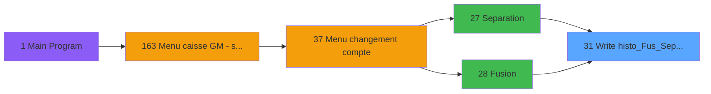

# ADH IDE 31 - Write histo_Fus_Sep_Det

> **Analyse**: Phases 1-4 2026-02-07 03:41 -> 01:27 (21h45min) | Assemblage 01:27
> **Pipeline**: V7.2 Enrichi
> **Structure**: 4 onglets (Resume | Ecrans | Donnees | Connexions)

<!-- TAB:Resume -->

## 1. FICHE D'IDENTITE

| Attribut | Valeur |
|----------|--------|
| Projet | ADH |
| IDE Position | 31 |
| Nom Programme | Write histo_Fus_Sep_Det |
| Fichier source | `Prg_31.xml` |
| Dossier IDE | General |
| Taches | 1 (0 ecrans visibles) |
| Tables modifiees | 1 |
| Programmes appeles | 0 |
| Complexite | **BASSE** (score 7/100) |

## 2. DESCRIPTION FONCTIONNELLE

# ADH IDE 31 - Write histo_Fus_Sep_Det

Programme utilitaire chargé de consigner les détails des opérations de séparation et fusion de comptes dans la table historique `histo_fusionseparation_detail`. Appelé systématiquement après chaque exécution des programmes de Séparation (ADH IDE 27) et Fusion (ADH IDE 28), il enregistre les mouvements de soldes, les allocations de services et les transferts de droits d'accès associés à ces opérations complexes.

La logique d'écriture parcourt les comptes source et destination pour capturer chaque transaction de crédit/débit générée lors de la fusion ou séparation. Les enregistrements incluent l'identifiant du compte parent, le numéro de la transaction d'historique, le type d'opération (fusion/séparation), les montants par devise et service, ainsi que les dates et signatures des opérateurs responsables. Cette traçabilité est critique pour l'audit financier et la réconciliation des comptes.

Le programme gère également les cas limites : comptes partiels, allocations partagées non intégralement transférables, et situations où certains services ne peuvent pas être fusionnés (blocages de caisse, dettes en cours). Les données écrites dans `histo_fusionseparation_detail` alimentent directement les états de rapprochement et les tableaux de bord de gestion comptable du module ADH/Caisse.

## 3. BLOCS FONCTIONNELS

### 3.1 Traitement (1 tache)

Traitements internes.

---

#### 31 - Ecriture histo_Fus_Sep_Det

**Role** : Traitement : Ecriture histo_Fus_Sep_Det.

## 5. REGLES METIER

*(Aucune regle metier identifiee dans les expressions)*

## 6. CONTEXTE

- **Appele par**: [Separation (IDE 27)](ADH-IDE-27.md), [Fusion (IDE 28)](ADH-IDE-28.md)
- **Appelle**: 0 programmes | **Tables**: 1 (W:1 R:0 L:0) | **Taches**: 1 | **Expressions**: 7

<!-- TAB:Ecrans -->

## 8. ECRANS

*(Programme sans ecran visible)*

## 9. NAVIGATION

### 9.3 Structure hierarchique (1 tache)

| Position | Tache | Type | Dimensions | Bloc |
|----------|-------|------|------------|------|
| **31.1** | [**Ecriture histo_Fus_Sep_Det** (31)](#t1) | MDI | - | Traitement |

### 9.4 Algorigramme

> **Legende**: Vert = START/END OK | Rouge = END KO | Bleu = Decisions
> *Algorigramme auto-genere. Utiliser `/algorigramme` pour une synthese metier detaillee.*

<!-- TAB:Donnees -->

## 10. TABLES

### Tables utilisees (1)

| ID | Nom | Description | Type | R | W | L | Usages |
|----|-----|-------------|------|---|---|---|--------|
| 341 | histo_fusionseparation_detail | Historique / journal | DB |   | **W** |   | 1 |

### Colonnes par table (1 / 1 tables avec colonnes identifiees)

Table 341 - histo_fusionseparation_detail (**W**) - 1 usages

| Lettre | Variable | Acces | Type |
|--------|----------|-------|------|
| A | i.chrono | W | Numeric |
| B | i.position repris | W | Alpha |
| C | i.taskNumber | W | Numeric |
| D | i.type | W | Alpha |

## 11. VARIABLES

### 11.1 Autres (4)

Variables diverses.

| Lettre | Nom | Type | Usage dans |
|--------|-----|------|-----------|
| EN | i.chrono | Numeric | 1x refs |
| EO | i.position repris | Alpha | 1x refs |
| EP | i.taskNumber | Numeric | 1x refs |
| EQ | i.type | Alpha | 1x refs |

## 12. EXPRESSIONS

**7 / 7 expressions decodees (100%)**

### 12.1 Repartition par type

| Type | Expressions | Regles |
|------|-------------|--------|
| DATE | 1 | 0 |
| OTHER | 5 | 0 |
| CAST_LOGIQUE | 1 | 0 |

### 12.2 Expressions cles par type

#### DATE (1 expressions)

| Type | IDE | Expression | Regle |
|------|-----|------------|-------|
| DATE | 5 | `Date ()` | - |

#### OTHER (5 expressions)

| Type | IDE | Expression | Regle |
|------|-----|------------|-------|
| OTHER | 6 | `Time ()` | - |
| OTHER | 7 | `i.type [D]` | - |
| OTHER | 3 | `i.taskNumber [C]` | - |
| OTHER | 1 | `i.chrono [A]` | - |
| OTHER | 2 | `i.position repris [B]` | - |

#### CAST_LOGIQUE (1 expressions)

| Type | IDE | Expression | Regle |
|------|-----|------------|-------|
| CAST_LOGIQUE | 4 | `'TRUE'LOG` | - |

<!-- TAB:Connexions -->

## 13. GRAPHE D'APPELS

### 13.1 Chaine depuis Main (Callers)

Main -> ... -> [Separation (IDE 27)](ADH-IDE-27.md) -> **Write histo_Fus_Sep_Det (IDE 31)**

Main -> ... -> [Fusion (IDE 28)](ADH-IDE-28.md) -> **Write histo_Fus_Sep_Det (IDE 31)**

### 13.2 Callers

| IDE | Nom Programme | Nb Appels |
|-----|---------------|-----------|
| [27](ADH-IDE-27.md) | Separation | 11 |
| [28](ADH-IDE-28.md) | Fusion | 10 |

### 13.3 Callees (programmes appeles)

### 13.4 Detail Callees avec contexte

| IDE | Nom Programme | Appels | Contexte |
|-----|---------------|--------|----------|
| - | (aucun) | - | - |

## 14. RECOMMANDATIONS MIGRATION

### 14.1 Profil du programme

| Metrique | Valeur | Impact migration |
|----------|--------|-----------------|
| Lignes de logique | 19 | Programme compact |
| Expressions | 7 | Peu de logique |
| Tables WRITE | 1 | Impact faible |
| Sous-programmes | 0 | Peu de dependances |
| Ecrans visibles | 0 | Ecran unique ou traitement batch |
| Code desactive | 0% (0 / 19) | Code sain |
| Regles metier | 0 | Pas de regle identifiee |

### 14.2 Plan de migration par bloc

#### Traitement (1 tache: 0 ecran, 1 traitement)

- **Strategie** : 1 service(s) backend injectable(s) (Domain Services).
- Decomposer les taches en services unitaires testables.

### 14.3 Dependances critiques

| Dependance | Type | Appels | Impact |
|------------|------|--------|--------|
| histo_fusionseparation_detail | Table WRITE (Database) | 1x | Schema + repository |

---
*Spec DETAILED generee par Pipeline V7.2 - 2026-02-08 01:27*
