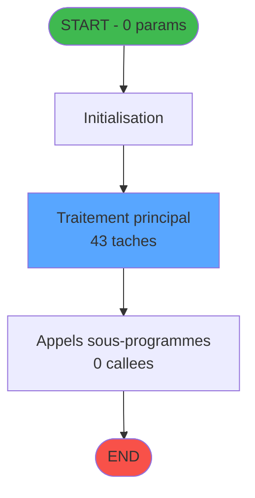
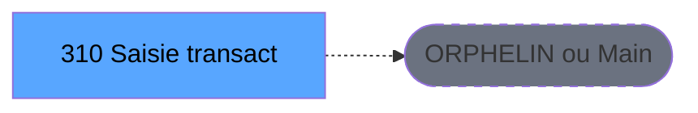
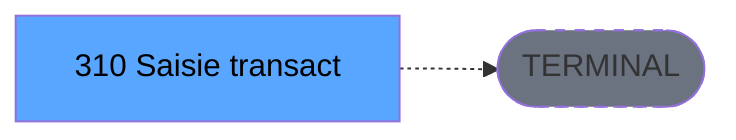

# ADH IDE 310 - Saisie transaction Nouv vente

> **Version spec**: 4.0
> **Analyse**: 2026-01-27 23:16
> **Source**: `D:\Data\Migration\XPA\PMS\ADH\Source\Prg_306.xml`
> **Methode**: APEX + PDCA (Auto-generated)

---

<!-- TAB:Fonctionnel -->

## SPECIFICATION FONCTIONNELLE

### 1.1 Objectif metier

| Element | Description |
|---------|-------------|
| **Qui** | Operateur (utilisateur connecte) |
| **Quoi** | Saisie transaction Nouv vente |
| **Pourquoi** | Fonction metier du module ADH |
| **Declencheur** | Appel depuis programme parent ou menu |
| **Resultat** | Traitement effectue selon logique programme |

### 1.2 Regles metier

| Code | Regle | Condition |
|------|-------|-----------|
| RM-001 | Execution du traitement principal | Conditions d'entree validees |
| RM-002 | Gestion des tables (39 tables) | Acces selon mode (R/W/L) |
| RM-003 | Appels sous-programmes (0 callees) | Selon logique metier |

### 1.3 Flux utilisateur

1. Reception des parametres d'entree (0 params)
2. Initialisation et verification conditions
3. Traitement principal (43 taches)
4. Appels sous-programmes si necessaire
5. Retour resultats

### 1.4 Cas d'erreur

| Erreur | Comportement |
|--------|--------------|
| Conditions non remplies | Abandon avec message |
| Erreur sous-programme | Propagation erreur |

---

<!-- TAB:Technique -->

## SPECIFICATION TECHNIQUE

### 2.1 Identification

| Attribut | Valeur |
|----------|--------|
| **IDE Position** | 310 |
| **Fichier XML** | `Prg_306.xml` |
| **Description** | Saisie transaction Nouv vente |
| **Module** | ADH |
| **Public Name** |  |
| **Nombre taches** | 43 |
| **Lignes logique** | 1507 |
| **Expressions** | 0 |

### 2.2 Tables

| # | Nom logique | Nom physique | Acces | Usage |
|---|-------------|--------------|-------|-------|
| 23 | reseau_cloture___rec | cafil001_dat | READ/WRITE | Lecture+Ecriture |
| 26 | comptes_speciaux_spc | cafil004_dat | LINK | Jointure |
| 30 | gm-recherche_____gmr | cafil008_dat | LINK/READ | Jointure+Lecture |
| 32 | prestations | cafil010_dat | READ/WRITE | Lecture+Ecriture |
| 34 | hebergement______heb | cafil012_dat | LINK | Jointure |
| 39 | depot_garantie___dga | cafil017_dat | READ | Lecture |
| 46 | mvt_prestation___mpr | cafil024_dat | LINK/WRITE | Jointure+Ecriture |
| 47 | compte_gm________cgm | cafil025_dat | WRITE | Ecriture |
| 50 | moyens_reglement_mor | cafil028_dat | READ | Lecture |
| 67 | tables___________tab | cafil045_dat | LINK | Jointure |
| 68 | compteurs________cpt | cafil046_dat | WRITE | Ecriture |
| 70 | date_comptable___dat | cafil048_dat | LINK | Jointure |
| 77 | articles_________art | cafil055_dat | LINK/READ | Jointure+Lecture |
| 79 | gratuites________gra | cafil057_dat | READ | Lecture |
| 89 | moyen_paiement___mop | cafil067_dat | LINK/READ | Jointure+Lecture |
| 96 | table_prestation_pre | cafil074_dat | LINK | Jointure |
| 103 | logement_client__loc | cafil081_dat | READ | Lecture |
| 109 | table_utilisateurs | cafil087_dat | READ | Lecture |
| 139 | moyens_reglement_mor | cafil117_dat | READ | Lecture |
| 140 | moyen_paiement___mop | cafil118_dat | LINK | Jointure |
| 197 | articles_en_stock | caisse_artstock | LINK | Jointure |
| 473 | comptage_caisse | %club_user%_caisse_compcais | WRITE | Ecriture |
| 596 | tempo_ecran_police | %club_user%tmp_ecrpolice_dat | LINK/READ/WRITE | Jointure+R/W |
| 697 | droits_applications | droits | LINK | Jointure |
| 728 | arc_cc_total | arc_cctotal | LINK | Jointure |
| 737 | pv_package_detail | pv_packdetail_dat | LINK | Jointure |
| 801 | moyens_reglement_complem | moyens_reglement_complem | LINK | Jointure |
| 847 | stat_lieu_vente_date | %club_user%_stat_lieu_vente_date | LINK/WRITE | Jointure+Ecriture |
| 899 | Boo_ResultsRechercheHoraire | Boo_ResultsRechercheHoraire | READ/WRITE | Lecture+Ecriture |

**Resume**: 39 tables accedees dont **9 en ecriture**

### 2.3 Parametres d'entree (0 parametres)

| Var | Nom | Type | Picture |
|-----|-----|------|---------|
| - | Aucun parametre | - | - |

### 2.4 Algorigramme

### 2.5 Statistiques

| Metrique | Valeur |
|----------|--------|
| **Taches** | 43 |
| **Lignes logique** | 1507 |
| **Expressions** | 0 |
| **Parametres** | 0 |
| **Tables accedees** | 39 |
| **Tables en ecriture** | 9 |
| **Callees niveau 1** | 0 |

---

<!-- TAB:Cartographie -->

## CARTOGRAPHIE APPLICATIVE

### 3.1 Chaine d'appels depuis Main

### 3.2 Callers directs

| IDE | Programme | Nb appels |
|-----|-----------|-----------|
| - | ORPHELIN ou Main direct | - |

### 3.3 Callees (3 niveaux)

| Niv | IDE | Programme | Nb appels | Status |
|-----|-----|-----------|-----------|--------|
| - | - | TERMINAL | - | - |

### 3.4 Composants ECF utilises

| ECF | IDE | Public Name | Description |
|-----|-----|-------------|-------------|
| - | - | Aucun composant ECF | - |

### 3.5 Verification orphelin

| Critere | Resultat |
|---------|----------|
| Callers actifs | 0 programmes |
| PublicName | Non defini |
| ECF partage | NON |
| **Conclusion** | **ORPHELIN** - Pas de callers actifs |

---

## NOTES MIGRATION

### Complexite

| Critere | Score | Detail |
|---------|-------|--------|
| Taches | 43 | Complexe |
| Tables | 39 | Ecriture |
| Callees | 0 | Faible couplage |
| **Score global** | **HAUTE** | - |

### Points d'attention migration

| Point | Solution moderne |
|-------|-----------------|
| Variables globales (VG*) | Service/Repository injection |
| Tables Magic | Entity Framework / Dapper |
| CallTask | Service method calls |
| Forms | React/Angular components |

---

## HISTORIQUE

| Date | Action | Auteur |
|------|--------|--------|
| 2026-01-27 23:16 | **V4.0 APEX/PDCA** - Generation automatique complete | Script |

---

*Specification V4.0 - Auto-generated with APEX/PDCA methodology*

