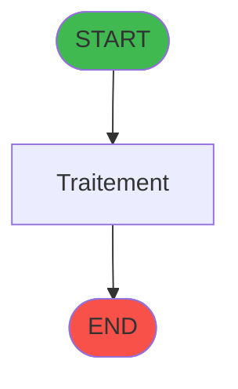
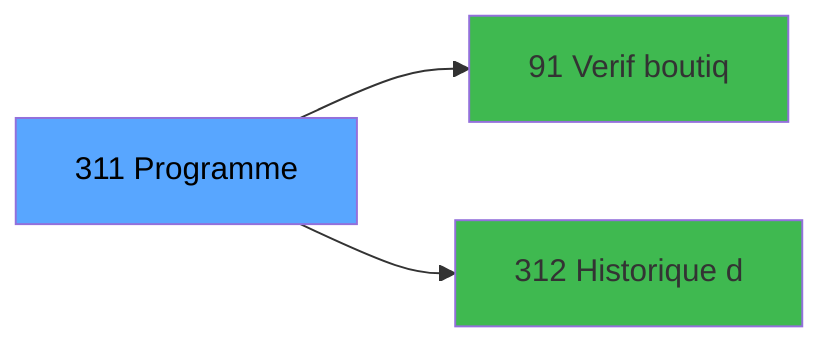

# ADH IDE 311 - Programme supprime (Prg_308)

> **Version spec**: 3.5
> **Analyse**: 2026-01-27 17:57
> **Source**: `Prg_XXX.xml`

---

<!-- TAB:Fonctionnel -->

## SPECIFICATION FONCTIONNELLE

### 1.1 Objectif metier

| Element | Description |
|---------|-------------|
| **Qui** | Operateur |
| **Quoi** | Programme supprime (Prg_308)
 |
| **Pourquoi** | A documenter |
| **Declencheur** | A identifier |

### 1.2 Regles metier

| Code | Regle | Condition |
|------|-------|-----------|
| RM-001 | A documenter | - |

### 1.3 Flux utilisateur

1. Demarrage programme
2. Traitement principal
3. Fin programme

### 1.4 Cas d'erreur

| Erreur | Comportement |
|--------|--------------|
| - | A documenter |

---

<!-- TAB:Technique -->

## SPECIFICATION TECHNIQUE

### 2.1 Identification

| Attribut | Valeur |
|----------|--------|
| **Format IDE** | ADH IDE 311 |
| **Description** | Programme supprime (Prg_308)
 |
| **Module** | ADH |

### 2.2 Tables

| # | Nom logique | Nom physique | Acces | Usage |
|---|-------------|--------------|-------|-------|
| 30 | gm-recherche_____gmr | `cafil008_dat` | L | 2x |
| 31 | gm-complet_______gmc | `cafil009_dat` | L | 1x |
| 40 | comptable________cte | `cafil018_dat` | L | 1x |
| 40 | comptable________cte | `cafil018_dat` | **W** | 1x |
| 68 | compteurs________cpt | `cafil046_dat` | **W** | 1x |
| 263 | vente | `caisse_vente` | L | 2x |
| 372 | pv_budget | `pv_budget_dat` | L | 1x |
| 382 | pv_discount_reasons | `pv_discountlist_dat` | L | 2x |
| 400 | pv_cust_rentals | `pv_rentals_dat` | L | 2x |
| 744 | pv_lieux_vente | `pv_lieux_vente` | L | 2x |
| 746 | projet | `version` | L | 1x |
| 746 | projet | `version` | **W** | 1x |
| 755 | cafil_address_tmp | `cafil_address_tmp` | L | 2x |
| 756 | Country_ISO | `cafil_country_iso` | L | 2x |
| 866 | maj_appli_tpe | `maj_appli_tpe` | L | 3x |
| 866 | maj_appli_tpe | `maj_appli_tpe` | R | 6x |
| 866 | maj_appli_tpe | `maj_appli_tpe` | **W** | 7x |
| 867 | log_maj_tpe | `log_maj_tpe` | L | 1x |
| 867 | log_maj_tpe | `log_maj_tpe` | R | 2x |
| 868 | Affectation_Gift_Pass | `affectation_gift_pass` | L | 1x |
| 868 | Affectation_Gift_Pass | `affectation_gift_pass` | R | 3x |
| 868 | Affectation_Gift_Pass | `affectation_gift_pass` | **W** | 6x |
| 870 | Rayons_Boutique | `rayons_boutique` | L | 7x |
| 870 | Rayons_Boutique | `rayons_boutique` | R | 1x |
| 870 | Rayons_Boutique | `rayons_boutique` | **W** | 4x |
| 871 | Activite | `activite` | L | 2x |
| 932 | taxe_add_param | `taxe_add_param` | L | 1x |
| 932 | taxe_add_param | `taxe_add_param` | **W** | 1x |
### 2.3 Parametres d'entree

| Variable | Nom | Type | Picture |
|----------|-----|------|---------|
| - | Aucun parametre | - | - |
### 2.4 Algorigramme



### 2.5 Expressions cles

| IDE | Expression | Commentaire |
|-----|------------|-------------|
| 1 | `'Hébergement'` | - |
| 2 | `{0,1}` | - |
| 3 | `{0,2}` | - |
| 4 | `{0,3}` | - |
| 5 | `{0,7}` | - |
| 6 | `{0,8}` | - |
| 7 | `IF({0,50},Trim({0,53}),IF({0,5},Trim({0,20})&' ...` | - |
| 8 | `IF({0,50},Trim({0,52}),IF({0,5},Trim({0,19})&' ...` | - |
| 9 | `IF({0,50},Trim({0,54}),IF({0,5},Trim({0,22}),Tr...` | - |
| 10 | `IF({0,50},Trim({0,55}),IF({0,5},Trim({0,23}),Tr...` | - |
| 11 | `'Numéro d''adhérent'&' '&IF({0,5},Trim(Str({0,1...` | - |
| 12 | `'Quitter'` | - |
| 13 | `'Imprimer'` | - |
| 14 | `'R.à.z'` | - |
| 15 | `MlsTrans('Confirmez vous l''édition de cette fa...` | - |
| 16 | `{0,64}=6` | - |
| 17 | `MID({0,42},1,3)&Trim(Str(Year(Date()),'4'))&Tri...` | - |
| 18 | `MID({0,42},1,3)&Trim(Str(Year(Date()),'4'))&Tri...` | - |
| 19 | `NOT({0,69})` | - |
| 20 | `{0,69}` | - |

> **Total**: 42 expressions (affichees: 20)
### 2.6 Variables importantes


### 2.7 Statistiques

| Metrique | Valeur |
|----------|--------|
| **Taches** | 34 |
| **Lignes logique** | 1365 |
| **Lignes desactivees** | 0 |
---

<!-- TAB:Cartographie -->

## CARTOGRAPHIE APPLICATIVE

### 3.1 Chaine d'appels depuis Main

```mermaid
graph LR
    M[1 Main]
    T[311 Factures (Tble Compta&Vent]
    M --> T
    style M fill:#8b5cf6,color:#fff
    style T fill:#58a6ff,color:#000
```
### 3.2 Callers directs

| IDE | Programme | Nb appels |
|-----|-----------|-----------|
| - | **Aucun caller** (point d'entree ou orphelin) | - |
### 3.3 Callees



| Niv | IDE | Programme | Nb appels |
|-----|-----|-----------|-----------|
| 1 | 91 | Verif boutique | 2 |
| 1 | 312 | Historique des ventes - Gratui | 2 |
### 3.4 Verification orphelin

| Critere | Resultat |
|---------|----------|
| Callers actifs | A verifier |
| **Conclusion** | A analyser |

---

## HISTORIQUE

| Date | Action | Auteur |
|------|--------|--------|
| 2026-01-27 20:26 | **DATA V2** - Tables reelles, Expressions, Stats, CallChain | Script |
| 2026-01-27 19:52 | **DATA POPULATED** - Tables, Callgraph (42 expr) | Script |
| 2026-01-27 17:57 | **Upgrade V3.5** - TAB markers, Mermaid | Claude |

---

*Specification V3.5 - Format avec TAB markers et Mermaid*
