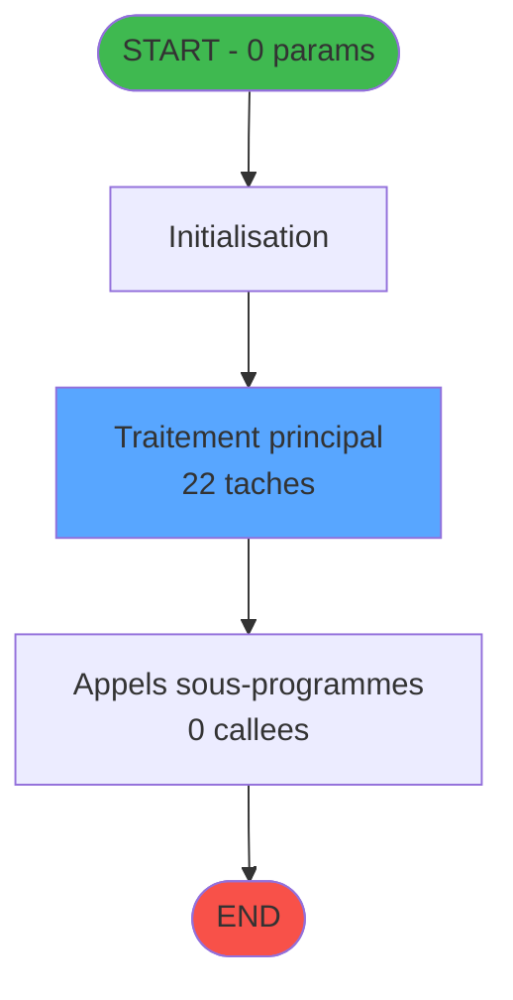
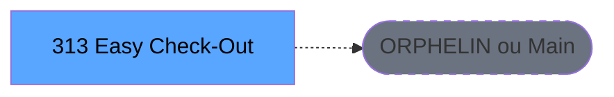
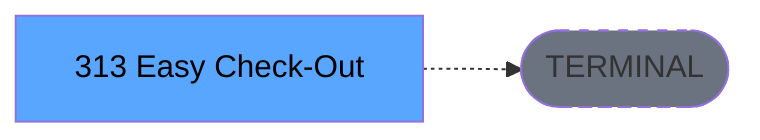

# ADH IDE 313 - Easy Check-Out === V2.00

> **Version spec**: 4.0
> **Analyse**: 2026-01-27 23:16
> **Source**: `D:\Data\Migration\XPA\PMS\ADH\Source\Prg_309.xml`
> **Methode**: APEX + PDCA (Auto-generated)

---

<!-- TAB:Fonctionnel -->

## SPECIFICATION FONCTIONNELLE

### 1.1 Objectif metier

| Element | Description |
|---------|-------------|
| **Qui** | Operateur (utilisateur connecte) |
| **Quoi** | Easy Check-Out === V2.00 |
| **Pourquoi** | Fonction metier du module ADH |
| **Declencheur** | Appel depuis programme parent ou menu |
| **Resultat** | Traitement effectue selon logique programme |

### 1.2 Regles metier

| Code | Regle | Condition |
|------|-------|-----------|
| RM-001 | Execution du traitement principal | Conditions d'entree validees |
| RM-002 | Gestion des tables (28 tables) | Acces selon mode (R/W/L) |
| RM-003 | Appels sous-programmes (0 callees) | Selon logique metier |

### 1.3 Flux utilisateur

1. Reception des parametres d'entree (0 params)
2. Initialisation et verification conditions
3. Traitement principal (22 taches)
4. Appels sous-programmes si necessaire
5. Retour resultats

### 1.4 Cas d'erreur

| Erreur | Comportement |
|--------|--------------|
| Conditions non remplies | Abandon avec message |
| Erreur sous-programme | Propagation erreur |

---

<!-- TAB:Technique -->

## SPECIFICATION TECHNIQUE

### 2.1 Identification

| Attribut | Valeur |
|----------|--------|
| **IDE Position** | 313 |
| **Fichier XML** | `Prg_309.xml` |
| **Description** | Easy Check-Out === V2.00 |
| **Module** | ADH |
| **Public Name** |  |
| **Nombre taches** | 22 |
| **Lignes logique** | 467 |
| **Expressions** | 0 |

### 2.2 Tables

| # | Nom logique | Nom physique | Acces | Usage |
|---|-------------|--------------|-------|-------|
| 30 | gm-recherche_____gmr | cafil008_dat | LINK/READ | Jointure+Lecture |
| 31 | gm-complet_______gmc | cafil009_dat | LINK | Jointure |
| 39 | depot_garantie___dga | cafil017_dat | LINK | Jointure |
| 40 | comptable________cte | cafil018_dat | WRITE | Ecriture |
| 47 | compte_gm________cgm | cafil025_dat | LINK/WRITE | Jointure+Ecriture |
| 48 | lignes_de_solde__sld | cafil026_dat | WRITE | Ecriture |
| 50 | moyens_reglement_mor | cafil028_dat | LINK | Jointure |
| 53 | ligne_telephone__lgn | cafil031_dat | WRITE | Ecriture |
| 66 | imputations______imp | cafil044_dat | LINK | Jointure |
| 68 | compteurs________cpt | cafil046_dat | WRITE | Ecriture |
| 69 | initialisation___ini | cafil047_dat | LINK | Jointure |
| 70 | date_comptable___dat | cafil048_dat | LINK | Jointure |
| 75 | commande_autocom_cot | cafil053_dat | WRITE | Ecriture |
| 78 | param__telephone_tel | cafil056_dat | LINK/READ | Jointure+Lecture |
| 80 | codes_autocom____aut | cafil058_dat | LINK/WRITE | Jointure+Ecriture |
| 87 | sda_telephone____sda | cafil065_dat | LINK/WRITE | Jointure+Ecriture |
| 89 | moyen_paiement___mop | cafil067_dat | LINK | Jointure |
| 136 | fichier_echanges | cafil114_dat | WRITE | Ecriture |
| 151 | nb_code__poste | cafil129_dat | WRITE | Ecriture |
| 285 | email | email | LINK | Jointure |
| 312 | ez_card | ezcard | WRITE | Ecriture |
| 911 | log_booker | log_booker | WRITE | Ecriture |
| 934 | selection enregistrement diver | selection_enregistrement_div | WRITE | Ecriture |

**Resume**: 28 tables accedees dont **13 en ecriture**

### 2.3 Parametres d'entree (0 parametres)

| Var | Nom | Type | Picture |
|-----|-----|------|---------|
| - | Aucun parametre | - | - |

### 2.4 Algorigramme

### 2.5 Statistiques

| Metrique | Valeur |
|----------|--------|
| **Taches** | 22 |
| **Lignes logique** | 467 |
| **Expressions** | 0 |
| **Parametres** | 0 |
| **Tables accedees** | 28 |
| **Tables en ecriture** | 13 |
| **Callees niveau 1** | 0 |

---

<!-- TAB:Cartographie -->

## CARTOGRAPHIE APPLICATIVE

### 3.1 Chaine d'appels depuis Main

### 3.2 Callers directs

| IDE | Programme | Nb appels |
|-----|-----------|-----------|
| - | ORPHELIN ou Main direct | - |

### 3.3 Callees (3 niveaux)

| Niv | IDE | Programme | Nb appels | Status |
|-----|-----|-----------|-----------|--------|
| - | - | TERMINAL | - | - |

### 3.4 Composants ECF utilises

| ECF | IDE | Public Name | Description |
|-----|-----|-------------|-------------|
| - | - | Aucun composant ECF | - |

### 3.5 Verification orphelin

| Critere | Resultat |
|---------|----------|
| Callers actifs | 0 programmes |
| PublicName | Non defini |
| ECF partage | NON |
| **Conclusion** | **ORPHELIN** - Pas de callers actifs |

---

## NOTES MIGRATION

### Complexite

| Critere | Score | Detail |
|---------|-------|--------|
| Taches | 22 | Complexe |
| Tables | 28 | Ecriture |
| Callees | 0 | Faible couplage |
| **Score global** | **MOYENNE** | - |

### Points d'attention migration

| Point | Solution moderne |
|-------|-----------------|
| Variables globales (VG*) | Service/Repository injection |
| Tables Magic | Entity Framework / Dapper |
| CallTask | Service method calls |
| Forms | React/Angular components |

---

## HISTORIQUE

| Date | Action | Auteur |
|------|--------|--------|
| 2026-01-27 23:16 | **V4.0 APEX/PDCA** - Generation automatique complete | Script |

---

*Specification V4.0 - Auto-generated with APEX/PDCA methodology*

