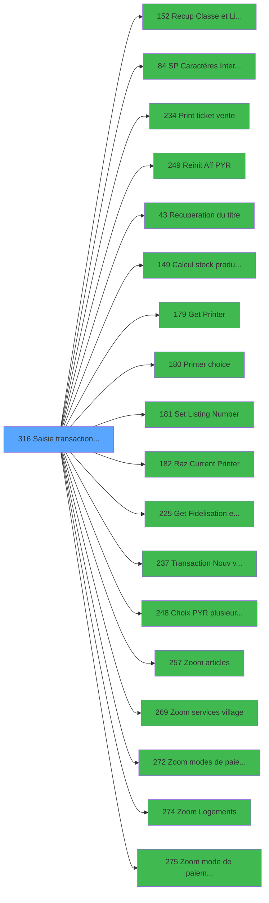

# ADH IDE 316 - Saisie transaction Nouv vente

> **Analyse**: Phases 1-4 2026-01-30 09:43 -> 09:43 (8s) | Assemblage 09:43
> **Pipeline**: V7.2 Enrichi
> **Structure**: 4 onglets (Resume | Ecrans | Donnees | Connexions)

<!-- TAB:Resume -->

## 1. FICHE D'IDENTITE

| Attribut | Valeur |
|----------|--------|
| Projet | ADH |
| IDE Position | 316 |
| Nom Programme | Saisie transaction Nouv vente |
| Fichier source | `Prg_316.xml` |
| Domaine metier | Ventes |
| Taches | 43 (14 ecrans visibles) |
| Tables modifiees | 9 |
| Programmes appeles | 18 |
| :warning: Statut | **ORPHELIN_POTENTIEL** |

## 2. DESCRIPTION FONCTIONNELLE

**Saisie transaction Nouv vente** assure la gestion complete de ce processus.

Le flux de traitement s'organise en **10 blocs fonctionnels** :

- **Traitement** (14 taches) : traitements metier divers
- **Saisie** (7 taches) : ecrans de saisie utilisateur (formulaires, champs, donnees)
- **Creation** (5 taches) : insertion d'enregistrements en base (mouvements, prestations)
- **Calcul** (4 taches) : calculs de montants, stocks ou compteurs
- **Reglement** (4 taches) : gestion des moyens de paiement et reglements
- **Transfert** (4 taches) : transferts de donnees entre modules ou deversements
- **Initialisation** (2 taches) : reinitialisation d'etats et de variables de travail
- **Validation** (1 tache) : controles et verifications de coherence
- **Impression** (1 tache) : generation de tickets et documents
- **Consultation** (1 tache) : ecrans de recherche, selection et consultation

**Donnees modifiees** : 9 tables en ecriture (reseau_cloture___rec, prestations, mvt_prestation___mpr, compte_gm________cgm, compteurs________cpt, comptage_caisse, tempo_ecran_police, stat_lieu_vente_date, Boo_ResultsRechercheHoraire).

**Logique metier** : 15 regles identifiees couvrant conditions metier, calculs avec pourcentages, positionnement dynamique d'UI, valeurs par defaut.

Detail : phases du traitement

#### Phase 1 : Saisie (7 taches)

- **T1** - Saisie transaction **[ECRAN]**
- **T7** - Saisie Bilaterale **[ECRAN]**
- **T8** - Saisie mode de règlement **[ECRAN]**
- **T10** - Saisie Commentaires **[ECRAN]**
- **T11** - VRL : Saisie identité **[ECRAN]**
- **T18** - Saisie dates forfait **[ECRAN]**
- **T28** - Affiche saisie **[ECRAN]**

Delegue a : [ Print ticket vente (IDE 234)](ADH-IDE-234.md), [Transaction Nouv vente avec GP (IDE 237)](ADH-IDE-237.md)

#### Phase 2 : Reglement (4 taches)

- **T2** - Reglements suite a refus TPE **[ECRAN]**
- **T5** - Verif reglement tpe
- **T26** - Creation reglement
- **T32** - Changement MOP multi paiement

Delegue a : [Recup Classe et Lib du MOP (IDE 152)](ADH-IDE-152.md), [Zoom modes de paiement (IDE 272)](ADH-IDE-272.md), [Zoom mode de paiement TPE (IDE 275)](ADH-IDE-275.md)

#### Phase 3 : Validation (1 tache)

- **T3** - verif reg restant

Delegue a : [    SP Caractères Interdits (IDE 84)](ADH-IDE-84.md)

#### Phase 4 : Creation (5 taches)

- **T4** - creation règlement
- **T21** - Creation prestation
- **T25** - Creation Tempo
- **T27** - Creation
- **T39** - Creation Enregistrement Transf **[ECRAN]**

#### Phase 5 : Traitement (14 taches)

- **T6** - Dé-Affecition
- **T12** - Test si cloture en cours
- **T13** - Blocage cloture
- **T15** - Test reseau
- **T16** - Forfait
- **T17** - (sans nom) **[ECRAN]**
- **T19** - Effacement forfait
- **T20** - Effacement mvt forfait
- **T22** - Deblocage cloture
- **T23** - Gratuite ?
- **T29** - garantie?
- **T38** - Affectation **[ECRAN]**
- **T41** - Supprime enregs non affectés
- **T43** - Affectation Auto

Delegue a : [    SP Caractères Interdits (IDE 84)](ADH-IDE-84.md), [Recuperation du titre (IDE 43)](ADH-IDE-43.md), [Set Listing Number (IDE 181)](ADH-IDE-181.md), [Get Fidelisation et Remise (IDE 225)](ADH-IDE-225.md)

#### Phase 6 : Initialisation (2 taches)

- **T9** - RAZ 269
- **T30** - RAZ 269

Delegue a : [Reinit Aff PYR (IDE 249)](ADH-IDE-249.md)

#### Phase 7 : Calcul (4 taches)

- **T14** - Reaffichage infos compte
- **T33** - calcul nombre carte
- **T35** - Compte Enregs affectés
- **T42** - Compte Enregs affectés

Delegue a : [Calcul stock produit WS (IDE 149)](ADH-IDE-149.md)

#### Phase 8 : Consultation (1 tache)

- **T24** - Recherche imputation/ssimput

Delegue a : [Recup Classe et Lib du MOP (IDE 152)](ADH-IDE-152.md), [Recuperation du titre (IDE 43)](ADH-IDE-43.md), [Get Fidelisation et Remise (IDE 225)](ADH-IDE-225.md), [Choix PYR (plusieurs chambres) (IDE 248)](ADH-IDE-248.md), [Zoom articles (IDE 257)](ADH-IDE-257.md), [Zoom services village (IDE 269)](ADH-IDE-269.md), [Zoom modes de paiement (IDE 272)](ADH-IDE-272.md), [Zoom Logements (IDE 274)](ADH-IDE-274.md), [Zoom mode de paiement TPE (IDE 275)](ADH-IDE-275.md)

#### Phase 9 : Impression (1 tache)

- **T31** - Increment Num. Ticket(VRL/VSL)

Delegue a : [ Print ticket vente (IDE 234)](ADH-IDE-234.md), [Get Printer (IDE 179)](ADH-IDE-179.md), [Printer choice (IDE 180)](ADH-IDE-180.md), [Set Listing Number (IDE 181)](ADH-IDE-181.md), [Raz Current Printer (IDE 182)](ADH-IDE-182.md)

#### Phase 10 : Transfert (4 taches)

- **T34** - Raz Affectation Transfert
- **T36** - Type transfert **[ECRAN]**
- **T37** - Affiche Transfert A/R **[ECRAN]**
- **T40** - Affectation PAX / Transfert **[ECRAN]**

#### Tables impactees

| Table | Operations | Role metier |
|-------|-----------|-------------|
| stat_lieu_vente_date | **W**/L (12 usages) | Statistiques point de vente |
| Boo_ResultsRechercheHoraire | R/**W** (8 usages) | Index de recherche |
| tempo_ecran_police | R/**W**/L (7 usages) | Table temporaire ecran |
| reseau_cloture___rec | R/**W** (3 usages) | Donnees reseau/cloture |
| prestations | R/**W** (3 usages) | Prestations/services vendus |
| compte_gm________cgm | **W** (2 usages) | Comptes GM (generaux) |
| mvt_prestation___mpr | **W**/L (2 usages) | Prestations/services vendus |
| comptage_caisse | **W** (1 usages) | Sessions de caisse |
| compteurs________cpt | **W** (1 usages) | Comptes GM (generaux) |

## 3. BLOCS FONCTIONNELS

### 3.1 Saisie (7 taches)

L'operateur saisit les donnees de la transaction via 7 ecrans (Saisie transaction, Saisie Bilaterale, Saisie mode de règlement, Saisie Commentaires, VRL : Saisie identité, Saisie dates forfait, Affiche saisie).

---

#### T1 - Saisie transaction [ECRAN]

**Role** : Ecran de saisie pour la transaction.
**Ecran** : 1046 x 279 DLU (Modal) | [Voir mockup](#ecran-t1)

---

#### T7 - Saisie Bilaterale [ECRAN]

**Role** : Ecran de saisie pour la transaction.
**Ecran** : 326 x 249 DLU (Type6) | [Voir mockup](#ecran-t7)

---

#### T8 - Saisie mode de règlement [ECRAN]

**Role** : Ecran de saisie pour la transaction.
**Ecran** : 326 x 250 DLU (Type6) | [Voir mockup](#ecran-t8)

---

#### T10 - Saisie Commentaires [ECRAN]

**Role** : Ecran de saisie pour la transaction.
**Ecran** : 772 x 169 DLU (Type6) | [Voir mockup](#ecran-t10)

---

#### T11 - VRL : Saisie identité [ECRAN]

**Role** : Ecran de saisie pour la transaction.
**Ecran** : 699 x 157 DLU (MDI) | [Voir mockup](#ecran-t11)

---

#### T18 - Saisie dates forfait [ECRAN]

**Role** : Ecran de saisie pour la transaction.
**Ecran** : 528 x 121 DLU (MDI) | [Voir mockup](#ecran-t18)

---

#### T28 - Affiche saisie [ECRAN]

**Role** : Ecran de saisie pour la transaction.
**Ecran** : 386 x 116 DLU (Modal) | [Voir mockup](#ecran-t28)

### 3.2 Reglement (4 taches)

Gestion des moyens de paiement : 4 taches de reglement.

---

#### T2 - Reglements suite a refus TPE [ECRAN]

**Role** : Gestion du reglement et moyens de paiement.
**Ecran** : 708 x 256 DLU (Type6) | [Voir mockup](#ecran-t2)
**Delegue a** : [Recup Classe et Lib du MOP (IDE 152)](ADH-IDE-152.md), [Zoom modes de paiement (IDE 272)](ADH-IDE-272.md), [Zoom mode de paiement TPE (IDE 275)](ADH-IDE-275.md)

---

#### T5 - Verif reglement tpe

**Role** : Gestion du reglement et moyens de paiement.
**Delegue a** : [Recup Classe et Lib du MOP (IDE 152)](ADH-IDE-152.md), [Zoom modes de paiement (IDE 272)](ADH-IDE-272.md), [Zoom mode de paiement TPE (IDE 275)](ADH-IDE-275.md)

---

#### T26 - Creation reglement

**Role** : Gestion du reglement et moyens de paiement.
**Delegue a** : [Recup Classe et Lib du MOP (IDE 152)](ADH-IDE-152.md), [Zoom modes de paiement (IDE 272)](ADH-IDE-272.md), [Zoom mode de paiement TPE (IDE 275)](ADH-IDE-275.md)

---

#### T32 - Changement MOP multi paiement

**Role** : Gestion du reglement et moyens de paiement.
**Delegue a** : [Recup Classe et Lib du MOP (IDE 152)](ADH-IDE-152.md), [Zoom modes de paiement (IDE 272)](ADH-IDE-272.md), [Zoom mode de paiement TPE (IDE 275)](ADH-IDE-275.md)

### 3.3 Validation (1 tache)

Controles de coherence : 1 tache verifie les donnees et conditions.

---

#### T3 - verif reg restant

**Role** : Controle de coherence avant traitement.

### 3.4 Creation (5 taches)

Insertion de nouveaux enregistrements en base.

---

#### T4 - creation règlement

**Role** : Insertion de donnees en base.

---

#### T21 - Creation prestation

**Role** : Insertion de donnees en base.

---

#### T25 - Creation Tempo

**Role** : Insertion de donnees en base.

---

#### T27 - Creation

**Role** : Insertion de donnees en base.

---

#### T39 - Creation Enregistrement Transf [ECRAN]

**Role** : Insertion de donnees en base.
**Ecran** : 672 x 58 DLU | [Voir mockup](#ecran-t39)

### 3.5 Traitement (14 taches)

Traitements internes.

---

#### T6 - Dé-Affecition

**Role** : Traitement interne.

---

#### T12 - Test si cloture en cours

**Role** : Traitement interne.

---

#### T13 - Blocage cloture

**Role** : Traitement interne.

---

#### T15 - Test reseau

**Role** : Traitement interne.

---

#### T16 - Forfait

**Role** : Traitement interne.

---

#### T17 - (sans nom) [ECRAN]

**Role** : Traitement interne.
**Ecran** : 116 x 32 DLU (Modal) | [Voir mockup](#ecran-t17)

---

#### T19 - Effacement forfait

**Role** : Traitement interne.

---

#### T20 - Effacement mvt forfait

**Role** : Traitement interne.

---

#### T22 - Deblocage cloture

**Role** : Traitement interne.

---

#### T23 - Gratuite ?

**Role** : Traitement interne.

---

#### T29 - garantie?

**Role** : Traitement interne.

---

#### T38 - Affectation [ECRAN]

**Role** : Traitement interne.
**Ecran** : 584 x 253 DLU | [Voir mockup](#ecran-t38)

---

#### T41 - Supprime enregs non affectés

**Role** : Traitement interne.

---

#### T43 - Affectation Auto

**Role** : Traitement interne.

### 3.6 Initialisation (2 taches)

Reinitialisation d'etats et variables de travail.

---

#### T9 - RAZ 269

**Role** : Reinitialisation des variables de travail.
**Delegue a** : [Reinit Aff PYR (IDE 249)](ADH-IDE-249.md)

---

#### T30 - RAZ 269

**Role** : Reinitialisation des variables de travail.
**Delegue a** : [Reinit Aff PYR (IDE 249)](ADH-IDE-249.md)

### 3.7 Calcul (4 taches)

Calculs metier : montants, stocks, compteurs.

---

#### T14 - Reaffichage infos compte

**Role** : Calcul de montants ou compteurs.
**Delegue a** : [Calcul stock produit WS (IDE 149)](ADH-IDE-149.md)

---

#### T33 - calcul nombre carte

**Role** : Calcul de montants ou compteurs.
**Delegue a** : [Calcul stock produit WS (IDE 149)](ADH-IDE-149.md)

---

#### T35 - Compte Enregs affectés

**Role** : Calcul de montants ou compteurs.
**Delegue a** : [Calcul stock produit WS (IDE 149)](ADH-IDE-149.md)

---

#### T42 - Compte Enregs affectés

**Role** : Calcul de montants ou compteurs.
**Delegue a** : [Calcul stock produit WS (IDE 149)](ADH-IDE-149.md)

### 3.8 Consultation (1 tache)

Ecrans de recherche et consultation.

---

#### T24 - Recherche imputation/ssimput

**Role** : Ecran de consultation ou recherche.
**Delegue a** : [Choix PYR (plusieurs chambres) (IDE 248)](ADH-IDE-248.md), [Zoom articles (IDE 257)](ADH-IDE-257.md), [Zoom services village (IDE 269)](ADH-IDE-269.md)

### 3.9 Impression (1 tache)

Generation des documents et tickets.

---

#### T31 - Increment Num. Ticket(VRL/VSL)

**Role** : Generation de ticket ou document.
**Delegue a** : [Get Printer (IDE 179)](ADH-IDE-179.md), [Printer choice (IDE 180)](ADH-IDE-180.md), [Raz Current Printer (IDE 182)](ADH-IDE-182.md)

### 3.10 Transfert (4 taches)

Transfert de donnees entre modules.

---

#### T34 - Raz Affectation Transfert

**Role** : Transfert de donnees vers un autre module.

---

#### T36 - Type transfert [ECRAN]

**Role** : Transfert de donnees vers un autre module.
**Ecran** : 664 x 292 DLU (Type6) | [Voir mockup](#ecran-t36)

---

#### T37 - Affiche Transfert A/R [ECRAN]

**Role** : Transfert de donnees vers un autre module.
**Ecran** : 627 x 205 DLU (Type6) | [Voir mockup](#ecran-t37)

---

#### T40 - Affectation PAX / Transfert [ECRAN]

**Role** : Transfert de donnees vers un autre module.
**Ecran** : 1056 x 281 DLU | [Voir mockup](#ecran-t40)

## 5. REGLES METIER

15 regles identifiees:

### Saisie (9 regles)

#### [RM-002] Si CHG_REASON_W0 nbre art... [FM] est nul, choix conditionnel selon W0 sous-imput. [W] (valeur 'VSL')

| Element | Detail |
|---------|--------|
| **Condition** | `IF(CHG_REASON_W0 nbre art... [FM]=0,IF(W0 sous-imput. [W]='VSL',P0.Date debut se` |
| **Action** | Si CHG_REASON_W0 nbre art... [FM] est nul, choix conditionnel selon W0 sous-imput. [W] (valeur 'VSL') |
| **Variables** | M (P0.Date debut sejour), W (W0 sous-imput.), CE (W0 Montant reduction), CZ (W0 montant) |

#### [RM-006] Si W0 b.Saisie PAX [BY] est FAUX, branche alternative

| Element | Detail |
|---------|--------|
| **Condition** | `IF(NOT W0 b.Saisie PAX [BY],W0 Compagnie Retour [BX],W0 Remise Obligatoire [CC])` |
| **Action** | Si W0 b.Saisie PAX [BY] est FAUX, branche alternative |
| **Variables** | BX (W0 Compagnie Retour), BY (W0 b.Saisie PAX), CC (W0 Remise Obligatoire) |

#### [RM-007] Si W0 sous-imput. [W] vaut 'VRL' alors 'Date consommation', sinon 'Date début séjour'

| Element | Detail |
|---------|--------|
| **Condition** | `IF(W0 sous-imput. [W]='VRL','Date consommation','Date début séjour')` |
| **Action** | Si W0 sous-imput. [W] vaut 'VRL' alors 'Date consommation', sinon 'Date début séjour' |
| **Variables** | W (W0 sous-imput.) |

#### [RM-008] Calcul de pourcentage avec arrondi

| Element | Detail |
|---------|--------|
| **Condition** | `IF(W0 Remise Obligatoire [CC]<>0 AND NOT(W0 b.Saisie PAX [BY]),Fix(W0 Commentair` |
| **Action** | Calcul de pourcentage avec arrondi |
| **Variables** | O (P0.Nb decimales), BY (W0 b.Saisie PAX), CA (W0 Commentaire Retour), CC (W0 Remise Obligatoire), CD (W0 Pourcentage reduction), CI (W0 Commentaire) |

#### [RM-009] Si W0 sous-imput. [W]='VRL' OR W0 sous-imput. [W]='VSL' alors 'Nb forfait' sinon IF(W0 sous-imput. [W]='TRF', 'Nb PAX','Nbre'))

| Element | Detail |
|---------|--------|
| **Condition** | `IF(W0 sous-imput. [W]='VRL' OR W0 sous-imput. [W]='VSL','Nb forfait',IF(W0 sous-` |
| **Action** | Si W0 sous-imput. [W]='VRL' OR W0 sous-imput. [W]='VSL' alors 'Nb forfait' sinon IF(W0 sous-imput. [W]='TRF', 'Nb PAX','Nbre')) |
| **Variables** | W (W0 sous-imput.) |

#### [RM-010] Position UI conditionnelle selon W0 sous-imput. [W]

| Element | Detail |
|---------|--------|
| **Condition** | `IF(IN(W0 sous-imput. [W],'VRL','VSL','TRF','PYR'),31.125,14.875)` |
| **Action** | Position UI conditionnelle selon W0 sous-imput. [W] |
| **Variables** | W (W0 sous-imput.) |

#### [RM-011] Si W0 sous-imput. [W]='TRF' alors 31.750 sinon 40.125)

| Element | Detail |
|---------|--------|
| **Condition** | `IF(W0 sous-imput. [W]='TRF',31.750,40.125)` |
| **Action** | Si W0 sous-imput. [W]='TRF' alors 31.750 sinon 40.125) |
| **Variables** | W (W0 sous-imput.) |

#### [RM-012] Traitement si W0 Titre [CK] est renseigne

| Element | Detail |
|---------|--------|
| **Condition** | `IF(W0 Titre [CK]<>'',RTrim (W0 Motif annulation [CJ])&Fill (' ',Len (RTrim (W0 M` |
| **Action** | Traitement si W0 Titre [CK] est renseigne |
| **Variables** | K (P0 Nom & prenom), CJ (W0 Motif annulation), CK (W0 Titre), CL (W0 Nom) |

#### [RM-013] Si v.IncrémentTicket(VRL/... [ER] alors V Nbre de Ligne Saisies [EU] sinon VG18)

| Element | Detail |
|---------|--------|
| **Condition** | `IF(v.IncrémentTicket(VRL/... [ER],V Nbre de Ligne Saisies [EU],VG18)` |
| **Action** | Si v.IncrémentTicket(VRL/... [ER] alors V Nbre de Ligne Saisies [EU] sinon VG18) |
| **Variables** | EU (V Nbre de Ligne Saisies) |

### Reglement (2 regles)

#### [RM-003] Valeur par defaut si P0 masque montant [C] est vide

| Element | Detail |
|---------|--------|
| **Expression** | `IF (P0 masque montant [C]='','15.2',P0 masque montant [C])` |
| **Variables** | C (P0 masque montant) |

#### [RM-005] Si VG7 OR VG35 alors 'P0 masque montant [C]'FORM sinon 'P0 devise locale [B]'FORM)

| Element | Detail |
|---------|--------|
| **Condition** | `IF(VG7 OR VG35,'P0 masque montant [C]'FORM,'P0 devise locale [B]'FORM)` |
| **Action** | Si VG7 OR VG35 alors 'P0 masque montant [C]'FORM sinon 'P0 devise locale [B]'FORM) |
| **Variables** | B (P0 devise locale), C (P0 masque montant) |

### Autres (4 regles)

#### [RM-001] Determine le sens du trajet selon le service village (1=ALLER, 2=RETOUR, 3=A/R)

| Element | Detail |
|---------|--------|
| **Condition** | `IF(Trim([AW])='1','ALLER',IF(Trim([AW])='2','RETOUR',IF(Trim([AW])='3','ALLER/RE` |
| **Action** | Determine le sens du trajet selon le service village (1=ALLER, 2=RETOUR, 3=A/R) |

#### [RM-004] Si [AL]='O' alors 'R' sinon 'A')

| Element | Detail |
|---------|--------|
| **Expression** | `IF ([AL]='O','R','A')` |

#### [RM-014] Si P.Toute ligne [FL] alors 'V' sinon IF([AL]='O','C','D'))

| Element | Detail |
|---------|--------|
| **Condition** | `IF(P.Toute ligne [FL],'V',IF([AL]='O','C','D'))` |
| **Action** | Si P.Toute ligne [FL] alors 'V' sinon IF([AL]='O','C','D')) |
| **Variables** | FL (P.Toute ligne) |

#### [RM-015] Si NOT([FY]) alors 132.875 sinon 105.875)

| Element | Detail |
|---------|--------|
| **Expression** | `IF (NOT([FY]),132.875,105.875)` |

## 6. CONTEXTE

- **Appele par**: (aucun)
- **Appelle**: 18 programmes | **Tables**: 29 (W:9 R:13 L:17) | **Taches**: 43 | **Expressions**: 258

<!-- TAB:Ecrans -->

## 8. ECRANS

### 8.1 Forms visibles (14 / 43)

| # | Position | Tache | Nom | Type | Largeur | Hauteur | Bloc |
|---|----------|-------|-----|------|---------|---------|------|
| 1 | 316.1 | T1 | Saisie transaction | Modal | 1046 | 279 | Saisie |
| 2 | 316.2 | T2 | Reglements suite a refus TPE | Type6 | 708 | 256 | Reglement |
| 3 | 316.3 | T7 | Saisie Bilaterale | Type6 | 326 | 249 | Saisie |
| 4 | 316.4 | T8 | Saisie mode de règlement | Type6 | 326 | 250 | Saisie |
| 5 | 316.5 | T10 | Saisie Commentaires | Type6 | 772 | 169 | Saisie |
| 6 | 316.6 | T11 | VRL : Saisie identité | MDI | 699 | 157 | Saisie |
| 7 | 316.7 | T17 | (sans nom) | Modal | 116 | 32 | Traitement |
| 8 | 316.8 | T18 | Saisie dates forfait | MDI | 528 | 121 | Saisie |
| 9 | 316.9 | T28 | Affiche saisie | Modal | 386 | 116 | Saisie |
| 10 | 316.10 | T36 | Type transfert | Type6 | 664 | 292 | Transfert |
| 11 | 316.11 | T37 | Affiche Transfert A/R | Type6 | 627 | 205 | Transfert |
| 12 | 316.12 | T38 | Affectation | Type0 | 584 | 253 | Traitement |
| 13 | 316.13 | T39 | Creation Enregistrement Transf | Type0 | 672 | 58 | Creation |
| 14 | 316.14 | T40 | Affectation PAX / Transfert | Type0 | 1056 | 281 | Transfert |

### 8.2 Mockups Ecrans

---

#### 316.1 - Saisie transaction
**Tache** : [T1](#t1) | **Type** : Modal | **Dimensions** : 1046 x 279 DLU
**Bloc** : Saisie | **Titre IDE** : Saisie transaction

<!-- FORM-DATA:
{
    "width":  1046,
    "controls":  [
                     {
                         "w":  130,
                         "readonly":  true,
                         "y":  13,
                         "type":  "edit",
                         "x":  10,
                         "label":  "P0 societe",
                         "h":  20,
                         "var":  "A"
                     },
                     {
                         "w":  130,
                         "readonly":  true,
                         "y":  13,
                         "type":  "edit",
                         "x":  150,
                         "label":  "P0 devise locale",
                         "h":  20,
                         "var":  "B"
                     },
                     {
                         "w":  130,
                         "readonly":  true,
                         "y":  13,
                         "type":  "edit",
                         "x":  290,
                         "label":  "P0 masque montant",
                         "h":  20,
                         "var":  "C"
                     },
                     {
                         "w":  130,
                         "readonly":  true,
                         "y":  13,
                         "type":  "edit",
                         "x":  430,
                         "label":  "P0 solde compte",
                         "h":  20,
                         "var":  "D"
                     },
                     {
                         "w":  130,
                         "readonly":  true,
                         "y":  13,
                         "type":  "edit",
                         "x":  570,
                         "label":  "P0 code GM",
                         "h":  20,
                         "var":  "E"
                     },
                     {
                         "w":  130,
                         "readonly":  true,
                         "y":  43,
                         "type":  "edit",
                         "x":  10,
                         "label":  "P0 filiation",
                         "h":  20,
                         "var":  "F"
                     },
                     {
                         "w":  200,
                         "readonly":  false,
                         "y":  73,
                         "type":  "edit",
                         "x":  10,
                         "label":  "W0 FIN SAISIE OD",
                         "h":  20,
                         "var":  "R"
                     },
                     {
                         "w":  200,
                         "readonly":  false,
                         "y":  73,
                         "type":  "edit",
                         "x":  220,
                         "label":  "W0 code article",
                         "h":  20,
                         "var":  "U"
                     },
                     {
                         "w":  200,
                         "readonly":  false,
                         "y":  73,
                         "type":  "edit",
                         "x":  430,
                         "label":  "W0 imputation",
                         "h":  20,
                         "var":  "V"
                     },
                     {
                         "w":  200,
                         "readonly":  false,
                         "y":  103,
                         "type":  "edit",
                         "x":  10,
                         "label":  "W0 date d\u0027achat",
                         "h":  20,
                         "var":  "X"
                     },
                     {
                         "w":  200,
                         "readonly":  false,
                         "y":  103,
                         "type":  "edit",
                         "x":  220,
                         "label":  "W0 service village",
                         "h":  20,
                         "var":  "Z"
                     },
                     {
                         "w":  200,
                         "readonly":  false,
                         "y":  103,
                         "type":  "edit",
                         "x":  430,
                         "label":  "W0 libelle article",
                         "h":  20,
                         "var":  "BA"
                     },
                     {
                         "w":  200,
                         "readonly":  false,
                         "y":  133,
                         "type":  "edit",
                         "x":  10,
                         "label":  "W0 article dernière minute",
                         "h":  20,
                         "var":  "BB"
                     },
                     {
                         "w":  200,
                         "readonly":  false,
                         "y":  133,
                         "type":  "edit",
                         "x":  220,
                         "label":  "W0 nbre articles",
                         "h":  20,
                         "var":  "BC"
                     },
                     {
                         "h":  25,
                         "label":  "IDENTITE",
                         "var":  "P",
                         "y":  200,
                         "type":  "button",
                         "x":  10,
                         "w":  80
                     },
                     {
                         "h":  25,
                         "label":  "ABANDON",
                         "var":  "Q",
                         "y":  200,
                         "type":  "button",
                         "x":  100,
                         "w":  80
                     },
                     {
                         "h":  25,
                         "label":  "FIN SAISIE OD",
                         "var":  "S",
                         "y":  200,
                         "type":  "button",
                         "x":  190,
                         "w":  80
                     },
                     {
                         "h":  25,
                         "label":  "Ok",
                         "var":  "EH",
                         "y":  200,
                         "type":  "button",
                         "x":  280,
                         "w":  80
                     }
                 ],
    "type":  "Modal",
    "height":  279,
    "taskId":  1
}
-->

**Champs :**

| Variable | Nom | Type | Saisie |
|----------|-----|------|--------|
| A | P0 societe | Alpha | Lecture |
| B | P0 devise locale | Alpha | Lecture |
| C | P0 masque montant | Alpha | Lecture |
| D | P0 solde compte | Numeric | Lecture |
| E | P0 code GM | Numeric | Lecture |
| F | P0 filiation | Numeric | Lecture |
| R | W0 FIN SAISIE OD | Logical | **Saisie** |
| U | W0 code article | Numeric | **Saisie** |
| V | W0 imputation | Numeric | **Saisie** |
| X | W0 date d'achat | Date | **Saisie** |
| Z | W0 service village | Alpha | **Saisie** |
| BA | W0 libelle article | Alpha | **Saisie** |
| BB | W0 article dernière minute | Logical | **Saisie** |
| BC | W0 nbre articles | Numeric | **Saisie** |

**Boutons :**

| Bouton | Variable | Action |
|--------|----------|--------|
| IDENTITE | P | Action declenchee |
| ABANDON | Q | Action declenchee |
| FIN SAISIE OD | S | Action declenchee |
| Ok | EH | Action declenchee |

---

#### 316.2 - Reglements suite a refus TPE
**Tache** : [T2](#t2) | **Type** : Type6 | **Dimensions** : 708 x 256 DLU
**Bloc** : Reglement | **Titre IDE** : Reglements suite a refus TPE

<!-- FORM-DATA:
{
    "width":  708,
    "controls":  [
                     {
                         "w":  130,
                         "readonly":  true,
                         "y":  13,
                         "type":  "edit",
                         "x":  10,
                         "label":  "P0 societe",
                         "h":  20,
                         "var":  "A"
                     },
                     {
                         "w":  130,
                         "readonly":  true,
                         "y":  13,
                         "type":  "edit",
                         "x":  150,
                         "label":  "P0 devise locale",
                         "h":  20,
                         "var":  "B"
                     },
                     {
                         "w":  130,
                         "readonly":  true,
                         "y":  13,
                         "type":  "edit",
                         "x":  290,
                         "label":  "P0 masque montant",
                         "h":  20,
                         "var":  "C"
                     },
                     {
                         "w":  130,
                         "readonly":  true,
                         "y":  13,
                         "type":  "edit",
                         "x":  430,
                         "label":  "P0 solde compte",
                         "h":  20,
                         "var":  "D"
                     },
                     {
                         "w":  130,
                         "readonly":  true,
                         "y":  13,
                         "type":  "edit",
                         "x":  570,
                         "label":  "P0 code GM",
                         "h":  20,
                         "var":  "E"
                     },
                     {
                         "w":  130,
                         "readonly":  true,
                         "y":  43,
                         "type":  "edit",
                         "x":  10,
                         "label":  "P0 filiation",
                         "h":  20,
                         "var":  "F"
                     },
                     {
                         "w":  200,
                         "readonly":  false,
                         "y":  73,
                         "type":  "edit",
                         "x":  10,
                         "label":  "W0 montant avant reduction",
                         "h":  20,
                         "var":  "CB"
                     },
                     {
                         "w":  200,
                         "readonly":  false,
                         "y":  73,
                         "type":  "edit",
                         "x":  220,
                         "label":  "W0 Montant reduction",
                         "h":  20,
                         "var":  "CE"
                     },
                     {
                         "w":  200,
                         "readonly":  false,
                         "y":  73,
                         "type":  "edit",
                         "x":  430,
                         "label":  "W0 montant",
                         "h":  20,
                         "var":  "CZ"
                     },
                     {
                         "w":  200,
                         "readonly":  false,
                         "y":  103,
                         "type":  "edit",
                         "x":  10,
                         "label":  "W0 mode de paiement",
                         "h":  20,
                         "var":  "DA"
                     },
                     {
                         "w":  200,
                         "readonly":  false,
                         "y":  103,
                         "type":  "edit",
                         "x":  220,
                         "label":  "W0 Libelle MOP",
                         "h":  20,
                         "var":  "DC"
                     },
                     {
                         "w":  200,
                         "readonly":  false,
                         "y":  103,
                         "type":  "edit",
                         "x":  430,
                         "label":  "W0 Code Devise",
                         "h":  20,
                         "var":  "DS"
                     },
                     {
                         "w":  200,
                         "readonly":  false,
                         "y":  133,
                         "type":  "edit",
                         "x":  10,
                         "label":  "W0 Total",
                         "h":  20,
                         "var":  "DZ"
                     },
                     {
                         "h":  25,
                         "label":  "IDENTITE",
                         "var":  "P",
                         "y":  200,
                         "type":  "button",
                         "x":  10,
                         "w":  80
                     },
                     {
                         "h":  25,
                         "label":  "ABANDON",
                         "var":  "Q",
                         "y":  200,
                         "type":  "button",
                         "x":  100,
                         "w":  80
                     },
                     {
                         "h":  25,
                         "label":  "FIN SAISIE OD",
                         "var":  "S",
                         "y":  200,
                         "type":  "button",
                         "x":  190,
                         "w":  80
                     },
                     {
                         "h":  25,
                         "label":  "Ok",
                         "var":  "EH",
                         "y":  200,
                         "type":  "button",
                         "x":  280,
                         "w":  80
                     }
                 ],
    "type":  "Type6",
    "height":  256,
    "taskId":  2
}
-->

**Champs :**

| Variable | Nom | Type | Saisie |
|----------|-----|------|--------|
| A | P0 societe | Alpha | Lecture |
| B | P0 devise locale | Alpha | Lecture |
| C | P0 masque montant | Alpha | Lecture |
| D | P0 solde compte | Numeric | Lecture |
| E | P0 code GM | Numeric | Lecture |
| F | P0 filiation | Numeric | Lecture |
| CB | W0 montant avant reduction | Numeric | **Saisie** |
| CE | W0 Montant reduction | Numeric | **Saisie** |
| CZ | W0 montant | Numeric | **Saisie** |
| DA | W0 mode de paiement | Alpha | **Saisie** |
| DC | W0 Libelle MOP | Alpha | **Saisie** |
| DS | W0 Code Devise | Numeric | **Saisie** |
| DZ | W0 Total | Numeric | **Saisie** |

**Boutons :**

| Bouton | Variable | Action |
|--------|----------|--------|
| IDENTITE | P | Action declenchee |
| ABANDON | Q | Action declenchee |
| FIN SAISIE OD | S | Action declenchee |
| Ok | EH | Action declenchee |

---

#### 316.3 - Saisie Bilaterale
**Tache** : [T7](#t7) | **Type** : Type6 | **Dimensions** : 326 x 249 DLU
**Bloc** : Saisie | **Titre IDE** : Saisie Bilaterale

<!-- FORM-DATA:
{
    "width":  326,
    "controls":  [
                     {
                         "w":  130,
                         "readonly":  true,
                         "y":  13,
                         "type":  "edit",
                         "x":  10,
                         "label":  "P0 societe",
                         "h":  20,
                         "var":  "A"
                     },
                     {
                         "w":  130,
                         "readonly":  true,
                         "y":  13,
                         "type":  "edit",
                         "x":  150,
                         "label":  "P0 devise locale",
                         "h":  20,
                         "var":  "B"
                     },
                     {
                         "w":  130,
                         "readonly":  true,
                         "y":  13,
                         "type":  "edit",
                         "x":  290,
                         "label":  "P0 masque montant",
                         "h":  20,
                         "var":  "C"
                     },
                     {
                         "w":  130,
                         "readonly":  true,
                         "y":  13,
                         "type":  "edit",
                         "x":  430,
                         "label":  "P0 solde compte",
                         "h":  20,
                         "var":  "D"
                     },
                     {
                         "w":  130,
                         "readonly":  true,
                         "y":  13,
                         "type":  "edit",
                         "x":  570,
                         "label":  "P0 code GM",
                         "h":  20,
                         "var":  "E"
                     },
                     {
                         "w":  130,
                         "readonly":  true,
                         "y":  43,
                         "type":  "edit",
                         "x":  10,
                         "label":  "P0 filiation",
                         "h":  20,
                         "var":  "F"
                     },
                     {
                         "w":  200,
                         "readonly":  false,
                         "y":  73,
                         "type":  "edit",
                         "x":  10,
                         "label":  "W0 FIN SAISIE OD",
                         "h":  20,
                         "var":  "R"
                     },
                     {
                         "w":  200,
                         "readonly":  false,
                         "y":  73,
                         "type":  "edit",
                         "x":  220,
                         "label":  "W0 code article",
                         "h":  20,
                         "var":  "U"
                     },
                     {
                         "w":  200,
                         "readonly":  false,
                         "y":  73,
                         "type":  "edit",
                         "x":  430,
                         "label":  "W0 imputation",
                         "h":  20,
                         "var":  "V"
                     },
                     {
                         "w":  200,
                         "readonly":  false,
                         "y":  103,
                         "type":  "edit",
                         "x":  10,
                         "label":  "W0 date d\u0027achat",
                         "h":  20,
                         "var":  "X"
                     },
                     {
                         "w":  200,
                         "readonly":  false,
                         "y":  103,
                         "type":  "edit",
                         "x":  220,
                         "label":  "W0 service village",
                         "h":  20,
                         "var":  "Z"
                     },
                     {
                         "w":  200,
                         "readonly":  false,
                         "y":  103,
                         "type":  "edit",
                         "x":  430,
                         "label":  "W0 libelle article",
                         "h":  20,
                         "var":  "BA"
                     },
                     {
                         "w":  200,
                         "readonly":  false,
                         "y":  133,
                         "type":  "edit",
                         "x":  10,
                         "label":  "W0 article dernière minute",
                         "h":  20,
                         "var":  "BB"
                     },
                     {
                         "w":  200,
                         "readonly":  false,
                         "y":  133,
                         "type":  "edit",
                         "x":  220,
                         "label":  "W0 nbre articles",
                         "h":  20,
                         "var":  "BC"
                     },
                     {
                         "h":  25,
                         "label":  "IDENTITE",
                         "var":  "P",
                         "y":  200,
                         "type":  "button",
                         "x":  10,
                         "w":  80
                     },
                     {
                         "h":  25,
                         "label":  "ABANDON",
                         "var":  "Q",
                         "y":  200,
                         "type":  "button",
                         "x":  100,
                         "w":  80
                     },
                     {
                         "h":  25,
                         "label":  "FIN SAISIE OD",
                         "var":  "S",
                         "y":  200,
                         "type":  "button",
                         "x":  190,
                         "w":  80
                     },
                     {
                         "h":  25,
                         "label":  "Ok",
                         "var":  "EH",
                         "y":  200,
                         "type":  "button",
                         "x":  280,
                         "w":  80
                     }
                 ],
    "type":  "Type6",
    "height":  249,
    "taskId":  7
}
-->

**Champs :**

| Variable | Nom | Type | Saisie |
|----------|-----|------|--------|
| A | P0 societe | Alpha | Lecture |
| B | P0 devise locale | Alpha | Lecture |
| C | P0 masque montant | Alpha | Lecture |
| D | P0 solde compte | Numeric | Lecture |
| E | P0 code GM | Numeric | Lecture |
| F | P0 filiation | Numeric | Lecture |
| R | W0 FIN SAISIE OD | Logical | **Saisie** |
| U | W0 code article | Numeric | **Saisie** |
| V | W0 imputation | Numeric | **Saisie** |
| X | W0 date d'achat | Date | **Saisie** |
| Z | W0 service village | Alpha | **Saisie** |
| BA | W0 libelle article | Alpha | **Saisie** |
| BB | W0 article dernière minute | Logical | **Saisie** |
| BC | W0 nbre articles | Numeric | **Saisie** |

**Boutons :**

| Bouton | Variable | Action |
|--------|----------|--------|
| IDENTITE | P | Action declenchee |
| ABANDON | Q | Action declenchee |
| FIN SAISIE OD | S | Action declenchee |
| Ok | EH | Action declenchee |

---

#### 316.4 - Saisie mode de règlement
**Tache** : [T8](#t8) | **Type** : Type6 | **Dimensions** : 326 x 250 DLU
**Bloc** : Saisie | **Titre IDE** : Saisie mode de règlement

<!-- FORM-DATA:
{
    "width":  326,
    "controls":  [
                     {
                         "w":  130,
                         "readonly":  true,
                         "y":  13,
                         "type":  "edit",
                         "x":  10,
                         "label":  "P0 societe",
                         "h":  20,
                         "var":  "A"
                     },
                     {
                         "w":  130,
                         "readonly":  true,
                         "y":  13,
                         "type":  "edit",
                         "x":  150,
                         "label":  "P0 devise locale",
                         "h":  20,
                         "var":  "B"
                     },
                     {
                         "w":  130,
                         "readonly":  true,
                         "y":  13,
                         "type":  "edit",
                         "x":  290,
                         "label":  "P0 masque montant",
                         "h":  20,
                         "var":  "C"
                     },
                     {
                         "w":  130,
                         "readonly":  true,
                         "y":  13,
                         "type":  "edit",
                         "x":  430,
                         "label":  "P0 solde compte",
                         "h":  20,
                         "var":  "D"
                     },
                     {
                         "w":  130,
                         "readonly":  true,
                         "y":  13,
                         "type":  "edit",
                         "x":  570,
                         "label":  "P0 code GM",
                         "h":  20,
                         "var":  "E"
                     },
                     {
                         "w":  130,
                         "readonly":  true,
                         "y":  43,
                         "type":  "edit",
                         "x":  10,
                         "label":  "P0 filiation",
                         "h":  20,
                         "var":  "F"
                     },
                     {
                         "w":  200,
                         "readonly":  false,
                         "y":  73,
                         "type":  "edit",
                         "x":  10,
                         "label":  "W0 FIN SAISIE OD",
                         "h":  20,
                         "var":  "R"
                     },
                     {
                         "w":  200,
                         "readonly":  false,
                         "y":  73,
                         "type":  "edit",
                         "x":  220,
                         "label":  "W0 code article",
                         "h":  20,
                         "var":  "U"
                     },
                     {
                         "w":  200,
                         "readonly":  false,
                         "y":  73,
                         "type":  "edit",
                         "x":  430,
                         "label":  "W0 imputation",
                         "h":  20,
                         "var":  "V"
                     },
                     {
                         "w":  200,
                         "readonly":  false,
                         "y":  103,
                         "type":  "edit",
                         "x":  10,
                         "label":  "W0 date d\u0027achat",
                         "h":  20,
                         "var":  "X"
                     },
                     {
                         "w":  200,
                         "readonly":  false,
                         "y":  103,
                         "type":  "edit",
                         "x":  220,
                         "label":  "W0 service village",
                         "h":  20,
                         "var":  "Z"
                     },
                     {
                         "w":  200,
                         "readonly":  false,
                         "y":  103,
                         "type":  "edit",
                         "x":  430,
                         "label":  "W0 libelle article",
                         "h":  20,
                         "var":  "BA"
                     },
                     {
                         "w":  200,
                         "readonly":  false,
                         "y":  133,
                         "type":  "edit",
                         "x":  10,
                         "label":  "W0 article dernière minute",
                         "h":  20,
                         "var":  "BB"
                     },
                     {
                         "w":  200,
                         "readonly":  false,
                         "y":  133,
                         "type":  "edit",
                         "x":  220,
                         "label":  "W0 nbre articles",
                         "h":  20,
                         "var":  "BC"
                     },
                     {
                         "h":  25,
                         "label":  "IDENTITE",
                         "var":  "P",
                         "y":  200,
                         "type":  "button",
                         "x":  10,
                         "w":  80
                     },
                     {
                         "h":  25,
                         "label":  "ABANDON",
                         "var":  "Q",
                         "y":  200,
                         "type":  "button",
                         "x":  100,
                         "w":  80
                     },
                     {
                         "h":  25,
                         "label":  "FIN SAISIE OD",
                         "var":  "S",
                         "y":  200,
                         "type":  "button",
                         "x":  190,
                         "w":  80
                     },
                     {
                         "h":  25,
                         "label":  "Ok",
                         "var":  "EH",
                         "y":  200,
                         "type":  "button",
                         "x":  280,
                         "w":  80
                     }
                 ],
    "type":  "Type6",
    "height":  250,
    "taskId":  8
}
-->

**Champs :**

| Variable | Nom | Type | Saisie |
|----------|-----|------|--------|
| A | P0 societe | Alpha | Lecture |
| B | P0 devise locale | Alpha | Lecture |
| C | P0 masque montant | Alpha | Lecture |
| D | P0 solde compte | Numeric | Lecture |
| E | P0 code GM | Numeric | Lecture |
| F | P0 filiation | Numeric | Lecture |
| R | W0 FIN SAISIE OD | Logical | **Saisie** |
| U | W0 code article | Numeric | **Saisie** |
| V | W0 imputation | Numeric | **Saisie** |
| X | W0 date d'achat | Date | **Saisie** |
| Z | W0 service village | Alpha | **Saisie** |
| BA | W0 libelle article | Alpha | **Saisie** |
| BB | W0 article dernière minute | Logical | **Saisie** |
| BC | W0 nbre articles | Numeric | **Saisie** |

**Boutons :**

| Bouton | Variable | Action |
|--------|----------|--------|
| IDENTITE | P | Action declenchee |
| ABANDON | Q | Action declenchee |
| FIN SAISIE OD | S | Action declenchee |
| Ok | EH | Action declenchee |

---

#### 316.5 - Saisie Commentaires
**Tache** : [T10](#t10) | **Type** : Type6 | **Dimensions** : 772 x 169 DLU
**Bloc** : Saisie | **Titre IDE** : Saisie Commentaires

<!-- FORM-DATA:
{
    "width":  772,
    "controls":  [
                     {
                         "w":  130,
                         "readonly":  true,
                         "y":  13,
                         "type":  "edit",
                         "x":  10,
                         "label":  "P0 societe",
                         "h":  20,
                         "var":  "A"
                     },
                     {
                         "w":  130,
                         "readonly":  true,
                         "y":  13,
                         "type":  "edit",
                         "x":  150,
                         "label":  "P0 devise locale",
                         "h":  20,
                         "var":  "B"
                     },
                     {
                         "w":  130,
                         "readonly":  true,
                         "y":  13,
                         "type":  "edit",
                         "x":  290,
                         "label":  "P0 masque montant",
                         "h":  20,
                         "var":  "C"
                     },
                     {
                         "w":  130,
                         "readonly":  true,
                         "y":  13,
                         "type":  "edit",
                         "x":  430,
                         "label":  "P0 solde compte",
                         "h":  20,
                         "var":  "D"
                     },
                     {
                         "w":  130,
                         "readonly":  true,
                         "y":  13,
                         "type":  "edit",
                         "x":  570,
                         "label":  "P0 code GM",
                         "h":  20,
                         "var":  "E"
                     },
                     {
                         "w":  130,
                         "readonly":  true,
                         "y":  43,
                         "type":  "edit",
                         "x":  10,
                         "label":  "P0 filiation",
                         "h":  20,
                         "var":  "F"
                     },
                     {
                         "w":  200,
                         "readonly":  false,
                         "y":  73,
                         "type":  "edit",
                         "x":  10,
                         "label":  "W0 FIN SAISIE OD",
                         "h":  20,
                         "var":  "R"
                     },
                     {
                         "w":  200,
                         "readonly":  false,
                         "y":  73,
                         "type":  "edit",
                         "x":  220,
                         "label":  "W0 code article",
                         "h":  20,
                         "var":  "U"
                     },
                     {
                         "w":  200,
                         "readonly":  false,
                         "y":  73,
                         "type":  "edit",
                         "x":  430,
                         "label":  "W0 imputation",
                         "h":  20,
                         "var":  "V"
                     },
                     {
                         "w":  200,
                         "readonly":  false,
                         "y":  103,
                         "type":  "edit",
                         "x":  10,
                         "label":  "W0 date d\u0027achat",
                         "h":  20,
                         "var":  "X"
                     },
                     {
                         "w":  200,
                         "readonly":  false,
                         "y":  103,
                         "type":  "edit",
                         "x":  220,
                         "label":  "W0 service village",
                         "h":  20,
                         "var":  "Z"
                     },
                     {
                         "w":  200,
                         "readonly":  false,
                         "y":  103,
                         "type":  "edit",
                         "x":  430,
                         "label":  "W0 libelle article",
                         "h":  20,
                         "var":  "BA"
                     },
                     {
                         "w":  200,
                         "readonly":  false,
                         "y":  133,
                         "type":  "edit",
                         "x":  10,
                         "label":  "W0 article dernière minute",
                         "h":  20,
                         "var":  "BB"
                     },
                     {
                         "w":  200,
                         "readonly":  false,
                         "y":  133,
                         "type":  "edit",
                         "x":  220,
                         "label":  "W0 nbre articles",
                         "h":  20,
                         "var":  "BC"
                     },
                     {
                         "h":  25,
                         "label":  "IDENTITE",
                         "var":  "P",
                         "y":  200,
                         "type":  "button",
                         "x":  10,
                         "w":  80
                     },
                     {
                         "h":  25,
                         "label":  "ABANDON",
                         "var":  "Q",
                         "y":  200,
                         "type":  "button",
                         "x":  100,
                         "w":  80
                     },
                     {
                         "h":  25,
                         "label":  "FIN SAISIE OD",
                         "var":  "S",
                         "y":  200,
                         "type":  "button",
                         "x":  190,
                         "w":  80
                     },
                     {
                         "h":  25,
                         "label":  "Ok",
                         "var":  "EH",
                         "y":  200,
                         "type":  "button",
                         "x":  280,
                         "w":  80
                     }
                 ],
    "type":  "Type6",
    "height":  169,
    "taskId":  10
}
-->

**Champs :**

| Variable | Nom | Type | Saisie |
|----------|-----|------|--------|
| A | P0 societe | Alpha | Lecture |
| B | P0 devise locale | Alpha | Lecture |
| C | P0 masque montant | Alpha | Lecture |
| D | P0 solde compte | Numeric | Lecture |
| E | P0 code GM | Numeric | Lecture |
| F | P0 filiation | Numeric | Lecture |
| R | W0 FIN SAISIE OD | Logical | **Saisie** |
| U | W0 code article | Numeric | **Saisie** |
| V | W0 imputation | Numeric | **Saisie** |
| X | W0 date d'achat | Date | **Saisie** |
| Z | W0 service village | Alpha | **Saisie** |
| BA | W0 libelle article | Alpha | **Saisie** |
| BB | W0 article dernière minute | Logical | **Saisie** |
| BC | W0 nbre articles | Numeric | **Saisie** |

**Boutons :**

| Bouton | Variable | Action |
|--------|----------|--------|
| IDENTITE | P | Action declenchee |
| ABANDON | Q | Action declenchee |
| FIN SAISIE OD | S | Action declenchee |
| Ok | EH | Action declenchee |

---

#### 316.6 - VRL : Saisie identité
**Tache** : [T11](#t11) | **Type** : MDI | **Dimensions** : 699 x 157 DLU
**Bloc** : Saisie | **Titre IDE** : VRL : Saisie identité

<!-- FORM-DATA:
{
    "width":  699,
    "controls":  [
                     {
                         "w":  130,
                         "readonly":  true,
                         "y":  13,
                         "type":  "edit",
                         "x":  10,
                         "label":  "P0 societe",
                         "h":  20,
                         "var":  "A"
                     },
                     {
                         "w":  130,
                         "readonly":  true,
                         "y":  13,
                         "type":  "edit",
                         "x":  150,
                         "label":  "P0 devise locale",
                         "h":  20,
                         "var":  "B"
                     },
                     {
                         "w":  130,
                         "readonly":  true,
                         "y":  13,
                         "type":  "edit",
                         "x":  290,
                         "label":  "P0 masque montant",
                         "h":  20,
                         "var":  "C"
                     },
                     {
                         "w":  130,
                         "readonly":  true,
                         "y":  13,
                         "type":  "edit",
                         "x":  430,
                         "label":  "P0 solde compte",
                         "h":  20,
                         "var":  "D"
                     },
                     {
                         "w":  130,
                         "readonly":  true,
                         "y":  13,
                         "type":  "edit",
                         "x":  570,
                         "label":  "P0 code GM",
                         "h":  20,
                         "var":  "E"
                     },
                     {
                         "w":  130,
                         "readonly":  true,
                         "y":  43,
                         "type":  "edit",
                         "x":  10,
                         "label":  "P0 filiation",
                         "h":  20,
                         "var":  "F"
                     },
                     {
                         "w":  200,
                         "readonly":  false,
                         "y":  73,
                         "type":  "edit",
                         "x":  10,
                         "label":  "W0 FIN SAISIE OD",
                         "h":  20,
                         "var":  "R"
                     },
                     {
                         "w":  200,
                         "readonly":  false,
                         "y":  73,
                         "type":  "edit",
                         "x":  220,
                         "label":  "W0 code article",
                         "h":  20,
                         "var":  "U"
                     },
                     {
                         "w":  200,
                         "readonly":  false,
                         "y":  73,
                         "type":  "edit",
                         "x":  430,
                         "label":  "W0 imputation",
                         "h":  20,
                         "var":  "V"
                     },
                     {
                         "w":  200,
                         "readonly":  false,
                         "y":  103,
                         "type":  "edit",
                         "x":  10,
                         "label":  "W0 date d\u0027achat",
                         "h":  20,
                         "var":  "X"
                     },
                     {
                         "w":  200,
                         "readonly":  false,
                         "y":  103,
                         "type":  "edit",
                         "x":  220,
                         "label":  "W0 service village",
                         "h":  20,
                         "var":  "Z"
                     },
                     {
                         "w":  200,
                         "readonly":  false,
                         "y":  103,
                         "type":  "edit",
                         "x":  430,
                         "label":  "W0 libelle article",
                         "h":  20,
                         "var":  "BA"
                     },
                     {
                         "w":  200,
                         "readonly":  false,
                         "y":  133,
                         "type":  "edit",
                         "x":  10,
                         "label":  "W0 article dernière minute",
                         "h":  20,
                         "var":  "BB"
                     },
                     {
                         "w":  200,
                         "readonly":  false,
                         "y":  133,
                         "type":  "edit",
                         "x":  220,
                         "label":  "W0 nbre articles",
                         "h":  20,
                         "var":  "BC"
                     },
                     {
                         "h":  25,
                         "label":  "IDENTITE",
                         "var":  "P",
                         "y":  200,
                         "type":  "button",
                         "x":  10,
                         "w":  80
                     },
                     {
                         "h":  25,
                         "label":  "ABANDON",
                         "var":  "Q",
                         "y":  200,
                         "type":  "button",
                         "x":  100,
                         "w":  80
                     },
                     {
                         "h":  25,
                         "label":  "FIN SAISIE OD",
                         "var":  "S",
                         "y":  200,
                         "type":  "button",
                         "x":  190,
                         "w":  80
                     },
                     {
                         "h":  25,
                         "label":  "Ok",
                         "var":  "EH",
                         "y":  200,
                         "type":  "button",
                         "x":  280,
                         "w":  80
                     }
                 ],
    "type":  "MDI",
    "height":  157,
    "taskId":  11
}
-->

**Champs :**

| Variable | Nom | Type | Saisie |
|----------|-----|------|--------|
| A | P0 societe | Alpha | Lecture |
| B | P0 devise locale | Alpha | Lecture |
| C | P0 masque montant | Alpha | Lecture |
| D | P0 solde compte | Numeric | Lecture |
| E | P0 code GM | Numeric | Lecture |
| F | P0 filiation | Numeric | Lecture |
| R | W0 FIN SAISIE OD | Logical | **Saisie** |
| U | W0 code article | Numeric | **Saisie** |
| V | W0 imputation | Numeric | **Saisie** |
| X | W0 date d'achat | Date | **Saisie** |
| Z | W0 service village | Alpha | **Saisie** |
| BA | W0 libelle article | Alpha | **Saisie** |
| BB | W0 article dernière minute | Logical | **Saisie** |
| BC | W0 nbre articles | Numeric | **Saisie** |

**Boutons :**

| Bouton | Variable | Action |
|--------|----------|--------|
| IDENTITE | P | Action declenchee |
| ABANDON | Q | Action declenchee |
| FIN SAISIE OD | S | Action declenchee |
| Ok | EH | Action declenchee |

---

#### 316.7 - (sans nom)
**Tache** : [T17](#t17) | **Type** : Modal | **Dimensions** : 116 x 32 DLU
**Bloc** : Traitement | **Titre IDE** : (sans nom)

<!-- FORM-DATA:
{
    "width":  116,
    "controls":  [
                     {
                         "w":  130,
                         "readonly":  true,
                         "y":  13,
                         "type":  "edit",
                         "x":  10,
                         "label":  "P0 societe",
                         "h":  20,
                         "var":  "A"
                     },
                     {
                         "w":  130,
                         "readonly":  true,
                         "y":  13,
                         "type":  "edit",
                         "x":  150,
                         "label":  "P0 devise locale",
                         "h":  20,
                         "var":  "B"
                     },
                     {
                         "w":  130,
                         "readonly":  true,
                         "y":  13,
                         "type":  "edit",
                         "x":  290,
                         "label":  "P0 masque montant",
                         "h":  20,
                         "var":  "C"
                     },
                     {
                         "w":  130,
                         "readonly":  true,
                         "y":  13,
                         "type":  "edit",
                         "x":  430,
                         "label":  "P0 solde compte",
                         "h":  20,
                         "var":  "D"
                     },
                     {
                         "w":  130,
                         "readonly":  true,
                         "y":  13,
                         "type":  "edit",
                         "x":  570,
                         "label":  "P0 code GM",
                         "h":  20,
                         "var":  "E"
                     },
                     {
                         "w":  130,
                         "readonly":  true,
                         "y":  43,
                         "type":  "edit",
                         "x":  10,
                         "label":  "P0 filiation",
                         "h":  20,
                         "var":  "F"
                     },
                     {
                         "w":  200,
                         "readonly":  false,
                         "y":  73,
                         "type":  "edit",
                         "x":  10,
                         "label":  "W0 FIN SAISIE OD",
                         "h":  20,
                         "var":  "R"
                     },
                     {
                         "w":  200,
                         "readonly":  false,
                         "y":  73,
                         "type":  "edit",
                         "x":  220,
                         "label":  "W0 Cloture en cours",
                         "h":  20,
                         "var":  "T"
                     },
                     {
                         "w":  200,
                         "readonly":  false,
                         "y":  73,
                         "type":  "edit",
                         "x":  430,
                         "label":  "W0 code article",
                         "h":  20,
                         "var":  "U"
                     },
                     {
                         "w":  200,
                         "readonly":  false,
                         "y":  103,
                         "type":  "edit",
                         "x":  10,
                         "label":  "W0 imputation",
                         "h":  20,
                         "var":  "V"
                     },
                     {
                         "w":  200,
                         "readonly":  false,
                         "y":  103,
                         "type":  "edit",
                         "x":  220,
                         "label":  "W0 sous-imput.",
                         "h":  20,
                         "var":  "W"
                     },
                     {
                         "w":  200,
                         "readonly":  false,
                         "y":  103,
                         "type":  "edit",
                         "x":  430,
                         "label":  "W0 date d\u0027achat",
                         "h":  20,
                         "var":  "X"
                     },
                     {
                         "w":  200,
                         "readonly":  false,
                         "y":  133,
                         "type":  "edit",
                         "x":  10,
                         "label":  "W0 annulation",
                         "h":  20,
                         "var":  "Y"
                     },
                     {
                         "w":  200,
                         "readonly":  false,
                         "y":  133,
                         "type":  "edit",
                         "x":  220,
                         "label":  "W0 service village",
                         "h":  20,
                         "var":  "Z"
                     },
                     {
                         "h":  25,
                         "label":  "IDENTITE",
                         "var":  "P",
                         "y":  200,
                         "type":  "button",
                         "x":  10,
                         "w":  80
                     },
                     {
                         "h":  25,
                         "label":  "ABANDON",
                         "var":  "Q",
                         "y":  200,
                         "type":  "button",
                         "x":  100,
                         "w":  80
                     },
                     {
                         "h":  25,
                         "label":  "FIN SAISIE OD",
                         "var":  "S",
                         "y":  200,
                         "type":  "button",
                         "x":  190,
                         "w":  80
                     },
                     {
                         "h":  25,
                         "label":  "Ok",
                         "var":  "EH",
                         "y":  200,
                         "type":  "button",
                         "x":  280,
                         "w":  80
                     }
                 ],
    "type":  "Modal",
    "height":  32,
    "taskId":  17
}
-->

**Champs :**

| Variable | Nom | Type | Saisie |
|----------|-----|------|--------|
| A | P0 societe | Alpha | Lecture |
| B | P0 devise locale | Alpha | Lecture |
| C | P0 masque montant | Alpha | Lecture |
| D | P0 solde compte | Numeric | Lecture |
| E | P0 code GM | Numeric | Lecture |
| F | P0 filiation | Numeric | Lecture |
| R | W0 FIN SAISIE OD | Logical | **Saisie** |
| T | W0 Cloture en cours | Logical | **Saisie** |
| U | W0 code article | Numeric | **Saisie** |
| V | W0 imputation | Numeric | **Saisie** |
| W | W0 sous-imput. | Numeric | **Saisie** |
| X | W0 date d'achat | Date | **Saisie** |
| Y | W0 annulation | Alpha | **Saisie** |
| Z | W0 service village | Alpha | **Saisie** |

**Boutons :**

| Bouton | Variable | Action |
|--------|----------|--------|
| IDENTITE | P | Action declenchee |
| ABANDON | Q | Action declenchee |
| FIN SAISIE OD | S | Action declenchee |
| Ok | EH | Action declenchee |

---

#### 316.8 - Saisie dates forfait
**Tache** : [T18](#t18) | **Type** : MDI | **Dimensions** : 528 x 121 DLU
**Bloc** : Saisie | **Titre IDE** : Saisie dates forfait

<!-- FORM-DATA:
{
    "width":  528,
    "controls":  [
                     {
                         "w":  130,
                         "readonly":  true,
                         "y":  13,
                         "type":  "edit",
                         "x":  10,
                         "label":  "P0 societe",
                         "h":  20,
                         "var":  "A"
                     },
                     {
                         "w":  130,
                         "readonly":  true,
                         "y":  13,
                         "type":  "edit",
                         "x":  150,
                         "label":  "P0 devise locale",
                         "h":  20,
                         "var":  "B"
                     },
                     {
                         "w":  130,
                         "readonly":  true,
                         "y":  13,
                         "type":  "edit",
                         "x":  290,
                         "label":  "P0 masque montant",
                         "h":  20,
                         "var":  "C"
                     },
                     {
                         "w":  130,
                         "readonly":  true,
                         "y":  13,
                         "type":  "edit",
                         "x":  430,
                         "label":  "P0 solde compte",
                         "h":  20,
                         "var":  "D"
                     },
                     {
                         "w":  130,
                         "readonly":  true,
                         "y":  13,
                         "type":  "edit",
                         "x":  570,
                         "label":  "P0 code GM",
                         "h":  20,
                         "var":  "E"
                     },
                     {
                         "w":  130,
                         "readonly":  true,
                         "y":  43,
                         "type":  "edit",
                         "x":  10,
                         "label":  "P0 filiation",
                         "h":  20,
                         "var":  "F"
                     },
                     {
                         "w":  200,
                         "readonly":  false,
                         "y":  73,
                         "type":  "edit",
                         "x":  10,
                         "label":  "W0 FIN SAISIE OD",
                         "h":  20,
                         "var":  "R"
                     },
                     {
                         "w":  200,
                         "readonly":  false,
                         "y":  73,
                         "type":  "edit",
                         "x":  220,
                         "label":  "W0 code article",
                         "h":  20,
                         "var":  "U"
                     },
                     {
                         "w":  200,
                         "readonly":  false,
                         "y":  73,
                         "type":  "edit",
                         "x":  430,
                         "label":  "W0 imputation",
                         "h":  20,
                         "var":  "V"
                     },
                     {
                         "w":  200,
                         "readonly":  false,
                         "y":  103,
                         "type":  "edit",
                         "x":  10,
                         "label":  "W0 date d\u0027achat",
                         "h":  20,
                         "var":  "X"
                     },
                     {
                         "w":  200,
                         "readonly":  false,
                         "y":  103,
                         "type":  "edit",
                         "x":  220,
                         "label":  "W0 service village",
                         "h":  20,
                         "var":  "Z"
                     },
                     {
                         "w":  200,
                         "readonly":  false,
                         "y":  103,
                         "type":  "edit",
                         "x":  430,
                         "label":  "W0 libelle article",
                         "h":  20,
                         "var":  "BA"
                     },
                     {
                         "w":  200,
                         "readonly":  false,
                         "y":  133,
                         "type":  "edit",
                         "x":  10,
                         "label":  "W0 article dernière minute",
                         "h":  20,
                         "var":  "BB"
                     },
                     {
                         "w":  200,
                         "readonly":  false,
                         "y":  133,
                         "type":  "edit",
                         "x":  220,
                         "label":  "W0 nbre articles",
                         "h":  20,
                         "var":  "BC"
                     },
                     {
                         "h":  25,
                         "label":  "IDENTITE",
                         "var":  "P",
                         "y":  200,
                         "type":  "button",
                         "x":  10,
                         "w":  80
                     },
                     {
                         "h":  25,
                         "label":  "ABANDON",
                         "var":  "Q",
                         "y":  200,
                         "type":  "button",
                         "x":  100,
                         "w":  80
                     },
                     {
                         "h":  25,
                         "label":  "FIN SAISIE OD",
                         "var":  "S",
                         "y":  200,
                         "type":  "button",
                         "x":  190,
                         "w":  80
                     },
                     {
                         "h":  25,
                         "label":  "Ok",
                         "var":  "EH",
                         "y":  200,
                         "type":  "button",
                         "x":  280,
                         "w":  80
                     }
                 ],
    "type":  "MDI",
    "height":  121,
    "taskId":  18
}
-->

**Champs :**

| Variable | Nom | Type | Saisie |
|----------|-----|------|--------|
| A | P0 societe | Alpha | Lecture |
| B | P0 devise locale | Alpha | Lecture |
| C | P0 masque montant | Alpha | Lecture |
| D | P0 solde compte | Numeric | Lecture |
| E | P0 code GM | Numeric | Lecture |
| F | P0 filiation | Numeric | Lecture |
| R | W0 FIN SAISIE OD | Logical | **Saisie** |
| U | W0 code article | Numeric | **Saisie** |
| V | W0 imputation | Numeric | **Saisie** |
| X | W0 date d'achat | Date | **Saisie** |
| Z | W0 service village | Alpha | **Saisie** |
| BA | W0 libelle article | Alpha | **Saisie** |
| BB | W0 article dernière minute | Logical | **Saisie** |
| BC | W0 nbre articles | Numeric | **Saisie** |

**Boutons :**

| Bouton | Variable | Action |
|--------|----------|--------|
| IDENTITE | P | Action declenchee |
| ABANDON | Q | Action declenchee |
| FIN SAISIE OD | S | Action declenchee |
| Ok | EH | Action declenchee |

---

#### 316.9 - Affiche saisie
**Tache** : [T28](#t28) | **Type** : Modal | **Dimensions** : 386 x 116 DLU
**Bloc** : Saisie | **Titre IDE** : Affiche saisie

<!-- FORM-DATA:
{
    "width":  386,
    "controls":  [
                     {
                         "w":  130,
                         "readonly":  true,
                         "y":  13,
                         "type":  "edit",
                         "x":  10,
                         "label":  "P0 societe",
                         "h":  20,
                         "var":  "A"
                     },
                     {
                         "w":  130,
                         "readonly":  true,
                         "y":  13,
                         "type":  "edit",
                         "x":  150,
                         "label":  "P0 devise locale",
                         "h":  20,
                         "var":  "B"
                     },
                     {
                         "w":  130,
                         "readonly":  true,
                         "y":  13,
                         "type":  "edit",
                         "x":  290,
                         "label":  "P0 masque montant",
                         "h":  20,
                         "var":  "C"
                     },
                     {
                         "w":  130,
                         "readonly":  true,
                         "y":  13,
                         "type":  "edit",
                         "x":  430,
                         "label":  "P0 solde compte",
                         "h":  20,
                         "var":  "D"
                     },
                     {
                         "w":  130,
                         "readonly":  true,
                         "y":  13,
                         "type":  "edit",
                         "x":  570,
                         "label":  "P0 code GM",
                         "h":  20,
                         "var":  "E"
                     },
                     {
                         "w":  130,
                         "readonly":  true,
                         "y":  43,
                         "type":  "edit",
                         "x":  10,
                         "label":  "P0 filiation",
                         "h":  20,
                         "var":  "F"
                     },
                     {
                         "w":  200,
                         "readonly":  false,
                         "y":  73,
                         "type":  "edit",
                         "x":  10,
                         "label":  "W0 FIN SAISIE OD",
                         "h":  20,
                         "var":  "R"
                     },
                     {
                         "w":  200,
                         "readonly":  false,
                         "y":  73,
                         "type":  "edit",
                         "x":  220,
                         "label":  "W0 code article",
                         "h":  20,
                         "var":  "U"
                     },
                     {
                         "w":  200,
                         "readonly":  false,
                         "y":  73,
                         "type":  "edit",
                         "x":  430,
                         "label":  "W0 imputation",
                         "h":  20,
                         "var":  "V"
                     },
                     {
                         "w":  200,
                         "readonly":  false,
                         "y":  103,
                         "type":  "edit",
                         "x":  10,
                         "label":  "W0 date d\u0027achat",
                         "h":  20,
                         "var":  "X"
                     },
                     {
                         "w":  200,
                         "readonly":  false,
                         "y":  103,
                         "type":  "edit",
                         "x":  220,
                         "label":  "W0 service village",
                         "h":  20,
                         "var":  "Z"
                     },
                     {
                         "w":  200,
                         "readonly":  false,
                         "y":  103,
                         "type":  "edit",
                         "x":  430,
                         "label":  "W0 libelle article",
                         "h":  20,
                         "var":  "BA"
                     },
                     {
                         "w":  200,
                         "readonly":  false,
                         "y":  133,
                         "type":  "edit",
                         "x":  10,
                         "label":  "W0 article dernière minute",
                         "h":  20,
                         "var":  "BB"
                     },
                     {
                         "w":  200,
                         "readonly":  false,
                         "y":  133,
                         "type":  "edit",
                         "x":  220,
                         "label":  "W0 nbre articles",
                         "h":  20,
                         "var":  "BC"
                     },
                     {
                         "h":  25,
                         "label":  "IDENTITE",
                         "var":  "P",
                         "y":  200,
                         "type":  "button",
                         "x":  10,
                         "w":  80
                     },
                     {
                         "h":  25,
                         "label":  "ABANDON",
                         "var":  "Q",
                         "y":  200,
                         "type":  "button",
                         "x":  100,
                         "w":  80
                     },
                     {
                         "h":  25,
                         "label":  "FIN SAISIE OD",
                         "var":  "S",
                         "y":  200,
                         "type":  "button",
                         "x":  190,
                         "w":  80
                     },
                     {
                         "h":  25,
                         "label":  "Ok",
                         "var":  "EH",
                         "y":  200,
                         "type":  "button",
                         "x":  280,
                         "w":  80
                     }
                 ],
    "type":  "Modal",
    "height":  116,
    "taskId":  28
}
-->

**Champs :**

| Variable | Nom | Type | Saisie |
|----------|-----|------|--------|
| A | P0 societe | Alpha | Lecture |
| B | P0 devise locale | Alpha | Lecture |
| C | P0 masque montant | Alpha | Lecture |
| D | P0 solde compte | Numeric | Lecture |
| E | P0 code GM | Numeric | Lecture |
| F | P0 filiation | Numeric | Lecture |
| R | W0 FIN SAISIE OD | Logical | **Saisie** |
| U | W0 code article | Numeric | **Saisie** |
| V | W0 imputation | Numeric | **Saisie** |
| X | W0 date d'achat | Date | **Saisie** |
| Z | W0 service village | Alpha | **Saisie** |
| BA | W0 libelle article | Alpha | **Saisie** |
| BB | W0 article dernière minute | Logical | **Saisie** |
| BC | W0 nbre articles | Numeric | **Saisie** |

**Boutons :**

| Bouton | Variable | Action |
|--------|----------|--------|
| IDENTITE | P | Action declenchee |
| ABANDON | Q | Action declenchee |
| FIN SAISIE OD | S | Action declenchee |
| Ok | EH | Action declenchee |

---

#### 316.10 - Type transfert
**Tache** : [T36](#t36) | **Type** : Type6 | **Dimensions** : 664 x 292 DLU
**Bloc** : Transfert | **Titre IDE** : Type transfert

<!-- FORM-DATA:
{
    "width":  664,
    "controls":  [
                     {
                         "w":  130,
                         "readonly":  true,
                         "y":  13,
                         "type":  "edit",
                         "x":  10,
                         "label":  "P0 societe",
                         "h":  20,
                         "var":  "A"
                     },
                     {
                         "w":  130,
                         "readonly":  true,
                         "y":  13,
                         "type":  "edit",
                         "x":  150,
                         "label":  "P0 devise locale",
                         "h":  20,
                         "var":  "B"
                     },
                     {
                         "w":  130,
                         "readonly":  true,
                         "y":  13,
                         "type":  "edit",
                         "x":  290,
                         "label":  "P0 masque montant",
                         "h":  20,
                         "var":  "C"
                     },
                     {
                         "w":  130,
                         "readonly":  true,
                         "y":  13,
                         "type":  "edit",
                         "x":  430,
                         "label":  "P0 solde compte",
                         "h":  20,
                         "var":  "D"
                     },
                     {
                         "w":  130,
                         "readonly":  true,
                         "y":  13,
                         "type":  "edit",
                         "x":  570,
                         "label":  "P0 code GM",
                         "h":  20,
                         "var":  "E"
                     },
                     {
                         "w":  130,
                         "readonly":  true,
                         "y":  43,
                         "type":  "edit",
                         "x":  10,
                         "label":  "P0 filiation",
                         "h":  20,
                         "var":  "F"
                     },
                     {
                         "w":  200,
                         "readonly":  false,
                         "y":  73,
                         "type":  "edit",
                         "x":  10,
                         "label":  "W0 FIN SAISIE OD",
                         "h":  20,
                         "var":  "R"
                     },
                     {
                         "w":  200,
                         "readonly":  false,
                         "y":  73,
                         "type":  "edit",
                         "x":  220,
                         "label":  "W0 Cloture en cours",
                         "h":  20,
                         "var":  "T"
                     },
                     {
                         "w":  200,
                         "readonly":  false,
                         "y":  73,
                         "type":  "edit",
                         "x":  430,
                         "label":  "W0 code article",
                         "h":  20,
                         "var":  "U"
                     },
                     {
                         "w":  200,
                         "readonly":  false,
                         "y":  103,
                         "type":  "edit",
                         "x":  10,
                         "label":  "W0 imputation",
                         "h":  20,
                         "var":  "V"
                     },
                     {
                         "w":  200,
                         "readonly":  false,
                         "y":  103,
                         "type":  "edit",
                         "x":  220,
                         "label":  "W0 sous-imput.",
                         "h":  20,
                         "var":  "W"
                     },
                     {
                         "w":  200,
                         "readonly":  false,
                         "y":  103,
                         "type":  "edit",
                         "x":  430,
                         "label":  "W0 date d\u0027achat",
                         "h":  20,
                         "var":  "X"
                     },
                     {
                         "w":  200,
                         "readonly":  false,
                         "y":  133,
                         "type":  "edit",
                         "x":  10,
                         "label":  "W0 annulation",
                         "h":  20,
                         "var":  "Y"
                     },
                     {
                         "w":  200,
                         "readonly":  false,
                         "y":  133,
                         "type":  "edit",
                         "x":  220,
                         "label":  "W0 service village",
                         "h":  20,
                         "var":  "Z"
                     },
                     {
                         "h":  25,
                         "label":  "IDENTITE",
                         "var":  "P",
                         "y":  200,
                         "type":  "button",
                         "x":  10,
                         "w":  80
                     },
                     {
                         "h":  25,
                         "label":  "ABANDON",
                         "var":  "Q",
                         "y":  200,
                         "type":  "button",
                         "x":  100,
                         "w":  80
                     },
                     {
                         "h":  25,
                         "label":  "FIN SAISIE OD",
                         "var":  "S",
                         "y":  200,
                         "type":  "button",
                         "x":  190,
                         "w":  80
                     },
                     {
                         "h":  25,
                         "label":  "Ok",
                         "var":  "EH",
                         "y":  200,
                         "type":  "button",
                         "x":  280,
                         "w":  80
                     }
                 ],
    "type":  "Type6",
    "height":  292,
    "taskId":  36
}
-->

**Champs :**

| Variable | Nom | Type | Saisie |
|----------|-----|------|--------|
| A | P0 societe | Alpha | Lecture |
| B | P0 devise locale | Alpha | Lecture |
| C | P0 masque montant | Alpha | Lecture |
| D | P0 solde compte | Numeric | Lecture |
| E | P0 code GM | Numeric | Lecture |
| F | P0 filiation | Numeric | Lecture |
| R | W0 FIN SAISIE OD | Logical | **Saisie** |
| T | W0 Cloture en cours | Logical | **Saisie** |
| U | W0 code article | Numeric | **Saisie** |
| V | W0 imputation | Numeric | **Saisie** |
| W | W0 sous-imput. | Numeric | **Saisie** |
| X | W0 date d'achat | Date | **Saisie** |
| Y | W0 annulation | Alpha | **Saisie** |
| Z | W0 service village | Alpha | **Saisie** |

**Boutons :**

| Bouton | Variable | Action |
|--------|----------|--------|
| IDENTITE | P | Action declenchee |
| ABANDON | Q | Action declenchee |
| FIN SAISIE OD | S | Action declenchee |
| Ok | EH | Action declenchee |

---

#### 316.11 - Affiche Transfert A/R
**Tache** : [T37](#t37) | **Type** : Type6 | **Dimensions** : 627 x 205 DLU
**Bloc** : Transfert | **Titre IDE** : Affiche Transfert A/R

<!-- FORM-DATA:
{
    "width":  627,
    "controls":  [
                     {
                         "w":  130,
                         "readonly":  true,
                         "y":  13,
                         "type":  "edit",
                         "x":  10,
                         "label":  "P0 societe",
                         "h":  20,
                         "var":  "A"
                     },
                     {
                         "w":  130,
                         "readonly":  true,
                         "y":  13,
                         "type":  "edit",
                         "x":  150,
                         "label":  "P0 devise locale",
                         "h":  20,
                         "var":  "B"
                     },
                     {
                         "w":  130,
                         "readonly":  true,
                         "y":  13,
                         "type":  "edit",
                         "x":  290,
                         "label":  "P0 masque montant",
                         "h":  20,
                         "var":  "C"
                     },
                     {
                         "w":  130,
                         "readonly":  true,
                         "y":  13,
                         "type":  "edit",
                         "x":  430,
                         "label":  "P0 solde compte",
                         "h":  20,
                         "var":  "D"
                     },
                     {
                         "w":  130,
                         "readonly":  true,
                         "y":  13,
                         "type":  "edit",
                         "x":  570,
                         "label":  "P0 code GM",
                         "h":  20,
                         "var":  "E"
                     },
                     {
                         "w":  130,
                         "readonly":  true,
                         "y":  43,
                         "type":  "edit",
                         "x":  10,
                         "label":  "P0 filiation",
                         "h":  20,
                         "var":  "F"
                     },
                     {
                         "w":  200,
                         "readonly":  false,
                         "y":  73,
                         "type":  "edit",
                         "x":  10,
                         "label":  "W0 FIN SAISIE OD",
                         "h":  20,
                         "var":  "R"
                     },
                     {
                         "w":  200,
                         "readonly":  false,
                         "y":  73,
                         "type":  "edit",
                         "x":  220,
                         "label":  "W0 Cloture en cours",
                         "h":  20,
                         "var":  "T"
                     },
                     {
                         "w":  200,
                         "readonly":  false,
                         "y":  73,
                         "type":  "edit",
                         "x":  430,
                         "label":  "W0 code article",
                         "h":  20,
                         "var":  "U"
                     },
                     {
                         "w":  200,
                         "readonly":  false,
                         "y":  103,
                         "type":  "edit",
                         "x":  10,
                         "label":  "W0 imputation",
                         "h":  20,
                         "var":  "V"
                     },
                     {
                         "w":  200,
                         "readonly":  false,
                         "y":  103,
                         "type":  "edit",
                         "x":  220,
                         "label":  "W0 sous-imput.",
                         "h":  20,
                         "var":  "W"
                     },
                     {
                         "w":  200,
                         "readonly":  false,
                         "y":  103,
                         "type":  "edit",
                         "x":  430,
                         "label":  "W0 date d\u0027achat",
                         "h":  20,
                         "var":  "X"
                     },
                     {
                         "w":  200,
                         "readonly":  false,
                         "y":  133,
                         "type":  "edit",
                         "x":  10,
                         "label":  "W0 annulation",
                         "h":  20,
                         "var":  "Y"
                     },
                     {
                         "w":  200,
                         "readonly":  false,
                         "y":  133,
                         "type":  "edit",
                         "x":  220,
                         "label":  "W0 service village",
                         "h":  20,
                         "var":  "Z"
                     },
                     {
                         "h":  25,
                         "label":  "IDENTITE",
                         "var":  "P",
                         "y":  200,
                         "type":  "button",
                         "x":  10,
                         "w":  80
                     },
                     {
                         "h":  25,
                         "label":  "ABANDON",
                         "var":  "Q",
                         "y":  200,
                         "type":  "button",
                         "x":  100,
                         "w":  80
                     },
                     {
                         "h":  25,
                         "label":  "FIN SAISIE OD",
                         "var":  "S",
                         "y":  200,
                         "type":  "button",
                         "x":  190,
                         "w":  80
                     },
                     {
                         "h":  25,
                         "label":  "Ok",
                         "var":  "EH",
                         "y":  200,
                         "type":  "button",
                         "x":  280,
                         "w":  80
                     }
                 ],
    "type":  "Type6",
    "height":  205,
    "taskId":  37
}
-->

**Champs :**

| Variable | Nom | Type | Saisie |
|----------|-----|------|--------|
| A | P0 societe | Alpha | Lecture |
| B | P0 devise locale | Alpha | Lecture |
| C | P0 masque montant | Alpha | Lecture |
| D | P0 solde compte | Numeric | Lecture |
| E | P0 code GM | Numeric | Lecture |
| F | P0 filiation | Numeric | Lecture |
| R | W0 FIN SAISIE OD | Logical | **Saisie** |
| T | W0 Cloture en cours | Logical | **Saisie** |
| U | W0 code article | Numeric | **Saisie** |
| V | W0 imputation | Numeric | **Saisie** |
| W | W0 sous-imput. | Numeric | **Saisie** |
| X | W0 date d'achat | Date | **Saisie** |
| Y | W0 annulation | Alpha | **Saisie** |
| Z | W0 service village | Alpha | **Saisie** |

**Boutons :**

| Bouton | Variable | Action |
|--------|----------|--------|
| IDENTITE | P | Action declenchee |
| ABANDON | Q | Action declenchee |
| FIN SAISIE OD | S | Action declenchee |
| Ok | EH | Action declenchee |

---

#### 316.12 - Affectation
**Tache** : [T38](#t38) | **Type** : Type0 | **Dimensions** : 584 x 253 DLU
**Bloc** : Traitement | **Titre IDE** : Affectation

<!-- FORM-DATA:
{
    "width":  584,
    "controls":  [
                     {
                         "w":  130,
                         "readonly":  true,
                         "y":  13,
                         "type":  "edit",
                         "x":  10,
                         "label":  "P0 societe",
                         "h":  20,
                         "var":  "A"
                     },
                     {
                         "w":  130,
                         "readonly":  true,
                         "y":  13,
                         "type":  "edit",
                         "x":  150,
                         "label":  "P0 devise locale",
                         "h":  20,
                         "var":  "B"
                     },
                     {
                         "w":  130,
                         "readonly":  true,
                         "y":  13,
                         "type":  "edit",
                         "x":  290,
                         "label":  "P0 masque montant",
                         "h":  20,
                         "var":  "C"
                     },
                     {
                         "w":  130,
                         "readonly":  true,
                         "y":  13,
                         "type":  "edit",
                         "x":  430,
                         "label":  "P0 solde compte",
                         "h":  20,
                         "var":  "D"
                     },
                     {
                         "w":  130,
                         "readonly":  true,
                         "y":  13,
                         "type":  "edit",
                         "x":  570,
                         "label":  "P0 code GM",
                         "h":  20,
                         "var":  "E"
                     },
                     {
                         "w":  130,
                         "readonly":  true,
                         "y":  43,
                         "type":  "edit",
                         "x":  10,
                         "label":  "P0 filiation",
                         "h":  20,
                         "var":  "F"
                     },
                     {
                         "w":  200,
                         "readonly":  false,
                         "y":  73,
                         "type":  "edit",
                         "x":  10,
                         "label":  "W0 FIN SAISIE OD",
                         "h":  20,
                         "var":  "R"
                     },
                     {
                         "w":  200,
                         "readonly":  false,
                         "y":  73,
                         "type":  "edit",
                         "x":  220,
                         "label":  "W0 Cloture en cours",
                         "h":  20,
                         "var":  "T"
                     },
                     {
                         "w":  200,
                         "readonly":  false,
                         "y":  73,
                         "type":  "edit",
                         "x":  430,
                         "label":  "W0 code article",
                         "h":  20,
                         "var":  "U"
                     },
                     {
                         "w":  200,
                         "readonly":  false,
                         "y":  103,
                         "type":  "edit",
                         "x":  10,
                         "label":  "W0 imputation",
                         "h":  20,
                         "var":  "V"
                     },
                     {
                         "w":  200,
                         "readonly":  false,
                         "y":  103,
                         "type":  "edit",
                         "x":  220,
                         "label":  "W0 sous-imput.",
                         "h":  20,
                         "var":  "W"
                     },
                     {
                         "w":  200,
                         "readonly":  false,
                         "y":  103,
                         "type":  "edit",
                         "x":  430,
                         "label":  "W0 date d\u0027achat",
                         "h":  20,
                         "var":  "X"
                     },
                     {
                         "w":  200,
                         "readonly":  false,
                         "y":  133,
                         "type":  "edit",
                         "x":  10,
                         "label":  "W0 annulation",
                         "h":  20,
                         "var":  "Y"
                     },
                     {
                         "w":  200,
                         "readonly":  false,
                         "y":  133,
                         "type":  "edit",
                         "x":  220,
                         "label":  "W0 service village",
                         "h":  20,
                         "var":  "Z"
                     },
                     {
                         "h":  25,
                         "label":  "IDENTITE",
                         "var":  "P",
                         "y":  200,
                         "type":  "button",
                         "x":  10,
                         "w":  80
                     },
                     {
                         "h":  25,
                         "label":  "ABANDON",
                         "var":  "Q",
                         "y":  200,
                         "type":  "button",
                         "x":  100,
                         "w":  80
                     },
                     {
                         "h":  25,
                         "label":  "FIN SAISIE OD",
                         "var":  "S",
                         "y":  200,
                         "type":  "button",
                         "x":  190,
                         "w":  80
                     },
                     {
                         "h":  25,
                         "label":  "Ok",
                         "var":  "EH",
                         "y":  200,
                         "type":  "button",
                         "x":  280,
                         "w":  80
                     }
                 ],
    "type":  "Type0",
    "height":  253,
    "taskId":  38
}
-->

**Champs :**

| Variable | Nom | Type | Saisie |
|----------|-----|------|--------|
| A | P0 societe | Alpha | Lecture |
| B | P0 devise locale | Alpha | Lecture |
| C | P0 masque montant | Alpha | Lecture |
| D | P0 solde compte | Numeric | Lecture |
| E | P0 code GM | Numeric | Lecture |
| F | P0 filiation | Numeric | Lecture |
| R | W0 FIN SAISIE OD | Logical | **Saisie** |
| T | W0 Cloture en cours | Logical | **Saisie** |
| U | W0 code article | Numeric | **Saisie** |
| V | W0 imputation | Numeric | **Saisie** |
| W | W0 sous-imput. | Numeric | **Saisie** |
| X | W0 date d'achat | Date | **Saisie** |
| Y | W0 annulation | Alpha | **Saisie** |
| Z | W0 service village | Alpha | **Saisie** |

**Boutons :**

| Bouton | Variable | Action |
|--------|----------|--------|
| IDENTITE | P | Action declenchee |
| ABANDON | Q | Action declenchee |
| FIN SAISIE OD | S | Action declenchee |
| Ok | EH | Action declenchee |

---

#### 316.13 - Creation Enregistrement Transf
**Tache** : [T39](#t39) | **Type** : Type0 | **Dimensions** : 672 x 58 DLU
**Bloc** : Creation | **Titre IDE** : Creation Enregistrement Transf

<!-- FORM-DATA:
{
    "width":  672,
    "controls":  [
                     {
                         "w":  130,
                         "readonly":  true,
                         "y":  13,
                         "type":  "edit",
                         "x":  10,
                         "label":  "P0 societe",
                         "h":  20,
                         "var":  "A"
                     },
                     {
                         "w":  130,
                         "readonly":  true,
                         "y":  13,
                         "type":  "edit",
                         "x":  150,
                         "label":  "P0 devise locale",
                         "h":  20,
                         "var":  "B"
                     },
                     {
                         "w":  130,
                         "readonly":  true,
                         "y":  13,
                         "type":  "edit",
                         "x":  290,
                         "label":  "P0 masque montant",
                         "h":  20,
                         "var":  "C"
                     },
                     {
                         "w":  130,
                         "readonly":  true,
                         "y":  13,
                         "type":  "edit",
                         "x":  430,
                         "label":  "P0 solde compte",
                         "h":  20,
                         "var":  "D"
                     },
                     {
                         "w":  130,
                         "readonly":  true,
                         "y":  13,
                         "type":  "edit",
                         "x":  570,
                         "label":  "P0 code GM",
                         "h":  20,
                         "var":  "E"
                     },
                     {
                         "w":  130,
                         "readonly":  true,
                         "y":  43,
                         "type":  "edit",
                         "x":  10,
                         "label":  "P0 filiation",
                         "h":  20,
                         "var":  "F"
                     },
                     {
                         "w":  200,
                         "readonly":  false,
                         "y":  73,
                         "type":  "edit",
                         "x":  10,
                         "label":  "W0 FIN SAISIE OD",
                         "h":  20,
                         "var":  "R"
                     },
                     {
                         "w":  200,
                         "readonly":  false,
                         "y":  73,
                         "type":  "edit",
                         "x":  220,
                         "label":  "W0 Cloture en cours",
                         "h":  20,
                         "var":  "T"
                     },
                     {
                         "w":  200,
                         "readonly":  false,
                         "y":  73,
                         "type":  "edit",
                         "x":  430,
                         "label":  "W0 code article",
                         "h":  20,
                         "var":  "U"
                     },
                     {
                         "w":  200,
                         "readonly":  false,
                         "y":  103,
                         "type":  "edit",
                         "x":  10,
                         "label":  "W0 imputation",
                         "h":  20,
                         "var":  "V"
                     },
                     {
                         "w":  200,
                         "readonly":  false,
                         "y":  103,
                         "type":  "edit",
                         "x":  220,
                         "label":  "W0 sous-imput.",
                         "h":  20,
                         "var":  "W"
                     },
                     {
                         "w":  200,
                         "readonly":  false,
                         "y":  103,
                         "type":  "edit",
                         "x":  430,
                         "label":  "W0 date d\u0027achat",
                         "h":  20,
                         "var":  "X"
                     },
                     {
                         "w":  200,
                         "readonly":  false,
                         "y":  133,
                         "type":  "edit",
                         "x":  10,
                         "label":  "W0 annulation",
                         "h":  20,
                         "var":  "Y"
                     },
                     {
                         "w":  200,
                         "readonly":  false,
                         "y":  133,
                         "type":  "edit",
                         "x":  220,
                         "label":  "W0 service village",
                         "h":  20,
                         "var":  "Z"
                     },
                     {
                         "h":  25,
                         "label":  "IDENTITE",
                         "var":  "P",
                         "y":  200,
                         "type":  "button",
                         "x":  10,
                         "w":  80
                     },
                     {
                         "h":  25,
                         "label":  "ABANDON",
                         "var":  "Q",
                         "y":  200,
                         "type":  "button",
                         "x":  100,
                         "w":  80
                     },
                     {
                         "h":  25,
                         "label":  "FIN SAISIE OD",
                         "var":  "S",
                         "y":  200,
                         "type":  "button",
                         "x":  190,
                         "w":  80
                     },
                     {
                         "h":  25,
                         "label":  "Ok",
                         "var":  "EH",
                         "y":  200,
                         "type":  "button",
                         "x":  280,
                         "w":  80
                     }
                 ],
    "type":  "Type0",
    "height":  58,
    "taskId":  39
}
-->

**Champs :**

| Variable | Nom | Type | Saisie |
|----------|-----|------|--------|
| A | P0 societe | Alpha | Lecture |
| B | P0 devise locale | Alpha | Lecture |
| C | P0 masque montant | Alpha | Lecture |
| D | P0 solde compte | Numeric | Lecture |
| E | P0 code GM | Numeric | Lecture |
| F | P0 filiation | Numeric | Lecture |
| R | W0 FIN SAISIE OD | Logical | **Saisie** |
| T | W0 Cloture en cours | Logical | **Saisie** |
| U | W0 code article | Numeric | **Saisie** |
| V | W0 imputation | Numeric | **Saisie** |
| W | W0 sous-imput. | Numeric | **Saisie** |
| X | W0 date d'achat | Date | **Saisie** |
| Y | W0 annulation | Alpha | **Saisie** |
| Z | W0 service village | Alpha | **Saisie** |

**Boutons :**

| Bouton | Variable | Action |
|--------|----------|--------|
| IDENTITE | P | Action declenchee |
| ABANDON | Q | Action declenchee |
| FIN SAISIE OD | S | Action declenchee |
| Ok | EH | Action declenchee |

---

#### 316.14 - Affectation PAX / Transfert
**Tache** : [T40](#t40) | **Type** : Type0 | **Dimensions** : 1056 x 281 DLU
**Bloc** : Transfert | **Titre IDE** : Affectation PAX / Transfert

<!-- FORM-DATA:
{
    "width":  1056,
    "controls":  [
                     {
                         "w":  130,
                         "readonly":  true,
                         "y":  13,
                         "type":  "edit",
                         "x":  10,
                         "label":  "P0 societe",
                         "h":  20,
                         "var":  "A"
                     },
                     {
                         "w":  130,
                         "readonly":  true,
                         "y":  13,
                         "type":  "edit",
                         "x":  150,
                         "label":  "P0 devise locale",
                         "h":  20,
                         "var":  "B"
                     },
                     {
                         "w":  130,
                         "readonly":  true,
                         "y":  13,
                         "type":  "edit",
                         "x":  290,
                         "label":  "P0 masque montant",
                         "h":  20,
                         "var":  "C"
                     },
                     {
                         "w":  130,
                         "readonly":  true,
                         "y":  13,
                         "type":  "edit",
                         "x":  430,
                         "label":  "P0 solde compte",
                         "h":  20,
                         "var":  "D"
                     },
                     {
                         "w":  130,
                         "readonly":  true,
                         "y":  13,
                         "type":  "edit",
                         "x":  570,
                         "label":  "P0 code GM",
                         "h":  20,
                         "var":  "E"
                     },
                     {
                         "w":  130,
                         "readonly":  true,
                         "y":  43,
                         "type":  "edit",
                         "x":  10,
                         "label":  "P0 filiation",
                         "h":  20,
                         "var":  "F"
                     },
                     {
                         "w":  200,
                         "readonly":  false,
                         "y":  73,
                         "type":  "edit",
                         "x":  10,
                         "label":  "W0 FIN SAISIE OD",
                         "h":  20,
                         "var":  "R"
                     },
                     {
                         "w":  200,
                         "readonly":  false,
                         "y":  73,
                         "type":  "edit",
                         "x":  220,
                         "label":  "W0 Cloture en cours",
                         "h":  20,
                         "var":  "T"
                     },
                     {
                         "w":  200,
                         "readonly":  false,
                         "y":  73,
                         "type":  "edit",
                         "x":  430,
                         "label":  "W0 code article",
                         "h":  20,
                         "var":  "U"
                     },
                     {
                         "w":  200,
                         "readonly":  false,
                         "y":  103,
                         "type":  "edit",
                         "x":  10,
                         "label":  "W0 imputation",
                         "h":  20,
                         "var":  "V"
                     },
                     {
                         "w":  200,
                         "readonly":  false,
                         "y":  103,
                         "type":  "edit",
                         "x":  220,
                         "label":  "W0 sous-imput.",
                         "h":  20,
                         "var":  "W"
                     },
                     {
                         "w":  200,
                         "readonly":  false,
                         "y":  103,
                         "type":  "edit",
                         "x":  430,
                         "label":  "W0 date d\u0027achat",
                         "h":  20,
                         "var":  "X"
                     },
                     {
                         "w":  200,
                         "readonly":  false,
                         "y":  133,
                         "type":  "edit",
                         "x":  10,
                         "label":  "W0 annulation",
                         "h":  20,
                         "var":  "Y"
                     },
                     {
                         "w":  200,
                         "readonly":  false,
                         "y":  133,
                         "type":  "edit",
                         "x":  220,
                         "label":  "W0 service village",
                         "h":  20,
                         "var":  "Z"
                     },
                     {
                         "h":  25,
                         "label":  "IDENTITE",
                         "var":  "P",
                         "y":  200,
                         "type":  "button",
                         "x":  10,
                         "w":  80
                     },
                     {
                         "h":  25,
                         "label":  "ABANDON",
                         "var":  "Q",
                         "y":  200,
                         "type":  "button",
                         "x":  100,
                         "w":  80
                     },
                     {
                         "h":  25,
                         "label":  "FIN SAISIE OD",
                         "var":  "S",
                         "y":  200,
                         "type":  "button",
                         "x":  190,
                         "w":  80
                     },
                     {
                         "h":  25,
                         "label":  "Ok",
                         "var":  "EH",
                         "y":  200,
                         "type":  "button",
                         "x":  280,
                         "w":  80
                     }
                 ],
    "type":  "Type0",
    "height":  281,
    "taskId":  40
}
-->

**Champs :**

| Variable | Nom | Type | Saisie |
|----------|-----|------|--------|
| A | P0 societe | Alpha | Lecture |
| B | P0 devise locale | Alpha | Lecture |
| C | P0 masque montant | Alpha | Lecture |
| D | P0 solde compte | Numeric | Lecture |
| E | P0 code GM | Numeric | Lecture |
| F | P0 filiation | Numeric | Lecture |
| R | W0 FIN SAISIE OD | Logical | **Saisie** |
| T | W0 Cloture en cours | Logical | **Saisie** |
| U | W0 code article | Numeric | **Saisie** |
| V | W0 imputation | Numeric | **Saisie** |
| W | W0 sous-imput. | Numeric | **Saisie** |
| X | W0 date d'achat | Date | **Saisie** |
| Y | W0 annulation | Alpha | **Saisie** |
| Z | W0 service village | Alpha | **Saisie** |

**Boutons :**

| Bouton | Variable | Action |
|--------|----------|--------|
| IDENTITE | P | Action declenchee |
| ABANDON | Q | Action declenchee |
| FIN SAISIE OD | S | Action declenchee |
| Ok | EH | Action declenchee |

## 9. NAVIGATION

### 9.1 Enchainement des ecrans

```mermaid
flowchart TD
    START([Entree])
    style START fill:#3fb950
    VF1[T1 Saisie transaction]
    style VF1 fill:#58a6ff
    VF2[T2 Reglements suite a ...]
    style VF2 fill:#58a6ff
    VF7[T7 Saisie Bilaterale]
    style VF7 fill:#58a6ff
    VF8[T8 Saisie mode de règl...]
    style VF8 fill:#58a6ff
    VF10[T10 Saisie Commentaires]
    style VF10 fill:#58a6ff
    VF11[T11 VRL : Saisie identité]
    style VF11 fill:#58a6ff
    VF17[T17 sans nom]
    style VF17 fill:#58a6ff
    VF18[T18 Saisie dates forfait]
    style VF18 fill:#58a6ff
    VF28[T28 Affiche saisie]
    style VF28 fill:#58a6ff
    VF36[T36 Type transfert]
    style VF36 fill:#58a6ff
    VF37[T37 Affiche Transfert AR]
    style VF37 fill:#58a6ff
    VF38[T38 Affectation]
    style VF38 fill:#58a6ff
    VF39[T39 Creation Enregistr...]
    style VF39 fill:#58a6ff
    VF40[T40 Affectation PAX Tr...]
    style VF40 fill:#58a6ff
    EXT152[IDE 152 Recup Classe e...]
    style EXT152 fill:#3fb950
    EXT84[IDE 84 SP Caractères I...]
    style EXT84 fill:#3fb950
    EXT234[IDE 234 Print ticket v...]
    style EXT234 fill:#3fb950
    EXT249[IDE 249 Reinit Aff PYR]
    style EXT249 fill:#3fb950
    EXT43[IDE 43 Recuperation du...]
    style EXT43 fill:#3fb950
    EXT149[IDE 149 Calcul stock p...]
    style EXT149 fill:#3fb950
    EXT179[IDE 179 Get Printer]
    style EXT179 fill:#3fb950
    EXT180[IDE 180 Printer choice]
    style EXT180 fill:#3fb950
    EXT181[IDE 181 Set Listing Nu...]
    style EXT181 fill:#3fb950
    EXT182[IDE 182 Raz Current Pr...]
    style EXT182 fill:#3fb950
    EXT225[IDE 225 Get Fidelisati...]
    style EXT225 fill:#3fb950
    EXT237[IDE 237 Transaction No...]
    style EXT237 fill:#3fb950
    EXT248[IDE 248 Choix PYR plus...]
    style EXT248 fill:#3fb950
    EXT257[IDE 257 Zoom articles]
    style EXT257 fill:#3fb950
    EXT269[IDE 269 Zoom services ...]
    style EXT269 fill:#3fb950
    EXT272[IDE 272 Zoom modes de ...]
    style EXT272 fill:#3fb950
    EXT274[IDE 274 Zoom Logements]
    style EXT274 fill:#3fb950
    EXT275[IDE 275 Zoom mode de p...]
    style EXT275 fill:#3fb950
    FIN([Sortie])
    style FIN fill:#f85149
    START --> VF1
    VF1 -->|Recuperation donnees| EXT152
    VF1 -->|Validation saisie| EXT84
    VF1 -->|Impression ticket/document| EXT234
    VF1 -->|Reinitialisation| EXT249
    VF1 -->|Recuperation donnees| EXT43
    VF1 -->|Calcul de donnees| EXT149
    VF1 -->|Impression ticket/document| EXT179
    VF1 -->|Impression ticket/document| EXT180
    EXT275 --> FIN
```

**Detail par enchainement :**

| Depuis | Action | Vers | Retour |
|--------|--------|------|--------|
| Saisie transaction | Recuperation donnees | [Recup Classe et Lib du MOP (IDE 152)](ADH-IDE-152.md) | Retour ecran |
| Saisie transaction | Validation saisie | [    SP Caractères Interdits (IDE 84)](ADH-IDE-84.md) | Retour ecran |
| Saisie transaction | Impression ticket/document | [ Print ticket vente (IDE 234)](ADH-IDE-234.md) | Retour ecran |
| Saisie transaction | Reinitialisation | [Reinit Aff PYR (IDE 249)](ADH-IDE-249.md) | Retour ecran |
| Saisie transaction | Recuperation donnees | [Recuperation du titre (IDE 43)](ADH-IDE-43.md) | Retour ecran |
| Saisie transaction | Calcul de donnees | [Calcul stock produit WS (IDE 149)](ADH-IDE-149.md) | Retour ecran |
| Saisie transaction | Impression ticket/document | [Get Printer (IDE 179)](ADH-IDE-179.md) | Retour ecran |
| Saisie transaction | Impression ticket/document | [Printer choice (IDE 180)](ADH-IDE-180.md) | Retour ecran |
| Saisie transaction | Configuration impression | [Set Listing Number (IDE 181)](ADH-IDE-181.md) | Retour ecran |
| Saisie transaction | Impression ticket/document | [Raz Current Printer (IDE 182)](ADH-IDE-182.md) | Retour ecran |
| Saisie transaction | Recuperation donnees | [Get Fidelisation et Remise (IDE 225)](ADH-IDE-225.md) | Retour ecran |
| Saisie transaction | Sous-programme | [Transaction Nouv vente avec GP (IDE 237)](ADH-IDE-237.md) | Retour ecran |
| Saisie transaction | Selection/consultation | [Choix PYR (plusieurs chambres) (IDE 248)](ADH-IDE-248.md) | Retour ecran |
| Saisie transaction | Selection/consultation | [Zoom articles (IDE 257)](ADH-IDE-257.md) | Retour ecran |
| Saisie transaction | Selection/consultation | [Zoom services village (IDE 269)](ADH-IDE-269.md) | Retour ecran |
| Saisie transaction | Selection/consultation | [Zoom modes de paiement (IDE 272)](ADH-IDE-272.md) | Retour ecran |
| Saisie transaction | Selection/consultation | [Zoom Logements (IDE 274)](ADH-IDE-274.md) | Retour ecran |
| Saisie transaction | Selection/consultation | [Zoom mode de paiement TPE (IDE 275)](ADH-IDE-275.md) | Retour ecran |

### 9.3 Structure hierarchique (43 taches)

- **316.1** [Saisie transaction (T1)](#t1) **[ECRAN]** (Modal) 1046x279 -> [mockup](#ecran-t1) *[Saisie]*
  - **316.1.1** [Saisie Bilaterale (T7)](#t7) **[ECRAN]** (Type6) 326x249 -> [mockup](#ecran-t7)
  - **316.1.2** [Saisie mode de règlement (T8)](#t8) **[ECRAN]** (Type6) 326x250 -> [mockup](#ecran-t8)
  - **316.1.3** [Saisie Commentaires (T10)](#t10) **[ECRAN]** (Type6) 772x169 -> [mockup](#ecran-t10)
  - **316.1.4** [VRL : Saisie identité (T11)](#t11) **[ECRAN]** (MDI) 699x157 -> [mockup](#ecran-t11)
  - **316.1.5** [Saisie dates forfait (T18)](#t18) **[ECRAN]** (MDI) 528x121 -> [mockup](#ecran-t18)
  - **316.1.6** [Affiche saisie (T28)](#t28) **[ECRAN]** (Modal) 386x116 -> [mockup](#ecran-t28)
- **316.2** [Reglements suite a refus TPE (T2)](#t2) **[ECRAN]** (Type6) 708x256 -> [mockup](#ecran-t2) *[Reglement]*
  - **316.2.1** [Verif reglement tpe (T5)](#t5)  
  - **316.2.2** [Creation reglement (T26)](#t26)  
  - **316.2.3** [Changement MOP multi paiement (T32)](#t32)  
- **316.3** [verif reg restant (T3)](#t3)   *[Validation]*
- **316.4** [creation règlement (T4)](#t4)   *[Creation]*
  - **316.4.1** [Creation prestation (T21)](#t21)  (MDI)
  - **316.4.2** [Creation Tempo (T25)](#t25)  (MDI)
  - **316.4.3** [Creation (T27)](#t27)  
  - **316.4.4** [Creation Enregistrement Transf (T39)](#t39) **[ECRAN]**  672x58 -> [mockup](#ecran-t39)
- **316.5** [Dé-Affecition (T6)](#t6)   *[Traitement]*
  - **316.5.1** [Test si cloture en cours (T12)](#t12)  (MDI)
  - **316.5.2** [Blocage cloture (T13)](#t13)  (MDI)
  - **316.5.3** [Test reseau (T15)](#t15)  (MDI)
  - **316.5.4** [Forfait (T16)](#t16)  (MDI)
  - **316.5.5** [(sans nom) (T17)](#t17) **[ECRAN]** (Modal) 116x32 -> [mockup](#ecran-t17)
  - **316.5.6** [Effacement forfait (T19)](#t19)  (MDI)
  - **316.5.7** [Effacement mvt forfait (T20)](#t20)  (MDI)
  - **316.5.8** [Deblocage cloture (T22)](#t22)  (MDI)
  - **316.5.9** [Gratuite ? (T23)](#t23)  (MDI)
  - **316.5.10** [garantie? (T29)](#t29)  (MDI)
  - **316.5.11** [Affectation (T38)](#t38) **[ECRAN]**  584x253 -> [mockup](#ecran-t38)
  - **316.5.12** [Supprime enregs non affectés (T41)](#t41)  
  - **316.5.13** [Affectation Auto (T43)](#t43)  
- **316.6** [RAZ 269 (T9)](#t9)  (MDI) *[Initialisation]*
  - **316.6.1** [RAZ 269 (T30)](#t30)  (MDI)
- **316.7** [Reaffichage infos compte (T14)](#t14)  (MDI) *[Calcul]*
  - **316.7.1** [calcul nombre carte (T33)](#t33)  
  - **316.7.2** [Compte Enregs affectés (T35)](#t35)  
  - **316.7.3** [Compte Enregs affectés (T42)](#t42)  
- **316.8** [Recherche imputation/ssimput (T24)](#t24)  (MDI) *[Consultation]*
- **316.9** [Increment Num. Ticket(VRL/VSL) (T31)](#t31)   *[Impression]*
- **316.10** [Raz Affectation Transfert (T34)](#t34)   *[Transfert]*
  - **316.10.1** [Type transfert (T36)](#t36) **[ECRAN]** (Type6) 664x292 -> [mockup](#ecran-t36)
  - **316.10.2** [Affiche Transfert A/R (T37)](#t37) **[ECRAN]** (Type6) 627x205 -> [mockup](#ecran-t37)
  - **316.10.3** [Affectation PAX / Transfert (T40)](#t40) **[ECRAN]**  1056x281 -> [mockup](#ecran-t40)

<!-- TAB:Donnees -->

## 10. TABLES

### Tables utilisees (29)

| ID | Nom | Description | Type | R | W | L | Usages |
|----|-----|-------------|------|---|---|---|--------|
| 23 | reseau_cloture___rec | Donnees reseau/cloture | DB | R | **W** |   | 3 |
| 26 | comptes_speciaux_spc | Comptes GM (generaux) | DB |   |   | L | 1 |
| 30 | gm-recherche_____gmr | Index de recherche | DB | R |   | L | 3 |
| 32 | prestations | Prestations/services vendus | DB | R | **W** |   | 3 |
| 34 | hebergement______heb | Hebergement (chambres) | DB |   |   | L | 1 |
| 39 | depot_garantie___dga | Depots et garanties | DB | R |   |   | 1 |
| 46 | mvt_prestation___mpr | Prestations/services vendus | DB |   | **W** | L | 2 |
| 47 | compte_gm________cgm | Comptes GM (generaux) | DB |   | **W** |   | 2 |
| 50 | moyens_reglement_mor | Reglements / paiements | DB | R |   |   | 3 |
| 67 | tables___________tab |  | DB |   |   | L | 1 |
| 68 | compteurs________cpt | Comptes GM (generaux) | DB |   | **W** |   | 1 |
| 70 | date_comptable___dat |  | DB |   |   | L | 1 |
| 77 | articles_________art | Articles et stock | DB | R |   | L | 4 |
| 79 | gratuites________gra |  | DB | R |   |   | 1 |
| 89 | moyen_paiement___mop |  | DB | R |   | L | 8 |
| 96 | table_prestation_pre | Prestations/services vendus | DB |   |   | L | 1 |
| 103 | logement_client__loc |  | DB | R |   |   | 1 |
| 109 | table_utilisateurs |  | DB | R |   |   | 1 |
| 139 | moyens_reglement_mor | Reglements / paiements | DB | R |   |   | 1 |
| 140 | moyen_paiement___mop |  | DB |   |   | L | 1 |
| 197 | articles_en_stock | Articles et stock | DB |   |   | L | 1 |
| 473 | comptage_caisse | Sessions de caisse | TMP |   | **W** |   | 1 |
| 596 | tempo_ecran_police | Table temporaire ecran | TMP | R | **W** | L | 7 |
| 697 | droits_applications | Droits operateur | DB |   |   | L | 1 |
| 728 | arc_cc_total |  | DB |   |   | L | 1 |
| 737 | pv_package_detail |  | DB |   |   | L | 1 |
| 801 | moyens_reglement_complem | Reglements / paiements | DB |   |   | L | 1 |
| 847 | stat_lieu_vente_date | Statistiques point de vente | TMP |   | **W** | L | 12 |
| 899 | Boo_ResultsRechercheHoraire | Index de recherche | DB | R | **W** |   | 8 |

### Colonnes par table

Table 23 - reseau_cloture___rec (R/**W**) - 3 usages

| Lettre | Variable | Acces | Type | Utilisee |
|--------|----------|-------|------|----------|
| DH | W0 reseau | W | Alpha | **OUI** |

Table 30 - gm-recherche_____gmr (R/L) - 3 usages

*Colonnes accessibles via outils MCP (`magic_get_line`)*

Table 32 - prestations (R/**W**) - 3 usages

*Colonnes accessibles via outils MCP (`magic_get_line`)*

Table 39 - depot_garantie___dga (R) - 1 usages

*Colonnes accessibles via outils MCP (`magic_get_line`)*

Table 46 - mvt_prestation___mpr (**W**/L) - 2 usages

*Colonnes accessibles via outils MCP (`magic_get_line`)*

Table 47 - compte_gm________cgm (**W**) - 2 usages

| Lettre | Variable | Acces | Type | Utilisee |
|--------|----------|-------|------|----------|
| C | P compte | W | Numeric | **OUI** |
| D | P0 solde compte | W | Numeric | **OUI** |
| EB | W0 Compte garanti | W | Logical | **OUI** |
| H | P0 etat compte | W | Alpha | **OUI** |

Table 50 - moyens_reglement_mor (R) - 3 usages

*Colonnes accessibles via outils MCP (`magic_get_line`)*

Table 68 - compteurs________cpt (**W**) - 1 usages

*Colonnes accessibles via outils MCP (`magic_get_line`)*

Table 77 - articles_________art (R/L) - 4 usages

| Lettre | Variable | Acces | Type | Utilisee |
|--------|----------|-------|------|----------|
| BC | W0 nbre articles | R | Numeric | **OUI** |
| FM | CHG_REASON_W0 nbre articles | R | Numeric | **OUI** |
| FN | CHG_PRV_W0 nbre articles | R | Numeric | **OUI** |

Table 79 - gratuites________gra (R) - 1 usages

*Colonnes accessibles via outils MCP (`magic_get_line`)*

Table 89 - moyen_paiement___mop (R/L) - 8 usages

*Colonnes accessibles via outils MCP (`magic_get_line`)*

Table 103 - logement_client__loc (R) - 1 usages

| Lettre | Variable | Acces | Type | Utilisee |
|--------|----------|-------|------|----------|
| EI | W0 Lien Logement Lieu Séjour | R | Logical | **OUI** |

Table 109 - table_utilisateurs (R) - 1 usages

*Colonnes accessibles via outils MCP (`magic_get_line`)*

Table 139 - moyens_reglement_mor (R) - 1 usages

*Colonnes accessibles via outils MCP (`magic_get_line`)*

Table 473 - comptage_caisse (**W**) - 1 usages

*Colonnes accessibles via outils MCP (`magic_get_line`)*

Table 596 - tempo_ecran_police (R/**W**/L) - 7 usages

*Colonnes accessibles via outils MCP (`magic_get_line`)*

Table 847 - stat_lieu_vente_date (**W**/L) - 12 usages

*Colonnes accessibles via outils MCP (`magic_get_line`)*

Table 899 - Boo_ResultsRechercheHoraire (R/**W**) - 8 usages

*Colonnes accessibles via outils MCP (`magic_get_line`)*

## 11. VARIABLES

### 11.1 Parametres entrants (15)

Variables recues en parametre.

| Lettre | Nom | Type | Usage dans |
|--------|-----|------|-----------|
| A | P0 societe | Alpha | 2x refs |
| B | P0 devise locale | Alpha | 2x refs |
| C | P0 masque montant | Alpha | 2x refs |
| D | P0 solde compte | Numeric | - |
| E | P0 code GM | Numeric | 2x refs |
| F | P0 filiation | Numeric | 2x refs |
| G | P0 date fin sejour | Date | 3x refs |
| H | P0 etat compte | Alpha | - |
| I | P0 date solde | Date | - |
| J | P0 garanti O/N | Alpha | - |
| K | P0 Nom & prenom | Alpha | 2x refs |
| L | P0 UNI/BI | Alpha | 2x refs |
| M | P0.Date debut sejour | Date | 1x refs |
| N | P0.Valide ? | Numeric | 1x refs |
| O | P0.Nb decimales | Numeric | 2x refs |

### 11.2 Variables de session (26)

Variables persistantes pendant toute la session.

| Lettre | Nom | Type | Usage dans |
|--------|-----|------|-----------|
| BH | v Sens Transfert Global | Alpha | 1x refs |
| DY | v. titre | Alpha | 1x refs |
| EJ | V.VADA ? | Logical | - |
| EK | V.VADV ? | Logical | - |
| EL | V.VAD ? | Logical | - |
| EN | V.Reglement premier article | Alpha | - |
| EO | V.Type premier article | Alpha | 1x refs |
| EP | V.Premier article VSL NA ? | Logical | - |
| EQ | V.Article VSL NA ? | Logical | - |
| ER | v.IncrémentTicket(VRL/VSL) OK | Logical | - |
| ES | v.NumeroTicket(VRL/VSL) | Numeric | - |
| ET | v Réponse mode paiement | Numeric | - |
| EU | V Nbre de Ligne Saisies | Numeric | 1x refs |
| EV | v Nbre ligne de reglement Saisi | Numeric | - |
| EW | V.Num ligne vente | Numeric | - |
| EX | V.Total reglement ligne | Numeric | - |
| EY | V.Multi reglement ligne | Logical | 1x refs |
| EZ | V.MOP TPE | Alpha | 1x refs |
| FA | V.Id transaction PMS | Alpha | 1x refs |
| FB | V.Id transaction AXIS | Alpha | 1x refs |
| FC | V.Transaction TPE validee | Logical | - |
| FD | V.Message erreur transac TPE | Alpha | - |
| FE | V.Total carte | Numeric | - |
| FF | V.Transaction ok | Logical | - |
| FG | V.Nombre de carte | Numeric | 1x refs |
| FI | v is the First time | Numeric | - |

### 11.3 Variables de travail (87)

Variables internes au programme.

| Lettre | Nom | Type | Usage dans |
|--------|-----|------|-----------|
| R | W0 FIN SAISIE OD | Logical | 4x refs |
| T | W0 Cloture en cours | Logical | 1x refs |
| U | W0 code article | Numeric | 6x refs |
| V | W0 imputation | Numeric | 2x refs |
| W | W0 sous-imput. | Numeric | 54x refs |
| X | W0 date d'achat | Date | 2x refs |
| Y | W0 annulation | Alpha | - |
| Z | W0 service village | Alpha | 1x refs |
| BA | W0 libelle article | Alpha | 1x refs |
| BB | W0 article dernière minute | Logical | - |
| BC | W0 nbre articles | Numeric | 2x refs |
| BD | W0 prix unitaire | Numeric | - |
| BE | W0 Categorie de chambre | Alpha | 1x refs |
| BF | W0 Lieu sejour | Alpha | 1x refs |
| BG | W0 Code reduction | Alpha | - |
| BI | W0 Sens du transfert Aller | Alpha | - |
| BJ | W0 Date du transfert Aller | Date | - |
| BK | W0 Heure du transfert Aller | Time | - |
| BL | W0 b.Date du transfert | Alpha | - |
| BM | W0 Type d'endroit Aller | Alpha | - |
| BN | W0 Code Gare/Aéroport Aller | Alpha | - |
| BO | W0 Numéro du vol Aller | Alpha | 1x refs |
| BP | W0 Compagnie Aller | Alpha | 1x refs |
| BQ | W0 Commentaire Aller | Alpha | 1x refs |
| BR | W0 Sens du transfert Retour | Alpha | - |
| BS | W0 Date du transfert Retour | Date | - |
| BT | W0 Heure du transfert Retour | Time | - |
| BU | W0 Type d'endroit Retour | Alpha | 1x refs |
| BV | W0 Code Gare/Aéroport Retour | Alpha | - |
| BW | W0 Numéro du vol Retour | Alpha | - |
| BX | W0 Compagnie Retour | Alpha | 1x refs |
| BY | W0 b.Saisie PAX | Alpha | 7x refs |
| BZ | W0 Nbre de PAX enregistré | Numeric | - |
| CA | W0 Commentaire Retour | Alpha | 3x refs |
| CB | W0 montant avant reduction | Numeric | - |
| CC | W0 Remise Obligatoire | Numeric | 7x refs |
| CD | W0 Pourcentage reduction | Numeric | 6x refs |
| CE | W0 Montant reduction | Numeric | 4x refs |
| CF | W0.Date consommation | Date | 3x refs |
| CG | W0.Date fin sejour | Date | - |
| CH | W0 Motif de non enreg NA | Numeric | 2x refs |
| CI | W0 Commentaire | Alpha | 5x refs |
| CJ | W0 Motif annulation | Alpha | 1x refs |
| CK | W0 Titre | Alpha | 2x refs |
| CL | W0 Nom | Alpha | 1x refs |
| CM | W0 Prenom | Alpha | - |
| CN | W0 Num rue | Alpha | - |
| CO | W0 Nom de la rue | Alpha | - |
| CP | W0 Commune | Alpha | - |
| CQ | W0 CP | Alpha | - |
| CR | W0 Ville | Alpha | 3x refs |
| CS | W0 Nb Chambres | Numeric | 2x refs |
| CT | W0 Chambre | Unicode | 2x refs |
| CU | W0 PYR Valide | Logical | 1x refs |
| CV | W0 Lib BOuton Chambre | Unicode | - |
| CW | W0 libelle supplem | Alpha | - |
| CX | W0 article trouve | Logical | - |
| CY | W0 Stock produit | Numeric | 1x refs |
| CZ | W0 montant | Numeric | 8x refs |
| DA | W0 mode de paiement | Alpha | 4x refs |
| DC | W0 Libelle MOP | Alpha | 1x refs |
| DH | W0 reseau | Alpha | 5x refs |
| DI | W0 fin tache | Alpha | 1x refs |
| DJ | W0 forfait (O/N) | Alpha | 1x refs |
| DK | W0 effacement (O/N) | Alpha | 6x refs |
| DL | W0 forfait date(O/N) | Alpha | 1x refs |
| DM | W0 code forfait | Alpha | 1x refs |
| DN | W0 date debut | Date | - |
| DO | W0 date fin | Date | - |
| DP | W0 gratuite ? | Alpha | - |
| DQ | W0 ret lien special | Numeric | - |
| DR | W0 interfaces TPE | Alpha | 5x refs |
| DS | W0 Code Devise | Numeric | 2x refs |
| DT | W0 Retour Transmission TPE | Logical | - |
| DU | W0 Forcer Transaction Manuelle | Logical | - |
| DV | W0 Message TPE | Alpha | 3x refs |
| DW | W0 Retour Lecture TPE | Logical | 2x refs |
| DX | W0 Fin Transaction TPE | Logical | 2x refs |
| DZ | W0 Total | Numeric | 1x refs |
| EA | W0 Annulation OD active | Logical | - |
| EB | W0 Compte garanti | Logical | 1x refs |
| EC | W0 confirmation si non garanti | Numeric | - |
| ED | W0 Abandon | Logical | 1x refs |
| EE | W0 validation | Logical | 3x refs |
| EF | W0 choix personne absente | Numeric | 1x refs |
| EG | W0 choix transac manuelle | Numeric | 1x refs |
| EI | W0 Lien Logement Lieu Séjour | Logical | - |

### 11.4 Autres (18)

Variables diverses.

| Lettre | Nom | Type | Usage dans |
|--------|-----|------|-----------|
| P | Bouton IDENTITE | Alpha | - |
| Q | Bouton ABANDON | Alpha | 15x refs |
| S | Bouton FIN SAISIE OD | Alpha | - |
| DB | Existe mode de paiement | Logical | 9x refs |
| DD | WO Classe MOP | Alpha | 1x refs |
| DE | V0 memo-service | Alpha | 2x refs |
| DF | V0 memo-nom GM | Alpha | - |
| DG | V0 validation | Logical | - |
| EH | Bouton Ok | Alpha | 1x refs |
| EM | Nbre ecriture | Numeric | - |
| FH | b.type de transfert | Alpha | - |
| FJ | CHG_REASON_W0 libelle article | Numeric | - |
| FK | CHG_PRV_W0 libelle article | Alpha | - |
| FL | P.Toute ligne | Logical | 4x refs |
| FM | CHG_REASON_W0 nbre articles | Numeric | - |
| FN | CHG_PRV_W0 nbre articles | Numeric | 2x refs |
| FO | CHG_REASON_W0 Pourcentage redu | Numeric | - |
| FP | CHG_PRV_W0 Pourcentage reducti | Numeric | - |

Toutes les 146 variables (liste complete)

| Cat | Lettre | Nom Variable | Type |
|-----|--------|--------------|------|
| P0 | **A** | P0 societe | Alpha |
| P0 | **B** | P0 devise locale | Alpha |
| P0 | **C** | P0 masque montant | Alpha |
| P0 | **D** | P0 solde compte | Numeric |
| P0 | **E** | P0 code GM | Numeric |
| P0 | **F** | P0 filiation | Numeric |
| P0 | **G** | P0 date fin sejour | Date |
| P0 | **H** | P0 etat compte | Alpha |
| P0 | **I** | P0 date solde | Date |
| P0 | **J** | P0 garanti O/N | Alpha |
| P0 | **K** | P0 Nom & prenom | Alpha |
| P0 | **L** | P0 UNI/BI | Alpha |
| P0 | **M** | P0.Date debut sejour | Date |
| P0 | **N** | P0.Valide ? | Numeric |
| P0 | **O** | P0.Nb decimales | Numeric |
| W0 | **R** | W0 FIN SAISIE OD | Logical |
| W0 | **T** | W0 Cloture en cours | Logical |
| W0 | **U** | W0 code article | Numeric |
| W0 | **V** | W0 imputation | Numeric |
| W0 | **W** | W0 sous-imput. | Numeric |
| W0 | **X** | W0 date d'achat | Date |
| W0 | **Y** | W0 annulation | Alpha |
| W0 | **Z** | W0 service village | Alpha |
| W0 | **BA** | W0 libelle article | Alpha |
| W0 | **BB** | W0 article dernière minute | Logical |
| W0 | **BC** | W0 nbre articles | Numeric |
| W0 | **BD** | W0 prix unitaire | Numeric |
| W0 | **BE** | W0 Categorie de chambre | Alpha |
| W0 | **BF** | W0 Lieu sejour | Alpha |
| W0 | **BG** | W0 Code reduction | Alpha |
| W0 | **BI** | W0 Sens du transfert Aller | Alpha |
| W0 | **BJ** | W0 Date du transfert Aller | Date |
| W0 | **BK** | W0 Heure du transfert Aller | Time |
| W0 | **BL** | W0 b.Date du transfert | Alpha |
| W0 | **BM** | W0 Type d'endroit Aller | Alpha |
| W0 | **BN** | W0 Code Gare/Aéroport Aller | Alpha |
| W0 | **BO** | W0 Numéro du vol Aller | Alpha |
| W0 | **BP** | W0 Compagnie Aller | Alpha |
| W0 | **BQ** | W0 Commentaire Aller | Alpha |
| W0 | **BR** | W0 Sens du transfert Retour | Alpha |
| W0 | **BS** | W0 Date du transfert Retour | Date |
| W0 | **BT** | W0 Heure du transfert Retour | Time |
| W0 | **BU** | W0 Type d'endroit Retour | Alpha |
| W0 | **BV** | W0 Code Gare/Aéroport Retour | Alpha |
| W0 | **BW** | W0 Numéro du vol Retour | Alpha |
| W0 | **BX** | W0 Compagnie Retour | Alpha |
| W0 | **BY** | W0 b.Saisie PAX | Alpha |
| W0 | **BZ** | W0 Nbre de PAX enregistré | Numeric |
| W0 | **CA** | W0 Commentaire Retour | Alpha |
| W0 | **CB** | W0 montant avant reduction | Numeric |
| W0 | **CC** | W0 Remise Obligatoire | Numeric |
| W0 | **CD** | W0 Pourcentage reduction | Numeric |
| W0 | **CE** | W0 Montant reduction | Numeric |
| W0 | **CF** | W0.Date consommation | Date |
| W0 | **CG** | W0.Date fin sejour | Date |
| W0 | **CH** | W0 Motif de non enreg NA | Numeric |
| W0 | **CI** | W0 Commentaire | Alpha |
| W0 | **CJ** | W0 Motif annulation | Alpha |
| W0 | **CK** | W0 Titre | Alpha |
| W0 | **CL** | W0 Nom | Alpha |
| W0 | **CM** | W0 Prenom | Alpha |
| W0 | **CN** | W0 Num rue | Alpha |
| W0 | **CO** | W0 Nom de la rue | Alpha |
| W0 | **CP** | W0 Commune | Alpha |
| W0 | **CQ** | W0 CP | Alpha |
| W0 | **CR** | W0 Ville | Alpha |
| W0 | **CS** | W0 Nb Chambres | Numeric |
| W0 | **CT** | W0 Chambre | Unicode |
| W0 | **CU** | W0 PYR Valide | Logical |
| W0 | **CV** | W0 Lib BOuton Chambre | Unicode |
| W0 | **CW** | W0 libelle supplem | Alpha |
| W0 | **CX** | W0 article trouve | Logical |
| W0 | **CY** | W0 Stock produit | Numeric |
| W0 | **CZ** | W0 montant | Numeric |
| W0 | **DA** | W0 mode de paiement | Alpha |
| W0 | **DC** | W0 Libelle MOP | Alpha |
| W0 | **DH** | W0 reseau | Alpha |
| W0 | **DI** | W0 fin tache | Alpha |
| W0 | **DJ** | W0 forfait (O/N) | Alpha |
| W0 | **DK** | W0 effacement (O/N) | Alpha |
| W0 | **DL** | W0 forfait date(O/N) | Alpha |
| W0 | **DM** | W0 code forfait | Alpha |
| W0 | **DN** | W0 date debut | Date |
| W0 | **DO** | W0 date fin | Date |
| W0 | **DP** | W0 gratuite ? | Alpha |
| W0 | **DQ** | W0 ret lien special | Numeric |
| W0 | **DR** | W0 interfaces TPE | Alpha |
| W0 | **DS** | W0 Code Devise | Numeric |
| W0 | **DT** | W0 Retour Transmission TPE | Logical |
| W0 | **DU** | W0 Forcer Transaction Manuelle | Logical |
| W0 | **DV** | W0 Message TPE | Alpha |
| W0 | **DW** | W0 Retour Lecture TPE | Logical |
| W0 | **DX** | W0 Fin Transaction TPE | Logical |
| W0 | **DZ** | W0 Total | Numeric |
| W0 | **EA** | W0 Annulation OD active | Logical |
| W0 | **EB** | W0 Compte garanti | Logical |
| W0 | **EC** | W0 confirmation si non garanti | Numeric |
| W0 | **ED** | W0 Abandon | Logical |
| W0 | **EE** | W0 validation | Logical |
| W0 | **EF** | W0 choix personne absente | Numeric |
| W0 | **EG** | W0 choix transac manuelle | Numeric |
| W0 | **EI** | W0 Lien Logement Lieu Séjour | Logical |
| V. | **BH** | v Sens Transfert Global | Alpha |
| V. | **DY** | v. titre | Alpha |
| V. | **EJ** | V.VADA ? | Logical |
| V. | **EK** | V.VADV ? | Logical |
| V. | **EL** | V.VAD ? | Logical |
| V. | **EN** | V.Reglement premier article | Alpha |
| V. | **EO** | V.Type premier article | Alpha |
| V. | **EP** | V.Premier article VSL NA ? | Logical |
| V. | **EQ** | V.Article VSL NA ? | Logical |
| V. | **ER** | v.IncrémentTicket(VRL/VSL) OK | Logical |
| V. | **ES** | v.NumeroTicket(VRL/VSL) | Numeric |
| V. | **ET** | v Réponse mode paiement | Numeric |
| V. | **EU** | V Nbre de Ligne Saisies | Numeric |
| V. | **EV** | v Nbre ligne de reglement Saisi | Numeric |
| V. | **EW** | V.Num ligne vente | Numeric |
| V. | **EX** | V.Total reglement ligne | Numeric |
| V. | **EY** | V.Multi reglement ligne | Logical |
| V. | **EZ** | V.MOP TPE | Alpha |
| V. | **FA** | V.Id transaction PMS | Alpha |
| V. | **FB** | V.Id transaction AXIS | Alpha |
| V. | **FC** | V.Transaction TPE validee | Logical |
| V. | **FD** | V.Message erreur transac TPE | Alpha |
| V. | **FE** | V.Total carte | Numeric |
| V. | **FF** | V.Transaction ok | Logical |
| V. | **FG** | V.Nombre de carte | Numeric |
| V. | **FI** | v is the First time | Numeric |
| Autre | **P** | Bouton IDENTITE | Alpha |
| Autre | **Q** | Bouton ABANDON | Alpha |
| Autre | **S** | Bouton FIN SAISIE OD | Alpha |
| Autre | **DB** | Existe mode de paiement | Logical |
| Autre | **DD** | WO Classe MOP | Alpha |
| Autre | **DE** | V0 memo-service | Alpha |
| Autre | **DF** | V0 memo-nom GM | Alpha |
| Autre | **DG** | V0 validation | Logical |
| Autre | **EH** | Bouton Ok | Alpha |
| Autre | **EM** | Nbre ecriture | Numeric |
| Autre | **FH** | b.type de transfert | Alpha |
| Autre | **FJ** | CHG_REASON_W0 libelle article | Numeric |
| Autre | **FK** | CHG_PRV_W0 libelle article | Alpha |
| Autre | **FL** | P.Toute ligne | Logical |
| Autre | **FM** | CHG_REASON_W0 nbre articles | Numeric |
| Autre | **FN** | CHG_PRV_W0 nbre articles | Numeric |
| Autre | **FO** | CHG_REASON_W0 Pourcentage redu | Numeric |
| Autre | **FP** | CHG_PRV_W0 Pourcentage reducti | Numeric |

## 12. EXPRESSIONS

**258 / 258 expressions decodees (100%)**

### 12.1 Repartition par type

| Type | Expressions | Regles |
|------|-------------|--------|
| CALCULATION | 7 | 0 |
| NEGATION | 14 | 0 |
| CONDITION | 128 | 15 |
| CAST_LOGIQUE | 11 | 0 |
| CONSTANTE | 29 | 0 |
| DATE | 3 | 0 |
| REFERENCE_VG | 2 | 0 |
| OTHER | 56 | 0 |
| CONCATENATION | 1 | 0 |
| STRING | 3 | 0 |
| FORMAT | 4 | 0 |

### 12.2 Expressions cles par type

#### CALCULATION (7 expressions)

| Type | IDE | Expression | Regle |
|------|-----|------------|-------|
| CALCULATION | 215 | `'00/00/0000'DATE` | - |
| CALCULATION | 252 | `V.MOP TPE [EZ]+1` | - |
| CALCULATION | 253 | `V.Id transaction PMS [FA]-1` | - |
| CALCULATION | 126 | `W0 Pourcentage reduction [CD]/([AS]*[AR])*100` | - |
| CALCULATION | 13 | `[AS]*[AR]` | - |
| ... | | *+2 autres* | |

#### NEGATION (14 expressions)

| Type | IDE | Expression | Regle |
|------|-----|------------|-------|
| NEGATION | 174 | `NOT ExpCalc('172'EXP)` | - |
| NEGATION | 90 | `NOT (W0 Fin Transaction TPE [DX]) AND NOT (W0 Message TPE [DV])` | - |
| NEGATION | 88 | `NOT (W0 Forcer Transaction ... [DU])` | - |
| NEGATION | 181 | `NOT [GC]` | - |
| NEGATION | 182 | `NOT [GC] AND Trim([GD])<>''` | - |
| ... | | *+9 autres* | |

#### CONDITION (128 expressions)

| Type | IDE | Expression | Regle |
|------|-----|------------|-------|
| CONDITION | 129 | `IF(W0 sous-imput. [W]='VRL' OR W0 sous-imput. [W]='VSL','Nb forfait',IF(W0 sous-imput. [W]='TRF', 'Nb PAX','Nbre'))` | [RM-009](#rm-RM-009) |
| CONDITION | 163 | `IF(v.IncrémentTicket(VRL/... [ER],V Nbre de Ligne Saisies [EU],VG18)` | [RM-013](#rm-RM-013) |
| CONDITION | 120 | `IF(W0 sous-imput. [W]='VRL','Date consommation','Date début séjour')` | [RM-007](#rm-RM-007) |
| CONDITION | 123 | `IF(W0 Remise Obligatoire [CC]<>0 AND NOT(W0 b.Saisie PAX [BY]),Fix(W0 Commentaire Retour [CA]*W0 Remise Obligatoire [CC]/100,11,P0.Nb decimales [O]),W0 Pourcentage reduction [CD])` | [RM-008](#rm-RM-008) |
| CONDITION | 176 | `IF(P.Toute ligne [FL],'V',IF([AL]='O','C','D'))` | [RM-014](#rm-RM-014) |
| ... | | *+123 autres* | |

#### CAST_LOGIQUE (11 expressions)

| Type | IDE | Expression | Regle |
|------|-----|------------|-------|
| CAST_LOGIQUE | 97 | `'FALSE'LOG` | - |
| CAST_LOGIQUE | 94 | `'TRUE'LOG` | - |
| CAST_LOGIQUE | 197 | `'FALSE'LOG` | - |
| CAST_LOGIQUE | 240 | `'FALSE'LOG` | - |
| CAST_LOGIQUE | 220 | `'TRUE'LOG` | - |
| ... | | *+6 autres* | |

#### CONSTANTE (29 expressions)

| Type | IDE | Expression | Regle |
|------|-----|------------|-------|
| CONSTANTE | 202 | `'La quantité totale ne correspont pas au détail des PAX sélectionnés'` | - |
| CONSTANTE | 204 | `'2'` | - |
| CONSTANTE | 211 | `'Des informations du transfert Aller ne sont pas saisies . Validation impossible '` | - |
| CONSTANTE | 201 | `'...'` | - |
| CONSTANTE | 87 | `''` | - |
| ... | | *+24 autres* | |

#### DATE (3 expressions)

| Type | IDE | Expression | Regle |
|------|-----|------------|-------|
| DATE | 67 | `Date ()` | - |
| DATE | 12 | `Date ()` | - |
| DATE | 3 | `Date ()` | - |

#### REFERENCE_VG (2 expressions)

| Type | IDE | Expression | Regle |
|------|-----|------------|-------|
| REFERENCE_VG | 165 | `VG21` | - |
| REFERENCE_VG | 5 | `VG2` | - |

#### OTHER (56 expressions)

| Type | IDE | Expression | Regle |
|------|-----|------------|-------|
| OTHER | 195 | `[FY]` | - |
| OTHER | 189 | `[GF]` | - |
| OTHER | 186 | `VG7 AND [FQ]` | - |
| OTHER | 196 | `VG23 AND VG24` | - |
| OTHER | 216 | `'00:00:00'TIME` | - |
| ... | | *+51 autres* | |

#### CONCATENATION (1 expressions)

| Type | IDE | Expression | Regle |
|------|-----|------------|-------|
| CONCATENATION | 2 | `MlsTrans ('Verifier que la transaction est bien pour')&' '&Trim (P0 Nom & prenom [K])` | - |

#### STRING (3 expressions)

| Type | IDE | Expression | Regle |
|------|-----|------------|-------|
| STRING | 180 | `MlsTrans('Transaction TPE : ')&Trim([GD])` | - |
| STRING | 83 | `MlsTrans (Trim (WO Classe MOP [DD]))` | - |
| STRING | 6 | `Trim (W0 Total [DZ])` | - |

#### FORMAT (4 expressions)

| Type | IDE | Expression | Regle |
|------|-----|------------|-------|
| FORMAT | 249 | `MlsTrans('La remise ne peut pas être inférieure à')&' '&Trim(Str(W0 montant avant reduc... [CB],'3'))&' %'` | - |
| FORMAT | 256 | `Trim(Str(W0 Ville [CR],'2'))&' aff.'` | - |
| FORMAT | 169 | `'# '&Str([FS],'10P0')` | - |
| FORMAT | 184 | `W0 sous-imput. [W]='VSL' AND Left(Trim(Str([AB],'10')),1)='5'` | - |

### 12.3 Toutes les expressions (258)

Voir les 258 expressions

#### CALCULATION (7)

| IDE | Expression Decodee |
|-----|-------------------|
| 13 | `[AS]*[AR]` |
| 14 | `([AS]*[AR])-W0 Pourcentage reduction [CD]` |
| 75 | `CHG_REASON_W0 nbre art... [FM]+1` |
| 126 | `W0 Pourcentage reduction [CD]/([AS]*[AR])*100` |
| 215 | `'00/00/0000'DATE` |
| 252 | `V.MOP TPE [EZ]+1` |
| 253 | `V.Id transaction PMS [FA]-1` |

#### NEGATION (14)

| IDE | Expression Decodee |
|-----|-------------------|
| 162 | `NOT W0 b.Saisie PAX [BY] AND W0 Remise Obligatoire [CC]<>0 AND (W0 Pourcentage reduction [CD]<Fix(W0 Commentaire Retour [CA]*W0 Remise Obligatoire [CC]/100,11,P0.Nb decimales [O])-1 OR W0 Pourcentage reduction [CD]>Fix(W0 Commentaire Retour [CA]*W0 Remise Obligatoire [CC]/100,11,P0.Nb decimales [O])+1)` |
| 31 | `NOT (P0 date fin sejour [G]=0 OR P0 date fin sejour [G]<Date ())` |
| 59 | `NOT (W0 FIN SAISIE OD [R])` |
| 61 | `NOT (W0 validation [EE]) AND DbRecs ('{596,4}'DSOURCE,'')=0` |
| 62 | `NOT (W0 confirmation si non... [EC])` |
| 78 | `NOT ExpCalc('77'EXP)` |
| 80 | `NOT (W0 Libelle MOP [DC]) AND LastClicked()<>'Bouton ABANDON'` |
| 88 | `NOT (W0 Forcer Transaction ... [DU])` |
| 90 | `NOT (W0 Fin Transaction TPE [DX]) AND NOT (W0 Message TPE [DV])` |
| 174 | `NOT ExpCalc('172'EXP)` |
| 181 | `NOT [GC]` |
| 194 | `NOT [FY]` |
| 200 | `NOT ExpCalc('199'EXP)` |
| 182 | `NOT [GC] AND Trim([GD])<>''` |

#### CONDITION (128)

| IDE | Expression Decodee |
|-----|-------------------|
| 213 | `W0 Categorie de chambre [BE]='00/00/0000'DATE OR W0 Lieu sejour [BF]='00:00:00'TIME OR v Sens Transfert Global [BH]='' OR W0 Sens du transfert A... [BI]='' OR W0 Date du transfert A... [BJ]='' OR W0 Heure du transfert ... [BK]=''` |
| 214 | `W0 Code Gare/Aéroport ... [BN]='00/00/0000'DATE OR W0 Numéro du vol Aller [BO]='00:00:00'TIME OR W0 Compagnie Aller [BP]='' OR W0 Commentaire Aller [BQ]='' OR W0 Sens du transfert R... [BR]='' OR W0 Date du transfert R... [BS]=''` |
| 238 | `W0.Date consommation [CF]-W0 Montant reduction [CE]>45` |
| 1 | `IF(Trim([AW])='1','ALLER',IF(Trim([AW])='2','RETOUR',IF(Trim([AW])='3','ALLER/RETOUR','')))` |
| 4 | `IF(CHG_REASON_W0 nbre art... [FM]=0,IF(W0 sous-imput. [W]='VSL',P0.Date debut sejour [M],Date()),W0 Montant reduction [CE])` |
| 34 | `IF (P0 masque montant [C]='','15.2',P0 masque montant [C])` |
| 86 | `IF ([AL]='O','R','A')` |
| 105 | `IF(VG7 OR VG35,'P0 masque montant [C]'FORM,'P0 devise locale [B]'FORM)` |
| 107 | `IF(NOT W0 b.Saisie PAX [BY],W0 Compagnie Retour [BX],W0 Remise Obligatoire [CC])` |
| 120 | `IF(W0 sous-imput. [W]='VRL','Date consommation','Date début séjour')` |
| 123 | `IF(W0 Remise Obligatoire [CC]<>0 AND NOT(W0 b.Saisie PAX [BY]),Fix(W0 Commentaire Retour [CA]*W0 Remise Obligatoire [CC]/100,11,P0.Nb decimales [O]),W0 Pourcentage reduction [CD])` |
| 128 | `IF(CHG_REASON_W0 nbre art... [FM]=0,IF(W0 sous-imput. [W]='VSL',P0 date fin sejour [G],W0.Date consommation [CF]),W0.Date consommation [CF])` |
| 129 | `IF(W0 sous-imput. [W]='VRL' OR W0 sous-imput. [W]='VSL','Nb forfait',IF(W0 sous-imput. [W]='TRF', 'Nb PAX','Nbre'))` |
| 134 | `IF(IN(W0 sous-imput. [W],'VRL','VSL','TRF','PYR'),31.125,14.875)` |
| 135 | `IF(IN(W0 sous-imput. [W],'VRL','VSL','TRF','PYR'),32.125,16.125)` |
| 136 | `IF(IN(W0 sous-imput. [W],'VRL','VSL','TRF','PYR'),33.75,26.75)` |
| 137 | `IF(IN(W0 sous-imput. [W],'VRL','VSL','TRF','PYR'),40.375,32)` |
| 138 | `IF(IN(W0 sous-imput. [W],'VRL','VSL','TRF','PYR'),40.75,32.5)` |
| 139 | `IF(IN(W0 sous-imput. [W],'VRL','VSL','TRF','PYR'),43.375,35.5)` |
| 140 | `IF(W0 sous-imput. [W]='TRF',31.750,40.125)` |
| 141 | `IF(W0 sous-imput. [W]='TRF',26.875,26.875)` |
| 142 | `IF(W0 sous-imput. [W]='TRF',62.750,62.750)` |
| 143 | `IF(W0 sous-imput. [W]='TRF',26.75,26.75)` |
| 144 | `IF(W0 sous-imput. [W]='TRF',83.625,83.625)` |
| 145 | `IF(W0 sous-imput. [W]='TRF',27,27)` |
| 146 | `IF(W0 sous-imput. [W]='TRF',110.625,110.625)` |
| 156 | `IF(W0 Titre [CK]<>'',RTrim (W0 Motif annulation [CJ])&Fill (' ',Len (RTrim (W0 Motif annulation [CJ]))-1)&RTrim (W0 Titre [CK])&' '&W0 Nom [CL],Trim(P0 Nom & prenom [K]))` |
| 163 | `IF(v.IncrémentTicket(VRL/... [ER],V Nbre de Ligne Saisies [EU],VG18)` |
| 176 | `IF(P.Toute ligne [FL],'V',IF([AL]='O','C','D'))` |
| 219 | `IF(P.Toute ligne [FL],P0 devise locale [B],VG30)` |
| 234 | `IF (NOT([FY]),132.875,105.875)` |
| 30 | `P0 date fin sejour [G]=0 OR P0 date fin sejour [G]<Date ()` |
| 118 | `W0 sous-imput. [W]='VSL' AND W0 Montant reduction [CE]-Date()>21 AND W0 Remise Obligatoire [CC]<>0` |
| 20 | `[AS]>0 AND [AR]=0` |
| 21 | `W0 Stock produit [CY] AND [AL]='N'` |
| 22 | `[AR]>W0 montant [CZ] AND NOT (W0 validation [EE])` |
| 23 | `W0 mode de paiement [DA]=0 AND [AM]<>'' AND W0 Remise Obligatoire [CC]<>100 AND W0 sous-imput. [W]<>'VRL' AND W0 sous-imput. [W]<>'VSL'` |
| 24 | `W0 sous-imput. [W]='VRL' OR W0 sous-imput. [W]='VSL'` |
| 25 | `(W0 sous-imput. [W]='VRL' OR W0 sous-imput. [W]='VSL' ) AND NOT([FR])` |
| 26 | `[AS]>0 AND W0 effacement (O/N) [DK]='N'` |
| 27 | `([AS]=0) AND (ExpCalc('55'EXP))` |
| 28 | `([AS]=0) AND W0 sous-imput. [W]<>'VRL' AND (ExpCalc('55'EXP))` |
| 29 | `W0 code article [U]>0 AND W0 fin tache [DI]<>'R'` |
| 32 | `W0 code article [U]>0 AND W0 mode de paiement [DA]>0` |
| 35 | `W0 effacement (O/N) [DK]='O' AND W0 code forfait [DM]='O'` |
| 36 | `W0 reseau [DH] AND W0 effacement (O/N) [DK]='O' AND W0 forfait date(O/N) [DL]='O'` |
| 37 | `[AL]='N'` |
| 38 | `W0 reseau [DH] AND W0 effacement (O/N) [DK]='O'` |
| 40 | `W0 FIN SAISIE OD [R] AND W0 Code Devise [DS]='O' AND V0 memo-service [DE]='$CARD' AND [GE]<>0` |
| 43 | `[AL]='O' AND W0 reseau [DH]` |
| 52 | `DbRecs ('{596,4}'DSOURCE,'')>0 AND ExpCalc('41'EXP)` |
| 53 | `DbRecs ('{596,4}'DSOURCE,'')>0` |
| 54 | `DbRecs ('{596,4}'DSOURCE,'')>0 AND [AN]=''` |
| 55 | `DbRecs ('{596,4}'DSOURCE,'')<6` |
| 58 | `W0 reseau [DH] AND [AL]='O'` |
| 60 | `W0 Abandon [ED]<>6` |
| 74 | `Existe mode de paiement [DB]=''` |
| 79 | `Existe mode de paiement [DB]='' AND LastClicked()<>'Bouton ABANDON'` |
| 81 | `Existe mode de paiement [DB]=GetParam ('MOPCMP') AND NOT (W0 confirmation si non... [EC]) AND LastClicked()<>'Bouton ABANDON'` |
| 82 | `W0 forfait (O/N) [DJ]='F' OR W0 validation [EE]` |
| 100 | `(DbRecs ('{596,4}'DSOURCE,'')=0) AND (ExpCalc('55'EXP))` |
| 101 | `([AS]>0 AND W0 effacement (O/N) [DK]='N') AND (ExpCalc('55'EXP))` |
| 102 | `(W0 effacement (O/N) [DK]='N') AND (ExpCalc('55'EXP))` |
| 103 | `W0 choix transac manuelle [EG]=6` |
| 104 | `Bouton Ok [EH]=6` |
| 111 | `W0 sous-imput. [W]='VRL'` |
| 112 | `W0 sous-imput. [W]='VSL'` |
| 113 | `LastClicked()<>'Bouton ABANDON' AND DbRecs ('{596,4}'DSOURCE,'')<6` |
| 114 | `W0 sous-imput. [W]='VSL'  AND DbRecs ('{596,4}'DSOURCE,'')<3 AND LastClicked()<>'Bouton ABANDON'` |
| 115 | `(W0 sous-imput. [W]='VRL' OR W0 sous-imput. [W]='VSL') AND VG7 AND DbRecs ('{596,4}'DSOURCE,'')<3 AND LastClicked()<>'Bouton ABANDON'` |
| 116 | `W0 sous-imput. [W]='VSL' AND W0 Motif de non enreg NA [CH]='' AND NOT [FQ] AND LastClicked()<>'Bouton ABANDON'` |
| 117 | `W0 Montant reduction [CE]=0` |
| 121 | `(W0 Remise Obligatoire [CC]=100 OR W0 b.Saisie PAX [BY]) AND W0 Motif de non enreg NA [CH]='' AND LastClicked()<>'Bouton ABANDON'` |
| 122 | `[AL]='O' AND IN (W0 sous-imput. [W],'VRL','VSL','TRF')` |
| 125 | `W0 b.Saisie PAX [BY] OR [AV]='SANS'` |
| 127 | `W0 Commentaire [CI]='' AND [AL]='O'` |
| 130 | `W0.Date consommation [CF]=0` |
| 131 | `[AT]=''` |
| 132 | `W0 service village [Z]=0 AND ExpCalc('55'EXP)` |
| 147 | ` CHG_REASON_W0 nbre art... [FM]>0 AND [AN]<>'' AND VG7 AND ((W0 sous-imput. [W]='VRL' AND CHG_REASON_W0 Pourcent... [FO]<>'VRL') OR (W0 sous-imput. [W]='VSL' AND CHG_REASON_W0 Pourcent... [FO]<>'VSL') OR (CHG_REASON_W0 Pourcent... [FO]='VRL' AND W0 sous-imput. [W]<>'VRL')  OR (CHG_REASON_W0 Pourcent... [FO]='VSL' AND W0 sous-imput. [W]<>'VSL'))` |
| 149 | `W0 Pourcentage reduction [CD]>W0 Commentaire Retour [CA]` |
| 150 | `P0.Valide ? [N]<>0 AND W0 sous-imput. [W]<>'VSL' AND W0 sous-imput. [W]<>'VRL' AND VG7 AND W0 imputation [V]<>0` |
| 152 | `W0 interfaces TPE [DR]=0 AND W0 sous-imput. [W]='VRL' AND VG7 AND W0 Titre [CK]='' AND CHG_REASON_W0 nbre art... [FM]=0` |
| 153 | `W0 interfaces TPE [DR]=0 AND W0 sous-imput. [W]='VRL' AND VG7 AND CHG_REASON_W0 nbre art... [FM]=0` |
| 154 | `W0 interfaces TPE [DR]=0 AND W0 sous-imput. [W]='VSL' AND VG7 AND W0 date d'achat [X]>0` |
| 155 | `W0 sous-imput. [W]='VRL' AND W0 interfaces TPE [DR]=0` |
| 157 | `W0 sous-imput. [W]<>'VRL' AND W0 sous-imput. [W]<>'VSL' AND W0 sous-imput. [W]<>'TRF'` |
| 159 | `[AS]=0` |
| 160 | `CHG_REASON_W0 nbre art... [FM]=0` |
| 161 | `[AA]='X'` |
| 164 | `(W0 sous-imput. [W]='VRL'  OR W0 sous-imput. [W]='VSL')  AND VG17 AND VG20>1` |
| 166 | `W0 sous-imput. [W]='VRL' AND VG7 AND VG20>1 AND VG17 AND DbRecs ('{596,4}'DSOURCE,'')<3 AND LastClicked()<>'Bouton ABANDON'` |
| 167 | `[AU]=''` |
| 168 | `VG20>1` |
| 172 | `VG23 AND VG24 AND [GE]>0 AND NOT [GC]` |
| 177 | `[GC] AND Left(Existe mode de paiement [DB],3)<>'VAD'` |
| 183 | `VG7 AND [FQ] AND [AC]='' AND W0 imputation [V]<>0` |
| 187 | `([GE]<>0 AND VG24) OR P.Toute ligne [FL] AND [AL]='N'` |
| 188 | `VG23 AND VG24 AND [GG]>1` |
| 190 | `ExpCalc('55'EXP) AND (W0 sous-imput. [W]='VSL' OR W0 sous-imput. [W]='VRL' ) AND NOT [FQ]` |
| 191 | `W0 mode de paiement [DA]<>0` |
| 192 | `P0 UNI/BI [L]='U'` |
| 193 | `P0 UNI/BI [L]<>'U'` |
| 198 | `W0 sous-imput. [W]='VSL' AND NOT [FQ] AND W0 date d'achat [X]<>0 AND LastClicked()<>'Bouton ABANDON'` |
| 199 | `W0 confirmation si non... [EC] AND W0 sous-imput. [W]<>'VSL'` |
| 203 | `[AR]<>W0 Type d'endroit Retour [BU]` |
| 205 | `W0 sous-imput. [W]='TRF'  AND VG35` |
| 206 | `W0 sous-imput. [W]='TRF'  AND VG35 AND LastClicked ()<>'Bouton ABANDON'` |
| 207 | `[GI]=0` |
| 208 | `[GI]=0 AND W0 sous-imput. [W]='TRF' AND VG35` |
| 229 | `(Left(CHG_PRV_W0 nbre articles [FN],3)='VAD' AND Left(Existe mode de paiement [DB],3)<>'VAD' AND Left(Existe mode de paiement [DB],3)<>'' OR Left(CHG_PRV_W0 nbre articles [FN],3)<>'VAD' AND Left(CHG_PRV_W0 nbre articles [FN],3)<>'' AND Left(Existe mode de paiement [DB],3)='VAD') AND LastClicked()<>'Bouton ABANDON'` |
| 231 | `(CHG_PRV_W0 nbre articles [FN]='VADA' AND Existe mode de paiement [DB]='VADV' OR CHG_PRV_W0 nbre articles [FN]='VADV' AND Existe mode de paiement [DB]='VADA') AND LastClicked()<>'Bouton ABANDON'` |
| 232 | `[AN]<>''` |
| 233 | `P.Toute ligne [FL] AND [AL]='O'` |
| 235 | `[GN]>1 AND [AR]=1` |
| 236 | `W0 sous-imput. [W]='TRF' AND VG35` |
| 237 | `[AR]>1 AND W0 sous-imput. [W]='TRF' AND VG35` |
| 239 | `W0 Pourcentage reduction [CD]<>0` |
| 242 | `W0 sous-imput. [W]='PYR'` |
| 250 | `W0 montant avant reduc... [CB]<>0 AND W0 Remise Obligatoire [CC]<W0 montant avant reduc... [CB]` |
| 251 | `W0 Ville [CR]=1` |
| 255 | `W0 Ville [CR]>1` |
| 45 | `Trim (INIGet ('[MAGIC_LOGICAL_NAMES]club_editod'))='O' AND Trim (INIGet ('[MAGIC_LOGICAL_NAMES]club_formation'))<>'O'` |
| 93 | `MID (Trim (W0 Retour Lecture TPE [DW]),3,1)<>'0'` |
| 95 | `MID (Trim (W0 Retour Lecture TPE [DW]),4,1)='0'` |
| 178 | `(W0 sous-imput. [W]<>'VSL' AND [AN]<>'') AND (Trim(Existe mode de paiement [DB])='VADA' OR Trim(Existe mode de paiement [DB])='VADV') AND DbRecs ('{596,4}'DSOURCE,'')<3 AND LastClicked()<>'Bouton ABANDON'` |
| 179 | `(W0 interfaces TPE [DR]<>0 AND V.Multi reglement ligne [EY]<>'GO') AND W0 sous-imput. [W]='VSL' AND [AN]<>'' AND (Trim(Existe mode de paiement [DB])='VADA' OR Trim(Existe mode de paiement [DB])='VADV') AND DbRecs ('{596,4}'DSOURCE,'')<3 AND LastClicked()<>'Bouton ABANDON'` |
| 254 | `Trim(W0 Nb Chambres [CS])<>''` |

#### CAST_LOGIQUE (11)

| IDE | Expression Decodee |
|-----|-------------------|
| 171 | `IF(W0 sous-imput. [W]='VRL','TRUE'LOG,CHG_REASON_W0 nbre art... [FM]=0)` |
| 15 | `'FALSE'LOG` |
| 33 | `(W0 code article [U]>0 AND (W0 sous-imput. [W]='VRL' OR W0 sous-imput. [W]='VSL' )) OR (W0 code article [U]>0 AND W0 mode de paiement [DA]>0 AND W0 sous-imput. [W]<>'VRL' AND W0 sous-imput. [W]<>'VSL') AND [AM]<>'' AND IF(W0 sous-imput. [W]='PYR',W0 Chambre [CT],'TRUE'LOG)` |
| 41 | `W0 FIN SAISIE OD [R] AND IF (W0 Code Devise [DS]='O' AND V0 memo-service [DE]='$CARD',v. titre [DY],'TRUE'LOG)` |
| 56 | `'TRUE'LOG` |
| 57 | `'FALSE'LOG` |
| 94 | `'TRUE'LOG` |
| 97 | `'FALSE'LOG` |
| 197 | `'FALSE'LOG` |
| 220 | `'TRUE'LOG` |
| 240 | `'FALSE'LOG` |

#### CONSTANTE (29)

| IDE | Expression Decodee |
|-----|-------------------|
| 7 | `154` |
| 11 | `'F'` |
| 16 | `'N'` |
| 17 | `1` |
| 18 | `'CAISSE'` |
| 47 | `0` |
| 48 | `''` |
| 50 | `'A&bandonner'` |
| 63 | `30` |
| 68 | `'H'` |
| 71 | `'CASH'` |
| 72 | `'W'` |
| 76 | `'O'` |
| 84 | `'01'` |
| 85 | `'0'` |
| 87 | `''` |
| 148 | `''` |
| 158 | `'SANS'` |
| 201 | `'...'` |
| 202 | `'La quantité totale ne correspont pas au détail des PAX sélectionnés'` |
| 204 | `'2'` |
| 211 | `'Des informations du transfert Aller ne sont pas saisies . Validation impossible '` |
| 212 | `'Des informations du transfert Retour ne sont pas saisies . Validation impossible '` |
| 217 | `''` |
| 222 | `'H'` |
| 224 | `'PL'` |
| 226 | `'VADA'` |
| 227 | `'VADV'` |
| 247 | `'PYR'` |

#### DATE (3)

| IDE | Expression Decodee |
|-----|-------------------|
| 3 | `Date ()` |
| 12 | `Date ()` |
| 67 | `Date ()` |

#### REFERENCE_VG (2)

| IDE | Expression Decodee |
|-----|-------------------|
| 5 | `VG2` |
| 165 | `VG21` |

#### OTHER (56)

| IDE | Expression Decodee |
|-----|-------------------|
| 8 | `P0 societe [A]` |
| 9 | `P0 code GM [E]` |
| 10 | `P0 filiation [F]` |
| 19 | `W0 code article [U]` |
| 39 | `W0 choix personne absente [EF]` |
| 42 | `W0 reseau [DH]` |
| 44 | `W0 Compte garanti [EB]` |
| 46 | `W0 Cloture en cours [T]` |
| 49 | `MlsTrans('Identité')` |
| 51 | `MlsTrans ('&Fin Transaction')` |
| 64 | `P0 societe [A]` |
| 65 | `P0 code GM [E]` |
| 66 | `P0 filiation [F]` |
| 69 | `ASCIIChr (33)` |
| 70 | `GetParam ('MOPCMP')` |
| 73 | `W0 code article [U]` |
| 77 | `W0 confirmation si non... [EC]` |
| 89 | `W0 Forcer Transaction ... [DU]` |
| 91 | `W0 Fin Transaction TPE [DX]` |
| 92 | `NOT(W0 Message TPE [DV])` |
| 96 | `W0 Message TPE [DV]` |
| 98 | `ExpCalc('55'EXP)` |
| 99 | `ExpCalc('55'EXP) AND NOT [FQ]` |
| 106 | `[AV]` |
| 108 | `W0 b.Saisie PAX [BY]` |
| 109 | `IN(W0 sous-imput. [W],'VRL','VSL','PYR')` |
| 110 | `IN(W0 sous-imput. [W],'VRL','VSL','TRF')` |
| 119 | `W0 code article [U]` |
| 124 | `W0 b.Saisie PAX [BY]` |
| 133 | `GetParam('CODELANGUE')` |
| 151 | `W0 sous-imput. [W]` |
| 170 | `MlsTrans('Sans réduction')` |
| 173 | `VG23 AND VG24 AND NOT [GC]` |
| 175 | `W0 FIN SAISIE OD [R] AND VG23` |
| 185 | `[AC]` |
| 186 | `VG7 AND [FQ]` |
| 189 | `[GF]` |
| 195 | `[FY]` |
| 196 | `VG23 AND VG24` |
| 209 | `IN([AW],'1','3')` |
| 210 | `IN([AW],'2','3')` |
| 216 | `'00:00:00'TIME` |
| 218 | `V.Type premier article [EO]` |
| 221 | `GetParam('CODELANGUE')` |
| 223 | `W0 libelle article [BA]` |
| 225 | `W0 article dernière mi... [BB]` |
| 228 | `V.Id transaction AXIS [FB] OR V.Nombre de carte [FG]` |
| 230 | `Existe mode de paiement [DB]` |
| 241 | `W0 Nb Chambres [CS]` |
| 243 | `31.5` |
| 244 | `28.125` |
| 245 | `29.375` |
| 246 | `54.125` |
| 248 | `W0 montant avant reduc... [CB]` |
| 257 | `W0 Chambre [CT]` |
| 258 | `W0 PYR Valide [CU]` |

#### CONCATENATION (1)

| IDE | Expression Decodee |
|-----|-------------------|
| 2 | `MlsTrans ('Verifier que la transaction est bien pour')&' '&Trim (P0 Nom & prenom [K])` |

#### STRING (3)

| IDE | Expression Decodee |
|-----|-------------------|
| 6 | `Trim (W0 Total [DZ])` |
| 83 | `MlsTrans (Trim (WO Classe MOP [DD]))` |
| 180 | `MlsTrans('Transaction TPE : ')&Trim([GD])` |

#### FORMAT (4)

| IDE | Expression Decodee |
|-----|-------------------|
| 169 | `'# '&Str([FS],'10P0')` |
| 184 | `W0 sous-imput. [W]='VSL' AND Left(Trim(Str([AB],'10')),1)='5'` |
| 249 | `MlsTrans('La remise ne peut pas être inférieure à')&' '&Trim(Str(W0 montant avant reduc... [CB],'3'))&' %'` |
| 256 | `Trim(Str(W0 Ville [CR],'2'))&' aff.'` |

<!-- TAB:Connexions -->

## 13. GRAPHE D'APPELS

### 13.1 Chaine depuis Main (Callers)

**Chemin**: (pas de callers directs)

### 13.2 Callers

| IDE | Nom Programme | Nb Appels |
|-----|---------------|-----------|
| - | (aucun) | - |

### 13.3 Callees (programmes appeles)

### 13.4 Detail Callees avec contexte

| IDE | Nom Programme | Appels | Contexte |
|-----|---------------|--------|----------|
| [152](ADH-IDE-152.md) | Recup Classe et Lib du MOP | 4 | Recuperation donnees |
| [84](ADH-IDE-84.md) |     SP Caractères Interdits | 2 | Validation saisie |
| [234](ADH-IDE-234.md) |  Print ticket vente | 2 | Impression ticket/document |
| [249](ADH-IDE-249.md) | Reinit Aff PYR | 2 | Reinitialisation |
| [43](ADH-IDE-43.md) | Recuperation du titre | 1 | Recuperation donnees |
| [149](ADH-IDE-149.md) | Calcul stock produit WS | 1 | Calcul de donnees |
| [179](ADH-IDE-179.md) | Get Printer | 1 | Impression ticket/document |
| [180](ADH-IDE-180.md) | Printer choice | 1 | Impression ticket/document |
| [181](ADH-IDE-181.md) | Set Listing Number | 1 | Configuration impression |
| [182](ADH-IDE-182.md) | Raz Current Printer | 1 | Impression ticket/document |
| [225](ADH-IDE-225.md) | Get Fidelisation et Remise | 1 | Recuperation donnees |
| [237](ADH-IDE-237.md) | Transaction Nouv vente avec GP | 1 | Sous-programme |
| [248](ADH-IDE-248.md) | Choix PYR (plusieurs chambres) | 1 | Selection/consultation |
| [257](ADH-IDE-257.md) | Zoom articles | 1 | Selection/consultation |
| [269](ADH-IDE-269.md) | Zoom services village | 1 | Selection/consultation |
| [272](ADH-IDE-272.md) | Zoom modes de paiement | 1 | Selection/consultation |
| [274](ADH-IDE-274.md) | Zoom Logements | 1 | Selection/consultation |
| [275](ADH-IDE-275.md) | Zoom mode de paiement TPE | 1 | Selection/consultation |

## 14. RECOMMANDATIONS MIGRATION

### 14.1 Profil du programme

| Metrique | Valeur | Impact migration |
|----------|--------|-----------------|
| Lignes de logique | 1536 | Programme volumineux |
| Expressions | 258 | Beaucoup de logique conditionnelle |
| Tables WRITE | 9 | Fort impact donnees |
| Sous-programmes | 18 | Forte dependance |
| Ecrans visibles | 14 | Interface complexe multi-ecrans |
| Code desactive | 0% (0 / 1536) | Code sain |
| Regles metier | 15 | Logique metier riche |

### 14.2 Plan de migration par bloc

#### Saisie (7 taches: 7 ecrans, 0 traitement)

- **Strategie** : Formulaire React/Blazor avec validation Zod/FluentValidation.
- Reproduire 7 ecrans : Saisie transaction, Saisie Bilaterale, Saisie mode de règlement, Saisie Commentaires, VRL : Saisie identité, Saisie dates forfait, Affiche saisie
- Validation temps reel cote client + serveur

#### Reglement (4 taches: 1 ecran, 3 traitements)

- **Strategie** : Service `IReglementService` avec pattern Strategy par mode de paiement.
- Integration TPE si applicable

#### Validation (1 tache: 0 ecran, 1 traitement)

- **Strategie** : FluentValidation avec validators specifiques.
- Chaque tache de validation -> un validator injectable

#### Creation (5 taches: 1 ecran, 4 traitements)

- **Strategie** : Repository pattern avec Entity Framework Core.
- Insertion via `IRepository<T>.CreateAsync()`

#### Traitement (14 taches: 2 ecrans, 12 traitements)

- Traitement standard a migrer

#### Initialisation (2 taches: 0 ecran, 2 traitements)

- **Strategie** : Constructeur/methode `InitAsync()` dans l'orchestrateur.

#### Calcul (4 taches: 0 ecran, 4 traitements)

- **Strategie** : Services de calcul purs (Domain Services).
- Migrer la logique de calcul (stock, compteurs, montants)

#### Consultation (1 tache: 0 ecran, 1 traitement)

- **Strategie** : Composants de recherche/selection en modales.

#### Impression (1 tache: 0 ecran, 1 traitement)

- **Strategie** : Templates HTML -> PDF via wkhtmltopdf ou Puppeteer.
- `PrintService` injectable avec choix imprimante

#### Transfert (4 taches: 3 ecrans, 1 traitement)

- **Strategie** : Service `ITransfertService` avec logique de deversement.

### 14.3 Dependances critiques

| Dependance | Type | Appels | Impact |
|------------|------|--------|--------|
| reseau_cloture___rec | Table WRITE (Database) | 2x | Schema + repository |
| prestations | Table WRITE (Database) | 2x | Schema + repository |
| mvt_prestation___mpr | Table WRITE (Database) | 1x | Schema + repository |
| compte_gm________cgm | Table WRITE (Database) | 2x | Schema + repository |
| compteurs________cpt | Table WRITE (Database) | 1x | Schema + repository |
| comptage_caisse | Table WRITE (Temp) | 1x | Schema + repository |
| tempo_ecran_police | Table WRITE (Temp) | 2x | Schema + repository |
| stat_lieu_vente_date | Table WRITE (Temp) | 2x | Schema + repository |
| Boo_ResultsRechercheHoraire | Table WRITE (Database) | 5x | Schema + repository |
| [Recup Classe et Lib du MOP (IDE 152)](ADH-IDE-152.md) | Sous-programme | 4x | **CRITIQUE** - Recuperation donnees |
| [Reinit Aff PYR (IDE 249)](ADH-IDE-249.md) | Sous-programme | 2x | Haute - Reinitialisation |
| [ Print ticket vente (IDE 234)](ADH-IDE-234.md) | Sous-programme | 2x | Haute - Impression ticket/document |
| [    SP Caractères Interdits (IDE 84)](ADH-IDE-84.md) | Sous-programme | 2x | Haute - Validation saisie |
| [Zoom articles (IDE 257)](ADH-IDE-257.md) | Sous-programme | 1x | Normale - Selection/consultation |
| [Choix PYR (plusieurs chambres) (IDE 248)](ADH-IDE-248.md) | Sous-programme | 1x | Normale - Selection/consultation |
| [Transaction Nouv vente avec GP (IDE 237)](ADH-IDE-237.md) | Sous-programme | 1x | Normale - Sous-programme |
| [Zoom services village (IDE 269)](ADH-IDE-269.md) | Sous-programme | 1x | Normale - Selection/consultation |
| [Zoom mode de paiement TPE (IDE 275)](ADH-IDE-275.md) | Sous-programme | 1x | Normale - Selection/consultation |
| [Zoom Logements (IDE 274)](ADH-IDE-274.md) | Sous-programme | 1x | Normale - Selection/consultation |

---
*Spec DETAILED generee par Pipeline V7.2 - 2026-01-30 09:43*
