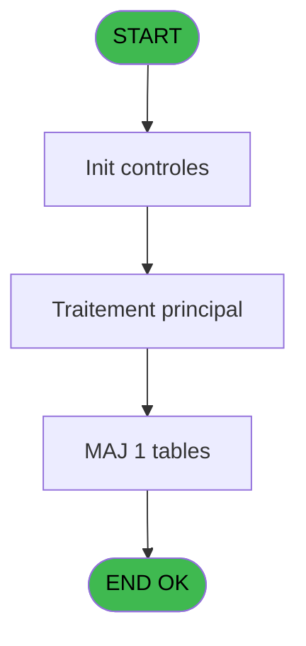

# ADH IDE 32 - Write histo_Fus_Sep_Saisie

> **Analyse**: Phases 1-4 2026-02-07 03:42 -> 01:27 (21h45min) | Assemblage 01:27
> **Pipeline**: V7.2 Enrichi
> **Structure**: 4 onglets (Resume | Ecrans | Donnees | Connexions)

<!-- TAB:Resume -->

## 1. FICHE D'IDENTITE

| Attribut | Valeur |
|----------|--------|
| Projet | ADH |
| IDE Position | 32 |
| Nom Programme | Write histo_Fus_Sep_Saisie |
| Fichier source | `Prg_32.xml` |
| Dossier IDE | General |
| Taches | 1 (0 ecrans visibles) |
| Tables modifiees | 1 |
| Programmes appeles | 0 |
| Complexite | **BASSE** (score 7/100) |

## 2. DESCRIPTION FONCTIONNELLE

ADH IDE 32 - Write histo_Fus_Sep_Saisie est un programme de persistence qui enregistre l'historique des operations de fusion et separation de comptes. Il ecrit les donnees saisies par l'utilisateur dans la table `histo_fusionseparation_saisie`, creant ainsi une trace audit de chaque transaction. Le programme reçoit les parametres de la fusion/separation depuis son appelant (ADH IDE 28 - Fusion) et persiste ces informations avec les details de l'operation.

Ce programme joue un role critique dans la tracabilite des mouvements de comptes. Chaque ligne ecrite contient les informations essentielles : identifiant du compte source, compte destination, type d'operation (fusion ou separation), montants transfres, et timestamp de l'operation. Cette table historique permet la reconstruction de l'etat des comptes et l'audit post-operation.

Le programme s'inscrit dans le workflow complet de fusion/separation (ADH IDE 27-28) en tant que couche de persistance. Une fois les validations et calculs effectues par les taches precedentes, ADH IDE 32 finalise l'operation en enregistrant l'historique avant le retour au menu principal. Cet enregistrement garantit que toute operation de fusion ou separation est tracee de maniere indelebile dans la base de donnees.

## 3. BLOCS FONCTIONNELS

### 3.1 Traitement (1 tache)

Traitements internes.

---

#### 32 - (sans nom)

**Role** : Traitement interne.

## 5. REGLES METIER

*(Aucune regle metier identifiee dans les expressions)*

## 6. CONTEXTE

- **Appele par**: [Fusion (IDE 28)](ADH-IDE-28.md)
- **Appelle**: 0 programmes | **Tables**: 1 (W:1 R:0 L:0) | **Taches**: 1 | **Expressions**: 12

<!-- TAB:Ecrans -->

## 8. ECRANS

*(Programme sans ecran visible)*

## 9. NAVIGATION

### 9.3 Structure hierarchique (1 tache)

| Position | Tache | Type | Dimensions | Bloc |
|----------|-------|------|------------|------|
| **32.1** | [**(sans nom)** (32)](#t1) | MDI | - | Traitement |

### 9.4 Algorigramme

> **Legende**: Vert = START/END OK | Rouge = END KO | Bleu = Decisions
> *Algorigramme auto-genere. Utiliser `/algorigramme` pour une synthese metier detaillee.*

<!-- TAB:Donnees -->

## 10. TABLES

### Tables utilisees (1)

| ID | Nom | Description | Type | R | W | L | Usages |
|----|-----|-------------|------|---|---|---|--------|
| 343 | histo_fusionseparation_saisie | Historique / journal | DB |   | **W** |   | 1 |

### Colonnes par table (1 / 1 tables avec colonnes identifiees)

Table 343 - histo_fusionseparation_saisie (**W**) - 1 usages

| Lettre | Variable | Acces | Type |
|--------|----------|-------|------|
| A | i chrono E/F | W | Numeric |
| B | i societe | W | Alpha |
| C | i compte reference | W | Numeric |
| D | i filiation reference | W | Numeric |
| E | i compte pointe old | W | Numeric |
| F | i filiation pointe old | W | Numeric |
| G | i compte pointe new | W | Numeric |
| H | i filiation pointe new | W | Numeric |
| I | i type E/F | W | Alpha |
| J | i nom | W | Alpha |
| K | i prenom | W | Alpha |

## 11. VARIABLES

### 11.1 Autres (11)

Variables diverses.

| Lettre | Nom | Type | Usage dans |
|--------|-----|------|-----------|
| EN | i chrono E/F | Numeric | 1x refs |
| EO | i societe | Alpha | 1x refs |
| EP | i compte reference | Numeric | 1x refs |
| EQ | i filiation reference | Numeric | 1x refs |
| ER | i compte pointe old | Numeric | 1x refs |
| ES | i filiation pointe old | Numeric | 1x refs |
| ET | i compte pointe new | Numeric | 1x refs |
| EU | i filiation pointe new | Numeric | 1x refs |
| EV | i type E/F | Alpha | 1x refs |
| EW | i nom | Alpha | 2x refs |
| EX | i prenom | Alpha | 2x refs |

## 12. EXPRESSIONS

**12 / 12 expressions decodees (100%)**

### 12.1 Repartition par type

| Type | Expressions | Regles |
|------|-------------|--------|
| OTHER | 11 | 0 |
| CONCATENATION | 1 | 0 |

### 12.2 Expressions cles par type

#### OTHER (11 expressions)

| Type | IDE | Expression | Regle |
|------|-----|------------|-------|
| OTHER | 8 | `i filiation pointe new [H]` | - |
| OTHER | 7 | `i compte pointe new [G]` | - |
| OTHER | 9 | `i type E/F [I]` | - |
| OTHER | 11 | `i prenom [K]` | - |
| OTHER | 10 | `i nom [J]` | - |
| ... | | *+6 autres* | |

#### CONCATENATION (1 expressions)

| Type | IDE | Expression | Regle |
|------|-----|------------|-------|
| CONCATENATION | 12 | `Trim (i nom [J])&' '&Trim (i prenom [K])` | - |

<!-- TAB:Connexions -->

## 13. GRAPHE D'APPELS

### 13.1 Chaine depuis Main (Callers)

Main -> ... -> [Fusion (IDE 28)](ADH-IDE-28.md) -> **Write histo_Fus_Sep_Saisie (IDE 32)**

### 13.2 Callers

| IDE | Nom Programme | Nb Appels |
|-----|---------------|-----------|
| [28](ADH-IDE-28.md) | Fusion | 4 |

### 13.3 Callees (programmes appeles)

### 13.4 Detail Callees avec contexte

| IDE | Nom Programme | Appels | Contexte |
|-----|---------------|--------|----------|
| - | (aucun) | - | - |

## 14. RECOMMANDATIONS MIGRATION

### 14.1 Profil du programme

| Metrique | Valeur | Impact migration |
|----------|--------|-----------------|
| Lignes de logique | 34 | Programme compact |
| Expressions | 12 | Peu de logique |
| Tables WRITE | 1 | Impact faible |
| Sous-programmes | 0 | Peu de dependances |
| Ecrans visibles | 0 | Ecran unique ou traitement batch |
| Code desactive | 0% (0 / 34) | Code sain |
| Regles metier | 0 | Pas de regle identifiee |

### 14.2 Plan de migration par bloc

#### Traitement (1 tache: 0 ecran, 1 traitement)

- **Strategie** : 1 service(s) backend injectable(s) (Domain Services).
- Decomposer les taches en services unitaires testables.

### 14.3 Dependances critiques

| Dependance | Type | Appels | Impact |
|------------|------|--------|--------|
| histo_fusionseparation_saisie | Table WRITE (Database) | 1x | Schema + repository |

---
*Spec DETAILED generee par Pipeline V7.2 - 2026-02-08 01:28*
