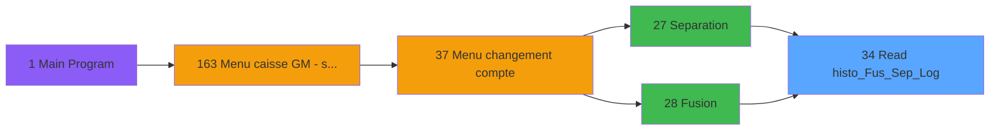

# ADH IDE 34 - Read histo_Fus_Sep_Log

> **Analyse**: Phases 1-4 2026-02-07 03:42 -> 03:42 (26s) | Assemblage 13:08
> **Pipeline**: V7.2 Enrichi
> **Structure**: 4 onglets (Resume | Ecrans | Donnees | Connexions)

<!-- TAB:Resume -->

## 1. FICHE D'IDENTITE

| Attribut | Valeur |
|----------|--------|
| Projet | ADH |
| IDE Position | 34 |
| Nom Programme | Read histo_Fus_Sep_Log |
| Fichier source | `Prg_34.xml` |
| Dossier IDE | General |
| Taches | 1 (0 ecrans visibles) |
| Tables modifiees | 0 |
| Programmes appeles | 0 |
| Complexite | **BASSE** (score 0/100) |

## 2. DESCRIPTION FONCTIONNELLE

**ADH IDE 34 - Read histo_Fus_Sep_Log** est un utilitaire de lecture du journal d'historique des opérations de fusion et séparation de comptes (table histo_fus_sep_log). Le programme expose une interface de consultation simple permettant de rechercher les traces d'opérations en fonction d'un numéro de chronologie et d'un code, avec vérification logique de l'existence du code. C'est un programme terminal qui sert de point d'accès centralisé aux données historiques.

Le programme est appelé exclusivement par deux programmes métier critiques : **Separation (IDE 27)** et **Fusion (IDE 28)**, qui utilisent ses capacités de lecture pour tracer et valider les opérations de gestion de compte. Ces appels s'inscrivent dans la chaîne de menu depuis Main → Menu caisse → Menu changement de compte, ce qui indique que la consultation de l'historique est une fonction auxiliaire supportant les opérations principales de gestion comptable du logiciel de caisse.

La structure minimale du programme (12 lignes de logic, zéro complexité conditionnelle) et son interface sans contrôles GUI spécialisés soulignent son rôle d'utilitaire léger dédié à la simple récupération et consultation des données historiques, sans logique métier embarquée au-delà de la lecture et de la vérification d'existence des clés.

## 3. BLOCS FONCTIONNELS

### 3.1 Traitement (1 tache)

Traitements internes.

---

#### 34 - (sans nom)

**Role** : Traitement interne.

## 5. REGLES METIER

*(Aucune regle metier identifiee dans les expressions)*

## 6. CONTEXTE

- **Appele par**: [Separation (IDE 27)](ADH-IDE-27.md), [Fusion (IDE 28)](ADH-IDE-28.md)
- **Appelle**: 0 programmes | **Tables**: 1 (W:0 R:1 L:0) | **Taches**: 1 | **Expressions**: 3

<!-- TAB:Ecrans -->

## 8. ECRANS

*(Programme sans ecran visible)*

## 9. NAVIGATION

### 9.3 Structure hierarchique (1 tache)

| Position | Tache | Type | Dimensions | Bloc |
|----------|-------|------|------------|------|
| **34.1** | [**(sans nom)** (34)](#t1) | MDI | - | Traitement |

### 9.4 Algorigramme

> **Legende**: Vert = START/END OK | Rouge = END KO | Bleu = Decisions
> *Algorigramme auto-genere. Utiliser `/algorigramme` pour une synthese metier detaillee.*

<!-- TAB:Donnees -->

## 10. TABLES

### Tables utilisees (1)

| ID | Nom | Description | Type | R | W | L | Usages |
|----|-----|-------------|------|---|---|---|--------|
| 342 | histo__fusionseparation_log | Historique / journal | DB | R |   |   | 1 |

### Colonnes par table (1 / 1 tables avec colonnes identifiees)

Table 342 - histo__fusionseparation_log (R) - 1 usages

| Lettre | Variable | Acces | Type |
|--------|----------|-------|------|
| A | i chrono | R | Numeric |
| B | i code | R | Alpha |
| C | o code existe | R | Logical |

## 11. VARIABLES

### 11.1 Autres (3)

Variables diverses.

| Lettre | Nom | Type | Usage dans |
|--------|-----|------|-----------|
| A | i chrono | Numeric | 1x refs |
| B | i code | Alpha | 1x refs |
| C | o code existe | Logical | - |

## 12. EXPRESSIONS

**3 / 3 expressions decodees (100%)**

### 12.1 Repartition par type

| Type | Expressions | Regles |
|------|-------------|--------|
| CONSTANTE | 1 | 0 |
| OTHER | 2 | 0 |

### 12.2 Expressions cles par type

#### CONSTANTE (1 expressions)

| Type | IDE | Expression | Regle |
|------|-----|------------|-------|
| CONSTANTE | 2 | `0` | - |

#### OTHER (2 expressions)

| Type | IDE | Expression | Regle |
|------|-----|------------|-------|
| OTHER | 3 | `i code [B]` | - |
| OTHER | 1 | `i chrono [A]` | - |

<!-- TAB:Connexions -->

## 13. GRAPHE D'APPELS

### 13.1 Chaine depuis Main (Callers)

Main -> ... -> [Separation (IDE 27)](ADH-IDE-27.md) -> **Read histo_Fus_Sep_Log (IDE 34)**

Main -> ... -> [Fusion (IDE 28)](ADH-IDE-28.md) -> **Read histo_Fus_Sep_Log (IDE 34)**

### 13.2 Callers

| IDE | Nom Programme | Nb Appels |
|-----|---------------|-----------|
| [27](ADH-IDE-27.md) | Separation | 1 |
| [28](ADH-IDE-28.md) | Fusion | 1 |

### 13.3 Callees (programmes appeles)

### 13.4 Detail Callees avec contexte

| IDE | Nom Programme | Appels | Contexte |
|-----|---------------|--------|----------|
| - | (aucun) | - | - |

## 14. RECOMMANDATIONS MIGRATION

### 14.1 Profil du programme

| Metrique | Valeur | Impact migration |
|----------|--------|-----------------|
| Lignes de logique | 12 | Programme compact |
| Expressions | 3 | Peu de logique |
| Tables WRITE | 0 | Impact faible |
| Sous-programmes | 0 | Peu de dependances |
| Ecrans visibles | 0 | Ecran unique ou traitement batch |
| Code desactive | 0% (0 / 12) | Code sain |
| Regles metier | 0 | Pas de regle identifiee |

### 14.2 Plan de migration par bloc

#### Traitement (1 tache: 0 ecran, 1 traitement)

- **Strategie** : 1 service(s) backend injectable(s) (Domain Services).
- Decomposer les taches en services unitaires testables.

### 14.3 Dependances critiques

| Dependance | Type | Appels | Impact |
|------------|------|--------|--------|

---
*Spec DETAILED generee par Pipeline V7.2 - 2026-02-07 13:10*
