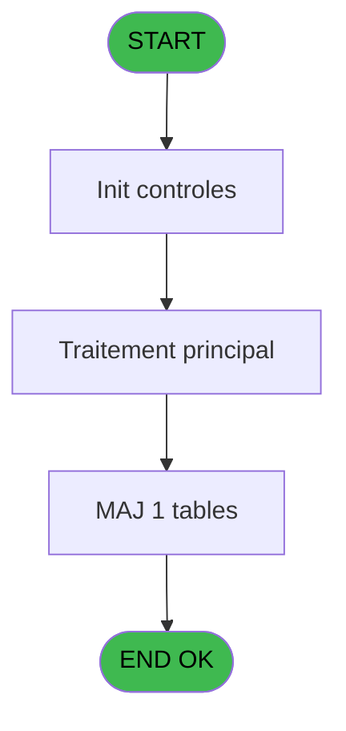
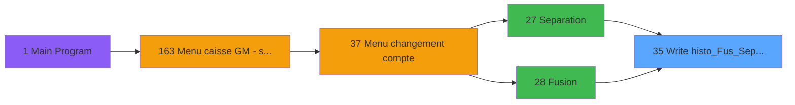

# ADH IDE 35 - Write histo_Fus_Sep_Log

> **Analyse**: Phases 1-4 2026-02-07 03:42 -> 01:29 (21h46min) | Assemblage 01:29
> **Pipeline**: V7.2 Enrichi
> **Structure**: 4 onglets (Resume | Ecrans | Donnees | Connexions)

<!-- TAB:Resume -->

## 1. FICHE D'IDENTITE

| Attribut | Valeur |
|----------|--------|
| Projet | ADH |
| IDE Position | 35 |
| Nom Programme | Write histo_Fus_Sep_Log |
| Fichier source | `Prg_35.xml` |
| Dossier IDE | General |
| Taches | 3 (0 ecrans visibles) |
| Tables modifiees | 1 |
| Programmes appeles | 0 |
| Complexite | **BASSE** (score 7/100) |

## 2. DESCRIPTION FONCTIONNELLE

# ADH IDE 35 - Write histo_Fus_Sep_Log

Programme utilitaire appelé lors des opérations de **séparation et fusion de comptes** (ADH IDE 27 et 28). Son rôle est de tracer dans la table `histo_fusionseparation_log` chaque modification effectuée pendant ces opérations critiques.

Enregistre les mouvements de comptes : création de liens de filiation, suppression d'associations, modification des statuts. Chaque ligne loggée contient l'opérateur, la date/heure, les numéros de sociétés et comptes impliqués, et le type d'opération (séparation vs fusion). Permet un audit complet des restructurations de données comptables.

Appelé une ou plusieurs fois pendant le flux séparation/fusion pour tracer les étapes intermédiaires. Point d'entrée critique pour garantir la traçabilité des modifications de hiérarchie de comptes dans la base de données.

## 3. BLOCS FONCTIONNELS

### 3.1 Traitement (3 taches)

Traitements internes.

---

#### 35 - (sans nom)

**Role** : Traitement interne.

---

#### 35.1 - (sans nom)

**Role** : Traitement interne.

---

#### 35.2 - (sans nom)

**Role** : Traitement interne.

## 5. REGLES METIER

1 regles identifiees:

### Autres (1 regles)

#### [RM-001] Negation de VG78 (condition inversee)

| Element | Detail |
|---------|--------|
| **Condition** | `NOT VG78` |
| **Si vrai** | Action si vrai |
| **Expression source** | Expression 1 : `NOT VG78` |
| **Exemple** | Si NOT VG78 → Action si vrai |

## 6. CONTEXTE

- **Appele par**: [Separation (IDE 27)](ADH-IDE-27.md), [Fusion (IDE 28)](ADH-IDE-28.md)
- **Appelle**: 0 programmes | **Tables**: 1 (W:1 R:0 L:0) | **Taches**: 3 | **Expressions**: 2

<!-- TAB:Ecrans -->

## 8. ECRANS

*(Programme sans ecran visible)*

## 9. NAVIGATION

### 9.3 Structure hierarchique (3 taches)

| Position | Tache | Type | Dimensions | Bloc |
|----------|-------|------|------------|------|
| **35.1** | [**(sans nom)** (35)](#t1) | MDI | - | Traitement |
| 35.1.1 | [(sans nom) (35.1)](#t2) | MDI | - | |
| 35.1.2 | [(sans nom) (35.2)](#t3) | MDI | - | |

### 9.4 Algorigramme

> **Legende**: Vert = START/END OK | Rouge = END KO | Bleu = Decisions
> *Algorigramme auto-genere. Utiliser `/algorigramme` pour une synthese metier detaillee.*

<!-- TAB:Donnees -->

## 10. TABLES

### Tables utilisees (1)

| ID | Nom | Description | Type | R | W | L | Usages |
|----|-----|-------------|------|---|---|---|--------|
| 342 | histo__fusionseparation_log | Historique / journal | DB |   | **W** |   | 2 |

### Colonnes par table (1 / 1 tables avec colonnes identifiees)

Table 342 - histo__fusionseparation_log (**W**) - 2 usages

| Lettre | Variable | Acces | Type |
|--------|----------|-------|------|
| A | i.mode Reprise | W | Logical |
| B | i.chrono F/E | W | Numeric |
| C | i.chrono LOG | W | Numeric |
| D | i.code | W | Alpha |
| E | i.texte | W | Alpha |
| F | i.status | W | Alpha |
| G | i.type F/E | W | Alpha |

## 11. VARIABLES

### 11.1 Autres (7)

Variables diverses.

| Lettre | Nom | Type | Usage dans |
|--------|-----|------|-----------|
| EN | i.mode Reprise | Logical | - |
| EO | i.chrono F/E | Numeric | - |
| EP | i.chrono LOG | Numeric | - |
| EQ | i.code | Alpha | - |
| ER | i.texte | Alpha | - |
| ES | i.status | Alpha | - |
| ET | i.type F/E | Alpha | - |

## 12. EXPRESSIONS

**2 / 2 expressions decodees (100%)**

### 12.1 Repartition par type

| Type | Expressions | Regles |
|------|-------------|--------|
| NEGATION | 1 | 5 |
| REFERENCE_VG | 1 | 0 |

### 12.2 Expressions cles par type

#### NEGATION (1 expressions)

| Type | IDE | Expression | Regle |
|------|-----|------------|-------|
| NEGATION | 1 | `NOT VG78` | [RM-001](#rm-RM-001) |

#### REFERENCE_VG (1 expressions)

| Type | IDE | Expression | Regle |
|------|-----|------------|-------|
| REFERENCE_VG | 2 | `VG78` | - |

<!-- TAB:Connexions -->

## 13. GRAPHE D'APPELS

### 13.1 Chaine depuis Main (Callers)

Main -> ... -> [Separation (IDE 27)](ADH-IDE-27.md) -> **Write histo_Fus_Sep_Log (IDE 35)**

Main -> ... -> [Fusion (IDE 28)](ADH-IDE-28.md) -> **Write histo_Fus_Sep_Log (IDE 35)**

### 13.2 Callers

| IDE | Nom Programme | Nb Appels |
|-----|---------------|-----------|
| [27](ADH-IDE-27.md) | Separation | 14 |
| [28](ADH-IDE-28.md) | Fusion | 13 |

### 13.3 Callees (programmes appeles)

### 13.4 Detail Callees avec contexte

| IDE | Nom Programme | Appels | Contexte |
|-----|---------------|--------|----------|
| - | (aucun) | - | - |

## 14. RECOMMANDATIONS MIGRATION

### 14.1 Profil du programme

| Metrique | Valeur | Impact migration |
|----------|--------|-----------------|
| Lignes de logique | 72 | Programme compact |
| Expressions | 2 | Peu de logique |
| Tables WRITE | 1 | Impact faible |
| Sous-programmes | 0 | Peu de dependances |
| Ecrans visibles | 0 | Ecran unique ou traitement batch |
| Code desactive | 0% (0 / 72) | Code sain |
| Regles metier | 1 | Quelques regles a preserver |

### 14.2 Plan de migration par bloc

#### Traitement (3 taches: 0 ecran, 3 traitements)

- **Strategie** : 3 service(s) backend injectable(s) (Domain Services).
- Decomposer les taches en services unitaires testables.

### 14.3 Dependances critiques

| Dependance | Type | Appels | Impact |
|------------|------|--------|--------|
| histo__fusionseparation_log | Table WRITE (Database) | 2x | Schema + repository |

---
*Spec DETAILED generee par Pipeline V7.2 - 2026-02-08 01:29*
