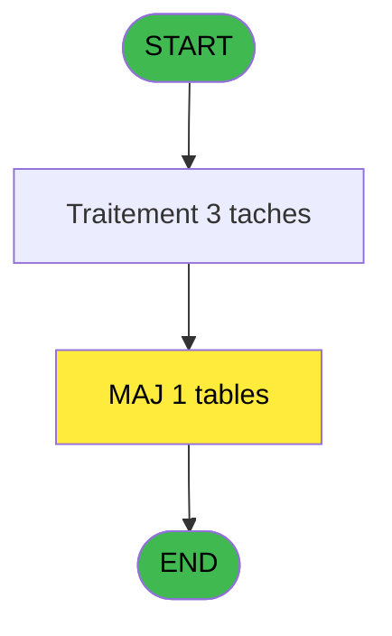
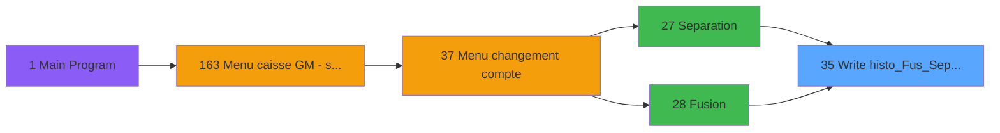

# ADH IDE 35 - Write histo_Fus_Sep_Log

> **Analyse**: Phases 1-4 2026-02-07 03:42 -> 03:42 (27s) | Assemblage 13:10
> **Pipeline**: V7.2 Enrichi
> **Structure**: 4 onglets (Resume | Ecrans | Donnees | Connexions)

<!-- TAB:Resume -->

## 1. FICHE D'IDENTITE

| Attribut | Valeur |
|----------|--------|
| Projet | ADH |
| IDE Position | 35 |
| Nom Programme | Write histo_Fus_Sep_Log |
| Fichier source | `Prg_35.xml` |
| Dossier IDE | General |
| Taches | 3 (0 ecrans visibles) |
| Tables modifiees | 1 |
| Programmes appeles | 0 |
| Complexite | **BASSE** (score 7/100) |

## 2. DESCRIPTION FONCTIONNELLE

# ADH IDE 35 - Write histo_Fus_Sep_Log

Programme utilitaire chargé d'enregistrer les opérations de fusion et séparation de comptes clients dans la table de journalisation `histo__fusionseparation_log`. Il capture les métadonnées critiques de chaque opération : identificateurs des comptes source/destination, type d'opération (fusion ou séparation), horodatage et utilisateur responsable.

Appelé systématiquement par les programmes Separation (IDE 27) et Fusion (IDE 28) après validation des données, il assure la traçabilité complète de ces opérations sensibles. Cet audit trail est obligatoire pour la réconciliation comptable et les investigations ultérieures sur l'historique des comptes.

Fonction atomique sans logique métier complexe : valide les paramètres d'entrée, construit le enregistrement avec contexte d'exécution, puis persiste dans la table de historique avant de retourner le statut de succès au programme appelant.

## 3. BLOCS FONCTIONNELS

### 3.1 Traitement (3 taches)

Traitements internes.

---

#### T1 - (sans nom)

**Role** : Traitement interne.

---

#### T2 - (sans nom)

**Role** : Traitement interne.

---

#### T3 - (sans nom)

**Role** : Traitement interne.

## 5. REGLES METIER

*(Aucune regle metier identifiee dans les expressions)*

## 6. CONTEXTE

- **Appele par**: [Separation (IDE 27)](ADH-IDE-27.md), [Fusion (IDE 28)](ADH-IDE-28.md)
- **Appelle**: 0 programmes | **Tables**: 1 (W:1 R:0 L:0) | **Taches**: 3 | **Expressions**: 2

<!-- TAB:Ecrans -->

## 8. ECRANS

*(Programme sans ecran visible)*

## 9. NAVIGATION

### 9.3 Structure hierarchique (3 taches)

| Position | Tache | Type | Dimensions | Bloc |
|----------|-------|------|------------|------|
| **35.1** | [**(sans nom)** (T1)](#t1) | MDI | - | Traitement |
| 35.1.1 | [(sans nom) (T2)](#t2) | MDI | - | |
| 35.1.2 | [(sans nom) (T3)](#t3) | MDI | - | |

### 9.4 Algorigramme

> *Algorigramme simplifie base sur les blocs fonctionnels. Utiliser `/algorigramme` pour une synthese metier detaillee.*

<!-- TAB:Donnees -->

## 10. TABLES

### Tables utilisees (1)

| ID | Nom | Description | Type | R | W | L | Usages |
|----|-----|-------------|------|---|---|---|--------|
| 342 | histo__fusionseparation_log | Historique / journal | DB |   | **W** |   | 2 |

### Colonnes par table (1 / 1 tables avec colonnes identifiees)

Table 342 - histo__fusionseparation_log (**W**) - 2 usages

| Lettre | Variable | Acces | Type |
|--------|----------|-------|------|
| A | i.mode Reprise | W | Logical |
| B | i.chrono F/E | W | Numeric |
| C | i.chrono LOG | W | Numeric |
| D | i.code | W | Alpha |
| E | i.texte | W | Alpha |
| F | i.status | W | Alpha |
| G | i.type F/E | W | Alpha |

## 11. VARIABLES

### 11.1 Autres (7)

Variables diverses.

| Lettre | Nom | Type | Usage dans |
|--------|-----|------|-----------|
| A | i.mode Reprise | Logical | - |
| B | i.chrono F/E | Numeric | - |
| C | i.chrono LOG | Numeric | - |
| D | i.code | Alpha | - |
| E | i.texte | Alpha | - |
| F | i.status | Alpha | - |
| G | i.type F/E | Alpha | - |

## 12. EXPRESSIONS

**2 / 2 expressions decodees (100%)**

### 12.1 Repartition par type

| Type | Expressions | Regles |
|------|-------------|--------|
| NEGATION | 1 | 0 |
| REFERENCE_VG | 1 | 0 |

### 12.2 Expressions cles par type

#### NEGATION (1 expressions)

| Type | IDE | Expression | Regle |
|------|-----|------------|-------|
| NEGATION | 1 | `NOT VG78` | - |

#### REFERENCE_VG (1 expressions)

| Type | IDE | Expression | Regle |
|------|-----|------------|-------|
| REFERENCE_VG | 2 | `VG78` | - |

<!-- TAB:Connexions -->

## 13. GRAPHE D'APPELS

### 13.1 Chaine depuis Main (Callers)

Main -> ... -> [Separation (IDE 27)](ADH-IDE-27.md) -> **Write histo_Fus_Sep_Log (IDE 35)**

Main -> ... -> [Fusion (IDE 28)](ADH-IDE-28.md) -> **Write histo_Fus_Sep_Log (IDE 35)**

### 13.2 Callers

| IDE | Nom Programme | Nb Appels |
|-----|---------------|-----------|
| [27](ADH-IDE-27.md) | Separation | 14 |
| [28](ADH-IDE-28.md) | Fusion | 13 |

### 13.3 Callees (programmes appeles)

### 13.4 Detail Callees avec contexte

| IDE | Nom Programme | Appels | Contexte |
|-----|---------------|--------|----------|
| - | (aucun) | - | - |

## 14. RECOMMANDATIONS MIGRATION

### 14.1 Profil du programme

| Metrique | Valeur | Impact migration |
|----------|--------|-----------------|
| Lignes de logique | 72 | Programme compact |
| Expressions | 2 | Peu de logique |
| Tables WRITE | 1 | Impact faible |
| Sous-programmes | 0 | Peu de dependances |
| Ecrans visibles | 0 | Ecran unique ou traitement batch |
| Code desactive | 0% (0 / 72) | Code sain |
| Regles metier | 0 | Pas de regle identifiee |

### 14.2 Plan de migration par bloc

#### Traitement (3 taches: 0 ecran, 3 traitements)

- **Strategie** : 3 service(s) backend injectable(s) (Domain Services).
- Decomposer les taches en services unitaires testables.

### 14.3 Dependances critiques

| Dependance | Type | Appels | Impact |
|------------|------|--------|--------|
| histo__fusionseparation_log | Table WRITE (Database) | 2x | Schema + repository |

---
*Spec DETAILED generee par Pipeline V7.2 - 2026-02-07 13:10*
