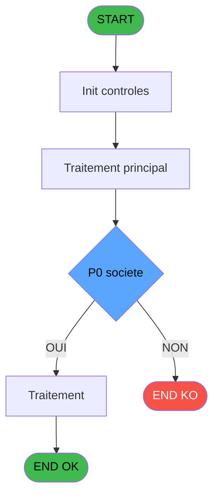

# ADH IDE 36 - Print Separation ou fusion

> **Analyse**: Phases 1-4 2026-02-07 03:42 -> 01:30 (21h47min) | Assemblage 01:30
> **Pipeline**: V7.2 Enrichi
> **Structure**: 4 onglets (Resume | Ecrans | Donnees | Connexions)

<!-- TAB:Resume -->

## 1. FICHE D'IDENTITE

| Attribut | Valeur |
|----------|--------|
| Projet | ADH |
| IDE Position | 36 |
| Nom Programme | Print Separation ou fusion |
| Fichier source | `Prg_36.xml` |
| Dossier IDE | Impression |
| Taches | 27 (1 ecrans visibles) |
| Tables modifiees | 0 |
| Programmes appeles | 1 |
| Complexite | **BASSE** (score 18/100) |

## 2. DESCRIPTION FONCTIONNELLE

{"type":"result","subtype":"success","is_error":false,"duration_ms":30268,"duration_api_ms":24869,"num_turns":4,"result":"","session_id":"9d979476-89eb-4140-bb5b-e7498ca37aef","total_cost_usd":0.13944735,"usage":{"input_tokens":19,"cache_creation_input_tokens":46656,"cache_read_input_tokens":209453,"output_tokens":1080,"server_tool_use":{"web_search_requests":0,"web_fetch_requests":0},"service_tier":"standard","cache_creation":{"ephemeral_1h_input_tokens":0,"ephemeral_5m_input_tokens":46656}},"modelUsage":{"claude-haiku-4-5-20251001":{"inputTokens":448,"outputTokens":1872,"cacheReadInputTokens":287656,"cacheCreationInputTokens":80699,"webSearchRequests":0,"costUSD":0.13944735,"contextWindow":200000,"maxOutputTokens":64000}},"permission_denials":[],"uuid":"0c78a107-969c-413f-8d10-4bfa93aba248"}

## 3. BLOCS FONCTIONNELS

### 3.1 Traitement (22 taches)

Traitements internes.

---

#### 36 - Veuillez patienter... [[ECRAN]](#ecran-t1)

**Role** : Tache d'orchestration : point d'entree du programme (22 sous-taches). Coordonne l'enchainement des traitements.
**Ecran** : 422 x 56 DLU (MDI) | [Voir mockup](#ecran-t1)

21 sous-taches directes

| Tache | Nom | Bloc |
|-------|-----|------|
| [36.1](#t2) | Nbre Record Histo | Traitement |
| [36.2.1](#t4) | Traitement **[[ECRAN]](#ecran-t4)** | Traitement |
| [36.2.1.1](#t5) | Detail | Traitement |
| [36.2.2](#t6) | Traitement **[[ECRAN]](#ecran-t6)** | Traitement |
| [36.2.2.1](#t7) | Detail | Traitement |
| [36.3.1](#t9) | Traitement **[[ECRAN]](#ecran-t9)** | Traitement |
| [36.3.1.1](#t10) | Detail | Traitement |
| [36.3.2](#t11) | Traitement **[[ECRAN]](#ecran-t11)** | Traitement |
| [36.3.2.1](#t12) | Detail | Traitement |
| [36.4.1](#t14) | Traitement **[[ECRAN]](#ecran-t14)** | Traitement |
| [36.4.1.1](#t15) | Detail | Traitement |
| [36.4.2](#t16) | Traitement **[[ECRAN]](#ecran-t16)** | Traitement |
| [36.4.2.1](#t17) | Detail | Traitement |
| [36.5.1](#t19) | Traitement **[[ECRAN]](#ecran-t19)** | Traitement |
| [36.5.1.1](#t20) | Detail | Traitement |
| [36.5.2](#t21) | Traitement **[[ECRAN]](#ecran-t21)** | Traitement |
| [36.5.2.1](#t22) | Detail | Traitement |
| [36.6.1](#t24) | Traitement **[[ECRAN]](#ecran-t24)** | Traitement |
| [36.6.1.1](#t25) | Detail | Traitement |
| [36.6.2](#t26) | Traitement **[[ECRAN]](#ecran-t26)** | Traitement |
| [36.6.2.1](#t27) | Detail | Traitement |

---

#### 36.1 - Nbre Record Histo

**Role** : Traitement : Nbre Record Histo.
**Variables liees** : FA (W0 nbre filiation), FF (W0 Nbre Record Histo)

---

#### 36.2.1 - Traitement [[ECRAN]](#ecran-t4)

**Role** : Traitement : Traitement.
**Ecran** : 308 x 56 DLU (MDI) | [Voir mockup](#ecran-t4)

---

#### 36.2.1.1 - Detail

**Role** : Traitement : Detail.

---

#### 36.2.2 - Traitement [[ECRAN]](#ecran-t6)

**Role** : Traitement : Traitement.
**Ecran** : 308 x 56 DLU (MDI) | [Voir mockup](#ecran-t6)

---

#### 36.2.2.1 - Detail

**Role** : Traitement : Detail.

---

#### 36.3.1 - Traitement [[ECRAN]](#ecran-t9)

**Role** : Traitement : Traitement.
**Ecran** : 308 x 56 DLU (MDI) | [Voir mockup](#ecran-t9)

---

#### 36.3.1.1 - Detail

**Role** : Traitement : Detail.

---

#### 36.3.2 - Traitement [[ECRAN]](#ecran-t11)

**Role** : Traitement : Traitement.
**Ecran** : 308 x 56 DLU (MDI) | [Voir mockup](#ecran-t11)

---

#### 36.3.2.1 - Detail

**Role** : Traitement : Detail.

---

#### 36.4.1 - Traitement [[ECRAN]](#ecran-t14)

**Role** : Traitement : Traitement.
**Ecran** : 308 x 56 DLU (MDI) | [Voir mockup](#ecran-t14)

---

#### 36.4.1.1 - Detail

**Role** : Traitement : Detail.

---

#### 36.4.2 - Traitement [[ECRAN]](#ecran-t16)

**Role** : Traitement : Traitement.
**Ecran** : 308 x 56 DLU (MDI) | [Voir mockup](#ecran-t16)

---

#### 36.4.2.1 - Detail

**Role** : Traitement : Detail.

---

#### 36.5.1 - Traitement [[ECRAN]](#ecran-t19)

**Role** : Traitement : Traitement.
**Ecran** : 308 x 56 DLU (MDI) | [Voir mockup](#ecran-t19)

---

#### 36.5.1.1 - Detail

**Role** : Traitement : Detail.

---

#### 36.5.2 - Traitement [[ECRAN]](#ecran-t21)

**Role** : Traitement : Traitement.
**Ecran** : 308 x 56 DLU (MDI) | [Voir mockup](#ecran-t21)

---

#### 36.5.2.1 - Detail

**Role** : Traitement : Detail.

---

#### 36.6.1 - Traitement [[ECRAN]](#ecran-t24)

**Role** : Traitement : Traitement.
**Ecran** : 308 x 56 DLU (MDI) | [Voir mockup](#ecran-t24)

---

#### 36.6.1.1 - Detail

**Role** : Traitement : Detail.

---

#### 36.6.2 - Traitement [[ECRAN]](#ecran-t26)

**Role** : Traitement : Traitement.
**Ecran** : 308 x 56 DLU (MDI) | [Voir mockup](#ecran-t26)

---

#### 36.6.2.1 - Detail

**Role** : Traitement : Detail.

### 3.2 Impression (5 taches)

Generation des documents et tickets.

---

#### 36.2 - Printer 1 [[ECRAN]](#ecran-t3)

**Role** : Generation du document : Printer 1.
**Ecran** : 308 x 56 DLU (MDI) | [Voir mockup](#ecran-t3)
**Delegue a** : [Raz Current Printer (IDE 182)](ADH-IDE-182.md)

---

#### 36.3 - Printer 4 [[ECRAN]](#ecran-t8)

**Role** : Generation du document : Printer 4.
**Ecran** : 308 x 56 DLU (MDI) | [Voir mockup](#ecran-t8)
**Delegue a** : [Raz Current Printer (IDE 182)](ADH-IDE-182.md)

---

#### 36.4 - Printer 6 [[ECRAN]](#ecran-t13)

**Role** : Generation du document : Printer 6.
**Ecran** : 308 x 56 DLU (MDI) | [Voir mockup](#ecran-t13)
**Delegue a** : [Raz Current Printer (IDE 182)](ADH-IDE-182.md)

---

#### 36.5 - Printer 8 [[ECRAN]](#ecran-t18)

**Role** : Generation du document : Printer 8.
**Ecran** : 308 x 56 DLU (MDI) | [Voir mockup](#ecran-t18)
**Delegue a** : [Raz Current Printer (IDE 182)](ADH-IDE-182.md)

---

#### 36.6 - Printer 9 [[ECRAN]](#ecran-t23)

**Role** : Generation du document : Printer 9.
**Ecran** : 308 x 56 DLU (MDI) | [Voir mockup](#ecran-t23)
**Delegue a** : [Raz Current Printer (IDE 182)](ADH-IDE-182.md)

## 5. REGLES METIER

6 regles identifiees:

### Impression (5 regles)

#### [RM-002] Verification que l'imprimante courante est la n1

| Element | Detail |
|---------|--------|
| **Condition** | `GetParam ('CURRENTPRINTERNUM')=1` |
| **Si vrai** | Action si CURRENTPRINTERNUM = 1 |
| **Expression source** | Expression 10 : `GetParam ('CURRENTPRINTERNUM')=1` |
| **Exemple** | Si GetParam ('CURRENTPRINTERNUM')=1 → Action si CURRENTPRINTERNUM = 1 |
| **Impact** | [36.2 - Printer 1](#t3) |

#### [RM-003] Verification que l'imprimante courante est la n4

| Element | Detail |
|---------|--------|
| **Condition** | `GetParam ('CURRENTPRINTERNUM')=4` |
| **Si vrai** | Action si CURRENTPRINTERNUM = 4 |
| **Expression source** | Expression 11 : `GetParam ('CURRENTPRINTERNUM')=4` |
| **Exemple** | Si GetParam ('CURRENTPRINTERNUM')=4 → Action si CURRENTPRINTERNUM = 4 |
| **Impact** | [36.2 - Printer 1](#t3) |

#### [RM-004] Verification que l'imprimante courante est la n6

| Element | Detail |
|---------|--------|
| **Condition** | `GetParam ('CURRENTPRINTERNUM')=6` |
| **Si vrai** | Action si CURRENTPRINTERNUM = 6 |
| **Expression source** | Expression 12 : `GetParam ('CURRENTPRINTERNUM')=6` |
| **Exemple** | Si GetParam ('CURRENTPRINTERNUM')=6 → Action si CURRENTPRINTERNUM = 6 |
| **Impact** | [36.2 - Printer 1](#t3) |

#### [RM-005] Verification que l'imprimante courante est la n8

| Element | Detail |
|---------|--------|
| **Condition** | `GetParam ('CURRENTPRINTERNUM')=8` |
| **Si vrai** | Action si CURRENTPRINTERNUM = 8 |
| **Expression source** | Expression 13 : `GetParam ('CURRENTPRINTERNUM')=8` |
| **Exemple** | Si GetParam ('CURRENTPRINTERNUM')=8 → Action si CURRENTPRINTERNUM = 8 |
| **Impact** | [36.2 - Printer 1](#t3) |

#### [RM-006] Verification que l'imprimante courante est la n9

| Element | Detail |
|---------|--------|
| **Condition** | `GetParam ('CURRENTPRINTERNUM')=9` |
| **Si vrai** | Action si CURRENTPRINTERNUM = 9 |
| **Expression source** | Expression 14 : `GetParam ('CURRENTPRINTERNUM')=9` |
| **Exemple** | Si GetParam ('CURRENTPRINTERNUM')=9 → Action si CURRENTPRINTERNUM = 9 |
| **Impact** | [36.2 - Printer 1](#t3) |

### Autres (1 regles)

#### [RM-001] Condition: P0 societe [A] egale

| Element | Detail |
|---------|--------|
| **Condition** | `P0 societe [A]=''` |
| **Si vrai** | Action si vrai |
| **Variables** | EN (P0 societe) |
| **Expression source** | Expression 1 : `P0 societe [A]=''` |
| **Exemple** | Si P0 societe [A]='' → Action si vrai |

## 6. CONTEXTE

- **Appele par**: [Separation (IDE 27)](ADH-IDE-27.md), [Fusion (IDE 28)](ADH-IDE-28.md)
- **Appelle**: 1 programmes | **Tables**: 4 (W:0 R:3 L:1) | **Taches**: 27 | **Expressions**: 15

<!-- TAB:Ecrans -->

## 8. ECRANS

### 8.1 Forms visibles (1 / 27)

| # | Position | Tache | Nom | Type | Largeur | Hauteur | Bloc |
|---|----------|-------|-----|------|---------|---------|------|
| 1 | 36 | 36 | Veuillez patienter... | MDI | 422 | 56 | Traitement |

### 8.2 Mockups Ecrans

---

#### 36 - Veuillez patienter...
**Tache** : [36](#t1) | **Type** : MDI | **Dimensions** : 422 x 56 DLU
**Bloc** : Traitement | **Titre IDE** : Veuillez patienter...

<!-- FORM-DATA:
{
    "width":  422,
    "vFactor":  8,
    "type":  "MDI",
    "hFactor":  8,
    "controls":  [
                     {
                         "x":  0,
                         "type":  "label",
                         "var":  "",
                         "y":  0,
                         "w":  423,
                         "fmt":  "",
                         "name":  "",
                         "h":  29,
                         "color":  "",
                         "text":  "",
                         "parent":  null
                     },
                     {
                         "x":  120,
                         "type":  "label",
                         "var":  "",
                         "y":  10,
                         "w":  221,
                         "fmt":  "",
                         "name":  "",
                         "h":  8,
                         "color":  "7",
                         "text":  "Impression en cours ...",
                         "parent":  null
                     },
                     {
                         "x":  0,
                         "type":  "label",
                         "var":  "",
                         "y":  29,
                         "w":  423,
                         "fmt":  "",
                         "name":  "",
                         "h":  27,
                         "color":  "",
                         "text":  "",
                         "parent":  null
                     },
                     {
                         "x":  72,
                         "type":  "label",
                         "var":  "",
                         "y":  38,
                         "w":  280,
                         "fmt":  "",
                         "name":  "",
                         "h":  8,
                         "color":  "",
                         "text":  "Separation de comptes",
                         "parent":  null
                     },
                     {
                         "x":  4,
                         "type":  "image",
                         "var":  "",
                         "y":  2,
                         "w":  72,
                         "fmt":  "",
                         "name":  "",
                         "h":  25,
                         "color":  "",
                         "text":  "",
                         "parent":  null
                     }
                 ],
    "taskId":  "36",
    "height":  56
}
-->

## 9. NAVIGATION

Ecran unique: **Veuillez patienter...**

### 9.3 Structure hierarchique (27 taches)

| Position | Tache | Type | Dimensions | Bloc |
|----------|-------|------|------------|------|
| **36.1** | [**Veuillez patienter...** (36)](#t1) [mockup](#ecran-t1) | MDI | 422x56 | Traitement |
| 36.1.1 | [Nbre Record Histo (36.1)](#t2) | MDI | - | |
| 36.1.2 | [Traitement (36.2.1)](#t4) [mockup](#ecran-t4) | MDI | 308x56 | |
| 36.1.3 | [Detail (36.2.1.1)](#t5) | MDI | - | |
| 36.1.4 | [Traitement (36.2.2)](#t6) [mockup](#ecran-t6) | MDI | 308x56 | |
| 36.1.5 | [Detail (36.2.2.1)](#t7) | MDI | - | |
| 36.1.6 | [Traitement (36.3.1)](#t9) [mockup](#ecran-t9) | MDI | 308x56 | |
| 36.1.7 | [Detail (36.3.1.1)](#t10) | MDI | - | |
| 36.1.8 | [Traitement (36.3.2)](#t11) [mockup](#ecran-t11) | MDI | 308x56 | |
| 36.1.9 | [Detail (36.3.2.1)](#t12) | MDI | - | |
| 36.1.10 | [Traitement (36.4.1)](#t14) [mockup](#ecran-t14) | MDI | 308x56 | |
| 36.1.11 | [Detail (36.4.1.1)](#t15) | MDI | - | |
| 36.1.12 | [Traitement (36.4.2)](#t16) [mockup](#ecran-t16) | MDI | 308x56 | |
| 36.1.13 | [Detail (36.4.2.1)](#t17) | MDI | - | |
| 36.1.14 | [Traitement (36.5.1)](#t19) [mockup](#ecran-t19) | MDI | 308x56 | |
| 36.1.15 | [Detail (36.5.1.1)](#t20) | MDI | - | |
| 36.1.16 | [Traitement (36.5.2)](#t21) [mockup](#ecran-t21) | MDI | 308x56 | |
| 36.1.17 | [Detail (36.5.2.1)](#t22) | MDI | - | |
| 36.1.18 | [Traitement (36.6.1)](#t24) [mockup](#ecran-t24) | MDI | 308x56 | |
| 36.1.19 | [Detail (36.6.1.1)](#t25) | MDI | - | |
| 36.1.20 | [Traitement (36.6.2)](#t26) [mockup](#ecran-t26) | MDI | 308x56 | |
| 36.1.21 | [Detail (36.6.2.1)](#t27) | MDI | - | |
| **36.2** | [**Printer 1** (36.2)](#t3) [mockup](#ecran-t3) | MDI | 308x56 | Impression |
| 36.2.1 | [Printer 4 (36.3)](#t8) [mockup](#ecran-t8) | MDI | 308x56 | |
| 36.2.2 | [Printer 6 (36.4)](#t13) [mockup](#ecran-t13) | MDI | 308x56 | |
| 36.2.3 | [Printer 8 (36.5)](#t18) [mockup](#ecran-t18) | MDI | 308x56 | |
| 36.2.4 | [Printer 9 (36.6)](#t23) [mockup](#ecran-t23) | MDI | 308x56 | |

### 9.4 Algorigramme

> **Legende**: Vert = START/END OK | Rouge = END KO | Bleu = Decisions
> *Algorigramme auto-genere. Utiliser `/algorigramme` pour une synthese metier detaillee.*

<!-- TAB:Donnees -->

## 10. TABLES

### Tables utilisees (4)

| ID | Nom | Description | Type | R | W | L | Usages |
|----|-----|-------------|------|---|---|---|--------|
| 343 | histo_fusionseparation_saisie | Historique / journal | DB | R |   |   | 11 |
| 40 | comptable________cte |  | DB | R |   |   | 10 |
| 31 | gm-complet_______gmc |  | DB | R |   |   | 1 |
| 70 | date_comptable___dat |  | DB |   |   | L | 1 |

### Colonnes par table (3 / 3 tables avec colonnes identifiees)

Table 343 - histo_fusionseparation_saisie (R) - 11 usages

| Lettre | Variable | Acces | Type |
|--------|----------|-------|------|
| FF | W0 Nbre Record Histo | R | Numeric |

Table 40 - comptable________cte (R) - 10 usages

*Table utilisee uniquement en Link ou aucune colonne Real identifiee dans le DataView.*

Table 31 - gm-complet_______gmc (R) - 1 usages

| Lettre | Variable | Acces | Type |
|--------|----------|-------|------|
| A | P0 societe | R | Alpha |
| B | P0 code GM | R | Numeric |
| C | P0 filiation | R | Numeric |
| D | P0 masque montant | R | Alpha |
| E | P0 garantie | R | Alpha |
| F | P0 solde | R | Numeric |
| G | P0 date limite solde | R | Date |
| H | P0 nom village | R | Alpha |
| I | P0 Uni/Bilateral | R | Alpha |
| J | P0 n° compteur | R | Numeric |
| K | P0 MERGE/SEPAR | R | Alpha |
| L | P0 SEPAR NNN/ONE | R | Alpha |
| M | P0 chrono F/E | R | Numeric |
| N | W0 nbre filiation | R | Numeric |
| O | W0 date operation | R | Date |
| P | W0 heure operation | R | Time |
| Q | W0 nom/prenom newcpt | R | Alpha |
| R | W0 qualite compte | R | Alpha |
| S | W0 Nbre Record Histo | R | Numeric |

## 11. VARIABLES

### 11.1 Parametres entrants (13)

Variables recues du programme appelant ([Separation (IDE 27)](ADH-IDE-27.md)).

| Lettre | Nom | Type | Usage dans |
|--------|-----|------|-----------|
| EN | P0 societe | Alpha | 2x parametre entrant |
| EO | P0 code GM | Numeric | 1x parametre entrant |
| EP | P0 filiation | Numeric | 1x parametre entrant |
| EQ | P0 masque montant | Alpha | - |
| ER | P0 garantie | Alpha | - |
| ES | P0 solde | Numeric | - |
| ET | P0 date limite solde | Date | - |
| EU | P0 nom village | Alpha | - |
| EV | P0 Uni/Bilateral | Alpha | - |
| EW | P0 n° compteur | Numeric | - |
| EX | P0 MERGE/SEPAR | Alpha | - |
| EY | P0 SEPAR NNN/ONE | Alpha | - |
| EZ | P0 chrono F/E | Numeric | - |

### 11.2 Variables de travail (6)

Variables internes au programme.

| Lettre | Nom | Type | Usage dans |
|--------|-----|------|-----------|
| FA | W0 nbre filiation | Numeric | - |
| FB | W0 date operation | Date | - |
| FC | W0 heure operation | Time | - |
| FD | W0 nom/prenom newcpt | Alpha | - |
| FE | W0 qualite compte | Alpha | - |
| FF | W0 Nbre Record Histo | Numeric | - |

Toutes les 19 variables (liste complete)

| Cat | Lettre | Nom Variable | Type |
|-----|--------|--------------|------|
| P0 | **EN** | P0 societe | Alpha |
| P0 | **EO** | P0 code GM | Numeric |
| P0 | **EP** | P0 filiation | Numeric |
| P0 | **EQ** | P0 masque montant | Alpha |
| P0 | **ER** | P0 garantie | Alpha |
| P0 | **ES** | P0 solde | Numeric |
| P0 | **ET** | P0 date limite solde | Date |
| P0 | **EU** | P0 nom village | Alpha |
| P0 | **EV** | P0 Uni/Bilateral | Alpha |
| P0 | **EW** | P0 n° compteur | Numeric |
| P0 | **EX** | P0 MERGE/SEPAR | Alpha |
| P0 | **EY** | P0 SEPAR NNN/ONE | Alpha |
| P0 | **EZ** | P0 chrono F/E | Numeric |
| W0 | **FA** | W0 nbre filiation | Numeric |
| W0 | **FB** | W0 date operation | Date |
| W0 | **FC** | W0 heure operation | Time |
| W0 | **FD** | W0 nom/prenom newcpt | Alpha |
| W0 | **FE** | W0 qualite compte | Alpha |
| W0 | **FF** | W0 Nbre Record Histo | Numeric |

## 12. EXPRESSIONS

**15 / 15 expressions decodees (100%)**

### 12.1 Repartition par type

| Type | Expressions | Regles |
|------|-------------|--------|
| CONDITION | 6 | 6 |
| CONSTANTE | 1 | 0 |
| DATE | 1 | 0 |
| OTHER | 6 | 0 |
| CAST_LOGIQUE | 1 | 0 |

### 12.2 Expressions cles par type

#### CONDITION (6 expressions)

| Type | IDE | Expression | Regle |
|------|-----|------------|-------|
| CONDITION | 12 | `GetParam ('CURRENTPRINTERNUM')=6` | [RM-004](#rm-RM-004) |
| CONDITION | 13 | `GetParam ('CURRENTPRINTERNUM')=8` | [RM-005](#rm-RM-005) |
| CONDITION | 14 | `GetParam ('CURRENTPRINTERNUM')=9` | [RM-006](#rm-RM-006) |
| CONDITION | 1 | `P0 societe [A]=''` | [RM-001](#rm-RM-001) |
| CONDITION | 10 | `GetParam ('CURRENTPRINTERNUM')=1` | [RM-002](#rm-RM-002) |
| ... | | *+1 autres* | |

#### CONSTANTE (1 expressions)

| Type | IDE | Expression | Regle |
|------|-----|------------|-------|
| CONSTANTE | 2 | `'C'` | - |

#### DATE (1 expressions)

| Type | IDE | Expression | Regle |
|------|-----|------------|-------|
| DATE | 4 | `Date ()` | - |

#### OTHER (6 expressions)

| Type | IDE | Expression | Regle |
|------|-----|------------|-------|
| OTHER | 7 | `P0 filiation [C]` | - |
| OTHER | 8 | `SetCrsr (2)` | - |
| OTHER | 9 | `SetCrsr (1)` | - |
| OTHER | 3 | `P0 societe [A]` | - |
| OTHER | 5 | `Time ()` | - |
| ... | | *+1 autres* | |

#### CAST_LOGIQUE (1 expressions)

| Type | IDE | Expression | Regle |
|------|-----|------------|-------|
| CAST_LOGIQUE | 15 | `'TRUE'LOG` | - |

<!-- TAB:Connexions -->

## 13. GRAPHE D'APPELS

### 13.1 Chaine depuis Main (Callers)

Main -> ... -> [Separation (IDE 27)](ADH-IDE-27.md) -> **Print Separation ou fusion (IDE 36)**

Main -> ... -> [Fusion (IDE 28)](ADH-IDE-28.md) -> **Print Separation ou fusion (IDE 36)**

### 13.2 Callers

| IDE | Nom Programme | Nb Appels |
|-----|---------------|-----------|
| [27](ADH-IDE-27.md) | Separation | 1 |
| [28](ADH-IDE-28.md) | Fusion | 1 |

### 13.3 Callees (programmes appeles)

### 13.4 Detail Callees avec contexte

| IDE | Nom Programme | Appels | Contexte |
|-----|---------------|--------|----------|
| [182](ADH-IDE-182.md) | Raz Current Printer | 1 | Impression ticket/document |

## 14. RECOMMANDATIONS MIGRATION

### 14.1 Profil du programme

| Metrique | Valeur | Impact migration |
|----------|--------|-----------------|
| Lignes de logique | 426 | Taille moyenne |
| Expressions | 15 | Peu de logique |
| Tables WRITE | 0 | Impact faible |
| Sous-programmes | 1 | Peu de dependances |
| Ecrans visibles | 1 | Ecran unique ou traitement batch |
| Code desactive | 0% (0 / 426) | Code sain |
| Regles metier | 6 | Quelques regles a preserver |

### 14.2 Plan de migration par bloc

#### Traitement (22 taches: 11 ecrans, 11 traitements)

- **Strategie** : Orchestrateur avec 11 ecrans (Razor/React) et 11 traitements backend (services).
- Les ecrans deviennent des composants UI, les traitements invisibles deviennent des services injectables.
- 1 sous-programme(s) a migrer ou a reutiliser depuis les services existants.
- Decomposer les taches en services unitaires testables.

#### Impression (5 taches: 5 ecrans, 0 traitement)

- **Strategie** : Templates HTML -> PDF via wkhtmltopdf ou Puppeteer.
- `PrintService` injectable avec choix imprimante

### 14.3 Dependances critiques

| Dependance | Type | Appels | Impact |
|------------|------|--------|--------|
| [Raz Current Printer (IDE 182)](ADH-IDE-182.md) | Sous-programme | 1x | Normale - Impression ticket/document |

---
*Spec DETAILED generee par Pipeline V7.2 - 2026-02-08 01:30*
