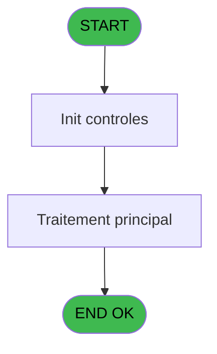
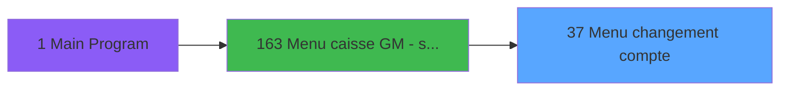
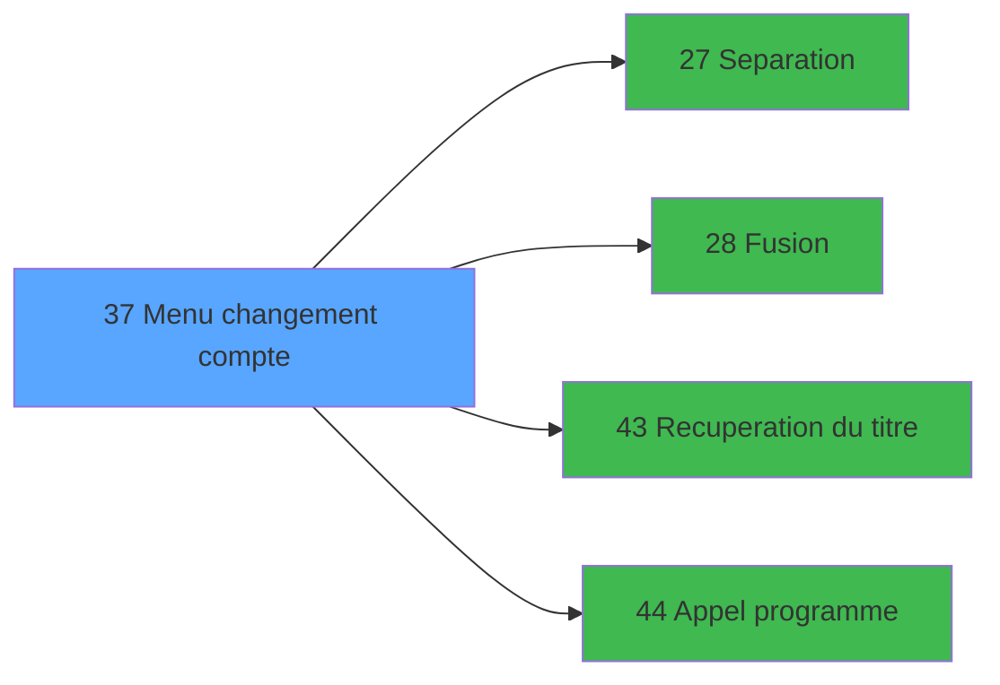

# ADH IDE 37 - Menu changement compte

> **Analyse**: Phases 1-4 2026-02-07 03:43 -> 01:31 (21h47min) | Assemblage 01:31
> **Pipeline**: V7.2 Enrichi
> **Structure**: 4 onglets (Resume | Ecrans | Donnees | Connexions)

<!-- TAB:Resume -->

## 1. FICHE D'IDENTITE

| Attribut | Valeur |
|----------|--------|
| Projet | ADH |
| IDE Position | 37 |
| Nom Programme | Menu changement compte |
| Fichier source | `Prg_37.xml` |
| Dossier IDE | Change |
| Taches | 1 (1 ecrans visibles) |
| Tables modifiees | 0 |
| Programmes appeles | 4 |
| Complexite | **BASSE** (score 5/100) |

## 2. DESCRIPTION FONCTIONNELLE

ADH IDE 37 est un **menu de navigation** pour les opérations de changement de compte. Le programme affiche deux options : "Séparation de comptes" (option 1) ou "Regroupement de comptes" (option 2). L'utilisateur sélectionne son choix dans le champ W0 choix action (variable J), puis le programme récupère d'abord le titre du compte via l'appel à ADH IDE 43, avant de router l'utilisateur vers le programme approprié (ADH IDE 27 pour la séparation ou ADH IDE 28 pour la fusion) en passant par le routeur central ADH IDE 44.

Ce programme est un **hub fonctionnel sans accès base de données**. Il reçoit 9 paramètres d'entrée en lecture seule (société, code GM, filiation, montant, garantie, solde, date limite, village, type compte) et les transmet aux programmes avals. La logique est minimaliste : afficher le menu, capturer le choix, valoriser les variables contextuelles (titre du compte), et déclencher l'action correspondante. Une validation basique empêche la séparation si la filiation est nulle (C<>0 & J='1'), garantissant que seuls les clients avec une filiation valide peuvent accéder à cette fonction.

ADH IDE 37 joue un **rôle architectural pivot** dans le flux de caisse : il est le point d'entrée unique pour les deux opérations sensibles de changement de compte. Son appel depuis le menu principal (ADH IDE 163) montre qu'il fait partie du chemin critique de gestion des adhérents. Les variables partagées VG111, VG112 et VG115 suggèrent une intégration avec des mécanismes de droits d'accès et de contexte utilisateur globaux.

## 3. BLOCS FONCTIONNELS

### 3.1 Calcul (1 tache)

Calculs metier : montants, stocks, compteurs.

---

#### 37 - OCA  Menu changement compte [[ECRAN]](#ecran-t1)

**Role** : Traitement : OCA  Menu changement compte.
**Ecran** : 858 x 179 DLU (MDI) | [Voir mockup](#ecran-t1)

## 5. REGLES METIER

5 regles identifiees:

### Autres (5 regles)

#### [RM-001] Condition: > filiation [C]<>0 AND W0 choix action [J] egale '1'

| Element | Detail |
|---------|--------|
| **Condition** | `> filiation [C]<>0 AND W0 choix action [J]='1'` |
| **Si vrai** | Action si vrai |
| **Variables** | EW (W0 choix action), EP (> filiation) |
| **Expression source** | Expression 5 : `> filiation [C]<>0 AND W0 choix action [J]='1'` |
| **Exemple** | Si > filiation [C]<>0 AND W0 choix action [J]='1' → Action si vrai |

#### [RM-002] Si Trim(VG115)<>'',Trim(VG115)&'|','')&IF(W0 choix action [J] vaut '1' alors 'SEPARATION DE COMPTE', sinon 'FUSION DE COMPTE'

| Element | Detail |
|---------|--------|
| **Condition** | `Trim(VG115)<>''` |
| **Si vrai** | Trim(VG115)&'/' |
| **Si faux** | '')&IF(W0 choix action [J]='1','SEPARATION DE COMPTE','FUSION DE COMPTE') |
| **Variables** | EW (W0 choix action) |
| **Expression source** | Expression 7 : `IF(Trim(VG115)<>'',Trim(VG115)&'|','')&IF(W0 choix action [J` |
| **Exemple** | Si Trim(VG115)<>'' → Trim(VG115)&'/' |

#### [RM-003] Condition: W0 choix action [J] egale '1'

| Element | Detail |
|---------|--------|
| **Condition** | `W0 choix action [J]='1'` |
| **Si vrai** | Action si vrai |
| **Variables** | EW (W0 choix action) |
| **Expression source** | Expression 8 : `W0 choix action [J]='1'` |
| **Exemple** | Si W0 choix action [J]='1' → Action si vrai |

#### [RM-004] Condition: W0 choix action [J] egale '2'

| Element | Detail |
|---------|--------|
| **Condition** | `W0 choix action [J]='2'` |
| **Si vrai** | Action si vrai |
| **Variables** | EW (W0 choix action) |
| **Expression source** | Expression 9 : `W0 choix action [J]='2'` |
| **Exemple** | Si W0 choix action [J]='2' → Action si vrai |

#### [RM-005] Condition: VG111 AND VG112 different de 0

| Element | Detail |
|---------|--------|
| **Condition** | `VG111 AND VG112<>0` |
| **Si vrai** | Action si vrai |
| **Expression source** | Expression 10 : `VG111 AND VG112<>0` |
| **Exemple** | Si VG111 AND VG112<>0 → Action si vrai |

## 6. CONTEXTE

- **Appele par**: [Menu caisse GM - scroll (IDE 163)](ADH-IDE-163.md)
- **Appelle**: 4 programmes | **Tables**: 0 (W:0 R:0 L:0) | **Taches**: 1 | **Expressions**: 10

<!-- TAB:Ecrans -->

## 8. ECRANS

### 8.1 Forms visibles (1 / 1)

| # | Position | Tache | Nom | Type | Largeur | Hauteur | Bloc |
|---|----------|-------|-----|------|---------|---------|------|
| 1 | 37 | 37 | OCA  Menu changement compte | MDI | 858 | 179 | Calcul |

### 8.2 Mockups Ecrans

---

#### 37 - OCA  Menu changement compte
**Tache** : [37](#t1) | **Type** : MDI | **Dimensions** : 858 x 179 DLU
**Bloc** : Calcul | **Titre IDE** : OCA  Menu changement compte

<!-- FORM-DATA:
{
    "width":  858,
    "vFactor":  8,
    "type":  "MDI",
    "hFactor":  8,
    "controls":  [
                     {
                         "x":  0,
                         "type":  "label",
                         "var":  "",
                         "y":  0,
                         "w":  856,
                         "fmt":  "",
                         "name":  "",
                         "h":  19,
                         "color":  "",
                         "text":  "",
                         "parent":  null
                     },
                     {
                         "x":  127,
                         "type":  "label",
                         "var":  "",
                         "y":  48,
                         "w":  602,
                         "fmt":  "",
                         "name":  "",
                         "h":  91,
                         "color":  "",
                         "text":  "",
                         "parent":  null
                     },
                     {
                         "x":  130,
                         "type":  "label",
                         "var":  "",
                         "y":  49,
                         "w":  597,
                         "fmt":  "",
                         "name":  "",
                         "h":  89,
                         "color":  "",
                         "text":  "",
                         "parent":  null
                     },
                     {
                         "x":  351,
                         "type":  "label",
                         "var":  "",
                         "y":  59,
                         "w":  336,
                         "fmt":  "",
                         "name":  "",
                         "h":  60,
                         "color":  "",
                         "text":  "",
                         "parent":  null
                     },
                     {
                         "x":  354,
                         "type":  "label",
                         "var":  "",
                         "y":  60,
                         "w":  53,
                         "fmt":  "",
                         "name":  "",
                         "h":  58,
                         "color":  "",
                         "text":  "",
                         "parent":  null
                     },
                     {
                         "x":  415,
                         "type":  "label",
                         "var":  "",
                         "y":  65,
                         "w":  229,
                         "fmt":  "",
                         "name":  "",
                         "h":  8,
                         "color":  "7",
                         "text":  "Séparation de comptes",
                         "parent":  null
                     },
                     {
                         "x":  415,
                         "type":  "label",
                         "var":  "",
                         "y":  92,
                         "w":  262,
                         "fmt":  "",
                         "name":  "",
                         "h":  8,
                         "color":  "7",
                         "text":  "Regroupement de comptes",
                         "parent":  null
                     },
                     {
                         "x":  431,
                         "type":  "label",
                         "var":  "",
                         "y":  124,
                         "w":  120,
                         "fmt":  "",
                         "name":  "",
                         "h":  9,
                         "color":  "",
                         "text":  "Votre choix",
                         "parent":  null
                     },
                     {
                         "x":  0,
                         "type":  "label",
                         "var":  "",
                         "y":  155,
                         "w":  856,
                         "fmt":  "",
                         "name":  "",
                         "h":  24,
                         "color":  "",
                         "text":  "",
                         "parent":  null
                     },
                     {
                         "x":  570,
                         "type":  "edit",
                         "var":  "",
                         "y":  124,
                         "w":  26,
                         "fmt":  "UA",
                         "name":  "W0 choix action",
                         "h":  10,
                         "color":  "6",
                         "text":  "",
                         "parent":  null
                     },
                     {
                         "x":  5,
                         "type":  "edit",
                         "var":  "",
                         "y":  4,
                         "w":  232,
                         "fmt":  "20",
                         "name":  "",
                         "h":  8,
                         "color":  "",
                         "text":  "",
                         "parent":  1
                     },
                     {
                         "x":  646,
                         "type":  "edit",
                         "var":  "",
                         "y":  6,
                         "w":  203,
                         "fmt":  "WWW DD MMM YYYYT",
                         "name":  "",
                         "h":  8,
                         "color":  "",
                         "text":  "",
                         "parent":  1
                     },
                     {
                         "x":  164,
                         "type":  "image",
                         "var":  "",
                         "y":  58,
                         "w":  144,
                         "fmt":  "",
                         "name":  "",
                         "h":  62,
                         "color":  "",
                         "text":  "",
                         "parent":  5
                     },
                     {
                         "x":  367,
                         "type":  "button",
                         "var":  "",
                         "y":  65,
                         "w":  26,
                         "fmt":  "1",
                         "name":  "1",
                         "h":  9,
                         "color":  "",
                         "text":  "",
                         "parent":  null
                     },
                     {
                         "x":  367,
                         "type":  "button",
                         "var":  "",
                         "y":  92,
                         "w":  26,
                         "fmt":  "2",
                         "name":  "2",
                         "h":  9,
                         "color":  "",
                         "text":  "",
                         "parent":  null
                     },
                     {
                         "x":  8,
                         "type":  "button",
                         "var":  "",
                         "y":  158,
                         "w":  152,
                         "fmt":  "\u0026Quitter",
                         "name":  "",
                         "h":  18,
                         "color":  "",
                         "text":  "",
                         "parent":  null
                     }
                 ],
    "taskId":  "37",
    "height":  179
}
-->

<strong>Champs : 3 champs</strong>

| Pos (x,y) | Nom | Variable | Type |
|-----------|-----|----------|------|
| 570,124 | W0 choix action | - | edit |
| 5,4 | 20 | - | edit |
| 646,6 | WWW DD MMM YYYYT | - | edit |

<strong>Boutons : 3 boutons</strong>

| Bouton | Pos (x,y) | Action |
|--------|-----------|--------|
| 1 | 367,65 | Bouton fonctionnel |
| 2 | 367,92 | Bouton fonctionnel |
| Quitter | 8,158 | Quitte le programme |

## 9. NAVIGATION

Ecran unique: **OCA  Menu changement compte**

### 9.3 Structure hierarchique (1 tache)

| Position | Tache | Type | Dimensions | Bloc |
|----------|-------|------|------------|------|
| **37.1** | [**OCA  Menu changement compte** (37)](#t1) [mockup](#ecran-t1) | MDI | 858x179 | Calcul |

### 9.4 Algorigramme

> **Legende**: Vert = START/END OK | Rouge = END KO | Bleu = Decisions
> *Algorigramme auto-genere. Utiliser `/algorigramme` pour une synthese metier detaillee.*

<!-- TAB:Donnees -->

## 10. TABLES

### Tables utilisees (0)

| ID | Nom | Description | Type | R | W | L | Usages |
|----|-----|-------------|------|---|---|---|--------|

### Colonnes par table (0 / 0 tables avec colonnes identifiees)

## 11. VARIABLES

### 11.1 Variables de session (1)

Variables persistantes pendant toute la session.

| Lettre | Nom | Type | Usage dans |
|--------|-----|------|-----------|
| EY | V. titre | Alpha | 1x session |

### 11.2 Variables de travail (1)

Variables internes au programme.

| Lettre | Nom | Type | Usage dans |
|--------|-----|------|-----------|
| EW | W0 choix action | Alpha | 4x calcul interne |

### 11.3 Autres (10)

Variables diverses.

| Lettre | Nom | Type | Usage dans |
|--------|-----|------|-----------|
| EN | > societe | Alpha | - |
| EO | > code GM | Numeric | - |
| EP | > filiation | Numeric | 1x refs |
| EQ | > masque montant | Alpha | - |
| ER | > garantie | Alpha | - |
| ES | > solde | Numeric | - |
| ET | > date limite solde | Date | - |
| EU | > nom village | Alpha | - |
| EV | > Uni/Bilateral | Alpha | - |
| EX | PROGRAM | Numeric | - |

## 12. EXPRESSIONS

**10 / 10 expressions decodees (100%)**

### 12.1 Repartition par type

| Type | Expressions | Regles |
|------|-------------|--------|
| CONDITION | 5 | 5 |
| CONSTANTE | 2 | 0 |
| DATE | 1 | 0 |
| REFERENCE_VG | 1 | 0 |
| STRING | 1 | 0 |

### 12.2 Expressions cles par type

#### CONDITION (5 expressions)

| Type | IDE | Expression | Regle |
|------|-----|------------|-------|
| CONDITION | 9 | `W0 choix action [J]='2'` | [RM-004](#rm-RM-004) |
| CONDITION | 10 | `VG111 AND VG112<>0` | [RM-005](#rm-RM-005) |
| CONDITION | 8 | `W0 choix action [J]='1'` | [RM-003](#rm-RM-003) |
| CONDITION | 5 | `> filiation [C]<>0 AND W0 choix action [J]='1'` | [RM-001](#rm-RM-001) |
| CONDITION | 7 | `IF(Trim(VG115)<>'',Trim(VG115)&'\|','')&IF(W0 choix action [J]='1','SEPARATION DE COMPTE','FUSION DE COMPTE')` | [RM-002](#rm-RM-002) |

#### CONSTANTE (2 expressions)

| Type | IDE | Expression | Regle |
|------|-----|------------|-------|
| CONSTANTE | 6 | `''` | - |
| CONSTANTE | 2 | `26` | - |

#### DATE (1 expressions)

| Type | IDE | Expression | Regle |
|------|-----|------------|-------|
| DATE | 3 | `Date ()` | - |

#### REFERENCE_VG (1 expressions)

| Type | IDE | Expression | Regle |
|------|-----|------------|-------|
| REFERENCE_VG | 4 | `VG2` | - |

#### STRING (1 expressions)

| Type | IDE | Expression | Regle |
|------|-----|------------|-------|
| STRING | 1 | `Trim (V. titre [L])` | - |

<!-- TAB:Connexions -->

## 13. GRAPHE D'APPELS

### 13.1 Chaine depuis Main (Callers)

Main -> ... -> [Menu caisse GM - scroll (IDE 163)](ADH-IDE-163.md) -> **Menu changement compte (IDE 37)**

### 13.2 Callers

| IDE | Nom Programme | Nb Appels |
|-----|---------------|-----------|
| [163](ADH-IDE-163.md) | Menu caisse GM - scroll | 1 |

### 13.3 Callees (programmes appeles)

### 13.4 Detail Callees avec contexte

| IDE | Nom Programme | Appels | Contexte |
|-----|---------------|--------|----------|
| [27](ADH-IDE-27.md) | Separation | 1 | Sous-programme |
| [28](ADH-IDE-28.md) | Fusion | 1 | Sous-programme |
| [43](ADH-IDE-43.md) | Recuperation du titre | 1 | Recuperation donnees |
| [44](ADH-IDE-44.md) | Appel programme | 1 | Sous-programme |

## 14. RECOMMANDATIONS MIGRATION

### 14.1 Profil du programme

| Metrique | Valeur | Impact migration |
|----------|--------|-----------------|
| Lignes de logique | 32 | Programme compact |
| Expressions | 10 | Peu de logique |
| Tables WRITE | 0 | Impact faible |
| Sous-programmes | 4 | Peu de dependances |
| Ecrans visibles | 1 | Ecran unique ou traitement batch |
| Code desactive | 0% (0 / 32) | Code sain |
| Regles metier | 5 | Quelques regles a preserver |

### 14.2 Plan de migration par bloc

#### Calcul (1 tache: 1 ecran, 0 traitement)

- **Strategie** : Services de calcul purs (Domain Services).
- Migrer la logique de calcul (stock, compteurs, montants)

### 14.3 Dependances critiques

| Dependance | Type | Appels | Impact |
|------------|------|--------|--------|
| [Recuperation du titre (IDE 43)](ADH-IDE-43.md) | Sous-programme | 1x | Normale - Recuperation donnees |
| [Appel programme (IDE 44)](ADH-IDE-44.md) | Sous-programme | 1x | Normale - Sous-programme |
| [Separation (IDE 27)](ADH-IDE-27.md) | Sous-programme | 1x | Normale - Sous-programme |
| [Fusion (IDE 28)](ADH-IDE-28.md) | Sous-programme | 1x | Normale - Sous-programme |

---
*Spec DETAILED generee par Pipeline V7.2 - 2026-02-08 01:33*
