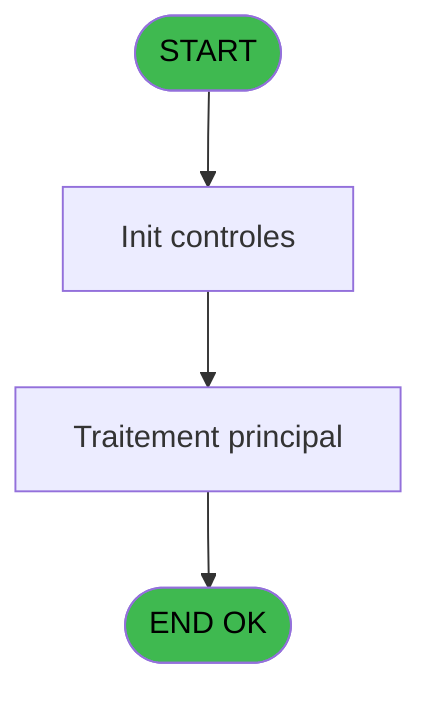

# ADH IDE 39 - Print extrait ObjDevSce

> **Analyse**: Phases 1-4 2026-02-08 01:35 -> 01:35 (4s) | Assemblage 01:35
> **Pipeline**: V7.2 Enrichi
> **Structure**: 4 onglets (Resume | Ecrans | Donnees | Connexions)

<!-- TAB:Resume -->

## 1. FICHE D'IDENTITE

| Attribut | Valeur |
|----------|--------|
| Projet | ADH |
| IDE Position | 39 |
| Nom Programme | Print extrait ObjDevSce |
| Fichier source | `Prg_39.xml` |
| Dossier IDE | Comptabilite |
| Taches | 42 (0 ecrans visibles) |
| Tables modifiees | 0 |
| Programmes appeles | 1 |
| Complexite | **BASSE** (score 25/100) |

## 2. DESCRIPTION FONCTIONNELLE

ADH IDE 39 - **Print extrait ObjDevSce** génère une édition papier d'un extrait de compte pour un dépôt objet. Le programme est appelé depuis l'écran de gestion des comptes de dépôt (ADH IDE 40) et prépare les données pour impression. Il s'agit d'un programme de présentation qui formate les informations du dépôt (référence, dates, montants, observations) en un document imprimable.

Le flux principal initialise l'imprimante via le contrôle du printer Magic, puis récupère les détails du dépôt courant avec toutes ses lignes de mouvements. Les données sont structurées dans un tableau d'édition (report) avec colonnes personnalisées (date, description, montant, reste). Avant l'impression, le programme appelle **Raz Current Printer (ADH IDE 182)** pour finaliser la configuration de l'imprimante et préparer le rendu final.

Le programme s'inscrit dans le flux plus large de gestion des dépôts objets du module Caisse, aux côtés des programmes de consultation (IDE 40 List), création (IDE 41 New), et modification (IDE 42 Edit). C'est un point de sortie papier essentiel pour la traçabilité comptable des dépôts.

## 3. BLOCS FONCTIONNELS

## 5. REGLES METIER

5 regles identifiees:

### Autres (5 regles)

#### [RM-001] Verification que l'imprimante courante est la n1

| Element | Detail |
|---------|--------|
| **Condition** | `GetParam ('CURRENTPRINTERNUM')=1` |
| **Si vrai** | Action si CURRENTPRINTERNUM = 1 |
| **Expression source** | Expression 3 : `GetParam ('CURRENTPRINTERNUM')=1` |
| **Exemple** | Si GetParam ('CURRENTPRINTERNUM')=1 → Action si CURRENTPRINTERNUM = 1 |

#### [RM-002] Verification que l'imprimante courante est la n4

| Element | Detail |
|---------|--------|
| **Condition** | `GetParam ('CURRENTPRINTERNUM')=4` |
| **Si vrai** | Action si CURRENTPRINTERNUM = 4 |
| **Expression source** | Expression 4 : `GetParam ('CURRENTPRINTERNUM')=4` |
| **Exemple** | Si GetParam ('CURRENTPRINTERNUM')=4 → Action si CURRENTPRINTERNUM = 4 |

#### [RM-003] Verification que l'imprimante courante est la n5

| Element | Detail |
|---------|--------|
| **Condition** | `GetParam ('CURRENTPRINTERNUM')=5` |
| **Si vrai** | Action si CURRENTPRINTERNUM = 5 |
| **Expression source** | Expression 5 : `GetParam ('CURRENTPRINTERNUM')=5` |
| **Exemple** | Si GetParam ('CURRENTPRINTERNUM')=5 → Action si CURRENTPRINTERNUM = 5 |

#### [RM-004] Verification que l'imprimante courante est la n8

| Element | Detail |
|---------|--------|
| **Condition** | `GetParam ('CURRENTPRINTERNUM')=8` |
| **Si vrai** | Action si CURRENTPRINTERNUM = 8 |
| **Expression source** | Expression 6 : `GetParam ('CURRENTPRINTERNUM')=8` |
| **Exemple** | Si GetParam ('CURRENTPRINTERNUM')=8 → Action si CURRENTPRINTERNUM = 8 |

#### [RM-005] Verification que l'imprimante courante est la n9

| Element | Detail |
|---------|--------|
| **Condition** | `GetParam ('CURRENTPRINTERNUM')=9` |
| **Si vrai** | Action si CURRENTPRINTERNUM = 9 |
| **Expression source** | Expression 7 : `GetParam ('CURRENTPRINTERNUM')=9` |
| **Exemple** | Si GetParam ('CURRENTPRINTERNUM')=9 → Action si CURRENTPRINTERNUM = 9 |

## 6. CONTEXTE

- **Appele par**: [Comptes de depôt (IDE 40)](ADH-IDE-40.md)
- **Appelle**: 1 programmes | **Tables**: 7 (W:0 R:4 L:3) | **Taches**: 42 | **Expressions**: 8

<!-- TAB:Ecrans -->

## 8. ECRANS

*(Programme sans ecran visible)*

## 9. NAVIGATION

### 9.3 Structure hierarchique (0 tache)

| Position | Tache | Type | Dimensions | Bloc |
|----------|-------|------|------------|------|

### 9.4 Algorigramme

> **Legende**: Vert = START/END OK | Rouge = END KO | Bleu = Decisions
> *Algorigramme auto-genere. Utiliser `/algorigramme` pour une synthese metier detaillee.*

<!-- TAB:Donnees -->

## 10. TABLES

### Tables utilisees (7)

| ID | Nom | Description | Type | R | W | L | Usages |
|----|-----|-------------|------|---|---|---|--------|
| 42 | depot_devises____dda | Depots et garanties | DB | R |   |   | 8 |
| 456 | tai_demarrage |  | DB | R |   |   | 8 |
| 41 | depot_objets_____doa | Depots et garanties | DB | R |   |   | 8 |
| 30 | gm-recherche_____gmr | Index de recherche | DB | R |   |   | 1 |
| 43 | solde_devises____sda | Devises / taux de change | DB |   |   | L | 7 |
| 31 | gm-complet_______gmc |  | DB |   |   | L | 1 |
| 34 | hebergement______heb | Hebergement (chambres) | DB |   |   | L | 1 |

### Colonnes par table (3 / 4 tables avec colonnes identifiees)

Table 42 - depot_devises____dda (R) - 8 usages

| Lettre | Variable | Acces | Type |
|--------|----------|-------|------|
| A | W1 config imp | R | Alpha |
| B | W1 date listing | R | Date |
| C | W1 heure listing | R | Time |
| D | W1 nom | R | Alpha |
| E | W1 prenom | R | Alpha |
| F | W1 Total depot | R | Numeric |
| G | W1 Total retrait | R | Numeric |
| H | W1 selection feuille | R | Alpha |
| I | W1 selection rouleau | R | Alpha |
| J | W1 date listing | R | Date |
| K | W1 heure listing | R | Time |
| L | W1 nom | R | Alpha |
| M | W1 prenom | R | Alpha |
| N | W1 n° adherent | R | Numeric |
| O | W1 lettre contrôle | R | Alpha |
| P | W1 filiation | R | Numeric |
| Q | W1 cumul depôt | R | Numeric |
| R | W1 cumul retrait | R | Numeric |

Table 456 - tai_demarrage (R) - 8 usages

| Lettre | Variable | Acces | Type |
|--------|----------|-------|------|
| A | W1 config imp | R | Alpha |
| B | W1 date listing | R | Date |
| C | W1 heure listing | R | Time |
| D | W1 nom | R | Alpha |
| E | W1 prenom | R | Alpha |
| F | W1 inhibe panel | R | Alpha |
| G | W1 massicot | R | Alpha |
| H | W1 selection feuille | R | Alpha |
| I | W1 selection rouleau | R | Alpha |
| J | W1 date listing | R | Date |
| K | W1 heure listing | R | Time |
| L | W1 nom | R | Alpha |
| M | W1 prenom | R | Alpha |
| N | W1 n° adherent | R | Numeric |
| O | W1 lettre contrôle | R | Alpha |
| P | W1 filiation | R | Numeric |
| Q | W1 cumul depôt | R | Numeric |
| R | W1 cumul retrait | R | Numeric |

Table 41 - depot_objets_____doa (R) - 8 usages

| Lettre | Variable | Acces | Type |
|--------|----------|-------|------|
| A | W1 config imp | R | Alpha |
| B | W1 date listing | R | Date |
| C | W1 heure listing | R | Time |
| D | W1 nom | R | Alpha |
| E | W1 prenom | R | Alpha |
| F | W1 inhibe panel | R | Alpha |
| G | W1 massicot | R | Alpha |
| H | W1 selection feuille | R | Alpha |
| I | W1 selection rouleau | R | Alpha |
| J | W1 date listing | R | Date |
| K | W1 heure listing | R | Time |
| L | W1 nom | R | Alpha |
| M | W1 prenom | R | Alpha |
| N | W1 n° adherent | R | Numeric |
| O | W1 lettre contrôle | R | Alpha |
| P | W1 filiation | R | Numeric |

Table 30 - gm-recherche_____gmr (R) - 1 usages

*Table utilisee uniquement en Link ou aucune colonne Real identifiee dans le DataView.*

## 11. VARIABLES

### 11.1 Parametres entrants (5)

Variables recues du programme appelant ([Comptes de depôt (IDE 40)](ADH-IDE-40.md)).

| Lettre | Nom | Type | Usage dans |
|--------|-----|------|-----------|
| EN | P0 societe | Alpha | - |
| EO | P0 code adherent | Numeric | - |
| EP | P0 filiation | Numeric | - |
| EQ | P0 nom village | Alpha | - |
| ER | PO Retour devise | Numeric | - |

### 11.2 Variables de travail (12)

Variables internes au programme.

| Lettre | Nom | Type | Usage dans |
|--------|-----|------|-----------|
| ES | W0 fin tâche | Alpha | - |
| ET | W0 existe objet | Logical | - |
| EU | W0 existe devise | Logical | - |
| EV | W0 existe scelle | Logical | - |
| EW | W0 Nom | Alpha | - |
| EX | W0 Prénom | Alpha | - |
| EY | W0 Titre | Alpha | - |
| EZ | W0 Num Adherent | Numeric | - |
| FA | W0 Lettre Controle | Alpha | - |
| FB | W0 Filiation Club | Numeric | - |
| FC | W0 Langue Parlée | Alpha | - |
| FD | W0 Chambre | Alpha | - |

### 11.3 Autres (1)

Variables diverses.

| Lettre | Nom | Type | Usage dans |
|--------|-----|------|-----------|
| FE | W1 cumul retrait | Numeric | - |

Toutes les 18 variables (liste complete)

| Cat | Lettre | Nom Variable | Type |
|-----|--------|--------------|------|
| P0 | **EN** | P0 societe | Alpha |
| P0 | **EO** | P0 code adherent | Numeric |
| P0 | **EP** | P0 filiation | Numeric |
| P0 | **EQ** | P0 nom village | Alpha |
| P0 | **ER** | PO Retour devise | Numeric |
| W0 | **ES** | W0 fin tâche | Alpha |
| W0 | **ET** | W0 existe objet | Logical |
| W0 | **EU** | W0 existe devise | Logical |
| W0 | **EV** | W0 existe scelle | Logical |
| W0 | **EW** | W0 Nom | Alpha |
| W0 | **EX** | W0 Prénom | Alpha |
| W0 | **EY** | W0 Titre | Alpha |
| W0 | **EZ** | W0 Num Adherent | Numeric |
| W0 | **FA** | W0 Lettre Controle | Alpha |
| W0 | **FB** | W0 Filiation Club | Numeric |
| W0 | **FC** | W0 Langue Parlée | Alpha |
| W0 | **FD** | W0 Chambre | Alpha |
| Autre | **FE** | W1 cumul retrait | Numeric |

## 12. EXPRESSIONS

**8 / 8 expressions decodees (100%)**

### 12.1 Repartition par type

| Type | Expressions | Regles |
|------|-------------|--------|
| CONDITION | 5 | 5 |
| OTHER | 2 | 0 |
| CAST_LOGIQUE | 1 | 0 |

### 12.2 Expressions cles par type

#### CONDITION (5 expressions)

| Type | IDE | Expression | Regle |
|------|-----|------------|-------|
| CONDITION | 6 | `GetParam ('CURRENTPRINTERNUM')=8` | [RM-004](#rm-RM-004) |
| CONDITION | 7 | `GetParam ('CURRENTPRINTERNUM')=9` | [RM-005](#rm-RM-005) |
| CONDITION | 5 | `GetParam ('CURRENTPRINTERNUM')=5` | [RM-003](#rm-RM-003) |
| CONDITION | 3 | `GetParam ('CURRENTPRINTERNUM')=1` | [RM-001](#rm-RM-001) |
| CONDITION | 4 | `GetParam ('CURRENTPRINTERNUM')=4` | [RM-002](#rm-RM-002) |

#### OTHER (2 expressions)

| Type | IDE | Expression | Regle |
|------|-----|------------|-------|
| OTHER | 2 | `SetCrsr (1)` | - |
| OTHER | 1 | `SetCrsr (2)` | - |

#### CAST_LOGIQUE (1 expressions)

| Type | IDE | Expression | Regle |
|------|-----|------------|-------|
| CAST_LOGIQUE | 8 | `'TRUE'LOG` | - |

<!-- TAB:Connexions -->

## 13. GRAPHE D'APPELS

### 13.1 Chaine depuis Main (Callers)

Main -> ... -> [Comptes de depôt (IDE 40)](ADH-IDE-40.md) -> **Print extrait ObjDevSce (IDE 39)**

### 13.2 Callers

| IDE | Nom Programme | Nb Appels |
|-----|---------------|-----------|
| [40](ADH-IDE-40.md) | Comptes de depôt | 1 |

### 13.3 Callees (programmes appeles)

### 13.4 Detail Callees avec contexte

| IDE | Nom Programme | Appels | Contexte |
|-----|---------------|--------|----------|
| [182](ADH-IDE-182.md) | Raz Current Printer | 1 | Impression ticket/document |

## 14. RECOMMANDATIONS MIGRATION

### 14.1 Profil du programme

| Metrique | Valeur | Impact migration |
|----------|--------|-----------------|
| Lignes de logique | 796 | Programme volumineux |
| Expressions | 8 | Peu de logique |
| Tables WRITE | 0 | Impact faible |
| Sous-programmes | 1 | Peu de dependances |
| Ecrans visibles | 0 | Ecran unique ou traitement batch |
| Code desactive | 0% (0 / 796) | Code sain |
| Regles metier | 5 | Quelques regles a preserver |

### 14.2 Plan de migration par bloc

### 14.3 Dependances critiques

| Dependance | Type | Appels | Impact |
|------------|------|--------|--------|
| [Raz Current Printer (IDE 182)](ADH-IDE-182.md) | Sous-programme | 1x | Normale - Impression ticket/document |

---
*Spec DETAILED generee par Pipeline V7.2 - 2026-02-08 01:36*
