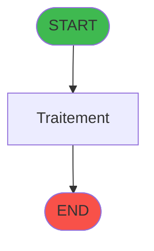
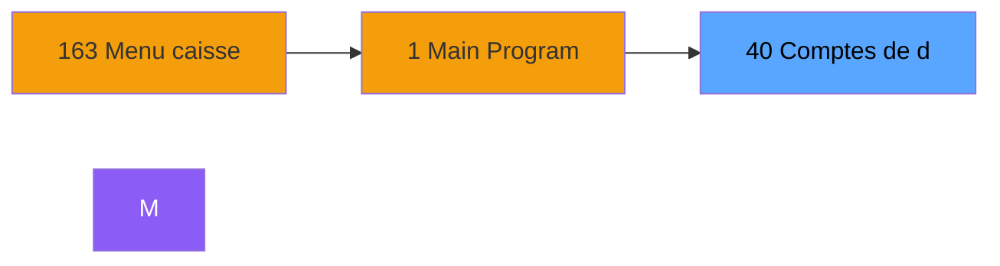
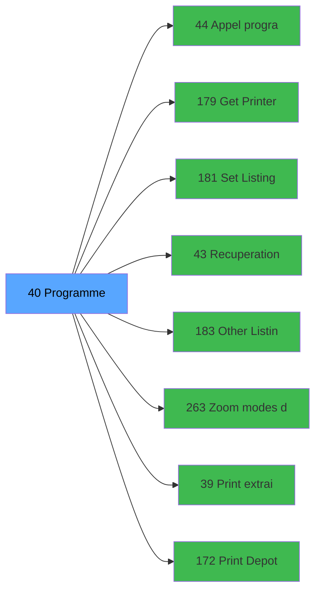

# ADH IDE 40 - Comptes de depôt

> **Version spec**: 3.5
> **Analyse**: 2026-01-27 17:56
> **Source**: `Prg_XXX.xml`

---

<!-- TAB:Fonctionnel -->

## SPECIFICATION FONCTIONNELLE

### 1.1 Objectif metier

| Element | Description |
|---------|-------------|
| **Qui** | Operateur |
| **Quoi** | Comptes de depôt
 |
| **Pourquoi** | A documenter |
| **Declencheur** | A identifier |

### 1.2 Regles metier

| Code | Regle | Condition |
|------|-------|-----------|
| RM-001 | A documenter | - |

### 1.3 Flux utilisateur

1. Demarrage programme
2. Traitement principal
3. Fin programme

### 1.4 Cas d'erreur

| Erreur | Comportement |
|--------|--------------|
| - | A documenter |

---

<!-- TAB:Technique -->

## SPECIFICATION TECHNIQUE

### 2.1 Identification

| Attribut | Valeur |
|----------|--------|
| **Format IDE** | ADH IDE 40 |
| **Description** | Comptes de depôt
 |
| **Module** | ADH |

### 2.2 Tables

| # | Nom logique | Nom physique | Acces | Usage |
|---|-------------|--------------|-------|-------|
| 41 | depot_objets_____doa | `cafil019_dat` | **W** | 5x |
| 42 | depot_devises____dda | `cafil020_dat` | **W** | 2x |
| 43 | solde_devises____sda | `cafil021_dat` | **W** | 4x |
| 47 | compte_gm________cgm | `cafil025_dat` | **W** | 2x |
| 50 | moyens_reglement_mor | `cafil028_dat` | R | 1x |
| 67 | tables___________tab | `cafil045_dat` | L | 1x |
| 367 | pms_print_param_default | `pmsprintparamdefault` | **W** | 1x |
| 456 | tai_demarrage | `taistart` | R | 1x |
| 456 | tai_demarrage | `taistart` | **W** | 2x |
### 2.3 Parametres d'entree

| Variable | Nom | Type | Picture |
|----------|-----|------|---------|
| - | Aucun parametre | - | - |
### 2.4 Algorigramme

### 2.5 Expressions cles

| IDE | Expression | Commentaire |
|-----|------------|-------------|
| 1 | `{0,9}<>'R'` | - |
| 2 | `'F'` | - |
| 3 | `{0,10}='F'` | - |
| 4 | `'C'` | - |
| 5 | `{0,1}=''` | - |

> **Total**: 5 expressions (affichees: 5)
### 2.6 Variables importantes

### 2.7 Statistiques

| Metrique | Valeur |
|----------|--------|
| **Taches** | 25 |
| **Lignes logique** | 480 |
| **Lignes desactivees** | 0 |
---

<!-- TAB:Cartographie -->

## CARTOGRAPHIE APPLICATIVE

### 3.1 Chaine d'appels depuis Main

### 3.2 Callers directs

| IDE | Programme | Nb appels |
|-----|-----------|-----------|
| 163 | Menu caisse GM - scroll | 1 |
### 3.3 Callees

| Niv | IDE | Programme | Nb appels |
|-----|-----|-----------|-----------|
| 1 | 44 | Appel programme | 3 |
| 1 | 179 | Get Printer | 3 |
| 1 | 181 | Set Listing Number | 3 |
| 1 | 43 | Recuperation du titre | 2 |
| 1 | 183 | Other Listing | 2 |
| 1 | 263 | Zoom modes de paiement | 2 |
| 1 | 39 | Print extrait ObjDevSce | 1 |
| 1 | 172 | Print Depot Obj/Dev/Sce | 1 |
| 1 | 180 | Printer choice | 1 |
| 1 | 182 | Raz Current Printer | 1 |
| 1 | 262 | Zoom  des types d'objets | 1 |
| 1 | 266 | Zoom des all devises | 1 |
### 3.4 Verification orphelin

| Critere | Resultat |
|---------|----------|
| Callers actifs | A verifier |
| **Conclusion** | A analyser |

---

## HISTORIQUE

| Date | Action | Auteur |
|------|--------|--------|
| 2026-01-27 20:18 | **DATA V2** - Tables reelles, Expressions, Stats, CallChain | Script |
| 2026-01-27 19:44 | **DATA POPULATED** - Tables, Callgraph (5 expr) | Script |
| 2026-01-27 17:56 | **Upgrade V3.5** - TAB markers, Mermaid | Claude |

---

*Specification V3.5 - Format avec TAB markers et Mermaid*
