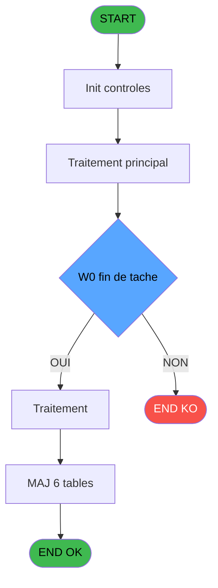
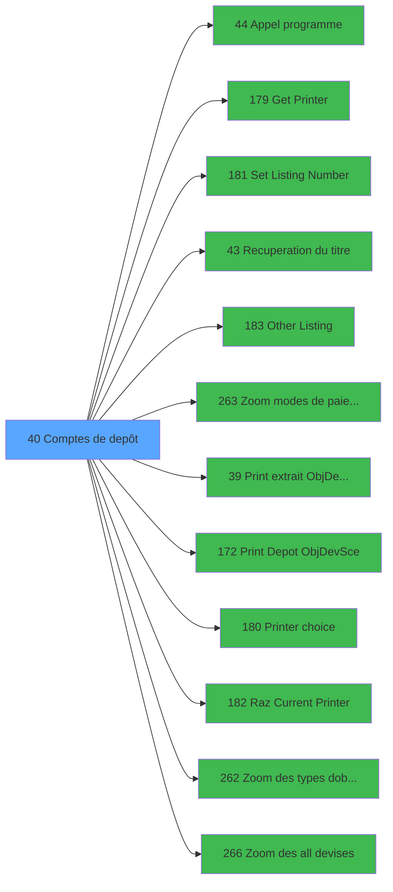

# ADH IDE 40 - Comptes de depôt

> **Analyse**: Phases 1-4 2026-02-08 01:36 -> 01:36 (4s) | Assemblage 01:36
> **Pipeline**: V7.2 Enrichi
> **Structure**: 4 onglets (Resume | Ecrans | Donnees | Connexions)

<!-- TAB:Resume -->

## 1. FICHE D'IDENTITE

| Attribut | Valeur |
|----------|--------|
| Projet | ADH |
| IDE Position | 40 |
| Nom Programme | Comptes de depôt |
| Fichier source | `Prg_40.xml` |
| Dossier IDE | Comptabilite |
| Taches | 25 (0 ecrans visibles) |
| Tables modifiees | 6 |
| Programmes appeles | 12 |
| Complexite | **MOYENNE** (score 48/100) |

## 2. DESCRIPTION FONCTIONNELLE

ADH IDE 40 gère les dépôts de garanties liés aux comptes clients, permettant de visualiser et modifier les objets et devises en dépôt. Le programme offre une interface pour consulter les dépôts existants, ajouter ou retirer des objets (bijoux, documents, etc.) et gérer les soldes en différentes devises. Les données sont stockées dans trois tables principales : `depot_objets` (inventaire des objets déposés), `depot_devises` (montants en devises), et `solde_devises` (soldes disponibles).

L'interface de saisie utilise un zoom sur les modes de paiement et types d'objets pour faciliter la navigation. Le programme communique avec plusieurs utilitaires d'impression via les programmes "Get Printer", "Set Listing Number" et "Raz Printer" pour permettre à l'utilisateur de choisir son imprimante et personnaliser les paramètres d'édition avant impression.

Les tâches clés incluent la récupération du titre du compte (via IDE 43), l'édition des extraits de dépôts (IDE 39, 172), et la gestion des sélections d'impression via un menu dédié (IDE 180-183). Le programme valide les mouvements de dépôt avant écriture en base et synchronise les soldes entre les tables `compte_gm` et `solde_devises`.

## 3. BLOCS FONCTIONNELS

## 5. REGLES METIER

3 regles identifiees:

### Autres (3 regles)

#### [RM-001] Condition: W0 reseau [I] different de 'R'

| Element | Detail |
|---------|--------|
| **Condition** | `W0 reseau [I]<>'R'` |
| **Si vrai** | Action si vrai |
| **Variables** | EV (W0 reseau) |
| **Expression source** | Expression 1 : `W0 reseau [I]<>'R'` |
| **Exemple** | Si W0 reseau [I]<>'R' → Action si vrai |

#### [RM-002] Condition: W0 fin de tache [J] egale 'F'

| Element | Detail |
|---------|--------|
| **Condition** | `W0 fin de tache [J]='F'` |
| **Si vrai** | Action si vrai |
| **Variables** | EW (W0 fin de tache) |
| **Expression source** | Expression 3 : `W0 fin de tache [J]='F'` |
| **Exemple** | Si W0 fin de tache [J]='F' → Action si vrai |

#### [RM-003] Condition: > societe [A] egale

| Element | Detail |
|---------|--------|
| **Condition** | `> societe [A]=''` |
| **Si vrai** | Action si vrai |
| **Variables** | EN (> societe) |
| **Expression source** | Expression 5 : `> societe [A]=''` |
| **Exemple** | Si > societe [A]='' → Action si vrai |

## 6. CONTEXTE

- **Appele par**: [Menu caisse GM - scroll (IDE 163)](ADH-IDE-163.md)
- **Appelle**: 12 programmes | **Tables**: 8 (W:6 R:2 L:1) | **Taches**: 25 | **Expressions**: 5

<!-- TAB:Ecrans -->

## 8. ECRANS

*(Programme sans ecran visible)*

## 9. NAVIGATION

### 9.3 Structure hierarchique (0 tache)

| Position | Tache | Type | Dimensions | Bloc |
|----------|-------|------|------------|------|

### 9.4 Algorigramme

> **Legende**: Vert = START/END OK | Rouge = END KO | Bleu = Decisions
> *Algorigramme auto-genere. Utiliser `/algorigramme` pour une synthese metier detaillee.*

<!-- TAB:Donnees -->

## 10. TABLES

### Tables utilisees (8)

| ID | Nom | Description | Type | R | W | L | Usages |
|----|-----|-------------|------|---|---|---|--------|
| 456 | tai_demarrage |  | DB | R | **W** |   | 3 |
| 41 | depot_objets_____doa | Depots et garanties | DB |   | **W** |   | 5 |
| 43 | solde_devises____sda | Devises / taux de change | DB |   | **W** |   | 4 |
| 47 | compte_gm________cgm | Comptes GM (generaux) | DB |   | **W** |   | 2 |
| 42 | depot_devises____dda | Depots et garanties | DB |   | **W** |   | 2 |
| 367 | pms_print_param_default |  | DB |   | **W** |   | 1 |
| 50 | moyens_reglement_mor | Reglements / paiements | DB | R |   |   | 1 |
| 67 | tables___________tab |  | DB |   |   | L | 1 |

### Colonnes par table (4 / 7 tables avec colonnes identifiees)

Table 456 - tai_demarrage (R/**W**) - 3 usages

*Table utilisee uniquement en Link ou aucune colonne Real identifiee dans le DataView.*

Table 41 - depot_objets_____doa (**W**) - 5 usages

| Lettre | Variable | Acces | Type |
|--------|----------|-------|------|
| A | W2 Description depot | W | Alpha |
| B | W2 choix action | W | Alpha |
| C | W2 confirm-retrait | W | Logical |
| D | W2 fin-tâche | W | Alpha |

Table 43 - solde_devises____sda (**W**) - 4 usages

| Lettre | Variable | Acces | Type |
|--------|----------|-------|------|
| A | W2 action | W | Alpha |
| B | W2 fin-tâche | W | Alpha |

Table 47 - compte_gm________cgm (**W**) - 2 usages

*Table utilisee uniquement en Link ou aucune colonne Real identifiee dans le DataView.*

Table 42 - depot_devises____dda (**W**) - 2 usages

| Lettre | Variable | Acces | Type |
|--------|----------|-------|------|
| EN | W2 Description depot | W | Alpha |

Table 367 - pms_print_param_default (**W**) - 1 usages

*Table utilisee uniquement en Link ou aucune colonne Real identifiee dans le DataView.*

Table 50 - moyens_reglement_mor (R) - 1 usages

| Lettre | Variable | Acces | Type |
|--------|----------|-------|------|
| A | W2 devise | R | Alpha |
| B | W2 mode de paiement | R | Alpha |
| C | W2 quantite | R | Numeric |
| D | W2 validation devise | R | Alpha |
| E | W2 test-lien-MRE uni | R | Numeric |
| F | W2 test-lien-DEV | R | Numeric |
| G | Btn valider | R | Alpha |

## 11. VARIABLES

### 11.1 Variables de session (1)

Variables persistantes pendant toute la session.

| Lettre | Nom | Type | Usage dans |
|--------|-----|------|-----------|
| FE | v. titre | Alpha | - |

### 11.2 Variables de travail (2)

Variables internes au programme.

| Lettre | Nom | Type | Usage dans |
|--------|-----|------|-----------|
| EV | W0 reseau | Alpha | 1x calcul interne |
| EW | W0 fin de tache | Alpha | 1x calcul interne |

### 11.3 Autres (17)

Variables diverses.

| Lettre | Nom | Type | Usage dans |
|--------|-----|------|-----------|
| EN | > societe | Alpha | 1x refs |
| EO | > code adherent | Numeric | - |
| EP | > filiation | Numeric | - |
| EQ | > devise locale | Alpha | - |
| ER | > nb decimale | Numeric | - |
| ES | > masque montant | Alpha | - |
| ET | > nom village | Alpha | - |
| EU | > change uni/bi ? | Alpha | - |
| EX | W1 devise | Alpha | - |
| EY | W1 mode paiement | Alpha | - |
| EZ | W1 quantite devise | Numeric | - |
| FA | PW1 date session | Date | - |
| FB | PW1 heure session | Time | - |
| FC | PW1 user | Alpha | - |
| FD | bouton quitter | Alpha | - |
| FF | W1 code scelle | Unicode | - |
| FG | W1 Scelle retire | Logical | - |

Toutes les 20 variables (liste complete)

| Cat | Lettre | Nom Variable | Type |
|-----|--------|--------------|------|
| W0 | **EV** | W0 reseau | Alpha |
| W0 | **EW** | W0 fin de tache | Alpha |
| V. | **FE** | v. titre | Alpha |
| Autre | **EN** | > societe | Alpha |
| Autre | **EO** | > code adherent | Numeric |
| Autre | **EP** | > filiation | Numeric |
| Autre | **EQ** | > devise locale | Alpha |
| Autre | **ER** | > nb decimale | Numeric |
| Autre | **ES** | > masque montant | Alpha |
| Autre | **ET** | > nom village | Alpha |
| Autre | **EU** | > change uni/bi ? | Alpha |
| Autre | **EX** | W1 devise | Alpha |
| Autre | **EY** | W1 mode paiement | Alpha |
| Autre | **EZ** | W1 quantite devise | Numeric |
| Autre | **FA** | PW1 date session | Date |
| Autre | **FB** | PW1 heure session | Time |
| Autre | **FC** | PW1 user | Alpha |
| Autre | **FD** | bouton quitter | Alpha |
| Autre | **FF** | W1 code scelle | Unicode |
| Autre | **FG** | W1 Scelle retire | Logical |

## 12. EXPRESSIONS

**5 / 5 expressions decodees (100%)**

### 12.1 Repartition par type

| Type | Expressions | Regles |
|------|-------------|--------|
| CONDITION | 3 | 3 |
| CONSTANTE | 2 | 0 |

### 12.2 Expressions cles par type

#### CONDITION (3 expressions)

| Type | IDE | Expression | Regle |
|------|-----|------------|-------|
| CONDITION | 5 | `> societe [A]=''` | [RM-003](#rm-RM-003) |
| CONDITION | 3 | `W0 fin de tache [J]='F'` | [RM-002](#rm-RM-002) |
| CONDITION | 1 | `W0 reseau [I]<>'R'` | [RM-001](#rm-RM-001) |

#### CONSTANTE (2 expressions)

| Type | IDE | Expression | Regle |
|------|-----|------------|-------|
| CONSTANTE | 4 | `'C'` | - |
| CONSTANTE | 2 | `'F'` | - |

<!-- TAB:Connexions -->

## 13. GRAPHE D'APPELS

### 13.1 Chaine depuis Main (Callers)

Main -> ... -> [Menu caisse GM - scroll (IDE 163)](ADH-IDE-163.md) -> **Comptes de depôt (IDE 40)**

### 13.2 Callers

| IDE | Nom Programme | Nb Appels |
|-----|---------------|-----------|
| [163](ADH-IDE-163.md) | Menu caisse GM - scroll | 1 |

### 13.3 Callees (programmes appeles)

### 13.4 Detail Callees avec contexte

| IDE | Nom Programme | Appels | Contexte |
|-----|---------------|--------|----------|
| [44](ADH-IDE-44.md) | Appel programme | 3 | Sous-programme |
| [179](ADH-IDE-179.md) | Get Printer | 3 | Impression ticket/document |
| [181](ADH-IDE-181.md) | Set Listing Number | 3 | Configuration impression |
| [43](ADH-IDE-43.md) | Recuperation du titre | 2 | Recuperation donnees |
| [183](ADH-IDE-183.md) | Other Listing | 2 | Configuration impression |
| [263](ADH-IDE-263.md) | Zoom modes de paiement | 2 | Selection/consultation |
| [39](ADH-IDE-39.md) | Print extrait ObjDevSce | 1 | Impression ticket/document |
| [172](ADH-IDE-172.md) | Print Depot Obj/Dev/Sce | 1 | Impression ticket/document |
| [180](ADH-IDE-180.md) | Printer choice | 1 | Impression ticket/document |
| [182](ADH-IDE-182.md) | Raz Current Printer | 1 | Impression ticket/document |
| [262](ADH-IDE-262.md) | Zoom  des types d'objets | 1 | Selection/consultation |
| [266](ADH-IDE-266.md) | Zoom des all devises | 1 | Selection/consultation |

## 14. RECOMMANDATIONS MIGRATION

### 14.1 Profil du programme

| Metrique | Valeur | Impact migration |
|----------|--------|-----------------|
| Lignes de logique | 480 | Taille moyenne |
| Expressions | 5 | Peu de logique |
| Tables WRITE | 6 | Fort impact donnees |
| Sous-programmes | 12 | Forte dependance |
| Ecrans visibles | 0 | Ecran unique ou traitement batch |
| Code desactive | 0% (0 / 480) | Code sain |
| Regles metier | 3 | Quelques regles a preserver |

### 14.2 Plan de migration par bloc

### 14.3 Dependances critiques

| Dependance | Type | Appels | Impact |
|------------|------|--------|--------|
| depot_objets_____doa | Table WRITE (Database) | 5x | Schema + repository |
| depot_devises____dda | Table WRITE (Database) | 2x | Schema + repository |
| solde_devises____sda | Table WRITE (Database) | 4x | Schema + repository |
| compte_gm________cgm | Table WRITE (Database) | 2x | Schema + repository |
| pms_print_param_default | Table WRITE (Database) | 1x | Schema + repository |
| tai_demarrage | Table WRITE (Database) | 2x | Schema + repository |
| [Set Listing Number (IDE 181)](ADH-IDE-181.md) | Sous-programme | 3x | **CRITIQUE** - Configuration impression |
| [Get Printer (IDE 179)](ADH-IDE-179.md) | Sous-programme | 3x | **CRITIQUE** - Impression ticket/document |
| [Appel programme (IDE 44)](ADH-IDE-44.md) | Sous-programme | 3x | **CRITIQUE** - Sous-programme |
| [Zoom modes de paiement (IDE 263)](ADH-IDE-263.md) | Sous-programme | 2x | Haute - Selection/consultation |
| [Other Listing (IDE 183)](ADH-IDE-183.md) | Sous-programme | 2x | Haute - Configuration impression |
| [Recuperation du titre (IDE 43)](ADH-IDE-43.md) | Sous-programme | 2x | Haute - Recuperation donnees |
| [Raz Current Printer (IDE 182)](ADH-IDE-182.md) | Sous-programme | 1x | Normale - Impression ticket/document |
| [Zoom  des types d'objets (IDE 262)](ADH-IDE-262.md) | Sous-programme | 1x | Normale - Selection/consultation |
| [Zoom des all devises (IDE 266)](ADH-IDE-266.md) | Sous-programme | 1x | Normale - Selection/consultation |
| [Print extrait ObjDevSce (IDE 39)](ADH-IDE-39.md) | Sous-programme | 1x | Normale - Impression ticket/document |

---
*Spec DETAILED generee par Pipeline V7.2 - 2026-02-08 01:36*
