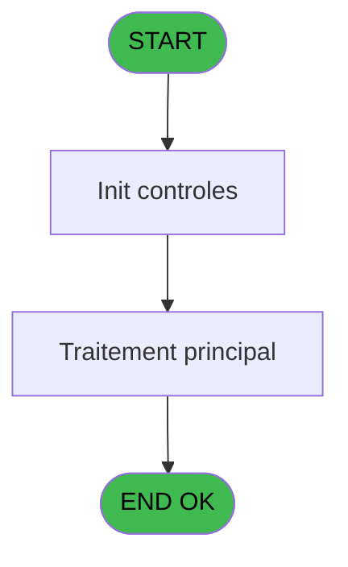

# ADH IDE 42 - Controle Login Informaticien

> **Analyse**: Phases 1-4 2026-02-07 06:45 -> 06:46 (17s) | Assemblage 13:15
> **Pipeline**: V7.2 Enrichi
> **Structure**: 4 onglets (Resume | Ecrans | Donnees | Connexions)

<!-- TAB:Resume -->

## 1. FICHE D'IDENTITE

| Attribut | Valeur |
|----------|--------|
| Projet | ADH |
| IDE Position | 42 |
| Nom Programme | Controle Login Informaticien |
| Fichier source | `Prg_42.xml` |
| Dossier IDE | General |
| Taches | 1 (0 ecrans visibles) |
| Tables modifiees | 0 |
| Programmes appeles | 0 |
| Complexite | **BASSE** (score 0/100) |
| Statut | **ORPHELIN_POTENTIEL** |

## 2. DESCRIPTION FONCTIONNELLE

# ADH IDE 42 - Controle Login Informaticien

Ce programme gère l'authentification des informaticiens accédant au système de gestion ADH. Il valide les identifiants et mots de passe saisis, en confrontant les données entrées avec une table de référence des utilisateurs autorisés. Le processus inclut les vérifications de format (identifiant/mot de passe non vides), l'authentification proprement dite, et la gestion des tentatives échouées pour éviter les accès non autorisés.

Le programme assure également la sécurité des accès informaticiens en implémentant des mécanismes de contrôle spécifiques à ce profil utilisateur. Une fois l'authentification réussie, l'utilisateur accède aux fonctionnalités de gestion de l'application réservées aux administrateurs. En cas d'échec de l'authentification, le programme rejette l'accès et peut enregistrer la tentative échouée pour audit.

Le programme s'inscrit dans la chaîne des contrôles de sécurité du système ADH, en particulier lors du démarrage de l'application ou lors d'actions sensibles nécessitant une confirmation d'identité de l'informaticien responsable. C'est un élément critique pour maintenir l'intégrité et la confidentialité des données gérées par l'application.

## 3. BLOCS FONCTIONNELS

## 5. REGLES METIER

*(Aucune regle metier identifiee dans les expressions)*

## 6. CONTEXTE

- **Appele par**: (aucun)
- **Appelle**: 0 programmes | **Tables**: 1 (W:0 R:1 L:0) | **Taches**: 1 | **Expressions**: 7

<!-- TAB:Ecrans -->

## 8. ECRANS

*(Programme sans ecran visible)*

## 9. NAVIGATION

### 9.3 Structure hierarchique (0 tache)

| Position | Tache | Type | Dimensions | Bloc |
|----------|-------|------|------------|------|

### 9.4 Algorigramme

> **Legende**: Vert = START/END OK | Rouge = END KO | Bleu = Decisions
> *Algorigramme auto-genere. Utiliser `/algorigramme` pour une synthese metier detaillee.*

<!-- TAB:Donnees -->

## 10. TABLES

### Tables utilisees (1)

| ID | Nom | Description | Type | R | W | L | Usages |
|----|-----|-------------|------|---|---|---|--------|
| 740 | pv_stock_movements | Articles et stock | DB | R |   |   | 1 |

### Colonnes par table (1 / 1 tables avec colonnes identifiees)

Table 740 - pv_stock_movements (R) - 1 usages

| Lettre | Variable | Acces | Type |
|--------|----------|-------|------|
| A | P in societe | R | Alpha |
| B | P out Accès OK | R | Logical |
| C | P in sans message | R | Logical |

## 11. VARIABLES

### 11.1 Parametres entrants (3)

Variables recues en parametre.

| Lettre | Nom | Type | Usage dans |
|--------|-----|------|-----------|
| A | P in societe | Alpha | 1x parametre entrant |
| B | P out Accès OK | Logical | - |
| C | P in sans message | Logical | 1x parametre entrant |

## 12. EXPRESSIONS

**7 / 7 expressions decodees (100%)**

### 12.1 Repartition par type

| Type | Expressions | Regles |
|------|-------------|--------|
| CAST_LOGIQUE | 2 | 0 |
| OTHER | 1 | 0 |
| REFERENCE_VG | 1 | 0 |
| CONDITION | 2 | 0 |
| NEGATION | 1 | 0 |

### 12.2 Expressions cles par type

#### CAST_LOGIQUE (2 expressions)

| Type | IDE | Expression | Regle |
|------|-----|------------|-------|
| CAST_LOGIQUE | 4 | `'TRUE'LOG` | - |
| CAST_LOGIQUE | 1 | `'FALSE'LOG` | - |

#### OTHER (1 expressions)

| Type | IDE | Expression | Regle |
|------|-----|------------|-------|
| OTHER | 2 | `P in societe [A]` | - |

#### REFERENCE_VG (1 expressions)

| Type | IDE | Expression | Regle |
|------|-----|------------|-------|
| REFERENCE_VG | 3 | `VG1` | - |

#### CONDITION (2 expressions)

| Type | IDE | Expression | Regle |
|------|-----|------------|-------|
| CONDITION | 6 | `[F]<>'INFORMATICIEN'` | - |
| CONDITION | 5 | `[F]='INFORMATICIEN'` | - |

#### NEGATION (1 expressions)

| Type | IDE | Expression | Regle |
|------|-----|------------|-------|
| NEGATION | 7 | `NOT (P in sans message [C])` | - |

<!-- TAB:Connexions -->

## 13. GRAPHE D'APPELS

### 13.1 Chaine depuis Main (Callers)

**Chemin**: (pas de callers directs)

### 13.2 Callers

| IDE | Nom Programme | Nb Appels |
|-----|---------------|-----------|
| - | (aucun) | - |

### 13.3 Callees (programmes appeles)

### 13.4 Detail Callees avec contexte

| IDE | Nom Programme | Appels | Contexte |
|-----|---------------|--------|----------|
| - | (aucun) | - | - |

## 14. RECOMMANDATIONS MIGRATION

### 14.1 Profil du programme

| Metrique | Valeur | Impact migration |
|----------|--------|-----------------|
| Lignes de logique | 15 | Programme compact |
| Expressions | 7 | Peu de logique |
| Tables WRITE | 0 | Impact faible |
| Sous-programmes | 0 | Peu de dependances |
| Ecrans visibles | 0 | Ecran unique ou traitement batch |
| Code desactive | 0% (0 / 15) | Code sain |
| Regles metier | 0 | Pas de regle identifiee |

### 14.2 Plan de migration par bloc

### 14.3 Dependances critiques

| Dependance | Type | Appels | Impact |
|------------|------|--------|--------|

---
*Spec DETAILED generee par Pipeline V7.2 - 2026-02-07 13:15*
