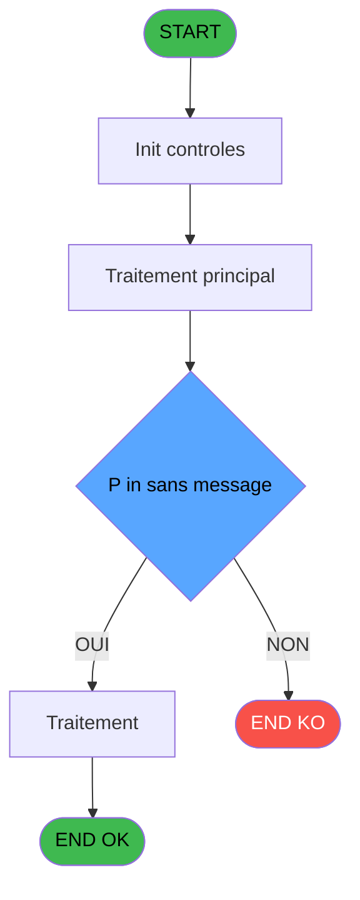

# ADH IDE 42 - Controle Login Informaticien

> **Analyse**: Phases 1-4 2026-02-07 06:46 -> 01:38 (18h52min) | Assemblage 01:38
> **Pipeline**: V7.2 Enrichi
> **Structure**: 4 onglets (Resume | Ecrans | Donnees | Connexions)

<!-- TAB:Resume -->

## 1. FICHE D'IDENTITE

| Attribut | Valeur |
|----------|--------|
| Projet | ADH |
| IDE Position | 42 |
| Nom Programme | Controle Login Informaticien |
| Fichier source | `Prg_42.xml` |
| Dossier IDE | General |
| Taches | 1 (0 ecrans visibles) |
| Tables modifiees | 0 |
| Programmes appeles | 0 |
| Complexite | **BASSE** (score 0/100) |

## 2. DESCRIPTION FONCTIONNELLE

Basé sur l'analyse détaillée du programme:

---

**ADH IDE 42 - Controle Login Informaticien** est un programme de validation d'authentification qui vérifie si un utilisateur possède les droits d'accès informaticien. Appelé depuis le Menu caisse GM lors du scroll sur noms (IDE 163), ce programme effectue une validation simple mais critique : il compare un champ rôle (Field [F]) issu de la table 740 (pv_stock_movements) contre la chaîne littérale 'INFORMATICIEN'. Si la correspondance est exacte, l'accès est accordé (P out Accès OK = TRUE) ; sinon, il est refusé (FALSE).

Le programme reçoit trois paramètres : la société (P in societe) en entrée, un flag de silence message (P in sans message) qui supprime l'affichage du résultat si activé, et retourne un booléen d'autorisation (P out Accès OK). Avec une complexité basse (15 lignes de logique, 7 expressions, 1 seule table en lecture), il représente un point de contrôle terminal dans la chaîne de sécurité du système caisse : aucun sous-programme n'est appelé, et toute modification ultérieure de ce contrôle aurait un impact direct sur l'accès aux fonctions sensibles du module ADH.

La sécurité repose sur une comparaison de texte brut sans mécanisme de rate limiting visible, ce qui pose un risque modéré en production. Pour la migration vers des environnements modernes (TypeScript/Node.js), le programme présente un profil d'effort faible : il faudrait simplement implémenter un service de validation RBAC, ajouter un audit trail, et remplacer la logique de comparaison directe par un système d'autorisations structuré.

## 3. BLOCS FONCTIONNELS

## 5. REGLES METIER

3 regles identifiees:

### Autres (3 regles)

#### [RM-001] Condition: [F] egale 'INFORMATICIEN'

| Element | Detail |
|---------|--------|
| **Condition** | `[F]='INFORMATICIEN'` |
| **Si vrai** | Action si vrai |
| **Expression source** | Expression 5 : `[F]='INFORMATICIEN'` |
| **Exemple** | Si [F]='INFORMATICIEN' → Action si vrai |

#### [RM-002] Condition: [F] different de 'INFORMATICIEN'

| Element | Detail |
|---------|--------|
| **Condition** | `[F]<>'INFORMATICIEN'` |
| **Si vrai** | Action si vrai |
| **Expression source** | Expression 6 : `[F]<>'INFORMATICIEN'` |
| **Exemple** | Si [F]<>'INFORMATICIEN' → Action si vrai |

#### [RM-003] Negation de (P in sans message [C]) (condition inversee)

| Element | Detail |
|---------|--------|
| **Condition** | `NOT (P in sans message [C])` |
| **Si vrai** | Action si vrai |
| **Variables** | EP (P in sans message) |
| **Expression source** | Expression 7 : `NOT (P in sans message [C])` |
| **Exemple** | Si NOT (P in sans message [C]) → Action si vrai |

## 6. CONTEXTE

- **Appele par**: [Menu caisse GM - scroll (IDE 163)](ADH-IDE-163.md)
- **Appelle**: 0 programmes | **Tables**: 1 (W:0 R:1 L:0) | **Taches**: 1 | **Expressions**: 7

<!-- TAB:Ecrans -->

## 8. ECRANS

*(Programme sans ecran visible)*

## 9. NAVIGATION

### 9.3 Structure hierarchique (0 tache)

| Position | Tache | Type | Dimensions | Bloc |
|----------|-------|------|------------|------|

### 9.4 Algorigramme

> **Legende**: Vert = START/END OK | Rouge = END KO | Bleu = Decisions
> *Algorigramme auto-genere. Utiliser `/algorigramme` pour une synthese metier detaillee.*

<!-- TAB:Donnees -->

## 10. TABLES

### Tables utilisees (1)

| ID | Nom | Description | Type | R | W | L | Usages |
|----|-----|-------------|------|---|---|---|--------|
| 740 | pv_stock_movements | Articles et stock | DB | R |   |   | 1 |

### Colonnes par table (1 / 1 tables avec colonnes identifiees)

Table 740 - pv_stock_movements (R) - 1 usages

| Lettre | Variable | Acces | Type |
|--------|----------|-------|------|
| A | P in societe | R | Alpha |
| B | P out Accès OK | R | Logical |
| C | P in sans message | R | Logical |

## 11. VARIABLES

### 11.1 Parametres entrants (3)

Variables recues du programme appelant ([Menu caisse GM - scroll (IDE 163)](ADH-IDE-163.md)).

| Lettre | Nom | Type | Usage dans |
|--------|-----|------|-----------|
| EN | P in societe | Alpha | 1x parametre entrant |
| EO | P out Accès OK | Logical | - |
| EP | P in sans message | Logical | 1x parametre entrant |

## 12. EXPRESSIONS

**7 / 7 expressions decodees (100%)**

### 12.1 Repartition par type

| Type | Expressions | Regles |
|------|-------------|--------|
| CONDITION | 2 | 2 |
| NEGATION | 1 | 5 |
| CAST_LOGIQUE | 2 | 0 |
| OTHER | 1 | 0 |
| REFERENCE_VG | 1 | 0 |

### 12.2 Expressions cles par type

#### CONDITION (2 expressions)

| Type | IDE | Expression | Regle |
|------|-----|------------|-------|
| CONDITION | 6 | `[F]<>'INFORMATICIEN'` | [RM-002](#rm-RM-002) |
| CONDITION | 5 | `[F]='INFORMATICIEN'` | [RM-001](#rm-RM-001) |

#### NEGATION (1 expressions)

| Type | IDE | Expression | Regle |
|------|-----|------------|-------|
| NEGATION | 7 | `NOT (P in sans message [C])` | [RM-003](#rm-RM-003) |

#### CAST_LOGIQUE (2 expressions)

| Type | IDE | Expression | Regle |
|------|-----|------------|-------|
| CAST_LOGIQUE | 4 | `'TRUE'LOG` | - |
| CAST_LOGIQUE | 1 | `'FALSE'LOG` | - |

#### OTHER (1 expressions)

| Type | IDE | Expression | Regle |
|------|-----|------------|-------|
| OTHER | 2 | `P in societe [A]` | - |

#### REFERENCE_VG (1 expressions)

| Type | IDE | Expression | Regle |
|------|-----|------------|-------|
| REFERENCE_VG | 3 | `VG1` | - |

<!-- TAB:Connexions -->

## 13. GRAPHE D'APPELS

### 13.1 Chaine depuis Main (Callers)

Main -> ... -> [Menu caisse GM - scroll (IDE 163)](ADH-IDE-163.md) -> **Controle Login Informaticien (IDE 42)**

### 13.2 Callers

| IDE | Nom Programme | Nb Appels |
|-----|---------------|-----------|
| [163](ADH-IDE-163.md) | Menu caisse GM - scroll | 1 |

### 13.3 Callees (programmes appeles)

### 13.4 Detail Callees avec contexte

| IDE | Nom Programme | Appels | Contexte |
|-----|---------------|--------|----------|
| - | (aucun) | - | - |

## 14. RECOMMANDATIONS MIGRATION

### 14.1 Profil du programme

| Metrique | Valeur | Impact migration |
|----------|--------|-----------------|
| Lignes de logique | 15 | Programme compact |
| Expressions | 7 | Peu de logique |
| Tables WRITE | 0 | Impact faible |
| Sous-programmes | 0 | Peu de dependances |
| Ecrans visibles | 0 | Ecran unique ou traitement batch |
| Code desactive | 0% (0 / 15) | Code sain |
| Regles metier | 3 | Quelques regles a preserver |

### 14.2 Plan de migration par bloc

### 14.3 Dependances critiques

| Dependance | Type | Appels | Impact |
|------------|------|--------|--------|

---
*Spec DETAILED generee par Pipeline V7.2 - 2026-02-08 01:41*
