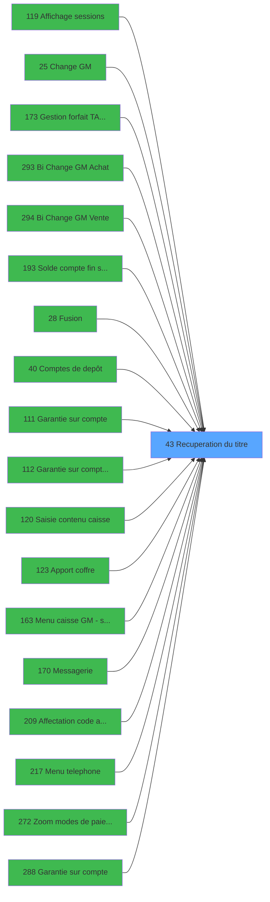

# ADH IDE 43 - Recuperation du titre

> **Analyse**: Phases 1-4 2026-02-07 06:46 -> 01:41 (18h54min) | Assemblage 01:41
> **Pipeline**: V7.2 Enrichi
> **Structure**: 4 onglets (Resume | Ecrans | Donnees | Connexions)

<!-- TAB:Resume -->

## 1. FICHE D'IDENTITE

| Attribut | Valeur |
|----------|--------|
| Projet | ADH |
| IDE Position | 43 |
| Nom Programme | Recuperation du titre |
| Fichier source | `Prg_43.xml` |
| Dossier IDE | General |
| Taches | 1 (0 ecrans visibles) |
| Tables modifiees | 0 |
| Programmes appeles | 0 |
| Complexite | **BASSE** (score 0/100) |

## 2. DESCRIPTION FONCTIONNELLE

ADH IDE 43 est un utilitaire de **lookup titre/civilité** appelé depuis une vingtaine de contextes différents (sessions, change, garanties, caisse, telephone, etc.). Le programme récupère le titre (M., Mme, etc.) d'un compte en lisant la table de référence **titres** via une clé identifiant le type de titre stocké dans le compte. C'est une fonction élémentaire de normalisation affichage, utilisée partout où un titre doit être présenté à l'écran.

Le programme reçoit probablement un **paramètre d'entrée** (numéro ou code titre) et retourne le **libellé du titre** formaté. Aucune logique métier complexe : il s'agit d'un simple **mapping table de référence**, similaire aux autres zooms (devises, moyens de paiement, garanties).

Son ubiquité dans l'architecture (20+ appelants) en fait un **composant critique de présentation** : si ce lookup échoue, l'affichage titres dégénère partout. C'est typiquement un programme à **migrer en utilitaire/service** centralisé, plutôt que d'appeler depuis 20 endroits.

## 3. BLOCS FONCTIONNELS

## 5. REGLES METIER

1 regles identifiees:

### Autres (1 regles)

#### [RM-001] Valeur par defaut si > type prog (CA si vide) [C] est vide

| Element | Detail |
|---------|--------|
| **Condition** | `> type prog (CA si vide) [C]=''` |
| **Si vrai** | 'CA' |
| **Si faux** | > type prog (CA si vide) [C]) |
| **Variables** | EP (> type prog (CA si vide)) |
| **Expression source** | Expression 3 : `IF (> type prog (CA si vide) [C]='','CA',> type prog (CA si ` |
| **Exemple** | Si > type prog (CA si vide) [C]='' → 'CA'. Sinon → > type prog (CA si vide) [C]) |

## 6. CONTEXTE

- **Appele par**: [Affichage sessions (IDE 119)](ADH-IDE-119.md), [Change GM (IDE 25)](ADH-IDE-25.md), [Gestion forfait TAI LOCAL (IDE 173)](ADH-IDE-173.md), [Bi  Change GM Achat (IDE 293)](ADH-IDE-293.md), [Bi  Change GM Vente (IDE 294)](ADH-IDE-294.md), [Solde compte fin sejour (IDE 193)](ADH-IDE-193.md), [Garantie sur compte PMS-584 (IDE 0)](ADH-IDE-0.md), [Fusion (IDE 28)](ADH-IDE-28.md), [Comptes de depôt (IDE 40)](ADH-IDE-40.md), [Garantie sur compte (IDE 111)](ADH-IDE-111.md), [Garantie sur compte PMS-584 (IDE 112)](ADH-IDE-112.md), [Saisie contenu caisse (IDE 120)](ADH-IDE-120.md), [Apport coffre (IDE 123)](ADH-IDE-123.md), [Menu caisse GM - scroll (IDE 163)](ADH-IDE-163.md), [Messagerie (IDE 170)](ADH-IDE-170.md), [Affectation code autocom (IDE 209)](ADH-IDE-209.md), [Menu telephone (IDE 217)](ADH-IDE-217.md), [Zoom modes de paiement (IDE 272)](ADH-IDE-272.md), [Garantie sur compte (IDE 288)](ADH-IDE-288.md), [Transaction Nouv vente PMS-584 (IDE 0)](ADH-IDE-0.md)
- **Appelle**: 0 programmes | **Tables**: 1 (W:0 R:1 L:0) | **Taches**: 1 | **Expressions**: 4

<!-- TAB:Ecrans -->

## 8. ECRANS

*(Programme sans ecran visible)*

## 9. NAVIGATION

### 9.3 Structure hierarchique (0 tache)

| Position | Tache | Type | Dimensions | Bloc |
|----------|-------|------|------------|------|

### 9.4 Algorigramme

> **Legende**: Vert = START/END OK | Rouge = END KO | Bleu = Decisions
> *Algorigramme auto-genere. Utiliser `/algorigramme` pour une synthese metier detaillee.*

<!-- TAB:Donnees -->

## 10. TABLES

### Tables utilisees (1)

| ID | Nom | Description | Type | R | W | L | Usages |
|----|-----|-------------|------|---|---|---|--------|
| 719 | arc_transac_detail_bar |  | DB | R |   |   | 1 |

### Colonnes par table (1 / 1 tables avec colonnes identifiees)

Table 719 - arc_transac_detail_bar (R) - 1 usages

| Lettre | Variable | Acces | Type |
|--------|----------|-------|------|
| A | > code ecran | R | Numeric |
| B | < nom ecran | R | Alpha |
| C | > type prog (CA si vide) | R | Alpha |

## 11. VARIABLES

### 11.1 Autres (3)

Variables diverses.

| Lettre | Nom | Type | Usage dans |
|--------|-----|------|-----------|
| EN | > code ecran | Numeric | 1x refs |
| EO | < nom ecran | Alpha | - |
| EP | > type prog (CA si vide) | Alpha | 1x refs |

## 12. EXPRESSIONS

**4 / 4 expressions decodees (100%)**

### 12.1 Repartition par type

| Type | Expressions | Regles |
|------|-------------|--------|
| CONCATENATION | 1 | 0 |
| CONDITION | 2 | 5 |
| OTHER | 1 | 0 |

### 12.2 Expressions cles par type

#### CONCATENATION (1 expressions)

| Type | IDE | Expression | Regle |
|------|-----|------------|-------|
| CONCATENATION | 4 | `Trim ([G])&' - '&Trim ([H])` | - |

#### CONDITION (2 expressions)

| Type | IDE | Expression | Regle |
|------|-----|------------|-------|
| CONDITION | 3 | `IF (> type prog (CA si vide) [C]='','CA',> type prog (CA si vide) [C])` | [RM-001](#rm-RM-001) |
| CONDITION | 2 | `> code ecran [A]` | - |

#### OTHER (1 expressions)

| Type | IDE | Expression | Regle |
|------|-----|------------|-------|
| OTHER | 1 | `GetParam ('CODELANGUE')` | - |

<!-- TAB:Connexions -->

## 13. GRAPHE D'APPELS

### 13.1 Chaine depuis Main (Callers)

Main -> ... -> [Affichage sessions (IDE 119)](ADH-IDE-119.md) -> **Recuperation du titre (IDE 43)**

Main -> ... -> [Change GM (IDE 25)](ADH-IDE-25.md) -> **Recuperation du titre (IDE 43)**

Main -> ... -> [Gestion forfait TAI LOCAL (IDE 173)](ADH-IDE-173.md) -> **Recuperation du titre (IDE 43)**

Main -> ... -> [Bi  Change GM Achat (IDE 293)](ADH-IDE-293.md) -> **Recuperation du titre (IDE 43)**

Main -> ... -> [Bi  Change GM Vente (IDE 294)](ADH-IDE-294.md) -> **Recuperation du titre (IDE 43)**

Main -> ... -> [Solde compte fin sejour (IDE 193)](ADH-IDE-193.md) -> **Recuperation du titre (IDE 43)**

Main -> ... -> [Garantie sur compte PMS-584 (IDE 0)](ADH-IDE-0.md) -> **Recuperation du titre (IDE 43)**

Main -> ... -> [Fusion (IDE 28)](ADH-IDE-28.md) -> **Recuperation du titre (IDE 43)**

Main -> ... -> [Comptes de depôt (IDE 40)](ADH-IDE-40.md) -> **Recuperation du titre (IDE 43)**

Main -> ... -> [Garantie sur compte (IDE 111)](ADH-IDE-111.md) -> **Recuperation du titre (IDE 43)**

Main -> ... -> [Garantie sur compte PMS-584 (IDE 112)](ADH-IDE-112.md) -> **Recuperation du titre (IDE 43)**

Main -> ... -> [Saisie contenu caisse (IDE 120)](ADH-IDE-120.md) -> **Recuperation du titre (IDE 43)**

Main -> ... -> [Apport coffre (IDE 123)](ADH-IDE-123.md) -> **Recuperation du titre (IDE 43)**

Main -> ... -> [Menu caisse GM - scroll (IDE 163)](ADH-IDE-163.md) -> **Recuperation du titre (IDE 43)**

Main -> ... -> [Messagerie (IDE 170)](ADH-IDE-170.md) -> **Recuperation du titre (IDE 43)**

Main -> ... -> [Affectation code autocom (IDE 209)](ADH-IDE-209.md) -> **Recuperation du titre (IDE 43)**

Main -> ... -> [Menu telephone (IDE 217)](ADH-IDE-217.md) -> **Recuperation du titre (IDE 43)**

Main -> ... -> [Zoom modes de paiement (IDE 272)](ADH-IDE-272.md) -> **Recuperation du titre (IDE 43)**

Main -> ... -> [Garantie sur compte (IDE 288)](ADH-IDE-288.md) -> **Recuperation du titre (IDE 43)**

Main -> ... -> [Transaction Nouv vente PMS-584 (IDE 0)](ADH-IDE-0.md) -> **Recuperation du titre (IDE 43)**

### 13.2 Callers

| IDE | Nom Programme | Nb Appels |
|-----|---------------|-----------|
| [119](ADH-IDE-119.md) | Affichage sessions | 7 |
| [25](ADH-IDE-25.md) | Change GM | 4 |
| [173](ADH-IDE-173.md) | Gestion forfait TAI LOCAL | 4 |
| [293](ADH-IDE-293.md) | Bi  Change GM Achat | 4 |
| [294](ADH-IDE-294.md) | Bi  Change GM Vente | 4 |
| [193](ADH-IDE-193.md) | Solde compte fin sejour | 3 |
| [0](ADH-IDE-0.md) | Garantie sur compte PMS-584 | 2 |
| [28](ADH-IDE-28.md) | Fusion | 2 |
| [40](ADH-IDE-40.md) | Comptes de depôt | 2 |
| [111](ADH-IDE-111.md) | Garantie sur compte | 2 |
| [112](ADH-IDE-112.md) | Garantie sur compte PMS-584 | 2 |
| [120](ADH-IDE-120.md) | Saisie contenu caisse | 2 |
| [123](ADH-IDE-123.md) | Apport coffre | 2 |
| [163](ADH-IDE-163.md) | Menu caisse GM - scroll | 2 |
| [170](ADH-IDE-170.md) | Messagerie | 2 |
| [209](ADH-IDE-209.md) | Affectation code autocom | 2 |
| [217](ADH-IDE-217.md) | Menu telephone | 2 |
| [272](ADH-IDE-272.md) | Zoom modes de paiement | 2 |
| [288](ADH-IDE-288.md) | Garantie sur compte | 2 |
| [0](ADH-IDE-0.md) | Transaction Nouv vente PMS-584 | 1 |

### 13.3 Callees (programmes appeles)

### 13.4 Detail Callees avec contexte

| IDE | Nom Programme | Appels | Contexte |
|-----|---------------|--------|----------|
| - | (aucun) | - | - |

## 14. RECOMMANDATIONS MIGRATION

### 14.1 Profil du programme

| Metrique | Valeur | Impact migration |
|----------|--------|-----------------|
| Lignes de logique | 13 | Programme compact |
| Expressions | 4 | Peu de logique |
| Tables WRITE | 0 | Impact faible |
| Sous-programmes | 0 | Peu de dependances |
| Ecrans visibles | 0 | Ecran unique ou traitement batch |
| Code desactive | 0% (0 / 13) | Code sain |
| Regles metier | 1 | Quelques regles a preserver |

### 14.2 Plan de migration par bloc

### 14.3 Dependances critiques

| Dependance | Type | Appels | Impact |
|------------|------|--------|--------|

---
*Spec DETAILED generee par Pipeline V7.2 - 2026-02-08 01:42*
