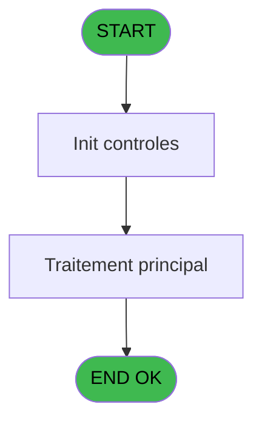
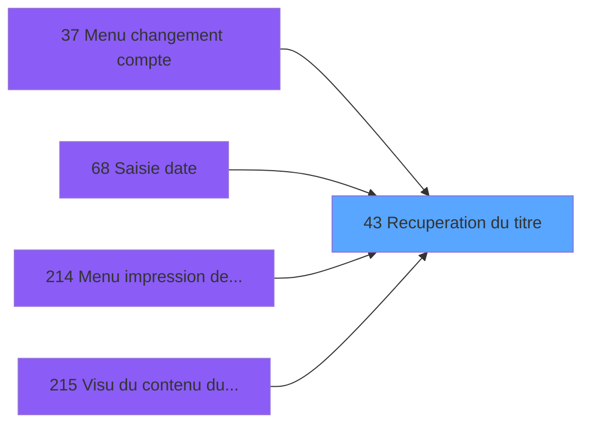

# ADH IDE 43 - Recuperation du titre

> **Analyse**: Phases 1-4 2026-02-07 06:46 -> 06:46 (16s) | Assemblage 13:15
> **Pipeline**: V7.2 Enrichi
> **Structure**: 4 onglets (Resume | Ecrans | Donnees | Connexions)

<!-- TAB:Resume -->

## 1. FICHE D'IDENTITE

| Attribut | Valeur |
|----------|--------|
| Projet | ADH |
| IDE Position | 43 |
| Nom Programme | Recuperation du titre |
| Fichier source | `Prg_43.xml` |
| Dossier IDE | General |
| Taches | 1 (0 ecrans visibles) |
| Tables modifiees | 0 |
| Programmes appeles | 0 |
| Complexite | **BASSE** (score 0/100) |

## 2. DESCRIPTION FONCTIONNELLE

Programme de récupération et d'affichage du titre d'une entité sélectionnée dans le système. Il agit comme un utilitaire central appelé par une multitude de programmes (notamment les zooms de tables et les menus de gestion), permettant de consulter l'intitulé associé à un enregistrement sans modifier les données. Son rôle est de fournir une information lisible sur l'objet en cours de consultation.

Étant donné le nombre élevé de callers (plus de 20 programmes différents), ce programme constitue un pivot transversal dans la navigation et la consultation des référentiels du système. Il simplifie l'affichage des métadonnées sans dupliquer la logique de récupération dans chaque programme appelant. La structure du code est probablement optimisée pour une exécution rapide et une intégration légère.

Les cas d'usage principaux couvrent les zooms interactifs (articles, devises, modes de paiement, types de taux, services), la navigation dans les menus de gestion (changement de compte, transferts) et les impressions (menu d'impression des appels). Cette ubiquité suggère que le programme gère plusieurs types d'entités avec un mécanisme unifié de récupération du titre.

## 3. BLOCS FONCTIONNELS

## 5. REGLES METIER

1 regles identifiees:

### Autres (1 regles)

#### [RM-001] Valeur par defaut si > type prog (CA si vide) [C] est vide

| Element | Detail |
|---------|--------|
| **Condition** | `> type prog (CA si vide) [C]=''` |
| **Si vrai** | 'CA' |
| **Si faux** | > type prog (CA si vide) [C]) |
| **Variables** | C (> type prog (CA si vide)) |
| **Expression source** | Expression 3 : `IF (> type prog (CA si vide) [C]='','CA',> type prog (CA si ` |
| **Exemple** | Si > type prog (CA si vide) [C]='' → 'CA'. Sinon → > type prog (CA si vide) [C]) |

## 6. CONTEXTE

- **Appele par**: [Transferts (IDE 0)](ADH-IDE-0.md), [Menu changement compte (IDE 37)](ADH-IDE-37.md), [ Saisie date (IDE 68)](ADH-IDE-68.md), [Menu impression des appels (IDE 214)](ADH-IDE-214.md), [Visu du contenu d'un poste (IDE 215)](ADH-IDE-215.md), [Zoom sur table des gratuites (IDE 256)](ADH-IDE-256.md), [Zoom articles (IDE 257)](ADH-IDE-257.md), [Zoom mode paiement change GM (IDE 258)](ADH-IDE-258.md), [Zoom modes de paiement (IDE 259)](ADH-IDE-259.md), [Zoom moyen de règlement (IDE 260)](ADH-IDE-260.md), [Zoom des types de taux (IDE 261)](ADH-IDE-261.md), [Zoom  des types d'objets (IDE 262)](ADH-IDE-262.md), [Zoom modes de paiement (IDE 263)](ADH-IDE-263.md), [Zoom devise solde compte (IDE 264)](ADH-IDE-264.md), [Zoom devise (IDE 265)](ADH-IDE-265.md), [Zoom des all devises (IDE 266)](ADH-IDE-266.md), [Zoom devises (IDE 267)](ADH-IDE-267.md), [Zoom type depot garantie (IDE 268)](ADH-IDE-268.md), [Zoom services village (IDE 269)](ADH-IDE-269.md), [Zoom sur modes de paiement a/v (IDE 270)](ADH-IDE-270.md)
- **Appelle**: 0 programmes | **Tables**: 1 (W:0 R:1 L:0) | **Taches**: 1 | **Expressions**: 4

<!-- TAB:Ecrans -->

## 8. ECRANS

*(Programme sans ecran visible)*

## 9. NAVIGATION

### 9.3 Structure hierarchique (0 tache)

| Position | Tache | Type | Dimensions | Bloc |
|----------|-------|------|------------|------|

### 9.4 Algorigramme

> **Legende**: Vert = START/END OK | Rouge = END KO | Bleu = Decisions
> *Algorigramme auto-genere. Utiliser `/algorigramme` pour une synthese metier detaillee.*

<!-- TAB:Donnees -->

## 10. TABLES

### Tables utilisees (1)

| ID | Nom | Description | Type | R | W | L | Usages |
|----|-----|-------------|------|---|---|---|--------|
| 719 | arc_transac_detail_bar |  | DB | R |   |   | 1 |

### Colonnes par table (1 / 1 tables avec colonnes identifiees)

Table 719 - arc_transac_detail_bar (R) - 1 usages

| Lettre | Variable | Acces | Type |
|--------|----------|-------|------|
| A | > code ecran | R | Numeric |
| B | < nom ecran | R | Alpha |
| C | > type prog (CA si vide) | R | Alpha |

## 11. VARIABLES

### 11.1 Autres (3)

Variables diverses.

| Lettre | Nom | Type | Usage dans |
|--------|-----|------|-----------|
| A | > code ecran | Numeric | 1x refs |
| B | < nom ecran | Alpha | - |
| C | > type prog (CA si vide) | Alpha | 1x refs |

## 12. EXPRESSIONS

**4 / 4 expressions decodees (100%)**

### 12.1 Repartition par type

| Type | Expressions | Regles |
|------|-------------|--------|
| CONCATENATION | 1 | 0 |
| CONDITION | 2 | 5 |
| OTHER | 1 | 0 |

### 12.2 Expressions cles par type

#### CONCATENATION (1 expressions)

| Type | IDE | Expression | Regle |
|------|-----|------------|-------|
| CONCATENATION | 4 | `Trim ([G])&' - '&Trim ([H])` | - |

#### CONDITION (2 expressions)

| Type | IDE | Expression | Regle |
|------|-----|------------|-------|
| CONDITION | 3 | `IF (> type prog (CA si vide) [C]='','CA',> type prog (CA si vide) [C])` | [RM-001](#rm-RM-001) |
| CONDITION | 2 | `> code ecran [A]` | - |

#### OTHER (1 expressions)

| Type | IDE | Expression | Regle |
|------|-----|------------|-------|
| OTHER | 1 | `GetParam ('CODELANGUE')` | - |

<!-- TAB:Connexions -->

## 13. GRAPHE D'APPELS

### 13.1 Chaine depuis Main (Callers)

Main -> ... -> [Transferts (IDE 0)](ADH-IDE-0.md) -> **Recuperation du titre (IDE 43)**

Main -> ... -> [Menu changement compte (IDE 37)](ADH-IDE-37.md) -> **Recuperation du titre (IDE 43)**

Main -> ... -> [ Saisie date (IDE 68)](ADH-IDE-68.md) -> **Recuperation du titre (IDE 43)**

Main -> ... -> [Menu impression des appels (IDE 214)](ADH-IDE-214.md) -> **Recuperation du titre (IDE 43)**

Main -> ... -> [Visu du contenu d'un poste (IDE 215)](ADH-IDE-215.md) -> **Recuperation du titre (IDE 43)**

Main -> ... -> [Zoom sur table des gratuites (IDE 256)](ADH-IDE-256.md) -> **Recuperation du titre (IDE 43)**

Main -> ... -> [Zoom articles (IDE 257)](ADH-IDE-257.md) -> **Recuperation du titre (IDE 43)**

Main -> ... -> [Zoom mode paiement change GM (IDE 258)](ADH-IDE-258.md) -> **Recuperation du titre (IDE 43)**

Main -> ... -> [Zoom modes de paiement (IDE 259)](ADH-IDE-259.md) -> **Recuperation du titre (IDE 43)**

Main -> ... -> [Zoom moyen de règlement (IDE 260)](ADH-IDE-260.md) -> **Recuperation du titre (IDE 43)**

Main -> ... -> [Zoom des types de taux (IDE 261)](ADH-IDE-261.md) -> **Recuperation du titre (IDE 43)**

Main -> ... -> [Zoom  des types d'objets (IDE 262)](ADH-IDE-262.md) -> **Recuperation du titre (IDE 43)**

Main -> ... -> [Zoom modes de paiement (IDE 263)](ADH-IDE-263.md) -> **Recuperation du titre (IDE 43)**

Main -> ... -> [Zoom devise solde compte (IDE 264)](ADH-IDE-264.md) -> **Recuperation du titre (IDE 43)**

Main -> ... -> [Zoom devise (IDE 265)](ADH-IDE-265.md) -> **Recuperation du titre (IDE 43)**

Main -> ... -> [Zoom des all devises (IDE 266)](ADH-IDE-266.md) -> **Recuperation du titre (IDE 43)**

Main -> ... -> [Zoom devises (IDE 267)](ADH-IDE-267.md) -> **Recuperation du titre (IDE 43)**

Main -> ... -> [Zoom type depot garantie (IDE 268)](ADH-IDE-268.md) -> **Recuperation du titre (IDE 43)**

Main -> ... -> [Zoom services village (IDE 269)](ADH-IDE-269.md) -> **Recuperation du titre (IDE 43)**

Main -> ... -> [Zoom sur modes de paiement a/v (IDE 270)](ADH-IDE-270.md) -> **Recuperation du titre (IDE 43)**

### 13.2 Callers

| IDE | Nom Programme | Nb Appels |
|-----|---------------|-----------|
| [0](ADH-IDE-0.md) | Transferts | 1 |
| [37](ADH-IDE-37.md) | Menu changement compte | 1 |
| [68](ADH-IDE-68.md) |  Saisie date | 1 |
| [214](ADH-IDE-214.md) | Menu impression des appels | 1 |
| [215](ADH-IDE-215.md) | Visu du contenu d'un poste | 1 |
| [256](ADH-IDE-256.md) | Zoom sur table des gratuites | 1 |
| [257](ADH-IDE-257.md) | Zoom articles | 1 |
| [258](ADH-IDE-258.md) | Zoom mode paiement change GM | 1 |
| [259](ADH-IDE-259.md) | Zoom modes de paiement | 1 |
| [260](ADH-IDE-260.md) | Zoom moyen de règlement | 1 |
| [261](ADH-IDE-261.md) | Zoom des types de taux | 1 |
| [262](ADH-IDE-262.md) | Zoom  des types d'objets | 1 |
| [263](ADH-IDE-263.md) | Zoom modes de paiement | 1 |
| [264](ADH-IDE-264.md) | Zoom devise solde compte | 1 |
| [265](ADH-IDE-265.md) | Zoom devise | 1 |
| [266](ADH-IDE-266.md) | Zoom des all devises | 1 |
| [267](ADH-IDE-267.md) | Zoom devises | 1 |
| [268](ADH-IDE-268.md) | Zoom type depot garantie | 1 |
| [269](ADH-IDE-269.md) | Zoom services village | 1 |
| [270](ADH-IDE-270.md) | Zoom sur modes de paiement a/v | 1 |

### 13.3 Callees (programmes appeles)

### 13.4 Detail Callees avec contexte

| IDE | Nom Programme | Appels | Contexte |
|-----|---------------|--------|----------|
| - | (aucun) | - | - |

## 14. RECOMMANDATIONS MIGRATION

### 14.1 Profil du programme

| Metrique | Valeur | Impact migration |
|----------|--------|-----------------|
| Lignes de logique | 13 | Programme compact |
| Expressions | 4 | Peu de logique |
| Tables WRITE | 0 | Impact faible |
| Sous-programmes | 0 | Peu de dependances |
| Ecrans visibles | 0 | Ecran unique ou traitement batch |
| Code desactive | 0% (0 / 13) | Code sain |
| Regles metier | 1 | Quelques regles a preserver |

### 14.2 Plan de migration par bloc

### 14.3 Dependances critiques

| Dependance | Type | Appels | Impact |
|------------|------|--------|--------|

---
*Spec DETAILED generee par Pipeline V7.2 - 2026-02-07 13:16*
