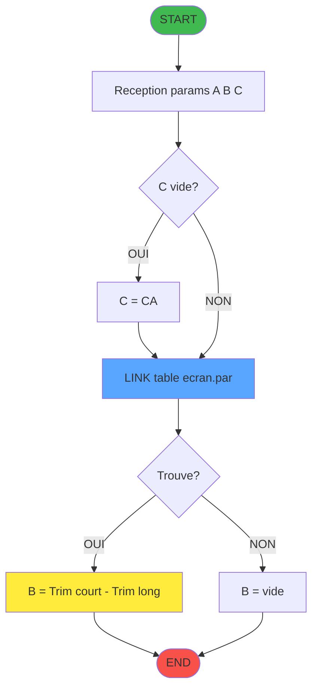
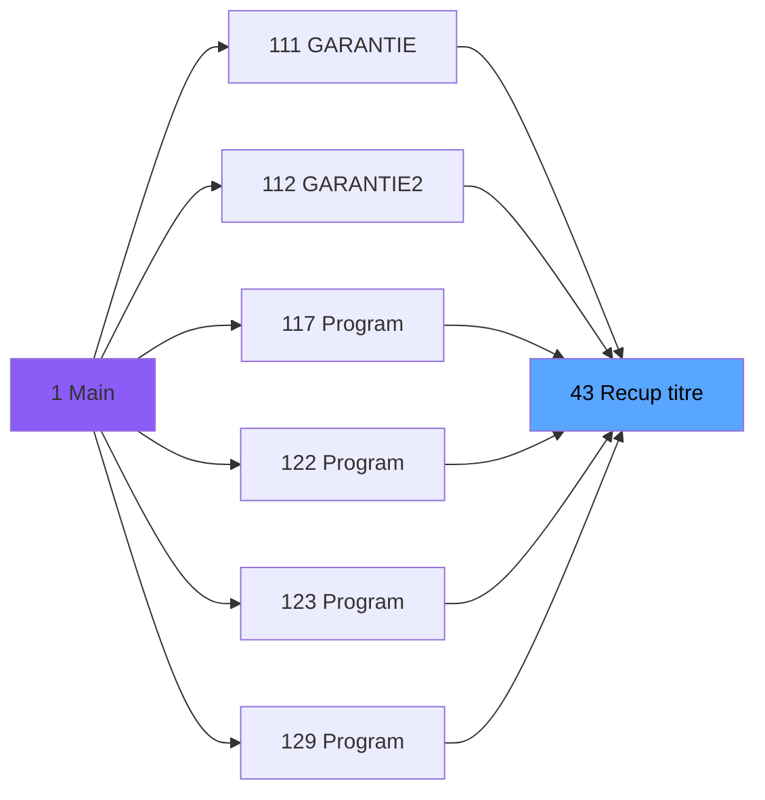
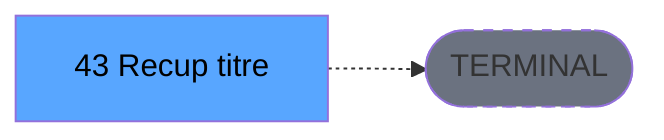

# ADH IDE 43 - Recuperation du titre

> **Version spec**: 4.1
> **Analyse**: 2026-02-07 04:45
> **Source**: `D:\Data\Migration\XPA\PMS\ADH\Source\Prg_43.xml`
> **Methode**: APEX + PDCA (Enrichi manuellement)

---

<!-- TAB:Fonctionnel -->

## SPECIFICATION FONCTIONNELLE

### 1.1 Objectif metier

**Recuperation du titre** est une **fonction utilitaire** qui **retourne le libelle correspondant a un code ecran**.

**Objectif metier** : Traduction code ecran -> libelle pour affichage utilisateur dans les interfaces.

| Element | Description |
|---------|-------------|
| **Qui** | Tout programme necessitant un libelle d'ecran |
| **Quoi** | Lookup dans table de reference ecran.par |
| **Pourquoi** | Centraliser la traduction code/libelle pour coherence UI |
| **Declencheur** | Appel depuis programme parent (CallTask) |
| **Resultat** | Titre concatene "Nom court - Nom long" retourne en parametre |

### 1.2 Regles metier

| Code | Regle | Condition |
|------|-------|-----------|
| RM-001 | Lookup sur table ecran.par | Cle = code ecran + type programme |
| RM-002 | Type programme par defaut "CA" | Si parametre type vide |
| RM-003 | Concatenation titre | Format "Trim(court) - Trim(long)" |
| RM-004 | Lecture seule | Aucune modification de donnees |

### 1.3 Flux utilisateur

1. Reception des parametres: code ecran (N), type programme (A)
2. Si type programme vide, utiliser "CA" par defaut
3. Lookup dans table ecran.par avec cle composee
4. Recuperation champs: nom court, nom long
5. Concatenation: "nom_court - nom_long"
6. Retour du titre dans parametre de sortie

### 1.4 Cas d'erreur

| Erreur | Comportement |
|--------|--------------|
| Code ecran inexistant | Retour chaine vide (pas d'erreur bloquante) |
| Table ecran.par inaccessible | Erreur systeme propagee |

---

<!-- TAB:Technique -->

## SPECIFICATION TECHNIQUE

### 2.1 Identification

| Attribut | Valeur |
|----------|--------|
| **IDE Position** | 43 |
| **Fichier XML** | `Prg_43.xml` |
| **Description** | Recuperation du titre |
| **Module** | ADH |
| **Public Name** | (non defini) |
| **Type** | Batch (B) - Fonction utilitaire |
| **Nombre taches** | 1 |
| **Lignes logique** | 14 (dont 1 Update en Task Suffix) |
| **Expressions** | 4 |

### 2.2 Tables

| # | Nom logique | Nom physique | Acces | Usage |
|---|-------------|--------------|-------|-------|
| 719 | ecran.par | PmsParam (REF) | READ + LINK | Table de reference des libelles d'ecran |

**Resume**: 1 table de reference accedee en **lecture seule** via LINK (lookup)

**Structure table ecran.par:**
- Cle: code_ecran + type_programme
- Champs: nom_court, nom_long (libelles multilingues)

### 2.3 Parametres (3 parametres)

| Var | Nom | Type | Direction | Picture | Description |
|-----|-----|------|-----------|---------|-------------|
| A | code ecran | Numerique | ENTREE (>) | 5 | Code numerique de l'ecran a traduire |
| B | nom ecran | Alpha | SORTIE (<) | 45 | Titre retourne "court - long" |
| C | type prog | Alpha | ENTREE (>) | 5 | Type programme (defaut: "CA") |

### 2.4 Algorigramme



### 2.5 Expressions cles

| # | Expression | Resultat | Usage |
|---|------------|----------|-------|
| 1 | `GetParam('CODELANGUE')` | Alpha | Code langue courante (non utilise directement) |
| 2 | `{0,1}` = Variable A | Numerique | Code ecran en entree |
| 3 | `IF({0,3}='','CA',{0,3})` | Alpha | Type programme avec defaut "CA" |
| 4 | `Trim({0,7})&' - '&Trim({0,8})` | Alpha | Concatenation titre court + long |

### 2.6 Variables importantes

| Var | Nom IDE | Type | Role |
|-----|---------|------|------|
| A | code ecran | N(5) | Parametre entree - code a chercher |
| B | nom ecran | A(45) | Parametre sortie - titre retourne |
| C | type prog | A(5) | Parametre entree - filtre type (CA, etc.) |
| D | (lien) code ecran | N(5) | Champ lu depuis ecran.par |
| E | (lien) nom court | A(45) | Champ lu depuis ecran.par |
| F | (lien) type prog | A(5) | Champ lu depuis ecran.par |
| G | (lien) nom long | A(?) | Champ lu depuis ecran.par |
| H | (lien) autre | A(?) | Champ lu depuis ecran.par |

### 2.7 Statistiques

| Metrique | Valeur |
|----------|--------|
| **Taches** | 1 |
| **Lignes logique** | 14 |
| **Expressions** | 4 |
| **Parametres** | 3 (1 sortie, 2 entree) |
| **Tables accedees** | 1 |
| **Tables en ecriture** | 0 |
| **Callees niveau 1** | 0 (terminal) |

---

<!-- TAB:Cartographie -->

## CARTOGRAPHIE APPLICATIVE

### 3.1 Chaine d'appels depuis Main



### 3.2 Callers directs

| IDE | Programme | Nb appels | Contexte |
|-----|-----------|-----------|----------|
| 111 | GARANTIE | 2 | Affichage libelle ecran |
| 112 | GARANTIE2 | 2 | Affichage libelle ecran |
| 117 | (voir XML) | 1 | Affichage libelle ecran |
| 122 | (voir XML) | 1 | Affichage libelle ecran |
| 123 | (voir XML) | 2 | Affichage libelle ecran |
| 129 | (voir XML) | 1+ | Affichage libelle ecran |

**Total: 6+ programmes appelants** - Fonction utilitaire largement reutilisee

### 3.3 Callees (3 niveaux)



| Niv | IDE | Programme | Nb appels | Status |
|-----|-----|-----------|-----------|--------|
| - | - | TERMINAL | - | Aucun sous-programme appele |

**Resume**: Programme terminal - ne fait que du lookup en base

### 3.4 Composants ECF utilises

| ECF | IDE | Public Name | Description |
|-----|-----|-------------|-------------|
| - | - | Aucun composant ECF | Programme autonome |

### 3.5 Verification orphelin

| Critere | Resultat |
|---------|----------|
| Callers actifs | **6+ programmes** (111, 112, 117, 122, 123, 129) |
| PublicName | Non defini |
| ECF partage | NON |
| **Conclusion** | **NON ORPHELIN** - Fonction utilitaire active |

---

## 5. REGLES METIER DETAILLEES

### 5.1 Regle de lookup (RM-001)

**Objectif**: Recuperer le libelle d'un ecran depuis la table de reference.

| Etape | Action | Detail |
|-------|--------|--------|
| 1 | Reception code ecran | Parametre A (numerique 5 chiffres) |
| 2 | Reception type programme | Parametre C (alpha 5 caracteres) |
| 3 | Lookup table ecran.par | Cle composee = (code, type) |
| 4 | Extraction libelles | Champs nom_court et nom_long |

**Cle de recherche**: `(code_ecran, type_programme)`

### 5.2 Regle de defaut (RM-002)

**Objectif**: Garantir un type programme valide pour le lookup.

```
SI type_programme EST VIDE
   ALORS type_programme = "CA"
   SINON garder valeur fournie
```

**Expression Magic**: `IF({0,3}='','CA',{0,3})`

**Valeur "CA"**: Probablement "Caisse" ou "Comptabilite Adherent" - type par defaut du module ADH.

### 5.3 Regle de concatenation (RM-003)

**Objectif**: Formater le titre pour affichage utilisateur.

```
titre_final = Trim(nom_court) + " - " + Trim(nom_long)
```

**Expression Magic**: `Trim({0,7})&' - '&Trim({0,8})`

**Exemples**:
| Code | Nom court | Nom long | Resultat |
|------|-----------|----------|----------|
| 100 | "FACTURE" | "Facture client adherent" | "FACTURE - Facture client adherent" |
| 200 | "EXTRAIT" | "Extrait de compte" | "EXTRAIT - Extrait de compte" |

### 5.4 Regle de lecture seule (RM-004)

**Objectif**: Garantir l'integrite des donnees de reference.

| Contrainte | Valeur |
|------------|--------|
| Mode acces table | READ |
| Mode partage | WRITE (permettre autres lecteurs) |
| Mode ouverture | NO (pas d'ouverture exclusive) |
| Cache | NO |

**Impact**: Aucun risque de modification accidentelle des libelles.

### 5.5 Gestion absence de donnees

**Cas**: Code ecran inexistant dans la table.

| Situation | Comportement |
|-----------|--------------|
| Lookup echec | LINK retourne champs vides |
| nom_court vide | Trim retourne "" |
| nom_long vide | Trim retourne "" |
| Resultat | " - " (chaine presque vide) |

**Recommandation migration**: Ajouter validation `IF(nom_court='','Code inconnu',...)` dans le code cible.

---

## NOTES MIGRATION

### Complexite

| Critere | Score | Detail |
|---------|-------|--------|
| Taches | 1 | Mono-tache simple |
| Tables | 1 | Lecture seule table reference |
| Callees | 0 | Programme terminal |
| Parametres | 3 | Interface claire |
| **Score global** | **TRES FAIBLE** | Candidat ideal pour migration rapide |

### Strategie migration recommandee

Cette fonction utilitaire est un excellent candidat pour une migration en tant que **service de lookup**:

```csharp
// C# - Service moderne equivalent
public interface IScreenLabelService
{
    string GetScreenTitle(int screenCode, string programType = "CA");
}

public class ScreenLabelService : IScreenLabelService
{
    private readonly IDbConnection _db;

    public string GetScreenTitle(int screenCode, string programType = "CA")
    {
        var result = _db.QueryFirstOrDefault<ScreenLabel>(
            "SELECT short_name, long_name FROM ecran_par WHERE code = @Code AND type = @Type",
            new { Code = screenCode, Type = programType });

        return result != null
            ? $"{result.ShortName?.Trim()} - {result.LongName?.Trim()}"
            : string.Empty;
    }
}
```

### Points d'attention migration

| Point Magic | Solution moderne |
|-------------|-----------------|
| LINK (lookup) | Dapper `QueryFirstOrDefault` ou EF `FirstOrDefault` |
| Expression `Trim()&' - '&Trim()` | String interpolation C# |
| Parametre defaut "CA" | Parametre optionnel C# |
| Table ecran.par | Table SQL Server existante |

### Dependances a migrer

| Dependance | Type | Action |
|------------|------|--------|
| Table ecran.par | Donnees | Verifier mapping SQL Server |
| 6+ programmes appelants | Code | Remplacer CallTask par appel service |

---

## HISTORIQUE

| Date | Action | Auteur |
|------|--------|--------|
| 2026-01-27 23:00 | V4.0 APEX/PDCA - Generation automatique | Script |
| 2026-02-07 04:45 | **V4.1** - Enrichissement metier complet | Claude |

**Modifications V4.1:**
- Correction fichier source (Prg_43.xml au lieu de Prg_39.xml)
- Ajout 3 parametres documentes (code, nom, type)
- Ajout section 5 "Regles Metier Detaillees"
- Correction statut orphelin (6+ callers identifies)
- Ajout expressions cles et variables
- Strategie migration C# proposee

---

*Specification V4.1 - Enrichie manuellement avec analyse metier*

