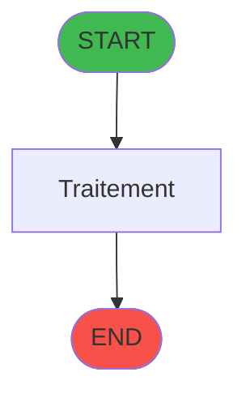
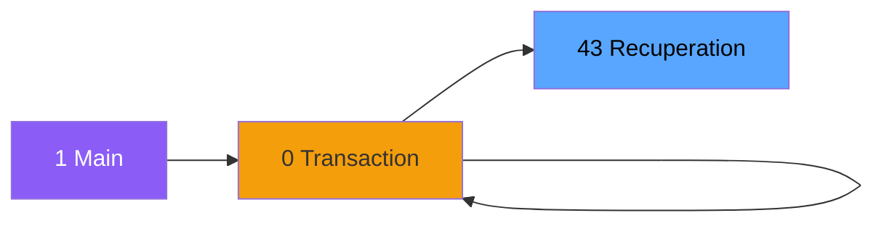

# ADH IDE 43 - Recuperation du titre

> **Version spec**: 3.5
> **Analyse**: 2026-01-27 17:56
> **Source**: `Prg_XXX.xml`

---

<!-- TAB:Fonctionnel -->

## SPECIFICATION FONCTIONNELLE

### 1.1 Objectif metier

| Element | Description |
|---------|-------------|
| **Qui** | Operateur |
| **Quoi** | Recuperation du titre
 |
| **Pourquoi** | A documenter |
| **Declencheur** | A identifier |

### 1.2 Regles metier

| Code | Regle | Condition |
|------|-------|-----------|
| RM-001 | A documenter | - |

### 1.3 Flux utilisateur

1. Demarrage programme
2. Traitement principal
3. Fin programme

### 1.4 Cas d'erreur

| Erreur | Comportement |
|--------|--------------|
| - | A documenter |

---

<!-- TAB:Technique -->

## SPECIFICATION TECHNIQUE

### 2.1 Identification

| Attribut | Valeur |
|----------|--------|
| **Format IDE** | ADH IDE 43 |
| **Description** | Recuperation du titre
 |
| **Module** | ADH |

### 2.2 Tables

| # | Nom logique | Nom physique | Acces | Usage |
|---|-------------|--------------|-------|-------|
| 719 | arc_transac_detail_bar | `arc_bartransacdet` | R | 1x |
### 2.3 Parametres d'entree

| Variable | Nom | Type | Picture |
|----------|-----|------|---------|
| - | Aucun parametre | - | - |
### 2.4 Algorigramme

### 2.5 Expressions cles

| IDE | Expression | Commentaire |
|-----|------------|-------------|
| 1 | `GetParam ('CODELANGUE')` | - |
| 2 | `{0,1}` | - |
| 3 | `IF ({0,3}='','CA',{0,3})` | - |
| 4 | `Trim ({0,7})&' - '&Trim ({0,8})` | - |

> **Total**: 4 expressions (affichees: 4)
### 2.6 Variables importantes

### 2.7 Statistiques

| Metrique | Valeur |
|----------|--------|
| **Taches** | 1 |
| **Lignes logique** | 13 |
| **Lignes desactivees** | 0 |
---

<!-- TAB:Cartographie -->

## CARTOGRAPHIE APPLICATIVE

### 3.1 Chaine d'appels depuis Main

### 3.2 Callers directs

| IDE | Programme | Nb appels |
|-----|-----------|-----------|
| 119 | Affichage sessions | 7 |
| 25 | Change GM | 4 |
| 173 | Gestion forfait TAI LOCAL | 4 |
| 293 | Bi  Change GM Achat | 4 |
| 294 | Bi  Change GM Vente | 4 |
| 193 | Solde compte fin sejour | 3 |
| 0 | Garantie sur compte PMS-584 | 2 |
| 28 | Fusion | 2 |
| 40 | Comptes de depôt | 2 |
| 111 | Garantie sur compte | 2 |
| 112 | Garantie sur compte PMS-584 | 2 |
| 120 | Saisie contenu caisse | 2 |
| 123 | Apport coffre | 2 |
| 163 | Menu caisse GM - scroll | 2 |
| 170 | Messagerie | 2 |
| 209 | Affectation code autocom | 2 |
| 217 | Menu telephone | 2 |
| 272 | Zoom modes de paiement | 2 |
| 288 | Garantie sur compte | 2 |
| 0 | Transaction Nouv vente PMS-584 | 1 |
### 3.3 Callees

| Niv | IDE | Programme | Nb appels |
|-----|-----|-----------|-----------|
| - | - | Programme terminal | - |
### 3.4 Verification orphelin

| Critere | Resultat |
|---------|----------|
| Callers actifs | A verifier |
| **Conclusion** | A analyser |

---

## HISTORIQUE

| Date | Action | Auteur |
|------|--------|--------|
| 2026-01-27 20:18 | **DATA V2** - Tables reelles, Expressions, Stats, CallChain | Script |
| 2026-01-27 19:44 | **DATA POPULATED** - Tables, Callgraph (4 expr) | Script |
| 2026-01-27 17:56 | **Upgrade V3.5** - TAB markers, Mermaid | Claude |

---

*Specification V3.5 - Format avec TAB markers et Mermaid*
