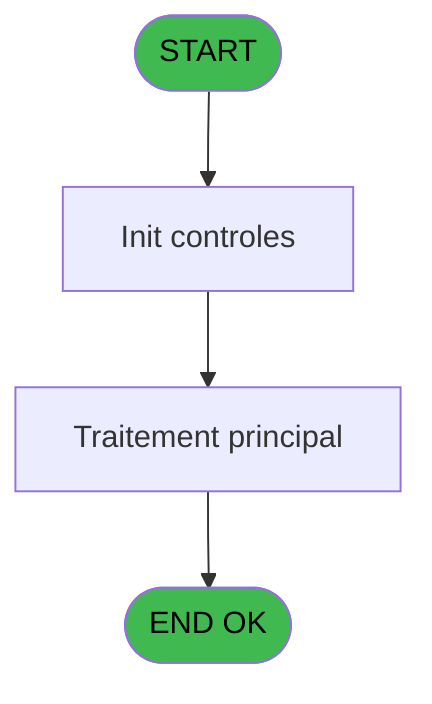
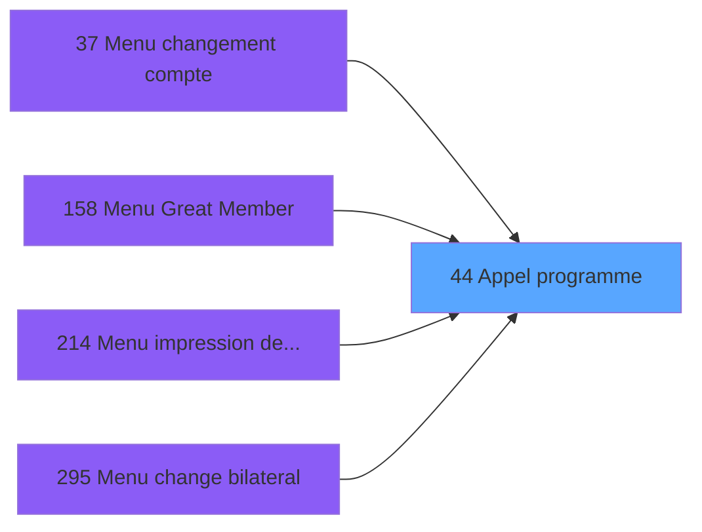
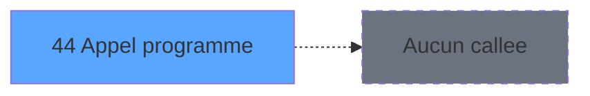

# ADH IDE 44 - Appel programme

> **Analyse**: Phases 1-4 2026-02-07 06:46 -> 06:47 (16s) | Assemblage 13:16
> **Pipeline**: V7.2 Enrichi
> **Structure**: 4 onglets (Resume | Ecrans | Donnees | Connexions)

<!-- TAB:Resume -->

## 1. FICHE D'IDENTITE

| Attribut | Valeur |
|----------|--------|
| Projet | ADH |
| IDE Position | 44 |
| Nom Programme | Appel programme |
| Fichier source | `Prg_44.xml` |
| Dossier IDE | General |
| Taches | 1 (0 ecrans visibles) |
| Tables modifiees | 0 |
| Programmes appeles | 0 |
| Complexite | **BASSE** (score 0/100) |

## 2. DESCRIPTION FONCTIONNELLE

ADH IDE 44 est un **programme utilitaire de routage** chargé de dispatcher les clics utilisateurs depuis les menus vers les programmes cibles appropriés. Bien qu'extrêmement simple (une seule tâche, une expression), il joue un rôle central en tant que point de passage pour quatre menus différents : changement de compte, Great Member, impression des appels, et changement bilatéral. Le programme ne contient aucune logique métier complexe — il se limite à récupérer le dernier élément cliqué via la fonction `LastClicked()` et en déduit la cible d'exécution.

Ce programme n'accède à aucune table et n'appelle aucun autre programme : c'est une **fonction terminale** purement technique. Son rôle est de décharger les menus d'une logique de routage répétitive en centralisant le mécanisme de dispatch. Cette approche évite la duplication de code dans les quatre menus appelants et garantit un traitement cohérent des commandes utilisateur.

Classé en **non-orphelin** malgré zéro appel externe, ADH IDE 44 est utilisé par d'autres programmes plutôt que d'en appeler. Sa qualité de code est excellente (zéro ligne désactivée, pas de code mort), et sa complexité minimale en fait un bon candidat pour des refactorisations futures si le besoin de dispatch devient plus sophistiqué.

## 3. BLOCS FONCTIONNELS

## 5. REGLES METIER

*(Aucune regle metier identifiee dans les expressions)*

## 6. CONTEXTE

- **Appele par**: [Menu changement compte (IDE 37)](ADH-IDE-37.md), [Menu Great Member (IDE 158)](ADH-IDE-158.md), [Menu impression des appels (IDE 214)](ADH-IDE-214.md), [Menu change bilateral (IDE 295)](ADH-IDE-295.md)
- **Appelle**: 0 programmes | **Tables**: 0 (W:0 R:0 L:0) | **Taches**: 1 | **Expressions**: 1

<!-- TAB:Ecrans -->

## 8. ECRANS

*(Programme sans ecran visible)*

## 9. NAVIGATION

### 9.3 Structure hierarchique (0 tache)

| Position | Tache | Type | Dimensions | Bloc |
|----------|-------|------|------------|------|

### 9.4 Algorigramme

> **Legende**: Vert = START/END OK | Rouge = END KO | Bleu = Decisions
> *Algorigramme auto-genere. Utiliser `/algorigramme` pour une synthese metier detaillee.*

<!-- TAB:Donnees -->

## 10. TABLES

### Tables utilisees (0)

| ID | Nom | Description | Type | R | W | L | Usages |
|----|-----|-------------|------|---|---|---|--------|

### Colonnes par table (0 / 0 tables avec colonnes identifiees)

## 11. VARIABLES

*(Programme sans variables locales mappees)*

## 12. EXPRESSIONS

**1 / 1 expressions decodees (100%)**

### 12.1 Repartition par type

| Type | Expressions | Regles |
|------|-------------|--------|
| OTHER | 1 | 0 |

### 12.2 Expressions cles par type

#### OTHER (1 expressions)

| Type | IDE | Expression | Regle |
|------|-----|------------|-------|
| OTHER | 1 | `LastClicked ()` | - |

<!-- TAB:Connexions -->

## 13. GRAPHE D'APPELS

### 13.1 Chaine depuis Main (Callers)

Main -> ... -> [Menu changement compte (IDE 37)](ADH-IDE-37.md) -> **Appel programme (IDE 44)**

Main -> ... -> [Menu Great Member (IDE 158)](ADH-IDE-158.md) -> **Appel programme (IDE 44)**

Main -> ... -> [Menu impression des appels (IDE 214)](ADH-IDE-214.md) -> **Appel programme (IDE 44)**

Main -> ... -> [Menu change bilateral (IDE 295)](ADH-IDE-295.md) -> **Appel programme (IDE 44)**

### 13.2 Callers

| IDE | Nom Programme | Nb Appels |
|-----|---------------|-----------|
| [37](ADH-IDE-37.md) | Menu changement compte | 1 |
| [158](ADH-IDE-158.md) | Menu Great Member | 1 |
| [214](ADH-IDE-214.md) | Menu impression des appels | 1 |
| [295](ADH-IDE-295.md) | Menu change bilateral | 1 |

### 13.3 Callees (programmes appeles)

### 13.4 Detail Callees avec contexte

| IDE | Nom Programme | Appels | Contexte |
|-----|---------------|--------|----------|
| - | (aucun) | - | - |

## 14. RECOMMANDATIONS MIGRATION

### 14.1 Profil du programme

| Metrique | Valeur | Impact migration |
|----------|--------|-----------------|
| Lignes de logique | 4 | Programme compact |
| Expressions | 1 | Peu de logique |
| Tables WRITE | 0 | Impact faible |
| Sous-programmes | 0 | Peu de dependances |
| Ecrans visibles | 0 | Ecran unique ou traitement batch |
| Code desactive | 0% (0 / 4) | Code sain |
| Regles metier | 0 | Pas de regle identifiee |

### 14.2 Plan de migration par bloc

### 14.3 Dependances critiques

| Dependance | Type | Appels | Impact |
|------------|------|--------|--------|

---
*Spec DETAILED generee par Pipeline V7.2 - 2026-02-07 13:18*
