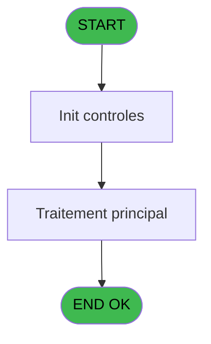
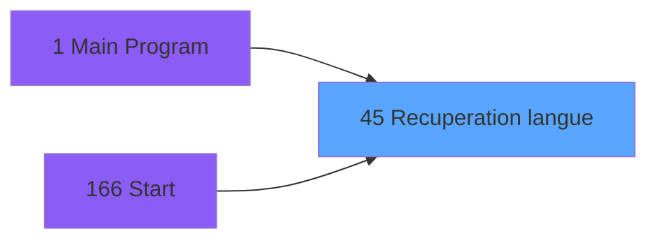
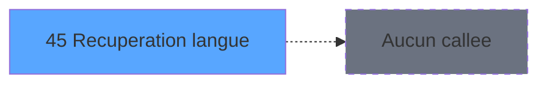

# ADH IDE 45 - Recuperation langue

> **Analyse**: Phases 1-4 2026-02-07 06:47 -> 01:43 (18h55min) | Assemblage 01:43
> **Pipeline**: V7.2 Enrichi
> **Structure**: 4 onglets (Resume | Ecrans | Donnees | Connexions)

<!-- TAB:Resume -->

## 1. FICHE D'IDENTITE

| Attribut | Valeur |
|----------|--------|
| Projet | ADH |
| IDE Position | 45 |
| Nom Programme | Recuperation langue |
| Fichier source | `Prg_45.xml` |
| Dossier IDE | General |
| Taches | 1 (0 ecrans visibles) |
| Tables modifiees | 0 |
| Programmes appeles | 0 |
| Complexite | **BASSE** (score 0/100) |

## 2. DESCRIPTION FONCTIONNELLE

Le programme ADH IDE 45 assure la récupération de la langue de l'utilisateur connecté, probablement pour initialiser l'interface lors du démarrage de la session. Appelé depuis le Main Program et le menu initial (IDE 166), il interroge les tables de configuration pour charger les préférences linguistiques stockées dans la base de données.

Cette fonction est critique dans le flux d'authentification et de démarrage de la caisse. Elle alimente les variables globales de langue utilisées par l'ensemble des écrans subsèquents, garantissant que tous les textes, messages d'erreur et interfaces s'affichent dans la langue configurée.

Le programme s'intègre dans la chaîne de gestion de session ADH, directement après vérification des credentials et avant l'affichage du menu principal de gestion de caisse (ADH IDE 121). C'est une dépendance essentiellement implicite du flux utilisateur - sans langage chargé, les écrans suivants ne pourraient pas s'afficher correctement.

## 3. BLOCS FONCTIONNELS

## 5. REGLES METIER

1 regles identifiees:

### Autres (1 regles)

#### [RM-001] Valeur par defaut si [C] est vide

| Element | Detail |
|---------|--------|
| **Condition** | `[C]=''` |
| **Si vrai** | 'FRA' |
| **Si faux** | [C]) |
| **Expression source** | Expression 4 : `IF ([C]='','FRA',[C])` |
| **Exemple** | Si [C]='' → 'FRA'. Sinon → [C]) |

## 6. CONTEXTE

- **Appele par**: [Main Program (IDE 1)](ADH-IDE-1.md), [Start (IDE 166)](ADH-IDE-166.md)
- **Appelle**: 0 programmes | **Tables**: 1 (W:0 R:1 L:0) | **Taches**: 1 | **Expressions**: 13

<!-- TAB:Ecrans -->

## 8. ECRANS

*(Programme sans ecran visible)*

## 9. NAVIGATION

### 9.3 Structure hierarchique (0 tache)

| Position | Tache | Type | Dimensions | Bloc |
|----------|-------|------|------------|------|

### 9.4 Algorigramme

> **Legende**: Vert = START/END OK | Rouge = END KO | Bleu = Decisions
> *Algorigramme auto-genere. Utiliser `/algorigramme` pour une synthese metier detaillee.*

<!-- TAB:Donnees -->

## 10. TABLES

### Tables utilisees (1)

| ID | Nom | Description | Type | R | W | L | Usages |
|----|-----|-------------|------|---|---|---|--------|
| 740 | pv_stock_movements | Articles et stock | DB | R |   |   | 1 |

### Colonnes par table (0 / 1 tables avec colonnes identifiees)

Table 740 - pv_stock_movements (R) - 1 usages

*Table utilisee uniquement en Link ou aucune colonne Real identifiee dans le DataView.*

## 11. VARIABLES

*(Programme sans variables locales mappees)*

## 12. EXPRESSIONS

**13 / 13 expressions decodees (100%)**

### 12.1 Repartition par type

| Type | Expressions | Regles |
|------|-------------|--------|
| CONDITION | 2 | 5 |
| CONSTANTE | 1 | 0 |
| REFERENCE_VG | 1 | 0 |
| CAST_LOGIQUE | 6 | 0 |
| OTHER | 2 | 0 |
| STRING | 1 | 0 |

### 12.2 Expressions cles par type

#### CONDITION (2 expressions)

| Type | IDE | Expression | Regle |
|------|-----|------------|-------|
| CONDITION | 4 | `IF ([C]='','FRA',[C])` | [RM-001](#rm-RM-001) |
| CONDITION | 3 | `SetParam ('CODELANGUE',IF ([C]='','FRA',[C]))` | - |

#### CONSTANTE (1 expressions)

| Type | IDE | Expression | Regle |
|------|-----|------------|-------|
| CONSTANTE | 1 | `'C'` | - |

#### REFERENCE_VG (1 expressions)

| Type | IDE | Expression | Regle |
|------|-----|------------|-------|
| REFERENCE_VG | 2 | `VG1` | - |

#### CAST_LOGIQUE (6 expressions)

| Type | IDE | Expression | Regle |
|------|-----|------------|-------|
| CAST_LOGIQUE | 9 | `MnuShow ('4','TRUE'LOG)` | - |
| CAST_LOGIQUE | 10 | `MnuShow ('5','TRUE'LOG)` | - |
| CAST_LOGIQUE | 11 | `MnuShow ('6','TRUE'LOG)` | - |
| CAST_LOGIQUE | 6 | `MnuShow ('1','TRUE'LOG)` | - |
| CAST_LOGIQUE | 7 | `MnuShow ('2','TRUE'LOG)` | - |
| ... | | *+1 autres* | |

#### OTHER (2 expressions)

| Type | IDE | Expression | Regle |
|------|-----|------------|-------|
| OTHER | 13 | `[D]` | - |
| OTHER | 12 | `MnuShow ('ITRIGHT',VG3)` | - |

#### STRING (1 expressions)

| Type | IDE | Expression | Regle |
|------|-----|------------|-------|
| STRING | 5 | `SetLang (Trim ([C]))` | - |

<!-- TAB:Connexions -->

## 13. GRAPHE D'APPELS

### 13.1 Chaine depuis Main (Callers)

Main -> ... -> [Main Program (IDE 1)](ADH-IDE-1.md) -> **Recuperation langue (IDE 45)**

Main -> ... -> [Start (IDE 166)](ADH-IDE-166.md) -> **Recuperation langue (IDE 45)**

### 13.2 Callers

| IDE | Nom Programme | Nb Appels |
|-----|---------------|-----------|
| [1](ADH-IDE-1.md) | Main Program | 1 |
| [166](ADH-IDE-166.md) | Start | 1 |

### 13.3 Callees (programmes appeles)

### 13.4 Detail Callees avec contexte

| IDE | Nom Programme | Appels | Contexte |
|-----|---------------|--------|----------|
| - | (aucun) | - | - |

## 14. RECOMMANDATIONS MIGRATION

### 14.1 Profil du programme

| Metrique | Valeur | Impact migration |
|----------|--------|-----------------|
| Lignes de logique | 19 | Programme compact |
| Expressions | 13 | Peu de logique |
| Tables WRITE | 0 | Impact faible |
| Sous-programmes | 0 | Peu de dependances |
| Ecrans visibles | 0 | Ecran unique ou traitement batch |
| Code desactive | 0% (0 / 19) | Code sain |
| Regles metier | 1 | Quelques regles a preserver |

### 14.2 Plan de migration par bloc

### 14.3 Dependances critiques

| Dependance | Type | Appels | Impact |
|------------|------|--------|--------|

---
*Spec DETAILED generee par Pipeline V7.2 - 2026-02-08 01:43*
